# 设计模式基础

本篇介绍软件设计模式的产生背景、概念与分类，UML 类图的表示方法（类的表示以及类与类之间的六种关系），以及面向对象软件设计的六大原则，是后续学习 23 种设计模式的地基。

## 1. 设计模式概述

### 1.1 软件设计模式的产生背景

"设计模式"最初并不是出现在软件设计中，而是被用于建筑领域的设计中。

1977 年，美国著名建筑大师、加利福尼亚大学伯克利分校环境结构中心主任克里斯托夫·亚历山大（Christopher Alexander）在他的著作《建筑模式语言：城镇、建筑、构造》中描述了一些常见的建筑设计问题，并提出了 253 种关于对城镇、邻里、住宅、花园和房间等进行设计的基本模式。

1990 年，软件工程界开始研讨设计模式的话题，后来召开了多次关于设计模式的研讨会。直到 1995 年，艾瑞克·伽马（Erich Gamma）、理查德·海尔姆（Richard Helm）、拉尔夫·约翰逊（Ralph Johnson）、约翰·威利斯迪斯（John Vlissides）等 4 位作者合作出版了《设计模式：可复用面向对象软件的基础》一书，在此书中收录了 23 个设计模式，这是设计模式领域的里程碑事件，导致了软件设计模式的突破。这 4 位作者在软件开发领域里也以他们的"四人组"（Gang of Four，GoF）著称。

### 1.2 软件设计模式的概念

**软件设计模式**（Software Design Pattern），又称设计模式，是一套被反复使用、多数人知晓的、经过分类编目的、代码设计经验的总结。它描述了在软件设计过程中一些不断重复发生的问题，以及该问题的解决方案。也就是说，它是解决特定问题的一系列"套路"，是前辈们代码设计经验的总结，具有一定的普遍性，可以反复使用。

### 1.3 学习设计模式的必要性

设计模式的本质是面向对象设计原则的实际运用，是对类的封装性、继承性和多态性以及类的关联关系和组合关系的充分理解。

正确使用设计模式具有以下优点：

- 可以提高程序员的思维能力、编程能力和设计能力；
- 使程序设计更加标准化、代码编制更加工程化，使软件开发效率大大提高，从而缩短软件的开发周期；
- 使设计的代码可重用性高、可读性强、可靠性高、灵活性好、可维护性强。

### 1.4 设计模式分类

| 类型 | 模式个数 | 包含的模式 | 核心关注点 |
| --- | --- | --- | --- |
| 创建型模式 | 5 种 | 单例、原型、工厂方法、抽象工厂、建造者 | 描述"怎样创建对象"，将对象的创建与使用分离 |
| 结构型模式 | 7 种 | 代理、适配器、桥接、装饰者、外观、享元、组合 | 描述如何将类或对象按某种布局组成更大的结构 |
| 行为型模式 | 11 种 | 模板方法、策略、命令、职责链、状态、观察者、中介者、迭代器、访问者、备忘录、解释器 | 描述类或对象之间怎样相互协作、怎样分配职责 |

## 2. UML 图

**统一建模语言**（Unified Modeling Language，UML）是用来设计软件的可视化建模语言。它的特点是简单、统一、图形化、能表达软件设计中的动态与静态信息。

UML 从目标系统的不同角度出发，定义了用例图、类图、对象图、状态图、活动图、时序图、协作图、构件图、部署图等 9 种图。

### 2.1 类图概述

类图（Class Diagram）显示了模型的静态结构，特别是模型中存在的类、类的内部结构以及它们与其他类的关系等。类图不显示暂时性的信息，是面向对象建模的主要组成部分。

### 2.2 类图的作用

- 在软件工程中，类图是一种静态的结构图，描述了系统的类的集合、类的属性和类之间的关系，可以简化人们对系统的理解；
- 类图是系统分析和设计阶段的重要产物，是系统编码和测试的重要模型。

### 2.3 类图表示法

#### 2.3.1 类的表示方式

在 UML 类图中，类使用包含类名、属性（field）和方法（method）且带有分割线的矩形来表示。比如下图表示一个 Employee 类，它包含 name、age 和 address 这 3 个属性，以及 work() 方法。

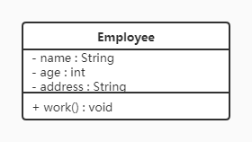

属性/方法名称前加的加号和减号表示了这个属性/方法的可见性，UML 类图中表示可见性的符号有三种：

| 符号 | 可见性 |
| --- | --- |
| `+` | public |
| `-` | private |
| `#` | protected |

属性的完整表示方式是：**可见性 名称 : 类型 [= 缺省值]**。

方法的完整表示方式是：**可见性 名称(参数列表) [: 返回类型]**。

> [!NOTE]
> 中括号中的内容表示是可选的；也有将类型放在变量名前面、返回值类型放在方法名前面的写法。

举例：

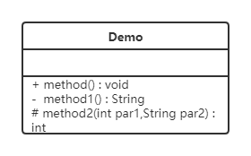

上图 Demo 类定义了三个方法：

- `method()` 方法：修饰符为 public，没有参数，没有返回值；
- `method1()` 方法：修饰符为 private，没有参数，返回值类型为 String；
- `method2()` 方法：修饰符为 protected，接收两个参数，第一个参数类型为 int，第二个参数类型为 String，返回值类型是 int。

#### 2.3.2 类与类之间关系的表示方式

##### 2.3.2.1 关联关系

**关联关系**是对象之间的一种引用关系，用于表示一类对象与另一类对象之间的联系，如老师和学生、师傅和徒弟、丈夫和妻子等。关联关系是类与类之间最常用的一种关系，分为一般关联关系、聚合关系和组合关系，这里先介绍一般关联。

关联又可以分为单向关联、双向关联、自关联。

**单向关联**


在 UML 类图中，单向关联用一个带箭头的实线表示。上图表示每个顾客都有一个地址，这通过让 Customer 类持有一个类型为 Address 的成员变量来实现。

**双向关联**

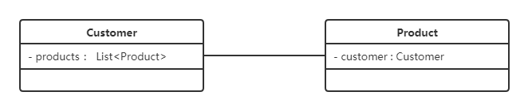

从上图中我们很容易看出，所谓的双向关联就是双方各自持有对方类型的成员变量。

在 UML 类图中，双向关联用一个不带箭头的直线表示。上图中在 Customer 类中维护一个 `List<Product>`，表示一个顾客可以购买多个商品；在 Product 类中维护一个 Customer 类型的成员变量，表示这个产品被哪个顾客所购买。

**自关联**

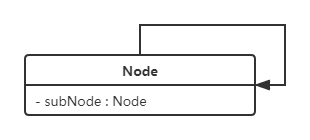

自关联在 UML 类图中用一个带有箭头且指向自身的线表示。上图的意思就是 Node 类包含类型为 Node 的成员变量，也就是"自己包含自己"（比如链表节点）。

##### 2.3.2.2 聚合关系

**聚合关系**是关联关系的一种，是强关联关系，是整体和部分之间的关系。

聚合关系也是通过成员对象来实现的，其中成员对象是整体对象的一部分，但是成员对象可以脱离整体对象而独立存在。例如，学校与老师的关系，学校包含老师，但如果学校停办了，老师依然存在。

在 UML 类图中，聚合关系可以用带空心菱形的实线来表示，菱形指向整体。下图所示是大学和教师的关系图：

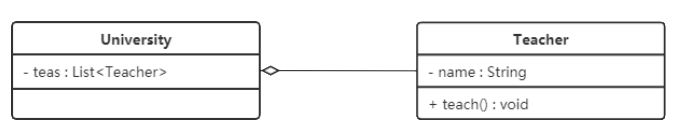

##### 2.3.2.3 组合关系

**组合关系**表示类之间的整体与部分的关系，但它是一种比聚合更强烈的关联关系。

在组合关系中，整体对象可以控制部分对象的生命周期，一旦整体对象不存在，部分对象也将不存在，部分对象不能脱离整体对象而存在。例如，头和嘴的关系，没有了头，嘴也就不存在了。

在 UML 类图中，组合关系用带实心菱形的实线来表示，菱形指向整体。下图所示是头和嘴的关系图：


##### 2.3.2.4 依赖关系

**依赖关系**是一种使用关系，它是对象之间耦合度最弱的一种关联方式，是临时性的关联。在代码中，某个类的方法通过局部变量、方法的参数或者对静态方法的调用来访问另一个类（被依赖类）中的某些方法来完成一些职责。

在 UML 类图中，依赖关系使用带箭头的虚线来表示，箭头从使用类指向被依赖的类。下图所示是司机和汽车的关系图，司机驾驶汽车：

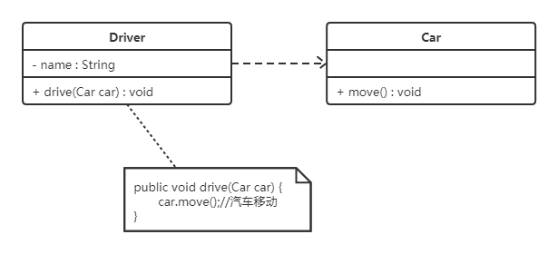

##### 2.3.2.5 继承关系

**继承关系**（泛化关系）是对象之间耦合度最大的一种关系，表示一般与特殊的关系，是父类与子类之间的关系。

在 UML 类图中，继承关系用带空心三角箭头的实线来表示，箭头从子类指向父类。在代码实现时，使用面向对象的继承机制来实现。例如，Student 类和 Teacher 类都是 Person 类的子类，其类图如下图所示：

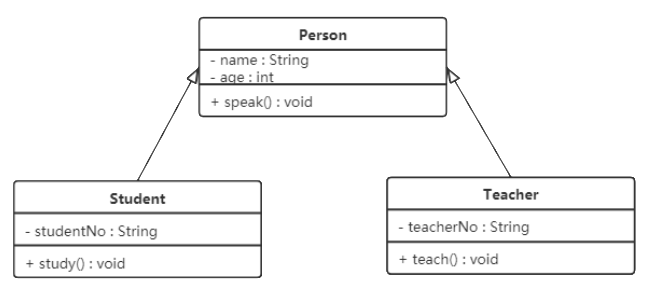

##### 2.3.2.6 实现关系

**实现关系**是接口与实现类之间的关系。在这种关系中，类实现了接口，类中的操作实现了接口中所声明的所有抽象操作。

在 UML 类图中，实现关系使用带空心三角箭头的虚线来表示，箭头从实现类指向接口。例如，汽车和船实现了交通工具，其类图如下图所示：

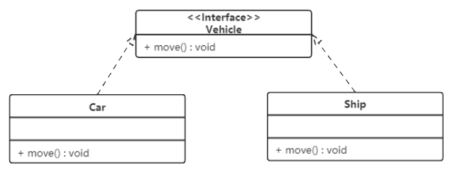

## 3. 软件设计原则

在软件开发中，为了提高软件系统的可维护性和可复用性，增加软件的可扩展性和灵活性，程序员要尽量根据 6 条原则来开发程序，从而提高软件开发效率、节约软件开发成本和维护成本。

| 原则 | 一句话概括 |
| --- | --- |
| 开闭原则 | 对扩展开放，对修改关闭 |
| 里氏代换原则 | 任何基类可以出现的地方，子类一定可以出现 |
| 依赖倒转原则 | 面向抽象编程，不对实现编程 |
| 接口隔离原则 | 依赖最小的接口，不被迫依赖用不到的方法 |
| 迪米特法则 | 只和直接朋友交谈，不跟"陌生人"说话 |
| 合成复用原则 | 优先使用组合/聚合，其次才考虑继承 |

### 3.1 开闭原则

**对扩展开放，对修改关闭**。在程序需要进行拓展的时候，不能去修改原有的代码，实现一个热插拔的效果。简言之，是为了使程序的扩展性好，易于维护和升级。

想要达到这样的效果，我们需要使用接口和抽象类。因为抽象灵活性好、适应性广，只要抽象得合理，就可以基本保持软件架构的稳定。而软件中易变的细节可以从抽象派生出的实现类来进行扩展，当软件需要发生变化时，只需要根据需求重新派生一个实现类来扩展就可以了。

**例：搜狗输入法的皮肤设计**

分析：搜狗输入法的皮肤是输入法背景图片、窗口颜色和声音等元素的组合。用户可以根据自己的喜好更换输入法的皮肤，也可以从网上下载新的皮肤。这些皮肤有共同的特点，可以为其定义一个抽象类 `AbstractSkin`，而每个具体的皮肤（`DefaultSpecificSkin` 和 `HeimaSpecificSkin`）是其子类。用户窗体可以根据需要选择或者增加新的主题，而不需要修改原代码，所以它是满足开闭原则的。

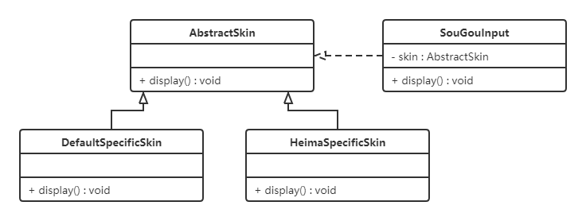

### 3.2 里氏代换原则

里氏代换原则是面向对象设计的基本原则之一。

**定义**：任何基类可以出现的地方，子类一定可以出现。通俗理解：子类可以扩展父类的功能，但不能改变父类原有的功能。换句话说，子类继承父类时，除添加新的方法完成新增功能外，尽量不要重写父类的方法。

如果通过重写父类的方法来完成新的功能，这样写起来虽然简单，但是整个继承体系的可复用性会比较差，特别是运用多态比较频繁时，程序运行出错的概率会非常大。

**例：正方形不是长方形**

在数学领域里，正方形毫无疑问是长方形，它是一个长宽相等的长方形。所以，我们开发的一个与几何图形相关的软件系统，就可以顺理成章地让正方形继承自长方形。

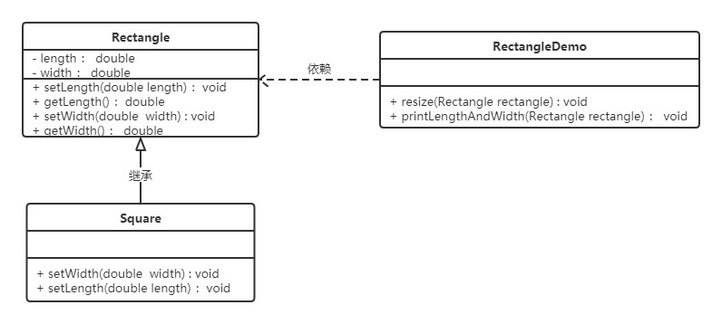

代码如下。

长方形类（Rectangle）：

```java
public class Rectangle {
    private double length;
    private double width;

    public double getLength() {
        return length;
    }

    public void setLength(double length) {
        this.length = length;
    }

    public double getWidth() {
        return width;
    }

    public void setWidth(double width) {
        this.width = width;
    }
}
```

正方形类（Square）：由于正方形的长和宽相同，所以在方法 `setLength` 和 `setWidth` 中，对长度和宽度都需要赋相同值。

```java
public class Square extends Rectangle {

    @Override
    public void setWidth(double width) {
        super.setLength(width);
        super.setWidth(width);
    }

    @Override
    public void setLength(double length) {
        super.setLength(length);
        super.setWidth(length);
    }
}
```

`RectangleDemo` 是我们软件系统中的一个组件，它有一个 `resize` 方法依赖基类 Rectangle，用来实现宽度逐渐增长的效果。

```java
public class RectangleDemo {

    public static void resize(Rectangle rectangle) {
        while (rectangle.getWidth() <= rectangle.getLength()) {
            rectangle.setWidth(rectangle.getWidth() + 1);
        }
    }

    // 打印长方形的长和宽
    public static void printLengthAndWidth(Rectangle rectangle) {
        System.out.println(rectangle.getLength());
        System.out.println(rectangle.getWidth());
    }

    public static void main(String[] args) {
        Rectangle rectangle = new Rectangle();
        rectangle.setLength(20);
        rectangle.setWidth(10);
        resize(rectangle);
        printLengthAndWidth(rectangle);

        System.out.println("============");

        Rectangle rectangle1 = new Square();
        rectangle1.setLength(10);
        resize(rectangle1);
        printLengthAndWidth(rectangle1);
    }
}
```

我们运行一下这段代码就会发现：假如把一个普通长方形作为参数传入 `resize` 方法，就会看到长方形宽度逐渐增长的效果，当宽度大于长度时循环停止，这种行为的结果符合我们的预期；假如再把一个正方形作为参数传入 `resize` 方法，由于正方形每次 `setWidth` 都会同连带修改 `length`，就会看到正方形的宽度和长度都在不断增长，代码会一直运行下去，直至系统产生溢出错误。所以，普通的长方形适合这段代码，正方形不适合。

我们得出结论：在 `resize` 方法中，Rectangle 类型的参数是不能被 Square 类型的参数所替代的，如果进行了替换就得不到预期结果。因此，Square 类和 Rectangle 类之间的继承关系违反了里氏代换原则，它们之间的继承关系不成立——正方形不是长方形。

如何改进呢？此时我们需要重新设计它们之间的关系：抽象出一个四边形接口（Quadrilateral），让 Rectangle 类和 Square 类实现 Quadrilateral 接口。

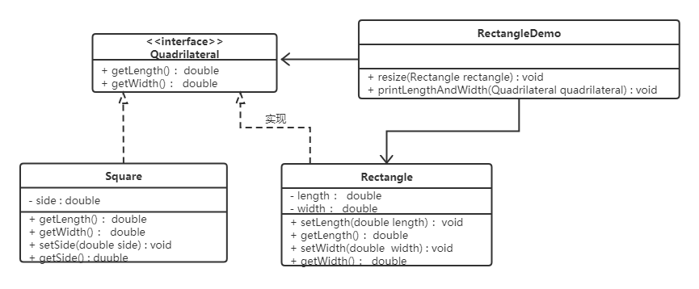

### 3.3 依赖倒转原则

**高层模块不应该依赖低层模块，两者都应该依赖其抽象；抽象不应该依赖细节，细节应该依赖抽象。** 简单地说，就是要求对抽象进行编程，不要对实现进行编程，这样就降低了客户与实现模块间的耦合。

**例：组装电脑**

现要组装一台电脑，需要配件 CPU、硬盘、内存条。只有这些配置都有了，计算机才能正常运行。CPU 有很多选择，如 Intel、AMD 等；硬盘可以选择希捷、西数等；内存条可以选择金士顿、海盗船等。

先看一个违背依赖倒转原则的设计，类图如下：

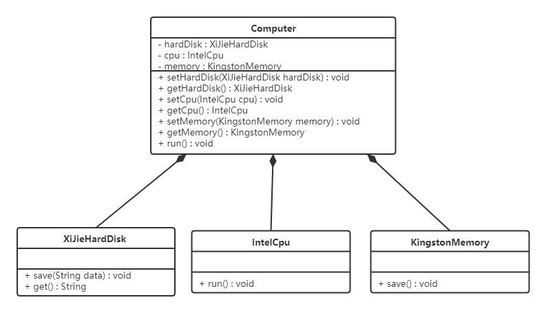

代码如下。

希捷硬盘类（XiJieHardDisk）：

```java
public class XiJieHardDisk implements HardDisk {

    public void save(String data) {
        System.out.println("使用希捷硬盘存储数据" + data);
    }

    public String get() {
        System.out.println("使用希捷硬盘取数据");
        return "数据";
    }
}
```

Intel 处理器类（IntelCpu）：

```java
public class IntelCpu implements Cpu {

    public void run() {
        System.out.println("使用Intel处理器");
    }
}
```

金士顿内存条类（KingstonMemory）：

```java
public class KingstonMemory implements Memory {

    public void save() {
        System.out.println("使用金士顿作为内存条");
    }
}
```

电脑类（Computer）：注意这里依赖的都是具体的实现类。

```java
public class Computer {

    private XiJieHardDisk hardDisk;
    private IntelCpu cpu;
    private KingstonMemory memory;

    public IntelCpu getCpu() {
        return cpu;
    }

    public void setCpu(IntelCpu cpu) {
        this.cpu = cpu;
    }

    public KingstonMemory getMemory() {
        return memory;
    }

    public void setMemory(KingstonMemory memory) {
        this.memory = memory;
    }

    public XiJieHardDisk getHardDisk() {
        return hardDisk;
    }

    public void setHardDisk(XiJieHardDisk hardDisk) {
        this.hardDisk = hardDisk;
    }

    public void run() {
        System.out.println("计算机工作");
        cpu.run();
        memory.save();
        String data = hardDisk.get();
        System.out.println("从硬盘中获取的数据为：" + data);
    }
}
```

测试类（TestComputer），用来组装电脑：

```java
public class TestComputer {
    public static void main(String[] args) {
        Computer computer = new Computer();
        computer.setHardDisk(new XiJieHardDisk());
        computer.setCpu(new IntelCpu());
        computer.setMemory(new KingstonMemory());

        computer.run();
    }
}
```

从上面代码可以看到已经组装了一台电脑，但是似乎组装的电脑的 CPU 只能是 Intel 的，内存条只能是金士顿的，硬盘只能是希捷的，这对用户肯定是不友好的——用户有了机箱，肯定是想按照自己的喜好选择喜欢的配件。

根据依赖倒转原则进行改进：我们只需要修改 Computer 类，让 Computer 类依赖抽象（各个配件的接口），而不是依赖各个配件具体的实现类。三个配件类本身不用改（它们本来就实现了各自的接口）。

改进后的类图如下：

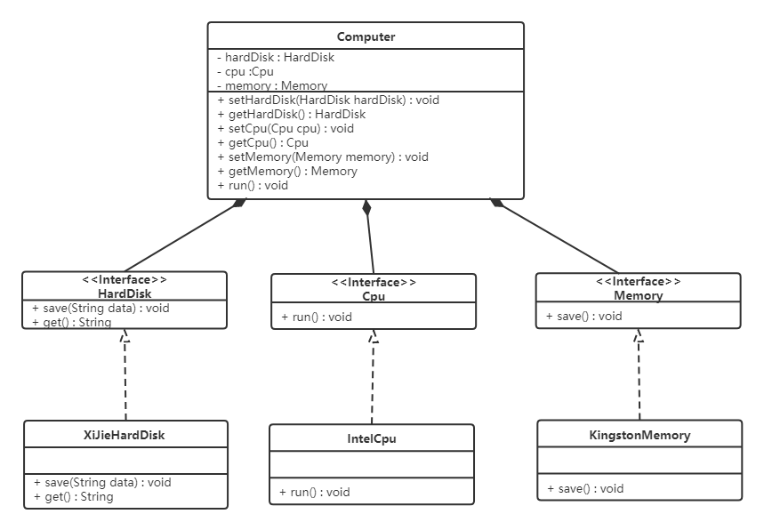

其中三个配件接口定义如下：

```java
public interface HardDisk {
    void save(String data);
    String get();
}

public interface Cpu {
    void run();
}

public interface Memory {
    void save();
}
```

改进后的电脑类（Computer）：

```java
public class Computer {

    private HardDisk hardDisk;
    private Cpu cpu;
    private Memory memory;

    public HardDisk getHardDisk() {
        return hardDisk;
    }

    public void setHardDisk(HardDisk hardDisk) {
        this.hardDisk = hardDisk;
    }

    public Cpu getCpu() {
        return cpu;
    }

    public void setCpu(Cpu cpu) {
        this.cpu = cpu;
    }

    public Memory getMemory() {
        return memory;
    }

    public void setMemory(Memory memory) {
        this.memory = memory;
    }

    public void run() {
        System.out.println("计算机工作");
        cpu.run();
        memory.save();
        String data = hardDisk.get();
        System.out.println("从硬盘中获取的数据为：" + data);
    }
}
```

这时，用户想换 AMD 的 CPU、西数的硬盘，只需要提供对应接口的实现类再注入即可，Computer 类的代码一行都不用改。面向对象的开发很好地解决了这个问题：一般情况下抽象的变化概率很小，让用户程序依赖于抽象，实现的细节也依赖于抽象，即使实现细节不断变动，只要抽象不变，客户程序就不需要变化。这大大降低了客户程序与实现细节的耦合度。

### 3.4 接口隔离原则

**客户端不应该被迫依赖于它不使用的方法；一个类对另一个类的依赖应该建立在最小的接口上。**

**例：安全门案例**

我们需要创建一个"黑马"品牌的安全门，该安全门具有防火、防水、防盗的功能。一种直接的想法是将防火、防水、防盗功能提取成一个接口，形成一套规范，类图如下：

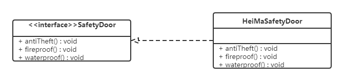

上面的设计存在问题：黑马品牌的安全门具有防盗、防水、防火的功能。现在如果我们还需要再创建一个"传智"品牌的安全门，而该安全门只具有防盗、防水功能，很显然如果实现 SafetyDoor 接口就必须连带实现用不到的防火方法，这就违背了接口隔离原则。修改方式是把大接口拆成多个小接口，类图如下：

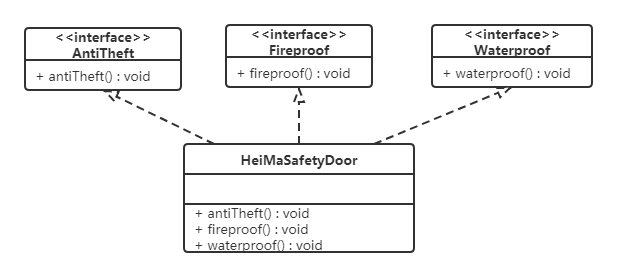

代码如下。

AntiTheft（防盗接口）：

```java
public interface AntiTheft {
    void antiTheft();
}
```

Fireproof（防火接口）：

```java
public interface Fireproof {
    void fireproof();
}
```

Waterproof（防水接口）：

```java
public interface Waterproof {
    void waterproof();
}
```

HeiMaSafetyDoor（黑马安全门类）：

```java
public class HeiMaSafetyDoor implements AntiTheft, Fireproof, Waterproof {
    public void antiTheft() {
        System.out.println("防盗");
    }

    public void fireproof() {
        System.out.println("防火");
    }

    public void waterproof() {
        System.out.println("防水");
    }
}
```

ItcastSafetyDoor（传智安全门类）：

```java
public class ItcastSafetyDoor implements AntiTheft, Fireproof {
    public void antiTheft() {
        System.out.println("防盗");
    }

    public void fireproof() {
        System.out.println("防火");
    }
}
```

### 3.5 迪米特法则

迪米特法则又叫**最少知识原则**：只和你的直接朋友交谈，不跟"陌生人"说话（Talk only to your immediate friends and not to strangers）。

其含义是：如果两个软件实体无须直接通信，那么就不应当发生直接的相互调用，可以通过第三方转发该调用。其目的是降低类之间的耦合度，提高模块的相对独立性。

迪米特法则中的"朋友"是指：当前对象本身、当前对象的成员对象、当前对象所创建的对象、当前对象的方法参数等，这些对象同当前对象存在关联、聚合或组合关系，可以直接访问这些对象的方法。

**例：明星与经纪人的关系实例**

明星由于全身心投入艺术，所以许多日常事务由经纪人负责处理，如和粉丝的见面会、和媒体公司的业务洽谈等。这里的经纪人是明星的朋友，而粉丝和媒体公司是陌生人，所以适合使用迪米特法则。

类图如下：

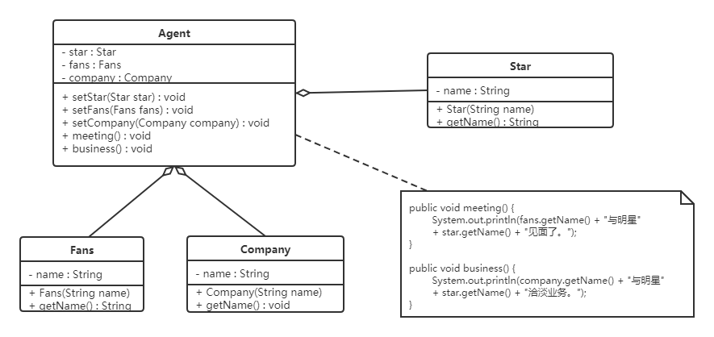

代码如下。

明星类（Star）：

```java
public class Star {
    private String name;

    public Star(String name) {
        this.name = name;
    }

    public String getName() {
        return name;
    }
}
```

粉丝类（Fans）：

```java
public class Fans {
    private String name;

    public Fans(String name) {
        this.name = name;
    }

    public String getName() {
        return name;
    }
}
```

媒体公司类（Company）：

```java
public class Company {
    private String name;

    public Company(String name) {
        this.name = name;
    }

    public String getName() {
        return name;
    }
}
```

经纪人类（Agent）：粉丝和媒体公司只与经纪人打交道，不直接与明星交互。

```java
public class Agent {
    private Star star;
    private Fans fans;
    private Company company;

    public void setStar(Star star) {
        this.star = star;
    }

    public void setFans(Fans fans) {
        this.fans = fans;
    }

    public void setCompany(Company company) {
        this.company = company;
    }

    public void meeting() {
        System.out.println(fans.getName() + "与明星" + star.getName() + "见面了。");
    }

    public void business() {
        System.out.println(company.getName() + "与明星" + star.getName() + "洽谈业务。");
    }
}
```

### 3.6 合成复用原则

**合成复用原则**是指：尽量先使用组合或者聚合等关联关系来实现，其次才考虑使用继承关系来实现。

通常类的复用分为继承复用和合成复用两种。

继承复用虽然有简单和易实现的优点，但它也存在以下缺点：

1. 继承复用破坏了类的封装性。因为继承会将父类的实现细节暴露给子类，父类对子类是透明的，所以这种复用又称为"白箱"复用；
2. 子类与父类的耦合度高。父类实现的任何改变都会导致子类的实现发生变化，这不利于类的扩展与维护；
3. 它限制了复用的灵活性。从父类继承而来的实现是静态的，在编译时已经定义，所以在运行时不可能发生变化。

采用组合或聚合复用时，可以将已有对象纳入新对象中，使之成为新对象的一部分，新对象可以调用已有对象的功能，它有以下优点：

1. 它维持了类的封装性。因为成分对象的内部细节是新对象看不见的，所以这种复用又称为"黑箱"复用；
2. 对象间的耦合度低。可以在类的成员位置声明抽象类型；
3. 复用的灵活性高。这种复用可以在运行时动态进行，新对象可以动态地引用与成分对象类型相同的对象。

**例：汽车分类管理程序**

汽车按"动力源"划分可分为汽油汽车、电动汽车等；按"颜色"划分可分为白色汽车、黑色汽车和红色汽车等。如果同时考虑这两种分类，其组合就很多。使用继承复用的类图如下：

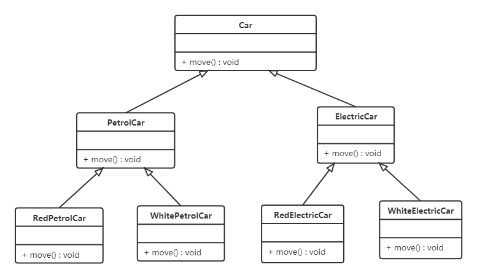

从上面类图我们可以看到使用继承复用产生了很多子类，如果现在又有新的动力源或者新的颜色的话，就需要再定义更多的类。我们试着将继承复用改为聚合复用：

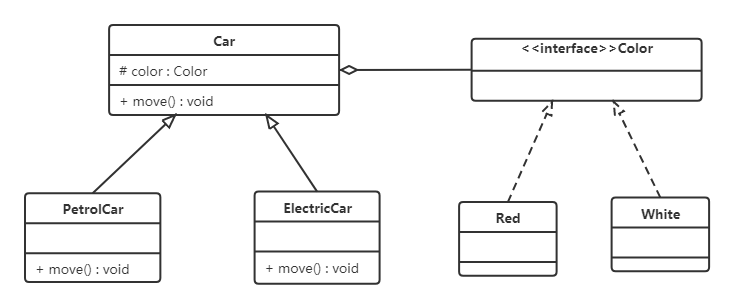

改进后，Car 持有一个抽象 Color 类型的成员变量，新增颜色只需提供 Color 的新实现，无需再为每种组合定义新类，类的数量从"乘积"级别降到了"相加"级别。

## 4. 小结

- 设计模式源于建筑领域，由 GoF 的《设计模式：可复用面向对象软件的基础》确立了 23 种经典模式，分为创建型（5 种）、结构型（7 种）、行为型（11 型）三类；
- UML 类图是设计模式的"通用语言"，要牢记六种类关系的画法：依赖（虚线箭头）、关联（实线箭头）、聚合（空心菱形）、组合（实心菱形）、继承（空心三角实线）、实现（空心三角虚线），耦合度依次从弱到强（实现/继承最强）；
- 六大设计原则是所有模式背后的"为什么"：开闭原则是总纲，里氏代换、依赖倒转、接口隔离、迪米特法则分别约束继承、依赖、接口、交互，合成复用原则则告诉我们优先组合而非继承。后续每个设计模式的学习，都要回过头来看它体现了哪些原则。
