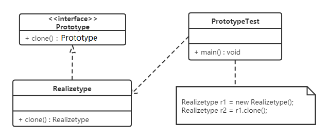
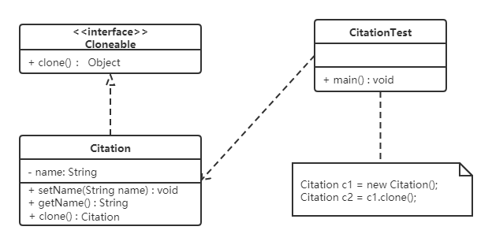
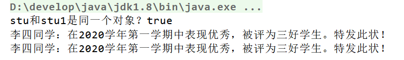
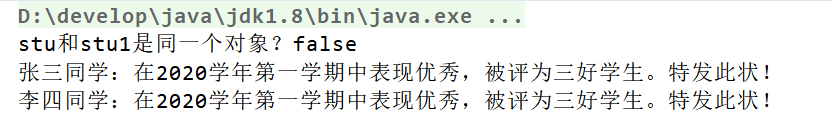

# 原型模式

## 1. 概述

**定义**：用一个已经创建的实例作为原型，通过复制该原型对象来创建一个和原型对象相同的新对象。

通俗地说：当创建新对象的成本很高（比如需要查询数据库、做大量初始化计算），或者新对象与某个已有对象绝大部分状态相同时，"复制一个现成的再改一改"往往比"从零 new 一个"更划算。

## 2. 结构

原型模式包含如下角色：

| 角色 | 职责 |
| --- | --- |
| 抽象原型类 | 规定了具体原型对象必须实现的 `clone()` 方法 |
| 具体原型类 | 实现抽象原型类的 `clone()` 方法，它是可被复制的对象 |
| 访问类 | 使用具体原型类中的 `clone()` 方法来复制新的对象 |

类图如下：



## 3. 实现

原型模式的克隆分为浅克隆和深克隆：

- **浅克隆**：创建一个新对象，新对象的属性和原来对象完全相同；对于非基本类型属性，仍指向原有属性所指向的对象的内存地址；
- **深克隆**：创建一个新对象，属性中引用的其他对象也会被克隆，不再指向原有对象地址。

Java 的 Object 类中提供了 `clone()` 方法来实现浅克隆。Cloneable 接口就是上面类图中的抽象原型类，而实现了 Cloneable 接口的子实现类就是具体的原型类。代码如下。

Realizetype（具体的原型类）：

```java
public class Realizetype implements Cloneable {

    public Realizetype() {
        System.out.println("具体的原型对象创建完成！");
    }

    @Override
    protected Realizetype clone() throws CloneNotSupportedException {
        System.out.println("具体原型复制成功！");
        return (Realizetype) super.clone();
    }
}
```

PrototypeTest（测试访问类）：

```java
public class PrototypeTest {
    public static void main(String[] args) throws CloneNotSupportedException {
        Realizetype r1 = new Realizetype();
        Realizetype r2 = r1.clone();

        System.out.println("对象r1和r2是同一个对象？" + (r1 == r2));
    }
}
```

运行输出：

```text
具体的原型对象创建完成！
具体原型复制成功！
对象r1和r2是同一个对象？false
```

> [!NOTE]
> `r1 == r2` 为 `false` 说明 clone 产生的是一个新的对象；而原型类的构造方法只执行了一次，说明复制过程并没有走构造方法，这正是原型模式"绕过构造、直接复制"的特点。

## 4. 案例

**用原型模式生成"三好学生"奖状**

同一学校的"三好学生"奖状除了获奖人姓名不同，其他都相同。可以使用原型模式复制多个"三好学生"奖状出来，然后再修改奖状上的名字即可。

类图如下：



代码如下：

```java
// 奖状类
public class Citation implements Cloneable {
    private String name;

    public void setName(String name) {
        this.name = name;
    }

    public String getName() {
        return this.name;
    }

    public void show() {
        System.out.println(name + "同学：在2020学年第一学期中表现优秀，被评为三好学生。特发此状！");
    }

    @Override
    public Citation clone() throws CloneNotSupportedException {
        return (Citation) super.clone();
    }
}

// 测试访问类
public class CitationTest {
    public static void main(String[] args) throws CloneNotSupportedException {
        Citation c1 = new Citation();
        c1.setName("张三");

        // 复制奖状
        Citation c2 = c1.clone();
        // 将奖状的名字修改为李四
        c2.setName("李四");

        c1.show();
        c2.show();
    }
}
```

运行输出：

```text
张三同学：在2020学年第一学期中表现优秀，被评为三好学生。特发此状！
李四同学：在2020学年第一学期中表现优秀，被评为三好学生。特发此状！
```

## 5. 使用场景

- 对象的创建非常复杂，可以使用原型模式快捷地创建对象；
- 性能和安全要求比较高。

## 6. 扩展（深克隆）

将上面的"三好学生"奖状案例中 Citation 类的 name 属性修改为 Student 类型的属性，看看浅克隆会出什么问题。代码如下：

```java
// 奖状类
public class Citation implements Cloneable {
    private Student stu;

    public Student getStu() {
        return stu;
    }

    public void setStu(Student stu) {
        this.stu = stu;
    }

    public void show() {
        System.out.println(stu.getName() + "同学：在2020学年第一学期中表现优秀，被评为三好学生。特发此状！");
    }

    @Override
    public Citation clone() throws CloneNotSupportedException {
        return (Citation) super.clone();
    }
}

// 学生类
public class Student {
    private String name;
    private String address;

    public Student(String name, String address) {
        this.name = name;
        this.address = address;
    }

    public Student() {
    }

    public String getName() {
        return name;
    }

    public void setName(String name) {
        this.name = name;
    }

    public String getAddress() {
        return address;
    }

    public void setAddress(String address) {
        this.address = address;
    }
}

// 测试类
public class CitationTest {
    public static void main(String[] args) throws CloneNotSupportedException {

        Citation c1 = new Citation();
        Student stu = new Student("张三", "西安");
        c1.setStu(stu);

        // 复制奖状
        Citation c2 = c1.clone();
        // 获取 c2 奖状所属学生对象
        Student stu1 = c2.getStu();
        stu1.setName("李四");

        // 判断 stu 对象和 stu1 对象是否是同一个对象
        System.out.println("stu和stu1是同一个对象？" + (stu == stu1));

        c1.show();
        c2.show();
    }
}
```

运行结果为：



**说明**：stu 对象和 stu1 对象是同一个对象，就会产生把 stu1 对象中 name 属性值改为"李四"后，两个 Citation（奖状）对象中显示的都是李四的结果。这就是**浅克隆**的效果：对具体原型类（Citation）中的引用类型属性，只复制了引用而不复制对象本身。

> [!WARNING]
> 浅克隆中，原型对象与克隆出来的对象会共享引用类型的成员。如果业务上需要两个对象完全独立，就必须使用深克隆，否则修改克隆对象的引用属性会"串改"到原型对象。

这种情况需要使用深克隆，而进行深克隆可以使用对象流（序列化/反序列化）。代码如下：

```java
import java.io.FileInputStream;
import java.io.FileOutputStream;
import java.io.ObjectInputStream;
import java.io.ObjectOutputStream;

public class CitationTest1 {
    public static void main(String[] args) throws Exception {
        Citation c1 = new Citation();
        Student stu = new Student("张三", "西安");
        c1.setStu(stu);

        // 创建对象输出流对象
        ObjectOutputStream oos = new ObjectOutputStream(new FileOutputStream("b.txt"));
        // 将 c1 对象写出到文件中
        oos.writeObject(c1);
        oos.close();

        // 创建对象输入流对象
        ObjectInputStream ois = new ObjectInputStream(new FileInputStream("b.txt"));
        // 读取对象
        Citation c2 = (Citation) ois.readObject();
        // 获取 c2 奖状所属学生对象
        Student stu1 = c2.getStu();
        stu1.setName("李四");

        // 判断 stu 对象和 stu1 对象是否是同一个对象
        System.out.println("stu和stu1是同一个对象？" + (stu == stu1));

        c1.show();
        c2.show();
    }
}
```

运行结果为：



> [!NOTE]
> 使用对象流做深克隆时，Citation 类和 Student 类必须实现 `Serializable` 接口，否则会抛出 `NotSerializableException` 异常。

## 7. 小结

- 原型模式通过"复制已有对象"来创建新对象，核心是 `Cloneable` 接口 + 重写 `clone()` 方法；
- **浅克隆只复制对象本身和基本类型属性，引用类型属性仍然共享**；需要完全独立的副本时用深克隆，Java 中常用序列化/反序列化实现；
- `clone()` 不会调用构造方法，这是它与 `new` 的本质区别，也是它"快"的原因之一；
- 常见应用场景：大量相似对象的创建、需要保存对象当前状态做快照（如备忘录模式配合）等。
