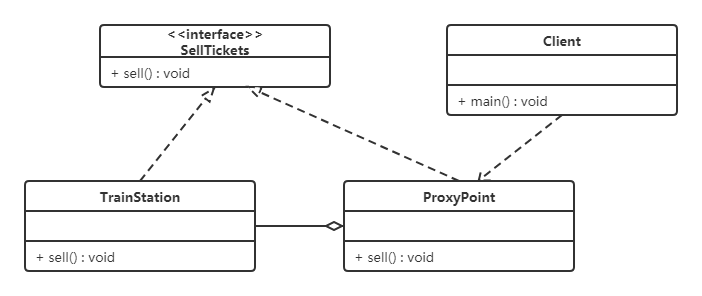

# 代理模式

## 1. 概述

**定义**：由于某些原因需要给某对象提供一个代理以控制对该对象的访问。这时，访问对象不适合或者不能直接引用目标对象，代理对象作为访问对象和目标对象之间的中介。

Java 中的代理按照代理类生成时机不同又分为**静态代理**和**动态代理**：静态代理的代理类在编译期就生成，而动态代理的代理类则是在 Java 运行时动态生成。动态代理又有 JDK 代理和 CGLIB 代理两种。

## 2. 结构

代理（Proxy）模式分为三种角色：

| 角色 | 职责 |
| --- | --- |
| 抽象主题（Subject）类 | 通过接口或抽象类声明真实主题和代理对象实现的业务方法 |
| 真实主题（Real Subject）类 | 实现了抽象主题中的具体业务，是代理对象所代表的真实对象，是最终要引用的对象 |
| 代理（Proxy）类 | 提供了与真实主题相同的接口，其内部含有对真实主题的引用，它可以访问、控制或扩展真实主题的功能 |

## 3. 静态代理

我们通过案例来感受一下静态代理。

**例：火车站卖票**

如果要买火车票的话，需要去火车站买票，坐车到火车站、排队等一系列的操作，显然比较麻烦。而火车站在多个地方都有代售点，我们去代售点买票就方便很多了。这个例子其实就是典型的代理模式：火车站是目标对象，代售点是代理对象。类图如下：



代码如下：

```java
// 卖票接口
public interface SellTickets {
    void sell();
}

// 火车站（真实主题）：火车站具有卖票功能，所以需要实现 SellTickets 接口
public class TrainStation implements SellTickets {

    @Override
    public void sell() {
        System.out.println("火车站卖票");
    }
}

// 代售点（代理主题）
public class ProxyPoint implements SellTickets {

    private TrainStation station = new TrainStation();

    @Override
    public void sell() {
        System.out.println("代理点收取一些服务费用");
        station.sell();
    }
}

// 测试类
public class Client {
    public static void main(String[] args) {
        ProxyPoint pp = new ProxyPoint();
        pp.sell();
    }
}
```

运行输出：

```text
代理点收取一些服务费用
火车站卖票
```

从上面代码中可以看出，测试类直接访问的是 ProxyPoint 类对象，也就是说 ProxyPoint 作为访问对象和目标对象的中介，同时对 sell 方法进行了增强（代理点收取一些服务费用）。

## 4. JDK 动态代理

接下来我们使用动态代理实现上面案例。先说说 JDK 提供的动态代理：Java 中提供了一个动态代理类 Proxy。Proxy 并不是我们上述所说的代理对象的类，而是提供了一个创建代理对象的静态方法（`newProxyInstance` 方法）来获取代理对象。

代码如下：

```java
import java.lang.reflect.InvocationHandler;
import java.lang.reflect.Method;
import java.lang.reflect.Proxy;

// 卖票接口
public interface SellTickets {
    void sell();
}

// 火车站（真实主题）
public class TrainStation implements SellTickets {

    @Override
    public void sell() {
        System.out.println("火车站卖票");
    }
}

// 代理工厂，用来创建代理对象
public class ProxyFactory {

    private TrainStation station = new TrainStation();

    public SellTickets getProxyObject() {
        // 使用 Proxy 获取代理对象
        /*
            newProxyInstance() 方法参数说明：
                ClassLoader loader    ：类加载器，用于加载代理类，使用真实对象的类加载器即可
                Class<?>[] interfaces ：真实对象所实现的接口，代理模式和真实对象实现相同的接口
                InvocationHandler h   ：代理对象的调用处理程序
         */
        SellTickets sellTickets = (SellTickets) Proxy.newProxyInstance(
                station.getClass().getClassLoader(),
                station.getClass().getInterfaces(),
                new InvocationHandler() {
                    /*
                        InvocationHandler 中 invoke 方法参数说明：
                            proxy  ：代理对象
                            method ：对应于在代理对象上调用的接口方法的 Method 实例
                            args   ：代理对象调用接口方法时传递的实际参数
                     */
                    @Override
                    public Object invoke(Object proxy, Method method, Object[] args) throws Throwable {
                        System.out.println("代理点收取一些服务费用(JDK动态代理方式)");
                        // 执行真实对象
                        Object result = method.invoke(station, args);
                        return result;
                    }
                });
        return sellTickets;
    }
}

// 测试类
public class Client {
    public static void main(String[] args) {
        // 获取代理对象
        ProxyFactory factory = new ProxyFactory();

        SellTickets proxyObject = factory.getProxyObject();
        proxyObject.sell();
    }
}
```

运行输出：

```text
代理点收取一些服务费用(JDK动态代理方式)
火车站卖票
```

### 4.1 ProxyFactory 是代理类吗？

ProxyFactory 不是代理模式中所说的代理类，真正的代理类是程序在运行过程中动态地在内存中生成的类。通过阿里巴巴开源的 Java 诊断工具（Arthas【阿尔萨斯】）可以查看代理类的结构：

```java
package com.sun.proxy;

import com.itheima.proxy.dynamic.jdk.SellTickets;
import java.lang.reflect.InvocationHandler;
import java.lang.reflect.Method;
import java.lang.reflect.Proxy;
import java.lang.reflect.UndeclaredThrowableException;

public final class $Proxy0 extends Proxy implements SellTickets {
    private static Method m1;
    private static Method m2;
    private static Method m3;
    private static Method m0;

    public $Proxy0(InvocationHandler invocationHandler) {
        super(invocationHandler);
    }

    static {
        try {
            m1 = Class.forName("java.lang.Object").getMethod("equals", Class.forName("java.lang.Object"));
            m2 = Class.forName("java.lang.Object").getMethod("toString", new Class[0]);
            m3 = Class.forName("com.itheima.proxy.dynamic.jdk.SellTickets").getMethod("sell", new Class[0]);
            m0 = Class.forName("java.lang.Object").getMethod("hashCode", new Class[0]);
            return;
        }
        catch (NoSuchMethodException noSuchMethodException) {
            throw new NoSuchMethodError(noSuchMethodException.getMessage());
        }
        catch (ClassNotFoundException classNotFoundException) {
            throw new NoClassDefFoundError(classNotFoundException.getMessage());
        }
    }

    public final boolean equals(Object object) {
        try {
            return (Boolean) this.h.invoke(this, m1, new Object[]{object});
        }
        catch (Error | RuntimeException throwable) {
            throw throwable;
        }
        catch (Throwable throwable) {
            throw new UndeclaredThrowableException(throwable);
        }
    }

    public final String toString() {
        try {
            return (String) this.h.invoke(this, m2, null);
        }
        catch (Error | RuntimeException throwable) {
            throw throwable;
        }
        catch (Throwable throwable) {
            throw new UndeclaredThrowableException(throwable);
        }
    }

    public final int hashCode() {
        try {
            return (Integer) this.h.invoke(this, m0, null);
        }
        catch (Error | RuntimeException throwable) {
            throw throwable;
        }
        catch (Throwable throwable) {
            throw new UndeclaredThrowableException(throwable);
        }
    }

    public final void sell() {
        try {
            this.h.invoke(this, m3, null);
            return;
        }
        catch (Error | RuntimeException throwable) {
            throw throwable;
        }
        catch (Throwable throwable) {
            throw new UndeclaredThrowableException(throwable);
        }
    }
}
```

从上面的类中，我们可以看到以下几个信息：

- 代理类（$Proxy0）实现了 SellTickets，这也就印证了我们之前说的真实类和代理类实现同样的接口；
- 代理类（$Proxy0）将我们提供的匿名内部类对象传递给了父类。

### 4.2 动态代理的执行流程是什么样？

下面是摘取的重点代码：

```java
// 程序运行过程中动态生成的代理类
public final class $Proxy0 extends Proxy implements SellTickets {
    private static Method m3;

    public $Proxy0(InvocationHandler invocationHandler) {
        super(invocationHandler);
    }

    static {
        m3 = Class.forName("com.itheima.proxy.dynamic.jdk.SellTickets").getMethod("sell", new Class[0]);
    }

    public final void sell() {
        this.h.invoke(this, m3, null);
    }
}

// Java 提供的动态代理相关类
public class Proxy implements java.io.Serializable {
    protected InvocationHandler h;

    protected Proxy(InvocationHandler h) {
        this.h = h;
    }
}

// 代理工厂类
public class ProxyFactory {

    private TrainStation station = new TrainStation();

    public SellTickets getProxyObject() {
        SellTickets sellTickets = (SellTickets) Proxy.newProxyInstance(
                station.getClass().getClassLoader(),
                station.getClass().getInterfaces(),
                new InvocationHandler() {

                    public Object invoke(Object proxy, Method method, Object[] args) throws Throwable {
                        System.out.println("代理点收取一些服务费用(JDK动态代理方式)");
                        Object result = method.invoke(station, args);
                        return result;
                    }
                });
        return sellTickets;
    }
}

// 测试访问类
public class Client {
    public static void main(String[] args) {
        // 获取代理对象
        ProxyFactory factory = new ProxyFactory();
        SellTickets proxyObject = factory.getProxyObject();
        proxyObject.sell();
    }
}
```

执行流程如下：

1. 在测试类中通过代理对象调用 `sell()` 方法；
2. 根据多态的特性，执行的是代理类（$Proxy0）中的 `sell()` 方法；
3. 代理类（$Proxy0）中的 `sell()` 方法又调用了 InvocationHandler 接口的子实现类对象的 `invoke` 方法；
4. `invoke` 方法通过反射执行了真实对象所属类（TrainStation）中的 `sell()` 方法。

## 5. CGLIB 动态代理

同样是上面的案例，我们再次使用 CGLIB 代理实现。

如果没有定义 SellTickets 接口，只定义了 TrainStation（火车站类），很显然 JDK 代理就无法使用了，因为 JDK 动态代理要求必须定义接口、对接口进行代理。

CGLIB 是一个功能强大、高性能的代码生成包。它为没有实现接口的类提供代理，为 JDK 的动态代理提供了很好的补充。

CGLIB 是第三方提供的包，所以需要引入 jar 包的坐标：

```xml
<dependency>
    <groupId>cglib</groupId>
    <artifactId>cglib</artifactId>
    <version>2.2.2</version>
</dependency>
```

代码如下：

```java
import net.sf.cglib.proxy.Enhancer;
import net.sf.cglib.proxy.MethodInterceptor;
import net.sf.cglib.proxy.MethodProxy;
import java.lang.reflect.Method;

// 火车站（没有实现任何接口）
public class TrainStation {

    public void sell() {
        System.out.println("火车站卖票");
    }
}

// 代理工厂
public class ProxyFactory implements MethodInterceptor {

    private TrainStation target = new TrainStation();

    public TrainStation getProxyObject() {
        // 创建 Enhancer 对象，类似于 JDK 动态代理的 Proxy 类，下一步就是设置几个参数
        Enhancer enhancer = new Enhancer();
        // 设置父类的字节码对象
        enhancer.setSuperclass(target.getClass());
        // 设置回调函数
        enhancer.setCallback(this);
        // 创建代理对象
        TrainStation obj = (TrainStation) enhancer.create();
        return obj;
    }

    /*
        intercept 方法参数说明：
            o           ：代理对象
            method      ：真实对象中的方法的 Method 实例
            args        ：实际参数
            methodProxy ：代理对象中的方法的 method 实例
     */
    @Override
    public Object intercept(Object o, Method method, Object[] args, MethodProxy methodProxy) throws Throwable {
        System.out.println("代理点收取一些服务费用(CGLIB动态代理方式)");
        Object result = methodProxy.invokeSuper(o, args);
        return result;
    }
}

// 测试类
public class Client {
    public static void main(String[] args) {
        // 创建代理工厂对象
        ProxyFactory factory = new ProxyFactory();
        // 获取代理对象
        TrainStation proxyObject = factory.getProxyObject();

        proxyObject.sell();
    }
}
```

运行输出：

```text
代理点收取一些服务费用(CGLIB动态代理方式)
火车站卖票
```

## 6. 三种代理的对比

### 6.1 JDK 代理和 CGLIB 代理

| 对比项 | JDK 动态代理 | CGLIB 动态代理 |
| --- | --- | --- |
| 依赖 | JDK 自带 | 第三方包（底层采用 ASM 字节码生成框架） |
| 前提条件 | 目标类必须实现接口 | 不要求接口，通过生成子类代理 |
| 限制 | 只能代理接口中的方法 | 不能对声明为 final 的类或方法进行代理 |
| 效率 | JDK 1.8 之后高于 CGLIB | JDK 1.6 之前比 Java 反射效率高 |

使用 CGLIB 实现动态代理，CGLIB 底层采用 ASM 字节码生成框架，使用字节码技术生成代理类，在 JDK 1.6 之前比使用 Java 反射效率要高。唯一需要注意的是，CGLIB 不能对声明为 final 的类或者方法进行代理，因为 CGLIB 的原理是动态生成被代理类的子类。

在 JDK 1.6、JDK 1.7、JDK 1.8 逐步对 JDK 动态代理优化之后，在调用次数较少的情况下，JDK 代理效率高于 CGLIB 代理；只有当进行大量调用的时候，JDK 1.6 和 JDK 1.7 比 CGLIB 代理效率低一点，但到 JDK 1.8 的时候，JDK 代理效率高于 CGLIB 代理。所以经验法则是：**有接口用 JDK 动态代理，没有接口用 CGLIB 代理**。

### 6.2 动态代理和静态代理

动态代理与静态代理相比较，最大的好处是：接口中声明的所有方法都被转移到调用处理器一个集中的方法中处理（`InvocationHandler.invoke`）。这样，在接口方法数量比较多的时候，我们可以进行灵活处理，而不需要像静态代理那样对每一个方法进行中转。

如果接口增加一个方法，静态代理模式除了所有实现类需要实现这个方法外，所有代理类也需要实现此方法，增加了代码维护的复杂度。而动态代理不会出现该问题。

## 7. 优缺点

**优点**：

- 代理模式在客户端与目标对象之间起到一个中介作用和保护目标对象的作用；
- 代理对象可以扩展目标对象的功能；
- 代理模式能将客户端与目标对象分离，在一定程度上降低了系统的耦合度。

**缺点**：

- 增加了系统的复杂度。

## 8. 使用场景

- **远程（Remote）代理**：本地服务通过网络请求远程服务。为了实现本地到远程的通信，我们需要实现网络通信、处理其中可能的异常。为保持良好的代码设计和可维护性，我们将网络通信部分隐藏起来，只暴露给本地服务一个接口，通过该接口即可访问远程服务提供的功能，而不必过多关心通信部分的细节；
- **防火墙（Firewall）代理**：当你将浏览器配置成使用代理功能时，防火墙就将你的浏览器的请求转给互联网；当互联网返回响应时，代理服务器再把它转给你的浏览器；
- **保护（Protect or Access）代理**：控制对一个对象的访问，如果需要，可以给不同的用户提供不同级别的使用权限。

## 9. 小结

- 代理模式的三要素：公共接口、真实对象、持有真实对象引用的代理对象，调用方拿到的是代理，操作被"转发 + 增强"；
- 静态代理结构清晰但每个目标类都要手写一个代理类；动态代理由运行期生成代理类，一套 `InvocationHandler` 逻辑可以代理任意接口；
- JDK 动态代理基于接口（反射实现），CGLIB 基于继承（字节码生成子类），Spring AOP 会自动在两者间选择；
- 代理与装饰者的类图几乎相同，区别在意图：代理强调**控制访问**（延迟加载、权限校验等），装饰者强调**叠加功能**。
