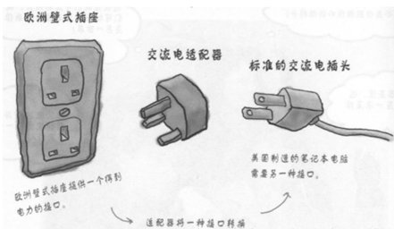
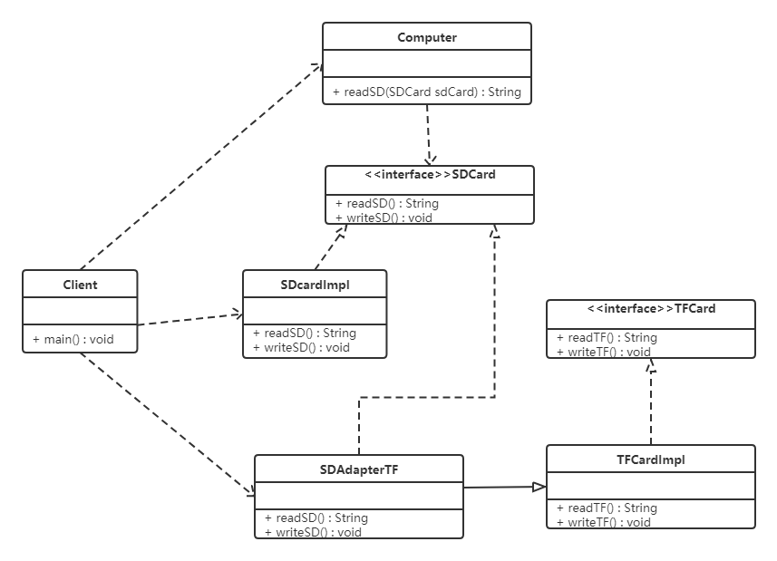
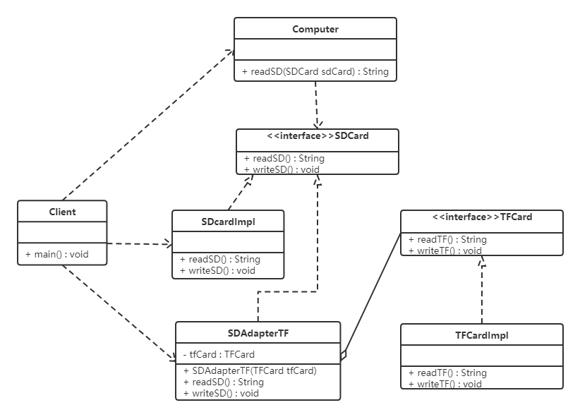
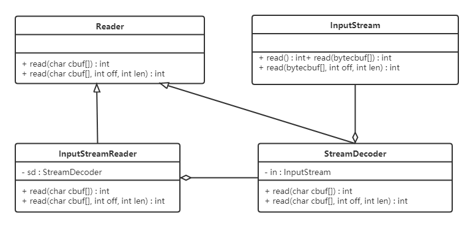

# 适配器模式

## 1. 概述

如果去欧洲国家旅游的话，他们的插座是欧洲标准（如下图最左边），而我们使用的插头是国标（如下图最右边）。因此我们的笔记本电脑、手机在当地不能直接充电。所以就需要一个插座转换器：转换器第 1 面插入当地的插座，第 2 面供我们充电，这样使得我们的插头在当地能使用。生活中这样的例子很多，手机充电器（将 220V 转换为 5V 的电压）、读卡器等，其实都使用到了适配器模式。



**定义**：将一个类的接口转换成客户希望的另外一个接口，使得原本由于接口不兼容而不能一起工作的那些类能一起工作。

适配器模式分为**类适配器模式**和**对象适配器模式**：前者的类之间耦合度比后者高，且要求程序员了解现有组件库中的相关组件的内部结构，所以应用相对较少些。

## 2. 结构

适配器模式（Adapter）包含以下主要角色：

| 角色 | 职责 |
| --- | --- |
| 目标（Target）接口 | 当前系统业务所期待的接口，它可以是抽象类或接口 |
| 适配者（Adaptee）类 | 被访问和适配的现存组件库中的组件接口 |
| 适配器（Adapter）类 | 一个转换器，通过继承或引用适配者的对象，把适配者接口转换成目标接口，让客户按目标接口的格式访问适配者 |

## 3. 类适配器模式

**实现方式**：定义一个适配器类来实现当前系统的业务接口，同时又继承现有组件库中已经存在的组件。

**例：读卡器**

现有一台电脑只能读取 SD 卡，而要读取 TF 卡中的内容就需要使用到适配器模式：创建一个读卡器（适配器），将 TF 卡中的内容读取出来。

类图如下：



代码如下：

```java
// SD 卡的接口（目标接口）
public interface SDCard {
    // 读取 SD 卡方法
    String readSD();
    // 写入 SD 卡功能
    void writeSD(String msg);
}

// SD 卡实现类
public class SDCardImpl implements SDCard {

    @Override
    public String readSD() {
        String msg = "sd card read a msg : hello world SD";
        return msg;
    }

    @Override
    public void writeSD(String msg) {
        System.out.println("sd card write msg : " + msg);
    }
}

// 电脑类
public class Computer {

    public String readSD(SDCard sdCard) {
        if (sdCard == null) {
            throw new NullPointerException("sd card null");
        }
        return sdCard.readSD();
    }
}

// TF 卡接口（适配者接口）
public interface TFCard {
    // 读取 TF 卡方法
    String readTF();
    // 写入 TF 卡功能
    void writeTF(String msg);
}

// TF 卡实现类
public class TFCardImpl implements TFCard {

    @Override
    public String readTF() {
        String msg = "tf card read msg : hello world tf card";
        return msg;
    }

    @Override
    public void writeTF(String msg) {
        System.out.println("tf card write a msg : " + msg);
    }
}

// 适配器类（SD 兼容 TF）：继承 TF 卡实现类，同时实现 SD 卡接口
public class SDAdapterTF extends TFCardImpl implements SDCard {

    @Override
    public String readSD() {
        System.out.println("adapter read tf card");
        return readTF();
    }

    @Override
    public void writeSD(String msg) {
        System.out.println("adapter write tf card");
        writeTF(msg);
    }
}

// 测试类
public class Client {
    public static void main(String[] args) {
        Computer computer = new Computer();
        SDCard sdCard = new SDCardImpl();
        System.out.println(computer.readSD(sdCard));

        System.out.println("------------");

        SDAdapterTF adapter = new SDAdapterTF();
        System.out.println(computer.readSD(adapter));
    }
}
```

运行输出：

```text
sd card read a msg : hello world SD
------------
adapter read tf card
tf card read msg : hello world tf card
```

类适配器模式违背了合成复用原则。类适配器在客户类有一个接口规范的情况下可用，反之不可用。

## 4. 对象适配器模式

**实现方式**：对象适配器模式可采用将现有组件库中已经实现的组件引入适配器类中（组合的方式），该类同时实现当前系统的业务接口。

**例：读卡器（改写）**

我们使用对象适配器模式将读卡器的案例进行改写。类图如下：



相对类适配器模式的代码，我们只需要修改适配器类（SDAdapterTF）和测试类：

```java
// 适配器类（SD 兼容 TF）：持有 TF 卡对象的引用，实现 SD 卡接口
public class SDAdapterTF implements SDCard {

    private TFCard tfCard;

    public SDAdapterTF(TFCard tfCard) {
        this.tfCard = tfCard;
    }

    @Override
    public String readSD() {
        System.out.println("adapter read tf card");
        return tfCard.readTF();
    }

    @Override
    public void writeSD(String msg) {
        System.out.println("adapter write tf card");
        tfCard.writeTF(msg);
    }
}

// 测试类
public class Client {
    public static void main(String[] args) {
        Computer computer = new Computer();
        SDCard sdCard = new SDCardImpl();
        System.out.println(computer.readSD(sdCard));

        System.out.println("------------");

        TFCard tfCard = new TFCardImpl();
        SDAdapterTF adapter = new SDAdapterTF(tfCard);
        System.out.println(computer.readSD(adapter));
    }
}
```

> [!NOTE]
> 还有一种**接口适配器模式**（也叫缺省适配器模式）：当不希望实现一个接口中所有的方法时，可以创建一个抽象类 Adapter 实现所有方法（空实现），而此时我们只需要继承该抽象类、重写需要的方法即可。

## 5. 应用场景

- 以前开发的系统存在满足新系统功能需求的类，但其接口同新系统的接口不一致；
- 使用第三方提供的组件，但组件接口定义和自己要求的接口定义不同。

## 6. JDK 源码解析

Reader（字符流）、InputStream（字节流）的适配使用的是 InputStreamReader。

InputStreamReader 继承自 java.io 包中的 Reader，对其中的抽象的未实现的方法给出实现。如：

```java
public int read() throws IOException {
    return sd.read();
}

public int read(char cbuf[], int offset, int length) throws IOException {
    return sd.read(cbuf, offset, length);
}
```

如上代码中的 sd（StreamDecoder 类对象），在 Sun 的 JDK 实现中，实际的方法实现是对 sun.nio.cs.StreamDecoder 类的同名方法的调用封装。类结构图如下：



从上图可以看出：

- InputStreamReader 是对同样实现了 Reader 的 StreamDecoder 的封装；
- StreamDecoder 不是 Java SE API 中的内容，是 Sun JDK 给出的自身实现。但我们知道它对构造方法中的字节流类（InputStream）进行了封装，并通过该类进行了字节流和字符流之间的解码转换。

**结论**：从表层来看，InputStreamReader 做了 InputStream 字节流类到 Reader 字符流之间的转换。而从如上 Sun JDK 中的实现类关系结构中可以看出，是 StreamDecoder 的设计实现实际上采用了适配器模式。

## 7. 小结

- 适配器模式的价值在于**复用存量代码**：不修改已有组件，只在中间加一层转换，让"接口不兼容"的双方协作起来；
- 类适配器通过继承实现，能重写适配者行为但违背合成复用原则，且要求目标必须是接口；对象适配器通过组合实现，更灵活、更推荐；
- 与装饰者模式的区别：适配器改变的是**接口**（让不兼容变兼容），装饰者不改接口，只是**增强功能**；
- JDK 典型应用：`InputStreamReader` / `OutputStreamWriter`（字节流与字符流之间的桥）、`Arrays.asList()`（数组适配为 List）、`java.util.Collections` 中的各类包装方法。
