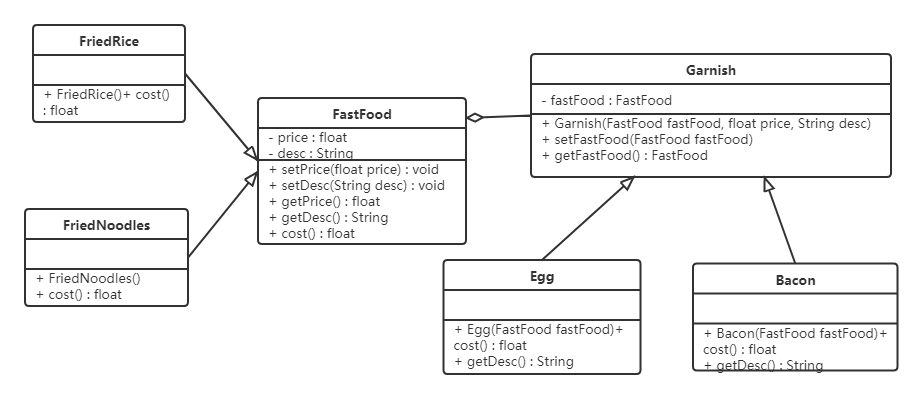
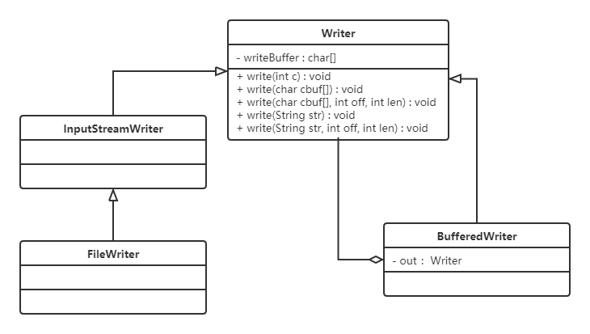

# 装饰者模式

## 1. 概述

我们先来看一个快餐店的例子。

快餐店有炒面、炒饭这些快餐，可以额外附加鸡蛋、火腿、培根这些配菜，当然加配菜需要额外加钱，每个配菜的价钱通常不太一样，那么计算总价就会显得比较麻烦。

如果用继承的方式实现"各种快餐 + 各种配菜"的组合，会存在以下问题：

- **扩展性不好**：如果要再加一种配料（火腿肠），就需要给 FriedRice 和 FriedNoodles 分别定义一个子类；如果要新增一个快餐品类（炒河粉），就需要定义更多的子类；
- **产生过多的子类**：快餐品类数 × 配菜数的组合都要靠子类表达，子类数目呈爆炸性增长。

**定义**：装饰者模式指在不改变现有对象结构的情况下，动态地给该对象增加一些职责（即增加其额外功能）的模式。

## 2. 结构

装饰（Decorator）模式中的角色：

| 角色 | 职责 |
| --- | --- |
| 抽象构件（Component）角色 | 定义一个抽象接口以规范准备接收附加责任的对象 |
| 具体构件（Concrete Component）角色 | 实现抽象构件，是被装饰的原始对象 |
| 抽象装饰（Decorator）角色 | 继承或实现抽象构件，并包含具体构件的实例，可以通过其子类扩展具体构件的功能 |
| 具体装饰（Concrete Decorator）角色 | 实现抽象装饰的相关方法，并给具体构件对象添加附加的责任 |

## 3. 案例

我们使用装饰者模式对快餐店案例进行改进，体会装饰者模式的精髓。

类图如下：



代码如下：

```java
// 快餐接口（抽象构件）
public abstract class FastFood {
    private float price;
    private String desc;

    public FastFood() {
    }

    public FastFood(float price, String desc) {
        this.price = price;
        this.desc = desc;
    }

    public void setPrice(float price) {
        this.price = price;
    }

    public float getPrice() {
        return price;
    }

    public String getDesc() {
        return desc;
    }

    public void setDesc(String desc) {
        this.desc = desc;
    }

    // 获取价格
    public abstract float cost();
}

// 炒饭（具体构件）
public class FriedRice extends FastFood {

    public FriedRice() {
        super(10, "炒饭");
    }

    @Override
    public float cost() {
        return getPrice();
    }
}

// 炒面（具体构件）
public class FriedNoodles extends FastFood {

    public FriedNoodles() {
        super(12, "炒面");
    }

    @Override
    public float cost() {
        return getPrice();
    }
}

// 配料类（抽象装饰者）
public abstract class Garnish extends FastFood {

    private FastFood fastFood;

    public FastFood getFastFood() {
        return fastFood;
    }

    public void setFastFood(FastFood fastFood) {
        this.fastFood = fastFood;
    }

    public Garnish(FastFood fastFood, float price, String desc) {
        super(price, desc);
        this.fastFood = fastFood;
    }
}

// 鸡蛋配料（具体装饰者）
public class Egg extends Garnish {

    public Egg(FastFood fastFood) {
        super(fastFood, 1, "鸡蛋");
    }

    @Override
    public float cost() {
        return getPrice() + getFastFood().getPrice();
    }

    @Override
    public String getDesc() {
        return super.getDesc() + getFastFood().getDesc();
    }
}

// 培根配料（具体装饰者）
public class Bacon extends Garnish {

    public Bacon(FastFood fastFood) {
        super(fastFood, 2, "培根");
    }

    @Override
    public float cost() {
        return getPrice() + getFastFood().getPrice();
    }

    @Override
    public String getDesc() {
        return super.getDesc() + getFastFood().getDesc();
    }
}

// 测试类
public class Client {
    public static void main(String[] args) {
        // 点一份炒饭
        FastFood food = new FriedRice();
        // 花费的价格
        System.out.println(food.getDesc() + " " + food.cost() + "元");

        System.out.println("========");
        // 点一份加鸡蛋的炒饭
        FastFood food1 = new FriedRice();
        food1 = new Egg(food1);
        // 花费的价格
        System.out.println(food1.getDesc() + " " + food1.cost() + "元");

        System.out.println("========");
        // 点一份加培根的炒面
        FastFood food2 = new FriedNoodles();
        food2 = new Bacon(food2);
        // 花费的价格
        System.out.println(food2.getDesc() + " " + food2.cost() + "元");
    }
}
```

运行输出：

```text
炒饭 10.0元
========
鸡蛋炒饭 11.0元
========
培根炒面 14.0元
```

**好处**：

- 装饰者模式可以带来比继承更加灵活的扩展功能，使用更加方便，可以通过组合不同的装饰者对象来获取具有不同行为状态的多样化的结果。装饰者模式比继承具有更好的扩展性，完美地遵循开闭原则：继承是静态地附加责任，装饰者则是动态地附加责任；
- 装饰类和被装饰类可以独立发展，不会相互耦合。装饰模式是继承的一个替代模式，可以动态扩展一个实现类的功能。

## 4. 使用场景

- 当不能采用继承的方式对系统进行扩充，或者采用继承不利于系统扩展和维护时。不能采用继承的情况主要有两类：
  - 第一类是系统中存在大量独立的扩展，为支持每一种组合将产生大量的子类，使得子类数目呈爆炸性增长；
  - 第二类是因为类定义不能继承（如 final 类）；
- 在不影响其他对象的情况下，以动态、透明的方式给单个对象添加职责；
- 当对象的功能要求可以动态地添加，也可以再动态地撤销时。

## 5. JDK 源码解析

IO 流中的包装类使用到了装饰者模式：BufferedInputStream、BufferedOutputStream、BufferedReader、BufferedWriter。

我们以 BufferedWriter 举例来说明，先看看如何使用 BufferedWriter：

```java
import java.io.BufferedWriter;
import java.io.FileWriter;

public class Demo {
    public static void main(String[] args) throws Exception {
        // 创建 FileWriter 对象
        FileWriter fw = new FileWriter("a.txt");
        // 创建 BufferedWriter 对象，包装 FileWriter
        BufferedWriter bw = new BufferedWriter(fw);

        // 写数据
        bw.write("hello Buffered");

        bw.close();
    }
}
```

使用起来感觉确实像是装饰者模式，接下来看它们的结构：



> [!NOTE]
> BufferedWriter 使用装饰者模式对 Writer 子实现类进行了增强：添加了缓冲区，提高了写数据的效率。

## 6. 代理和装饰者的区别

静态代理和装饰者模式的区别：

- **相同点**：
  - 都要实现与目标类相同的业务接口；
  - 在两个类中都要声明目标对象；
  - 都可以在不修改目标类的前提下增强目标方法。
- **不同点**：
  - **目的不同**：装饰者是为了增强目标对象；静态代理是为了保护和隐藏目标对象；
  - **获取目标对象的地方不同**：装饰者是由外界传递进来，可以通过构造方法传递；静态代理是在代理类内部创建，以此来隐藏目标对象。

## 7. 小结

- 装饰者模式的核心是"**同类型包装 + 递归委托**"：装饰者与被装饰者实现同一接口，装饰者内部持有被装饰者，调用时先做自己的增强再委托出去（或反过来）；
- 它用"组合 + 包装"替代了"继承子类爆炸"，新增配料、新增快餐互不影响，是开闭原则的典型体现；
- 判断该不该用装饰者：如果增强后的对象**仍然当作原类型使用**（如 `BufferedWriter` 仍是 `Writer`），且增强可以多层叠加，装饰者就非常合适；
- 常见应用：Java IO 流的各类包装类、`Collections.synchronizedList()`、`HttpServletRequestWrapper` 等。
