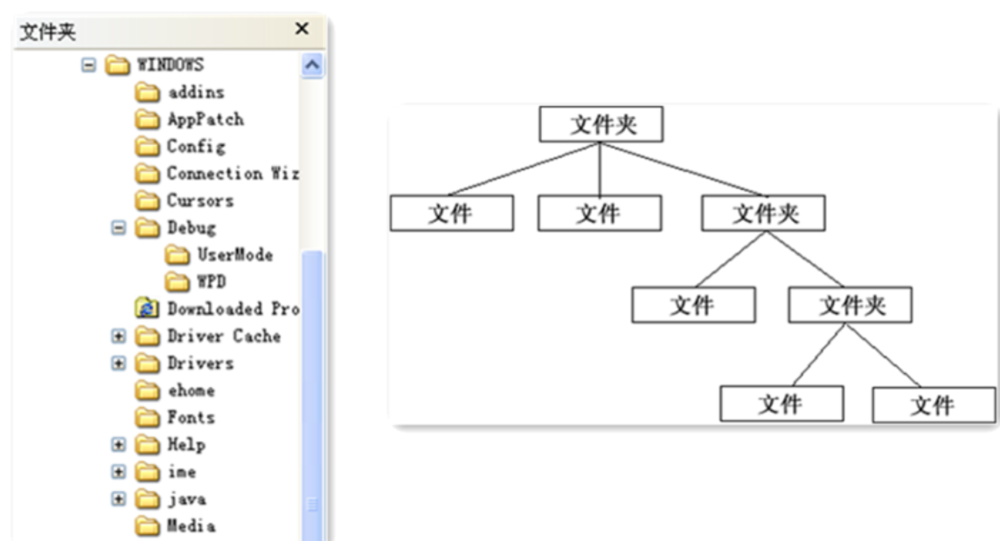
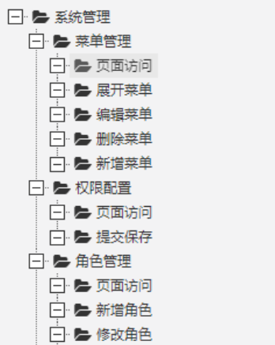
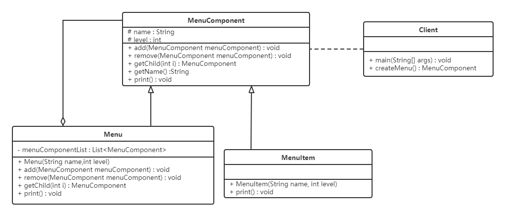
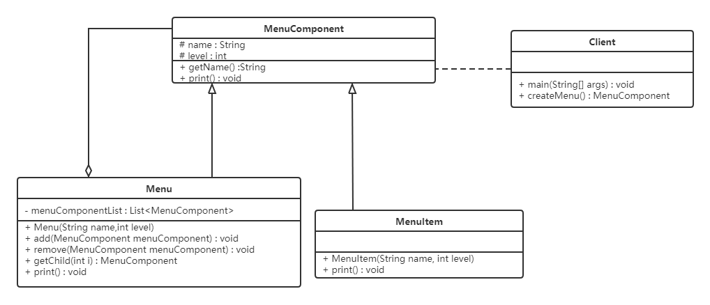

# 组合模式

## 1. 概述

对于下面这个图片大家肯定会非常熟悉，我们可以把它看做是一个文件系统。对于这样的结构我们称之为**树形结构**。在树形结构中可以通过调用某个方法来遍历整棵树，当我们找到某个叶子节点后，就可以对叶子节点进行相关的操作。可以将这棵树理解成一个大的容器，容器里面包含很多的成员对象，这些成员对象既可以是容器对象，也可以是叶子对象。但是由于容器对象和叶子对象在功能上的区别，使得我们在使用的过程中必须区分容器对象和叶子对象，但是这样就会给客户带来不必要的麻烦——作为客户而言，它始终希望能够一致地对待容器对象和叶子对象。



**定义**：组合模式又名**部分整体模式**，是用于把一组相似的对象当作一个单一的对象。组合模式依据树形结构来组合对象，用来表示部分以及整体层次。这种类型的设计模式属于结构型模式，它创建了对象组的树形结构。

## 2. 结构

组合模式主要包含三种角色：

| 角色 | 职责 |
| --- | --- |
| 抽象根节点（Component） | 定义系统各层次对象的共有方法和属性，可以预先定义一些默认行为和属性 |
| 树枝节点（Composite） | 定义树枝节点的行为，存储子节点，组合树枝节点和叶子节点形成树形结构 |
| 叶子节点（Leaf） | 叶子节点对象，其下再无分支，是系统层次遍历的最小单位 |

## 3. 案例实现

**例：软件菜单**

如下图，我们在访问别的一些管理系统时，经常可以看到类似的菜单。一个菜单可以包含菜单项（菜单项是指不再包含其他内容的菜单条目），也可以包含带有其他菜单项的菜单，因此使用组合模式描述菜单就很恰当。我们的需求是：针对一个菜单，打印出其包含的所有菜单以及菜单项的名称。



要实现该案例，我们先画出类图：



**代码实现：**

不管是菜单还是菜单项，都应该继承自统一的接口，这里姑且将这个统一的接口称为菜单组件（透明式写法：把管理子节点的方法也声明在抽象构件中，默认抛异常）。

```java
import java.util.ArrayList;
import java.util.List;

// 菜单组件（抽象根节点）：不管是菜单还是菜单项，都应该继承该类
public abstract class MenuComponent {

    protected String name;
    protected int level;

    // 添加菜单
    public void add(MenuComponent menuComponent) {
        throw new UnsupportedOperationException();
    }

    // 移除菜单
    public void remove(MenuComponent menuComponent) {
        throw new UnsupportedOperationException();
    }

    // 获取指定的子菜单
    public MenuComponent getChild(int i) {
        throw new UnsupportedOperationException();
    }

    // 获取菜单名称
    public String getName() {
        return name;
    }

    // 打印菜单及其子菜单
    public void print() {
        throw new UnsupportedOperationException();
    }
}
```

这里的 MenuComponent 定义为抽象类，因为有一些共有的属性和行为要在该类中实现。Menu 和 MenuItem 类就可以只覆盖自己感兴趣的方法，而不用搭理不需要或者不感兴趣的方法。举例来说，Menu 类可以包含子菜单，因此需要覆盖 `add()`、`remove()`、`getChild()` 方法，但是 MenuItem 就不应该有这些方法。这里给出的默认实现是抛出异常，你也可以根据自己的需要改写默认实现。

```java
// 菜单（树枝节点）
public class Menu extends MenuComponent {

    private List<MenuComponent> menuComponentList;

    public Menu(String name, int level) {
        this.level = level;
        this.name = name;
        menuComponentList = new ArrayList<>();
    }

    @Override
    public void add(MenuComponent menuComponent) {
        menuComponentList.add(menuComponent);
    }

    @Override
    public void remove(MenuComponent menuComponent) {
        menuComponentList.remove(menuComponent);
    }

    @Override
    public MenuComponent getChild(int i) {
        return menuComponentList.get(i);
    }

    @Override
    public void print() {
        for (int i = 1; i < level; i++) {
            System.out.print("--");
        }
        System.out.println(name);
        for (MenuComponent menuComponent : menuComponentList) {
            menuComponent.print();
        }
    }
}
```

Menu 类已经实现了除 `getName` 方法之外的所有方法，因为 Menu 类具有添加菜单、移除菜单和获取子菜单的功能。

```java
// 菜单项（叶子节点）
public class MenuItem extends MenuComponent {

    public MenuItem(String name, int level) {
        this.name = name;
        this.level = level;
    }

    @Override
    public void print() {
        for (int i = 1; i < level; i++) {
            System.out.print("--");
        }
        System.out.println(name);
    }
}
```

MenuItem 是菜单项，不能再有子菜单，所以添加菜单、移除菜单和获取子菜单的功能并不能实现。

测试类：

```java
public class Client {
    public static void main(String[] args) {
        // 创建菜单树
        MenuComponent rootMenu = new Menu("系统管理", 1);
        MenuComponent menu1 = new Menu("用户管理", 2);
        MenuComponent menu2 = new Menu("角色管理", 2);

        MenuComponent item1 = new MenuItem("新增用户", 3);
        MenuComponent item2 = new MenuItem("修改用户", 3);
        menu1.add(item1);
        menu1.add(item2);

        rootMenu.add(menu1);
        rootMenu.add(menu2);

        // 一行代码打印整棵菜单树，无需区分菜单还是菜单项
        rootMenu.print();
    }
}
```

运行输出：

```text
系统管理
--用户管理
----新增用户
----修改用户
--角色管理
```

可以看到，客户端只需要对根节点调用一次 `print()`，整棵树就会递归地打印出来，全程无需判断当前对象是"菜单"还是"菜单项"，这正是组合模式"一致对待"的价值。

## 4. 组合模式的分类

在使用组合模式时，根据抽象构件类的定义形式，我们可将组合模式分为**透明组合模式**和**安全组合模式**两种形式。

### 4.1 透明组合模式

透明组合模式中，抽象根节点角色中声明了所有用于管理成员对象的方法，比如在示例中 `MenuComponent` 声明了 `add`、`remove`、`getChild` 方法。这样做的好处是确保所有的构件类都有相同的接口，透明组合模式也是组合模式的**标准形式**。

透明组合模式的缺点是**不够安全**：叶子对象和容器对象在本质上是有区别的，叶子对象不可能有下一层次的对象，即不可能包含成员对象，因此为其提供 `add()`、`remove()` 等方法是没有意义的。这在编译阶段不会出错，但在运行阶段如果调用这些方法可能会出错（如果没有提供相应的错误处理代码）。

### 4.2 安全组合模式

在安全组合模式中，抽象构件角色没有声明任何用于管理成员对象的方法，而是在树枝节点 `Menu` 类中声明并实现这些方法。安全组合模式的缺点是**不够透明**：叶子构件和容器构件具有不同的方法，且容器构件中那些用于管理成员对象的方法没有在抽象构件类中定义，因此客户端不能完全针对抽象编程，必须有区别地对待叶子构件和容器构件。



| 形式 | 抽象构件中的管理方法 | 优点 | 缺点 |
| --- | --- | --- | --- |
| 透明组合模式 | 全部声明（默认抛异常） | 客户端完全面向抽象编程，一致性好 | 叶子节点可能被调用无意义的方法，不安全 |
| 安全组合模式 | 只在树枝节点声明 | 叶子节点不会暴露不该有的方法，类型安全 | 客户端需要区分叶子与容器，不够透明 |

## 5. 优点

- 组合模式可以清楚地定义分层次的复杂对象，表示对象的全部或部分层次，它让客户端忽略了层次的差异，方便对整个层次结构进行控制；
- 客户端可以一致地使用一个组合结构或其中单个对象，不必关心处理的是单个对象还是整个组合结构，简化了客户端代码；
- 在组合模式中增加新的树枝节点和叶子节点都很方便，无须对现有类库进行任何修改，符合"开闭原则"；
- 组合模式为树形结构的面向对象实现提供了一种灵活的解决方案，通过叶子节点和树枝节点的递归组合，可以形成复杂的树形结构，但对树形结构的控制却非常简单。

## 6. 使用场景

组合模式正是应树形结构而生，所以组合模式的使用场景就是出现树形结构的地方。比如：文件目录显示、多级目录呈现等树形结构数据的操作，再如菜单管理、组织架构树、GUI 容器组件（如 Java Swing 的 `Container` 与 `Component`）等。

## 7. 小结

- 组合模式的关键是**用同一个抽象构件统一"部分"与"整体"**，让客户端以一致的方式处理树中的每个节点；
- 透明式（标准形式）把管理方法上提到抽象构件，换取客户端的"一致性"，牺牲类型安全；安全式相反，按需取舍即可；
- 它通常与迭代器、访问者等模式配合使用：组合模式负责组织树形结构，遍历与操作则交给其他模式完成。
