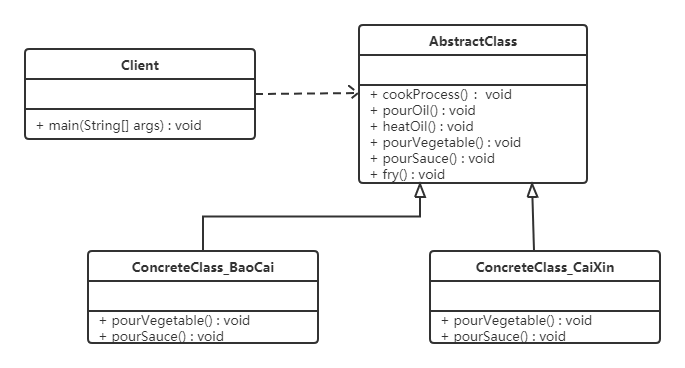

# 模板方法模式

## 1. 概述

在面向对象程序设计过程中，程序员常常会遇到这种情况：设计一个系统时知道了算法所需的关键步骤，而且确定了这些步骤的执行顺序，但某些步骤的具体实现还未知，或者说某些步骤的实现与具体的环境相关。

例如，去银行办理业务一般要经过取号、排队、办理具体业务、对银行工作人员进行评分这 4 个流程。其中取号、排队和评分对每个客户都是一样的，可以在父类中实现；但办理具体业务却因人而异，可能是存款、取款或者转账等，可以延迟到子类中实现。

**定义**：定义一个操作中的算法骨架，而将算法的一些步骤延迟到子类中实现，使得子类可以在不改变算法结构的情况下，重新定义该算法的某些特定步骤。

> [!NOTE]
> 模板方法模式是所有模式中"父类调用子类"最典型的一个：父类把流程定死，把细节留给子类，运行时真正执行的是子类重写后的方法，这就是常说的"好莱坞原则"——别调用我们，我们会调用你。

## 2. 结构

模板方法（Template Method）模式包含以下两个主要角色：

| 角色 | 职责 |
| --- | --- |
| 抽象类（Abstract Class） | 给出算法的轮廓和骨架，由一个模板方法和若干个基本方法构成 |
| 具体子类（Concrete Class） | 实现抽象类中定义的抽象方法和钩子方法，它们是算法流程的组成步骤 |

其中，**模板方法**定义了算法的骨架，按某种顺序调用其包含的基本方法；**基本方法**是实现算法各个步骤的方法，是模板方法的组成部分，又可以分为三种：

| 基本方法 | 说明 |
| --- | --- |
| 抽象方法（Abstract Method） | 由抽象类声明、由具体子类实现 |
| 具体方法（Concrete Method） | 由抽象类或具体类声明并实现，子类可以直接继承，也可以覆盖 |
| 钩子方法（Hook Method） | 在抽象类中已经实现，包括用于判断的逻辑方法和需要子类重写的空方法两种 |

一般钩子方法是用于判断的逻辑方法，这类方法名通常为 `isXxx`，返回值类型为 `boolean`，子类通过覆盖它来控制模板方法中的某个步骤是否执行。

## 3. 案例实现

【例】炒菜。

炒菜的步骤是固定的，分为倒油、热油、倒蔬菜、倒调味料、翻炒等步骤。现通过模板方法模式用代码模拟，类图如下：



代码如下：

```java
public abstract class AbstractClass {

    // 模板方法：定义炒菜的固定流程，final 防止子类改变骨架
    public final void cookProcess() {
        // 第一步：倒油
        this.pourOil();
        // 第二步：热油
        this.heatOil();
        // 第三步：倒蔬菜
        this.pourVegetable();
        // 第四步：倒调味料
        this.pourSauce();
        // 第五步：翻炒
        this.fry();
    }

    public void pourOil() {
        System.out.println("倒油");
    }

    // 第二步：热油是一样的，所以直接实现
    public void heatOil() {
        System.out.println("热油");
    }

    // 第三步：倒蔬菜是不一样的（一个下包菜，一个是下菜心）
    public abstract void pourVegetable();

    // 第四步：倒调味料是不一样的
    public abstract void pourSauce();

    // 第五步：翻炒是一样的，所以直接实现
    public void fry() {
        System.out.println("炒啊炒啊炒到熟啊");
    }
}
```

```java
public class ConcreteClass_BaoCai extends AbstractClass {

    @Override
    public void pourVegetable() {
        System.out.println("下锅的蔬菜是包菜");
    }

    @Override
    public void pourSauce() {
        System.out.println("下锅的酱料是辣椒");
    }
}
```

```java
public class ConcreteClass_CaiXin extends AbstractClass {

    @Override
    public void pourVegetable() {
        System.out.println("下锅的蔬菜是菜心");
    }

    @Override
    public void pourSauce() {
        System.out.println("下锅的酱料是蒜蓉");
    }
}
```

```java
public class Client {
    public static void main(String[] args) {
        // 炒手撕包菜
        ConcreteClass_BaoCai baoCai = new ConcreteClass_BaoCai();
        baoCai.cookProcess();

        // 炒蒜蓉菜心
        ConcreteClass_CaiXin caiXin = new ConcreteClass_CaiXin();
        caiXin.cookProcess();
    }
}
```

> [!WARNING]
> 为防止子类恶意修改算法骨架，模板方法一般都用 `final` 关键字修饰。

## 4. 优缺点

**优点**：

- **提高代码复用性**：将相同部分的代码放在抽象父类中，而将不同的代码放入不同的子类中；
- **实现了反向控制**：由父类调用子类的操作，通过对子类的具体实现扩展不同的行为，符合"开闭原则"。

**缺点**：

- 对每个不同的实现都需要定义一个子类，会导致类的个数增加，系统更加庞大，设计也更加抽象；
- 父类中的抽象方法由子类实现，子类执行的结果会影响父类的结果，这种反向的控制结构提高了代码阅读的难度。

## 5. 适用场景

- 算法的整体步骤很固定，但其中个别部分易变时，可以使用模板方法模式，将易变的部分抽象出来，供子类实现；
- 需要通过子类来决定父类算法中某个步骤是否执行，实现子类对父类的反向控制。

## 6. JDK 源码解析

`InputStream` 类就使用了模板方法模式。在 `InputStream` 类中定义了多个 `read()` 方法，如下：

```java
public abstract class InputStream implements Closeable {
    // 抽象方法，要求子类必须重写
    public abstract int read() throws IOException;

    public int read(byte b[]) throws IOException {
        return read(b, 0, b.length);
    }

    public int read(byte b[], int off, int len) throws IOException {
        if (b == null) {
            throw new NullPointerException();
        } else if (off < 0 || len < 0 || len > b.length - off) {
            throw new IndexOutOfBoundsException();
        } else if (len == 0) {
            return 0;
        }

        int c = read(); // 调用了无参的 read 方法，该方法每次读取一个字节数据
        if (c == -1) {
            return -1;
        }
        b[off] = (byte) c;

        int i = 1;
        try {
            for (; i < len; i++) {
                c = read();
                if (c == -1) {
                    break;
                }
                b[off + i] = (byte) c;
            }
        } catch (IOException ee) {
        }
        return i;
    }
}
```

从上面代码可以看到，无参的 `read()` 方法是抽象方法，要求子类必须实现；而 `read(byte b[])` 方法又调用了 `read(byte b[], int off, int len)` 方法，所以重点要看的是带三个参数的 `read` 方法——它在参数校验之后和循环体内，共两处调用了无参的抽象 `read()` 方法。

总结如下：在 `InputStream` 父类中已经定义好了读取一个字节数组数据的骨架——每次读取一个字节，并将其存储到数组对应的索引位置，直至读取 len 个字节。而具体如何读取一个字节的数据，则由子类（如 `FileInputStream`）实现，这正是模板方法模式的应用。
