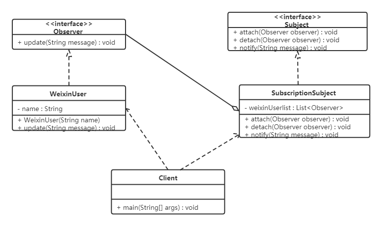

# 观察者模式

## 1. 概述

**定义**：又被称为发布-订阅（Publish/Subscribe）模式，它定义了一种一对多的依赖关系，让多个观察者对象同时监听某一个主题对象。这个主题对象在状态变化时，会通知所有的观察者对象，使它们能够自动更新自己。

> [!TIP]
> 观察者模式解决的还是那个老问题——**解耦**：被观察者不需要认识任何一个具体的观察者，它只维护一份"订阅名单"，状态一变就挨个通知。至于收到通知后做什么，完全由观察者自己决定。

## 2. 结构

在观察者模式中有如下角色：

| 角色 | 职责 |
| --- | --- |
| Subject（抽象主题/被观察者） | 把所有观察者对象保存在一个集合里，每个主题都可以有任意数量的观察者；抽象主题提供一个接口，可以增加和删除观察者对象 |
| ConcreteSubject（具体主题/被观察者） | 将有关状态存入具体观察者对象，在具体主题的内部状态发生改变时，给所有注册过的观察者发送通知 |
| Observer（抽象观察者） | 观察者的抽象类或接口，定义了一个更新接口，使得在得到主题更改通知时更新自己 |
| ConcreteObserver（具体观察者） | 实现抽象观察者定义的更新接口，以便在得到主题更改通知时更新自身的状态 |

## 3. 案例实现

【例】微信公众号。

在使用微信公众号时，大家都会有这样的体验：当你关注的公众号中有新内容更新时，它就会推送给关注该公众号的微信用户端。我们使用观察者模式来模拟这样的场景——微信用户就是观察者，微信公众号是被观察者，有多个微信用户关注了"程序猿"这个公众号。

类图如下：



代码如下。

定义抽象观察者类，里面定义一个更新的方法：

```java
public interface Observer {
    void update(String message);
}
```

定义具体观察者类，微信用户是观察者，里面实现了更新的方法：

```java
public class WeixinUser implements Observer {
    // 微信用户名
    private String name;

    public WeixinUser(String name) {
        this.name = name;
    }

    @Override
    public void update(String message) {
        System.out.println(name + "-" + message);
    }
}
```

定义抽象主题类，提供了 `attach`、`detach`、`notify` 三个方法：

```java
public interface Subject {
    // 增加订阅者
    public void attach(Observer observer);

    // 删除订阅者
    public void detach(Observer observer);

    // 通知订阅者更新消息
    public void notify(String message);
}
```

微信公众号是具体主题（具体被观察者），里面存储了订阅该公众号的微信用户，并实现了抽象主题中的方法：

```java
import java.util.ArrayList;
import java.util.List;

public class SubscriptionSubject implements Subject {
    // 储存订阅公众号的微信用户
    private List<Observer> weixinUserlist = new ArrayList<Observer>();

    @Override
    public void attach(Observer observer) {
        weixinUserlist.add(observer);
    }

    @Override
    public void detach(Observer observer) {
        weixinUserlist.remove(observer);
    }

    @Override
    public void notify(String message) {
        for (Observer observer : weixinUserlist) {
            observer.update(message);
        }
    }
}
```

客户端程序：

```java
public class Client {
    public static void main(String[] args) {
        SubscriptionSubject mSubscriptionSubject = new SubscriptionSubject();
        // 创建微信用户
        WeixinUser user1 = new WeixinUser("孙悟空");
        WeixinUser user2 = new WeixinUser("猪悟能");
        WeixinUser user3 = new WeixinUser("沙悟净");
        // 订阅公众号
        mSubscriptionSubject.attach(user1);
        mSubscriptionSubject.attach(user2);
        mSubscriptionSubject.attach(user3);
        // 公众号更新发出消息给订阅的微信用户
        mSubscriptionSubject.notify("传智黑马的专栏更新了");
    }
}
```

运行结果如下：

```text
孙悟空-传智黑马的专栏更新了
猪悟能-传智黑马的专栏更新了
沙悟净-传智黑马的专栏更新了
```

## 4. 优缺点

### 4.1 优点

- 降低了目标与观察者之间的耦合关系，两者之间是抽象耦合关系；
- 被观察者发送通知，所有注册的观察者都会收到信息（可以实现广播机制）。

### 4.2 缺点

- 如果观察者非常多的话，那么所有的观察者收到被观察者发送的通知会耗时；
- 如果被观察者有循环依赖的话，那么被观察者发送通知会使观察者循环调用，会导致系统崩溃。

## 5. 使用场景

- 对象间存在一对多关系，一个对象的状态发生改变会影响其他对象；
- 当一个抽象模型有两个方面，其中一个方面依赖于另一方面时。

## 6. JDK 中提供的实现

在 Java 中，通过 `java.util.Observable` 类和 `java.util.Observer` 接口定义了观察者模式，只要实现它们的子类就可以编写观察者模式实例。

### 6.1 Observable 类

`Observable` 类是抽象目标类（被观察者），它有一个 `Vector` 集合成员变量，用于保存所有要通知的观察者对象，下面来介绍它最重要的 3 个方法：

| 方法 | 说明 |
| --- | --- |
| `void addObserver(Observer o)` | 用于将新的观察者对象添加到集合中 |
| `void notifyObservers(Object arg)` | 调用集合中的所有观察者对象的 `update` 方法，通知它们数据发生改变。通常越晚加入集合的观察者越先得到通知 |
| `void setChanged()` | 用来设置一个 `boolean` 类型的内部标志，注明目标对象发生了变化。当它为 `true` 时，`notifyObservers()` 才会通知观察者 |

### 6.2 Observer 接口

`Observer` 接口是抽象观察者，它监视目标对象的变化，当目标对象发生变化时，观察者得到通知，并调用 `update` 方法，进行相应的工作。

【例】警察抓小偷。

警察抓小偷也可以使用观察者模式来实现，警察是观察者，小偷是被观察者。代码如下。

小偷是一个被观察者，所以需要继承 `Observable` 类：

```java
import java.util.Observable;

public class Thief extends Observable {

    private String name;

    public Thief(String name) {
        this.name = name;
    }

    public void setName(String name) {
        this.name = name;
    }

    public String getName() {
        return name;
    }

    public void steal() {
        System.out.println("小偷：我偷东西了，有没有人来抓我！！！");
        super.setChanged(); // changed = true
        super.notifyObservers();
    }
}
```

警察是一个观察者，所以需要让其实现 `Observer` 接口：

```java
import java.util.Observable;
import java.util.Observer;

public class Policemen implements Observer {

    private String name;

    public Policemen(String name) {
        this.name = name;
    }

    public void setName(String name) {
        this.name = name;
    }

    public String getName() {
        return name;
    }

    @Override
    public void update(Observable o, Object arg) {
        System.out.println("警察：" + ((Thief) o).getName() + "，我已经盯你很久了，你可以保持沉默，但你所说的将成为呈堂证供！！！");
    }
}
```

客户端代码：

```java
public class Client {
    public static void main(String[] args) {
        // 创建小偷对象
        Thief t = new Thief("隔壁老王");
        // 创建警察对象
        Policemen p = new Policemen("小李");
        // 让警察盯着小偷
        t.addObserver(p);
        // 小偷偷东西
        t.steal();
    }
}
```

运行结果如下：

```text
小偷：我偷东西了，有没有人来抓我！！！
警察：隔壁老王，我已经盯你很久了，你可以保持沉默，但你所说的将成为呈堂证供！！！
```

> [!WARNING]
> `Observable` 是一个类而不是接口，观察者必须通过继承来复用它，这限制了被观察者已有的继承体系；且 `setChanged()` 方法是 `protected` 的，必须在被观察者内部调用。正因如此，从 JDK 9 开始 `Observable` 已被标记为 `@Deprecated`，实际开发中更推荐自己按本篇前半部分的方式定义主题接口，或使用事件总线、消息队列等成熟方案。
