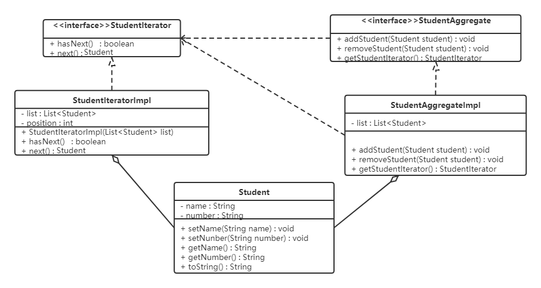

# 迭代器模式

## 1. 概述

**定义**：提供一个对象来顺序访问聚合对象中的一系列数据，而不暴露聚合对象的内部表示。

> [!TIP]
> 迭代器模式要解决的问题是：**遍历逻辑放在哪里**。如果把遍历逻辑写进聚合类，聚合类既要管存储又要管遍历，职责混乱；如果直接暴露内部结构让调用方自己遍历，内部表示就泄露了。迭代器把"怎么走"独立封装成一个对象，聚合类只管"怎么存"。

## 2. 结构

迭代器模式主要包含以下角色：

| 角色 | 职责 |
| --- | --- |
| 抽象聚合（Aggregate）角色 | 定义存储、添加、删除聚合元素以及创建迭代器对象的接口 |
| 具体聚合（ConcreteAggregate）角色 | 实现抽象聚合类，返回一个具体迭代器的实例 |
| 抽象迭代器（Iterator）角色 | 定义访问和遍历聚合元素的接口，通常包含 `hasNext()`、`next()` 等方法 |
| 具体迭代器（ConcreteIterator）角色 | 实现抽象迭代器接口中所定义的方法，完成对聚合对象的遍历，记录遍历的当前位置 |

## 3. 案例实现

【例】定义一个可以存储学生对象的容器对象，将遍历该容器的功能交由迭代器实现，涉及到的类如下：



代码如下。

定义迭代器接口，声明 `hasNext`、`next` 方法：

```java
public interface StudentIterator {
    boolean hasNext();
    Student next();
}
```

定义具体的迭代器类，重写所有的抽象方法：

```java
public class StudentIteratorImpl implements StudentIterator {
    private List<Student> list;
    private int position = 0;

    public StudentIteratorImpl(List<Student> list) {
        this.list = list;
    }

    @Override
    public boolean hasNext() {
        return position < list.size();
    }

    @Override
    public Student next() {
        Student currentStudent = list.get(position);
        position++;
        return currentStudent;
    }
}
```

定义抽象容器类，包含添加元素、删除元素、获取迭代器对象的方法：

```java
public interface StudentAggregate {
    void addStudent(Student student);

    void removeStudent(Student student);

    StudentIterator getStudentIterator();
}
```

定义具体的容器类，重写所有的方法：

```java
import java.util.ArrayList;
import java.util.List;

public class StudentAggregateImpl implements StudentAggregate {

    // 学生列表
    private List<Student> list = new ArrayList<Student>();

    @Override
    public void addStudent(Student student) {
        this.list.add(student);
    }

    @Override
    public void removeStudent(Student student) {
        this.list.remove(student);
    }

    @Override
    public StudentIterator getStudentIterator() {
        return new StudentIteratorImpl(list);
    }
}
```

## 4. 优缺点

### 4.1 优点

- 它支持以不同的方式遍历一个聚合对象，在同一个聚合对象上可以定义多种遍历方式。在迭代器模式中只需要用一个不同的迭代器来替换原有迭代器即可改变遍历算法，我们也可以自己定义迭代器的子类以支持新的遍历方式；
- 迭代器简化了聚合类。由于引入了迭代器，在原有的聚合对象中不需要再自行提供数据遍历等方法，这样可以简化聚合类的设计；
- 在迭代器模式中，由于引入了抽象层，增加新的聚合类和迭代器类都很方便，无须修改原有代码，满足"开闭原则"的要求。

### 4.2 缺点

增加了类的个数，这在一定程度上增加了系统的复杂性。

## 5. 使用场景

- 当需要为聚合对象提供多种遍历方式时；
- 当需要为遍历不同的聚合结构提供一个统一的接口时；
- 当访问一个聚合对象的内容而无须暴露其内部细节的表示时。

## 6. JDK 源码解析

迭代器模式在 Java 的很多集合类中被广泛应用，接下来看看 Java 源码中是如何使用迭代器模式的。

```java
List<String> list = new ArrayList<>();
Iterator<String> iterator = list.iterator(); // list.iterator()方法返回的肯定是Iterator接口的子实现类对象
while (iterator.hasNext()) {
    System.out.println(iterator.next());
}
```

看完这段代码是不是很熟悉，与我们上面代码基本类似。单列集合都使用到了迭代器，我们以 `ArrayList` 举例来说明。

各角色对应关系如下：

| 角色 | 对应的类 |
| --- | --- |
| 抽象聚合类 | `List` |
| 具体的聚合类 | `ArrayList` |
| 抽象迭代器 | `Iterator` |
| 具体迭代器 | `list.iterator()` 返回的对象 |

具体的来看看 `ArrayList` 的代码实现：

```java
public class ArrayList<E> extends AbstractList<E>
        implements List<E>, RandomAccess, Cloneable, java.io.Serializable {

    public Iterator<E> iterator() {
        return new Itr();
    }

    private class Itr implements Iterator<E> {
        int cursor;       // 下一个要返回元素的索引
        int lastRet = -1; // 上一个返回元素的索引
        int expectedModCount = modCount;

        Itr() {}

        // 判断是否还有元素
        public boolean hasNext() {
            return cursor != size;
        }

        // 获取下一个元素
        public E next() {
            checkForComodification();
            int i = cursor;
            if (i >= size)
                throw new NoSuchElementException();
            Object[] elementData = ArrayList.this.elementData;
            if (i >= elementData.length)
                throw new ConcurrentModificationException();
            cursor = i + 1;
            return (E) elementData[lastRet = i];
        }
        // ...
    }
}
```

这部分代码还是比较简单，大致就是在 `iterator` 方法中返回了一个实例化的 `Iterator` 对象。`Itr` 是一个内部类，它实现了 `Iterator` 接口并重写了其中的抽象方法。

> [!NOTE]
> 当我们在使用 Java 开发的时候，想使用迭代器模式的话，只要让我们自己定义的容器类实现 `java.lang.Iterable`，并实现其中的 `iterator()` 方法，使其返回一个 `java.util.Iterator` 的实现类就可以了。此外，遍历过程中如果集合被并发修改，`next()` 里的 `checkForComodification()` 会抛出 `ConcurrentModificationException`（fail-fast 机制），这也是 `for-each` 循环中不能直接增删元素的原因。
