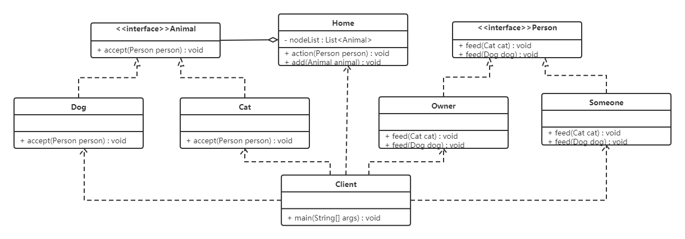
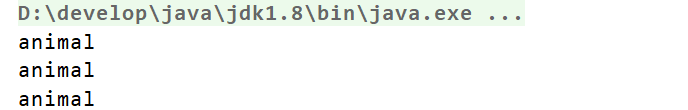
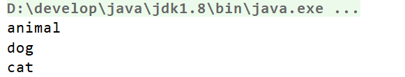

# 访问者模式

## 1. 概述

**定义**：封装一些作用于某种数据结构中的各元素的操作，它可以在不改变这个数据结构的前提下定义作用于这些元素的新的操作。

> [!TIP]
> 访问者模式解决的是"**结构稳定、操作多变**"的矛盾：数据结构（元素种类）基本不动，而针对这些元素的操作却经常要加新的。把每个新操作封装成一个访问者类，元素只需要提供一个 `accept` 入口，加操作就不用改元素类——但代价是加新元素类型时，所有访问者都得跟着改。

## 2. 结构

访问者模式包含以下主要角色：

| 角色 | 职责 |
| --- | --- |
| 抽象访问者（Visitor）角色 | 定义了对每一个元素（Element）访问的行为，它的参数就是可以访问的元素。它的方法个数理论上与元素类个数（Element 的实现类个数）是一样的，从这点不难看出，访问者模式要求元素类的个数不能改变 |
| 具体访问者（ConcreteVisitor）角色 | 给出对每一个元素类访问时所产生的具体行为 |
| 抽象元素（Element）角色 | 定义了一个接受访问者的方法 `accept`，其意义是指每一个元素都要可以被访问者访问 |
| 具体元素（ConcreteElement）角色 | 提供接受访问方法的具体实现，而这个具体的实现，通常情况下是使用访问者提供的访问该元素类的方法 |
| 对象结构（Object Structure）角色 | 一个具有容器性质或者复合对象特性的类，它会含有一组元素（Element），并且可以迭代这些元素，供访问者访问 |

## 3. 案例实现

【例】给宠物喂食。

现在养宠物的人特别多，我们就以这个为例。当然宠物还分为狗、猫等，要给宠物喂食的话，主人可以喂，其他人也可以喂食。

- 访问者角色：给宠物喂食的人；
- 具体访问者角色：主人、其他人；
- 抽象元素角色：动物抽象类；
- 具体元素角色：宠物狗、宠物猫；
- 结构对象角色：主人家。

类图如下：



代码如下。

创建抽象访问者接口：

```java
public interface Person {
    void feed(Cat cat);

    void feed(Dog dog);
}
```

创建不同的具体访问者角色（主人和其他人），都需要实现 `Person` 接口：

```java
public class Owner implements Person {

    @Override
    public void feed(Cat cat) {
        System.out.println("主人喂食猫");
    }

    @Override
    public void feed(Dog dog) {
        System.out.println("主人喂食狗");
    }
}
```

```java
public class Someone implements Person {

    @Override
    public void feed(Cat cat) {
        System.out.println("其他人喂食猫");
    }

    @Override
    public void feed(Dog dog) {
        System.out.println("其他人喂食狗");
    }
}
```

定义抽象节点——宠物：

```java
public interface Animal {
    void accept(Person person);
}
```

定义实现 `Animal` 接口的具体节点（元素）：

```java
public class Dog implements Animal {

    @Override
    public void accept(Person person) {
        person.feed(this);
        System.out.println("好好吃，汪汪！！！");
    }
}

public class Cat implements Animal {

    @Override
    public void accept(Person person) {
        person.feed(this);
        System.out.println("好好吃，喵喵！！！");
    }
}
```

定义对象结构，此案例中就是主人的家：

```java
import java.util.ArrayList;
import java.util.List;

public class Home {
    private List<Animal> nodeList = new ArrayList<Animal>();

    public void action(Person person) {
        for (Animal node : nodeList) {
            node.accept(person);
        }
    }

    // 添加操作
    public void add(Animal animal) {
        nodeList.add(animal);
    }
}
```

测试类：

```java
public class Client {
    public static void main(String[] args) {
        Home home = new Home();
        home.add(new Dog());
        home.add(new Cat());

        Owner owner = new Owner();
        home.action(owner);

        Someone someone = new Someone();
        home.action(someone);
    }
}
```

运行结果如下：

```text
主人喂食狗
好好吃，汪汪！！！
主人喂食猫
好好吃，喵喵！！！
其他人喂食狗
好好吃，汪汪！！！
其他人喂食猫
好好吃，喵喵！！！
```

## 4. 优缺点

### 4.1 优点

- **扩展性好**：在不修改对象结构中的元素的情况下，为对象结构中的元素添加新的功能；
- **复用性好**：通过访问者来定义整个对象结构通用的功能，从而提高复用程度；
- **分离无关行为**：通过访问者来分离无关的行为，把相关的行为封装在一起，构成一个访问者，这样每一个访问者的功能都比较单一。

### 4.2 缺点

- **对象结构变化很困难**：在访问者模式中，每增加一个新的元素类，都要在每一个具体访问者类中增加相应的具体操作，这违背了"开闭原则"；
- **违反了依赖倒置原则**：访问者模式依赖了具体类，而没有依赖抽象类。

## 5. 使用场景

- 对象结构相对稳定，但其操作算法经常变化的程序；
- 对象结构中的对象需要提供多种不同且不相关的操作，而且要避免让这些操作的变化影响对象的结构。

## 6. 扩展：双分派

访问者模式用到了一种双分派（Double Dispatch）的技术。

### 6.1 分派

变量被声明时的类型叫做变量的**静态类型**，有些人又把静态类型叫做明显类型；而变量所引用的对象的真实类型又叫做变量的**实际类型**。比如 `Map map = new HashMap()`，`map` 变量的静态类型是 `Map`，实际类型是 `HashMap`。根据对象的类型而对方法进行的选择，就是分派（Dispatch），分派又分为两种，即静态分派和动态分派。

- **静态分派（Static Dispatch）**：发生在编译时期，分派根据静态类型信息发生。静态分派对于我们来说并不陌生，方法重载就是静态分派；
- **动态分派（Dynamic Dispatch）**：发生在运行时期，动态分派动态地置换掉某个方法。Java 通过方法的重写支持动态分派。

### 6.2 动态分派

通过方法的重写支持动态分派。

```java
public class Animal {
    public void execute() {
        System.out.println("Animal");
    }
}

public class Dog extends Animal {
    @Override
    public void execute() {
        System.out.println("dog");
    }
}

public class Cat extends Animal {
    @Override
    public void execute() {
        System.out.println("cat");
    }
}
```

```java
public class Client {
    public static void main(String[] args) {
        Animal a = new Dog();
        a.execute();

        Animal a1 = new Cat();
        a1.execute();
    }
}
```

上面代码的结果大家应该直接可以说出来，这不就是多态吗！运行执行的是子类中的方法。

Java 编译器在编译时期并不总是知道哪些代码会被执行，因为编译器仅仅知道对象的静态类型，而不知道对象的真实类型；而方法的调用则是根据对象的真实类型，而不是静态类型。

### 6.3 静态分派

通过方法重载支持静态分派。

```java
public class Animal {
}

public class Dog extends Animal {
}

public class Cat extends Animal {
}
```

```java
public class Execute {
    public void execute(Animal a) {
        System.out.println("Animal");
    }

    public void execute(Dog d) {
        System.out.println("dog");
    }

    public void execute(Cat c) {
        System.out.println("cat");
    }
}
```

```java
public class Client {
    public static void main(String[] args) {
        Animal a = new Animal();
        Animal a1 = new Dog();
        Animal a2 = new Cat();

        Execute exe = new Execute();
        exe.execute(a);
        exe.execute(a1);
        exe.execute(a2);
    }
}
```

运行结果：



这个结果可能出乎一些人的意料了，为什么呢？

**重载方法的分派是根据静态类型进行的，这个分派过程在编译时期就完成了。**

### 6.4 双分派

所谓双分派技术就是在选择一个方法的时候，不仅仅要根据消息接收者（receiver）的运行时区别，还要根据参数的运行时区别。

```java
public class Animal {
    public void accept(Execute exe) {
        exe.execute(this);
    }
}

public class Dog extends Animal {
    @Override
    public void accept(Execute exe) {
        exe.execute(this);
    }
}

public class Cat extends Animal {
    @Override
    public void accept(Execute exe) {
        exe.execute(this);
    }
}
```

```java
public class Execute {
    public void execute(Animal a) {
        System.out.println("animal");
    }

    public void execute(Dog d) {
        System.out.println("dog");
    }

    public void execute(Cat c) {
        System.out.println("cat");
    }
}
```

```java
public class Client {
    public static void main(String[] args) {
        Animal a = new Animal();
        Animal d = new Dog();
        Animal c = new Cat();

        Execute exe = new Execute();
        a.accept(exe);
        d.accept(exe);
        c.accept(exe);
    }
}
```

在上面代码中，客户端将 `Execute` 对象作为参数传递给 `Animal` 类型变量调用的方法，这里完成第一次分派——这里是方法重写，所以是动态分派，也就是执行实际类型中的方法；同时将 `this` 作为参数传递进去，这里就完成了第二次分派——`Execute` 类中有多个重载的方法，而传递进去的是 `this`，也就是具体的实际类型的对象。

运行结果如下：



**双分派实现动态绑定的本质，就是在重载方法委派的前面加上了继承体系中覆盖的环节，由于覆盖是动态的，所以重载就是动态的了。**

> [!NOTE]
> 回头看宠物喂食的案例就明白了：`animal.accept(person)` 完成了第一次动态分派（确定是猫还是狗在 accept），`person.feed(this)` 里的 `this` 已经是实际类型，重载方法因此能按实际类型被选中——访问者模式正是靠 `accept` 这个中间跳板，绕开了 Java"重载看静态类型"的限制。
