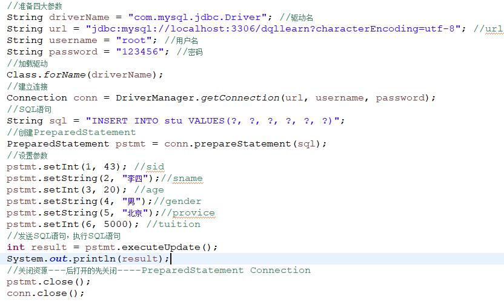
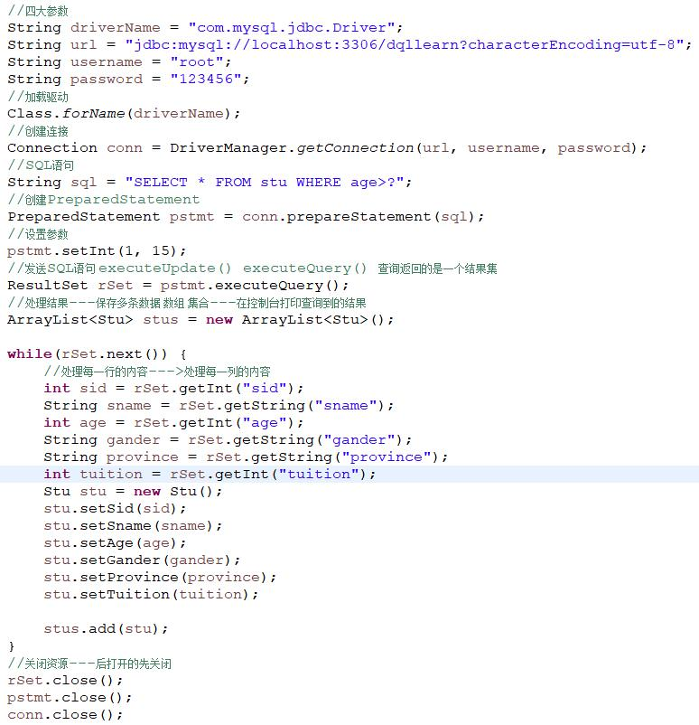
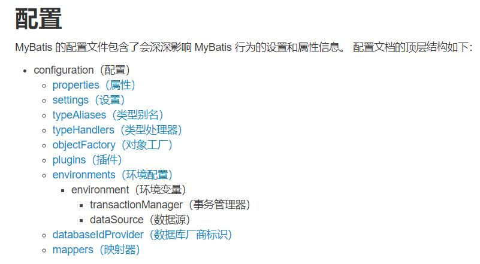

# MyBatis快速入门

本篇整理 MyBatis 的入门内容：先分析 JDBC 开发存在的问题，再介绍 MyBatis 与 ORM 思想，最后完成环境搭建，并用映射文件与核心配置文件实现一套完整的增删改查。

## 1. MyBatis简介

### 1.1 JDBC操作（插入数据）



### 1.2 JDBC操作（查询数据）



### 1.3 JDBC操作的分析

**JDBC 开发存在的问题**：

- 代码存在大量重复操作；
- 数据库连接创建、释放频繁造成系统资源浪费，从而影响系统性能；
- SQL 语句在代码中硬编码，造成代码不易维护；实际应用中 SQL 变化的可能较大，SQL 变动需要修改 Java 代码；
- 查询操作时，需要手动将结果集中的数据封装到实体中；插入操作时，需要手动将实体的数据设置到 SQL 语句的占位符位置。

**对应的解决方案**：

| 问题 | 解决方案 |
| --- | --- |
| 代码存在大量重复操作 | 使用工具类对相同的操作进行抽取 |
| 连接频繁创建、释放，浪费资源 | 使用数据库连接池初始化连接资源（C3P0、Druid） |
| SQL 硬编码在 Java 代码中 | 将 SQL 语句抽取到 XML 配置文件中 |
| 结果集与实体手动互转 | 使用反射、内省等底层技术，实现对象属性和表字段的自动映射 |

按照这套思路落地出来的具体技术就是 **Hibernate** 和 **MyBatis**。

### 1.4 MyBatis是什么

MyBatis 是一个优秀的基于 Java 的**持久层框架**，它内部封装了 JDBC，使开发者只需要关注 SQL 语句本身，而不需要花费精力去处理加载驱动、创建连接、创建 statement 等繁杂的过程。

MyBatis 通过 XML 或注解的方式将要执行的各种 statement 配置起来，并通过 Java 对象和 statement 中 SQL 的动态参数进行映射，生成最终执行的 SQL 语句。

最后 MyBatis 框架执行 SQL 并将结果映射为 Java 对象返回。它**采用 ORM 思想**解决了实体和数据库映射的问题，对 JDBC 进行了封装，屏蔽了 JDBC API 底层访问细节，使我们不用与 JDBC API 打交道，就可以完成对数据库的持久化操作。

简单说就是：有一种叫 MyBatis 的持久层技术，能够代替 JDBC，简化 JDBC 开发。

#### 1.4.1 ORM

**对象关系映射**（Object Relational Mapping，简称 ORM，或 O/RM、O/R Mapping），是一种程序设计技术，用于实现面向对象编程语言里不同类型系统的数据之间的转换。从效果上说，它其实是创建了一个可在编程语言里使用的"虚拟对象数据库"。

简单说：**就是把数据库表和实体类及实体类的属性对应起来，让我们可以操作实体类就实现操作数据库表。**

| 数据库 | 实体类 |
| :---: | :---: |
| user 表 | User 类 |
| id 列 | id 属性 |
| username 列 | userName 属性 |
| age 列 | age 属性 |

## 2. MyBatis快速入门

### 2.1 MyBatis开发步骤

MyBatis 官网地址：<http://www.mybatis.org/mybatis-3/>

开发步骤如下：

1. 新建 Maven 项目，导入相关依赖；
2. 创建 user 表；
3. 编写 User 实体类；
4. 编写映射文件 UserMapper.xml；
5. 编写核心配置文件 SqlMapConfig.xml；
6. 编写测试类；
7. 测试。

### 2.2 环境搭建

#### 2.2.1 新建项目，导入相关Jar包

MyBatis 是一种持久化技术，在普通 Java 项目和 JavaWeb 项目中都可以使用，这里我们新建一个普通 Maven 项目就可以。

新建 Maven 项目，导入相关依赖：

```xml
<dependencies>
    <dependency>
        <groupId>mysql</groupId>
        <artifactId>mysql-connector-java</artifactId>
        <version>5.1.49</version>
    </dependency>
    <dependency>
        <groupId>org.mybatis</groupId>
        <artifactId>mybatis</artifactId>
        <version>3.4.6</version>
    </dependency>
    <dependency>
        <groupId>junit</groupId>
        <artifactId>junit</artifactId>
        <version>4.13</version>
        <scope>test</scope>
    </dependency>
    <!-- log4j依赖 -->
    <dependency>
        <groupId>log4j</groupId>
        <artifactId>log4j</artifactId>
        <version>1.2.17</version>
    </dependency>
</dependencies>
```

#### 2.2.2 创建user表

> [!NOTE]
> 注意设置 id 自增。

```sql
CREATE TABLE `user`  (
  `id` bigint(20) NOT NULL AUTO_INCREMENT,
  `username` varchar(30) CHARACTER SET utf8 COLLATE utf8_general_ci NULL DEFAULT NULL,
  `password` varchar(30) CHARACTER SET utf8 COLLATE utf8_general_ci NULL DEFAULT NULL,
  `age` int(11) NULL DEFAULT NULL,
  `gender` varchar(6) CHARACTER SET utf8 COLLATE utf8_general_ci NULL DEFAULT NULL,
  `addr` varchar(50) CHARACTER SET utf8 COLLATE utf8_general_ci NULL DEFAULT NULL,
  PRIMARY KEY (`id`) USING BTREE
) ENGINE = InnoDB AUTO_INCREMENT = 11 CHARACTER SET = utf8 COLLATE = utf8_general_ci ROW_FORMAT = COMPACT;

INSERT INTO `user` VALUES (1, 'zhangsan', '123', 20, 'male', 'qd');
INSERT INTO `user` VALUES (2, 'lisi', '123', 21, 'male', 'bj');
INSERT INTO `user` VALUES (4, 'tom', '123', 19, 'male', 'nj');
INSERT INTO `user` VALUES (5, 'wangwu', '123', 20, 'male', 'sh');
INSERT INTO `user` VALUES (6, 'weihua', '111', 21, 'female', 'sz');
```

#### 2.2.3 编写User实体类

```java
/**
 * 表示用户的实体类
 *
 * 属性名和数据库表字段名对应
 *
 * 符合JavaBean的规范
 */
public class User {
    private Long id;
    private String username;
    private String password;
    private Integer age;
    private String gender;
    private String addr;

    // set和get方法
    // toString方法
}
```

#### 2.2.4 编写映射文件UserMapper.xml

> [!NOTE]
> 该文件放在 `resources` 目录下的 `mappers` 文件夹下。

```xml
<?xml version="1.0" encoding="UTF-8" ?>
<!DOCTYPE mapper
        PUBLIC "-//mybatis.org//DTD Mapper 3.0//EN"
        "http://mybatis.org/dtd/mybatis-3-mapper.dtd">
<mapper namespace="userMapper">
    <select id="findAll" resultType="com.qfedu.bean.User">
        SELECT * FROM user
    </select>
</mapper>
```

#### 2.2.5 编写核心配置文件SqlMapConfig.xml

> [!NOTE]
> 该文件放在 `resources` 目录下。

```xml
<?xml version="1.0" encoding="UTF-8" ?>
<!DOCTYPE configuration
        PUBLIC "-//mybatis.org//DTD Config 3.0//EN"
        "http://mybatis.org/dtd/mybatis-3-config.dtd">
<configuration>
    <!-- 配置环境 -->
    <environments default="dev">
        <environment id="dev">
            <transactionManager type="JDBC"></transactionManager>
            <dataSource type="POOLED">
                <property name="driver" value="com.mysql.jdbc.Driver" />
                <property name="url" value="jdbc:mysql://localhost:3306/test?useSSL=false" />
                <property name="username" value="root" />
                <property name="password" value="root" />
            </dataSource>
        </environment>
    </environments>

    <!-- 加载映射配置文件 -->
    <mappers>
        <mapper resource="mappers/UserMapper.xml" />
    </mappers>

</configuration>
```

#### 2.2.6 编写日志配置文件

日志配置文件为 `log4j.properties`，放在 `resources` 目录下：

```properties
### direct log messages to stdout ###
log4j.appender.stdout=org.apache.log4j.ConsoleAppender
log4j.appender.stdout.Target=System.err
log4j.appender.stdout.layout=org.apache.log4j.PatternLayout
log4j.appender.stdout.layout.ConversionPattern=%d{ABSOLUTE} %5p %c{1}:%L - %m%n

### set log levels - for more verbose logging change 'info' to 'debug' ###
log4j.rootLogger=debug, stdout
```

这个文件编写不需要掌握，用的时候直接拷贝即可。

日志的输出级别从低到高排列如下：

| 级别 | 描述 |
| :---: | :--- |
| ALL | 打开所有日志记录开关；是最低等级的，用于打开所有日志记录 |
| DEBUG | 输出调试信息；指出细粒度信息事件对调试应用程序是非常有帮助的 |
| INFO | 输出提示信息；消息在粗粒度级别上突出强调应用程序的运行过程 |
| WARN | 输出警告信息；表明会出现潜在错误的情形 |
| ERROR | 输出错误信息；指出虽然发生错误事件，但仍然不影响系统的继续运行 |
| FATAL | 输出致命错误；指出每个严重的错误事件将会导致应用程序的退出 |
| OFF | 关闭所有日志记录开关；是最高等级的，用于关闭所有日志记录 |

### 2.3 编写测试代码

```java
public class MyTest {
    @Test
    public void test1() throws IOException {
        // 加载核心配置文件
        InputStream stream = Resources.getResourceAsStream("SqlMapConfig.xml");
        // 获得sqlSession工厂对象
        SqlSessionFactory factory = new SqlSessionFactoryBuilder().build(stream);
        // 获得sqlSession对象
        SqlSession sqlSession = factory.openSession();
        // 执行sql语句
        List<User> list = sqlSession.selectList("userMapper.findAll");
        // 打印结果
        list.forEach(System.out::println);
        // 释放资源
        sqlSession.close();
    }
}
```

> [!TIP]
> 运行测试方法，测试通过。

## 3. MyBatis映射文件概述

```xml
<?xml version="1.0" encoding="UTF-8" ?>
<!-- 映射文件DTD约束，用来约束XML中的标签，直接从素材中拷贝就可以，不需要去记。 -->
<!DOCTYPE mapper
        PUBLIC "-//mybatis.org//DTD Mapper 3.0//EN"
        "http://mybatis.org/dtd/mybatis-3-mapper.dtd">
<!-- 映射文件的根标签，其他的内容都要写在该标签的内部
    namespace：命名空间，与下面语句的id一起组成查询的标识，唯一地确定要执行的SQL语句
-->
<mapper namespace="userMapper">
    <!-- select标签表示这是一个查询操作，除了这个标签还可以有insert、delete、update
        id：语句的id，和上面的namespace一起组成查询的标识，唯一地确定要执行的SQL语句
        resultType：查询结果对应的实体类型，目前这里先写全类名（包名+类名）
    -->
    <select id="findAll" resultType="com.qfedu.bean.User">
        <!-- SQL语句 -->
        SELECT * FROM user
    </select>
</mapper>
```

> [!NOTE]
> 关于映射文件，目前先了解这些就可以，还有其他的配置后面再讲解。

## 4. MyBatis进行增删改查操作

### 4.1 插入数据

#### 4.1.1 编写UserMapper映射文件

```xml
<!--
    插入操作使用insert标签
    parameterType：指定要插入的数据类型，这里暂时写全类名
-->
<insert id="add" parameterType="com.qfedu.bean.User">
    <!-- #{xxx}：使用实体中的xxx属性值 -->
    insert into user(username, password, age, gender, addr)
    values(#{username}, #{password}, #{age}, #{gender}, #{addr})
</insert>
```

#### 4.1.2 提取出测试类中的公共代码

```java
private SqlSession sqlSession;

@Before
public void init() throws IOException {
    // 加载核心配置文件
    InputStream stream = Resources.getResourceAsStream("SqlMapConfig.xml");
    // 获得sqlSession工厂对象
    SqlSessionFactory factory = new SqlSessionFactoryBuilder().build(stream);
    // 获得sqlSession对象
    sqlSession = factory.openSession();
}

@After
public void destroy() {
    // 释放资源
    sqlSession.close();
}
```

#### 4.1.3 编写插入实体User的代码

```java
@Test
public void testInsert() {
    // 创建User实体
    User user = new User();
    user.setUsername("admin");
    user.setPassword("123456");
    user.setAge(22);
    user.setGender("male");
    user.setAddr("qd");
    // 执行SQL语句
    sqlSession.insert("userMapper.add", user);
    // 提交事务
    // 插入操作涉及数据库的变化，要手动提交事务
    sqlSession.commit();
}
```

### 4.2 删除数据

#### 4.2.1 编写UserMapper映射文件

```xml
<!-- 删除操作使用delete标签
    #{任意字符串}方式引用传递的单个参数，如果传入的参数只有一个，大括号中的内容可以随意写，我们最好见名知意
-->
<delete id="delete" parameterType="java.lang.Integer">
    DELETE FROM user WHERE id=#{id}
</delete>
```

#### 4.2.2 编写删除数据的代码

```java
@Test
public void testDelete() {
    sqlSession.delete("userMapper.delete", 3);
    sqlSession.commit();
}
```

### 4.3 修改数据

#### 4.3.1 编写UserMapper映射文件

```xml
<update id="chg" parameterType="com.qfedu.bean.User">
    UPDATE user SET username=#{username}, password=#{password} WHERE id=#{id}
</update>
```

#### 4.3.2 编写修改数据的代码

```java
@Test
public void testUpdate() {
    User user = new User();
    user.setId(2L);
    user.setUsername("peter");
    user.setPassword("123");
    sqlSession.update("userMapper.chg", user);
    sqlSession.commit();
}
```

### 4.4 总结

增删改查的实现方式可以概括为：**映射配置 + API**。映射文件里用 `select`、`insert`、`delete`、`update` 标签描述 SQL，测试代码里通过 `sqlSession` 对应的 API 调用 `"namespace.id"` 执行。

## 5. MyBatis核心配置文件

### 5.1 MyBatis配置文件层次关系



> [!WARNING]
> 配置相关标签必须按照上图中的顺序书写，不然程序无法正常运行。

### 5.2 核心配置文件常用配置解析

#### 5.2.1 environments标签

该标签用来配置数据库环境，支持多环境配置。

```xml
<!-- 配置环境
     default：指定默认环境，如果下面配置了多个environment，通过default属性的值指定使用哪个环境
-->
<environments default="dev">
    <!-- id：环境的id -->
    <environment id="dev">
        <!-- type：事务管理器类型，类型有如下两种。
            JDBC：直接使用JDBC的提交和回滚设置，它依赖于从数据源得到的连接来管理事务作用域。
            MANAGED：这个配置几乎没做什么。它从来不提交或回滚一个连接，而是让容器来管理事务的整个生命周期。
                默认情况下它会关闭连接，然而一些容器并不希望这样，因此需要将closeConnection属性设置
                为false来阻止它默认的关闭行为。
        -->
        <transactionManager type="JDBC"></transactionManager>
        <!-- type：指定数据源类型，类型有如下三种。
            UNPOOLED：这个数据源的实现只是每次被请求时打开和关闭连接。
            POOLED：这种数据源的实现利用"池"的概念将 JDBC 连接对象组织起来。
            JNDI：这个数据源的实现是为了能在如EJB或应用服务器这类容器中使用，
                容器可以集中或在外部配置数据源，然后放置一个 JNDI 上下文的引用。
        -->
        <dataSource type="POOLED">
            <!-- 配置数据源的基本参数 -->
            <property name="driver" value="com.mysql.jdbc.Driver" />
            <property name="url" value="jdbc:mysql://localhost:3306/test?useSSL=false&amp;useUnicode=true&amp;characterEncoding=utf8" />
            <property name="username" value="root" />
            <property name="password" value="root" />
        </dataSource>
    </environment>
</environments>
```

#### 5.2.2 mapper标签

该标签的作用是加载映射文件，加载方式有如下几种。

使用相对于类路径的资源引用，例如：

```xml
<mapper resource="org/mybatis/builder/AuthorMapper.xml"/>
```

使用完全限定资源定位符（URL），例如：

```xml
<mapper url="file:///var/mappers/AuthorMapper.xml"/>
```

使用映射器接口实现类的完全限定类名，例如：

```xml
<mapper class="org.mybatis.builder.AuthorMapper"/>
```

将包内的映射器接口实现全部注册为映射器，例如：

```xml
<package name="org.mybatis.builder"/>
```

#### 5.2.3 properties标签

实际开发中，习惯将数据源的配置信息单独抽取成一个 properties 文件，该标签可以加载额外配置的 properties 文件。

创建配置数据源的配置文件 `jdbc.properties`：

```properties
jdbc.driver=com.mysql.jdbc.Driver
jdbc.url=jdbc:mysql://localhost:3306/test?useSSL=false
jdbc.username=root
jdbc.password=root
```

修改核心配置文件：

```xml
<!-- 引入外部配置文件 -->
<properties resource="jdbc.properties" />

<!-- 配置环境 -->
<environments default="dev">
    <environment id="dev">
        <transactionManager type="JDBC"></transactionManager>
        <dataSource type="POOLED">
            <!-- 使用${key}引用properties文件中的值 -->
            <property name="driver" value="${jdbc.driver}" />
            <property name="url" value="${jdbc.url}" />
            <property name="username" value="${jdbc.username}" />
            <property name="password" value="${jdbc.password}" />
        </dataSource>
    </environment>
</environments>
```

#### 5.2.4 typeAliases标签

##### 5.2.4.1 如何设置别名

配置类型别名，为全类名设置一个短名字。

写法一：

```xml
<!-- 配置别名 -->
<typeAliases>
    <typeAlias type="com.qfedu.bean.User" alias="user" />
</typeAliases>
```

通过上面的配置为 `com.qfedu.bean` 包下的 User 类起了一个别名 `user`。这种写法需要为每个类分别设置别名，如果类很多，这里的配置会很繁琐。

写法二：

```xml
<!-- 配置别名 -->
<typeAliases>
    <package name="com.qfedu.bean"/>
</typeAliases>
```

这种写法为 `com.qfedu.bean` 包下的所有类设置别名，别名为类名的首字母小写。

##### 5.2.4.2 如何使用别名

```xml
<select id="findAll" resultType="user">
    SELECT * FROM user
</select>
<update id="chg" parameterType="user">
    UPDATE user SET username=#{username}, password=#{password} WHERE id=#{id}
</update>
```

##### 5.2.4.3 MyBatis预先设置好的别名

MyBatis 为常用类型预先设置好了别名，可以直接使用：

| 数据类型 | 别名 |
| :---: | :---: |
| java.lang.String | string |
| java.lang.Long | long |
| java.lang.Integer | int |
| java.lang.Double | double |
| …… | …… |

```xml
<delete id="delete" parameterType="int">
    DELETE FROM user WHERE id=#{id}
</delete>
```
