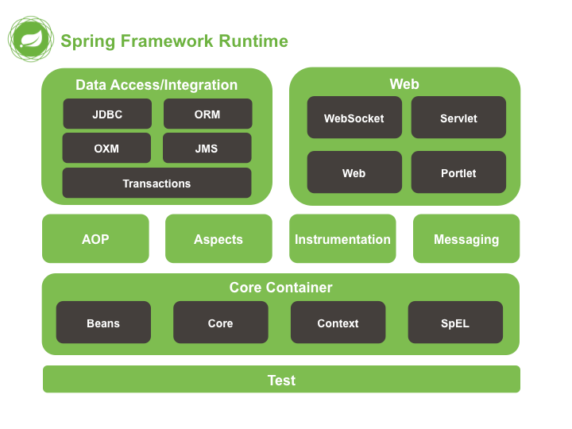

# SpringIOC和DI

本篇是 Spring 的入门篇：介绍 Spring 框架的概况与体系结构，完成第一个 Spring 程序，然后重点学习 Spring 配置文件（Bean 的配置、实例化方式、依赖注入），最后通过数据源案例体会用 Spring 管理第三方对象的完整过程。

## 1. Spring概述

### 1.1 Spring是什么

Spring 是分层的 Java SE/EE 应用 full-stack 轻量级开源框架，以 **IOC**（Inverse Of Control，反转控制）和 **AOP**（Aspect Oriented Programming，面向切面编程）为内核。

Spring 提供了表现层 SpringMVC 和持久层 Spring JDBCTemplate 以及业务层事务管理等众多的企业级应用技术，还能整合开源世界众多著名的第三方框架和类库，逐渐成为使用最多的 Java EE 企业应用开源框架。

### 1.2 Spring发展历程（了解）

EJB 的发展历程如下：

| 年份 | 事件 |
| --- | --- |
| 1997 | IBM 提出 EJB 的思想 |
| 1998 | SUN 制定开发标准规范 EJB 1.0 |
| 1999 | EJB 1.1 发布 |
| 2001 | EJB 2.0 发布 |
| 2003 | EJB 2.1 发布 |
| 2006 | EJB 3.0 发布 |

**Rod Johnson（Spring 之父）**：

- Expert One-to-One J2EE Design and Development（2002）：阐述了 J2EE 使用 EJB 开发设计的优点及解决方案；
- Expert One-to-One J2EE Development without EJB（2004）：阐述了 J2EE 开发不使用 EJB 的解决方式（Spring 雏形）。


### 1.3 Spring的优势

**1）方便解耦，简化开发**

通过 Spring 提供的 IOC 容器，可以将对象间的依赖关系交由 Spring 进行控制，避免硬编码所造成的过度耦合。用户也不必再为单例模式类、属性文件解析等这些很底层的需求编写代码，可以更专注于上层的应用。

**2）AOP 编程的支持**

通过 Spring 的 AOP 功能，方便进行面向切面编程，许多不容易用传统 OOP 实现的功能可以通过 AOP 轻松实现。

**3）声明式事务的支持**

可以将我们从单调烦闷的事务管理代码中解脱出来，通过声明式方式灵活地进行事务管理，提高开发效率和质量。

**4）方便程序的测试**

可以用非容器依赖的编程方式进行几乎所有的测试工作，测试不再是昂贵的操作，而是随手可做的事情。

### 1.4 Spring的体系结构



## 2. Spring快速入门

### 2.1 Spring程序开发步骤

1. 新建 Maven 工程并添加相关依赖；
2. 编写接口和实现类；
3. 编写 Spring 核心配置文件；
4. 编写测试类进行测试。

### 2.2 新建Maven工程并添加相关依赖

`pom.xml` 中依赖如下：

```xml
<dependencies>
    <dependency>
        <groupId>org.springframework</groupId>
        <artifactId>spring-context</artifactId>
        <version>5.2.6.RELEASE</version>
    </dependency>
    <dependency>
        <groupId>org.springframework</groupId>
        <artifactId>spring-core</artifactId>
        <version>5.2.6.RELEASE</version>
    </dependency>
    <dependency>
        <groupId>org.springframework</groupId>
        <artifactId>spring-beans</artifactId>
        <version>5.2.6.RELEASE</version>
    </dependency>
    <dependency>
        <groupId>org.springframework</groupId>
        <artifactId>spring-expression</artifactId>
        <version>5.2.6.RELEASE</version>
    </dependency>
    <dependency>
        <groupId>junit</groupId>
        <artifactId>junit</artifactId>
        <version>4.13</version>
        <scope>test</scope>
    </dependency>
</dependencies>
```

### 2.3 编写接口和实现类

UserDao.java：

```java
public interface UserDao {
    void save();
}
```

UserDaoImpl.java：

```java
public class UserDaoImpl implements UserDao {
    @Override
    public void save() {
        System.out.println("save...");
    }
}
```

### 2.4 编写Spring核心配置文件

applicationContext.xml：

```xml
<?xml version="1.0" encoding="UTF-8"?>
<beans xmlns="http://www.springframework.org/schema/beans"
       xmlns:xsi="http://www.w3.org/2001/XMLSchema-instance"
       xsi:schemaLocation="http://www.springframework.org/schema/beans
       http://www.springframework.org/schema/beans/spring-beans.xsd">
    <!--
        通过bean标签，创建相应类型的对象，并将创建的对象交给Spring容器进行管理
    -->
    <bean id="userDao" class="com.qfedu.dao.impl.UserDaoImpl"></bean>
</beans>
```

### 2.5 编写测试类进行测试

```java
public class MyTest {

    @Test
    public void test() {
        // 加载配置文件，创建应用上下文对象
        ApplicationContext context = new ClassPathXmlApplicationContext("applicationContext.xml");
        // 获取对象
        UserDao userDao = (UserDao) context.getBean("userDao");
        userDao.save();
    }
}
```

运行测试方法，控制台输出 `save...`，说明对象已经由 Spring 容器创建并提供给我们使用了。

## 3. Spring配置文件

### 3.1 Bean标签基本配置

**作用**：通过配置将对象的创建交给 Spring 容器进行管理。

**注意**：默认情况下它调用的是类中的无参构造函数，如果没有无参构造函数则不能创建成功。

`<bean>` 标签的相关属性：

| 属性 | 说明 |
| --- | --- |
| id | Bean 实例在 Spring 容器中的唯一标识 |
| class | Bean 的全限定名称 |

### 3.2 Bean标签范围配置

`scope` 指对象的作用范围，取值如下：

| 取值范围 | 说明 |
| --- | --- |
| **singleton** | 默认值，单例的 |
| **prototype** | 多例的 |
| request | WEB 项目中，Spring 创建一个 Bean 的对象，将对象存入到 request 域中 |
| session | WEB 项目中，Spring 创建一个 Bean 的对象，将对象存入到 session 域中 |
| global session | WEB 项目中，应用在 Portlet 环境；如果没有 Portlet 环境，那么 globalSession 相当于 session |

**当 scope 的取值为 singleton 时**：

- Bean 的实例化个数：1 个；
- Bean 的实例化时机：当 Spring 核心配置文件被加载时，实例化配置的 Bean 实例；
- Bean 的生命周期：
  - 对象创建：当应用加载，创建容器时，对象就被创建了；
  - 对象运行：只要容器在，对象一直活着；
  - 对象销毁：当应用卸载，销毁容器时，对象就被销毁了。

**当 scope 的取值为 prototype 时**：

- Bean 的实例化个数：多个；
- Bean 的实例化时机：当调用 `getBean()` 方法时实例化 Bean；
- Bean 的生命周期：
  - 对象创建：当使用对象时，创建新的对象实例；
  - 对象运行：只要对象在使用中，就一直活着；
  - 对象销毁：当对象长时间不用时，被 Java 的垃圾回收器回收。

### 3.3 Bean生命周期配置

通过 `<bean>` 标签的两个属性可以干预 Bean 的生命周期：

| 属性 | 说明 |
| --- | --- |
| init-method | 指定类中的初始化方法名称 |
| destroy-method | 指定类中销毁方法名称 |

### 3.4 Bean实例化三种方式

#### 3.4.1 使用无参构造方法实例化

根据默认无参构造方法来创建类对象，如果 Bean 中没有默认无参构造函数，将会创建失败。

```xml
<bean id="userDao" class="com.qfedu.dao.impl.UserDaoImpl"/>
```

#### 3.4.2 工厂静态方法实例化

创建静态工厂：

```java
public class StaticBeanFactory {
    public static UserDao getUserDaoImpl() {
        return new UserDaoImpl();
    }
}
```

在 Spring 配置文件中配置：

```xml
<!-- 静态工厂初始化 -->
<bean id="userDao" class="com.qfedu.factory.StaticBeanFactory" factory-method="getUserDaoImpl"></bean>
```

测试：

```java
// 演示通过静态工厂创建Bean
@Test
public void test1() {
    ApplicationContext context = new ClassPathXmlApplicationContext("applicationContext.xml");
    UserDao userDao = (UserDao) context.getBean("userDao");
    userDao.save();
}
```

#### 3.4.3 工厂实例方法实例化

创建实例工厂（方法不是静态的，需要先创建工厂对象）：

```java
public class DynamicBeanFactory {
    public UserDao getUserDao() {
        return new UserDaoImpl();
    }
}
```

在 Spring 配置文件中配置：

```xml
<bean id="factory" class="com.qfedu.factory.DynamicBeanFactory"></bean>
<bean id="userDao" factory-bean="factory" factory-method="getUserDao"></bean>
```

测试：

```java
// 演示通过实例工厂创建Bean
@Test
public void test2() {
    ApplicationContext context = new ClassPathXmlApplicationContext("applicationContext.xml");
    UserDao userDao = (UserDao) context.getBean("userDao");
    userDao.save();
}
```

### 3.5 什么是依赖注入

**依赖注入**（Dependency Injection，DI）：指容器负责创建和维护对象之间的依赖关系，而不是由对象本身负责自己的创建和解决自己的依赖。当当前类需要用到其他类的对象时，由 Spring 为我们提供，我们只需要在配置中说明。

业务层和持久层的依赖关系，在使用 Spring 之后，就让 Spring 来维护了。简单地说，就是坐等框架把持久层对象传入业务层，而不用我们自己去获取。

### 3.6 依赖注入方式

#### 3.6.1 构造方法注入

1）创建接口 UserService 和实现类 UserServiceImpl：

```java
public interface UserService {
    void save();
}
```

```java
public class UserServiceImpl implements UserService {
    // 这里一定要有该属性，我们最终的目的是让该属性关联一个UserDaoImpl的对象
    private UserDao userDao;

    public UserServiceImpl() {
    }

    // 一定要有该有参的构造方法，通过该方法完成依赖注入
    public UserServiceImpl(UserDao userDao) {
        this.userDao = userDao;
    }

    @Override
    public void save() {
        userDao.save();
    }
}
```

2）在 Spring 配置文件中配置：

```xml
<bean id="userDao" class="com.qfedu.dao.impl.UserDaoImpl"></bean>

<bean id="userService" class="com.qfedu.service.impl.UserServiceImpl">
    <!-- 构造方法注入，通过ref将id为"userDao"的bean传递给了UserServiceImpl构造方法的userDao形参 -->
    <constructor-arg name="userDao" ref="userDao" />
</bean>
```

3）测试：

```java
@Test
public void test3() {
    ApplicationContext context = new ClassPathXmlApplicationContext("classpath:applicationContext.xml");
    UserService userService = (UserService) context.getBean("userService");
    userService.save();
}
```

#### 3.6.2 set方法注入（重点）

1）在 UserServiceImpl 中添加 set 方法：

```java
public class UserServiceImpl implements UserService {
    private UserDao userDao;

    public void setUserDao(UserDao userDao) {
        this.userDao = userDao;
    }

    @Override
    public void save() {
        userDao.save();
    }
}
```

2）在 Spring 配置文件中配置：

```xml
<bean id="userService" class="com.qfedu.service.impl.UserServiceImpl">
    <!-- set方法注入 -->
    <property name="userDao" ref="userDao"></property>
</bean>
```

3）测试方法同上。

#### 3.6.3 p名称空间注入

p 命名空间注入本质也是 set 方法注入，但比起上述的 set 方法注入更加方便，主要体现在配置文件中。

1）引入 p 命名空间：

```xml
xmlns:p="http://www.springframework.org/schema/p"
```

2）在 Spring 配置文件中配置：

```xml
<!-- p名称空间注入 -->
<bean id="userService" class="com.qfedu.service.impl.UserServiceImpl" p:userDao-ref="userDao"/>
```

### 3.7 依赖注入其他类型

上面的案例学习了如何注入引用类型的数据。除了引用数据类型，普通数据类型、集合数据类型也可以注入。

#### 3.7.1 普通数据类型注入

1）创建 Department 实体类：

```java
// 表示部门的实体类
public class Department {
    private Integer id;    // 部门编号
    private String name;   // 部门名称
    private String desc;   // 部门描述

    // set、get方法
    // toString方法
}
```

2）在 Spring 配置文件中配置：

```xml
<!--
    通过Spring的IOC容器创建Department类的对象，并为其属性注入值
    无参构造方法实例化
-->
<bean id="department" class="com.qfedu.entity.Department">
    <!-- set方法注入，value：简单类型 -->
    <property name="id" value="1" />
    <property name="name" value="研发部" />
    <property name="desc" value="项目研发" />
</bean>
```

3）测试：

```java
@Test
public void test6() {
    // 解析配置文件 -- 创建对象 -- 对象交给Spring的IOC容器进行管理
    ApplicationContext context = new ClassPathXmlApplicationContext("applicationContext.xml");
    // 获取Department的对象
    Department department = (Department) context.getBean("department");
    // 打印对象
    System.out.println(department);
}
```

#### 3.7.2 引用类型注入

1）创建实体类 Address：

```java
// 表示地址的实体类
public class Address {
    private String province;  // 省
    private String city;      // 市
    private String county;    // 县
    private String street;    // 街道
    private String no;        // 门牌号

    // set、get
    // toString
}
```

2）在 Department 中增加 Address 类型的属性：

```java
// 表示部门的实体类
public class Department {
    private Integer id;      // 部门编号
    private String name;     // 部门名称
    private String desc;     // 部门描述
    private Address address; // 部门地址

    // set、get
    // toString
}
```

3）在 Spring 配置文件中配置：

```xml
<bean id="address" class="com.qfedu.entity.Address">
    <property name="province" value="山东省" />
    <property name="city" value="青岛市" />
    <property name="county" value="市北区" />
    <property name="street" value="龙城路" />
    <property name="no" value="31号" />
</bean>

<!--
    通过Spring的IOC容器创建Department类的对象，并为其属性注入值
    无参构造方法实例化
-->
<bean id="department" class="com.qfedu.entity.Department">
    <!-- set方法注入，value：简单类型 -->
    <property name="id" value="1" />
    <property name="name" value="研发部" />
    <property name="desc" value="项目研发" />
    <!-- set方法注入，ref：引用类型 -->
    <property name="address" ref="address" />
</bean>
```

4）测试同上。

> [!TIP]
> 简单记法：注入简单类型用 `value` 属性，注入引用类型（容器中的其他 Bean）用 `ref` 属性。

#### 3.7.3 集合数据类型（List&lt;String&gt;）的注入

1）创建 Employee 实体类：

```java
// 表示员工的实体类
public class Employee {
    private Integer id;      // 员工编号
    private String name;     // 姓名
    private Integer age;     // 年龄
    private String gender;   // 性别
    private List<String> hobby; // 爱好

    // set、get方法
    // toString方法
}
```

2）在 Spring 配置文件中配置：

```xml
<!--
    通过Spring的IOC容器创建Employee类的对象，并为其属性注入值
    无参构造方法实例化
-->
<bean id="e1" class="com.qfedu.entity.Employee">
    <property name="id" value="1" />
    <property name="name" value="zs" />
    <property name="age" value="30" />
    <property name="gender" value="男" />
    <!-- 集合类型注入 -->
    <property name="hobby">
        <list>
            <value>学习1</value>
            <value>学习2</value>
            <value>学习3</value>
        </list>
    </property>
</bean>
```

3）测试：

```java
@Test
public void test7() {
    // 解析配置文件 -- 创建对象 -- 对象交给Spring的IOC容器进行管理
    ApplicationContext context = new ClassPathXmlApplicationContext("applicationContext.xml");
    // 获取Employee的对象
    Employee employee = (Employee) context.getBean("e1");
    // 打印对象
    System.out.println(employee);
}
```

#### 3.7.4 集合数据类型（List&lt;Employee&gt;）的注入

1）修改 Department 实体类：

```java
// 表示部门的实体类
public class Department {
    private Integer id;         // 部门编号
    private String name;        // 部门名称
    private String desc;        // 部门描述
    private Address address;    // 部门地址
    private List<Employee> emps;// 普通员工

    // set、get方法
    // toString方法
}
```

2）在 Spring 配置文件中配置：

```xml
<bean id="e1" class="com.qfedu.entity.Employee">
    <property name="id" value="1" />
    <property name="name" value="zs" />
    <property name="age" value="30" />
    <property name="gender" value="男" />
    <!-- 集合类型注入 -->
    <property name="hobby">
        <list>
            <value>学习1</value>
            <value>学习2</value>
            <value>学习3</value>
        </list>
    </property>
</bean>

<bean id="e2" class="com.qfedu.entity.Employee">
    <property name="id" value="2" />
    <property name="name" value="ls" />
    <property name="age" value="31" />
    <property name="gender" value="男" />
    <!-- 集合类型注入 -->
    <property name="hobby">
        <list>
            <value>爬山</value>
            <value>游泳</value>
            <value>网游</value>
        </list>
    </property>
</bean>

<bean id="department" class="com.qfedu.entity.Department">
    <!-- set方法注入，value：简单类型 -->
    <property name="id" value="1" />
    <property name="name" value="研发部" />
    <property name="desc" value="项目研发" />
    <!-- set方法注入，ref：引用类型 -->
    <property name="address" ref="address" />
    <!-- 集合中的元素是容器中的bean，用ref引用 -->
    <property name="emps">
        <list>
            <ref bean="e1" />
            <ref bean="e2" />
        </list>
    </property>
</bean>
```

3）测试同 3.7.1。

#### 3.7.5 集合数据类型（Map&lt;String, Employee&gt;）的注入

1）修改 Department，添加属性：

```java
// 表示部门的实体类
public class Department {
    private Integer id;               // 部门编号
    private String name;              // 部门名称
    private String desc;              // 部门描述
    private Address address;          // 部门地址
    private Map<String, Employee> leader; // 部门主管
    private List<Employee> emps;      // 普通员工

    // set、get
    // toString
}
```

2）在 Spring 配置文件中配置（先准备 e1~e4 四个 Employee 对象，再在 department 中注入）：

```xml
<bean id="e1" class="com.qfedu.entity.Employee">
    <property name="id" value="1" />
    <property name="name" value="zs" />
    <property name="age" value="30" />
    <property name="gender" value="男" />
    <!-- 集合类型注入 -->
    <property name="hobby">
        <list>
            <value>学习1</value>
            <value>学习2</value>
            <value>学习3</value>
        </list>
    </property>
</bean>

<bean id="e2" class="com.qfedu.entity.Employee">
    <property name="id" value="2" />
    <property name="name" value="ls" />
    <property name="age" value="31" />
    <property name="gender" value="男" />
    <!-- 集合类型注入 -->
    <property name="hobby">
        <list>
            <value>爬山</value>
            <value>游泳</value>
            <value>网游</value>
        </list>
    </property>
</bean>

<bean id="e3" class="com.qfedu.entity.Employee">
    <property name="id" value="3" />
    <property name="name" value="ww" />
    <property name="age" value="40" />
    <property name="gender" value="男" />
    <!-- 集合类型注入 -->
    <property name="hobby">
        <list>
            <value>爬山</value>
            <value>游泳</value>
            <value>网游</value>
        </list>
    </property>
</bean>

<bean id="e4" class="com.qfedu.entity.Employee">
    <property name="id" value="4" />
    <property name="name" value="zl" />
    <property name="age" value="41" />
    <property name="gender" value="男" />
    <!-- 集合类型注入 -->
    <property name="hobby">
        <list>
            <value>爬山</value>
            <value>游泳</value>
            <value>网游</value>
        </list>
    </property>
</bean>

<bean id="department" class="com.qfedu.entity.Department">
    <!-- set方法注入，value：简单类型 -->
    <property name="id" value="1" />
    <property name="name" value="研发部" />
    <property name="desc" value="项目研发" />
    <!-- set方法注入，ref：引用类型 -->
    <property name="address" ref="address" />
    <property name="emps">
        <list>
            <ref bean="e1" />
            <ref bean="e2" />
        </list>
    </property>
    <!-- Map注入：key为字符串用key属性，值为bean用value-ref -->
    <property name="leader">
        <map>
            <entry key="CEO" value-ref="e3" />
            <entry key="CTO" value-ref="e4" />
        </map>
    </property>
</bean>
```

3）测试同上。

#### 3.7.6 集合数据类型（Properties）的注入

1）创建实体类 JdbcConfig，添加 Properties：

```java
package com.qfedu.entity;

import java.util.Properties;

public class JdbcConfig {
    private Properties config;

    public Properties getConfig() {
        return config;
    }

    public void setConfig(Properties config) {
        this.config = config;
    }

    @Override
    public String toString() {
        return "JdbcConfig{" +
                "config=" + config +
                '}';
    }
}
```

2）在 Spring 配置文件中配置：

```xml
<bean id="jdbcConfig" class="com.qfedu.entity.JdbcConfig">
    <!-- Properties类型的注入 -->
    <property name="config">
        <props>
            <prop key="driverName">com.mysql.jdbc.Driver</prop>
            <prop key="url">jdbc:mysql://localhost:3306/test</prop>
            <prop key="username">root</prop>
            <prop key="password">root</prop>
        </props>
    </property>
</bean>
```

3）测试：

```java
@Test
public void test8() {
    // 解析配置文件 -- 创建对象 -- 对象交给Spring的IOC容器进行管理
    ApplicationContext context = new ClassPathXmlApplicationContext("applicationContext.xml");
    // 获取JdbcConfig的对象
    JdbcConfig config = (JdbcConfig) context.getBean("jdbcConfig");
    // 打印对象
    System.out.println(config);
}
```

### 3.8 引入其他配置文件

实际开发中，Spring 的配置内容非常多，这就导致 Spring 配置很繁杂且体积很大。所以，可以将部分配置拆解到其他配置文件中，而在 Spring 主配置文件通过 `import` 标签进行加载：

```xml
<import resource="applicationContext-xxx.xml"/>
```

## 4. 案例-Spring配置数据源

### 4.1 数据源（连接池）的作用

**数据源（连接池）**的作用：提高程序性能。事先在连接池中创建好连接，使用连接资源时从数据源中获取，使用完毕后将连接归还到连接池，避免频繁创建、销毁连接带来的开销。

常见的数据源：C3P0、DBCP、Druid 等。

案例目的：通过 Spring 管理连接池对象，并为连接池设置参数。

### 4.2 数据源的手动创建

#### 4.2.1 使用步骤

1. 创建 Maven 工程并导入依赖；
2. 新建数据源对象；
3. 设置数据源的基本参数；
4. 使用数据源获取连接和归还资源。

#### 4.2.2 创建Maven工程并导入依赖

`pom.xml`：

```xml
<?xml version="1.0" encoding="UTF-8"?>
<project xmlns="http://maven.apache.org/POM/4.0.0"
         xmlns:xsi="http://www.w3.org/2001/XMLSchema-instance"
         xsi:schemaLocation="http://maven.apache.org/POM/4.0.0 http://maven.apache.org/xsd/maven-4.0.0.xsd">
    <modelVersion>4.0.0</modelVersion>

    <groupId>com.qfedu</groupId>
    <artifactId>01_spring_ioc_di_demo</artifactId>
    <version>1.0.0</version>

    <dependencies>
        <dependency>
            <groupId>org.springframework</groupId>
            <artifactId>spring-context</artifactId>
            <version>5.2.6.RELEASE</version>
        </dependency>
        <dependency>
            <groupId>org.springframework</groupId>
            <artifactId>spring-core</artifactId>
            <version>5.2.6.RELEASE</version>
        </dependency>
        <dependency>
            <groupId>org.springframework</groupId>
            <artifactId>spring-beans</artifactId>
            <version>5.2.6.RELEASE</version>
        </dependency>
        <dependency>
            <groupId>org.springframework</groupId>
            <artifactId>spring-expression</artifactId>
            <version>5.2.6.RELEASE</version>
        </dependency>
        <dependency>
            <groupId>junit</groupId>
            <artifactId>junit</artifactId>
            <version>4.13</version>
            <scope>test</scope>
        </dependency>
        <dependency>
            <groupId>mysql</groupId>
            <artifactId>mysql-connector-java</artifactId>
            <version>5.1.47</version>
        </dependency>
        <dependency>
            <groupId>com.alibaba</groupId>
            <artifactId>druid</artifactId>
            <version>1.2.4</version>
        </dependency>
    </dependencies>
</project>
```

#### 4.2.3 创建数据源相关代码

```java
@Test
public void test1() throws SQLException {
    // 创建数据源
    DruidDataSource dataSource = new DruidDataSource();

    // 设置连接参数
    dataSource.setDriverClassName("com.mysql.jdbc.Driver");
    dataSource.setUrl("jdbc:mysql://localhost:3306/test?useSSL=false");
    dataSource.setUsername("root");
    dataSource.setPassword("root");

    // 获取连接
    Connection connection = dataSource.getConnection();
    System.out.println(connection.getClass().getName());
    // 归还连接到连接池
    connection.close();
}
```

存在的问题：

1. 使用 new 的方式创建连接池对象，真正使用时耦合度太大；
2. 连接池相关参数在代码中写死，属于硬编码，如果需要修改，修改完需要重新编译，不利于后期维护。

对应的解决思路：

1. 使用 Spring 管理连接池对象的创建；
2. 在 Spring 配置文件中配置连接池相关参数。

### 4.3 Spring配置数据源

Spring 能管理 Druid 数据源的原因在于两点：

- DataSource 有无参构造方法，而 Spring 默认就是通过无参构造方法实例化对象的；
- DataSource 要想使用，需要通过 set 方法设置数据库连接信息，而 Spring 可以通过 set 方法进行字符串注入。

#### 4.3.1 在Spring配置文件中配置

```xml
<?xml version="1.0" encoding="UTF-8"?>
<beans xmlns="http://www.springframework.org/schema/beans"
       xmlns:xsi="http://www.w3.org/2001/XMLSchema-instance"
       xsi:schemaLocation="http://www.springframework.org/schema/beans http://www.springframework.org/schema/beans/spring-beans.xsd">
    <!-- 通过bean标签，创建相应类型的对象，并将创建的对象交给Spring容器进行管理 -->
    <bean id="dataSource" class="com.alibaba.druid.pool.DruidDataSource">
        <!-- set方法注入 -->
        <property name="driverClassName" value="com.mysql.jdbc.Driver" />
        <property name="url" value="jdbc:mysql://localhost:3306/mybatistest?useSSL=false&amp;useUnicode=true&amp;characterEncoding=utf-8" />
        <property name="username" value="root" />
        <property name="password" value="root" />
    </bean>
</beans>
```

> [!NOTE]
> XML 中属性值里的 `&` 必须写成实体引用 `&amp;`，所以 JDBC URL 中的连接参数分隔符要转义，否则配置文件解析报错。

#### 4.3.2 测试

```java
/**
 * 从Spring IOC容器中获取连接池对象并进行测试
 */
@Test
public void test2() throws SQLException {
    ClassPathXmlApplicationContext context = new ClassPathXmlApplicationContext("applicationContext.xml");
    DataSource dataSource = (DataSource) context.getBean("dataSource");
    System.out.println(dataSource);
    Connection connection = dataSource.getConnection();
    System.out.println(connection);

    connection.close();
}
```

### 4.4 抽取JDBC配置文件

一般在项目中，我们把 JDBC 的配置单独放在一个 properties 配置文件中，然后在 Spring 配置文件中引入这个配置。

#### 4.4.1 编写jdbc.properties

```properties
jdbc.driver=com.mysql.jdbc.Driver
jdbc.url=jdbc:mysql://localhost:3306/mybatistest?useSSL=false&useUnicode=true&characterEncoding=utf-8
jdbc.username=root
jdbc.password=root
```

> [!TIP]
> properties 文件是普通键值对格式，不受 XML 转义规则约束，所以 URL 中的 `&` 直接写即可，无需转义。

#### 4.4.2 在Spring配置文件中配置

这里需要注意文件开始的约束，要引入 context 命名空间：

```xml
<?xml version="1.0" encoding="UTF-8"?>
<beans xmlns="http://www.springframework.org/schema/beans"
       xmlns:context="http://www.springframework.org/schema/context"
       xmlns:xsi="http://www.w3.org/2001/XMLSchema-instance"
       xsi:schemaLocation="http://www.springframework.org/schema/beans
            http://www.springframework.org/schema/beans/spring-beans.xsd
            http://www.springframework.org/schema/context
            http://www.springframework.org/schema/context/spring-context.xsd">
    <!-- 加载jdbc配置文件
        使用context标签，一定要引用相关约束
    -->
    <context:property-placeholder location="classpath:jdbc.properties" />

    <!--
        通过bean标签让Spring IOC容器创建对象
    -->
    <bean id="dataSource" class="com.alibaba.druid.pool.DruidDataSource">
        <!-- 设置四大参数，set方法的方式注入 -->
        <property name="driverClassName" value="${jdbc.driver}" />
        <property name="url" value="${jdbc.url}" />
        <property name="username" value="${jdbc.username}" />
        <property name="password" value="${jdbc.password}" />
    </bean>
</beans>
```

> [!TIP]
> 至此，连接池对象的创建和参数配置都交给了 Spring，配置信息独立在 properties 文件中，修改参数不再需要重新编译代码，之前手动创建数据源的两个问题都得到了解决。
