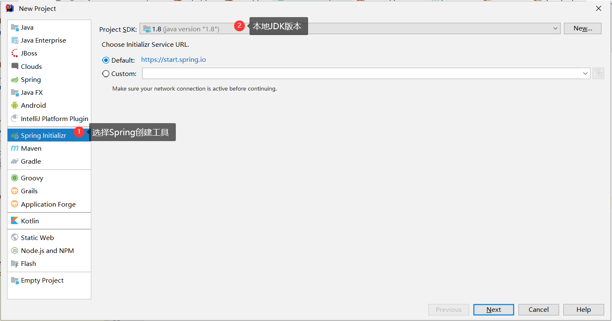
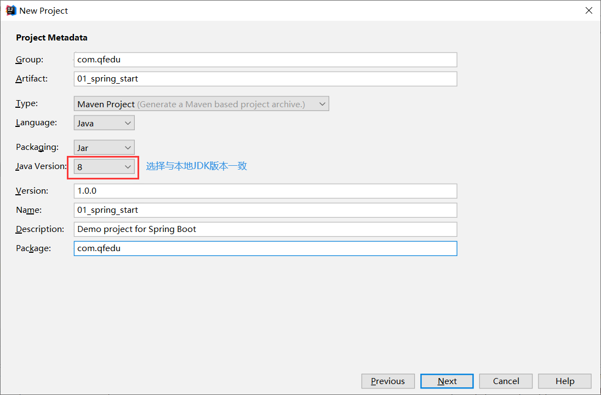
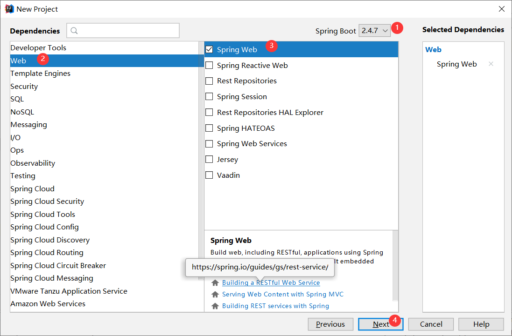
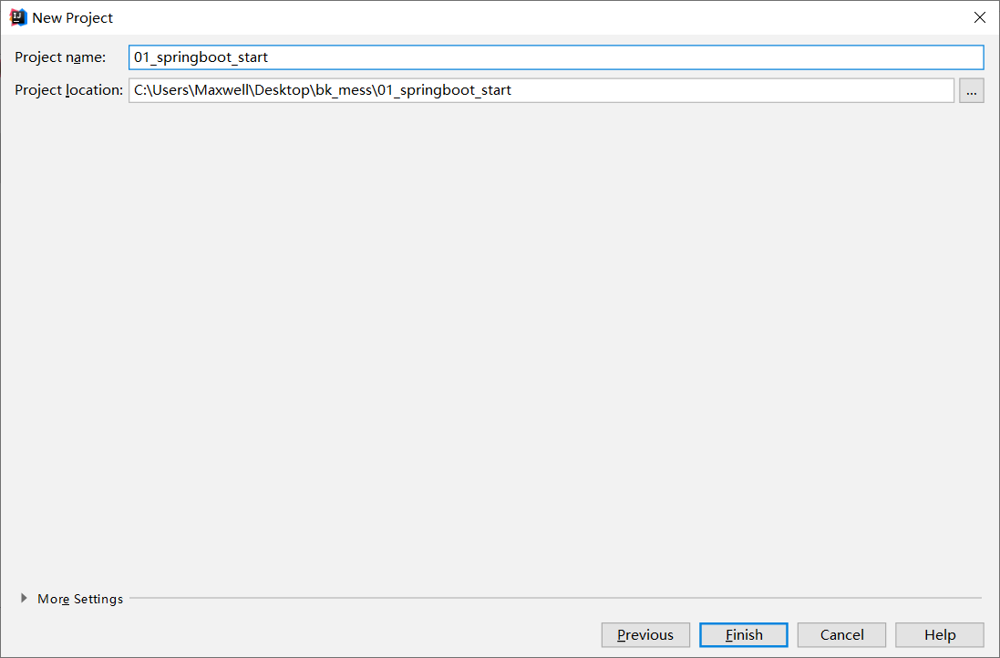
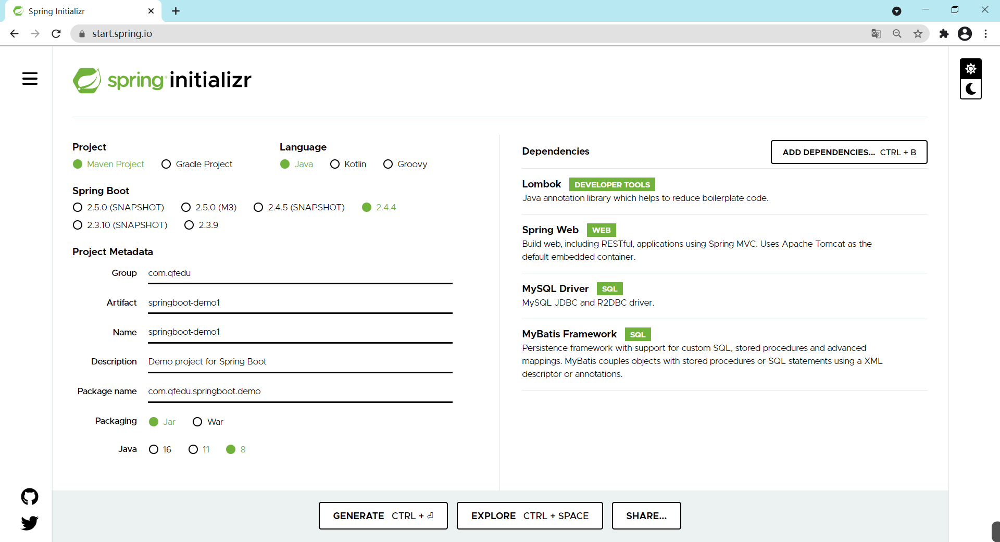
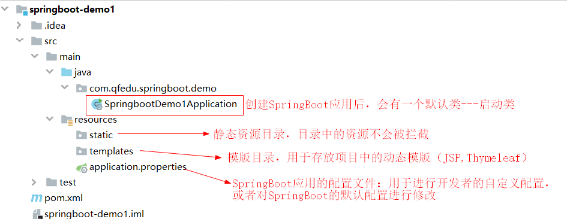
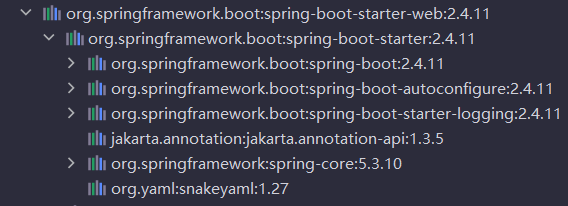
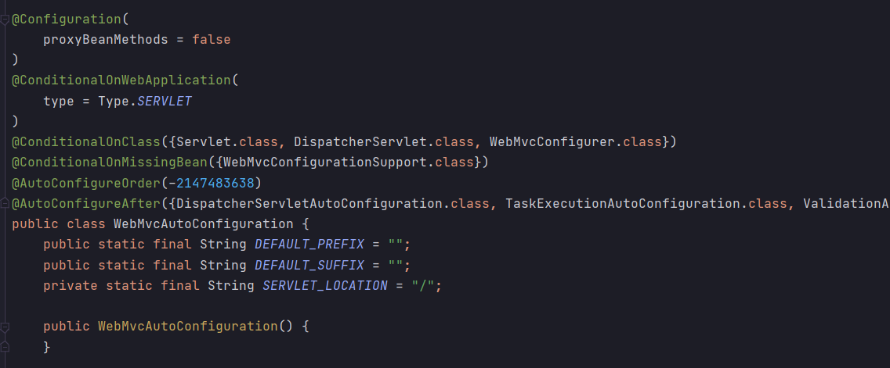
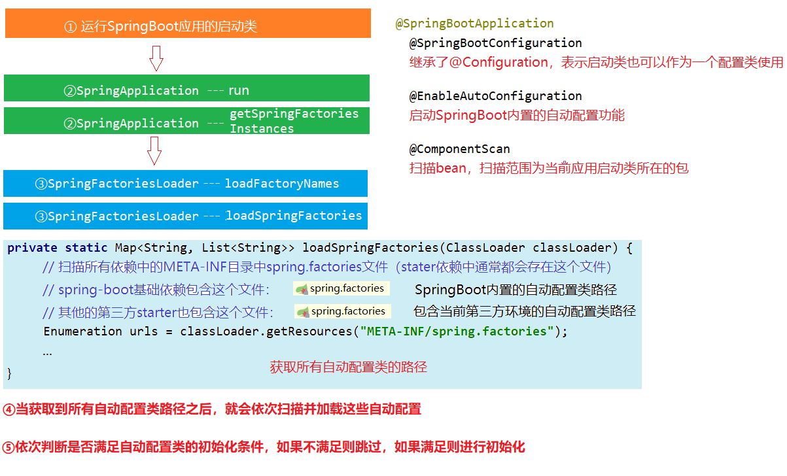

# SpringBoot入门

本篇整理 SSM 手动整合的痛点、SpringBoot 的概念与优缺点、第一个 SpringBoot 应用的创建流程，以及 starter、POM 文件、Java 配置方式、自动配置与全局配置文件等核心原理。

## 1. 项目整合与部署存在的问题

### 1.1 SSM 手动整合存在的问题

SSM 整合步骤多、配置繁琐，完整流程包括：

- 导入依赖；
- 创建实体类；
- 创建 mapper 接口；
- 创建 mapper 接口映射配置文件；
- Spring 整合 MyBatis（管理 MyBatis 中的 bean）；
- 验证 mapper 中的方法是否能够正常运行；
- 将普通的 Maven 项目修改成 web 项目；
- 创建 Controller；
- 创建 SpringMVC 的配置文件；
- 在 web.xml 中配置前端控制器；
- 在 web.xml 中配置监听器及初始化参数；
- 验证。

此外，项目进行服务器部署的步骤同样繁琐：安装 JDK、安装 Tomcat、安装 MySQL……每个环境都要手工搭建一遍。

### 1.2 如何简化这些繁琐的配置和部署步骤

SpringBoot 就是一个可以简化整合过程中复杂配置的框架。

## 2. SpringBoot 简介

### 2.1 概念

随着动态语言（Python、Node.js）的流行，Java 语言的开发就显得格外笨重：配置繁琐、开发效率低、项目的部署变得复杂、集成第三方技术难度大。在这种情况下，SpringBoot 应运而生。

SpringBoot 采用了**习惯优于配置 / 约定大于配置**的理念来快速搭建项目的开发环境，我们无需或者只需进行很少的 Spring 相关配置，就能够快速将项目运行起来。

### 2.2 优点

- 能够快速地搭建项目；
- 对主流的开发框架都提供了无配置集成（SpringBoot 内置了配置）；
- 项目可以独立运行，无需单独配置 Servlet 容器（内置了 Tomcat）；
- 极大提高了开发、部署效率；
- 提供了运行时监控系统（日志等）；
- 与 SpringCloud 有天然的集成。

### 2.3 缺点

- 由于配置都是内置的，报错时定位比较困难；
- 版本迭代速度比较快，有些版本改动比较大（如 1.x.x 到 2.x.x），增加了学习成本。

## 3. 第一个 SpringBoot 应用

根据我们现在学习的知识，创建的 SpringBoot 项目都是 Maven 项目。

**体验目标**：基于 SpringBoot 整合 SpringMVC，最终能够请求到一个 Controller。

SpringBoot 应用需要依赖远程服务器进行创建，常用的远程服务器有：

| 提供方 | 地址 |
| --- | --- |
| Spring 官方 | `https://start.spring.io` |
| Alibaba | `https://start.aliyun.com` |

> [!NOTE]
> 有时 Spring 官方服务器由于网络原因访问失败，可以使用 `https://start.springboot.io` 代替。

### 3.1 创建项目

#### 3.1.1 方式一：使用 IDEA 创建

第一步，选择新建项目，注意选择 JDK 版本：



第二步，填写项目信息：



第三步，选择项目依赖，注意选择 SpringBoot 版本和相关依赖：



第四步，选择项目存储目录：



> [!TIP]
> 首次新建 SpringBoot 项目花费时间可能很长，因为要下载各种依赖，请耐心等待。SpringBoot 项目本质上就是 Maven 项目。

#### 3.1.2 方式二：基于网页创建

如果基于 IDEA 创建无法下载，可以基于网页版进行创建：



使用网页方式创建会生成一个压缩文件（本质上就是一个压缩的 Maven 项目），使用浏览器下载到本地，解压后用 IDEA 打开。

### 3.2 编写 Controller

```java
package com.qfedu.controller;

import org.springframework.web.bind.annotation.RequestMapping;
import org.springframework.web.bind.annotation.RestController;

// 这里的注解和 SpringMVC 中学习的相关注解是相同的
@RestController
@RequestMapping("/hello")
public class HelloController {
    @RequestMapping("/test1")
    public String test1() {
        return "hello springboot...";
    }
}
```

### 3.3 配置项目

#### 3.3.1 项目结构



#### 3.3.2 自定义配置

SpringBoot 帮助我们完成了通用性配置，但像端口号、数据库连接地址、账号、密码等还是需要手动配置。在 `application.properties` 中添加：

```properties
# 服务器端口号
server.port=80
# 应用名
server.servlet.context-path=/start
```

### 3.4 启动项目

#### 3.4.1 启动

SpringBoot 应用自带 Servlet 容器（Tomcat），因此无需进行额外的服务器配置，运行启动类即可启动一个 SpringBoot 应用。

**从 `main` 方法启动，就像运行一个 JavaSE 项目一样。**

#### 3.4.2 测试

访问 `http://localhost/start/hello/test1` 即可看到 Controller 的返回结果。

## 4. SpringBoot 原理

### 4.1 starter

一个 starter 就是一个开发场景的支持（依赖（jar 包）+ 配置）。

SpringBoot 为我们提供了简化企业级开发绝大多数场景的支持（提供了多个 starter）。我们在进行项目开发的过程中只需引入对应的 starter（创建 SpringBoot 应用时可选择），相关的**依赖和配置**就会被内置到项目中，从而消除人工配置。

#### 4.1.1 starter 依赖

一个 starter 依赖表示的不是一个依赖，而是某种开发环境所需的一组依赖：

| 开发场景 | starter |
| --- | --- |
| Spring Web | `spring-boot-starter-web` |
| MyBatis Framework | `mybatis-spring-boot-starter` |

创建项目时勾选场景后，pom.xml 中会引入对应的 starter 依赖：



#### 4.1.2 starter 配置

pom 文件中引入的 starter 除了导入依赖，还引入了配置：

- 配置由被 `@Configuration` 标注的配置类表示，配置在配置类中进行；
- 配置类中有被 `@Bean` 标注的方法，用来生成特定的对象并交给 Spring IOC 容器管理。

通过以上的操作，大部分配置用户就不用自己进行配置了。以后的开发中，如果需要用到哪个模块，就去导入对应的 starter。starter 中内置的配置如下：



### 4.2 SpringBoot 应用的 POM 文件

#### 4.2.1 基于 Spring 官方服务器创建的 SpringBoot 应用

这种方式下，pom 继承 `spring-boot-starter-parent`：

```xml
<?xml version="1.0" encoding="UTF-8"?>
<project xmlns="http://maven.apache.org/POM/4.0.0" xmlns:xsi="http://www.w3.org/2001/XMLSchema-instance"
         xsi:schemaLocation="http://maven.apache.org/POM/4.0.0 https://maven.apache.org/xsd/maven-4.0.0.xsd">
    <modelVersion>4.0.0</modelVersion>

    <!-- SpringBoot 应用中的 pom 继承了 spring-boot-starter-parent -->
    <!-- spring-boot-starter-parent 又继承了 spring-boot-dependencies -->
    <!-- 在 spring-boot-dependencies 中已经对主流框架的版本进行了声明 -->
    <parent>
        <groupId>org.springframework.boot</groupId>
        <artifactId>spring-boot-starter-parent</artifactId>
        <version>2.4.4</version>
        <relativePath/>
    </parent>

</project>
```

同时引入了 Maven 对 SpringBoot 应用支持的插件 `spring-boot`：

```xml
<build>
    <plugins>
        <plugin>
            <groupId>org.springframework.boot</groupId>
            <artifactId>spring-boot-maven-plugin</artifactId>
            <configuration>
                <mainClass>com.qfedu.springboot.demo.SpringbootDemo1Application</mainClass>
                <excludes>
                    <exclude>
                        <groupId>org.projectlombok</groupId>
                        <artifactId>lombok</artifactId>
                    </exclude>
                </excludes>
            </configuration>
        </plugin>
    </plugins>
</build>
```

对上述 POM 文件的分析：

1. pom 工程可以继承，继承了父工程之后就能够使用父工程中的"配置"；
2. 我们自己创建的 SpringBoot 工程继承自 `spring-boot-starter-parent` 这个父工程；
3. `spring-boot-starter-parent` 继承的是 `spring-boot-dependencies`；
4. `spring-boot-dependencies` 里面有 `dependencyManagement`。

`dependencyManagement` 的作用：

1. 用来规定项目引入的依赖的版本；
2. 如果项目的 `dependency` 标签中没有指定版本，就使用 `dependencyManagement` 中规定的版本；
3. `dependencyManagement` 只是规定依赖的版本，并没有真正引入依赖；
4. 如果 `dependencyManagement` 中定义的版本不合适，就需要自己在依赖中指定版本。

#### 4.2.2 基于 aliyun 服务器创建的 SpringBoot 应用

这种方式下不继承父工程，而是直接在自己工程的 `dependencyManagement` 中导入 `spring-boot-dependencies`：

```xml
<?xml version="1.0" encoding="UTF-8"?>
<project xmlns="http://maven.apache.org/POM/4.0.0" xmlns:xsi="http://www.w3.org/2001/XMLSchema-instance"
         xsi:schemaLocation="http://maven.apache.org/POM/4.0.0 https://maven.apache.org/xsd/maven-4.0.0.xsd">
    <modelVersion>4.0.0</modelVersion>
    <groupId>com.qfedu</groupId>
    <artifactId>01_springboot_start_aliyun</artifactId>
    <version>1.0.0</version>
    <name>01_springboot_start_aliyun</name>
    <description>Demo project for Spring Boot</description>

    <properties>
        <java.version>1.8</java.version>
        <project.build.sourceEncoding>UTF-8</project.build.sourceEncoding>
        <project.reporting.outputEncoding>UTF-8</project.reporting.outputEncoding>
        <spring-boot.version>2.4.1</spring-boot.version>
    </properties>

    <dependencies>
        <dependency>
            <groupId>org.springframework.boot</groupId>
            <artifactId>spring-boot-starter-web</artifactId>
        </dependency>

        <dependency>
            <groupId>mysql</groupId>
            <artifactId>mysql-connector-java</artifactId>
            <scope>runtime</scope>
        </dependency>
        <dependency>
            <groupId>org.springframework.boot</groupId>
            <artifactId>spring-boot-starter-test</artifactId>
            <scope>test</scope>
        </dependency>
    </dependencies>

    <dependencyManagement>
        <dependencies>
            <dependency>
                <groupId>org.springframework.boot</groupId>
                <artifactId>spring-boot-dependencies</artifactId>
                <version>${spring-boot.version}</version>
                <type>pom</type>
                <scope>import</scope>
            </dependency>
        </dependencies>
    </dependencyManagement>

</project>
```

对上述 POM 文件的分析：

1. 没有继承父工程；
2. 直接定义 `dependencyManagement` 并导入 `spring-boot-dependencies`。

### 4.3 Java 配置方式

如果我们需要在 SpringBoot 应用中整合一种新的开发场景，只需在 pom.xml 中引入对应的 starter 即可。一个 starter 不仅包含依赖，还包含相应的配置，starter 中包含的配置都是通过 Java 类实现的——这就是 **Java 配置方式**。

#### 4.3.1 Spring 版本发展与配置方式

随着 Spring 版本的迭代，配置方式也在发生变化：

| Spring 版本 | 配置方式 |
| --- | --- |
| Spring 1.x | 所有 bean 的配置只能通过 XML 完成 |
| Spring 2.x | 基于 JDK 1.5 对注解的支持，开始支持注解 |
| Spring 3.x | 开始提供基于 Java 的配置方式 |
| Spring 4.x | XML、注解、Java 三种方式并存 |

企业开发中到底是用 XML 配置还是用注解？通常的实践是：

- 对基础配置、引用的第三方依赖中的配置使用 XML 完成，例如数据源配置；
- 业务开发使用注解，例如 controller、service。

#### 4.3.2 XML 配置

```xml
<!--applicationContext.xml-->
<bean id="stu" class="com.qfedu.beans.Student"></bean>
<bean id="date" class="java.util.Date"></bean>
```

#### 4.3.3 注解配置

```java
@Component
public class Student {

}
```

#### 4.3.4 Java 配置方式

创建配置类，通过 `@Configuration` 标注，并在 `@Bean` 方法中返回需要交给容器管理的对象：

```java
@Configuration
public class SpringConfig {

    @Bean
    public Date getDate() {
        return new Date();
    }
}
```

### 4.4 SpringBoot 自动配置



### 4.5 全局配置文件

SpringBoot 针对不同的开发场景提供默认的属性配置，如果默认的配置不能满足开发的需要，我们就需要对属性配置进行修改。

- SpringBoot 应用提供了一个全局配置文件 `application.properties` 用于进行自定义配置；
- 全局配置文件支持两种语法配置：
  - properties 键值对配置；
  - yaml 语法的配置。

#### 4.5.1 基于 properties 配置

```properties
# 配置数据源（key 必须按照 SpringBoot 的要求）
spring.datasource.driver-class-name=com.mysql.jdbc.Driver
spring.datasource.url=jdbc:mysql://localhost:3306/mybatis?characterEncoding=utf-8
spring.datasource.username=root
spring.datasource.password=admin123

# 配置映射文件路径及实体类的包名
mybatis.mapper-locations=classpath:mappers/*Mapper.xml
mybatis.type-aliases-package=com.qfedu.springboot.demo.entity
```

#### 4.5.2 基于 yaml 配置

```yaml
spring:
  datasource:
    url: jdbc:mysql://localhost:3306/mybatis?characterEncoding=utf-8
    driver-class-name: com.mysql.jdbc.Driver
    username: root
    password: admin123

mybatis:
  mapper-locations: classpath:mappers/*Mapper.xml
  type-aliases-package: com.qfedu.springboot.demo.entity
```

#### 4.5.3 常用的全局配置

```yaml
server:
  port: 9999
  servlet:
    context-path: /demo1
```

### 4.6 自定义 Banner

SpringBoot 应用启动的时候是有一个默认启动图案的，这个默认图案支持自定义配置：

- 在 resources 目录创建一个 `banner.txt`；
- 在 `banner.txt` 文件中定义图案，可通过 <http://patorjk.com/software/taag/> 生成。

```text
////////////////////////////////////////////////////////////////////
//                          _ooOoo_                               //
//                         o8888888o                              //
//                         88" . "88                              //
//                         (| ^_^ |)                              //
//                         O\  =  /O                              //
//                      ____/`---'\____                           //
//                    .'  \\|     |//  `.                         //
//                   /  \\|||  :  |||//  \                        //
//                  /  _||||| -:- |||||-  \                       //
//                  |   | \\\  -  /// |   |                       //
//                  | \_|  ''\---/''  |   |                       //
//                  \  .-\__  `-`  ___/-. /                       //
//                ___`. .'  /--.--\  `. . ___                     //
//              ."" '<  `.___\_<|>_/___.'  >'"".                  //
//            | | :  `- \`.;`\ _ /`;.`/ - ` : | |                 //
//            \  \ `-.   \_ __\ /__ _/   .-` /  /                 //
//      ========`-.____`-.___\_____/___.-`____.-'========         //
//                           `=---='                              //
//      ^^^^^^^^^^^^^^^^^^^^^^^^^^^^^^^^^^^^^^^^^^^^^^^^^^        //
//            佛祖保佑       永不宕机     永无BUG                   //
////////////////////////////////////////////////////////////////////
```
