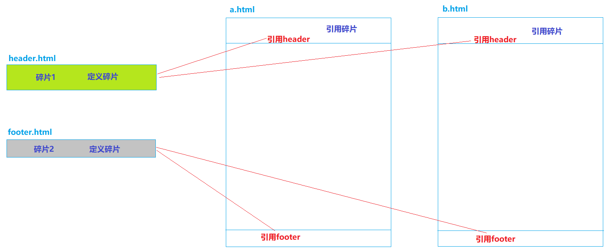
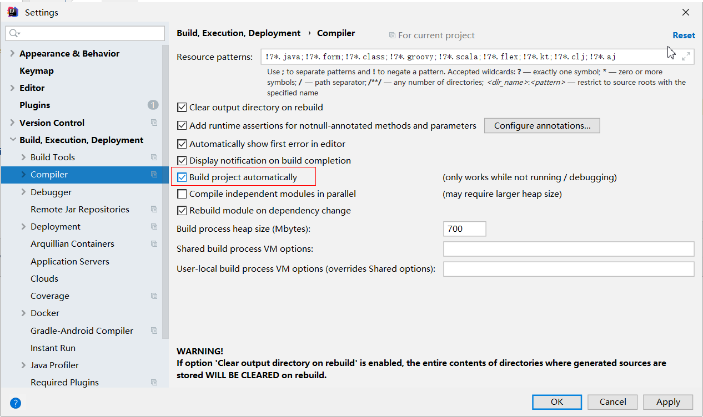
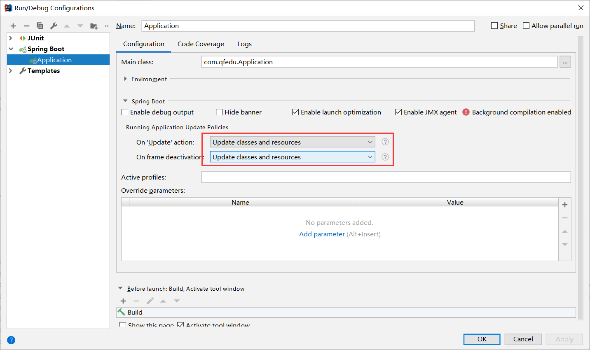

# SpringBoot进阶

本篇整理 SpringBoot 整合 JSP、基于 SpringBoot 的 SSM 整合、Thymeleaf 模板引擎的语法与碎片用法，以及 SpringBoot 应用的热部署配置。

## 1. SpringBoot 整合 JSP（了解）

SpringBoot 应用默认支持的动态网页技术是 Thymeleaf，并不支持 JSP，因此在 SpringBoot 应用中想要使用 JSP，需要通过手动整合来实现。

### 1.1 添加依赖

```xml
<dependency>
    <groupId>org.apache.tomcat.embed</groupId>
    <artifactId>tomcat-embed-jasper</artifactId>
    <version>9.0.45</version>
</dependency>
<dependency>
    <groupId>javax.servlet</groupId>
    <artifactId>jstl</artifactId>
    <version>1.2</version>
</dependency>
```

其中 `tomcat-embed-jasper` 用于解析编译 JSP，`jstl` 提供 JSP 页面中常用的标签库支持。

### 1.2 创建 JSP 页面

- 修改 pom 文件的打包方式为 `war`（因为 JSP 必须运行在 Servlet 容器中）；
- 在 `src/main` 下新建 `webapp` 目录；
- 在 webapp 中创建 `.jsp` 页面。

### 1.3 将 JSP 页面放在 WEB-INF 中访问

将 JSP 文件存放到 `webapp` 目录，并在 `application.yml` 文件中配置 SpringMVC 的视图解析方式：

```yaml
spring:
  mvc:
    view:
      prefix: /
      suffix: .jsp
```

创建 `TestController`：

```java
@Controller
public class TestController {

    @RequestMapping("/test")
    public String test() {
        return "test";
    }
}
```

> [!NOTE]
> 如果使用静态资源，静态资源需要放在 `resources/static` 目录下。

## 2. 基于 SpringBoot 的 SSM 整合（重点）

### 2.1 创建 SpringBoot 项目

创建项目时添加以下依赖：

- lombok
- spring web
- mysql driver
- mybatis framework
- PageHelper

如果默认的 mysql 驱动版本与数据库不匹配，可以手动修改 mysql 驱动的版本（可选）：

```xml
<dependencies>
    <dependency>
        <groupId>org.springframework.boot</groupId>
        <artifactId>spring-boot-starter-web</artifactId>
    </dependency>
    <dependency>
        <groupId>org.projectlombok</groupId>
        <artifactId>lombok</artifactId>
        <optional>true</optional>
    </dependency>
    <dependency>
        <groupId>org.springframework.boot</groupId>
        <artifactId>spring-boot-starter-test</artifactId>
        <scope>test</scope>
    </dependency>
    <dependency>
        <groupId>org.apache.tomcat.embed</groupId>
        <artifactId>tomcat-embed-jasper</artifactId>
        <version>9.0.45</version>
    </dependency>
    <dependency>
        <groupId>javax.servlet</groupId>
        <artifactId>jstl</artifactId>
        <version>1.2</version>
    </dependency>
    <dependency>
        <groupId>mysql</groupId>
        <artifactId>mysql-connector-java</artifactId>
        <version>5.1.49</version>
        <scope>runtime</scope>
    </dependency>
    <dependency>
        <groupId>com.alibaba</groupId>
        <artifactId>druid-spring-boot-starter</artifactId>
        <version>1.2.8</version>
    </dependency>
    <dependency>
        <groupId>org.mybatis.spring.boot</groupId>
        <artifactId>mybatis-spring-boot-starter</artifactId>
        <version>2.2.2</version>
    </dependency>
    <dependency>
        <groupId>com.github.pagehelper</groupId>
        <artifactId>pagehelper-spring-boot-starter</artifactId>
        <version>1.4.1</version>
    </dependency>
</dependencies>
```

### 2.2 整合 MyBatis 所需的配置

完成 MyBatis 的自定义配置（`application.properties`）：

```properties
server.port=8099
server.servlet.context-path=/test

# 配置前缀后缀
spring.mvc.view.prefix=/
spring.mvc.view.suffix=.jsp

# 配置连接池
spring.datasource.driver-class-name=com.mysql.jdbc.Driver
spring.datasource.url=jdbc:mysql://localhost:3306/ssm_demo?useSSL=false
spring.datasource.username=root
spring.datasource.password=root

# mybatis配置
mybatis.type-aliases-package=com.qfedu.bean
# mybatis.mapper-locations=classpath:mapper/*Mapper.xml

# 日志
logging.level.com.qfedu.mapper=DEBUG
```

> [!TIP]
> `logging.level.com.qfedu.mapper=DEBUG` 会让 mapper 包下的 SQL 语句打印到控制台，调试时非常有用。

### 2.3 创建实体类

`Student.java`：

```java
@Data
public class Student {
    private Long id;
    private String name;
    private String gender;
    private Integer age;
    private String addr;
}
```

### 2.4 创建 Mapper 接口及映射配置文件

`StudentMapper.java`：

```java
package com.qfedu.mapper;

import com.qfedu.bean.Student;

import java.util.List;

public interface StudentMapper {
    // 添加
    int add(Student student);
    // 根据 ID 删除
    int del(Long id);
    // 修改
    int update(Student student);
    // 查询所有
    List<Student> findAll();
    // 根据 ID 查询
    Student findById(Long id);
}
```

`StudentMapper.xml`：

```xml
<?xml version="1.0" encoding="UTF-8" ?>
<!DOCTYPE mapper PUBLIC "-//mybatis.org//DTD Mapper 3.0//EN" "http://mybatis.org/dtd/mybatis-3-mapper.dtd" >
<mapper namespace="com.qfedu.mapper.StudentMapper">
    <insert id="add" parameterType="student">
        INSERT INTO `student`(`name`, `gender`, `age`, `addr`)
        VALUES (#{name}, #{gender}, #{age}, #{addr})
    </insert>
    <update id="update" parameterType="student">
        UPDATE `student` SET `name`=#{name},
        `gender`=#{gender}, `age`=#{age}, `addr`=#{addr} WHERE `id`=#{id}
    </update>
    <delete id="del" parameterType="long">
        delete from `student` where `id`=#{id}
    </delete>
    <select id="findAll" resultType="student">
        select * from `student`
    </select>
    <select id="findById" resultType="student">
        select * from `student` where `id`=#{id}
    </select>
</mapper>
```

> [!NOTE]
> `parameterType="student"`、`resultType="student"` 之所以能直接写别名 `student`，得益于配置项 `mybatis.type-aliases-package=com.qfedu.bean` 对实体类包的扫描。

### 2.5 在启动类配置 Mapper 扫描

在启动类上添加 `@MapperScan` 注解，指定 mapper 接口所在的包：

```java
@SpringBootApplication
@MapperScan("com.qfedu.mapper")
public class Application {
    public static void main(String[] args) {
        SpringApplication.run(Application.class, args);
    }
}
```

### 2.6 在测试类中测试

```java
package com.qfedu;

import com.qfedu.mapper.StudentMapper;
import org.junit.jupiter.api.Test;
import org.springframework.beans.factory.annotation.Autowired;
import org.springframework.boot.test.context.SpringBootTest;

@SpringBootTest
public class ApplicationTests {
    @Autowired
    private StudentMapper studentMapper;

    @Test
    public void test1() {
        studentMapper.findAll().stream().forEach(System.out::println);
    }
}
```

### 2.7 完成学生管理系统 SpringBoot 版

将之前学生管理系统的相关文件拷贝到项目中，测试运行。

## 3. Thymeleaf

Thymeleaf 是一种类似于 JSP 的动态网页技术。常见的模板引擎有：JSP、Thymeleaf、Freemarker 等。

### 3.1 Thymeleaf 简介

JSP 必须依赖 Tomcat 运行，不能直接运行在浏览器中；HTML 可以直接运行在浏览器中，但不能接收控制器传递的数据。

Thymeleaf 是一种既保留了 HTML 后缀、能够直接在浏览器运行的能力，又实现了 JSP 显示动态数据的功能的技术——**静能查看页面效果，动则可以显示数据**。

### 3.2 Thymeleaf 的使用

SpringBoot 应用对 Thymeleaf 提供了良好的支持。

#### 3.2.1 添加 Thymeleaf 的 starter

```xml
<dependency>
    <groupId>org.springframework.boot</groupId>
    <artifactId>spring-boot-starter-thymeleaf</artifactId>
</dependency>
```

#### 3.2.2 创建 Thymeleaf 模板

Thymeleaf 模板就是 HTML 文件，SpringBoot 应用中 `resources/templates` 目录就是用来存放页面模板的。

关于 static 目录与 templates 目录的重要区别：

| 目录 | 定位 | 访问方式 |
| --- | --- | --- |
| `resources/static` | 静态资源，SpringBoot 默认放行 | 可以直接访问 |
| `resources/templates` | 动态网页模板，SpringBoot 会拦截其中的资源 | 必须通过控制器跳转访问 |

使用步骤：

1. 在 templates 中创建 HTML 页面模板；
2. 创建 PageController，用于转发允许"直接访问"的页面请求。

```java
@Controller
@RequestMapping("/page")
public class PageController {

    @RequestMapping("/index")
    public String index() {
        return "index";
    }
}
```

### 3.3 Thymeleaf 基本语法

如果要在 Thymeleaf 模板中获取从控制器传递的数据，需要使用 th 标签。

#### 3.3.1 引入 th 标签的命名空间

```html
<!DOCTYPE html>
<html lang="en" xmlns:th="http://www.thymeleaf.org">
    <head>
        <meta charset="UTF-8">
        <title>Title</title>
    </head>
    <body>
        <p>这是thymeleaf页面</p>
    </body>
</html>
```

#### 3.3.2 `th:text`

几乎所有的 HTML 双标签都可以使用 `th:text` 属性，将接收到的数据显示在标签的内容中。

标准变量表达式用于访问容器上下文环境中的变量，功能和 EL 中的 `${}` 相同。Thymeleaf 中的变量表达式使用 `${变量名}` 的方式获取 Controller 中 Model 里的数据：

```html
<label th:text="${price}"></label>
<div th:text="${str}"></div>
<p th:text="${user.username}"></p>
```

#### 3.3.3 `th:object` 和 `*`

选择变量表达式，也叫星号变量表达式，使用 `th:object` 属性来绑定对象。

选择表达式首先使用 `th:object` 来绑定后台传来的 User 对象，然后使用 `*` 来代表这个对象，后面 `{}` 中的值是此对象中的属性。选择变量表达式 `*{...}` 是另一种类似于标准变量表达式 `${...}` 的表示变量的方法：选择变量表达式在执行时是在选择的对象上求解，而 `${...}` 是在上下文的变量 Model 上求解。这种写法比标准变量表达式繁琐，只需要大家了解即可。

```html
<div th:object="${user}">
    <p th:text="*{id}"></p>
    <p th:text="*{username}"></p>
    <p th:text="*{addr}"></p>
</div>
```

#### 3.3.4 `@{...}` 链接表达式

链接表达式 `@{...}` 主要用于链接、地址的展示，可用于：

- `<script src="...">`
- `<link href="...">`
- `<a href="...">`
- `<form action="...">`
- ``

它可以在 URL 路径中动态获取数据。先配置项目的上下文路径：

```properties
server.servlet.context-path=/statics
```

使用路径表达式：

```html
<script th:src="@{/test.js}"></script>
<link rel="stylesheet" th:href="@{/test.css}"/>

<p>
    <a th:href="@{/hello/test}">test</a>
</p>

<!-- 传递参数 -->
<p>
    <a th:href="@{/hello/test1(id=1, username='zs')}">test</a>
</p>
```

### 3.4 流程控制

#### 3.4.1 `th:each` 循环

```html
<table style="width: 600px" border="1" cellspacing="0">
    <caption>图书信息列表</caption>
    <thead>
        <tr>
            <th>id</th>
            <th>name</th>
            <th>addr</th>
        </tr>
    </thead>
    <tbody>
        <tr th:each="user:${userList}">
            <td th:text="${user.id}"></td>
            <td th:text="${user.username}"></td>
            <td th:text="${user.addr}"></td>
        </tr>
    </tbody>
</table>
```

#### 3.4.2 分支

`th:if`：如果条件不成立，则不显示此标签；`th:unless` 与之相反，条件不成立时才显示：

```html
<td th:if="${b.bookPrice} > 40" style="color:red">太贵！！！</td>
<td th:unless="${b.bookPrice} > 40" style="color:red">太贵！！！</td>

<td th:if="${b.bookPrice} <= 40" style="color:green">推荐购买</td>
```

`th:switch` 和 `th:case`：

```html
<td th:switch="${b.bookPrice}/10">
    <label th:case="3">建议购买</label>
    <label th:case="4">价格合理</label>
    <label th:case="*">价格不合理</label>
</td>
```

```html
<td th:switch="${user.gender}">
    <label th:case="M">男</label>
    <label th:case="F">女</label>
    <label th:case="*">性别不详</label>
</td>
```

> [!NOTE]
> `th:case="*"` 表示默认分支，当前面的 case 都不匹配时执行，类似 Java 中 switch 语句的 `default`。

### 3.5 碎片使用

#### 3.5.1 碎片的概念

碎片，就是 HTML 片段。我们可以将多个页面中使用的相同的 HTML 标签部分单独定义，然后通过 `th:include` 或 `th:replace` 在 HTML 网页中引入定义的碎片。



#### 3.5.2 碎片使用案例

定义碎片使用 `th:fragment`。`header.html`：

```html
<!DOCTYPE html>
<html lang="en" xmlns:th="http://www.thymeleaf.org">
<head>
    <meta charset="UTF-8">
    <title>Title</title>
</head>
<body>

<div th:fragment="fragment1" style="width: 100%; height: 80px;background: deepskyblue; color:white; font-size: 25px;">
    千锋，六六六！！！
</div>

</body>
</html>
```

`footer.html`：

```html
<!DOCTYPE html>
<html lang="en" xmlns:th="http://www.thymeleaf.org">
<head>
    <meta charset="UTF-8">
    <title>Title</title>
</head>
<body>

<div th:fragment="fragment2" style="width: 100%; height: 30px;background: lightgray; color:white; font-size: 16px;">
    千锋教育
</div>

</body>
</html>
```

引用碎片使用 `th:include` 和 `th:replace`。`a.html`：

```html
<!DOCTYPE html>
<html lang="en" xmlns:th="http://www.thymeleaf.org">
<head>
    <meta charset="UTF-8">
    <title>Title</title>
</head>
<body>

<!--    <div th:include="header::fragment1"></div>-->
    <div th:replace="header::fragment1"></div>

    <div style="width: 100%; height: 500px">
        定义内容
    </div>

<!--    <div th:include="footer::fragment2"></div>-->
    <div th:replace="footer::fragment2"></div>
</body>
</html>
```

> [!NOTE]
> `th:include` 会把碎片内容嵌入当前标签内部（保留当前标签本身）；`th:replace` 则用碎片整体替换当前标签。实际开发中 `th:replace` 更常用。

## 4. SpringBoot 应用的热部署配置

"热"——不用停掉现有操作就可以进行"修改"的一种技术。类比硬件：USB 支持热插拔，PS2 接口不支持热插拔。

### 4.1 什么是热部署

项目首次部署、服务启动之后，如果应用发生了变化、而且 IDEA 感知到了应用的变化，就自动完成 jar 的更新，无需手动再次启动服务器，就可以访问应用的更新内容。

**目的：提高开发效率。**

### 4.2 热部署配置

#### 4.2.1 IDEA 配置

打开 File —— Settings，开启自动构建选项：



#### 4.2.2 SpringBoot 项目配置

在需要进行热部署的 SpringBoot 应用中添加依赖：

```xml
<dependency>
    <groupId>org.springframework.boot</groupId>
    <artifactId>spring-boot-devtools</artifactId>
</dependency>
```

再配置 SpringBoot 应用在运行时的变化更新策略：



## 5. 本章小结

- SpringBoot 默认不支持 JSP，整合 JSP 需要引入 `tomcat-embed-jasper` 与 `jstl` 并以 war 方式打包；
- 基于 SpringBoot 的 SSM 整合核心步骤：引入 starter 依赖 —— 配置数据源与 MyBatis —— 创建实体类与 Mapper —— 启动类加 `@MapperScan`；
- Thymeleaf 兼具静态预览与动态渲染能力，核心语法是 `th:text`、`th:each`、`th:if`、`th:switch` 与链接表达式 `@{...}`；
- 页面公共部分用碎片（`th:fragment` + `th:replace`）复用；
- 引入 `spring-boot-devtools` 并配置 IDEA 自动构建，即可实现热部署。
