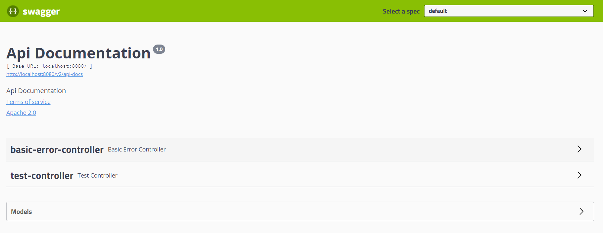

# SpringBoot整合Swagger2

本篇整理前后端分离模式下接口文档管理的痛点、Swagger2 的作用、入门案例、常用配置（文档信息、扫描接口、开关、分组），以及实体类注解与常用注解的使用。

## 1. 目前存在的问题

### 1.1 关于前后端分离

**后端时代**：前端只管理静态页面，然后将静态页面提供给后端，后端使用模板引擎（JSP）显示页面，后端是主力。

**前后端分离**：

- 前端负责页面的开发；
- 后端负责服务器的开发；
- 前后端通过 API 进行交互，使用 Ajax 通过 JSON 传递数据；
- 前后端相对独立且松耦合。

### 1.2 产生的问题

前后端分离虽然提高了开发效率，但也带来了新的协作问题：

- 如果后端接口发生了更新（接口名、参数列表），前端无法及时获得更新；
- 前后端集成时，前端或后端无法做到"及时协商，尽早解决"，最终导致问题集中爆发。

### 1.3 如何解决

首先定义**计划的提纲**，并实时跟踪最新的 API，降低集成风险。早期使用 word 文档维护接口说明，但文档与代码容易脱节。

目前企业中主流使用 Swagger 来实时维护接口文档。

## 2. 什么是 Swagger2

- 号称世界上最流行的 API 框架；
- Restful API 文档在线自动生成器，实现 **API 文档与 API 定义同步更新**；
- 可以直接运行，在线测试 API；
- 支持多种语言（如 Java、PHP 等）；
- 官网：<https://swagger.io/>。

总结：Swagger2 可以想象成一个实时生成在线文档的工具。

## 3. Swagger2 入门案例

### 3.1 创建工程

创建一个 SpringBoot 项目。

### 3.2 导入依赖

添加 Swagger2 依赖：

```xml
<!-- https://mvnrepository.com/artifact/io.springfox/springfox-swagger2 -->
<dependency>
    <groupId>io.springfox</groupId>
    <artifactId>springfox-swagger2</artifactId>
    <version>2.9.2</version>
</dependency>
<!-- https://mvnrepository.com/artifact/io.springfox/springfox-swagger-ui -->
<dependency>
    <groupId>io.springfox</groupId>
    <artifactId>springfox-swagger-ui</artifactId>
    <version>2.9.2</version>
</dependency>
```

### 3.3 创建 Controller

```java
import org.springframework.web.bind.annotation.RequestMapping;
import org.springframework.web.bind.annotation.RestController;

@RestController
@RequestMapping("/test")
public class TestController {
    @RequestMapping("/hello")
    public String hello() {
        return "test...";
    }
}
```

编写完 Controller 后，要确保其运行成功。

### 3.4 配置 Swagger2

编写 Swagger2 配置类，后续还要在该类中添加很多内容：

```java
import org.springframework.context.annotation.Configuration;
import springfox.documentation.swagger2.annotations.EnableSwagger2;

@Configuration
// 启用 Swagger2
@EnableSwagger2
public class Swagger2Config {
}
```

访问 `http://localhost:8080/swagger-ui.html`，可以看到 Swagger2 的界面如下：



## 4. Swagger2 配置

### 4.1 配置文档信息

Swagger2 实例 Bean 是 Docket，所以通过配置 Docket 实例来配置 Swagger2：

```java
@Bean // 配置 docket 以配置 Swagger 具体参数
public Docket docket() {
    return new Docket(DocumentationType.SWAGGER_2);
}
```

可以通过 `apiInfo()` 属性配置文档信息：

```java
// 配置文档信息
private ApiInfo apiInfo() {
    Contact contact = new Contact("联系人名字", "http://xxx.xxx.com/联系人访问链接", "联系人邮箱");
    return new ApiInfo(
            "Swagger学习", // 标题
            "学习演示如何配置Swagger", // 描述
            "v1.0", // 版本
            "http://terms.service.url/组织链接", // 组织链接
            contact, // 联系人信息
            "Apache 2.0 许可", // 许可
            "许可链接", // 许可链接
            new ArrayList<>() // 扩展
    );
}
```

让 Docket 实例关联上 `apiInfo()`：

```java
@Bean
public Docket docket() {
    return new Docket(DocumentationType.SWAGGER_2).apiInfo(apiInfo());
}
```

重启项目，访问测试 `http://localhost:8080/swagger-ui.html` 即可看到新的文档信息。

### 4.2 配置扫描接口

构建 Docket 时通过 `select()` 方法配置如何扫描接口：

```java
@Bean
public Docket docket() {
    return new Docket(DocumentationType.SWAGGER_2)
            .apiInfo(apiInfo())
            .select() // 通过.select()方法去配置扫描接口，RequestHandlerSelectors 配置如何扫描接口
            .apis(RequestHandlerSelectors.basePackage("com.qfedu.controller"))
            .build();
}
```

重启项目测试，由于我们配置了根据包路径扫描接口，所以文档中只能看到一个类中的接口。

除了通过包路径配置扫描接口外，还可以通过其他方式扫描接口。`RequestHandlerSelectors` 的可选配置方式如下：

| 配置方式 | 说明 |
| --- | --- |
| `any()` | 扫描所有，项目中的所有接口都会被扫描到 |
| `none()` | 不扫描接口 |
| `withMethodAnnotation(final Class<? extends Annotation> annotation)` | 通过方法上的注解扫描，如 `withMethodAnnotation(GetMapping.class)` 只扫描 get 请求 |
| `withClassAnnotation(final Class<? extends Annotation> annotation)` | 通过类上的注解扫描，如 `withClassAnnotation(Controller.class)` 只扫描有 Controller 注解的类中的接口 |
| `basePackage(final String basePackage)` | 根据包路径扫描接口（最常用） |

例如只扫描带 `@PostMapping` 注解的接口：

```java
@Bean
public Docket docket() {
    return new Docket(DocumentationType.SWAGGER_2)
            .apiInfo(apiInfo())
            .select() // 通过.select()方法去配置扫描接口，RequestHandlerSelectors 配置如何扫描接口
            .apis(RequestHandlerSelectors.withMethodAnnotation(PostMapping.class))
            .build();
}
```

除此之外，我们还可以配置接口扫描的路径过滤：

```java
@Bean
public Docket docket() {
    return new Docket(DocumentationType.SWAGGER_2)
            .apiInfo(apiInfo())
            .select() // 通过.select()方法去配置扫描接口，RequestHandlerSelectors 配置如何扫描接口
            .apis(RequestHandlerSelectors.basePackage("com.qfedu.controller"))
            // 配置如何通过 path 过滤，即这里只扫描请求以 /test 开头的接口
            .paths(PathSelectors.ant("/test/**"))
            .build();
}
```

`PathSelectors` 的可选值如下：

| 配置方式 | 说明 |
| --- | --- |
| `any()` | 任何请求都扫描 |
| `none()` | 任何请求都不扫描 |
| `regex(final String pathRegex)` | 通过正则表达式控制 |
| `ant(final String antPattern)` | 通过 Ant 风格路径表达式控制 |

### 4.3 配置 Swagger2 开关

#### 4.3.1 配置 Swagger2 是否启用

通过 `enable()` 方法配置是否启用 Swagger2，如果是 `false`，Swagger2 将不能在浏览器中访问：

```java
// 配置 docket 以配置 Swagger 具体参数
@Bean
public Docket docket() {
    return new Docket(DocumentationType.SWAGGER_2)
            .apiInfo(apiInfo())
            .enable(false) // 配置是否启用 Swagger，如果是 false，在浏览器将无法访问
            .select()
            .apis(RequestHandlerSelectors.basePackage("com.qfedu.controller"))
            .build();
}
```

禁用后再次访问页面，效果如下：


#### 4.3.2 配置多环境下 Swagger2 是否启用

先准备两个环境配置文件。`application-dev.properties`：

```properties
server.port=8080
```

`application-test.properties`：

```properties
server.port=8081
```

Swagger2 相关配置——只在 dev 环境启用：

```java
// 配置 docket 以配置 Swagger 具体参数
@Bean
public Docket docket(Environment environment) {
    // 设置要显示 Swagger 的环境
    Profiles profiles = Profiles.of("dev");
    // 判断当前是否处于该环境
    // 通过 enable() 接收此参数判断是否要显示
    boolean flag = environment.acceptsProfiles(profiles);

    return new Docket(DocumentationType.SWAGGER_2)
            .apiInfo(apiInfo())
            .enable(flag) // 配置是否启用 Swagger，如果是 false，在浏览器将无法访问
            .select()
            .apis(RequestHandlerSelectors.basePackage("com.qfedu.controller"))
            .build();
}
```

在 `application.properties` 中将环境配置为测试环境：

```properties
# 配置环境为测试环境
spring.profiles.active=test
```

访问 `http://localhost:8081/swagger-ui.html`，此时无法访问到 Swagger2 界面（因为 Swagger 只在 dev 环境启用）。

### 4.4 配置 API 分组

#### 4.4.1 配置组名

如果没有配置分组，默认组名是 default：


配置分组名：

```java
@Bean
public Docket docket(Environment environment) {
    return new Docket(DocumentationType.SWAGGER_2).apiInfo(apiInfo())
            .groupName("hello") // 配置分组
            ; // 省略其他配置....
}
```

重启项目即可查看分组信息。

#### 4.4.2 配置多个分组

配置多个分组只需要配置多个 Docket 实例即可：

```java
@Bean
public Docket docket1() {
    return new Docket(DocumentationType.SWAGGER_2).groupName("group1");
}

@Bean
public Docket docket2() {
    return new Docket(DocumentationType.SWAGGER_2).groupName("group2");
}

@Bean
public Docket docket3() {
    return new Docket(DocumentationType.SWAGGER_2).groupName("group3");
}
```

重启项目查看即可。

## 5. 实体类配置

### 5.1 创建实体类

```java
@ApiModel("用户实体")
public class User {
    @ApiModelProperty("用户名")
    public String username;
    @ApiModelProperty("密码")
    public String password;
}
```

### 5.2 修改 Controller

只要这个实体在**请求接口的返回值**上（即使是泛型），都能映射到实体项中：

```java
@RequestMapping("/getUser")
public User getUser() {
    return new User();
}
```

> [!IMPORTANT]
> 并不是因为 `@ApiModel` 这个注解让实体显示在文档中，而是只要出现在接口方法返回值上的实体都会显示出来。`@ApiModel` 和 `@ApiModelProperty` 这两个注解只是为实体添加注释说明。

- `@ApiModel` 为类添加注释；
- `@ApiModelProperty` 为类属性添加注释。

## 6. 常用注解

Swagger 的所有注解定义在 `io.swagger.annotations` 包下。下面列一些经常用到的，未列举出来的可以另行查阅说明：

| Swagger 注解 | 说明 |
| --- | --- |
| `@Api(tags = "xxx模块说明")` | 作用在控制器类上 |
| `@ApiOperation("xxx接口说明")` | 作用在接口方法上 |
| `@ApiModel("xxxPOJO说明")` | 作用在模型类上，如 VO、BO |
| `@ApiModelProperty(value = "xxx属性说明", hidden = true)` | 作用在类方法和属性上，hidden 设置为 true 可以隐藏该属性 |
| `@ApiImplicitParams()` 和 `@ApiParam("xxx参数说明")` | 作用在参数、方法和字段上，类似 `@ApiModelProperty` |

完整示例：

```java
@ApiOperation("用户登录接口")
@ApiImplicitParams({
        @ApiImplicitParam(dataType = "string", name = "username", value = "用户登录账号", required = true),
        @ApiImplicitParam(dataType = "string", name = "password", value = "用户登录密码", required = false, defaultValue = "111111")
})
@RequestMapping(value = "/login", method = RequestMethod.GET)
public String login(@RequestParam("username") String name,
                    @RequestParam(value = "password", defaultValue = "111111") String pwd) {
    return "";
}
```

这样的话，可以给一些比较难理解的属性或者接口增加一些配置信息，让人更容易阅读。

相较于传统的 Postman 测试接口，使用 Swagger 简直就是傻瓜式操作：不需要额外的说明文档（写得好本身就是文档），而且更不容易出错，只需要录入数据然后点击 Execute；如果再配合自动化测试框架，基本上就不需要人为操作了。

Swagger 是个优秀的工具，现在国内已经有很多中小型互联网公司都在使用它。相较于传统的先出 Word 接口文档再测试的方式，显然更符合现在的快速迭代开发节奏。

> [!WARNING]
> 在正式环境一定要关闭 Swagger：一来出于安全考虑，二来也可以节省运行时内存。

## 7. 本章小结

- 前后端分离带来的接口同步问题，可以由 Swagger2 通过"文档与代码同源"的方式解决；
- 接入 Swagger2 只需引入 `springfox-swagger2` 与 `springfox-swagger-ui` 依赖，并使用 `@EnableSwagger2` 开启；
- 核心配置对象是 Docket：`apiInfo()` 配置文档信息，`select().apis()`/`paths()` 配置扫描范围，`enable()` 配置开关，`groupName()` 配置分组；
- 实体是否出现在文档取决于它是否出现在接口返回值上，注解只负责补充说明；
- 生产环境务必通过 `enable(false)` 关闭 Swagger。
