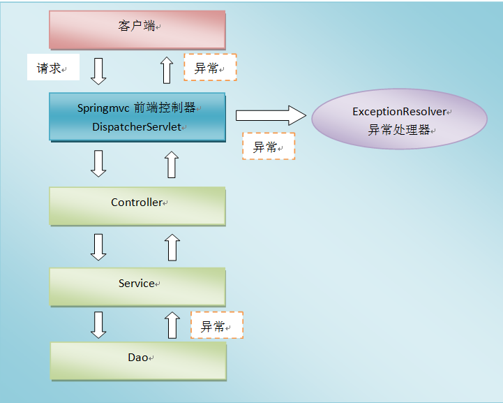

# SpringMVC文件上传下载及异常处理

本篇整理 SpringMVC 的文件上传（单文件、多文件）、文件下载（响应流与 ResponseEntity 两种方式），以及基于异常处理器与全局异常处理的异常处理机制。

## 1. SpringMVC 文件上传

文件上传时，客户端表单需要满足三个条件：

| 条件 | 说明 |
| --- | --- |
| 表单项 type = "file" | 提供文件选择框 |
| 表单的提交方式是 POST | GET 方式无法传输文件二进制数据 |
| 表单的 enctype 属性为 multipart/form-data | 以多部分表单形式提交 |

### 1.1 环境搭建

1）创建 Maven Web 工程。

2）导入坐标：

```xml
<?xml version="1.0" encoding="UTF-8"?>
<project xmlns="http://maven.apache.org/POM/4.0.0" xmlns:xsi="http://www.w3.org/2001/XMLSchema-instance"
         xsi:schemaLocation="http://maven.apache.org/POM/4.0.0 http://maven.apache.org/xsd/maven-4.0.0.xsd">
    <modelVersion>4.0.0</modelVersion>

    <groupId>com.qfedu</groupId>
    <artifactId>01_springmvc_fileupload</artifactId>
    <version>1.0.0</version>
    <packaging>war</packaging>

    <properties>
        <project.build.sourceEncoding>UTF-8</project.build.sourceEncoding>
        <maven.compiler.source>1.8</maven.compiler.source>
        <maven.compiler.target>1.8</maven.compiler.target>
    </properties>

    <dependencies>
        <dependency>
            <groupId>org.springframework</groupId>
            <artifactId>spring-context</artifactId>
            <version>5.2.6.RELEASE</version>
        </dependency>
        <dependency>
            <groupId>org.springframework</groupId>
            <artifactId>spring-web</artifactId>
            <version>5.2.6.RELEASE</version>
        </dependency>
        <dependency>
            <groupId>org.springframework</groupId>
            <artifactId>spring-webmvc</artifactId>
            <version>5.2.6.RELEASE</version>
        </dependency>
        <dependency>
            <groupId>javax.servlet</groupId>
            <artifactId>javax.servlet-api</artifactId>
            <version>3.0.1</version>
        </dependency>
        <dependency>
            <groupId>javax.servlet.jsp</groupId>
            <artifactId>javax.servlet.jsp-api</artifactId>
            <version>2.3.3</version>
        </dependency>
        <dependency>
            <groupId>commons-io</groupId>
            <artifactId>commons-io</artifactId>
            <version>2.6</version>
        </dependency>
        <dependency>
            <groupId>commons-fileupload</groupId>
            <artifactId>commons-fileupload</artifactId>
            <version>1.4</version>
        </dependency>
        <dependency>
            <groupId>junit</groupId>
            <artifactId>junit</artifactId>
            <version>4.11</version>
            <scope>test</scope>
        </dependency>
    </dependencies>
</project>
```

3）spring-mvc 配置文件：

```xml
<?xml version="1.0" encoding="UTF-8"?>
<beans xmlns="http://www.springframework.org/schema/beans"
       xmlns:context="http://www.springframework.org/schema/context"
       xmlns:mvc="http://www.springframework.org/schema/mvc"
       xmlns:xsi="http://www.w3.org/2001/XMLSchema-instance"
       xsi:schemaLocation="
        http://www.springframework.org/schema/beans
        http://www.springframework.org/schema/beans/spring-beans.xsd
        http://www.springframework.org/schema/context
        http://www.springframework.org/schema/context/spring-context.xsd
        http://www.springframework.org/schema/mvc
        http://www.springframework.org/schema/mvc/spring-mvc.xsd">
    <context:component-scan base-package="com.qfedu.controller" />
    <mvc:annotation-driven />

    <mvc:resources mapping="/js/**" location="/js/" />
    <mvc:resources mapping="/css/**" location="/css/" />
    <mvc:resources mapping="/img/**" location="/img/" />

    <bean id="viewResolver" class="org.springframework.web.servlet.view.InternalResourceViewResolver" >
        <property name="prefix" value="/jsp/" />
        <property name="suffix" value=".jsp" />
    </bean>

    <!-- 配置文件上传解析器
         这里的id一定要写，而且写法固定为multipartResolver
    -->
    <bean id="multipartResolver" class="org.springframework.web.multipart.commons.CommonsMultipartResolver" >
        <property name="defaultEncoding" value="utf-8" />
        <property name="maxUploadSize" value="90000000000" />
    </bean>
</beans>
```

> [!IMPORTANT]
> 文件上传解析器的 id 必须固定写为 `multipartResolver`，DispatcherServlet 在初始化时会按这个名称查找解析器 Bean，写成其他名字将无法完成文件解析。

4）用于文件上传的页面：

```html
<%@ page contentType="text/html;charset=UTF-8" language="java" %>
<html>
<body>
    <h2>单文件上传</h2>
    <form action="${pageContext.request.contextPath}/test/test1" method="post" enctype="multipart/form-data">
        姓名<input type="text" name="username" /><br/>
        文件<input type="file" name="upload" /><br/>
        <button type="submit">提交</button>
    </form>

    <h2>多文件上传</h2>
    <form action="${pageContext.request.contextPath}/test/test2" method="post" enctype="multipart/form-data">
        姓名<input type="text" name="username" /><br/>
        文件1<input type="file" name="upload" /><br/>
        文件2<input type="file" name="upload" /><br/>
        文件3<input type="file" name="upload" /><br/>
        <button type="submit">提交</button>
    </form>
</body>
</html>
```

5）success.jsp：

```html
<%@ page contentType="text/html;charset=UTF-8" language="java" %>
<html>
<head>
    <title>success</title>
</head>
<body>
    <p>success</p>
</body>
</html>
```

### 1.2 单文件上传

在方法参数中声明 `MultipartFile`，参数名与表单文件域的 name 一致，SpringMVC 会自动完成封装：

```java
/**
 * 单文件上传
 */
@RequestMapping("/test1")
public String test1(String username, MultipartFile upload) throws IOException {
    System.out.println(username);
    String filename = upload.getOriginalFilename();
    upload.transferTo(new File("D:/" + filename));
    return "success";
}
```

### 1.3 多文件上传

多文件上传只需要把参数类型改为 `MultipartFile[]`，逐个遍历保存即可：

```java
/**
 * 多文件上传
 */
@RequestMapping("/test2")
public String test2(String username, MultipartFile[] upload) throws IOException {
    System.out.println(username);
    for (MultipartFile file : upload) {
        String filename = file.getOriginalFilename();
        file.transferTo(new File("D:/" + filename));
    }
    return "success";
}
```

## 2. SpringMVC 文件下载

### 2.1 方式一：直接向 response 的输出流中写入文件流

```java
@RequestMapping("/download1")
public void download1(HttpServletResponse response) throws IOException {
    // 获取响应流
    ServletOutputStream outputStream = response.getOutputStream();
    // 读取文件
    byte[] arr = FileUtils.readFileToByteArray(new File("D:\\图片1.jpg"));
    // 设置响应头，URLEncoder.encode()用来设置文件名编码，防止文件名乱码
    response.setHeader("Content-Disposition", "attachment;filename=" + URLEncoder.encode("图片111.jpg", "UTF-8"));
    outputStream.write(arr);
    outputStream.flush();
    outputStream.close();
}
```

### 2.2 方式二：使用 ResponseEntity\<byte[]\> 向前端返回文件

```java
@RequestMapping("/download2")
public ResponseEntity<byte[]> download2() throws IOException {
    // 读取文件
    byte[] bytes = FileUtils.readFileToByteArray(new File("D:\\图片1.jpg"));
    HttpHeaders headers = new HttpHeaders();
    headers.set("Content-Disposition", "attachment;filename=" + URLEncoder.encode("图片111.jpg", "UTF-8"));
    ResponseEntity<byte[]> entity = new ResponseEntity<>(bytes, headers, HttpStatus.OK);
    return entity;
}
```

两种方式的共同点是都要通过响应头 `Content-Disposition` 告知浏览器以附件形式下载，并对中文文件名使用 `URLEncoder.encode()` 编码，防止文件名乱码；区别在于第一种需要手动操作响应流，第二种由 SpringMVC 帮我们完成写出。

## 3. SpringMVC 异常处理

### 3.1 异常处理思路

系统中 `dao`、`service`、`controller` 出现的异常都通过 `throws Exception` 向上抛出，最后由 SpringMVC 前端控制器交由**异常处理器**进行异常处理。



### 3.2 控制器异常处理

配置控制器异常处理，使用 `@Controller + @ExceptionHandler`。编写控制器类：

```java
@Controller
@RequestMapping("/test")
public class TestController {
    /**
     * @ExceptionHandler用来定义异常处理，这个异常处理写在控制器内部，
     * 只能处理该控制器内部方法出现的异常；
     * @ExceptionHandler的参数是Throwable实现类的Class数组，可以填多个值，但是要加大括号
     */
    @ExceptionHandler(ArithmeticException.class)
    public ModelAndView exceptionHandler(ArithmeticException e) {
        ModelAndView mv = new ModelAndView();

        mv.setViewName("error");
        mv.addObject("msg", e.getMessage());

        return mv;
    }

    @RequestMapping("/test1")
    public String test1() throws ArithmeticException {
        int a = 100 / 0;
        return "success";
    }
}
```

### 3.3 全局异常处理

控制器的异常处理只能处理本控制器内部的异常。如果希望处理所有控制器抛出的异常，而又不希望在控制器内部处理，就需要配置全局异常处理。配置全局异常处理，使用 `@ControllerAdvice + @ExceptionHandler`。

#### 3.3.1 在控制器中添加方法

```java
@RequestMapping("/test2")
public String test2(int a) throws Exception {
    if (a == 100) {
        throw new Exception("出错了");
    }
    return "success";
}
```

#### 3.3.2 编写全局异常处理类

```java
@ControllerAdvice
public class WebExceptionHandler {
    /**
     * 全局异常处理，处理Exception
     */
    @ExceptionHandler(Exception.class)
    public ModelAndView handleRuntimeException(Exception e) {
        System.out.println("MyException----全局异常处理...");

        ModelAndView mv = new ModelAndView();
        mv.setViewName("error");
        mv.addObject("msg", e.getMessage());

        return mv;
    }
}
```

> [!NOTE]
> `@ControllerAdvice` 标注的类会被 SpringMVC 自动扫描为全局的增强配置，其中被 `@ExceptionHandler` 标注的方法可以处理所有控制器抛出的对应类型异常。

### 3.4 异常处理返回 JSON 数据

前后端分离的场景下，异常通常以 JSON 形式返回给前端。

#### 3.4.1 修改全局异常处理类

```java
@ControllerAdvice
public class WebExceptionHandler {
    /**
     * 全局异常处理，处理Exception
     * 返回JSON
     */
    @ExceptionHandler(Exception.class)
    @ResponseBody
    public String handleRuntimeException(Exception e) {
        return "{\"msg\":\"出错了\"}";
    }
}
```

#### 3.4.2 发送请求的页面

```html
<%@ page contentType="text/html;charset=UTF-8" language="java" %>
<html>
<head>
    <title>Index</title>
    <script src="${pageContext.request.contextPath}/js/jquery-3.3.1.js"></script>
    <script>
        $(function () {
            $("#btn").click(function () {
                // 发送ajax请求
                $.ajax({
                    url: "${pageContext.request.contextPath}/test/test2",
                    data: {a: 100},
                    dataType: "JSON",
                    type: "POST",
                    success: function(data) {
                        console.log(data);
                    }
                });
            });
        });
    </script>
</head>
<body>
    <p>
        <a href="${pageContext.request.contextPath}/test/test1">测试控制器异常处理</a>
    </p>
    <p>
        <a href="${pageContext.request.contextPath}/test/test2?a=100">测试全局异常处理</a>
    </p>
    <p>
        <button id="btn" type="button">测试全局异常处理，返回JSON</button>
    </p>
</body>
</html>
```

## 4. 本章小结

- 文件上传三要素：`type="file"` 的表单项、POST 提交、`enctype="multipart/form-data"`；服务端配置 id 固定为 `multipartResolver` 的解析器，Controller 用 `MultipartFile` / `MultipartFile[]` 接收；
- 文件下载的本质是把文件字节写入响应，并设置 `Content-Disposition` 响应头；两种实现：手动操作 response 输出流，或返回 `ResponseEntity<byte[]>`；
- 异常处理两条路：控制器内部的 `@ExceptionHandler` 只处理本类异常，`@ControllerAdvice` 全局异常处理器统一处理所有控制器异常，加 `@ResponseBody` 可返回 JSON。
