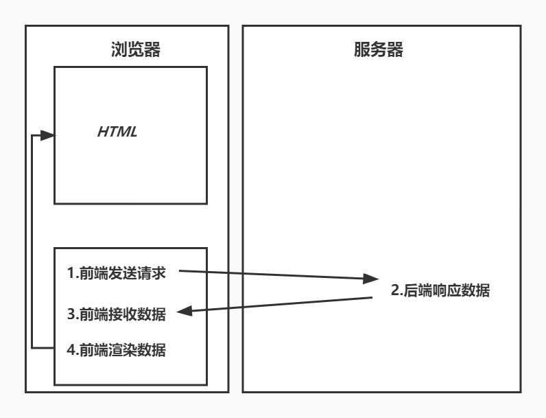
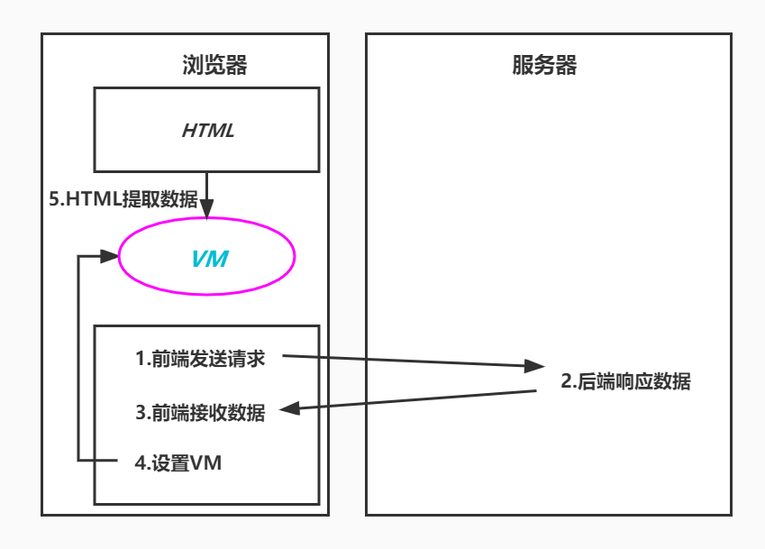
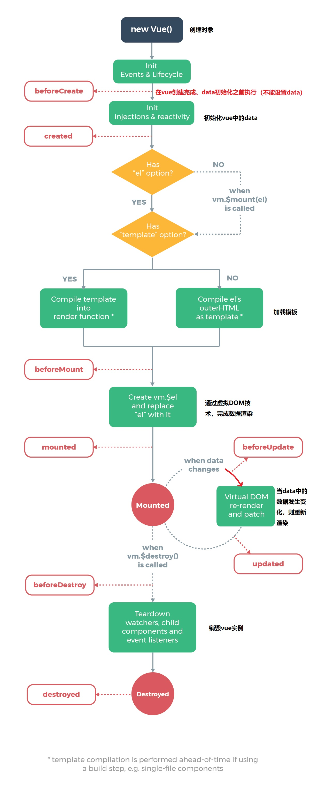

# Vue入门

本篇整理 Vue 的基本概念（MVVM 模型）、入门案例、基础语法（插值、指令、双向绑定）、条件渲染与列表渲染、事件处理、计算属性与侦听器、class 与 style 绑定、表单输入绑定以及 Vue 实例的生命周期。

## 1. Vue 简介

### 1.1 使用 jQuery 存在的问题

使用 jQuery 进行前后端分离开发，既可以实现前后端交互，又可以完成数据渲染。

存在的问题：jQuery 需要通过 HTML 标签拼接、DOM 节点操作完成数据的显示，开发效率低且容易出错，渲染效率也较低。

Vue.js 是继 jQuery 之后的又一优秀前端框架：**专注于前端数据的渲染——语法简单、渲染效率高**。

### 1.2 Vue.js 是什么

Vue（读音 `/vjuː/`，类似于 view）是一套用于**构建用户界面的渐进式框架**。

Vue 的核心库只关注视图层，不仅易于上手，还便于与第三方库或既有项目整合。另一方面，当与现代化的工具链以及各种支持类库结合使用时，Vue 也完全能够为复杂的单页应用提供驱动。

官方网站：<https://cn.vuejs.org>

### 1.3 关于 MVVM

项目结构经历的三个阶段：

- **后端 MVC**：可以理解为单体架构，流程控制由后端控制器完成；
- **前端 MVC**：前后端分离开发，后端只负责接收响应请求；
- **MVVM**：前端请求后端接口，后端返回数据，前端接收数据并将接收的数据设置到 VM，HTML 从 VM 取值：
  - M（Model）：数据模型，指的是后端接口返回的数据；
  - V（View）：视图；
  - VM（ViewModel）：视图模型，是数据模型与视图之间的桥梁。后端返回的 Model 转换为前端所需的 VM，视图层可以直接从 VM 中提取数据。

前端 MVC 结构图：



MVVM 结构图：



## 2. Vue 入门案例

Vue 的核心库只关注视图层，不仅易于上手，还便于与第三方库或既有项目整合。

在讲 Axios 之前，我们都假设数据是通过 ajax 请求返回的数据。我们主要学习的是上图中步骤 4 和之后的内容。

### 2.1 引入 Vue.js

引入 Vue.js 有两种方式：

- **离线引用**：下载 Vue 的 js 文件，添加到前端项目，在网页中通过 script 标签引用 Vue.js 文件；
- **CDN 引用**：

```html
<script src="https://cdn.jsdelivr.net/npm/Vue/dist/Vue.js"></script>
```

### 2.2 入门案例

```html
<!DOCTYPE html>
<html lang="en">
<head>
    <meta charset="UTF-8">
    <title>vue入门</title>
</head>
<body>
    <div id="app">
        {{message}}
    </div>

    <script src="js/vue.js"></script>
    <script>
        new Vue({
            el: "#app",
            data: {
                message: "hello vue!"
            }
        })
    </script>
</body>
</html>
```

这就是**声明式渲染**：Vue.js 的核心是一个允许采用简洁的模板语法来声明式地将数据渲染进 DOM 的系统。

这里的核心思想就是没有繁琐的 DOM 操作。例如在 jQuery 中，我们需要先找到 div 节点，获取到 DOM 对象，然后进行一系列的节点操作；而在 Vue 中，只需维护 `data` 里的数据，视图会自动更新。

## 3. Vue 基础

### 3.1 基本类型数据和字符串

```html
<body>
<div id="app">
    <p>姓名:{{name}}</p>
    <p>年龄:{{age}}</p>
</div>

<script src="js/vue.js"></script>
<script>
    new Vue({
        el: "#app",
        data: {
            name: 'zs',
            age: 10
        }
    })
</script>
</body>
```

### 3.2 对象类型数据

```html
<body>
<div id="app">
    <p>姓名:{{user.name}}</p>
    <p>年龄:{{user.age}}</p>
</div>

<script src="js/vue.js"></script>
<script>
    new Vue({
        el: "#app",
        data: {
            user: {
                name: 'zs',
                age: 10
            }
        }
    })
</script>
</body>
```

### 3.3 基本数据渲染和指令

`v-bind` 被称为**指令**，指令带有前缀 `v-`。

除了使用插值表达式 `{{}}` 进行数据渲染，也可以使用 `v-bind` 指令，它的简写形式就是一个冒号 `:`。`v-bind` 通常用于为**标签的属性**绑定值。

```html
<body>
<div id="app">
    <div>
        <!-- 如果要将模型数据绑定在html属性中，则使用v-bind指令，此时title中显示的是模型数据 -->
        <h5 v-bind:title="title">{{content}}</h5>
        <h5 :title="title">{{content}}</h5>
    </div>
</div>

<script src="js/vue.js"></script>
<script>
    new Vue({
        el: "#app",
        data: {
            content: 'hello vue.js',
            title: '页面加载于 ' + new Date().toLocaleString()
        }
    })
</script>
</body>
```

### 3.4 双向数据绑定

- 双向数据绑定使用 `v-model`；
- 一般使用在表单输入标签上；
- `v-model:value` 可以简写为 `v-model`。

```html
<body>
<div id="app">
    <p>
        单向数据绑定<input type="text" v-bind:value="keyword">
    </p>
    <p>
        双向数据绑定<input type="text" v-model="keyword">
    </p>
    <p>
        {{keyword}}
    </p>
</div>

<script src="js/vue.js"></script>
<script>
    new Vue({
        el: "#app",
        data: {
            keyword: 'vue.js'
        }
    })
</script>
</body>
```

通过上面的案例我们发现：修改 `v-model` 输入框中的数据，`data` 对象中的数据也被同步修改；而单向绑定的输入框中修改内容不会影响 `data`。

## 4. 条件渲染与列表渲染

### 4.1 条件渲染

#### 4.1.1 v-if

在 HTML 标签上可以添加 `v-if` 指令指定一个条件：如果条件成立则显示此 HTML 标签，如果不成立则不显示当前标签。条件可以是一个表达式，也可以是一个具体的 `boolean` 类型值。

```html
<body>
<div id="app">
    <p>id: {{student.id}}</p>
    <p>name: {{student.name}}</p>
    <p>age: {{student.age}}</p>
    <p>gender:
        <span v-if="student.gender == 'M'">男</span>
        <span v-if="student.gender == 'F'">女</span>
    </p>
</div>

<script src="js/vue.js"></script>
<script>
    new Vue({
        el: "#app",
        data: {
            student: {
                id: 10,
                name: '张三',
                age: 20,
                gender: 'M'
            }
        }
    })
</script>
</body>
```

#### 4.1.2 v-else

```html
<body>
<div id="app">
    <p>id: {{student.id}}</p>
    <p>name: {{student.name}}</p>
    <p>age: {{student.age}}</p>
    <p>gender:
        <span v-if="student.gender == 'M'">男</span>
        <span v-else>女</span>
    </p>
</div>

<script src="js/vue.js"></script>
<script>
    new Vue({
        el: "#app",
        data: {
            student: {
                id: 10,
                name: '张三',
                age: 20,
                gender: 'M'
            }
        }
    })
</script>
</body>
```

#### 4.1.3 v-else-if

```html
<body>
<div id="app">
    <p>id: {{student.id}}</p>
    <p>name: {{student.name}}</p>
    <p>age: {{student.age}}</p>
    <p>gender:
        <span v-if="student.gender == 'M'">男</span>
        <span v-else>女</span>
    </p>
    <p>level:
        <span v-if="student.score >= 90">A</span>
        <span v-else-if="student.score >= 80">B</span>
        <span v-else-if="student.score >= 60">C</span>
        <span v-else>D</span>
    </p>
</div>

<script src="js/vue.js"></script>
<script>
    new Vue({
        el: "#app",
        data: {
            student: {
                id: 10,
                name: '张三',
                age: 20,
                gender: 'M',
                score: 90
            }
        }
    })
</script>
</body>
```

#### 4.1.4 v-show

```html
<p>
    gender:
    <span v-show="student.gender == 'M'">男</span>
    <span v-show="student.gender == 'F'">女</span>
</p>
```

从功能上将 `v-show` 和 `v-if` 作用是相同的，但渲染过程有区别：

- `v-if` 是"真正"的条件渲染，它会确保在切换过程中条件块内的事件监听器和子组件适当地被销毁和重建。`v-if` 也是**惰性的**：如果在初始渲染时条件为假，则什么也不做——直到条件第一次变为真时，才会开始渲染条件块；
- 相比之下，`v-show` 就简单得多——不管初始条件是什么，元素总是会被渲染，并且只是简单地基于 CSS 进行切换。

| 指令 | 渲染方式 | 适用场景 |
| --- | --- | --- |
| `v-if` | 条件为假时不渲染 DOM，切换时销毁/重建 | 运行时条件很少改变 |
| `v-show` | 始终渲染 DOM，通过 CSS `display` 切换显示 | 需要非常频繁地切换 |

### 4.2 列表渲染

将集合数据以表格、列表的形式显示。

遍历指定次数，显示 10 个整数：

```html
<body>
<div id="app">
    <ul>
        <li v-for="num in 10">{{num}}</li>
    </ul>
    <hr/>
    <!-- index表示索引 -->
    <ul>
        <li v-for="(num, index) in 10">{{num}}-{{index}}</li>
    </ul>
</div>

<script src="js/vue.js"></script>
<script>
    new Vue({
        el: "#app",
        data: {}
    })
</script>
</body>
```

遍历数组并显示：

```html
<body>
<div id="app">
    <ul>
        <li v-for="(item, index) in titles">{{item}}</li>
    </ul>
</div>

<script src="js/vue.js"></script>
<script>
    new Vue({
        el: "#app",
        data: {
            titles: ['Java', 'JavaWeb', 'SSM', 'SpringBoot']
        }
    })
</script>
</body>
```

遍历对象数组并以表格显示：

```html
<body>
<div id="app">
    <table>
        <tr>
            <td>id</td>
            <td>username</td>
            <td>age</td>
        </tr>
        <tr v-for="(user, index) in userList">
            <td>{{user.id}}</td>
            <td>{{user.username}}</td>
            <td>{{user.age}}</td>
        </tr>
    </table>
</div>

<script src="js/vue.js"></script>
<script>
    new Vue({
        el: "#app",
        data: {
            userList: [
                { id: 1, username: 'helen', age: 18 },
                { id: 2, username: 'peter', age: 28 },
                { id: 3, username: 'andy', age: 38 }
            ]
        }
    })
</script>
</body>
```

## 5. 事件处理

在使用 Vue 进行数据渲染时，如果使用原生 js 事件绑定（例如 onclick），需要获取 Vue 实例中的数据并传参时，只能通过字符串拼接来完成。

Vue 提供了 `v-on` 指令用于绑定各种事件（如 `v-on:click`），简化了从 Vue 取值的过程，但触发的方法需要定义在 Vue 实例的 `methods` 中：

```html
<button type="button" v-on:click="doDelete(s.stuNum,s.stuName)">删除</button>

<script type="text/javascript">
    var vm = new Vue({
        el:"#container",
        data:{},
        methods:{
            doDelete:function(snum,sname){
                console.log("----delete:"+snum+"   "+sname)
            }
        }
    });
</script>
```

- `v-on:click` 可以缩写为 `@click`。

### 5.1 使用 JS 函数传值

直接在事件绑定表达式中传入 data 中的数据：

```html
<body>
<div id="app">
    <button v-on:click="doSth(stu.id)">click</button>
</div>

<script src="js/vue.js"></script>
<script>
    new Vue({
        el: "#app",
        data: {
            stu: {
                id: 10,
                name: 'zs'
            }
        },
        methods: {
            doSth(id) {
                console.log(id)
            }
        }
    })
</script>
</body>
```

### 5.2 使用 dataset 对象传值

把数据绑定到标签的 `data-*` 自定义属性上，在事件对象中通过 `dataset` 获取：

```html
<!DOCTYPE html>
<html lang="en">
<head>
    <meta charset="UTF-8">
    <title>dataset传值</title>
</head>
<body>
<div id="app">
    <button v-on:click="doSth" :data-id="stu.id">click</button>
</div>

<script src="js/vue.js"></script>
<script>
    new Vue({
        el: "#app",
        data: {
            stu: {
                id: 10,
                name: 'zs'
            }
        },
        methods: {
            doSth(event) {
                console.log(event.srcElement.dataset)
                console.log(event.srcElement.dataset.id)
            }
        }
    })
</script>
</body>
</html>
```

### 5.3 混合使用

既传数据又传事件对象时，事件对象用特殊变量 `$event` 表示：

```html
<body>
<div id="app">
    <button v-on:click="doSth(stu.name, $event)" :data-id="stu.id">click</button>
</div>

<script src="js/vue.js"></script>
<script>
    new Vue({
        el: "#app",
        data: {
            stu: {
                id: 10,
                name: 'zs'
            }
        },
        methods: {
            doSth(name, event) {
                console.log(name)
                console.log(event.srcElement.dataset.id)
            }
        }
    })
</script>
</body>
```

### 5.4 事件修饰符

当使用 `v-on` 进行事件绑定的时候，可以添加特定后缀，设置事件触发的特性。

#### 5.4.1 事件修饰符使用示例

```html
<button type="submit" @click.prevent="事件函数">测试</button>
```

#### 5.4.2 事件修饰符

`.prevent` 消除元素的默认事件：

```html
<body>
<div id="app">
    <form action="https://www.baidu.com" method="post" v-on:submit.prevent="test()">
        <button type="submit">提交</button>
    </form>
</div>

<script src="js/vue.js"></script>
<script>
    new Vue({
        el: "#app",
        data: {
        },
        methods: {
            test() {
                console.log("---------------------------------------")
            }
        }
    })
</script>
</body>
```

`.stop` 阻止事件冒泡（阻止子标签向上冒泡）；`.self` 设置只能自己触发事件（子标签不能触发）：

```html
<div id="app">
    <div style="width: 200px; height: 200px; background: red;" @click.self="method1">
        <div style="width: 150px; height: 150px; background: green;" @click="method2">
            <button type="button" @click.stop="method3">测试</button>
        </div>
    </div>
</div>

<script type="text/javascript">
    var vm = new Vue({
        el:"#app",
        data:{},
        methods:{
            method1:function(){
                alert("1");
            },
            method2:function(){
                alert("2");
            },
            method3:function(){
                alert("3");
            }
        }
    });
</script>
```

`.once` 限定事件只触发一次。

常用事件修饰符汇总：

| 修饰符 | 作用 |
| --- | --- |
| `.prevent` | 阻止元素的默认事件 |
| `.stop` | 阻止事件冒泡 |
| `.self` | 只有事件目标是自己时才触发 |
| `.once` | 事件只触发一次 |

#### 5.4.3 按键修饰符

按键修饰符就是针对键盘事件的修饰符，限定哪个按键会触发事件：

```html
<input type="text" @keyup.enter="method4"/>
```

Vue 提供的按键别名：

- `.enter`
- `.tab`
- `.delete`（捕获"删除"和"退格"键）
- `.esc`
- `.space`
- `.up`
- `.down`
- `.left`
- `.right`

除了以上 Vue 提供的按键别名之外，我们还可以根据键盘码为按键自定义别名（参见[键盘码](https://developer.mozilla.org/en-US/docs/Web/API/KeyboardEvent/keyCode)）。**示例**：

```html
<div id="container">
    <!-- 2.使用自定义的按键别名aaa作为修饰符 -->
    <input type="text" @keyup.aaa="method4"/>
</div>
<script type="text/javascript">
    // 1.为按键J定义别名为aaa
    Vue.config.keyCodes.aaa = 74;

    var vm = new Vue({
        el:"#container",
        data:{},
        methods:{
            method4:function(){
                alert("4");
            }
        }
    });
</script>
```

#### 5.4.4 系统修饰符

系统修饰符用于组合键，例如 `ctrl+j` 触发事件：

```html
<div id="container">
    <input type="text" @keyup.ctrl.j="method4"/>
</div>
<script type="text/javascript">
    Vue.config.keyCodes.j = 74;

    var vm = new Vue({
        el:"#container",
        data:{},
        methods:{
            method4:function(){
                alert("4");
            }
        }
    });
</script>
```

可用的系统修饰符：

- `.ctrl`
- `.alt`
- `.shift`
- `.meta`（Windows 键）

## 6. 计算属性与侦听器

### 6.1 计算属性

属性可以通过在 `data` 中声明获得，也可以通过在 `computed` 中计算获得。

**特性**：计算属性所依赖的属性值发生变化时，计算属性的值也会同时发生变化。

**示例**：

```html
<!DOCTYPE html>
<html>
<head>
    <meta charset="UTF-8">
    <title>计算属性</title>
    <script type="text/javascript" src="js/Vue.js"></script>
</head>
<body>
    <div id="container">
        <input type="text" v-model="str1"/><br/>
        <input type="text" v-model="str2"/><br/>
        {{str3}}
    </div>

    <script type="text/javascript">
        var vm = new Vue({
            el:"#container",
            data:{
                str1:"千锋",
                str2:"青岛"
            },
            computed:{
                str3:function(){
                    return this.str1 + this.str2;
                }
            }
        });
    </script>
</body>
</html>
```

### 6.2 侦听器

侦听器，就是 `data` 中属性的监听器：当 `data` 中的属性值发生变化时，就会触发侦听器函数的执行。

```html
<!DOCTYPE html>
<html>
<head>
    <meta charset="UTF-8">
    <title>侦听器</title>
    <script type="text/javascript" src="js/Vue.js"></script>
</head>
<body>
    <div id="container">
        <input type="text" v-model="str1"/><br/>
        <input type="text" v-model="str2"/><br/>
        {{str3}}
    </div>

    <script type="text/javascript">
        var vm = new Vue({
            el:"#container",
            data:{
                str1:"千锋",
                str2:"青岛",
                str3:"千锋青岛"
            },
            watch:{
                str1:function(){
                    this.str3 = this.str1 + this.str2;
                },
                str2:function(){
                    this.str3 = this.str1 + this.str2;
                }
            }
        });
    </script>
</body>
</html>
```

> [!TIP]
> 上面两个例子实现的效果相同。一般来说，能用计算属性实现的优先用计算属性（代码更简洁且会缓存结果）；侦听器更适合执行异步操作或开销较大的任务。

## 7. class 与 style 绑定

### 7.1 class 绑定

```html
<!DOCTYPE html>
<html>
<head>
    <meta charset="utf-8" />
    <title>class绑定</title>
    <style>
        .c1 {
            border: 2px solid fuchsia;
        }

        .c2 {
            text-align: center;
        }
    </style>
</head>
<body>
    <div id="app">
        <!--
            class是一个属性
            v-bind:class="data当中的某个属性"
        -->
        <p class="c1">千锋青岛</p>
        <p v-bind:class="myClass1">千锋青岛</p>
        <!-- class有多个值绑定 -->
        <p class="c1 c2">千锋北京</p>
        <p :class="[myClass1, myClass2]">千锋北京</p>
        <!--
            通过标志控制让哪一个class生效
            三元运算符：条件表达式 ? 表达式1 : 表达式2
        -->
        <p :class="[flag3 ? myClass1 : myClass2]">千锋成都</p>
        <!--
            通过标志控制让哪一个class生效，如果标志为true就生效
        -->
        <p :class="{c1:flag1, c2:flag2}">千锋郑州</p>
    </div>
    <script src="./js/vue.js"></script>
    <script>
        // 创建vue对象 - vue的实例
        new Vue({
            el: "#app", // 表示要操作的元素
            data: { // 数据
                myClass1: 'c1',
                myClass2: 'c2',
                flag1: true,
                flag2: false,
                flag3: false
            }
        })
    </script>
</body>
</html>
```

### 7.2 style 绑定

```html
<!DOCTYPE html>
<html>
<head>
    <meta charset="utf-8" />
    <title>style绑定</title>
    <script src="./js/vue.js"></script>
</head>
<body>
    <div id="app">
        <!--
            style是标签中的属性，可以为style使用v-bind进行绑定
        -->
        <p style="border: 1px solid cadetblue;">JavaEE</p>
        <p :style="mystyle">前端</p>
        <!--
            更细粒度的控制 - 只设定css的一部分
            语法:JSON
            注意：CSS的属性名要用驼峰写法，css键值对之间用逗号分割
        -->
        <p :style="{color: mycolor, textAlign: mytextalign, backgroundColor: mybackgroundColor}">大数据</p>
        <!--
            为style属性绑定data中定义的表示css的对象
        -->
        <p :style="mystyle1">运维</p>
        <p :style="[mystyle1]">运维</p>
        <p :style="[mystyle1, mystyle2]">软件测试</p>
    </div>
</body>

<script>
    // 创建vue对象 - vue的实例
    new Vue({
        el: "#app", // 表示要操作的元素
        data: { // 数据
            mystyle: 'border: 5px solid #FF0000; text-align: center;',
            mycolor: 'yellow',
            mytextalign: "right",
            mybackgroundColor: 'brown',
            mystyle1: {
                color: 'red',
                border: '5px solid #000000'
            },
            mystyle2: {
                backgroundColor: 'green'
            }
        }
    })
</script>
</html>
```

## 8. 表单输入绑定

表单输入绑定，即双向绑定：就是能够将 Vue 实例的 data 数据渲染到表单输入视图（input、textarea、select），也能够将输入视图的数据同步更新到 Vue 实例的 data 中。

```html
<!DOCTYPE html>
<html>
<head>
    <meta charset="utf-8" />
    <title>表单输入绑定</title>
</head>
<body>
    <div id="app">
        <p>{{gender}}</p>
        <div>
            <input type="radio" name="gender" value="男" v-model="gender">
            <input type="radio" name="gender" value="女" v-model="gender">
        </div>
        <p>{{hobby}}</p>
        <div>
            <input type="checkbox" name="hobby" value="游泳" v-model="hobby">
            <input type="checkbox" name="hobby" value="跑步" v-model="hobby">
            <input type="checkbox" name="hobby" value="学习" v-model="hobby">
        </div>
        <p>{{city}}</p>
        <!-- 下拉菜单 单选 -->
        <select v-model="city">
            <option value="BJ">北京</option>
            <option value="SH">上海</option>
            <option value="GZ">广州</option>
            <option value="QD">青岛</option>
        </select>
        <hr/>
        <p>{{citys}}</p>
        <!-- 下拉菜单 多选 -->
        <select v-model="citys" multiple="multiple">
            <option value="BJ">北京</option>
            <option value="SH">上海</option>
            <option value="GZ">广州</option>
            <option value="QD">青岛</option>
        </select>
    </div>

    <script src="js/vue.js"></script>
    <script>
        // 创建vue对象
        new Vue({
            el: "#app", // 表示要操作的元素
            data: { // 数据
                gender: '',
                hobby: [],
                city: '',
                citys: []
            }
        })
    </script>
</body>
</html>
```

> [!NOTE]
> 单选框和单选下拉框绑定的 data 是字符串，复选框和多选下拉框绑定的 data 是数组，初始值类型要与控件类型匹配。

## 9. Vue 实例

每个使用 Vue 进行数据渲染的网页文档都需要创建一个 Vue 实例——ViewModel。

### 9.1 Vue 实例的生命周期

Vue 实例生命周期——Vue 实例从创建到销毁的过程：

1. 创建 Vue 实例（初始化 data、加载 el）；
2. 数据挂载（将 Vue 实例 data 中的数据渲染到网页 HTML 标签）；
3. 重新渲染（当 Vue 的 data 数据发生变化，会重新渲染到 HTML 标签）；
4. 销毁实例。

### 9.2 钩子函数

为了便于开发者在 Vue 实例生命周期的不同阶段进行特定的操作，Vue 在生命周期四个阶段的前后分别提供了一个函数。这个函数无需开发者调用，当 Vue 实例到达生命周期的指定阶段会自动调用对应的函数。

| 生命周期阶段 | 钩子函数 | 触发时机 |
| --- | --- | --- |
| 创建 | `beforeCreate` / `created` | 实例初始化之前 / 实例创建完成（data 已初始化） |
| 挂载 | `beforeMount` / `mounted` | 挂载开始之前 / 数据已渲染到页面 |
| 更新 | `beforeUpdate` / `updated` | 数据更新之前 / 页面重新渲染完成 |
| 销毁 | `beforeDestroy` / `destroyed` | 销毁之前 / 销毁完成 |

生命周期图示：



```html
<!DOCTYPE html>
<html>
<head>
    <meta charset="utf-8">
    <title>04_vue_生命周期_钩子函数</title>
</head>
<body>
    <div id="app">
        <!--
            v-once 只能渲染一次
        -->
        <p v-once>{{msg}}</p>
        <p>{{msg}}</p>
        <p><input type="text" v-model="msg"></p>
    </div>
</body>

<script src="js/vue.min.js"></script>
<script>
    new Vue({
        el: "#app",
        data: {
            msg: "hello world"
        },
        // 钩子函数
        beforeCreate: function () {
            console.log("beforeCreate")
            this.msg = "0000000000"
        },
        created: function () {
            console.log("created")
            // ajax
        },
        beforeMount: function () {
            console.log("beforeMount")
            // this.msg = 1000000
            // ajax
        },
        mounted: function () {
            console.log("mounted")
            // this.msg = 2000000000
            // ajax
        },
        beforeUpdate: function () {
            console.log("beforeUpdate", this.msg);
        },
        updated: function () {
            console.log("updated", this.msg);
        },
        beforeDestroy: function () {

        },
        destroyed: function () {

        }
    })
</script>
</html>
```

我们经常使用 `created`、`beforeMount`、`mounted` 进行数据处理（例如发送 ajax 请求）。

## 10. 本章小结

- Vue 是专注视图层的渐进式框架，MVVM 模式让开发者只需维护数据，视图自动更新；
- 数据渲染用插值表达式 `{{}}`，属性绑定用 `v-bind`（简写 `:`），表单双向绑定用 `v-model`；
- 条件渲染 `v-if`（惰性、切换开销大）与 `v-show`（CSS 切换、初始开销大）按场景选择，列表渲染用 `v-for`；
- 事件用 `v-on`（简写 `@`），传值可以直接传数据、通过 `dataset` 或混合 `$event`；修饰符（`.prevent`/`.stop`/`.self`/`.once`、按键修饰符、系统修饰符）简化了事件细节处理；
- 派生数据优先用计算属性 `computed`，异步或开销大的操作用侦听器 `watch`；
- Vue 实例的生命周期分创建、挂载、更新、销毁四个阶段，每个阶段前后各有钩子函数，`created` 与 `mounted` 是最常用的数据处理时机。
