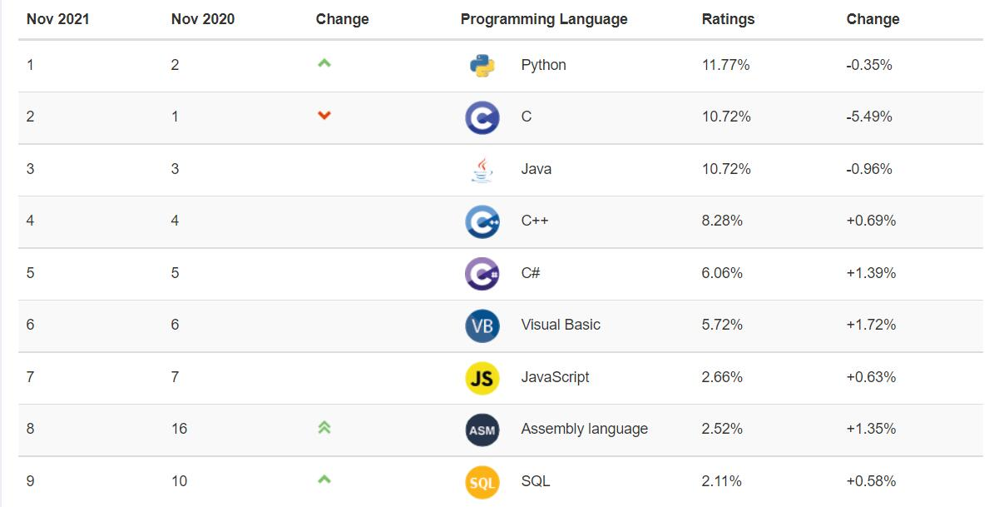
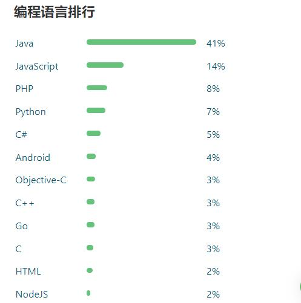
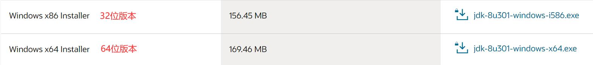
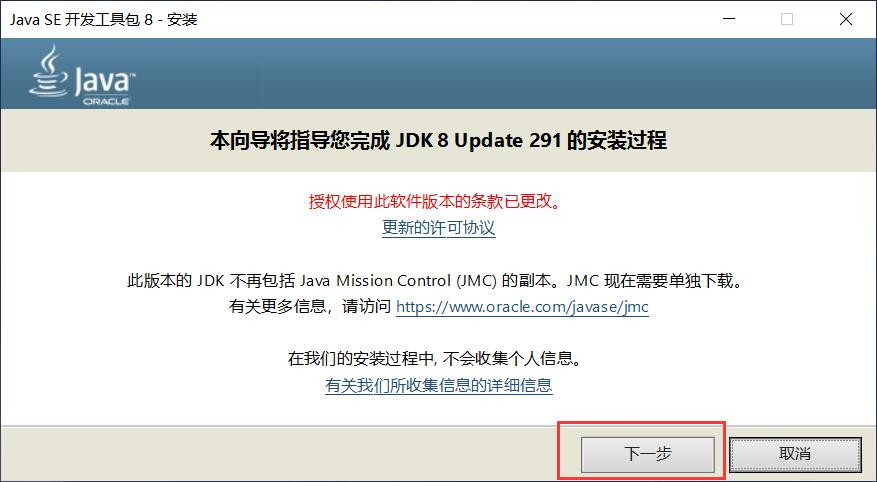
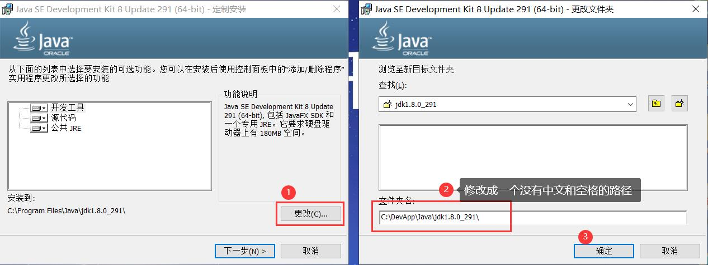
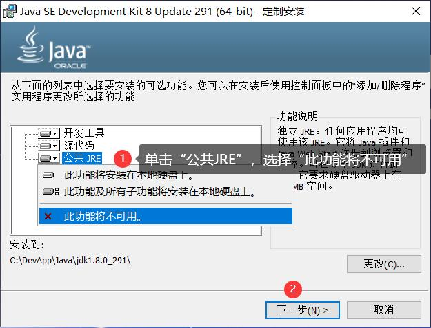
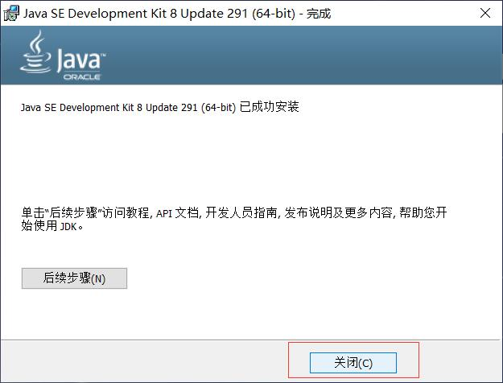
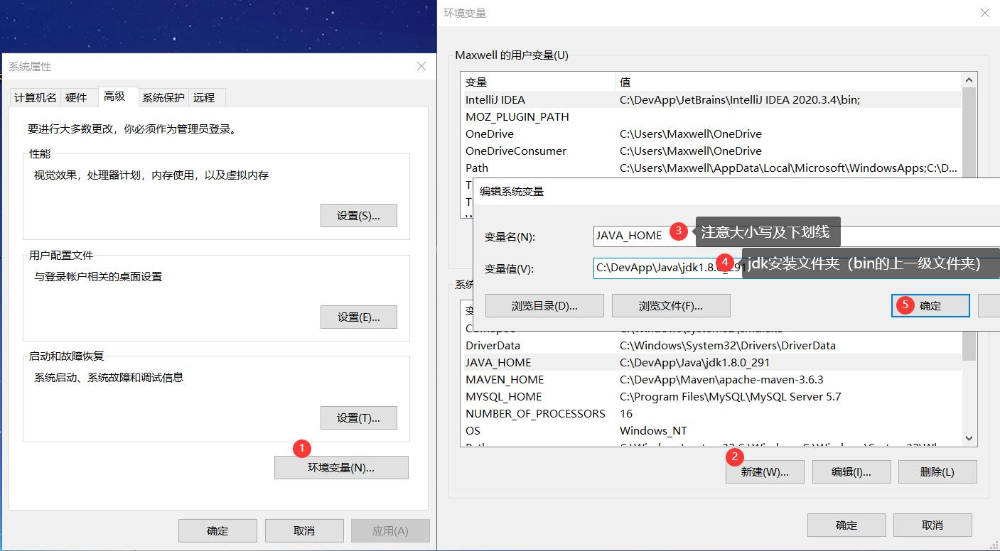
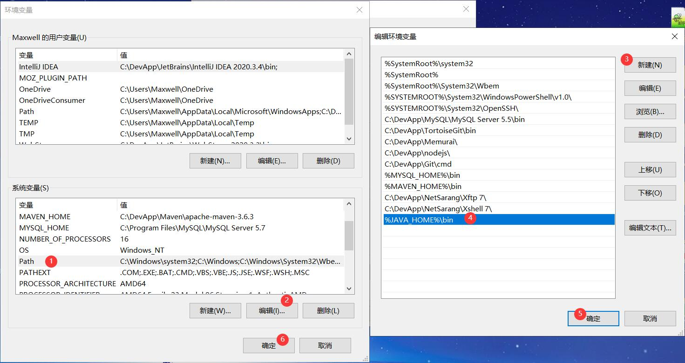
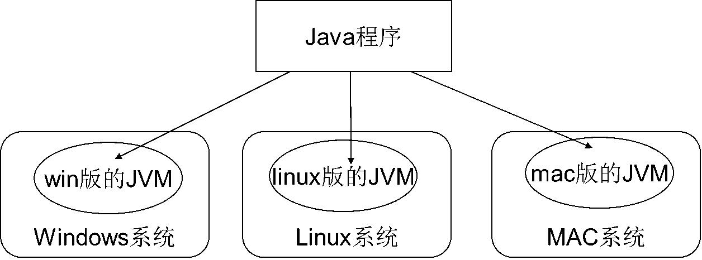

# Java入门与开发环境搭建

本篇整理 Java 入门所需的计算机基础知识、Java 语言概述、JDK 安装与环境变量配置，以及第一个 Java 程序的编写、编译与运行。

## 1. 计算机基础知识

### 1.1 软件开发

**软件**（Software）是一系列按照特定顺序组织的计算机**数据**和**指令**的集合。

软件按用途可分为两类：

| 分类 | 说明 | 示例 |
| --- | --- | --- |
| 系统软件 | 管理计算机硬件与软件资源的底层软件 | Windows、Linux、Android、iOS |
| 应用软件 | 面向用户具体需求开发的软件 | QQ、迅雷、微信等 |

**软件开发**是根据用户要求建造出软件系统或者系统中的软件部分的过程，软件一般是用**某种程序设计语言**来实现的。

### 1.2 人机交互方式

#### 1.2.1 交互方式分类

- **图形用户界面方式**（GUI：Graphical User Interface）：简单直观，使用者易于接受，容易上手操作；
- **命令行方式**（CLI：Command Line Interface）：需要有一个控制台，输入特定的指令，让计算机完成一些操作。较为麻烦，需要记住一些命令。

#### 1.2.2 打开 DOS 窗口的几种方式

- `Win + R`，然后输入 `cmd`，确定；
- 开始菜单 - Windows 系统 - 命令提示符；
- 进入文件夹，在地址栏输入 `cmd`。

#### 1.2.3 常用 DOS 命令

| 命令 | 功能 |
| --- | --- |
| `dir` | 列出当前目录下的文件以及目录 |
| `md` | 创建目录 |
| `rd` | 删除目录。`/s` 除目录本身外，还将删除指定目录下的所有子目录和文件，用于删除目录树；`/q` 为安静模式，带 `/s` 删除目录树时不要求确认 |
| `cd` | 进入指定目录。`.` 当前目录，`..` 上一级目录，`\` 根目录 |
| `del` | 删除文件 |
| `exit` | 退出 DOS 命令行 |
| `cls` | 清屏 |

> [!TIP]
> 常用快捷键：`Tab` 自动补全；`← →` 移动光标；`↑ ↓` 调阅历史操作命令；`Delete` 和 `Backspace` 删除字符。

### 1.3 计算机语言

**语言**是人与人之间用于沟通的一种方式，例如中国人与中国人用中文沟通。语言可以理解成**双方都理解的一种约定**。

**计算机语言**则是人与计算机交流的方式。要和计算机交流，就要学习计算机可以理解的语言。计算机语言有很多，如 C、C++、Java、.Net、Python，我们选择学习 Java。

## 2. Java语言概述

### 2.1 Java语言简介

Java 由 Sun Microsystems（Sun 公司）推出，主要作者是**James Gosling（詹姆斯·高斯林）**和其同事，Sun 公司后被 Oracle 收购。

发展历史：

- 1991 年，为消费类电子产品研发，最初名为 Oak；
- **1995 年，正式推出，更名为 Java；**
- 1996 年，发布 JDK 1.0，约 8.3 万个网页应用 Java 技术来制作；
- 1997 年，发布 JDK 1.1，JavaOne 会议召开，创当时全球同类会议规模之最；
- 1998 年，发布 JDK 1.2，同年发布企业平台 J2EE；
- 1999 年，Java 分成 J2SE、J2EE 和 J2ME，JSP/Servlet 技术诞生；
- **2004 年，发布里程碑式版本 JDK 1.5，为突出此版本的重要性，更名为 JDK 5.0；**
- 2005 年，J2SE 更名 JavaSE，J2EE 更名 JavaEE，J2ME 更名 JavaME；
- 2009 年，Oracle 公司收购 Sun 公司，交易价格 74 亿美元；
- 2011 年，发布 JDK 7.0；
- **2014 年，发布 JDK 8.0，是继 JDK 5.0 以来变化最大的版本；**
- ……
- **2021 年，发布 JDK 17；**
- ……


### 2.2 Java语言平台版本

| 平台版本 | 定位 | 说明 | 学习建议 |
| --- | --- | --- | --- |
| JavaSE（Java Standard Edition）标准版 | 桌面级应用 | 支持面向桌面级应用（如 Windows 下的应用程序）的 Java 平台，提供了完整的 Java 核心 API，此版本以前称为 J2SE | 本阶段需要学习 |
| JavaEE（Java Enterprise Edition）企业版 | 企业级 Web 应用 | 为开发企业环境下的应用程序提供的一套解决方案，包含 Servlet、JSP 等技术，主要针对 Web 应用程序开发，此版本以前称为 J2EE | 要深入学习的内容 |
| JavaME（Java Micro Edition）小型版 | 移动终端 | 支持 Java 程序运行在移动终端（手机、PDA）上的平台，对 Java API 有所精简，并加入了针对移动终端的支持，此版本以前称为 J2ME | 不需要学习 |

### 2.3 Java语言特点

- Java 语言是简单的；
- Java 语言是面向对象的；
- Java 语言是健壮的；
- **Java 语言是跨平台的（后面会解释）；**
- Java 是高性能的；
- Java 语言是分布式的。

### 2.4 Java应用领域

**企业级应用**：主要指复杂的大企业的软件系统、各种类型的网站。Java 的安全机制以及它的跨平台优势，使它在分布式系统领域开发中有广泛应用，应用领域包括金融、电信、交通、电子商务等。

**Android 平台应用**：Android 应用程序使用 Java 语言编写，Android 开发水平的高低很大程度上取决于 Java 语言核心能力是否扎实。

**大数据平台开发**：各类框架有 Hadoop、Spark、Storm、Flink 等，这类技术生态圈中还有 Flume、Kafka 等各种中间件。这些框架以及工具大多数是用 Java 编写而成，但提供诸如 Java、Scala、Python、R 等各种语言 API 供编程。

### 2.5 为什么要学习Java

一方面是上面介绍的 Java 语言特点及应用领域，另一方面是市场占有率的支撑：

- TIOBE 排行榜上 Java 长期占据前三的位置；
- 国内代码托管平台 Gitee 上，Java 开源项目占有率长期处于第一的位置。





## 3. Java开发环境搭建

### 3.1 搭建过程

严格按照教程，一步步完成安装。

下载地址：`https://www.oracle.com/java/technologies/javase/javase8u211-later-archive-downloads.html`

下载时选择正确的版本。



#### 3.1.1 安装JDK

单击"下一步"。



注意选择 JDK 安装路径，**一定要安装在一个没有中文和特殊符号的路径下**。



按图示的要求，选择**不安装 JRE**，为什么不安装，后面会解释。



单击"关闭"完成安装。



#### 3.1.2 配置环境变量

此电脑 - 右键 - 属性 - 高级系统设置 - 环境变量，打开环境变量窗口。

新建 `JAVA_HOME` 环境变量，变量值填写 **JDK 安装目录的 bin 的上一级目录**。



配置 `Path` 环境变量。



#### 3.1.3 验证安装配置是否成功

**重新打开**一个 CMD 窗口，分别输入下面两条命令，如果**有版本信息输出**并且**版本值相同**，证明 JDK 安装配置成功。

```sh
javac -version
java -version
```

### 3.2 需要明确的几个问题

#### 3.2.1 为什么要配置Path环境变量

当在命令行中执行一个程序时，Windows 系统首先在当前目录下查找该程序，如果程序不存在，则系统会在系统中已有的一个名为 Path 的环境变量指定的目录中查找该程序，如果还没有找到，就会出现错误提示。

即执行程序的查找过程为：**当前目录 → Path 环境变量指定的目录**。

后续的开发中我们会频繁使用 `javac` 和 `java` 两个命令，如果每一次都去 JDK 安装目录的 bin 目录下执行，会非常麻烦。根据 Windows 系统查找可执行程序的原理，可以将 Java 工具所在路径定义到 Path 环境变量中，让系统帮我们找到要执行的程序。

#### 3.2.2 JDK、JRE、JVM的关系

**JDK**（Java Development Kit）：Java 开发包，是 Sun 提供的一套用于开发 Java 应用程序的开发包，它提供了编译、运行 Java 程序所需要的各种工具和资源，包括 Java 编译器、Java 运行时环境（JRE），以及常用的 Java 类库等。

**JRE**（Java Runtime Environment）：Java 运行时环境，它是运行 Java 程序的必要条件。

**JVM**（Java Virtual Machine）：Java 虚拟机，JVM 是可以运行 Java 字节码文件的虚拟计算机。

三者关系：

- JDK 包含 JRE，JRE 包含 JVM；
- 如果我们仅仅运行一个 Java 编写的程序，只需要安装 JRE；
- 如果我们需要进行 Java 语言相关的开发，则需要安装 JDK；
- Java 语言最初是 Sun 公司开发的，后来被 Oracle 公司收购，我们下载 JDK、JRE 需要到 Oracle 官网下载，Oracle 不提供 JVM 的单独下载。

#### 3.2.3 Java的跨平台性是如何实现的

**平台**指的是操作系统。

Java 的跨平台性：通过 Java 语言编写的应用程序在不同的系统平台上都可以运行。

实现方式：只要在需要运行 Java 应用程序的操作系统上，先安装一个 Java 虚拟机（JVM，Java Virtual Machine）即可，由 JVM 来负责 Java 程序在该系统中的运行。



因为有了 JVM，所以同一个 Java 程序在三个不同的操作系统中都可以执行，这样就实现了 Java 程序的跨平台性，也称为 Java 具有良好的可移植性。可以将各自平台的 JVM 想象成**只会一门外语的翻译**。

> [!WARNING]
> 我们说的 Java 跨平台指的是 Java 语言跨平台，即编写好的 Java 程序通过编译可以在不同的操作系统上运行。JVM 本身不是跨平台的，不同的操作系统上需要安装不同的 JVM，才能保证 Java 的跨平台性。

## 4. 第一个Java程序

### 4.1 编辑

新建一个 `txt` 文件，将文件名修改为 `HelloWorld.java`。

> [!WARNING]
> 一定要设置让 Windows 操作系统显示文件的扩展名，否则实际文件名可能是 `HelloWorld.java.txt`。

使用文本编辑工具编辑这个文件，输入如下的内容，并**保存**。

```java
// 在控制台打印 Hello World！
// 定义一个类，注意大括号是成对的
public class HelloWorld {
    // 类中的内容都要写在大括号内
    // 定义一个 main 方法，main 方法是整个程序的入口
    public static void main(String[] args) {
        // 在控制台输出内容，注意双引号、分号、输入法
        System.out.println("Hello World!");
    }
}
```

由于我们刚刚接触 Java，上面案例的很多内容暂时无法深入展开，大家先把这段程序**背下来**。

### 4.2 编译

打开 `cmd`，进入上面文件所在的文件夹，输入如下的命令：

```sh
javac HelloWorld.java
```

这一步的作用是编译 Java 程序，我们能够看到文件夹下生成了一个 `.class` 文件。

编译通俗地说，就是将人们能够看懂的代码（上面的 `.java` 文件）转换成计算机能够识别的代码（生成的 `.class` 文件）。

### 4.3 运行

执行如下的命令：

```sh
java HelloWorld
```
