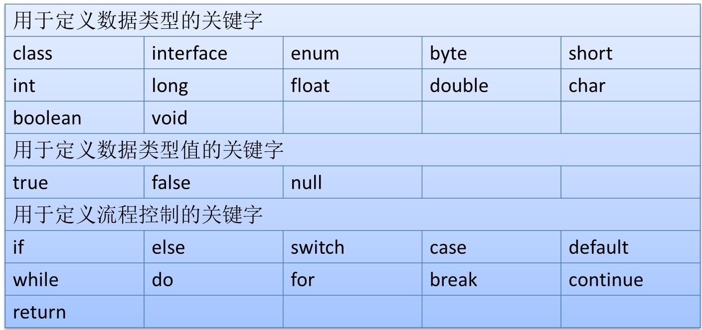
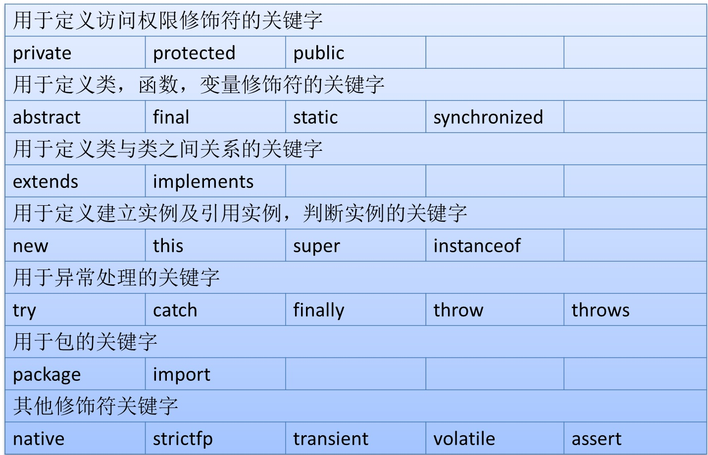
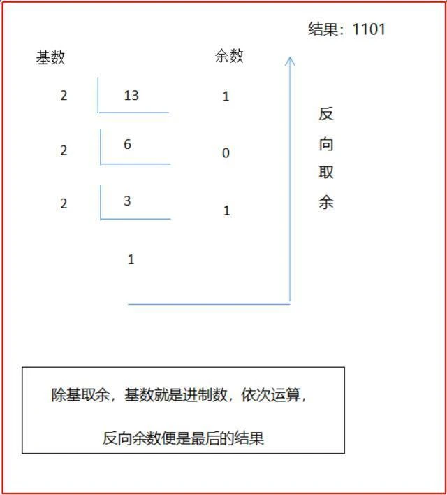
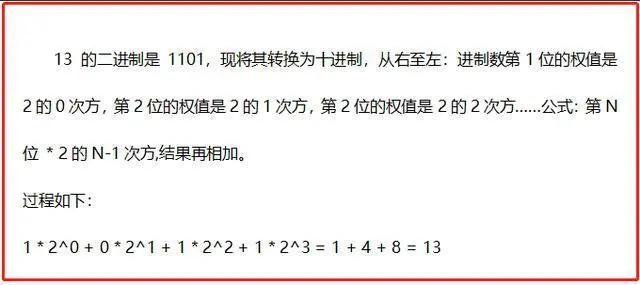
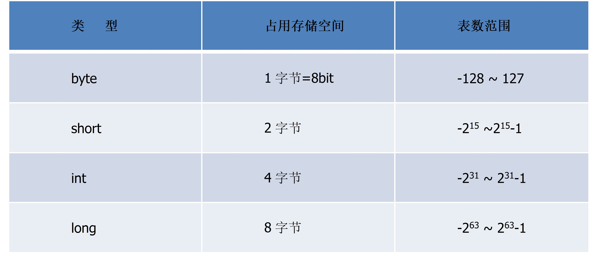
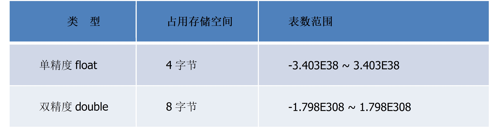
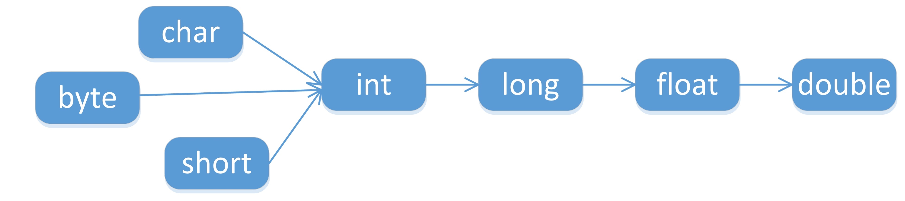
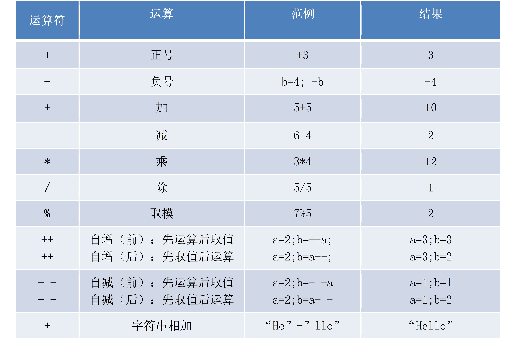
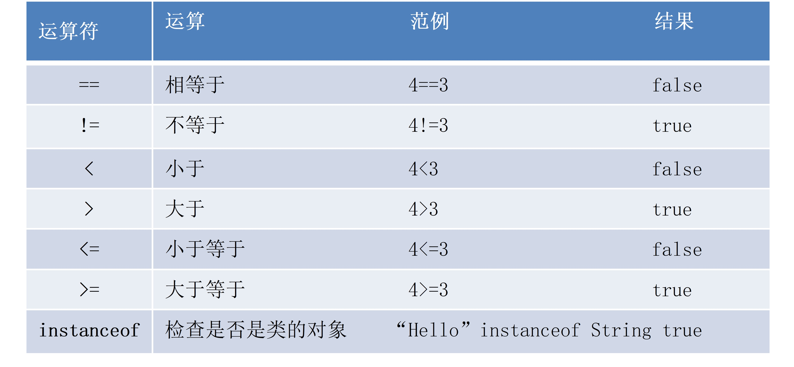
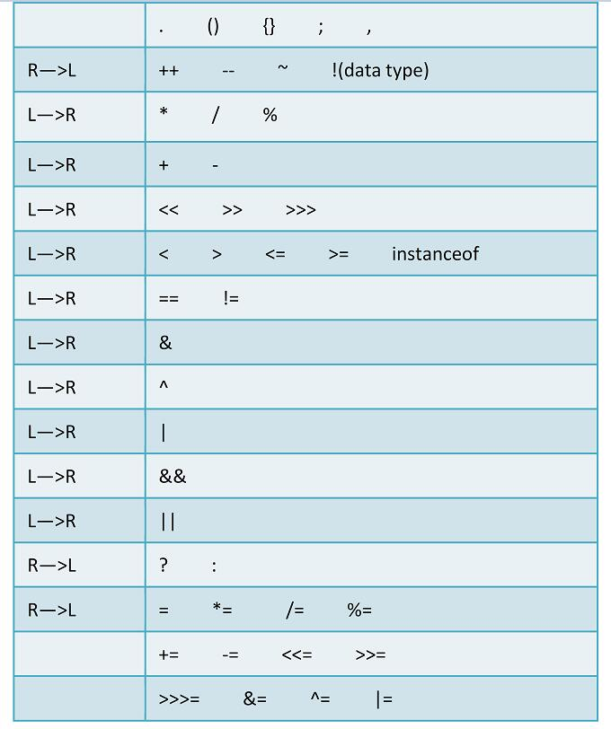

# Java语言基础

本篇整理 Java 的关键字与保留字、标识符命名规范、注释、变量（含进制与存储单位）、运算符等语言基础内容。

## 1. 关键字与保留字

### 1.1 关键字

**定义**：被 Java 语言赋予了特殊含义、用作专门用途的字符串（单词）。

**特点**：关键字中所有字母都是小写。常见关键字见下两图：





> [!TIP]
> 以上关键字了解即可，不需要刻意记忆，后续学习大部分都会接触到。

### 1.2 保留字

**定义**：现有 Java 版本尚未使用，但以后版本可能会作为关键字使用的标识。自己命名标识符时要避免使用这些保留字。

Java 中的保留字包括：`cast`、`future`、`generic`、`inner`、`operator`、`outer`、`rest`、`goto`、`const`。

思考题：在 Java 中能否使用 `goto` 为变量命名？

## 2. 标识符

**定义**：Java 对各种变量、方法和类等要素**命名**时使用的字符序列。凡是能自己起名字的地方都叫标识符。

### 2.1 定义规则（重点）

- 由 26 个英文字母大小写、数字 `0-9`、`_` 或 `$` 组成；
- 数字不可以开头；
- 不可以使用关键字和保留字，但能包含关键字和保留字；
- Java 严格区分大小写，长度无限制；
- 标识符不能包含空格。

例：判断 `$1`、`abc`、`new`、`car.01`、`1test`、`test1` 是否为合法标识符。

### 2.2 Java 命名规范（重点）

| 元素 | 规范 | 示例 |
| --- | --- | --- |
| 包名 | 多单词组成时所有字母都小写 | `xxxyyyzzz` |
| 类名、接口名 | 多单词组成时，每个单词首字母大写 | `XxxYyyZzz` |
| 变量名、方法名 | 多单词组成时，第一个单词首字母小写，从第二个单词开始每个单词首字母大写 | `xxxYyyZzz` |
| 常量名 | 所有字母都大写，多单词时用下划线连接 | `XXX_YYY_ZZZ` |

总原则：**见名知意**。

## 3. 注释

### 3.1 什么是注释

注释就是**对代码的解释和说明**，目的是让人们能够更轻松地理解代码，从而**提高程序代码的可读性**。注释只供人阅读，**不会被计算机编译**。

写注释是程序员应养成的良好习惯：初学者编写程序时，建议先写注释再写代码。

### 3.2 注释的作用

- 对代码进行解释和说明；
- 阻止某段代码运行。

### 3.3 注释的分类

- **单行注释**：`// 注释文字`；
- **多行注释**：`/* 注释文字 */`；
- **文档注释**：用来生成帮助文档（了解）。

```java
/**
 * 这是一个文档注释
 * @version 1.0
 * @since 1.8
 */
/*
    这里定义了一个类
*/
public class MyTest {
    // 这是 main 方法
    public static void main(String[] args) {
        // 在控制台输出内容
        System.out.println("Hello world");
        // 通过注释阻止下面这段代码的运行
        // System.out.println("Hello Java");
    }
}
```

生成文档的命令如下：

```sh
javadoc -d MyTest -encoding UTF-8 MyTest.java
```

## 4. 进位制与存储单位

### 4.1 什么是进制

生活中我们通常用**阿拉伯数字**计数，也就是十进制：以 10 为单位，逢 10 进一，数字由 `0~9` 组成。而计算机只能识别 `0` 和 `1` 组成的**二进制**代码，逢二进一。

进制就是**进位制**，是人们规定的一种数字进位方法。对于任何一种 X 进制，都表示**某一位置上的数在运算时逢 X 进一位**：二进制逢二进一，八进制逢八进一，十进制逢十进一，十六进制逢十六进一，以此类推。

### 4.2 常见进制

| 进制 | 组成 | 运算规律 |
| --- | --- | --- |
| 二进制 | `0`、`1` | 逢二进一，计算机只能识别二进制数据 |
| 八进制 | `0~7` | 逢八进一 |
| 十进制 | `0~9` | 逢十进一 |
| 十六进制 | 数字 `0~9` 与字母 `A~F` | 逢十六进一 |

### 4.3 进制转换

以十进制数 13 为例，实现各进制之间的转换。

#### 4.3.1 十进制与二进制互转

**十进制 → 二进制**：对整数部分，用被除数反复除以 2，除第一次外，每次都取前一次商的整数部分作被除数，并依次记下每次的余数。所得的**最后一位余数是二进制数的最高位**。



**二进制 → 十进制**：二进制数第 1 位的权值是 2⁰，第 2 位是 2¹，第 3 位是 2²，依次类推。公式：**第 N 位 × 2^(N-1)，结果相加**即为十进制值。



#### 4.3.2 十进制与八进制互转

**十进制 → 八进制**：方法与转二进制类似，唯一变化是把基数由 2 换成 8，依次计算。

**八进制 → 十进制**：可参考二进制的计算过程：第 1 位权值为 8⁰，第 2 位为 8¹，第 3 位为 8²，依次类推，**第 N 位 × 8^(N-1)，结果相加**。

#### 4.3.3 十进制与十六进制互转

**十进制 → 十六进制**：方法与转二进制类似，把基数换成 16，依次计算。

**十六进制 → 十进制**：第 0 位权值为 16⁰，第 1 位为 16¹，第 2 位为 16²，依次类推，**第 N 位 × 16^(N-1)，结果相加**。

#### 4.3.4 其他转换

- 二进制与八进制互转：可先转换为十进制，再转为目标进制；
- 二进制与十六进制互转：同上；
- 八进制与十六进制互转：可先转换为十进制，再转为目标进制。

### 4.4 二进制存储单位

在计算机二进制系统中，位简记为 `bit`（比特），是**数据存储的最小单位**，每个二进制数字 `0` 或 `1` 就是一个位。`8 bit = 1B`（一个字节，Byte），而 `1KB` 并不等于 `1000B`，详细换算如下：

| 单位 | 换算 |
| --- | --- |
| 1B（byte，字节） | = 8 bit |
| 1KB（Kibibyte，千字节） | = 1024B = 2¹⁰ B |
| 1MB（Mebibyte，兆字节） | = 1024KB = 2²⁰ B |
| 1GB（Gigabyte，吉字节） | = 1024MB = 2³⁰ B |
| 1TB（Terabyte，万亿字节） | = 1024GB = 2⁴⁰ B |
| 1PB（Petabyte，千万亿字节） | = 1024TB = 2⁵⁰ B |

> [!NOTE]
> 硬盘容量通常以十进制标识（1GB = 10⁹ B），所以标称 500G 的硬盘实际容量会不足 500G。

## 5. 变量

### 5.1 什么是变量

**定义**：在程序执行过程中，其值可以在某个范围内发生改变的量。

**本质**：变量是**内存中的一个存储区域**，是存储数据的单元。该区域有自己的名称（变量名）和类型（数据类型），区域内的数据可以在同一类型范围内不断变化。Java 中每个变量必须**先声明，后使用**。

可以用酒店来类比内存中的变量：

- 整个内存就像一家酒店，包含多个**房间**；
- 每个房间的**容量（大小）**不同（单人间、两人间……）；
- 每个房间都有一个唯一的**门牌号**；
- 每个房间的**住客**也各不相同。

对应关系：酒店的房间 —— 变量；房间的类型 —— 数据类型；房间的门牌号 —— 变量名；房间的住客 —— 值。

### 5.2 变量的定义与分类

定义格式：`数据类型 变量名 = 初始值;`

**按数据类型分类**（掌握）：

- 基本数据类型
  - 整数型：`byte`、`short`、`int`、`long`
  - 浮点型：`float`、`double`
  - 字符型：`char`
  - 布尔型：`boolean`
- 引用数据类型
  - 类（`class`）
  - 接口（`interface`）
  - 数组

**按声明位置分类**（了解）：

- 成员变量（在方法体外、类体内声明）
  - 实例变量（不被 `static` 修饰）
  - 类变量（被 `static` 修饰）
- 局部变量（在方法体内部声明）
  - 形参（方法参数列表中定义的变量）
  - 方法局部变量（在方法体内定义）
  - 代码块局部变量（在代码块内定义）

### 5.3 基本数据类型

#### 5.3.1 整数类型

Java 各整数类型有固定的表数范围和字段长度，不受具体操作系统的影响，以保证 Java 程序的可移植性。Java 的整型常量默认为 `int` 型；声明 `long` 型常量须在后面加 `l` 或 `L`。



```java
public class MyTest1 {
    public static void main(String[] args) {
        // 定义一个 int 类型变量
        int a = 10;
        // 输出这个变量
        System.out.println(a);
        // 定义 long 类型变量，long 类型字面量后面通常添加 L 或 l，建议使用大写 L
        long b = 10L;
        System.out.println(b);
    }
}
```

#### 5.3.2 浮点类型

与整数类型类似，Java 浮点类型也有固定的表数范围和字段长度，不受具体操作系统影响。Java 的浮点型常量默认为 `double` 型；声明 `float` 型常量，须在后面加 `f` 或 `F`。

浮点型常量有两种表示形式：

- 十进制数形式，如 `5.12`、`512.0f`、`.512`（必须有小数点）；
- 科学计数法形式，如 `5.12e2`、`512E2`、`100E-2`。



```java
public class MyTest2 {
    public static void main(String[] args) {
        // 定义一个 double 类型的变量
        double a = 10.5;
        System.out.println(a);
        // 定义 float 类型的变量，末尾一定要加 F 或 f
        float b = 10.5F;
        System.out.println(b);
        // 使用科学计数法定义浮点类型数据
        double c = 10e-2;
        System.out.println(c);
        float d = 10e-2F;
        System.out.println(d);
    }
}
```

#### 5.3.3 字符类型

`char` 型数据用来表示通常意义上的字符，占 2 个字节。字符型常量有三种表现形式：

- 用**单引号**括起来的单个字符，涵盖世界上所有书面语的字符：

  ```java
  char c1 = 'a';
  char c2 = '中';
  char c3 = '9';
  ```

- 使用**转义字符** `\` 将其后的字符转变为特殊字符常量，如 `char c4 = '\n';`（`\n` 表示换行符）；
- 直接使用 **Unicode 值**表示字符型常量：`\uXXXX`，其中 `XXXX` 代表一个十六进制整数，如 `char c5 = 'A';` 表示 `A`。

> [!NOTE]
> `char` 类型是可以进行运算的，因为它对应有 Unicode 码。

```java
public class MyTest3 {
    public static void main(String[] args) {
        // 定义一个 char 型变量
        char c1 = 'a';
        System.out.println(c1);
        // 使用转义符号定义 char 型变量
        char c2 = '\n';
        System.out.println(c2);
        // 使用 Unicode 值定义 char 型变量
        char c3 = 'E'; // E
        System.out.println(c3);
        // char 类型参与算术运算
        System.out.println(c3 + 1);
    }
}
```

#### 5.3.4 布尔类型

`boolean` 类型适用于逻辑运算，一般用于程序流程控制：`if` 条件语句、`while` 循环、`do-while` 循环、`for` 循环等。

`boolean` 类型数据只允许取 `true` 和 `false`，**不可以用 0 或非 0 的整数替代**，这点和 C 语言不同。

```java
public class MyTest4 {
    public static void main(String[] args) {
        // 定义 boolean 类型变量
        boolean b = true;
        System.out.println(b);
    }
}
```

#### 5.3.5 自动类型转换

**定义**：容量小的类型自动转换为容量大的数据类型，称为自动类型转换。

多种类型的数据混合运算时，系统首先自动将所有数据转换成容量最大的那种数据类型，然后再进行计算。



- `byte`、`short`、`char` 之间不会相互转换，它们三者在计算时首先转换为 `int` 类型；
- 当把任何基本类型的值和字符串进行连接运算（`+`）时，基本类型的值将自动转化为字符串类型。

```java
public class MyTest5 {
    public static void main(String[] args) {
        char ch = 'a';
        // 自动类型转换，char 转换成 int 类型
        int i = ch;

        byte bt = 101;
        // 自动类型转换，byte 型转成 short 型
        short st = bt;
        // byte、short、char 之间不会相互转换，三者在计算时首先转换为 int 类型
        int a = ch + bt;      // 正确
        // short st1 = ch + bt; // 错误
        // short st2 = st * 2;  // 错误

        // 基本数据类型与字符串做 "+" 运算，会转换成字符串类型，完成字符串拼接
        String str = "hello " + bt;
    }
}
```

#### 5.3.6 强制类型转换

自动类型转换的逆过程，将容量大的数据类型转换为容量小的数据类型。使用时要加上强制转换符 `()`，但可能造成**精度降低或溢出**，要格外注意。

通常，字符串不能直接转换为基本数据类型，但可以通过基本类型对应的包装类实现转换（常用类章节再讲）。`boolean` 类型不可以转换为其他任何数据类型。

```java
public class MyTest6 {
    public static void main(String[] args) {
        int a = 1000;
        // 强制类型转换
        short s = (short) a;

        // String 转换为基本数据类型，使用对应的包装类，后面会讲到
        String numStr = "100";
        int num = Integer.parseInt(numStr);
        System.out.println(num);
    }
}
```

## 6. 运算符

### 6.1 算术运算符



- 对负数取模时，可以把模数的负号忽略不计，如 `5 % -2 = 1`；但**被模数是负数则不可忽略**；
- 对于除号 `/`，整数除和小数除有区别：**整数之间做除法时，只保留整数部分而舍弃小数部分**；
- `+` 除了字符串相加，还能把非字符串转换成字符串。

```java
public class MyTest7 {
    public static void main(String[] args) {
        // 取余（求模）：% 前面是被模数，后面是模数
        // 除法：/ 前面是被除数，后面是除数
        int a = 3;
        int b = 2;
        System.out.println(a % b);
        // 对负数取模，模数负号可以忽略
        System.out.println(3 % 2);
        System.out.println(-3 % 2);
        System.out.println(3 % -2);
        System.out.println(-3 % -2);
        // 整数之间做除法时，只保留整数部分而舍弃小数部分
        System.out.println(3 / 2);
        System.out.println(3.0 / 2);

        // ++ 在变量基础上加 1：前置先加 1 再赋值，后置先赋值再加 1
        int i = 10;
        int t1 = ++i;
        System.out.println(i);
        System.out.println(t1);
    }
}
```

写出下面这段程序的输出内容：

```java
public class MyTest8 {
    public static void main(String[] args) {
        int i1 = 10;
        int i2 = 20;
        int i = i1++;
        System.out.println("i = " + i);
        System.out.println("i1 = " + i1);

        i = ++i1;
        System.out.println("i = " + i);
        System.out.println("i1 = " + i1);

        i = i2--;
        System.out.println("i = " + i);
        System.out.println("i2 = " + i2);

        i = --i2;
        System.out.println("i = " + i);
        System.out.println("i2 = " + i2);
    }
}
```

输出如下：

```text
i = 10
i1 = 11
i = 12
i1 = 12
i = 20
i2 = 19
i = 18
i2 = 18
```

不借助第三个变量交换两个变量的值：

```java
a = a + b;
b = a - b;
a = a - b;
```

### 6.2 赋值运算符

符号 `=` 不是"等于"，在 Java 中的意思是**把右侧的值赋给左侧**。

- 当 `=` 两侧数据类型不一致时，按自动类型转换或强制类型转换原则处理；
- 支持连续赋值：`x = y = 1`；
- 扩展赋值运算符：`+=`、`-=`、`*=`、`/=`、`%=`。

```java
public class MyTest9 {
    public static void main(String[] args) {
        // 赋值运算
        int x = 10;
        int y;
        // 连续赋值
        x = y = 1;
        // 扩展赋值运算，等价于 x = x + 2
        x += 2;
        System.out.println(x);
        System.out.println(y);
    }
}
```

借助临时变量交换两个变量的值：

```java
int temp = a;
a = b;
b = temp;
System.out.println(a);
System.out.println(b);
```

### 6.3 关系运算符



- 关系运算符的结果都是 `boolean` 型，即要么 `true`，要么 `false`；
- 关系运算符 `==` 不能误写成 `=`。

```java
public class MyTest10 {
    public static void main(String[] args) {
        // 关系运算
        int a = 10;
        int b = 100;
        System.out.println(a > b);  // false
        System.out.println(a >= b); // false
        System.out.println(a <= b); // true
        System.out.println(a < b);  // true
        System.out.println(a == b); // false
        System.out.println(a != b); // true
    }
}
```

### 6.4 逻辑运算符

- **与（`&` 或 `&&`）**：两侧都为真才为真，一侧为假即为假；
- **或（`|` 或 `||`）**：两侧都为假才为假，一侧为真即为真；
- **非（`!`）**：取反，真变假、假变真；
- **异或（`^`）**：强调的是"异"——两侧相同则为假，两侧不同则为真。

```java
public class MyTest11 {
    public static void main(String[] args) {
        // & 逻辑与：两个都为真（true）才为真，一侧为假则为假（false）
        System.out.println((5 > 5) & (4 > 3));
        // | 逻辑或：一侧为真则为真，两侧为假则为假
        System.out.println((5 > 5) | (4 > 4));
        // ! 逻辑非：取反
        System.out.println(!(5 == 5));

        // ^ 异或：两边相同返回假，两边不同返回真
        System.out.println(true ^ true);
        System.out.println(true ^ false);
    }
}
```

`&` 和 `&&` 的区别：

- `&`：左边无论真假，右边都进行运算；
- `&&`：左边为真时右边参与运算，左边为假时右边不参与运算（短路）。

`|` 和 `||` 的区别：

- `|`：左边无论真假，右边都进行运算；
- `||`：左边为假时右边参与运算，左边为真时右边不参与运算（短路）。

```java
public class MyTest12 {
    public static void main(String[] args) {
        int x1 = 10;
        int y1 = 100;
        // && 短路与：左侧为假，右侧不进行运算
        if ((x1 != 10) && (++y1 > 100)) {

        }
        System.out.println(y1);

        // || 短路或：左侧为真，右侧不进行运算
        if ((x1 >= 10) || (++y1 > 100)) {

        }
        System.out.println(y1);
    }
}
```

### 6.5 三元运算符

语法：`(条件表达式) ? 表达式1 : 表达式2`。

- 条件表达式为 `true`，运算结果是表达式 1；
- 条件表达式为 `false`，运算结果是表达式 2；
- 表达式 1 和表达式 2 为同种类型。

```java
public class MyTest13 {
    public static void main(String[] args) {
        // 三元运算符，判断最大值
        int x1 = 10;
        int x2 = 100;
        int max = (x1 >= x2) ? x1 : x2;
        System.out.println(max);
    }
}
```

### 6.6 运算符优先级



- 优先级决定表达式的运算顺序：先算谁，再算谁。如上表，**上一行运算符总优先于下一行**；
- 只有单目运算符、三元运算符、赋值运算符是**从右向左**运算的；
- 优先级记不住没有关系：**先算乘除，后算加减，有括号先算括号里面的**，在代码中可以通过括号明确运算顺序。
