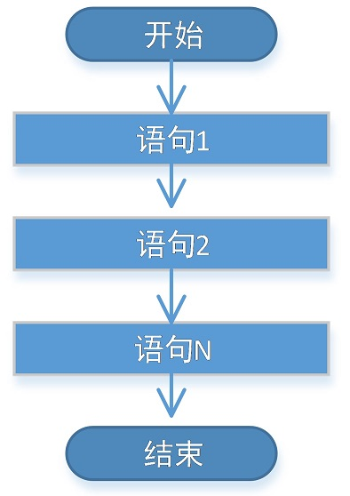
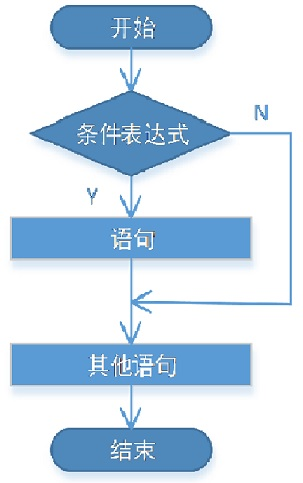
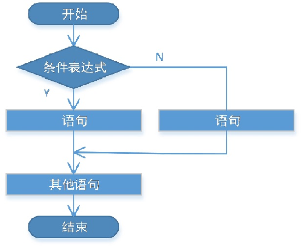
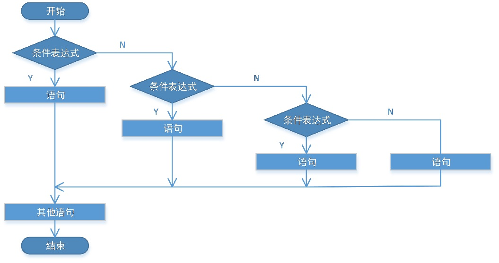
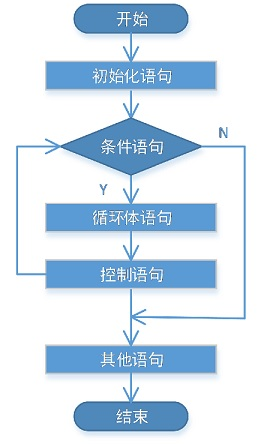
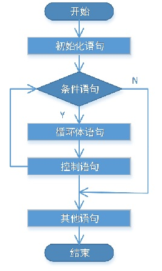
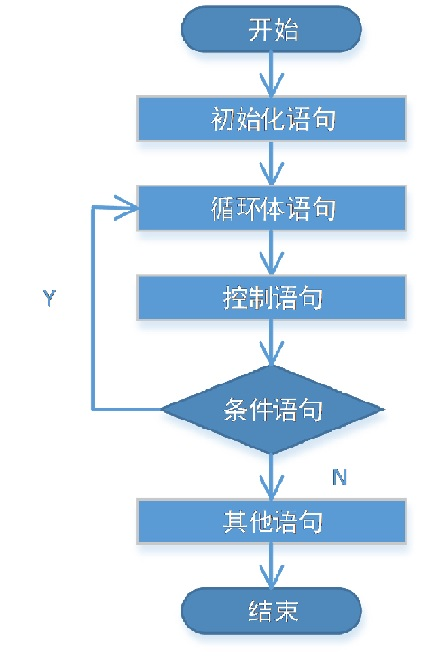
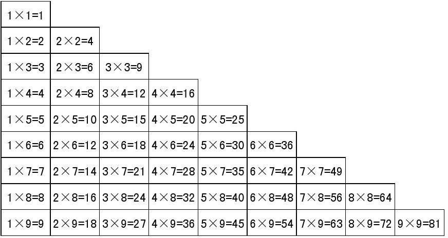

# 控制流程

本篇整理 Java 的流程控制语句，包括顺序结构、键盘输入（Scanner）、分支结构（if、switch）与循环结构（for、while、do...while），以及 break、continue、return 等流程控制关键字。

## 1. 控制流程概述

在一个程序执行的过程中，各条语句的执行顺序对程序的结果有直接影响。很多时候，我们需要通过控制语句的执行顺序来实现想要完成的功能。

Java 中的流程控制结构分为三类：

- **顺序结构**：从上到下依次执行；
- **分支结构**：根据条件判断，选择执行某段代码；
- **循环结构**：在条件满足时反复执行某段代码。

## 2. 顺序结构

顺序结构没有特定的语法结构，程序中大多数代码都是这样执行的：按照代码的先后顺序依次执行，写在前面的先执行，写在后面的后执行。



```java
public class MyTest1 {
    public static void main(String[] args) {
        //顺序结构，按照从上到下的顺序执行
        System.out.println("起床");
        System.out.println("洗漱");
        System.out.println("吃早饭");
        System.out.println("上课");
        System.out.println("吃午饭");
        System.out.println("午休");
        System.out.println("上课");
        System.out.println("吃晚饭");
        System.out.println("自习");
    }
}
```

## 3. 输入数据

程序运行时可以从键盘接收输入，Java 通过 `java.util.Scanner` 类实现，使用步骤如下：

| 步骤 | 说明 | 示例 |
| --- | --- | --- |
| 1. 导包 | `import java.util.Scanner;`，该语句要放在 class 定义的上面 | `import java.util.Scanner;` |
| 2. 创建对象 | 使用 `System.in` 作为数据源 | `Scanner sc = new Scanner(System.in);` |
| 3. 接收数据 | 调用对应的方法读取输入 | `nextInt()`、`nextLine()`、`next()` |

```java
//导入Scanner
import java.util.Scanner;

public class MyTest2 {
    public static void main(String[] args) {
        //创建扫描器对象
        Scanner sc = new Scanner(System.in);
        //获取键盘输入
        String next = sc.next();
        //打印测试
        System.out.println(next);
    }
}
```

## 4. 分支结构

分支结构有特定的语法规则：代码要执行具体的逻辑运算进行判断，而逻辑运算的结果有两个（`true` 和 `false`），因此会产生选择，按照不同的选择执行不同的代码。

### 4.1 if 语句（三种形式）

#### 4.1.1 if

语法格式：

```java
if(条件表达式) {
    //语句
}
```

执行流程：首先判断**条件表达式**，看其结果是 `true` 还是 `false`；如果是 `true` 就执行语句体，如果是 `false` 就不执行语句体。



> [!NOTE]
> - 条件表达式无论简单还是复杂，结果必须是 `boolean` 类型；
> - `if` 语句控制的语句体如果是一条语句，大括号可以省略；如果是多条语句，就不能省略。建议永远不要省略大括号。

```java
import java.util.Scanner;

public class MyTest3 {
    public static void main(String[] args) {
        Scanner sc = new Scanner(System.in);
        
        System.out.println("起床");
        System.out.println("洗漱");
        System.out.println("吃早饭");
        System.out.println("上课");
        System.out.println("吃午饭");
        System.out.println("午休");
        System.out.println("上课");
        System.out.println("吃晚饭");
        System.out.println("是否需要上自习？是，输入1；否，输入其他数字");
		int flag = sc.nextInt();
        //分支结构
        if(flag == 1) {
            System.out.println("自习");
        }
    }
}
```

#### 4.1.2 if...else...

语法格式：

```java
if(条件表达式) {
    //语句1
} else {
    //语句2
}
```

执行流程：首先判断条件表达式看其结果是 `true` 还是 `false`；如果是 `true` 就执行语句 1，如果是 `false` 就执行语句 2。



```java
import java.util.Scanner;

public class MyTest4 {
    public static void main(String[] args) {
        Scanner sc = new Scanner(System.in);
        
        System.out.println("起床");
        System.out.println("洗漱");
        System.out.println("吃早饭");
        System.out.println("上课");
        System.out.println("吃午饭");
        System.out.println("午休");
        System.out.println("上课");
        System.out.println("吃晚饭");
        System.out.println("是否需要上自习？是，输入1；否，输入其他数字");
		int flag = sc.nextInt();
        //分支结构
        if(flag == 1) {
            System.out.println("自习");
        } else {
            System.out.println("happy");
        }
    }
}
```

#### 4.1.3 if...else if...else if...else

语法格式：

```java
if(条件表达式1) {
    //语句1
} else if(条件表达式2) {
    //语句2
} else if(条件表达式3) {
    //语句3
} else {
    //语句4
}
```

执行流程：首先判断条件表达式 1，如果是 `true` 就执行语句体 1；如果是 `false` 就继续判断条件表达式 2，以此类推。如果没有任何条件表达式为 `true`，就执行最后的 `else` 语句体。



```java
import java.util.Scanner;

public class MyTest5 {
    public static void main(String[] args) {
        Scanner sc = new Scanner(System.in);
        
        System.out.println("起床");
        System.out.println("洗漱");
        System.out.println("吃早饭");
        System.out.println("上课");
        System.out.println("吃午饭");
        System.out.println("午休");
        System.out.println("上课");
        System.out.println("吃晚饭");
        System.out.println("选择晚饭后的活动， 1.自习 2.看电影 3.发呆  4.运动 其他值.休息");
		int flag = sc.nextInt();
        //分支结构
        if(flag == 1) {
            System.out.println("自习");
        } else if(flag == 2) {
            System.out.println("看电影");
        } else if(flag == 3) {
            System.out.println("发呆");
        } else if(flag == 4) {
            System.out.println("运动");
        } else {
            System.out.println("休息");
        }
    }
}
```

### 4.2 switch 语句

语法格式：

```java
switch(表达式) {
 case 常量1:
     //语句1
     break;
 case 常量2:
     //语句2
     break;
 case 常量3:
     //语句3
     break;
 default:
     //默认语句
     break;
}
```

执行流程：首先计算出表达式的值；其次，和 `case` 后的常量依次比较，一旦有对应的值，就执行相应的语句，在执行过程中遇到 `break` 就会结束；最后，如果所有的 `case` 都和表达式的值不匹配，就执行 `default` 语句体部分，然后程序结束。

关于 `switch` 的几点说明：

| 要点 | 说明 |
| --- | --- |
| 表达式类型 | `switch(表达式)` 中表达式的返回值必须是 `byte`、`short`、`char`、`int`、枚举、`String`（JDK 7 之后支持）之一 |
| case 常量 | `case` 子句中的值必须是常量，且所有 `case` 子句中的值应互不相同 |
| default 子句 | 可选项，当没有匹配的 `case` 时执行 `default` |
| break 语句 | 用于在执行完一个 `case` 分支后跳出 `switch` 语句块；如果没有 `break`，程序会顺序执行到 `switch` 结尾（即发生"穿透"） |

```java
import java.util.Scanner;

public class MyTest6 {
    public static void main(String[] args) {
        Scanner scanner = new Scanner(System.in);
        int day = scanner.nextInt();

        switch (day) {
            case 1:
                System.out.println("上晚自习");
                break;
            case 2:
                System.out.println("上晚自习");
                break;
            case 3:
                System.out.println("上晚自习");
                break;
            case 4:
                System.out.println("上晚自习");
                break;
            case 5:
                System.out.println("上晚自习");
                break;
            case 6:
                System.out.println("不上晚自习");
                break;
            case 7:
                System.out.println("不上晚自习");
                break;
            default:
                System.out.println("输入不合法，请输入1~7之间的值");
                break;
        }
        
        /*
            switch(day) {
                case 1:
                case 2:
                case 3:
                case 4:
                case 5:
                    System.out.println("上晚自习");
                    break;
                case 6:
                case 7:
                    System.out.println("不上晚自习");
                    break;
                default:
                    System.out.println("输入不合法，请输入1~7之间的值");
                    break;
            }
        */
    }
}
```

### 4.3 if 和 switch 的比较

| 语句 | 适用场景 |
| --- | --- |
| `if` | 针对 `boolean` 类型结果的判断；针对一个范围的判断；针对几个常量值的判断 |
| `switch` | 针对几个常量值的判断 |

## 5. 循环结构

循环结构的功能是：在**某些条件满足**的情况下，反复执行特定代码。循环语句由四部分组成：

| 组成部分 | 说明 |
| --- | --- |
| 初始化部分 | 一条或多条语句，完成一些初始化操作 |
| 循环条件部分 | 一个 `boolean` 表达式，决定是否执行循环体 |
| 循环体部分 | 要反复执行的语句，也就是需要多次做的事情 |
| 控制条件语句 | 在一次循环体结束后、下一次循环条件判断前执行，通常用于控制循环条件中的变量，使循环在合适的时候结束 |

### 5.1 for 循环

语法格式：

```java
for(初始化语句; 条件语句; 控制语句) {
    //循环体语句
}
```

执行流程：

1. 执行初始化语句；
2. 执行条件语句，看其结果是 `true` 还是 `false`：如果是 `false`，循环结束；如果是 `true`，继续执行；
3. 执行循环体语句；
4. 执行控制语句；
5. 回到第 2 步继续。



```java
public class MyTest7 {
    public static void main(String[] args) {
		//从1加到100
		int sum = 0;
		for(int item = 1; item <= 100; item++) {
			sum += item; // sum = sum + item;
		}
		System.out.println(sum);
        
        sum = 0;
		//求100以内的奇数和 1 3 5 7.。。
		for(int item = 1; item <= 100; item += 2) {
			sum += item;
		}
		System.out.println(sum);
    }
}
```

### 5.2 while 循环

语法格式：

```java
//初始化语句
while(条件语句) {
    //循环体语句
    //控制语句
}
```



```java
public class MyTest8 {
    public static void main(String[] args) {
		//从1加到100
		int sum = 0;
		//用while循环实现从1加到100
		int item = 1;
		while(item <= 100) {
			sum += item;
			item++;
		}
		System.out.println(sum);
    }
}
```

### 5.3 do...while 循环

语法格式：

```java
do {
    //循环体语句
} while(条件语句);
```



```java
public class MyTest9 {
    public static void main(String[] args) {
        int sum = 0;
        int i = 1;
        do {
            sum += i;
            i++;
        } while(i <= 100);
        System.out.println(sum);
    }
}
```

`do...while` 循环和 `while` 循环的区别：

- `do...while` 循环**至少会执行一次**循环体；
- `while` 循环只有在条件成立的时候才执行循环体。

### 5.4 无限循环

不会停止的循环，也被称为**死循环**。三种写法如下：

```java
for(;;) {
    //循环体
}

while(true) {
    //循环体
}

do {
    //循环体
} while(true);
```

```java
public class MyTest10 {
    public static void main(String[] args) {
        for(;;) {
            System.out.println("hello world");
        }
    }
}
```

> [!TIP]
> 在 DOS 终端中终止死循环程序的快捷键是 `ctrl+c`。

### 5.5 循环嵌套

**定义**：循环包含循环，即把内层循环当成外层循环的循环体。当内层循环的循环条件为 `false` 时，才会完全跳出内层循环，才能结束外层的当次循环，开始下一次的循环。

设外层循环执行 `m` 次，内层循环执行 `n` 次，则内层循环体实际需要执行 `m * n` 次。

```java
public class MyTest11 {
    public static void main(String[] args) {
        int m = 6;
		//在dos窗口m行打印m个*
		for(int i = 0; i < m; i++) { //打印m行
			for(int j = 0; j < i+1; j++) { 
				System.out.print("*");
			}
			System.out.print('\n');
		}
    }
}
```

下面使用循环嵌套打印 99 乘法表：



```java
public class MyTest12 {
    public static void main(String[] args) {
		//打印99乘法表
		for(int i = 1; i <= 9; i++) {//打印9行 i用来控制行	
			for(int j = 1; j <= i; j++) { //打印同一行的算式
				System.out.print(i + "*" + j + "=" + i * j + "\t"); //"加法" 字符串拼接
			}
			System.out.print('\n');
		}
    }
}
```

### 5.6 特殊流程控制语句

#### 5.6.1 break

**使用场景**：

- 在选择结构 `switch` 语句中；
- 在循环语句中。

**作用**：跳出 `switch`，或者结束当前循环。

| 关键字 | 单层循环中的效果 |
| --- | --- |
| `break` | 退出（结束）当前整个循环 |
| `continue` | 跳过本次循环，进行下一次循环 |

```java
for(int i = 1; i <= 9; i++) {//打印9行 i用来控制行
    //只打印前四行，到第五行结束
    if(i == 5) {
        break; //结束当前循环 
    }
    for(int j = 1; j <= i; j++) { //打印同一行的算式
        System.out.print(i + "*" + j + "=" + i * j + "\t"); //"加法" 字符串拼接
    }
    System.out.print('\n');
}
```

#### 5.6.2 continue

**使用场景**：在循环语句中。

**作用**：结束本次循环体中尚未执行的语句，直接进行下一次循环。

```java
//打印99乘法表
for(int i = 1; i <= 9; i++) {//打印9行 i用来控制行
    //不打印第五行
    if(i == 5) {
        continue; //强行进行下一次循环
    }

    for(int j = 1; j <= i; j++) { //打印同一行的算式
        System.out.print(i + "*" + j + "=" + i * j + "\t"); //"加法" 字符串拼接
    }
    System.out.print('\n');
}
```

#### 5.6.3 return

`return` 关键字不是为了跳出循环体，它更常用的功能是**结束一个方法**，也就是退出当前方法，跳转到上层调用的方法。这一点在方法章节会详细讲解。

下面通过一个登录程序演示 `return` 的用法：输入密码正确，提示登录成功；输入密码错误，提示重新输入；密码输入错误达到 3 次，提示错误次数已达上限并退出程序。

```java
import java.util.Scanner;
public class MyTest13 {
	/*输入密码，输入正确，显示登录成功 admin
		输入错误，提示“密码输入错误，请重新输入”
		密码输入错误达到3次 ==3，提示“密码输入错误超过三次，账户锁定”，程序退出*/
	public static void main(String[] args) {
		Scanner sc = new Scanner(System.in);
		int count = 0;
		while(true) {
			String pwd = sc.nextLine(); //获取输入的密码
			//判断是否输入正确
			if(pwd.equals("admin")) { //密码输入正确，判断字符串内容相等使用equals
				//登录成功
				break;
			} else { //密码输入错误
				count++;
				if(count == 3) {
					System.out.println("密码输入错误达到三次，账户锁定");
					return;
				}
				System.out.println("密码输入错误，请重新输入");
			}
		}
		System.out.println("登录成功");
	}
}
```
