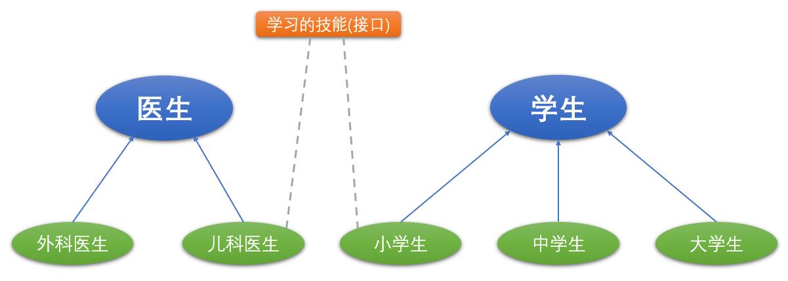

# 接口和内部类

本篇整理 Java 接口的概念与使用、Java 8 对接口的增强、内部类，以及包的相关知识。

## 1. 概述

有时必须从几个类中派生出一个子类，继承它们所有的属性和方法。但 Java 不支持多重继承，有了接口，就可以得到**多重继承**的效果。

有时必须从几个类中抽取出一些共同的行为特征，而它们之间又没有 `is a` 的关系，仅仅是具有相同的行为特征而已。例如：鼠标、键盘、打印机、扫描仪、摄像头、充电器、MP3 机、手机、数码相机、移动硬盘等都支持 USB 连接，我们可以将这些共同的特征定义为接口。

**接口就是规范，定义的是一组规则**，体现了现实世界中「如果你是/要……则必须能……」的思想。继承是一个「是不是」的关系，而接口实现则是「能不能」的关系。

**接口的本质是契约、标准、规范**，就像我们的法律一样，制定好后大家都要遵守。

关于接口的举例：



## 2. 接口的使用

### 2.1 定义接口

**接口（interface）** 是抽象方法和常量值定义的集合。

接口的特点：

- 用 `interface` 来定义；
- 接口中的所有**成员变量**都默认由 `public static final` 修饰；
- 接口中的所有**抽象方法**都默认由 `public abstract` 修饰；
- 接口中没有构造器；
- 接口可以继承接口，并且支持多继承。

```java
//定义接口
public interface 接口名 {
    //常量
    //抽象方法
}

//定义接口，可以继承其他多个接口
public interface 接口名 extends 父接口名1, 父接口名2, 父接口名3... {
    //常量
    //抽象方法
}
```

案例：

```java
//交通工具接口
public interface Vehicle {
	//启动
	void start();
	//停止
	void stop();
	//运行
 	void run();
}

//能源接口
public interface Energy {
	//加油
	void addOil();
}
```

### 2.2 实现接口

在 Java 中继承类使用关键字 `extends`，实现接口使用关键字 `implements`，一个类可以实现多个接口。

实现接口的类中必须实现接口中的所有抽象方法，方可实例化；否则，这个类仍要定义为抽象类。

接口的主要用途就是被实现类实现。接口和类是并列关系，或者**可以理解为一种特殊的类**。从本质上讲，接口是一种特殊的抽象类，这种抽象类中只包含常量和方法的定义（JDK 7.0 及之前），而没有变量和方法的实现。

```java
//实现一个接口
public 类名 implements 接口1 {
 //属性
 //构造方法
 //方法
}

//实现多个接口
public 类名 implements 接口1, 接口2... {
 //属性
 //构造方法
 //方法
}
```

案例：

```java
//定义飞机类，实现Vehicle和Energy接口
public class Plane implements Vehicle, Energy {
	@Override
	public void start() {
		System.out.println("飞机启动");
	}

	@Override
	public void stop() {
		System.out.println("飞机停止");
	}

	@Override
	public void run() {
		System.out.println("飞机运行");
	}

	@Override
	public void addOil() {
		System.out.println("飞机加油");
	}
}

//定义汽车类，实现Vehicle和Energy接口
public class Car implements Vehicle, Energy {
	@Override
	public void start() {
		System.out.println("汽车启动");
	}

	@Override
	public void stop() {
		System.out.println("汽车停止");
	}

	@Override
	public void run() {
		System.out.println("汽车运行");
	}

	@Override
	public void addOil() {
		System.out.println("汽车加油");
	}
}

public class MyTest1 {
    public static void main(String[] args) {
        Plane plane = new Plane();
        plane.addOil();
        plane.start();
        plane.run();
        plane.stop();
        System.out.println("--------------------------");

        Car car = new Car();
        car.addOil();
        car.start();
        car.run();
        car.stop();
    }
}
```

运行结果：

```text
飞机加油
飞机启动
飞机运行
飞机停止
--------------------------
汽车加油
汽车启动
汽车运行
汽车停止

Process finished with exit code 0

```

如果定义的类既要实现接口，又要继承父类，那么要先写 `extends`，后写 `implements`。

```java
//继承父类并实现多个接口
public 类名 extends 父类 implements 接口1, 接口2... {
 //属性
 //构造方法
 //方法
}
```

案例：

```java
//飞机类
public abstract class Plane {
    private int height; //高度
    private int length; //长度
    private int wingSpan; //翼展
    private int emptyWeight; //空重
    private int weight; //载重
   	private int speed; //最大速度
    private int numOfPilots; //飞行员数量

    //get/set
}

//交通工具接口
public interface Vehicle {
	//启动
	void start();
	//停止
	void stop();
	//运行
 	void run();
}

//能源接口
public interface Energy {
	//加油
	void addOil();
}

//战斗机类 - 继承父类，实现接口
public class Fighter extends Plane implements Vehicle, Energy {
    @Override
	public void start() {
		System.out.println("战斗机启动");
	}

	@Override
	public void stop() {
		System.out.println("战斗机停止");
	}

	@Override
	public void run() {
		System.out.println("战斗机运行");
	}

	@Override
	public void addOil() {
		System.out.println("战斗机加油");
	}
}

public class MyTest2 {
    public static void main(String[] args) {
        Fighter fighter = new Fighter();
        fighter.addOil();
        fighter.start();
        fighter.run();
        fighter.stop();
    }
}
```

执行结果：

```text
战斗机加油
战斗机启动
战斗机运行
战斗机停止
```

### 2.3 抽象类和接口对比

相同点：

- 接口和抽象类都不能被实例化，只能被其他类实现和继承；
- 接口和抽象类都可以包含抽象方法，实现接口和抽象类的类都必须实现这些抽象方法，否则实现的类就是抽象类。

不同点：

| 对比项 | 抽象类 | 接口 |
| --- | --- | --- |
| 定义关键字 | `abstract class` | `interface` |
| 方法 | 可以包含普通方法和抽象方法 | 只能包含抽象方法，不包含已实现的方法（JDK 7.0 及之前） |
| 静态方法 | 可以定义静态方法 | 不能定义静态方法（JDK 7.0 及之前） |
| 属性 | 既可以定义普通属性，也可以定义静态常量 | 只能定义静态常量属性，不能定义普通属性 |
| 构造函数 | 可以包含构造函数，但并不是用于创建对象，而是让子类调用这些构造函数来完成属于抽象类的初始化操作 | 不包含构造函数 |
| 初始化块 | 可以包含初始化块 | 不包含初始化块 |
| 继承与实现 | 一个类最多只能有一个直接父类（包括抽象类） | 一个类可以直接实现多个接口，通过实现多个接口可以弥补 Java 单继承的不足 |

## 3. Java 8 中关于接口的改进

Java 8 中，可以为接口添加**静态方法**和**默认方法**。从技术角度来说，这是完全合法的，只是它看起来违反了接口作为一个抽象定义的理念。

- **静态方法**：使用 `static` 关键字修饰，可以通过接口直接调用静态方法，并执行其方法体。
- **默认方法**：使用 `default` 关键字修饰，**可以通过实现类对象来调用**。默认方法让我们**在已有的接口中提供新方法的同时，还保持了与旧版本代码的兼容性**。例如：Java 8 API 中对 `Collection`、`List`、`Comparator` 等接口提供了丰富的默认方法。

```java
public interface A {
    double PI = 3.14; //常量
    default void m1() {
        System.out.println("test1...");
    }

    public static void m2() {
        System.out.println("test2...");
    }
}

public class MyClass implements A {

}

public class MyTest3 {
    public static void main(String[] args) {
        MyClass myClass = new MyClass();
        myClass.m1(); //通过实现类对象来调用
        A.m2(); //调用接口中的静态方法
    }
}
```

若一个接口中定义了一个默认方法，而另外一个接口中也定义了一个同名同参数的方法（不管此方法是否是默认方法），在实现类同时实现了这两个接口时，会出现**接口冲突**。

**解决办法**：实现类必须覆盖接口中同名同参数的方法，来解决冲突。

```java
public interface M {
    default void test() {
        System.out.println("M....");
    }
}

public interface N {
    default void test() {
        System.out.println("N....");
    }
}

public class MyClass1 implements M, N {
    //实现类必须覆盖接口中同名同参数的方法，来解决冲突
    @Override
    public void test() {
        M.super.test();
        N.super.test();
        System.out.println("MyClass1....");
    }
}

public class MyTest4 {
    public static void main(String[] args) {
        MyClass1 myClass1 = new MyClass1();
        myClass1.test();
    }
}
```

若一个接口中定义了一个默认方法，而父类中也定义了一个同名同参数的非抽象方法，则不会出现冲突问题。因为此时遵守「类优先原则」，接口中具有相同名称和参数的默认方法会被忽略。

```java
public class SuperClass {
    public void test() {
        System.out.println("SuperClass....");
    }
}

public class MyClass2 extends SuperClass implements M, N {

}

public class MyTest5 {
    public static void main(String[] args) {
        MyClass2 myClass2 = new MyClass2();
        myClass2.test();
    }
}
```

## 4. 内部类（了解）

### 4.1 概述

**内部类**就是在一个类内部定义的完整的类。

当一个事物的内部还有一个部分需要一个完整的结构进行描述，而这个内部的完整结构又只为外部事物提供服务，那么这个内部的完整结构最好使用内部类。

在 Java 中，允许一个类的定义位于另一个类的内部，前者称为**内部类**，后者称为**外部类**。内部类一般用在定义它的类或语句块之内，在外部引用它时必须给出完整的名称。

内部类的分类：

- 成员内部类（`static` 成员内部类和非 `static` 成员内部类）；
- 局部内部类。

### 4.2 成员内部类

成员内部类扮演两个角色：

**作为类的角色**：

- 可以在内部定义属性、方法、构造器等结构；
- 可以声明为 `abstract` 类，因此可以被其它的内部类继承；
- 可以声明为 `final` 的；
- 编译以后生成 `OuterClass$InnerClass.class` 字节码文件（局部内部类同样如此）。

**作为类的成员的角色**：

- 和外部类不同，内部类还可以声明为 `private` 或 `protected`；
- 可以调用外部类的结构；
- 内部类可以声明为 `static` 的，但此时就不能再使用外层类的非 `static` 的成员变量。

```java
public class Outer {
    private String name = "outer";
    private int age;

    public class Inner {
        private String name = "inner";
        public void display(String name) {
            System.out.println(name);
            System.out.println(this.name);
            //访问外部类的属性
            System.out.println(Outer.this.name);
            System.out.println("这是内部类的方法");
        }
    }

    public void test() {
        //创建内部类对象
        Inner brain = new Inner();
        brain.display("test");
        System.out.println("这是外部类的方法");
    }
}

public class MyTest6 {
    public static void main(String[] args) {
        //创建外部类对象
        Outer outer = new Outer();
        outer.test();

      	Outer.Inner inner = outer.new Inner();
        inner.display("aaa");
    }
}
```

### 4.3 局部内部类

局部内部类定义在方法内或代码块内：

```java
class Outer {
    方法() {
        class 局部内部类 {

        }
    }

    {
        class 局部内部类 {

        }
    }
}
```

案例：

```java
public class Outer1 {
    public Comparable test1() {
        class MyComparable implements Comparable {
            @Override
            public int compareTo(Object o) {
                return 0;
            }
        }

        MyComparable comparable = new MyComparable();
        return comparable;
    }

    public Comparable test2() {
        Comparable comparable = new Comparable() {
            @Override
            public int compareTo(Object o) {
                return 0;
            }
        };

        return comparable;
    }
}
```

## 5. 包

**包（package）** 是 Java 提供的一种区别类的名字空间的机制，是类的组织方式，是一组相关类和接口的集合，它提供了访问权限和命名的管理机制。

### 5.1 包的应用

#### 5.1.1 声明包

在源文件的开始使用 `package 包名;`，目的是告诉编译器当前类所属的包。

在 IDEA 中声明包有两种方式：

- 通过创建 `package` 就表示声明包，然后在包下创建类；
- 创建类的同时指定 `package`。

关于包的理解：

- 包的本质就是文件夹目录结构，功能相似的类放在同一目录下；
- 包对类进行了包装，在不同的包中允许有相同类名存在，在一定程度上可以避免命名冲突。

#### 5.1.2 使用包

如果当前类要用到其他包中的类，需要使用 `import` 关键字来导入，例如 `import java.util.Scanner;`。

如果需要用到某个包的多个类，可以用 `*` 代替所有类，例如 `import java.util.*;`。

### 5.2 JDK 常用包介绍

| 包名 | 说明 |
| --- | --- |
| `java.lang` | 包括了 Java 语言程序设计的基础类 |
| `java.util` | 包含集合、日期和各种实用工具类 |
| `java.io` | 包含可提供数据输入、输出相关功能的类 |
| `java.net` | 提供用于实现 Java 网络编程的相关功能类 |
| `java.sql` | 提供数据库操作相关功能类 |

> [!NOTE]
> `java.lang` 是默认会导入的包，不需要手动导入。
