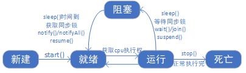

# 多线程

本篇整理 Java 多线程的基础内容：程序、进程、线程的基本概念，线程的两种传统创建方式，线程的调度与生命周期，线程同步（`synchronized` 与 `Lock`）、线程通信，以及 JDK 5.0 新增的 `Callable` 接口与线程池。

## 1. 引入：单线程存在的问题

```java
public class MyTest1 {
    public static void main(String[] args) {
		for(int i = 0; i < 100; i++) {
			System.out.println("吃饭");
			System.out.println("喝酒");
			System.out.println("聊天");
		}
    }
}
```

这段程序同一时刻只能做一件事情：必须先循环完所有"吃饭、喝酒、聊天"的输出。如果希望这些任务并发执行，就需要使用多线程。

## 2. 基本概念

### 2.1 程序、进程、线程

**程序（program）**：为完成特定任务、用某种语言编写的一组指令的集合，即指一段静态的代码、静态的对象。

**进程（process）**：程序的一次执行过程，或是**正在运行的一个程序**。它是一个动态过程，有自身的产生、存在和消亡的过程。例如运行中的 QQ、运行中的 MP3 播放器。程序是静态的，进程是动态的；进程作为资源分配的单位，系统在运行时会为每个进程分配不同的内存区域。

**线程（thread）**：进程可进一步细化为线程，线程是程序内部的一条执行路径。

- 若一个进程同一时间并行执行多个线程，就是支持多线程的；
- 线程作为调度和执行的单位，每个线程拥有独立的运行栈和程序计数器（pc），线程切换的开销小；
- 一个进程中的多个线程共享相同的内存单元/内存地址空间，它们从同一堆中分配对象，可以访问相同的变量和对象。这使得线程间通信更简便、高效，但多个线程操作共享的系统资源可能带来安全隐患；
- 每个 Java 程序都有一个隐含的主线程：`main` 方法。

### 2.2 多核 CPU

单核 CPU 其实是一种**假的多线程**，因为在一个时间单元内，也只能执行一个线程的任务。如果是多核 CPU，才能更好地发挥多线程的效率，现在的服务器都是多核的。

### 2.3 多线程的应用场合

- 程序需要同时执行两个或多个任务；
- 程序需要实现一些需要等待的任务时，如用户输入、文件读写操作、网络操作、搜索等；
- 需要一些后台运行的程序时。

## 3. 线程的创建和使用

Java 语言的 JVM 允许程序运行多个线程，它通过 `java.lang.Thread` 类来体现。

`Thread` 类的特性：

- 每个线程都是通过某个特定 `Thread` 对象的 `run()` 方法来完成操作的，经常把 `run()` 方法的主体称为线程体；
- 通过该 `Thread` 对象的 `start()` 方法来启动这个线程，而非直接调用 `run()`。

`Thread` 类的构造器：

| 构造器 | 说明 |
| --- | --- |
| `Thread()` | 创建新的 `Thread` 对象 |
| `Thread(String threadname)` | 创建线程并指定线程实例名 |
| `Thread(Runnable target)` | 指定创建线程的目标对象，它实现了 `Runnable` 接口中的 `run` 方法 |
| `Thread(Runnable target, String name)` | 创建新的 `Thread` 对象 |

JDK 5 之前创建线程有两种方式：继承 `Thread` 类的方式，以及实现 `Runnable` 接口的方式。

### 3.1 继承 `Thread` 类

实现步骤：

1. 定义子类继承 `Thread` 类；
2. 子类重写 `Thread` 类中的 `run` 方法；
3. 创建 `Thread` 子类对象，即创建线程对象；
4. 调用线程对象的 `start` 方法（启动线程，进而调用 `run` 方法）。

```java
public class ChatThread extends Thread{
	@Override
	public void run() {
		for(int i = 0; i < 10; i++) {
			System.out.println("聊天");
			try {
				Thread.currentThread().sleep(100);
			} catch (InterruptedException e) {
				// TODO Auto-generated catch block
				e.printStackTrace();
			}
		}
	}
}

public class DrinkThread extends Thread {
	@Override
	public void run() {
		for(int i = 0; i < 10; i++) {
			System.out.println("喝酒");
			try {
				Thread.currentThread().sleep(100);
			} catch (InterruptedException e) {
				// TODO Auto-generated catch block
				e.printStackTrace();
			}
		}
	}
}

public class EatThread extends Thread{
	@Override
	public void run() {
		for(int i = 0; i < 10; i++) {
			System.out.println("吃饭");
			try {
				Thread.currentThread().sleep(100);
			} catch (InterruptedException e) {
				// TODO Auto-generated catch block
				e.printStackTrace();
			}
		}
	}
}

public class MyTest2 {
    public static void main(String[] args) {
        //创建线程
        ChatThread chat = new ChatThread();
		DrinkThread drink = new DrinkThread();
		EatThread eat = new EatThread();
		//启动线程
		chat.start();
		drink.start();
		eat.start();
    }
}
```

### 3.2 实现 `Runnable` 接口

实现步骤：

1. 定义子类实现 `Runnable` 接口；
2. 子类中重写 `Runnable` 接口中的 `run` 方法；
3. 通过 `Thread` 类构造方法创建线程对象；
4. 将 `Runnable` 接口的子类对象作为实际参数传递给 `Thread` 类的构造方法；
5. 调用 `Thread` 类的 `start` 方法：开启线程，进而调用 `Runnable` 子类实现的 `run` 方法。

```java
public class ChatThread implements Runnable {
	@Override
	public void run() {
		for(int i = 0; i < 100; i++) {
			System.out.println("聊天");
			try {
				Thread.currentThread().sleep(100);
			} catch (InterruptedException e) {
				// TODO Auto-generated catch block
				e.printStackTrace();
			}
		}
	}
}

public class DrinkThread implements Runnable {
	@Override
	public void run() {
		for(int i = 0; i < 100; i++) {
			System.out.println("喝酒");
			try {
				Thread.currentThread().sleep(100);
			} catch (InterruptedException e) {
				// TODO Auto-generated catch block
				e.printStackTrace();
			}
		}
	}
}

public class EatThread implements Runnable {
	@Override
	public void run() {
		for(int i = 0; i < 100; i++) {
			System.out.println("吃饭");
			try {
				Thread.currentThread().sleep(100);
			} catch (InterruptedException e) {
				// TODO Auto-generated catch block
				e.printStackTrace();
			}
		}
	}
}

public class MyTest2 {
    public static void main(String[] args) {
        Thread chat = new Thread(new ChatThread());
        Thread drink = new Thread(new DrinkThread());
        Thread eat = new Thread(new EatThread());

        chat.start();
        drink.start();
        eat.start();
    }
}
```

相比继承 `Thread` 类，实现 `Runnable` 接口的优势：

- 避免了单继承的局限性；
- 多个线程可以共享同一个接口实现类的对象，**非常适合多个相同线程来处理同一份资源**。

### 3.3 `Thread` 类相关方法

| 方法 | 说明 |
| --- | --- |
| `start()` | 启动线程，并执行对象的 `run()` 方法 |
| `run()` | 线程在被调度时执行的操作 |
| `getName()` | 返回线程的名称 |
| `setName()` | 设置线程的名称 |
| `currentThread()` | 返回当前线程 |

```java
public class MyThread extends Thread{
    //打印100行*****
    @Override
    public void run() {
        for(int i = 0; i < 100; i++) {
            //返回线程的名称
            System.out.println("*****" + Thread.currentThread().getName() + ":" + i);
            try {
                //延时100ms
                Thread.currentThread().sleep(100);
            } catch (InterruptedException e) {
                e.printStackTrace();
            }
        }
    }
}

public class MyTest3 {
    public static void main(String[] args) throws InterruptedException {
        //设置主线程名称
        Thread.currentThread().setName("主线程");

        MyThread mythread = new MyThread();
        //设置自定义线程名称
        mythread.setName("子线程");
        //启动自定义线程
        mythread.start();
        //打印100行%%%%%
        for (int i = 0; i < 30; i++) {
            System.out.println("%%%%%" + Thread.currentThread().getName() + ":" + i);
            try {
                //延时100ms
                Thread.currentThread().sleep(100);
            } catch (InterruptedException e) {
                e.printStackTrace();
            }
        }
    }
}
```

## 4. 线程的调度和生命周期

### 4.1 线程的调度

**调度策略**：

- 基于时间片轮转；
- 抢占式：高优先级的线程抢占 CPU。

**调度方法**：

- 同优先级线程组成先进先出队列，使用时间片策略；
- 对高优先级线程，使用优先调度的抢占式策略；
- Java 中线程优先级的范围是 1~10，默认优先级是 5：`MAX_PRIORITY`（10）、`MIN_PRIORITY`（1）、`NORM_PRIORITY`（5）。

**涉及的方法**：

| 方法 | 说明 |
| --- | --- |
| `setPriority(int newPriority)` | 设置线程的优先级 |
| `getPriority()` | 获取线程的优先级 |
| `yield()` | 线程让步：暂停当前正在执行的线程，把执行机会让给优先级相同或更高的线程；若队列中没有同优先级的线程，则忽略此方法 |
| `join()` | 当某个程序执行流中调用其他线程的 `join()` 方法时，**调用线程将被阻塞**，直到 `join()` 方法加入的线程执行完为止；低优先级的线程也可以借此获得执行机会 |
| `sleep(long millis)` | 令当前活动线程在指定时间段内放弃对 CPU 的控制，使其他线程有机会被执行，时间到后重新排队 |
| `stop()` | 强制线程生命期结束 |
| `isAlive()` | 判断线程是否还存活 |

```java
public class MyTest3 {
    public static void main(String[] args) throws InterruptedException {
        Thread.currentThread().setName("主线程");

        MyThread mythread = new MyThread();
        mythread.setName("子线程");
        mythread.start();
        //设置线程的优先级
        mythread.setPriority(Thread.MAX_PRIORITY);
        //打印100行%%%%%
        for (int i = 0; i < 30; i++) {
            System.out.println("%%%%%" + Thread.currentThread().getName() + ":" + i);
            if(i == 2) {
                //Thread.currentThread().yield();
                //mythread.stop();
                mythread.join();
                System.out.println(mythread.isAlive());
            }
            try {
                Thread.currentThread().sleep(100);
            } catch (InterruptedException e) {
                // TODO Auto-generated catch block
                e.printStackTrace();
            }
        }
    }
}
```

### 4.2 线程的生命周期

- **新建**：当一个 `Thread` 类或其子类的对象被声明并创建时，新生的线程对象处于新建状态；
- **就绪**：处于新建状态的线程被 `start()` 后，将进入线程队列**等待 CPU 时间片**，此时它已具备了运行的条件；
- **运行**：当就绪的线程被调度并获得处理器资源时，便进入运行状态，`run()` 方法定义了线程的操作和功能；
- **阻塞**：在某种特殊情况下，被人为挂起或执行输入输出操作时，让出 CPU 并临时中止自己的执行，进入阻塞状态；
- **死亡**：线程完成了它的全部工作，或线程被提前强制性地中止。



## 5. 线程同步

先看一个多线程卖票的例子：

```java
public class Window implements Runnable {
    private int count = 100;
    @Override
    public void run() {
        while(true) {
            if(count > 0) {
                try {
                    Thread.currentThread().sleep(6);
                } catch (InterruptedException e) {
                    // TODO Auto-generated catch block
                    e.printStackTrace();
                }
                System.out.println(Thread.currentThread().getName() + "卖第" + (count--) + "张票");
            } else {
                break;
            }
        }
    }
}

public class MyTest4 {
    public static void main(String[] args) {
        Window window = new Window();
        Thread window1 = new Thread(window);
        Thread window2 = new Thread(window);
        Thread window3 = new Thread(window);

        window1.start();
        window2.start();
        window3.start();
    }
}
```

运行后会出现两类**现象**：

1. 多个窗口卖同一张票；
2. 票的编号出现了 0 或者负值。

**问题的原因**：当多条语句在操作同一个线程共享数据时，一个线程对多条语句只执行了一部分、还没有执行完，另一个线程就参与进来执行，导致共享数据出错。

**解决思路**：对多条操作共享数据的语句，只能让一个线程全部执行完，在执行过程中，其他线程不可以参与执行。

Java 对多线程的安全问题提供了专业的解决方式：**同步机制**。

### 5.1 `synchronized` 代码块

```java
public class Window1 implements Runnable {
	private int count = 100;
	@Override
	public void run() {
		while(true) {
			//只剩一张票
			/* synchronized代码块运行完毕，才会切换到另一个线程执行
			 * 什么样的内容要放到synchronized代码块中？
			 *   涉及到多个线程修改的地方要放到synchronized代码块中
			 * 锁：一定要是所有线程共享的	
			*/
			synchronized (this) {
				if(count > 0) {
					System.out.println(Thread.currentThread().getName() + "卖第" + (count--) + "张票");
				} else {
					break;
				}
			}
			try {
				Thread.currentThread().sleep(100);
			} catch (InterruptedException e) {
				e.printStackTrace();
			}
		}
	}
}
```

### 5.2 `synchronized` 方法

```java
//所有窗口共用100张票
public class Window2 implements Runnable {
	private int count = 100;
	@Override
	public void run() {
		while(true) {
			sale();
			if(count <= 0) {
				break;
			}
			try {
				Thread.currentThread().sleep(100);
			} catch (InterruptedException e) {
				// TODO Auto-generated catch block
				e.printStackTrace();
			}
		}
	}
	
	//同步方法  该方法运行完毕之后，其他的线程才会运行
	public synchronized void sale() {
		if(count > 0) {
			System.out.println(Thread.currentThread().getName() + "卖第" + (count--) + "张票");
		}
	}
}
```

### 5.3 `Lock` 锁

从 JDK 5.0 开始，Java 提供了更强大的线程同步机制——通过显式定义同步锁对象来实现同步，同步锁使用 `Lock` 对象充当。

`java.util.concurrent.locks.Lock` 接口是控制多个线程对共享资源进行访问的工具。锁提供了对共享资源的独占访问，每次只能有一个线程对 `Lock` 对象加锁，线程开始访问共享资源之前应先获得 `Lock` 对象。

`ReentrantLock` 类实现了 `Lock` 接口，它拥有与 `synchronized` 相同的并发性和内存语义。在实现线程安全的控制中，比较常用的是 `ReentrantLock`，它可以显式加锁、释放锁。

```java
import java.util.concurrent.locks.ReentrantLock;

public class Window3 implements Runnable {
    private int count = 100;
    private ReentrantLock lock = new ReentrantLock(true);
    @Override
    public void run() {
        while(true) {
            try {
                lock.lock();
                if(count > 0) {
                    System.out.println(Thread.currentThread().getName() + "卖第" + (count--) + "张票");
                } else {
                    break;
                }
            } finally {
                lock.unlock();
            }

            try {
                Thread.currentThread().sleep(100);
            } catch (InterruptedException e) {
                e.printStackTrace();
            }
        }
    }
}
```

### 5.4 线程安全的单例模式（懒汉式）

```java
//synchronized代码块方式
public class SingleObject {
    private static SingleObject obj = null;
    
    private SingleObject() {
        
    }
    
    public static SingleObject getInstance() {
        synchronized(SingleObject.class) {
            if(obj == null) {
                obj = new SingleObject();
            }
        }
        return obj;
    }
}

//synchronized方法方式
public class SingleObject {
    private static SingleObject obj = null;
    
    private SingleObject() {
        
    }
    
    public static synchronized SingleObject getInstance() {
        if(obj == null) {
            obj = new SingleObject();
        }
        return obj;
    }
}

//Lock方式
public class SingleObject {
    private static SingleObject obj = null;
    private ReentrantLock lock = new ReentrantLock(true);
    
    private SingleObject() {
        
    }
    
    public static SingleObject getInstance() {
        try {
            lock.lock();
            if(obj == null) {
                obj = new SingleObject();
            }
        } finally {
            lock.unlock();
        }
        return obj;
    }
}
```

### 5.5 死锁

不同的线程分别占用对方需要的同步资源不放弃，都在等待对方放弃自己需要的同步资源，就形成了线程的死锁。

> [!WARNING]
> 出现死锁后，不会出现异常，也不会出现提示，只是所有的线程都处于阻塞状态，无法继续。

```java
public class Lock {
	static Object objA = new Object();
	static Object objB = new Object();
}

public class MyThreadA extends Thread {
	@Override
	public void run() {
		while(true) {
			synchronized (Lock.objA) {
				synchronized (Lock.objB) {
					System.out.println("MyThreadA...");
				}
			}
		}
	}
}

public class MyThreadB extends Thread {
	@Override
	public void run() {
		while(true) {
			synchronized (Lock.objB) {
				synchronized (Lock.objA) {
					System.out.println("MyThreadB...");
				}
			}
		}
	}
}

public class MyTest5 {
	public static void main(String[] args) {
		MyThreadA a = new MyThreadA();
		MyThreadB b = new MyThreadB();
		a.setPriority(Thread.MAX_PRIORITY);
		b.setPriority(Thread.MIN_PRIORITY);
		a.start();
		b.start();
	}
}
```

死锁的解决方法：

- 使用专门的算法、原则；
- 尽量减少同步资源的定义；
- 尽量避免嵌套同步。

## 6. 线程通信

线程通信的相关方法：

| 方法 | 说明 |
| --- | --- |
| `wait()` | 令当前线程挂起并放弃 CPU、同步资源并等待，使别的线程可访问并修改共享资源；当前线程排队等候其他线程调用 `notify()` 或 `notifyAll()` 方法唤醒，唤醒后重新获得对监视器的所有权后才能继续执行 |
| `notify()` | 唤醒正在排队等待同步资源的线程中优先级最高者结束等待 |
| `notifyAll()` | 唤醒正在排队等待资源的所有线程结束等待 |

> [!IMPORTANT]
> 以上三个方法只有在 `synchronized` 方法或 `synchronized` 代码块中才能使用。

案例：两个线程交替打印 1~100。

```java
public class PrintNum implements Runnable {
    int i = 1;

    @Override
    public void run() {
        while (true) {
            synchronized (this) {
                //唤醒正在排队等待同步资源的线程中优先级最高者结束等待
                notify();
                if (i <= 100) {
                    System.out.println(Thread.currentThread().getName() + ":" + i++);
                } else
                    break;
                try {
                    //令当前线程挂起并放弃CPU、同步资源并等待
                    wait();
                } catch (InterruptedException e) {
                    e.printStackTrace();
                }
            }
        }
    }
}

public class MyTest6 {
    public static void main(String[] args) {
        PrintNum printNum = new PrintNum();

        Thread th1 = new Thread(printNum);
        Thread th2 = new Thread(printNum);

        th1.start();
        th2.start();
    }
}
```

经典的生产者消费者问题：生产者（Productor）将产品交给店员（Clerk），而消费者（Customer）从店员处取走产品。店员一次只能持有固定数量的产品（比如 20 个）：如果生产者试图生产更多的产品，店员会叫生产者停一下，店中有空位放产品了再通知生产者继续生产；如果店中没有产品了，店员会告诉消费者等一下，店中有产品了再通知消费者来取走产品。

```java
import java.util.ArrayList;
import java.util.List;

//仓库
public class Factory {
	//最大容量
	public static final int MAX_SIZE = 100;
	private static List<Object> list = new ArrayList<Object>();
	
	public static List<Object> getList() {
		return list;
	}
	
	public static void setList(List<Object> list) {
		Factory.list = list;
	}
}

public class Produce extends Thread {
	@Override
	public void run() {
		while(true) {
			synchronized (Factory.getList()) {
				//仓库没有满
				if(Factory.getList().size() < Factory.MAX_SIZE) {
					//生产
					Factory.getList().add(new Object());
					System.out.println(Thread.currentThread().getName() + "：生产\t" + "总数量：" + Factory.getList().size());
					Factory.getList().notifyAll();
					try {
						Thread.sleep(2);
					} catch (InterruptedException e) {
						// TODO Auto-generated catch block
						e.printStackTrace();
					}
				} else {//仓库已满
					try {
						System.out.println(Thread.currentThread().getName() + ":仓库已满，取消生产任务\t" + "总数量：" + Factory.getList().size());
						Factory.getList().wait();
					} catch (InterruptedException e) {
						e.printStackTrace();
					}
				}
			}
		}
	}
}

public class Consume extends Thread {
	@Override
	public void run() {
		while(true) {
			synchronized (Factory.getList()) {
				Factory.getList().notifyAll();
				//有商品
				if(Factory.getList().size() > 0) {
					//消费商品
					Factory.getList().remove(0);
					System.out.println(Thread.currentThread().getName() + "：消费\t" + "总数量：" + Factory.getList().size());
					try {
						Thread.sleep(10);
					} catch (InterruptedException e) {
						// TODO Auto-generated catch block
						e.printStackTrace();
					}
				} else { //无商品
					try {
						System.out.println(Thread.currentThread().getName() + "：仓库已空，取消消费任务\t" + "总数量：" + Factory.getList().size());
						Factory.getList().wait();
					} catch (InterruptedException e) {
						e.printStackTrace();
					}
				}
			}
		}
	}
}

public class MyTest7 {
	public static void main(String[] args) {
		Produce p = new Produce();
		p.start();
		Consume c1 = new Consume();
		Consume c2 = new Consume();
		c1.start();
		c2.start();
	}
}
```

## 7. JDK 5.0 新增线程创建方式

### 7.1 实现 `Callable` 接口

与使用 `Runnable` 相比，`Callable` 功能更强大一些：

- 相比 `run()` 方法，可以有返回值；
- 方法可以抛出异常；
- 支持泛型的返回值；
- 需要借助 `FutureTask` 类，比如获取返回结果。

关于 `Future` 接口：

- 可以对具体 `Runnable`、`Callable` 任务的执行结果进行取消、查询是否完成、获取结果等操作；
- `FutureTask` 是 `Future` 接口唯一的实现类；
- `FutureTask` 同时实现了 `Runnable`、`Future` 接口，它既可以作为 `Runnable` 被线程执行，又可以作为 `Future` 得到 `Callable` 的返回值。

```java
import java.util.concurrent.Callable;

/**
 * 使用实现Callable接口的方式创建线程
 */
public class NumThread implements Callable<Integer> {

    //重写call方法
    @Override
    public Integer call() throws Exception {
        //1+2+3+4+...+100
        int sum = 0;
        for(int i = 1; i <= 100; i++) {
            sum += i;
        }
        return sum;
    }
}

public class MyTest8 {
    public static void main(String[] args) {
        NumThread numThread = new NumThread();
        FutureTask<Integer> task = new FutureTask<>(numThread);
        //创建线程
        Thread thread = new Thread(task);
        //启动线程
        thread.start();
        //设置线程优先级
        thread.setPriority(Thread.MAX_PRIORITY);

        try {
            Integer sum = task.get();
            System.out.println(sum);
        } catch (InterruptedException e) {
            e.printStackTrace();
        } catch (ExecutionException e) {
            e.printStackTrace();
        }
    }
}
```

### 7.2 使用线程池

#### 7.2.1 存在的问题及解决思路

**背景**：经常创建和销毁、使用量特别大的资源，比如并发情况下的线程，对性能影响很大。

**思路**：提前创建好多个线程，放入线程池中，使用时直接获取，使用完放回池中。这样可以避免频繁创建销毁，实现重复利用。

**好处**：

- 提高响应速度（减少了创建新线程的时间）；
- 降低资源消耗（重复利用线程池中的线程，不需要每次都创建）；
- 便于线程管理：
  - `corePoolSize`：核心池的大小；
  - `maximumPoolSize`：最大线程数；
  - `keepAliveTime`：线程没有任务时最多保持多长时间后会终止。

#### 7.2.2 线程池相关 API

JDK 5.0 起提供了线程池相关 API：`ExecutorService` 和 `Executors`。

`ExecutorService`：真正的线程池接口，常见实现类是 `ThreadPoolExecutor`。

| 方法 | 说明 |
| --- | --- |
| `void execute(Runnable command)` | 执行任务/命令，没有返回值，一般用来执行 `Runnable` |
| `Future submit(Callable task)` | 执行任务，有返回值，一般用来执行 `Callable` |
| `void shutdown()` | 关闭连接池 |

`Executors`：工具类、线程池的工厂类，用于创建并返回不同类型的线程池。

| 方法 | 说明 |
| --- | --- |
| `Executors.newCachedThreadPool()` | 创建一个可根据需要创建新线程的线程池 |
| `Executors.newFixedThreadPool(n)` | 创建一个可重用固定线程数的线程池 |
| `Executors.newSingleThreadExecutor()` | 创建一个只有一个线程的线程池 |
| `Executors.newScheduledThreadPool(n)` | 创建一个线程池，它可安排在给定延迟后运行命令，或者定期地执行 |

```java
public class NumberThread implements Runnable {
    @Override
    public void run() {
        for (int i = 1; i <= 100; i++) {
            if(i % 2 == 0) {
                System.out.println(Thread.currentThread().getName() + ":" + i);
            }
        }
    }
}

public class NumberThread1 implements Runnable {
    @Override
    public void run() {
        for (int i = 1; i <= 100; i++) {
            if(i % 2 != 0) {
                System.out.println(Thread.currentThread().getName() + ":" + i);
            }
        }
    }
}


public class MyTest9{
    public static void main(String[] args) {
        //创建线程池
        ExecutorService service = Executors.newFixedThreadPool(10);
        NumberThread numberThread = new NumberThread();
        NumberThread1 numberThread1 = new NumberThread1();

        //执行线程
        service.execute(numberThread);
        service.execute(numberThread1);

        //关闭线程
        service.shutdown();
    }
}
```
