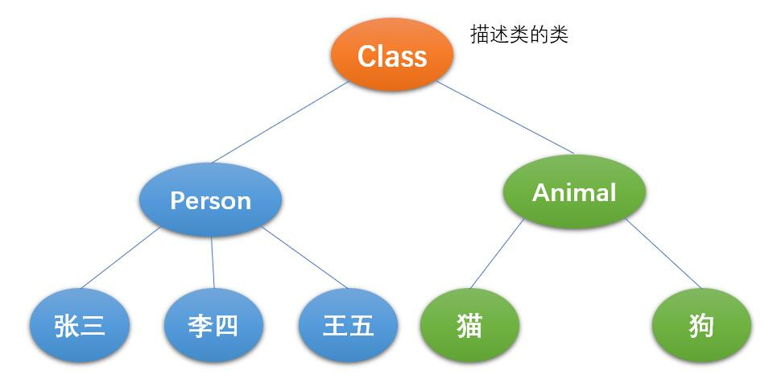

# 反射

本篇整理 Java 反射机制的基础内容：反射的概念与应用场景、`Class` 类与反射的原理，以及获取 `Class` 实例、创建对象、操作属性与方法等反射相关的常用操作。

## 1. Java 反射机制概述

### 1.1 什么是反射

`Reflection`（反射）被视为**动态语言**的关键，反射机制允许程序在执行期借助 `Reflection API` 取得任何类的内部信息，并能直接操作任意对象的内部属性及方法。

加载完类之后，在堆内存的方法区中就产生了一个 `Class` 类型的对象（一个类只有一个 `Class` 对象），这个对象就包含了完整的类的结构信息。我们可以通过这个对象看到类的结构。这个对象就像一面镜子，透过这个镜子看到类的结构，所以我们形象地称之为：**反射**。

对比正常方式与反射方式：

- 正常的方式：引入需要的全类名 → 通过 `new` 实例化 → 取得实例化对象；
- 反射方式：实例化对象 → 反射相关 API → 得到完整的全类名。

关于动态语言和静态语言：

- **动态语言**：是一类在运行时可以改变其结构的语言。例如新的函数、对象、甚至代码可以被引进，已有的函数可以被删除或是发生其他结构上的变化。通俗点说，就是在**运行时代码可以根据某些条件改变自身结构**，例如 Python、JavaScript、C#；
- **静态语言**：与动态语言相对应，运行时结构不可变的语言就是静态语言，如 Java、C、C++；
- Java 不是动态语言，但 Java 可以称为**准动态语言**。即 Java 有一定的动态性，我们可以利用反射机制、字节码操作获得类似动态语言的特性。

### 1.2 反射的应用

在框架开发中，都是基于配置文件开发的。

在配置文件中配置了类，就可以通过反射得到**类中的所有内容**，并通过这些内容实现对象的创建、属性的修改、方法的调用。

类中的所有内容包括：

- 属性；
- 构造方法：
  - 无参构造方法；
  - 有参构造方法；
- 普通方法。

```java
public class Person {
    private String name;
    private int age;
    private String addr;

    //默认构造方法
    //带参数的构造方法
	//get和set

    public void run() {
        System.out.println("run...");
    }
}

public class MyTest1 {
    public static void main(String[] args) {
        //创建对象
        Person person = new Person();
        //调用对象的方法
        person.run();
    }
}

public class MyTest2 {
    public static void main(String[] args) throws Exception {
        //获取Class类的对象
        Class c1 = Class.forName("com.qfedu.test17.Person");
        //通过默认方法创建Person对象
        Object o = c1.newInstance();
        //获取Method
        Method run = c1.getMethod("run", null);
        //执行run方法
        run.invoke(o, null);
    }
}
```

### 1.3 反射涉及的类

| 类 | 说明 |
| --- | --- |
| `java.lang.Class` | 代表一个类 |
| `java.lang.reflect.Method` | 代表类的方法 |
| `java.lang.reflect.Field` | 代表类的成员变量 |
| `java.lang.reflect.Constructor` | 代表类的构造器 |

## 2. `Class` 类及反射的原理



`Class` 本身也是一个类，一个加载的类在 JVM 中只会有一个 `Class` 对象，一个 `Class` 对象对应的是一个加载到 JVM 中的 `.class` 文件。

通过 `Class` 可以完整地得到一个类中的所有被加载的结构。`Class` 类是反射的根源，针对任何想动态加载、运行的类，唯有先获得相应的 `Class` 对象。

## 3. 反射相关操作

### 3.1 获取 `Class` 类的实例（重点）

获取 `Class` 对象有三种方式：

- `类名.class`：效率最高；
- `对象.getClass()`；
- `Class.forName("全类名")`：可能出现异常。

```java
public class MyTest3 {
    public static void main(String[] args) throws ClassNotFoundException {
        //获取Class类对象的三种方式
        //类名.class
        Class<Person> c1 = Person.class;
        System.out.println(c1);

        //对象.getClass() getClass()是Object类中的方法
        Person p = new Person();
        Class<? extends Person> c2 = p.getClass();
        System.out.println(c2);

        //Class.forName(全类名)
        Class<?> c3 = Class.forName("com.qfedu.test17.Person");
        System.out.println(c3);

        System.out.println(c1 == c2);
        System.out.println(c2 == c3);
    }
}
```

哪些类型可以有 `Class` 对象：

- `class` 类；
- `interface` 接口；
- `[]` 数组；
- `enum` 枚举；
- `annotation` 注解；
- 基本数据类型；
- `void`。

### 3.2 创建对象（重点）

要创建类的对象，通常使用 `new`。如果不使用 `new`，如何创建？可以通过反射完成。

#### 3.2.1 操作无参数的构造方法

`Object newInstance()`：调用默认构造函数，返回该 `Class` 对象的一个实例。

```java
public class MyTest4 {
    public static void main(String[] args) throws Exception {
        //获取Class对象
        Class<?> c = Class.forName("com.qfedu.test17.Person");
        //操作默认的构造方法创建对象
        Object o = c.newInstance();
        //判断o是否是Person类的对象
        System.out.println(o instanceof Person);

        Person p = (Person)o;
        p.run();
    }
}
```

#### 3.2.2 操作有参数的构造方法

`Constructor<T> getConstructor(Class<?>... parameterTypes)`：取得本类的指定形参类型的构造器。

```java
public class MyTest5 {
    public static void main(String[] args) throws Exception {
        //获取Class对象
        Class<?> c = Class.forName("com.qfedu.test17.Person");
        //获取有参的构造方法
        Constructor<?> constructor = c.getConstructor(String.class, int.class, String.class);
        //调用有参的构造方法创建对象
        Object o = constructor.newInstance("zs", 12, "qd");
        //判断o是否是Person类的对象
        System.out.println(o instanceof Person);

        Person p = (Person)o;
        p.run();
    }
}
```

### 3.3 获取运行时类的指定结构（重点）

#### 3.3.1 获取属性

在反射机制中，可以直接通过 `Field` 类操作类中的属性。通过 `Field` 类提供的 `set()` 和 `get()` 方法，就可以完成设置和取得属性内容的操作。

通过 `Class` 类的对象获取 `Field`：

| 方法 | 说明 |
| --- | --- |
| `public Field getField(String name)` | 返回此 `Class` 对象表示的类或接口的指定的 `public` 的 `Field` |
| `public Field getDeclaredField(String name)` | 返回此 `Class` 对象表示的类或接口的指定的 `Field` |

在 `Field` 中：

| 方法 | 说明 |
| --- | --- |
| `public Object get(Object obj)` | 取得指定对象 `obj` 上此 `Field` 的属性内容 |
| `public void set(Object obj, Object value)` | 设置指定对象 `obj` 上此 `Field` 的属性内容 |

```java
public class MyTest6 {
    public static void main(String[] args) throws Exception {
        //获取Class对象
        Class<?> c = Class.forName("com.qfedu.test17.Person");
        //操作默认的构造方法创建对象
        Object o = c.newInstance();
        //判断o是否是Person类的对象
        System.out.println(o instanceof Person);

        //获取属性Field
        Field name = c.getDeclaredField("name");
        //设置允许访问
        name.setAccessible(true);
        //设置属性
        name.set(o, "Tom");
        System.out.println(o);
    }
}
```

#### 3.3.2 获取方法

```java
public class MyTest7 {
    public static void main(String[] args) throws Exception {
        //获取Class对象
        Class<?> c = Class.forName("com.qfedu.test17.Person");
        //操作默认的构造方法创建对象
        Object o = c.newInstance();
        //判断o是否是Person类的对象
        System.out.println(o instanceof Person);

        Method method = c.getDeclaredMethod("run", null);
        //执行方法
        method.invoke(o,null);
    }
}
```

#### 3.3.3 综合案例

创建配置文件，设置类和要运行的方法，通过反射的方式运行配置文件中的方法。

```java
import java.io.FileInputStream;
import java.lang.reflect.Method;
import java.util.Properties;

public class MyTest8 {
    public static void main(String[] args) throws Exception {
        //加载并解析配置文件
        Properties prop = new Properties();
        prop.load(new FileInputStream("a.properties"));

        String myclass = prop.getProperty("myclass");
        String mymethod = prop.getProperty("mymethod");

        //System.out.println(myclass);
        //System.out.println(mymethod);

        //获取Class类的对象
        Class<?> c = Class.forName(myclass);
        //创建Class类的对象的实例对象
        Object o = c.newInstance();
        //获取Method
        Method method = c.getMethod(mymethod, null);
        //执行method
        method.invoke(o,null);
    }
}
```

配置文件 `a.properties` 的内容：

```properties
myclass=com.qfedu.test17.Person
mymethod=run
```

### 3.4 获取运行时类的完整结构

运行时类的完整结构包括：实现的全部接口、所继承的父类、全部的构造器、全部的方法、全部的 `Field`。

| 目标 | 方法 |
| --- | --- |
| 获取实现的全部接口 | `public Class[] getInterfaces()` |
| 获得所继承的父类 | `public Class getSuperclass()` |
| 获取全部的构造方法 | `public Constructor[] getConstructors()`、`public Constructor[] getDeclaredConstructors()` |
| 获取全部的方法 | `public Method[] getDeclaredMethods()`、`public Method[] getMethods()` |
| 获取全部的 `Field` | `public Field[] getFields()`、`public Field[] getDeclaredFields()` |
