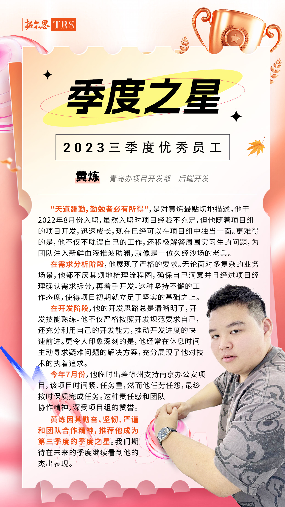

这里是我的个人技术博客，记录后端开发路上的学习笔记与实战积累、软考备考整理，以及一些日常兴趣记录。

## 关于我

一名 Java 后端开发者，目前在工作之余系统梳理 **JavaSE、框架、数据库、Web 开发、微服务、算法与设计模式** 等主题知识，同时备考 **软考·软件设计师**，逐步沉淀为这套笔记。

## 本博客涵盖

- **JavaSE**：Java 基础语法与进阶专题，涵盖环境搭建、面向对象、集合与异常
- **工具 | 部署**：IDEA、Maven、Git、Linux、Nginx 等开发环境与运维实践
- **数据库**：MySQL 与 JDBC
- **Web 开发**：前端基础与 JavaWeb 服务端（Servlet、JSP、Cookie/Session）
- **框架学习**：MyBatis、Spring、SpringBoot、SpringMVC、Vue
- **SpringCloud**：Docker 容器化、Redis、RocketMQ、ElasticSearch 等中间件，以及 Nacos / Gateway / Sentinel / Seata 微服务组件与综合项目实战
- **算法**：按算法设计策略组织，含分治、动态规划、贪心、回溯、分支限界、随机化、线性规划与网络流、NP 完全性理论
- **软考**：中级资格·软件设计师备考笔记，覆盖计算机组成与体系结构、操作系统、程序设计语言、数据结构、算法基础、数据结构与算法应用、系统开发基础
- **设计模式**：面向对象设计的思想与方法，按 GoF 创建型、结构型、行为型三大类别整理
- **生活与兴趣**：家庭网络、街霸及其他日常实践记录

## 荣誉

优秀员工 · 季度之星

## 联系我

欢迎交流技术、指出笔记中的错误，或分享你的看法。
