# rocketMQ

## 1. 什么是 MQ

### 1.1 MQ 简介

**MQ**（Message Queue，消息队列）：是生产者消费者的设计模式。

- **生产者**：往 queue 存放消息；
- **消息队列**：存储消息；
- **消费者**：消费消息。

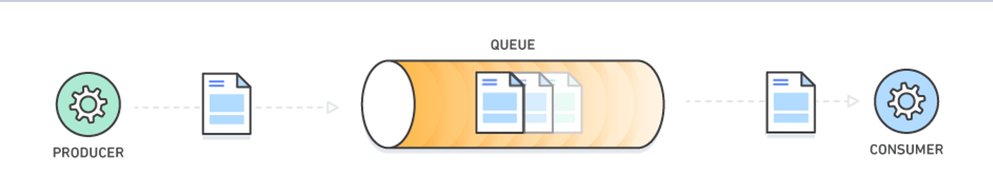

### 1.2 MQ 的优势

**优势一：异步处理**

服务之间的调用是同步调用，如果下游服务是一个耗时操作，那么会阻塞线程，最终导致触发熔断降级。解决办法：使用 MQ，MQ 可以实现异步操作。

**优势二：应用解耦**

系统的耦合性越高，容错性就越低，使用 MQ 可以达到完全解耦。

**优势三：流量消峰**

消息队列可以将大量请求缓存起来，分散到很长一段时间处理，避免请求丢失或者系统被压垮。

### 1.3 主流 MQ 对比

常见的 MQ 产品包括 Kafka、ActiveMQ、RabbitMQ、RocketMQ。

| 特性 | ActiveMQ | RabbitMQ | RocketMQ（阿里） | Kafka（大数据） |
| --- | --- | --- | --- | --- |
| 开发语言 | Java | Erlang | Java | Scala |
| 单机吞吐量 QPS | 万级 | 万级 | 10 万级 | 10 万级 |
| 时效性 RT | ms 级 | us 级 | ms 级 | ms 级 |
| 可用性（高可用） | 主从架构 | 主从架构 | 分布式架构 | 分布式架构 |

优劣势总结：

```text
ActiveMQ
非常成熟，功能强大，在业内大量的公司以及项目中都有应用，偶尔会有较低概率丢失消息，
而且现在社区以及国内应用都越来越少，官方社区现在对 ActiveMQ 5.x 维护越来越少，几个月才
发布一个版本。它确实主要是基于解耦和异步来用的，较少在大规模吞吐的场景中使用。

RabbitMQ
erlang 语言开发，性能极其好，延时很低；吞吐量到万级，MQ 功能比较完备；开源提供的管理
界面非常棒，用起来很好用；社区相对比较活跃，几乎每个月都发布几个版本。在国内一些互联网
公司近几年用 RabbitMQ 也比较多一些。
但是问题也是显而易见的：RabbitMQ 吞吐量会低一些，因为它的实现机制比较重。而且 erlang
开发，国内有几个公司有实力做 erlang 源码级别的研究和定制？如果说没这个实力，确实偶尔会有
一些问题，你很难看懂源码，公司对这个东西的掌控很弱，基本只能依赖于开源社区的快速维护和
修复 bug。而且 RabbitMQ 集群动态扩展会很麻烦，不过这个还好。其实主要是 erlang 语言本身
带来的问题：很难读源码，很难定制和掌控。

RocketMQ
接口简单易用，而且毕竟在阿里大规模应用过，有阿里品牌保障。日处理消息上百亿之多，可以
做到大规模吞吐，性能也非常好，分布式扩展也很方便，社区维护还可以，可靠性和可用性都是
OK 的，还可以支撑大规模的 topic 数量，支持复杂 MQ 业务场景。
一个很大的优势在于，阿里出品都是 Java 系的，我们可以自己阅读源码，定制自己公司的 MQ，
可以掌控。有很多业务特性，如瞬时消息、延迟消息、事务消息等。

Kafka（缺少业务相关功能，如延迟消息没有）
Kafka 的特点其实很明显，就是仅仅提供较少的核心功能，但是提供超高的吞吐量、ms 级的延迟、
极高的可用性以及可靠性，而且分布式可以任意扩展。同时 Kafka 最好是支撑较少的 topic 数量，
以保证其超高吞吐量。
Kafka 唯一的一点劣势是有可能消息重复消费，对数据准确性会造成极其轻微的影响，在大数据
领域以及日志采集中这点轻微影响可以忽略，这个特性天然适合大数据实时计算以及日志收集。
```

### 1.4 Apache RocketMQ 简介

**RocketMQ** 是阿里巴巴 2016 年开源的 MQ 中间件，使用 Java 语言开发。在阿里内部，RocketMQ 承接了例如"双 11"等高并发场景的消息流转，能够处理万亿级别的消息。

- 官网：<http://rocketmq.apache.org/>
- 中文文档：<https://github.com/apache/rocketmq/tree/master/docs/cn>
- 不同版本下载地址：<http://rocketmq.apache.org/dowloading/releases/>

## 2. RocketMQ 安装与启动

解压即安装，先配置 `ROCKETMQ_HOME` 环境变量：

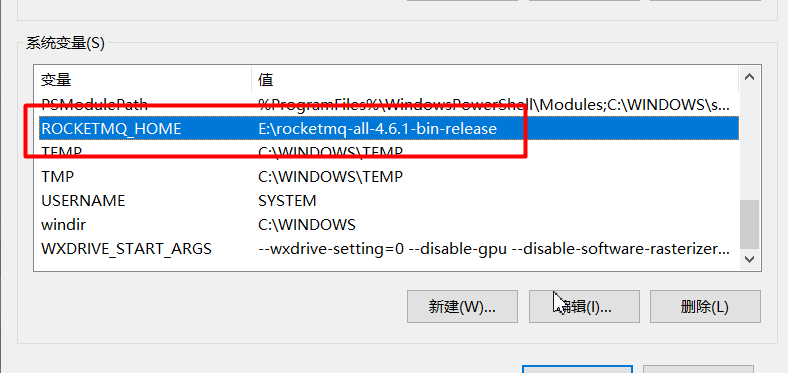

RocketMQ 有两类进程，分别是 **NameServer 进程**与 **Broker 进程**。

### 2.1 配置并启动 NameServer 进程

#### 2.1.1 配置 NameServer

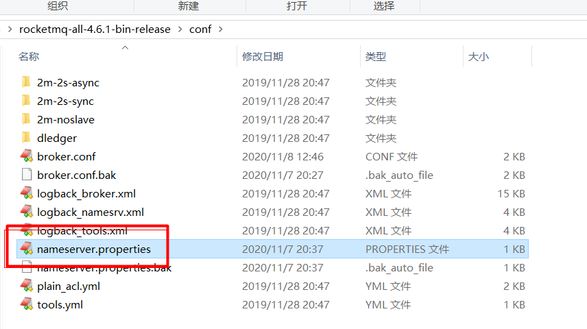

没有该文件则新建：

```properties
listenPort=9876
listenIp=127.0.0.1
```

#### 2.1.2 启动 NameServer

```sh
start mqnamesrv.cmd -c ../conf/nameserver.properties
```

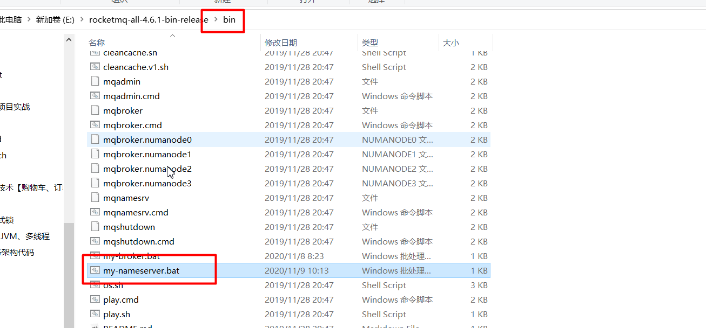

> [!TIP]
> 如果服务器性能不够，可以修改 `runserver.cmd` 里面的 JVM 配置（默认堆内存较大，本机调试建议调小）。

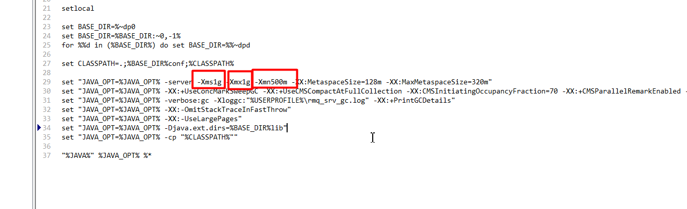

NameServer 进程启动成功：

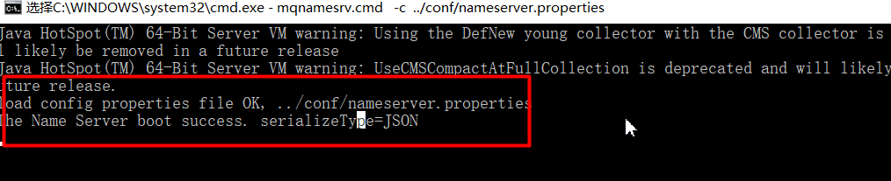

### 2.2 配置并启动 Broker 进程

#### 2.2.1 配置 Broker

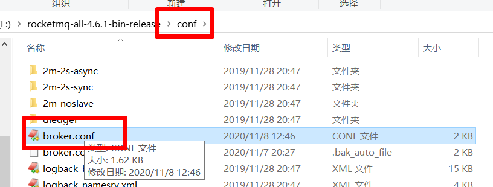

```properties
# 所属集群名字
brokerClusterName=rocketmq-cluster
# broker名字，注意此处不同的配置文件填写的不一样
brokerName=broker-a
# 0 表示 Master，>0 表示 Slave
brokerId=0
# nameServer地址，分号分割【重点】
namesrvAddr=127.0.0.1:9876
# Broker 对外服务的监听端口
listenPort=10911
# Broker监听的ip【重点】
brokerIP1=127.0.0.1

# 在发送消息时，自动创建服务器不存在的topic，默认创建的队列数
defaultTopicQueueNums=4
# 是否允许 Broker 自动创建Topic，建议线下开启，线上关闭
autoCreateTopicEnable=true
# 是否允许 Broker 自动创建订阅组，建议线下开启，线上关闭
autoCreateSubscriptionGroup=true
# 删除文件时间点，默认凌晨 4点
deleteWhen=04
# 文件保留时间，默认 48 小时
fileReservedTime=120
# commitLog每个文件的大小默认1G
mappedFileSizeCommitLog=1073741824
# ConsumeQueue每个文件默认存30W条，根据业务情况调整
mappedFileSizeConsumeQueue=300000
```

#### 2.2.2 启动 Broker

在 bin 目录下，新建 `my-broker.cmd` 文件，启动内容如下：

```sh
start mqbroker.cmd -c ../conf/broker.conf
```

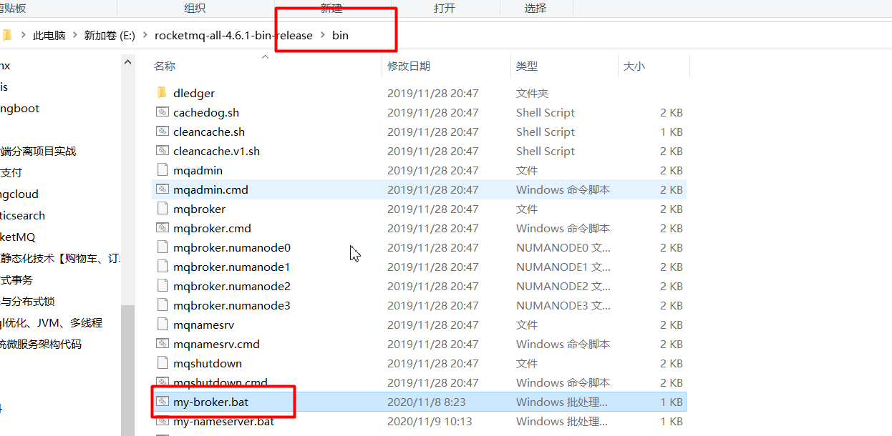

Broker 进程 JVM 堆内存设置：

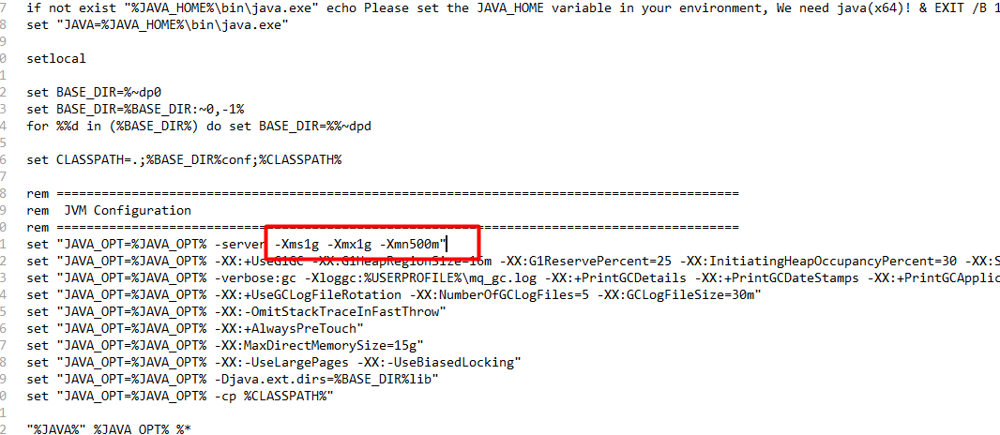

Broker 启动成功：

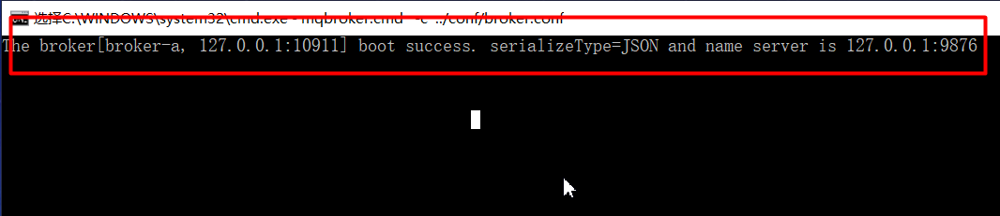

## 3. RocketMQ 进程角色

### 3.1 进程角色说明

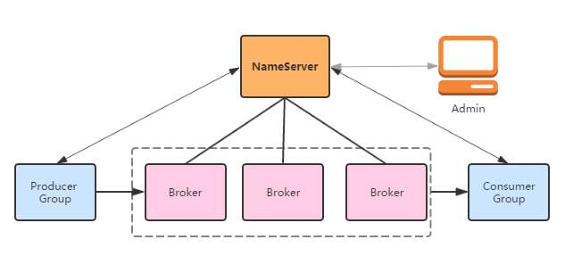

- **Name Server**：在消息队列 RocketMQ 版中提供命名服务，更新和发现 Broker 服务，保存 Broker 和 Topic 的路由信息。Name Server 通过集群保证高可用；
- **Broker**：集群最核心模块，主要负责 Topic 消息存储、消费者的消费位点管理（消费进度）。Broker 通过主备保证分片数据高可用。

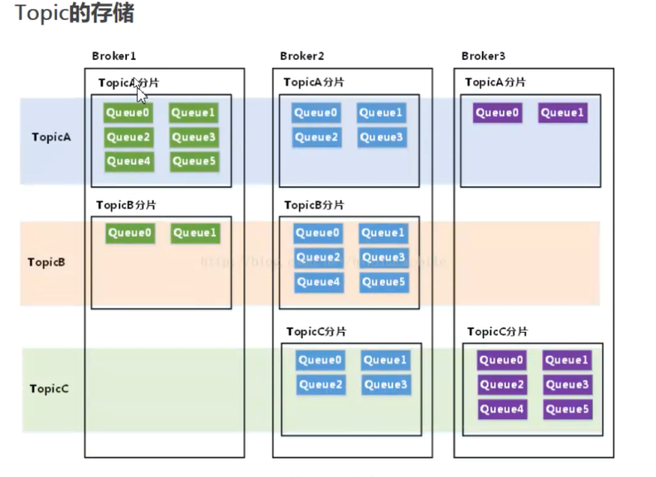

### 3.2 相关概念

| 概念 | 说明 |
| --- | --- |
| 消息（Message） | 消息系统所传输信息的物理载体，生产和消费数据的最小单位，每条消息必须属于一个主题。RocketMQ 中每个消息拥有唯一的 Message ID，且可以携带具有业务标识的 Key，系统提供了通过 Message ID 和 Key 查询消息的功能 |
| 主题（Topic） | 每条消息只能属于一个主题，是 RocketMQ 进行消息订阅的基本单位 |
| 标签（Tag） | 为消息设置的标志，用于同一主题下区分不同类型的消息。来自同一业务单元的消息，可以根据不同业务目的在同一主题下设置不同标签。标签能够有效地保持代码的清晰度和连贯性，并优化 RocketMQ 提供的查询系统；消费者可以根据 Tag 实现对不同子主题的不同消费逻辑，实现更好的扩展性 |
| 生产者组（Producer Group） | 同一类 Producer 的集合，这类 Producer 发送同一类消息且发送逻辑一致。如果发送的是事务消息且原始生产者在发送之后崩溃，则 Broker 服务器会联系同一生产者组的其他生产者实例以提交或回溯消费 |
| 消费者组（Consumer Group） | 同一类 Consumer 的集合，这类 Consumer 通常消费同一类消息且消费逻辑一致。消费者组使得在消息消费方面，实现负载均衡和容错的目标变得非常容易。要注意的是，消费者组的消费者实例必须订阅完全相同的 Topic。RocketMQ 支持两种消息模式：集群消费（Clustering）和广播消费（Broadcasting） |

## 4. RocketMQ 控制台

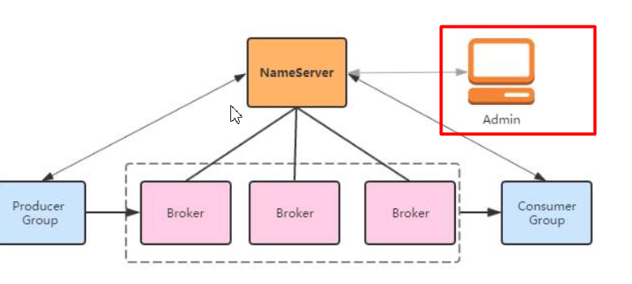

> [!NOTE]
> RocketMQ 有一个对其扩展的开源项目 [incubator-rocketmq-externals](https://github.com/apache/rocketmq-externals)，这个项目中有一个子模块叫 `rocketmq-console`，这便是管理控制台项目。先将 incubator-rocketmq-externals 拉到本地，因为我们需要自己对 rocketmq-console 进行编译打包运行。

### 4.1 下载控制台源码

```sh
# 方式一、git下载，执行如下命令
git clone https://github.com/apache/rocketmq-externals.git

# 方式二、直接下载，访问如下地址即可
# https://github.com/apache/rocketmq-externals/archive/master.zip
```

### 4.2 配置 rocketmq-console 模块

修改端口（rocketmq-console > src > resources > application.properties）：

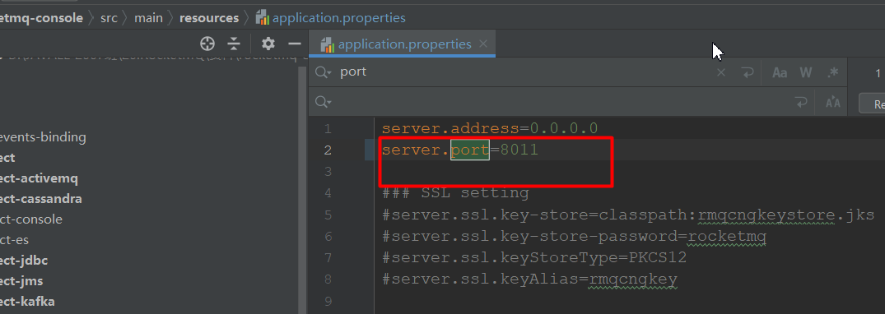

修改 NameServer 的地址（rocketmq-console > src > resources > application.properties）：

```properties
rocketmq.config.namesrvAddr=localhost:9876
```

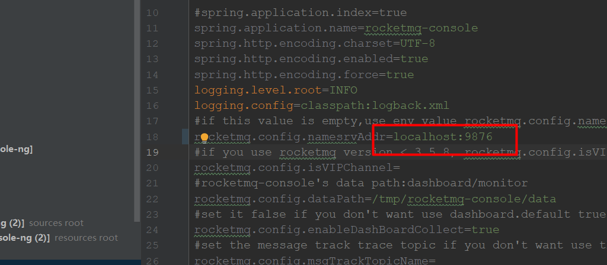

修改 RocketMQ 的 api 版本（rocketmq-console > pom.xml）：

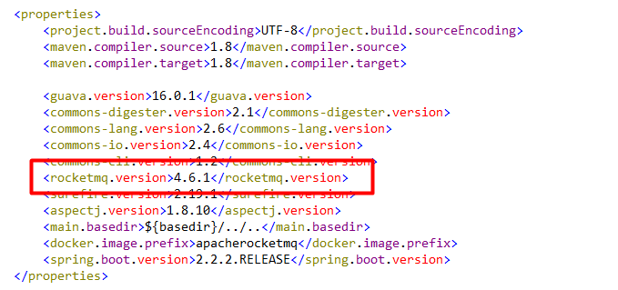

添加依赖：

```xml
<dependency>
    <groupId>commons-io</groupId>
    <artifactId>commons-io</artifactId>
    <version>2.4</version>
</dependency>
```

### 4.3 使用 maven 编译构建

```sh
mvn clean package -Dmaven.test.skip=true
```

### 4.4 懒人包

> [!TIP]
> 如果你不想做上面操作，直接使用资料里面已经打包好的懒人包，启动即可。

## 5. 消息收发

pom 依赖：

```xml
<!-- mq java客户端 -->
<dependency>
    <groupId>org.apache.rocketmq</groupId>
    <artifactId>rocketmq-client</artifactId>
    <version>4.6.1</version>
</dependency>
```

### 5.1 生产者-同步消息

三种发送方式的差异：

```text
同步：发送网络请求后会同步等待 Broker 服务器返回结果，支持发送失败重试，
      适用于比较重要的消息通知场景。
异步：异步发送网络请求，不会阻塞当前线程，支持失败重试，
      适用于对响应时间要求更高的场景。
单向：单向发送原理和异步一致，但不支持回调。适用于响应时间非常短、
      对可靠性要求不高的场景，例如日志收集。
```

可靠性同步发送方式使用得比较广泛，比如重要的消息通知、短信通知。注意：`send` 方法会阻塞线程。

发送消息的步骤：

```text
1. 创建消息生产者producer(DefaultMQProducer)，并指定生产者group
2. 指定Nameserver地址
3. 启动producer
4. 创建Message对象，指定主题Topic、消息体
5. 发送消息
6. 关闭生产者producer
```

```java
// 发送消息的步骤
// 1.创建消息生产者producer(DefaultMQProducer)，并指定生产者group
DefaultMQProducer producer = new DefaultMQProducer("test-group");
// 2.指定Nameserver地址
producer.setNamesrvAddr("127.0.0.1:9876");
// 3.启动producer
producer.start();
// 4.创建Message对象，指定主题Topic、消息体
Message message = new Message("test-topic", "test-tag", "你好 MQ!!".getBytes());

// 5.发送消息【同步消息：阻塞线程】
SendResult send = producer.send(message);
System.out.println(send);
// 6.关闭生产者producer
producer.shutdown();
```

### 5.2 生产者-异步消息

异步消息通常用在对响应时间敏感的业务场景，即发送端不能容忍长时间地等待 Broker 的响应。`send` 方法不阻塞线程，同时还可以异步处理发送结果，可以设置重试次数：

```java
// 发送消息的步骤
// 1.创建消息生产者producer(DefaultMQProducer)，并指定生产者group
DefaultMQProducer producer = new DefaultMQProducer("test-group");
// 2.指定Nameserver地址
producer.setNamesrvAddr("127.0.0.1:9876");
// 3.启动producer
producer.start();
// 4.创建Message对象，指定主题Topic、消息体
Message message = new Message("test-topic", "test-tag", "你好 MQ异步!!".getBytes());

// 5.发送消息【异步消息：不会阻塞线程】
producer.send(message, new SendCallback() {
    @Override
    public void onSuccess(SendResult sendResult) { // 发送成功
        System.out.println(sendResult);
        System.out.println("success");
        producer.shutdown();
    }

    @Override
    public void onException(Throwable throwable) { // 发送失败
        // 补偿逻辑
        System.out.println("fail");
    }
});
// 6.注意：异步发送时不能立即关闭producer，否则回调可能不执行
// producer.shutdown();
```

### 5.3 生产者-单向消息

这种方式主要用在**不特别关心发送结果**的场景，不关心消息是否发送成功，例如日志发送。`sendOneway` 方法不会阻塞线程：

```java
// 1.创建消息生产者producer(DefaultMQProducer)，并指定生产者group名称
DefaultMQProducer producer = new DefaultMQProducer("group");
// 2.指定Nameserver地址
producer.setNamesrvAddr("127.0.0.1:9876");
// 3.启动producer
producer.start();
// 4.创建Message对象，指定主题Topic、消息体
Message message = new Message("test-topic1", "test-tag1", "你好 MQ 单向".getBytes());
// 5.发送消息【单向消息】
// 设置mq消息发送的重试次数
producer.setRetryTimesWhenSendFailed(5);
producer.sendOneway(message);
```

### 5.4 消费者-集群模式

当有多个消费者同时监听某个 topic 时，**集群模式**只允许消息被消费一次，一条具体的消息不会被重复消费（默认行为）。

消费消息的步骤：

```text
1. 创建消费者Consumer(DefaultMQPushConsumer)，指定消费者组名
2. 指定Nameserver地址
3. 订阅(subscribe)主题Topic
4. 设置消费模式(MessageModel)，默认集群模式
5. 注册(register)回调函数，处理消息
6. 启动消费者
```

```java
public static void main(String[] args) throws Exception {
    // 1.创建消费者Consumer(DefaultMQPushConsumer)，指定消费者组名
    DefaultMQPushConsumer consumer = new DefaultMQPushConsumer("consumer-group1");
    // 2.指定Nameserver地址
    consumer.setNamesrvAddr("localhost:9876");
    // 3.订阅(subscribe)主题Topic
    consumer.subscribe("test-topic1", "test-tag1");
    // 4.设置消费模式(MessageModel)，默认集群模式
    consumer.setMessageModel(MessageModel.CLUSTERING);
    // 5.注册(register)回调函数，处理消息
    consumer.setConsumeMessageBatchMaxSize(2);
    consumer.registerMessageListener(new MessageListenerConcurrently() {
        public ConsumeConcurrentlyStatus consumeMessage(List<MessageExt> list, ConsumeConcurrentlyContext consumeConcurrentlyContext) {
            try {
                for (MessageExt messageExt : list) {
                    // 获取消息的topic
                    String topic = messageExt.getTopic();
                    // 获取消息的标签
                    String tags = messageExt.getTags();
                    // 获取消息内容
                    String content = new String(messageExt.getBody());
                    System.out.println("topic" + topic + "==tags" + tags + "==content" + content);
                }
            } catch (Exception e) {
                return ConsumeConcurrentlyStatus.RECONSUME_LATER;
            }

            return ConsumeConcurrentlyStatus.CONSUME_SUCCESS;
        }
    });
    // 6.启动消费者
    consumer.start();
}
```

### 5.5 消费者-广播模式

当有多个消费者同时监听某个 topic 时，**广播模式**下消息会被每个消费者同时消费：

```java
public static void main(String[] args) throws Exception {
    // 1.创建消费者Consumer(DefaultMQPushConsumer)，指定消费者组名
    DefaultMQPushConsumer consumer = new DefaultMQPushConsumer("consumer-group1");
    // 2.指定Nameserver地址
    consumer.setNamesrvAddr("localhost:9876");
    // 3.订阅(subscribe)主题Topic
    consumer.subscribe("test-topic1", "test-tag1");
    // 4.设置消费模式为广播模式
    consumer.setMessageModel(MessageModel.BROADCASTING);
    // 5.注册(register)回调函数，处理消息
    consumer.setConsumeMessageBatchMaxSize(2);
    consumer.registerMessageListener(new MessageListenerConcurrently() {
        public ConsumeConcurrentlyStatus consumeMessage(List<MessageExt> list, ConsumeConcurrentlyContext consumeConcurrentlyContext) {
            try {
                for (MessageExt messageExt : list) {
                    // 获取消息的topic
                    String topic = messageExt.getTopic();
                    // 获取消息的标签
                    String tags = messageExt.getTags();
                    // 获取消息内容
                    String content = new String(messageExt.getBody());
                    System.out.println("topic" + topic + "==tags" + tags + "==content" + content);
                }
            } catch (Exception e) {
                return ConsumeConcurrentlyStatus.RECONSUME_LATER;
            }

            return ConsumeConcurrentlyStatus.CONSUME_SUCCESS;
        }
    });
    // 6.启动消费者
    consumer.start();
}
```

> [!TIP]
> 集群模式与广播模式只差一处：`MessageModel.CLUSTERING`（默认）与 `MessageModel.BROADCASTING`。集群模式一组消费者分摊消息，广播模式每个消费者都收到全量消息。

## 6. 特殊场景

### 6.1 顺序消息

默认情况下，RocketMQ 是没法做到全局有序的，因为一个 topic 有多个 queue，如下图：

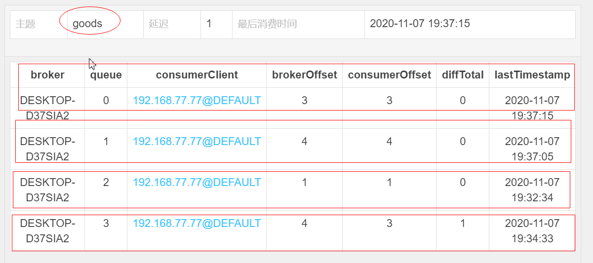

#### 6.1.1 演示 topic 全局无序

producer（普通发送，消息会被分散到多个 queue）：

```java
public static void main(String[] args) throws Exception {
    // 1.创建消息生产者DefaultMQProducer，并指定生产者group
    DefaultMQProducer producer = new DefaultMQProducer("producer-group-3");

    // 2.指定Nameserver地址
    producer.setNamesrvAddr("localhost:9876");
    // 3.启动producer
    producer.start();
    for (int i = 0; i < 100; i++) {
        // 4.构造消息对象
        Message message = new Message("test-topic3", "test-tag3", ("message" + i).getBytes());
        // 5.发送消息
        SendResult send = producer.send(message);
        System.out.println(send);
    }
    producer.shutdown();
}
```

consumer：

```java
public static void main(String[] args) throws Exception {
    // 1.创建消费者Consumer(DefaultMQPushConsumer)，指定消费者组名
    DefaultMQPushConsumer consumer = new DefaultMQPushConsumer("consumer-group3");
    // 2.指定Nameserver地址
    consumer.setNamesrvAddr("localhost:9876");
    // 3.订阅(subscribe)主题Topic
    consumer.subscribe("test-topic3", "test-tag3");
    // 4.设置消费模式(MessageModel)，默认负载均衡模式
    consumer.setMessageModel(MessageModel.CLUSTERING);
    // 5.注册(register)回调函数，处理消息
    consumer.registerMessageListener(new MessageListenerConcurrently() {
        public ConsumeConcurrentlyStatus consumeMessage(List<MessageExt> list, ConsumeConcurrentlyContext consumeConcurrentlyContext) {
            try {
                for (MessageExt messageExt : list) {
                    // 获取消息的topic
                    String topic = messageExt.getTopic();
                    // 获取消息的标签
                    String tags = messageExt.getTags();
                    // 获取消息内容
                    String content = new String(messageExt.getBody());
                    System.out.println("topic" + topic + "==tags" + tags + "==content" + content);
                }
            } catch (Exception e) {
                return ConsumeConcurrentlyStatus.RECONSUME_LATER;
            }

            return ConsumeConcurrentlyStatus.CONSUME_SUCCESS;
        }
    });
    // 6.启动消费者consumer
    consumer.start();
}
```

#### 6.1.2 实现全局有序

代码实现思路：保证一个 topic 只用一个 queue 即可，让消息都往一个 queue 发送。

producer（通过 `MessageQueueSelector` 指定 queue）：

```java
public static void main(String[] args) throws Exception {
    // 1.创建消息生产者DefaultMQProducer，并指定生产者group
    DefaultMQProducer producer = new DefaultMQProducer("producer-group-4");

    // 2.指定Nameserver地址
    producer.setNamesrvAddr("localhost:9876");
    // 3.启动producer
    producer.start();
    for (int i = 0; i < 100; i++) {
        // 4.构造消息对象
        Message message = new Message("test-topic4", "test-tag4", ("message" + i).getBytes());
        // 5.发送消息：第三个参数0表示选择list中的第0个queue，所有消息进同一个queue
        SendResult send = producer.send(message, new MessageQueueSelector() {
            public MessageQueue select(List<MessageQueue> list, Message message, Object o) {
                int index = (Integer) o;
                return list.get(index);
            }
        }, 0);
        System.out.println(send);
    }
    producer.shutdown();
}
```

consumer（用 `MessageListenerOrderly` 单线程顺序消费）：

```java
public static void main(String[] args) throws Exception {
    // 1.创建消费者Consumer(DefaultMQPushConsumer)，指定消费者组名
    DefaultMQPushConsumer consumer = new DefaultMQPushConsumer("consumer-group4");
    // 2.指定Nameserver地址
    consumer.setNamesrvAddr("localhost:9876");
    // 3.订阅(subscribe)主题Topic
    consumer.subscribe("test-topic4", "test-tag4");
    // 4.设置消费模式(MessageModel)，默认负载均衡模式
    consumer.setMessageModel(MessageModel.CLUSTERING);
    // 5.注册(register)顺序消费回调函数
    consumer.registerMessageListener(new MessageListenerOrderly() {

        public ConsumeOrderlyStatus consumeMessage(List<MessageExt> list, ConsumeOrderlyContext consumeOrderlyContext) {
            try {
                for (MessageExt messageExt : list) {
                    // 获取消息的topic
                    String topic = messageExt.getTopic();
                    // 获取消息的标签
                    String tags = messageExt.getTags();
                    // 获取消息内容
                    String content = new String(messageExt.getBody());
                    System.out.println("topic" + topic + "==tags" + tags + "==content" + content);
                }
            } catch (Exception e) {
                return ConsumeOrderlyStatus.SUSPEND_CURRENT_QUEUE_A_MOMENT;
            }

            return ConsumeOrderlyStatus.SUCCESS;
        }
    });
    // 6.启动消费者consumer
    consumer.start();
}
```

#### 6.1.3 分区有序

全局有序把所有消息都压进一个 queue，牺牲了并行度。更常用的做法是**分区有序**：把同一业务分组的消息发到同一个 queue（例如按订单 ID、按省份分区），同组内消息有序，不同分组之间并行消费。

例如订单消息按发货省份分区：湖南省的订单消息固定发往某个 queue，湖北省的订单消息固定发往另一个 queue，每个省内部保证下单、付款、发货的处理顺序即可。

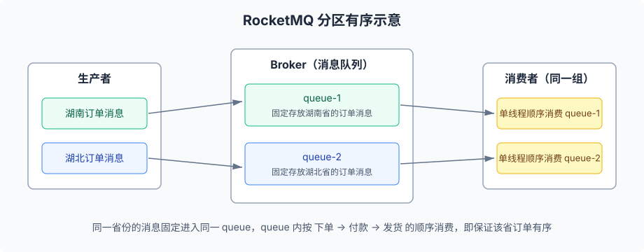

### 6.2 延时消息

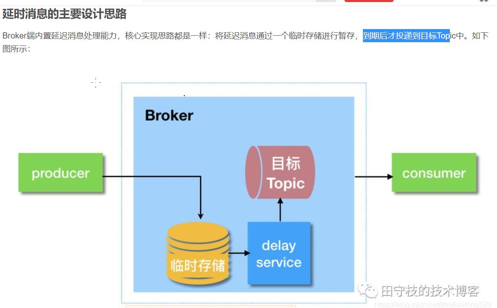

应用场景：比如电商里，提交了一个订单就可以发送一个延时消息，1h 后去检查这个订单的状态，如果还是未付款就取消订单释放库存。

producer（关键在 `message.setDelayTimeLevel(3)`）：

```java
public static void main(String[] args) throws Exception {
    // 1.创建消息生产者producer(DefaultMQProducer)，并指定生产者group
    DefaultMQProducer producer = new DefaultMQProducer("producer-group-5");
    // 2.指定Nameserver地址
    producer.setNamesrvAddr("localhost:9876");
    // 3.启动producer
    producer.start();
    // 4.创建Message对象，指定主题Topic、消息体
    Message message = new Message("test-topic5", "test-tag5"/*用于消息过滤*/, "你好 mq".getBytes());
    // 延时级别默认为：messageDelayLevel=1s 5s 10s 30s 1m 2m 3m 4m 5m 6m 7m 8m 9m 10m 20m 30m 1h 2h
    // 级别从1开始，setDelayTimeLevel(3) 即延时10秒
    message.setDelayTimeLevel(3);
    // 5.发送消息
    SendResult send = producer.send(message);
    System.out.println(send);
    // 6.关闭生产者producer
    producer.shutdown();
}
```

consumer（验证消费时间：消费时间 - 消息的存储时间 应大于等于延时时长）：

```java
public static void main(String[] args) throws Exception {
    // 1.创建消费者Consumer(DefaultMQPushConsumer)，指定消费者组名
    DefaultMQPushConsumer consumer = new DefaultMQPushConsumer("consumer-group5");
    // 2.指定Nameserver地址
    consumer.setNamesrvAddr("localhost:9876");
    // 3.订阅(subscribe)主题Topic
    consumer.subscribe("test-topic5", "test-tag5");
    // 4.设置消费模式(MessageModel)，默认集群模式
    consumer.setMessageModel(MessageModel.BROADCASTING);
    // 5.注册(register)回调函数，处理消息
    consumer.setConsumeMessageBatchMaxSize(2);
    consumer.registerMessageListener(new MessageListenerConcurrently() {
        public ConsumeConcurrentlyStatus consumeMessage(List<MessageExt> list, ConsumeConcurrentlyContext consumeConcurrentlyContext) {
            try {
                for (MessageExt messageExt : list) {
                    // 获取消息的topic
                    String topic = messageExt.getTopic();
                    // 获取消息的标签
                    String tags = messageExt.getTags();
                    // 获取消息内容
                    String content = new String(messageExt.getBody());
                    System.out.println("topic" + topic + "==tags" + tags + "==content" + content);
                    // 打印演示消费的时间：消费时间 - 消息存储时间
                    System.out.println(System.currentTimeMillis() - messageExt.getStoreTimestamp());
                }
            } catch (Exception e) {
                return ConsumeConcurrentlyStatus.RECONSUME_LATER;
            }

            return ConsumeConcurrentlyStatus.CONSUME_SUCCESS;
        }
    });
    // 6.启动消费者
    consumer.start();
}
```

## 7. 重试队列

RocketMQ 消费端默认有重试机制。

消费端重试分为两种情况：

1. **异常重试**：由于 Consumer 端逻辑出现了异常，导致返回了 `RECONSUME_LATER` 状态，那么 Broker 就会在一段时间后尝试重试；
2. **超时重试**：如果 Consumer 端处理时间过长，或者由于某些原因线程挂起，导致迟迟没有返回消费状态，Broker 就会认为 Consumer 消费超时，此时会发起超时重试。

**重试队列名称为**：`%RETRY%+consumergroup`。

**设置重试时间与次数：** 可在 broker.conf 文件中配置 Consumer 端的重试次数和重试时间间隔：

```properties
messageDelayLevel=1s 5s 10s 30s 1m 2m 3m 4m 5m 6m 7m 8m 9m 10m 20m 30m 1h 2h
```

异常重试演示（故意抛异常模拟消费失败）：

```java
public static void main(String[] args) throws Exception {
    // 1.创建消费者Consumer(DefaultMQPushConsumer)，指定消费者组名
    DefaultMQPushConsumer consumer = new DefaultMQPushConsumer("consumer-group1");
    // 2.指定Nameserver地址
    consumer.setNamesrvAddr("localhost:9876");
    // 3.订阅(subscribe)主题Topic
    consumer.subscribe("test-topic1", "test-tag1");
    // 4.设置消费模式(MessageModel)，默认集群模式
    consumer.setMessageModel(MessageModel.CLUSTERING);
    // 5.注册(register)回调函数，处理消息
    consumer.setConsumeMessageBatchMaxSize(2);
    consumer.registerMessageListener(new MessageListenerConcurrently() {
        public ConsumeConcurrentlyStatus consumeMessage(List<MessageExt> list, ConsumeConcurrentlyContext consumeConcurrentlyContext) {
            try {
                // 故意制造异常，模拟消费失败，触发Broker重试
                int i = 10 / 0;
                for (MessageExt messageExt : list) {
                    // 获取消息的topic
                    String topic = messageExt.getTopic();
                    // 获取消息的标签
                    String tags = messageExt.getTags();
                    // 获取消息内容
                    String content = new String(messageExt.getBody());
                    System.out.println("topic" + topic + "==tags" + tags + "==content" + content);
                }
                return ConsumeConcurrentlyStatus.CONSUME_SUCCESS;
            } catch (Exception e) {
                e.printStackTrace();
                return ConsumeConcurrentlyStatus.RECONSUME_LATER;
            }
        }
    });
    // 6.启动消费者
    consumer.start();
}
```

> [!WARNING]
> 注意1：只有在消息模式为 `MessageModel.CLUSTERING` 集群模式时，Broker 才会自动进行重试，广播消息是不会重试的。
>
> 注意2：由于 MQ 的重试机制，难免会引起消息的重复消费问题。比如一个 ConsumerGroup 中有两个消费者 Consumer1 和 Consumer2，以集群方式消费。假设一条消息发往 ConsumerGroup，由 Consumer1 消费，但是由于 Consumer1 消费过慢导致超时，如果 Broker 将消息发送给 Consumer2 去消费，这样就产生了重复消费问题。因此，使用 MQ 时应该对一些关键消息进行幂等去重的处理。

## 8. 死信队列

当一条消息初次消费失败，消息队列 RocketMQ 版会自动进行消息重试；达到最大重试次数后，若消费依然失败，则表明消费者在正常情况下无法正确地消费该消息。此时，消息队列 RocketMQ 版不会立刻将消息丢弃，而是将其发送到该消费者对应的特殊队列中。

在消息队列 RocketMQ 版中，这种正常情况下无法被消费的消息称为**死信消息**（Dead-Letter Message），存储死信消息的特殊队列称为**死信队列**（Dead-Letter Queue）。

死信消息具有以下特性：

1. 不会再被消费者正常消费；
2. 有效期与正常消息相同，均为 3 天，3 天后会被自动删除。因此，请在死信消息产生后的 3 天内及时处理。

死信队列具有以下特性：

1. 一个死信队列对应一个 Group ID，而不是对应单个消费者实例；
2. 如果一个 Group ID 未产生死信消息，消息队列 RocketMQ 版不会为其创建相应的死信队列；
3. 一个死信队列包含了对应 Group ID 产生的所有死信消息，不论该消息属于哪个 Topic；
4. 消息队列 RocketMQ 版控制台提供对死信消息的查询、重发的功能。

## 9. SpringBoot 整合 RocketMQ

### 9.1 起步依赖

```xml
<dependency>
    <groupId>org.apache.rocketmq</groupId>
    <artifactId>rocketmq-spring-boot-starter</artifactId>
    <!-- 2.1.0对应的mq是4.6.x -->
    <version>2.1.0</version>
</dependency>
```

### 9.2 配置

在 application.properties 里面配置：

```properties
# 必须配置
# 指定nameServer
rocketmq.name-server=127.0.0.1:9876
# 指定发送者组名
rocketmq.producer.group=wfx-goods-producer

# 其他可选配置
# 发送消息超时时间，单位：毫秒。默认为 3000
rocketmq.producer.send-message-timeout=3000
# 消息压缩阀值，当消息体的大小超过该阀值后，进行消息压缩。默认为 4 * 1024B
rocketmq.producer.compress-message-body-threshold=4096
# 消息体的最大允许大小。默认为 4 * 1024 * 1024B
rocketmq.producer.max-message-size=4194304
# 发送消息给 Broker 时，如果发送失败，是否重试另外一台 Broker。默认为 false
rocketmq.producer.retry-next-server=false
# 同步发送消息时，失败重试次数。默认为 2 次
rocketmq.producer.retry-times-when-send-failed=2
# 异步发送消息时，失败重试次数。默认为 2 次
rocketmq.producer.retry-times-when-send-async-failed=2
```

### 9.3 发布消息

```java
package com.mq;

import org.apache.rocketmq.client.producer.SendCallback;
import org.apache.rocketmq.client.producer.SendResult;
import org.apache.rocketmq.spring.core.RocketMQTemplate;
import org.springframework.beans.factory.annotation.Autowired;
import org.springframework.messaging.support.MessageBuilder;
import org.springframework.web.bind.annotation.GetMapping;
import org.springframework.web.bind.annotation.RequestMapping;
import org.springframework.web.bind.annotation.RestController;

/**
 * <p>title: com.mq</p>
 * author zhuximing
 * description:
 */
@RestController
public class IndexController {

    @Autowired
    private RocketMQTemplate rocketMQTemplate;

    @RequestMapping("syncSend")
    public SendResult syncSend() {
        // 同步发送消息，目的地格式为 "topic:tag"
        return rocketMQTemplate.syncSend("test-topic1:test-tag1", "你好mq");
    }

    @RequestMapping("asyncSend")
    public void asyncSend() {
        // 异步发送消息
        rocketMQTemplate.asyncSend("test-topic2:test-tag2", "asyncSend", new SendCallback() {
            public void onSuccess(SendResult sendResult) {
                System.out.println(sendResult);
            }

            public void onException(Throwable throwable) {
                throwable.printStackTrace();
            }
        });
    }

    @RequestMapping("onewaySend")
    public void onewaySend() {
        // oneway 发送消息
        rocketMQTemplate.sendOneWay("test-topic3:test-tag3", "oneway");
    }

    @GetMapping("delay")
    public String delay() {
        // 延时消息：timeout为2000毫秒，延时级别2（对应5秒）
        rocketMQTemplate.syncSend("test-topic4:test-tag4", MessageBuilder.withPayload("delay").build(), 2000, 2);

        return "delay";
    }
}
```

### 9.4 监听消息

```java
package com.qf.listener;

import org.apache.rocketmq.spring.annotation.ConsumeMode;
import org.apache.rocketmq.spring.annotation.MessageModel;
import org.apache.rocketmq.spring.annotation.RocketMQMessageListener;
import org.apache.rocketmq.spring.core.RocketMQListener;
import org.springframework.stereotype.Component;

@Component
@RocketMQMessageListener(consumerGroup = "test-consumer-group-8",
    topic = "test-topic8", selectorExpression = "test-tag8",
    consumeMode = ConsumeMode.CONCURRENTLY,
    messageModel = MessageModel.CLUSTERING)
public class ConsumerListener implements RocketMQListener<String> {

    public void onMessage(String msg) {
        System.out.println(msg);
    }
}
```

## 10. 项目中使用 RocketMQ

应用场景：维护数据库与索引库的一致性——商品服务（fengmi-goods）改动商品后发消息，搜索服务（fengmi-search）监听消息同步索引库。

### 10.1 fengmi-goods 发消息

pom 依赖：

```xml
<dependency>
    <groupId>org.apache.rocketmq</groupId>
    <artifactId>rocketmq-spring-boot-starter</artifactId>
    <!-- 2.1.0对应的mq是4.6.x -->
    <version>2.1.0</version>
</dependency>
```

配置（与 9.2 相同，必须配置 nameServer 与生产者组名）：

```properties
# 必须配置
# 指定nameServer
rocketmq.name-server=127.0.0.1:9876
# 指定发送者组名
rocketmq.producer.group=wfx-goods-producer

# 其他可选配置
# 发送消息超时时间，单位：毫秒。默认为 3000
rocketmq.producer.send-message-timeout=3000
# 消息压缩阀值，当消息体的大小超过该阀值后，进行消息压缩。默认为 4 * 1024B
rocketmq.producer.compress-message-body-threshold=4096
# 消息体的最大允许大小。默认为 4 * 1024 * 1024B
rocketmq.producer.max-message-size=4194304
# 发送消息给 Broker 时，如果发送失败，是否重试另外一台 Broker。默认为 false
rocketmq.producer.retry-next-server=false
# 同步发送消息时，失败重试次数。默认为 2 次
rocketmq.producer.retry-times-when-send-failed=2
# 异步发送消息时，失败重试次数。默认为 2 次
rocketmq.producer.retry-times-when-send-async-failed=2
```

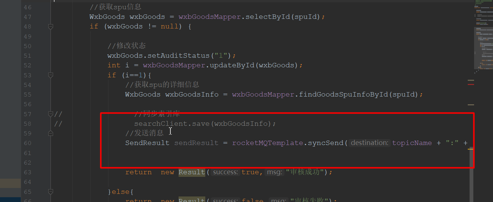

### 10.2 fengmi-search 监听消息

pom 依赖（同 10.1）：

```xml
<dependency>
    <groupId>org.apache.rocketmq</groupId>
    <artifactId>rocketmq-spring-boot-starter</artifactId>
    <!-- 2.1.0对应的mq是4.6.x -->
    <version>2.1.0</version>
</dependency>
```

配置（消费端只需配置 nameServer）：

```properties
rocketmq.name-server=127.0.0.1:9876
```

```java
package com.wfx.listener;

import com.wfx.entity.WxbGoods;
import com.wfx.service.ISearchService;
import org.apache.rocketmq.spring.annotation.ConsumeMode;
import org.apache.rocketmq.spring.annotation.MessageModel;
import org.apache.rocketmq.spring.annotation.RocketMQMessageListener;
import org.apache.rocketmq.spring.core.RocketMQListener;
import org.springframework.beans.factory.annotation.Autowired;
import org.springframework.stereotype.Service;

@Service
@RocketMQMessageListener(consumerGroup = "wfx-search-consumer",
    topic = "goods-2-es", selectorExpression = "es-tag",
    consumeMode = ConsumeMode.CONCURRENTLY,
    messageModel = MessageModel.CLUSTERING)
public class EsListener implements RocketMQListener<WxbGoods> {

    @Autowired
    private ISearchService iSearchService;

    public void onMessage(WxbGoods goods) {
        // 同步索引库
        iSearchService.save(goods);
    }
}
```

## 11. 面试题

**面试题：消息发送怎么解决 0 丢失的问题？**

答：RocketMQ 发送消息默认是有重试机制，发送失败默认重试 2 次：

```java
producer.setRetryTimesWhenSendFailed(2);
producer.setRetryTimesWhenSendAsyncFailed(2);
```

- **同步消息**：发送失败可以重试，而且可以实现 broker 失败隔离（如果 broker 不可用，尝试另外一个 broker 进行消息的重发）；
- **异步消息**：异步消息发送失败也会重试，但不会选择其他 broker 重试，仅在一个 broker 上重试，存在消息丢失的可能。补偿做法是在 `onException` 回调里把消息存储下来（如写入 Redis，key 为 `goods2es`，field 为 goodsId，value 为消息体），后续人工或定时任务补偿重发；

  ```java
  rocketMQTemplate.asyncSend("goodsToElasticsearch:goods", mallGoods, new SendCallback() {
      @Override
      public void onSuccess(SendResult sendResult) {
          sendRes[0] = true;
      }

      @Override
      public void onException(Throwable throwable) {
          // 将消息做一个存储（Redis），后续补偿重发
      }
  });
  ```

- **单向消息**：不会重试。

**面试题：怎么保证消息消费的时候 0 丢失？**

答：RocketMQ 默认就有重试机制，如果第一次消费的时候，Broker 收到的回应是 `ConsumeConcurrentlyStatus.RECONSUME_LATER`，那么这条消息不会丢失，会进入重试队列；重试的次数与重试的时间可以配置，如果重试的次数超过配置的次数，那么这条消息也没有丢失，而是放入死信队列。

**面试题：RocketMQ 是全局有序的吗？如果不是怎么做到全局有序？**

答：默认一个 topic 有 4 个 queue，只能做到每个 queue 的局部有序，不能做到全局有序。如果要做到全局有序，可以将消息发送到一个指定的 queue 里面（配合 `MessageListenerOrderly` 顺序消费）。

**面试题：怎么解决消费幂等问题？**

什么是消息的消费幂等：同一个消息，同样一个处理逻辑被成功地处理多次。

答：处理办法：幂等令牌、唯一性处理（如利用业务唯一 ID 去重）。

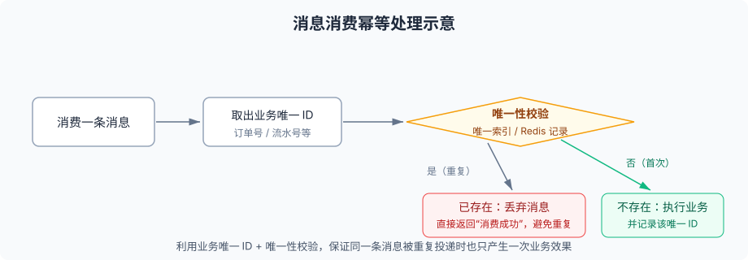

## 12. 小结

- MQ 的三大价值：**异步处理、应用解耦、流量消峰**；
- RocketMQ 两大进程：**NameServer**（路由注册与发现）与 **Broker**（消息存储与消费位点管理）；
- 发送方式三种：**同步**（阻塞、可靠）、**异步**（回调、不阻塞）、**单向**（不关心结果）；
- 消费模式两种：**集群**（分摊消费，默认）与**广播**（每个消费者都消费）；
- 顺序消息靠"一个业务分组一个 queue + MessageListenerOrderly"，延时消息靠 `setDelayTimeLevel`；
- 消费端自带重试（异常重试、超时重试），超过次数进入**死信队列**，并因此引入**幂等**问题；
- SpringBoot 中用 `rocketmq-spring-boot-starter`，生产端 `RocketMQTemplate`，消费端 `@RocketMQMessageListener`。
