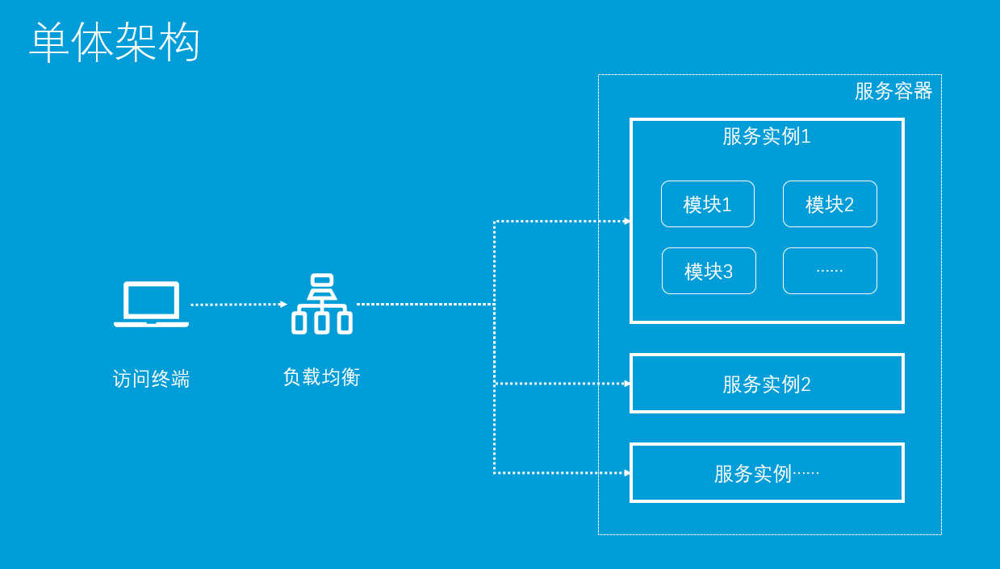

目前企业的流行技术还是以SpringCloud alibaba为主

低代码开发平台，项目型企业的原则：效率优先 

 若依  jeecgboot  任务调度：xxljob  Elastic-Job


# 一：微服务架构

## 1.0：单体架构

> 将项目所有模块（功能）打成jar或者war，然后部署一个进程




   	

```txt
优点：
1：部署简单: 由于是完整的结构体，可以直接部署在一个服务器上即可。
2：技术单一: 项目不需要复杂的技术栈，往往一套熟悉的技术栈就可以完成开发。
3：用人成本低: 单个程序员可以完成业务接口到数据库的整个流程。

缺点：
1：系统启动慢， 一个进程包含了所有的业务逻辑，涉及到的启动模块过多，导致系统的启动、重启时间周期过长;
2：系统错误隔离性差、可用性差，任何一个模块的错误均可能造成整个系统的宕机;
3：可伸缩性差：系统的扩容只能只对这个应用进行扩容，无法结合业务模块的特点进行伸缩。
4：线上问题修复周期长：任何一个线上问题修复需要对整个应用系统进行全面升级。
5. 跨语言程度差
6. 不利于安全管理，所有开发人员都拥有全量代码   代码管理工具: git svn 
                                          码云  github   华为云Devcloud

运营平台，传统项目，访问量不大  采用单体架构

```


## 1.1：微服务架构

微服务架构论文：https://martinfowler.com/articles/microservices.html

译文：https://mp.weixin.qq.com/s?__biz=MjM5MjEwNTEzOQ==&mid=401500724&idx=1&sn=4e42fa2ffcd5732ae044fe6a387a1cc3#rd

```txt
In short, the microservice architectural style [1] is an approach to developing a single application as a suite of small services, each running in its own process and communicating with lightweight mechanisms（ 美 ['mekə,nɪzəm]  机制）, often an HTTP resource API. These services are built around business capabilities and independently deployable by fully automated deployment machinery. There is a bare minimum of centralized management of these services, which may be written in different programming languages and use different data storage technologies.

简而言之，微服务架构风格[1]这种开发方法，是以开发一组小型服务的方式来开发一个独立的应用系统的。其中每个小型服务都运行在自己的进程中，并经常采用HTTP资源API这样轻量的机制来相互通信。这些服务围绕业务功能进行构建，并能通过全自动的部署机制来进行独立部署。这些微服务可以使用不同的语言来编写，并且可以使用不同的数据存储技术。对这些微服务我们仅做最低限度的集中管理。
```

**解读微服务特点:**

1:微服务是一种项目架构思想(风格)       SpringCloud   netflix /alibaba    (dubbo +zoomkper ) 

2微服务架构是一系列小服务的组合（组件化与多服务）

3:任何一个微服务，都是一个独立的进程（独立开发、独立维护、独立部署）

4:轻量级通信http协议(跨语言,跨平台)  --   通信

5:服务粒度(围绕业务功能拆分)

6:去中心化管理(去中心化”地治理技术、去中心化地管理数据)   --eureka / nacos

## 1.2：微服务架构的优势

**1.易于开发和维护**
 一个微服务只关注一个特定的业务功能，所以它的业务清晰、代码量较少。开发和维护单个微服务相对比较简单，整个应用是由若干个微服务构建而成，所以整个应用也会维持在可控状态；

**2.单个微服务启动较快**
 单个微服务代码量较少，所以启动会比较快；

**3.局部修改容易部署**
 单体应用只要有修改，就要重新部署整个应用，微服务解决了这样的问题。一般来说，对某个微服务进行修改，只需要重新部署这个服务即可；

**4.技术栈不受限**
 在微服务中，我们可以结合项目业务及团队的特点，合理地选择技术栈     

**5.按需伸缩**

  java     go 

  jvm 