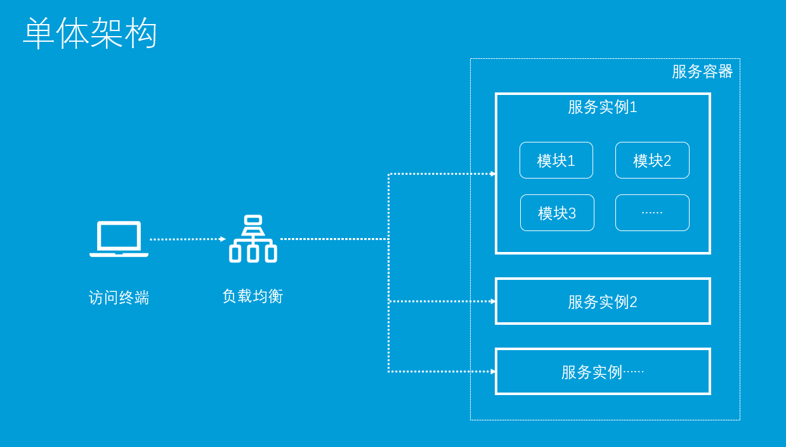

# 微服务架构演变

目前企业的流行技术还是以 SpringCloud Alibaba 为主。另外，低代码开发平台在项目型企业中很受欢迎，这类企业的原则是**效率优先**，代表产品有若依（RuoYi）、JeecgBoot 等；任务调度领域常用的则是 XXL-JOB、Elastic-Job。

本篇先从架构演变的视角出发，对比单体架构与微服务架构，理解为什么要引入微服务，为后续学习 SpringCloud 各组件打好认知基础。

## 1. 单体架构

**定义**：将项目所有模块（功能）打成一个 jar 或 war 包，然后部署在一个进程中运行。



### 1.1 单体架构的优缺点

| 维度 | 说明 |
| --- | --- |
| 部署简单 | 由于是完整的结构体，直接部署到一台服务器上即可 |
| 技术单一 | 项目不需要复杂的技术栈，往往一套熟悉的技术栈就可以完成开发 |
| 用人成本低 | 单个程序员可以完成从业务接口到数据库的整个流程 |

| 缺点 | 说明 |
| --- | --- |
| 系统启动慢 | 一个进程包含了所有的业务逻辑，涉及的启动模块过多，导致系统的启动、重启时间过长 |
| 错误隔离性差、可用性差 | 任何一个模块的错误都可能造成整个系统宕机 |
| 可伸缩性差 | 系统扩容只能对整个应用进行扩容，无法结合业务模块的特点进行伸缩 |
| 线上问题修复周期长 | 任何一个线上问题的修复都需要对整个应用系统进行全面升级 |
| 跨语言程度差 | 整个应用绑定在一门语言上 |
| 不利于安全管理 | 所有开发人员都拥有全量代码，需要依赖 Git、SVN 等代码管理工具（码云、GitHub、华为云 DevCloud 等）配合权限控制 |

> [!NOTE]
> 单体架构并非一无是处：对于运营平台、传统企业项目这类访问量不大的场景，采用单体架构反而是最经济的选择，不必为了微服务而微服务。

## 2. 微服务架构

### 2.1 什么是微服务架构

微服务架构的思想来自 Martin Fowler 的经典论文：

- 英文原文：<https://martinfowler.com/articles/microservices.html>
- 中文译文：<https://mp.weixin.qq.com/s?__biz=MjM5MjEwNTEzOQ==&mid=401500724&idx=1&sn=4e42fa2ffcd5732ae044fe6a387a1cc3#rd>

论文中对微服务架构风格的一段定义（附译文）：

```text
In short, the microservice architectural style is an approach to developing a single
application as a suite of small services, each running in its own process and
communicating with lightweight mechanisms, often an HTTP resource API. These services
are built around business capabilities and independently deployable by fully automated
deployment machinery. There is a bare minimum of centralized management of these
services, which may be written in different programming languages and use different
data storage technologies.

简而言之，微服务架构风格这种开发方法，是以开发一组小型服务的方式来开发一个独立的应用系统的。
其中每个小型服务都运行在自己的进程中，并经常采用 HTTP 资源 API 这样轻量的机制来相互通信。
这些服务围绕业务功能进行构建，并能通过全自动的部署机制来进行独立部署。这些微服务可以使用
不同的语言来编写，并且可以使用不同的数据存储技术。对这些微服务我们仅做最低限度的集中管理。
```

### 2.2 微服务的特点

结合上面的定义，可以把微服务的特点解读为以下几点：

1. **微服务是一种项目架构思想（风格）**，落地框架有 SpringCloud（Netflix / Alibaba 系）以及 Dubbo + Zookeeper 等；
2. **微服务架构是一系列小服务的组合**，体现组件化与多服务的思想；
3. **任何一个微服务都是一个独立的进程**，做到独立开发、独立维护、独立部署；
4. **轻量级通信**：服务之间通常通过 HTTP 协议（如 REST 风格接口）通信，天然跨语言、跨平台；
5. **服务粒度围绕业务功能拆分**，一个服务只负责一块业务能力；
6. **去中心化管理**：技术选型去中心化（每个服务可以独立选型），数据管理也去中心化（每个服务可以有自己的数据库），服务注册与发现则交给 Eureka、Nacos 这类组件。

## 3. 微服务架构的优势

| 优势 | 说明 |
| --- | --- |
| 易于开发和维护 | 一个微服务只关注一个特定的业务功能，业务清晰、代码量较少，开发和维护单个微服务相对简单；整个应用由若干个微服务构建而成，整体规模保持在可控状态 |
| 单个微服务启动较快 | 单个微服务代码量较少，所以启动会比较快 |
| 局部修改容易部署 | 单体应用只要有修改就要重新部署整个应用，而微服务对某个服务进行修改后，只需要重新部署这一个服务即可 |
| 技术栈不受限 | 可以结合项目业务及团队的特点，合理地为每个服务选择技术栈 |
| 按需伸缩 | 哪个服务压力大就扩容哪个服务，不同服务还可以用不同语言实现（如 Java、Go），充分利用 JVM 之外的生态 |

## 4. 小结

- 单体架构：部署简单、成本低，但启动慢、隔离性差、伸缩性差，适合访问量不大的传统项目；
- 微服务架构：按业务拆分成一组独立进程的小服务，通过 HTTP 轻量通信、独立部署、按需伸缩，是当前主流，但同时也带来了分布式复杂度，需要 SpringCloud 这一套组件来支撑；
- 后续章节将围绕 SpringCloud Alibaba 展开：Nacos（注册中心与配置中心）、Gateway（网关）、Sentinel（流控降级）、Seata（分布式事务）、Sleuth（链路追踪）等。
