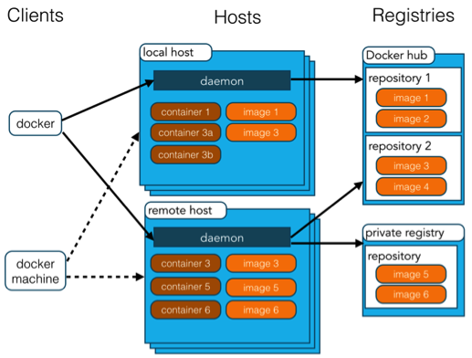
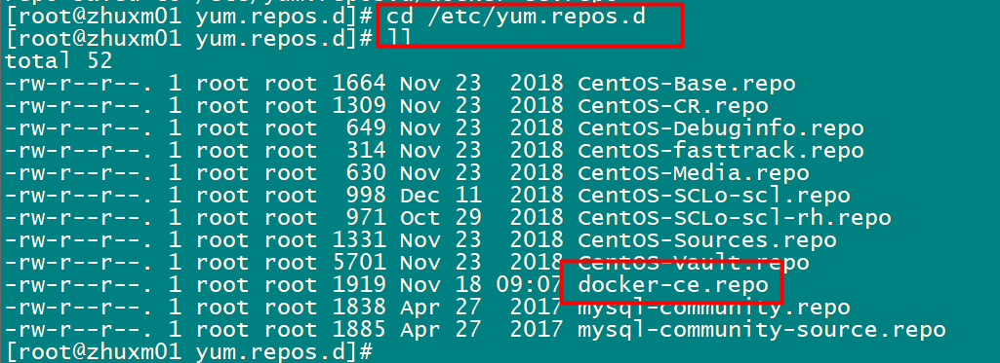
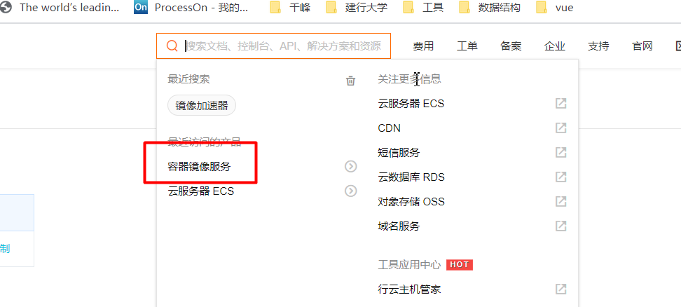
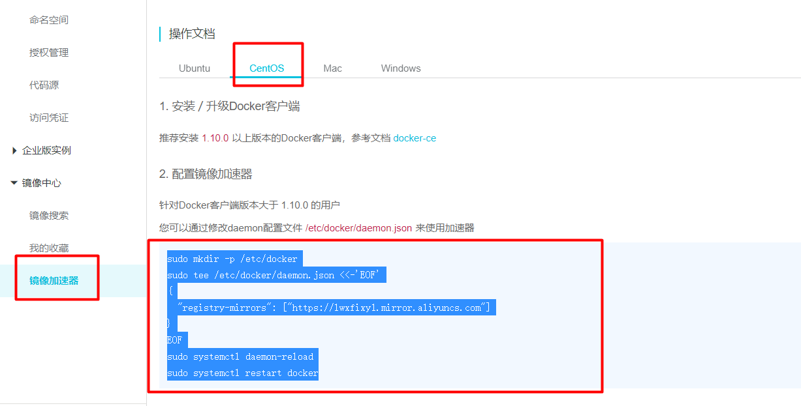
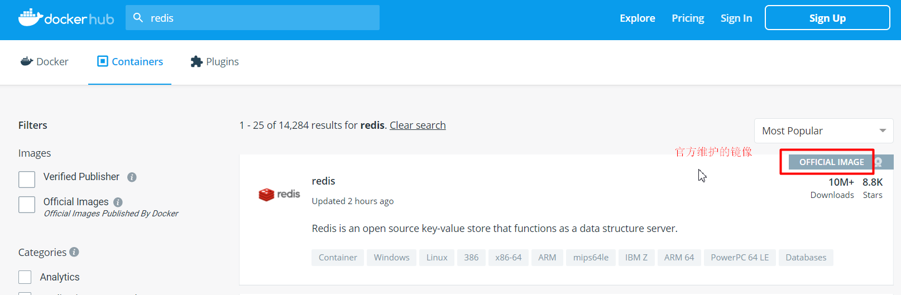
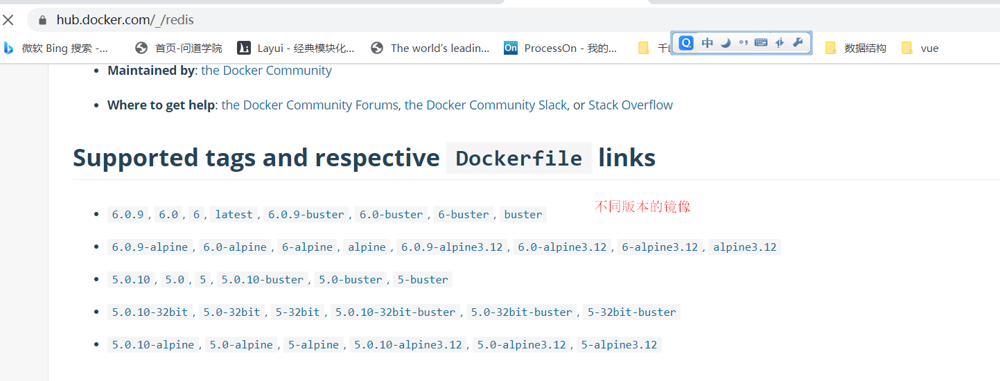
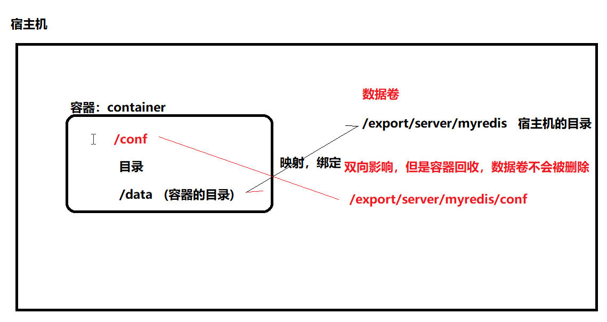

# Docker

## 1. Docker 介绍

### 1.1 DevOps 中存在的问题

在 Docker 出现之前，开发和运维的协作中经常遇到以下痛点：

1. **环境不一致，导致"水土不服"**。开发环境用的是 JDK 1.8，而发布服务器的 JDK 版本是 1.7；比如开发用 JDK 1.8 配 Tomcat 8.5，发布环境换成 Tomcat 10 就可能出问题。
2. **多用户的操作系统相互不能隔离，会相互影响**。一台服务器如果部署多个应用程序，当某个程序运行出问题时会牵连其他服务；多个程序部署在同一个 Tomcat 上时，Tomcat 默认最大并发为 150，某个系统把并发占满了，其他系统就会卡顿。
3. **做活动需要快速搭建服务集群时，传统方式效率低**。一个大型项目由多个模块实现，逐个打包、逐台更换非常繁琐。
4. **安装 Redis、Nginx 等服务太繁琐**。手工搭建一套 Java 项目运行环境（JDK、MySQL、Redis、Tomcat、Nginx），至少要半天时间。

### 1.2 Docker 的思想

Docker 用三个核心思想解决了上面的问题：

1. **集装箱**：将应用程序连同其运行环境整体打包成一个"集装箱"（如 JDK 1.8 + 项目代码、Nginx + GCC + 依赖库），镜像就是集装箱的模板，据此创建容器。谁需要这个应用，直接把整个箱子拿过去即可。
2. **标准化**：运输的标准化、命令的标准化，即下载镜像、创建容器的方式都是统一的。
3. **隔离性**：Docker 基于 Linux 内核单独开辟一块空间来部署运行应用服务，各容器之间互不影响。

## 2. Docker 架构与核心概念

### 2.1 架构图



### 2.2 相关概念

Docker 包括三个基本概念：

| 概念 | 说明 |
| --- | --- |
| 仓库（Repository） | 可看成一个代码控制中心，用来保存镜像，如 Docker Hub |
| 镜像（Image） | 相当于是一个 root 文件系统。比如官方镜像 `ubuntu:16.04` 就包含了完整的一套 Ubuntu 16.04 最小系统的 root 文件系统 |
| 容器（Container） | 镜像和容器的关系，就像面向对象程序设计中的类和实例一样：镜像是静态的定义，容器是镜像运行时的实体。容器可以被创建、启动、停止、删除、暂停等 |

Docker 使用**客户端-服务器（C/S）架构**模式，通过远程 API 来管理和创建 Docker 容器；Docker 容器通过 Docker 镜像来创建，容器与镜像的关系类似于面向对象编程中的**对象与类**。

## 3. Docker 安装

Docker 官网：<https://www.docker.com/>

Docker CE（社区免费版）的安装请参考官方文档：

- MacOS：<https://docs.docker.com/docker-for-mac/install/>
- Windows：<https://docs.docker.com/docker-for-windows/install/>
- Ubuntu：<https://docs.docker.com/install/linux/docker-ce/ubuntu/>
- Debian：<https://docs.docker.com/install/linux/docker-ce/debian/>
- CentOS 7：<https://docs.docker.com/install/linux/docker-ce/centos/>（CentOS 7 以下版本兼容性差）
- Fedora：<https://docs.docker.com/install/linux/docker-ce/fedora/>
- 其他 Linux 发行版：<https://docs.docker.com/install/linux/docker-ce/binaries/>

下面以 CentOS 7 为例演示安装步骤。

### 3.1 第一步：设置 Docker 的 yum 源

```sh
# yum-utils 提供 yum-config-manager 功能
yum install -y yum-utils
yum-config-manager \
    --add-repo \
    https://download.docker.com/linux/centos/docker-ce.repo
```



### 3.2 第二步：安装 Docker

```sh
# 下载并安装最新版【不建议】
# yum install docker-ce docker-ce-cli containerd.io -y
# 下载并安装指定版本【建议】
# 查看 docker-ce 版本
yum list docker-ce --showduplicates | sort -r
# 保证服务器能连接外网
yum install docker-ce-18.09.0 docker-ce-cli-18.09.0 containerd.io -y

# 查看 docker 版本
docker -v

# 启动、停止、重启命令
systemctl start docker
systemctl stop docker
systemctl restart docker
# 开机自启动
systemctl enable docker
```

### 3.3 第三步：配置镜像加速器

> [!NOTE]
> 安装好 Docker 之后，我们可以在 Docker Hub（<https://hub.docker.com/>）上下载到大量已经容器化的应用镜像，即拉即用。这些镜像中，有些是 Docker 官方维护的，更多的是众多开发者自发上传分享的。但 Docker Hub 并没有在国内部署服务器或使用国内的 CDN 服务，因此在国内的网络环境下，镜像下载十分耗时，少则二十分钟，多则数十小时。所以需要配置国内的镜像加速器。

下面以配置阿里云镜像加速器为例，登录阿里云控制台找到自己的加速地址：





```sh
# 配置阿里云镜像加速器
sudo mkdir -p /etc/docker
sudo tee /etc/docker/daemon.json <<-'EOF'
{
  "registry-mirrors": ["https://evedyeni.mirror.aliyuncs.com"]
}
EOF
sudo systemctl daemon-reload
sudo systemctl restart docker

# 也可以使用网易的镜像加速地址
sudo mkdir -p /etc/docker
sudo tee /etc/docker/daemon.json <<-'EOF'
{
  "registry-mirrors": ["http://hub-mirror.c.163.com"]
}
EOF
sudo systemctl daemon-reload
sudo systemctl restart docker
```

## 4. Docker 常用命令

### 4.1 基础命令

```sh
docker version   # 查看 docker 版本信息
docker info      # 查看 docker 系统信息
docker --help    # 查看帮助
```

### 4.2 服务相关命令

```sh
systemctl start docker     # 启动 docker 服务
systemctl status docker    # 查看 docker 服务状态
systemctl stop docker      # 停止 docker 服务
systemctl restart docker   # 重启 docker 服务
systemctl enable docker    # 设置开机启动
```

### 4.3 镜像相关命令

- 列出本地镜像：

  ```sh
  # 列出本地所有的 docker 镜像
  docker images
  ```

- 搜索镜像：

  ```sh
  # 搜索镜像
  docker search mysql
  ```

  镜像查找地址：<https://hub.docker.com/>（需要注册）。

  

  

- 下载镜像：

  ```sh
  # 下载最新（latest）版，非必要不建议
  docker pull 镜像名

  # 下载指定版本
  docker pull 镜像名:镜像的版本号
  docker pull mysql:5.7
  ```

- 删除镜像：

  > [!WARNING]
  > 如果镜像有容器实例正在运行，是不能被删除的。

  ```sh
  # 根据镜像 id 删除，注意如果两个镜像的镜像 id（id 前缀）一样，是无法被删除的
  docker rmi aa27923130e6

  # 根据镜像名:版本删除
  docker rmi mysql:5.7
  ```

### 4.4 容器相关命令

#### 4.4.1 创建容器实例

命令格式：`docker run [OPTIONS] IMAGE [COMMAND] [ARG...]`

常用 OPTIONS 说明：

| 选项 | 说明 |
| --- | --- |
| `--name='容器新名字'` | 为容器指定一个自定义名称 |
| `-d` | 后台运行容器，并返回容器 ID，也即启动守护式容器 |
| `-i` | 以交互模式运行容器 |
| `-t` |（terminal）为容器重新分配一个伪终端，通常与 `-i` 连用为 `-it` |
| `-P` | 随机端口映射 |
| `-p` | 指定映射端口，有以下四种格式：① `ip:hostPort:containerPort`；② `ip::containerPort`；③ `hostPort:containerPort`；④ `containerPort` |

```sh
# 根据 mysql 镜像创建 mysql 容器实例（守护式）
docker run -d --name mysql01 \
-p 3307:3306 \
-e MYSQL_ROOT_PASSWORD=root \
mysql:5.7

# 进入到容器（退出用 exit）
docker exec -it mysql01 /bin/bash

# 或用交互式方式创建
docker run -it --name mysql05 -p 3308:3306 -e MYSQL_ROOT_PASSWORD=root mysql:5.7 /bin/bash

# 切换到容器的根目录
root@09eb509b5fd4:/data# cd /
# 查看容器的根目录
root@09eb509b5fd4:/# ls
bin  boot  docker-entrypoint-initdb.d  dev  entrypoint.sh  etc  home  lib  lib64  media  mnt  opt  proc  root  run  sbin  srv  sys  tmp  usr  var
# 如果是 -it 形式创建的，退出交互窗口时要注意：一旦 exit，容器实例也随之关闭
root@09eb509b5fd4:/# exit
exit
[root@zhuxm01 ~]#
```

> [!TIP]
> 守护式（`-d`）与交互式（`-it`）的区别：`-d` 让容器在后台运行，退出终端不影响容器；`-it` 进入容器内部的伪终端，`exit` 退出时容器会一并停止。

#### 4.4.2 列出正在运行的容器

命令格式：`docker ps [OPTIONS]`

| 选项 | 说明 |
| --- | --- |
| `-a` | 列出当前所有正在运行的容器 + 历史上运行过的 |
| `-l` | 显示最近创建的容器 |
| `-n` | 显示最近 n 个创建的容器 |
| `-q` | 静默模式，只显示容器编号 |
| `--no-trunc` | 不截断输出 |

```sh
# 查看正在运行的容器
docker ps
# 查看正在运行以及创建了但没有运行的容器实例
docker ps -a
```

#### 4.4.3 停止容器实例

```sh
# 其中 mysql01 是容器的名称
docker stop mysql01
```

#### 4.4.4 启动容器实例

```sh
# 其中 mysql01 是容器的名称
docker start mysql01
```

#### 4.4.5 删除容器实例

```sh
# 其中 mysql01 是容器的名称
docker rm mysql01
```

#### 4.4.6 查看容器实例的信息

```sh
docker inspect mysql01
```

#### 4.4.7 设置容器开机自启动

```sh
# docker update --restart=always 容器名或容器 ID
docker update --restart=always <CONTAINER ID>
```

## 5. Docker 数据卷

### 5.1 数据卷概念

先思考一个问题：**容器数据如何持久化？** 容器如果被删除，容器内的数据也会被删除，数据删除了怎么办？

答案就是数据卷（Volume），它的特性如下：

1. 数据卷就是**宿主机的一个目录或者文件**；
2. 当容器目录与宿主机目录绑定后，二者可以**双向同步**；
3. 一个数据卷可以被多个容器绑定（挂载）；
4. 一个容器可以绑定多个数据卷；
5. 当容器被删除时，数据卷**不会**被删除。



### 5.2 创建数据卷

先创建一个 Tomcat 容器：

```sh
docker search tomcat
docker pull tomcat:9.0

# --rm 表示当容器被停止时会自动删除该容器
docker run -d --name tomcat01 \
--rm \
-p 8081:8080 \
tomcat:9.0
```

再创建数据卷并与容器目录绑定：

```sh
# 创建数据卷的命令，tomcat 为数据卷的名称
docker volume create tomcat
# 数据卷本质就是宿主机的一个目录，默认存放路径为 /var/lib/docker/volumes/
docker volume inspect tomcat
docker volume ls
docker volume rm tomcat

# 数据卷绑定容器目录：以这种方式绑定，如果 /usr/local/tomcat/ 目录下有内容，
# 会将这些内容同步到数据卷中
docker run -it --name tomcat01 \
--rm \
-p 8081:8080 \
-v tomcat:/usr/local/tomcat/ \
tomcat:9.0

# 验证双向同步：
# 1. 修改宿主机目录，查看容器目录是否同步
# 2. 修改容器目录，查看宿主机目录是否同步
# 3. 删除容器后查看数据卷，数据卷不会被删除
```

## 6. Docker 应用服务部署

以部署 MySQL 为例，演示用 Docker 部署应用服务的标准流程。

第一步：搜索 MySQL 镜像。

```sh
docker search mysql
```

第二步：下载 MySQL 镜像。

```sh
docker pull mysql:5.7
```

第三步：创建 MySQL 容器。

```sh
docker run -d --name mysql01 \
-p 3307:3306 \
-e MYSQL_ROOT_PASSWORD=123456 \
mysql:5.7
```

第四步：远程连接 MySQL。

```sh
# 进入容器内部，退出用 exit
docker exec -it mysql01 /bin/bash
# 连接 mysql，如：mysql -uroot -p
```

```sql
-- 开放 root 用户远程访问权限
grant all privileges on *.* to root@'%' identified by "123456";
flush privileges;
```

## 7. Dockerfile

我们自己想做自己的镜像，怎么做？比如为微服务项目制作镜像，就需要用到 Dockerfile。

### 7.1 Dockerfile 简介

1. Dockerfile 是一个文本文件；
2. Dockerfile 文件中包含了一条条的指令；
3. Dockerfile 可以帮我们构建一个自己的全新镜像。

通过 Dockerfile 可以为团队提供一个完全一致的环境，解决了因环境不同导致的"水土不服"问题。

### 7.2 Dockerfile 指令

| 关键字 | 作用 | 备注 |
| --- | --- | --- |
| FROM | 指定父镜像 | 指定 Dockerfile 基于哪个 image 构建 |
| MAINTAINER | 作者信息 | 用来标明这个 Dockerfile 是谁写的 |
| LABEL | 标签 | 用来标明 Dockerfile 的标签，可以使用 LABEL 代替 MAINTAINER，最终都是在 docker image 的基本信息中可以查看 |
| RUN | 执行命令 | 执行一段命令，默认是 `/bin/sh`，格式：`RUN command` 或者 `RUN ["command", "param1", "param2"]` |
| CMD | 容器启动命令 | 提供启动容器时候的默认命令，和 ENTRYPOINT 配合使用，格式：`CMD command param1 param2` 或者 `CMD ["command", "param1", "param2"]` |
| ENTRYPOINT | 入口 | 一般在制作一些执行就关闭的容器中会使用 |
| COPY | 复制文件 | build 的时候复制文件到 image 中 |
| ADD | 添加文件 | build 的时候添加文件到 image 中，不仅仅局限于当前 build 上下文，可以来源于远程服务 |
| ENV | 环境变量 | 指定 build 时候的环境变量，可以在启动容器的时候通过 `-e` 覆盖，格式：`ENV name=value` |
| ARG | 构建参数 | 构建参数，只在构建的时候使用；如果有 ENV，那么 ENV 相同名字的值始终覆盖 ARG 的参数 |
| VOLUME | 定义外部可以挂载的数据卷 | 指定 build 的 image 哪些目录可以在启动的时候挂载到文件系统中，启动容器的时候使用 `-v` 绑定，格式：`VOLUME ["目录"]` |
| EXPOSE | 暴露端口 | 定义容器运行的时候监听的端口，启动容器的时候使用 `-p` 来绑定暴露端口，格式：`EXPOSE 8080` 或者 `EXPOSE 8080/udp` |
| WORKDIR | 工作目录 | 指定容器内部的工作目录，如果没有创建则自动创建；如果指定 `/` 使用的是绝对地址，如果不是 `/` 开头，那么是在上一条 WORKDIR 路径的相对路径 |
| USER | 指定执行用户 | 指定 build 或者启动的时候的用户，即 RUN、CMD、ENTRYPOINT 执行的时候的用户 |
| HEALTHCHECK | 健康检查 | 指定监测当前容器的健康监测的命令，基本没用，因为很多时候应用本身有健康监测机制 |
| ONBUILD | 触发器 | 当存在 ONBUILD 关键字的镜像作为基础镜像的时候，当执行 FROM 完成之后会执行 ONBUILD 的命令，但是不影响当前镜像，用处也不怎么大 |
| STOPSIGNAL | 发送信号量到宿主机 | 该 STOPSIGNAL 指令设置将发送到容器的系统调用信号以退出 |
| SHELL | 指定执行脚本的 shell | 指定 RUN、CMD、ENTRYPOINT 执行命令的时候使用的 shell |

日常制作 Java 微服务镜像时，最常用的几个指令可以概括为：

```text
FROM      指定当前自定义镜像需要依赖的镜像
RUN       执行 linux 命令，比如 cd、mkdir 等
WORKDIR   声明镜像的默认工作目录，当容器启动后自动跳到该目录
ADD       将宿主机的 jar 包加入到自定义镜像的目录中
CMD       需要执行的命令，在 WORKDIR 目录下执行这条命令，容器启动（在 WORKDIR 目录）时执行该命令
```

### 7.3 部署 SpringBoot 微服务

需求：定义 Dockerfile，发布 SpringBoot 项目。

第一步：编写 Dockerfile。

```dockerfile
# hospital-dockerfile 镜像
# 定义基础镜像
FROM java:8
MAINTAINER huanglian <huang.lian@trs.com.cn>
# 创建目录
RUN mkdir /jars
# 指定工作目录
WORKDIR /jars
# 把宿主机的 jar 包放入容器目录（/jars）中
ADD hospital-0.0.1-SNAPSHOT.jar app.jar
# 容器启动后，启动服务
CMD java -jar app.jar
```

> [!NOTE]
> `java:8` 是较早的官方镜像，现已停止维护，实践中常用 `openjdk:8`、`eclipse-temurin:8` 等作为基础镜像，写法不变。

编写完成后将 Dockerfile 与 jar 包一起上传到服务器的 `export/server` 目录下。

第二步：构建镜像（注意命令末尾的空格和 `.`，表示当前构建上下文目录）。

```sh
docker build -f dockerfile.txt -t app:1.0 .
```

执行 `docker images` 即可在本地镜像列表中看到新构建的镜像。

第三步：启动容器。

```sh
docker run -it -p 8881:8888 app:1.0
```

## 8. 小结

- Docker 通过**集装箱、标准化、隔离性**三大思想，解决了环境不一致、部署繁琐、资源难隔离等问题；
- 核心概念：**镜像**（静态模板）、**容器**（运行实例）、**仓库**（存放镜像）；
- 常用命令围绕镜像（`images/search/pull/rmi`）与容器（`run/ps/stop/start/rm/inspect`）两大类展开；
- **数据卷**解决容器删除后数据丢失的问题，本质是宿主机目录与容器目录的双向绑定；
- **Dockerfile** 用于自定义镜像，常用指令为 FROM、RUN、WORKDIR、ADD、CMD，配合 `docker build` 构建后 `docker run` 启动。
