# ElasticSearch

## 1. ElasticSearch 简介

### 1.1 ES 简介

- [ElasticSearch 官方网址](https://www.elastic.co/cn/products/elasticsearch)
- [ElasticSearch Github 地址](https://github.com/elastic/elasticsearch)

**ElasticSearch**（简称 ES）是一个基于 Lucene 的搜索引擎。它提供了一个分布式多用户能力的全文搜索引擎，基于 RESTful web 接口。ElasticSearch 是用 Java 开发的，并作为 Apache 许可条款下的开放源码发布，是当前流行的企业级搜索引擎。设计用于云计算中，能够达到实时搜索，稳定，可靠，快速，安装使用方便。

同类产品还有 Solr。

### 1.2 ElasticSearch Stack

ES 并不是单独存在的，它和 Kibana、Logstash、Beats 等组成了 Elastic Stack 生态：

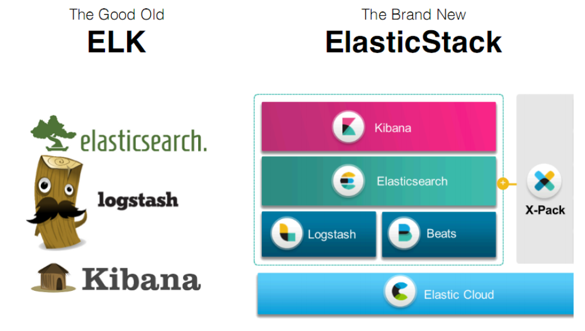

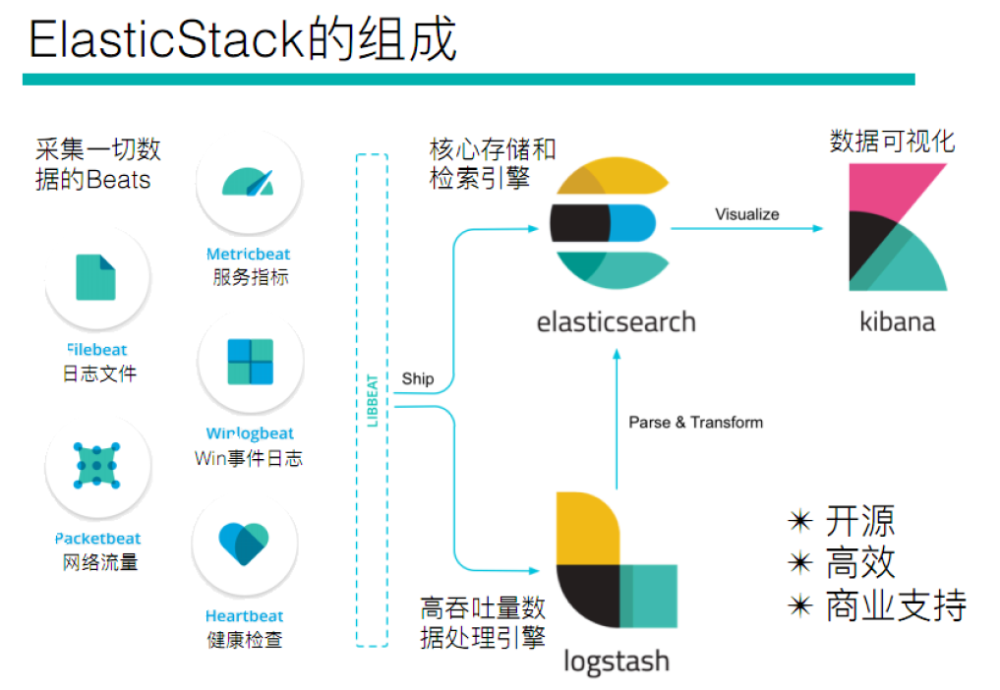

## 2. 倒排索引

**正向索引**（forward index）与**倒排索引**（inverted index，也叫反向索引）是搜索引擎的两种索引组织方式。

正向索引的结构：文档 id -> 关键字列表，即由文档找关键词。

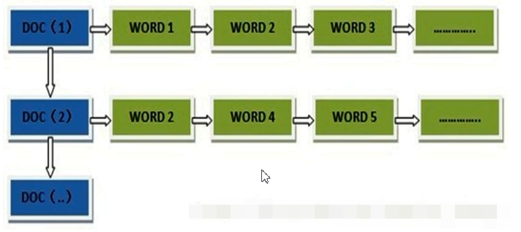

倒排索引的结构：关键词 -> 文档 id 列表，即"关键词1"指向"文档1"的 ID、"文档2"的 ID……由关键词找文档，这正是搜索场景需要的方向。

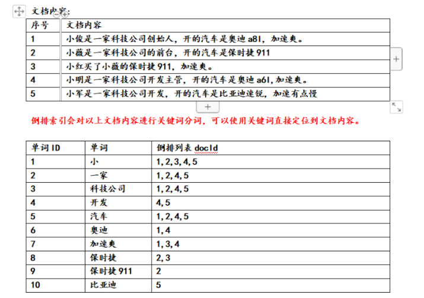

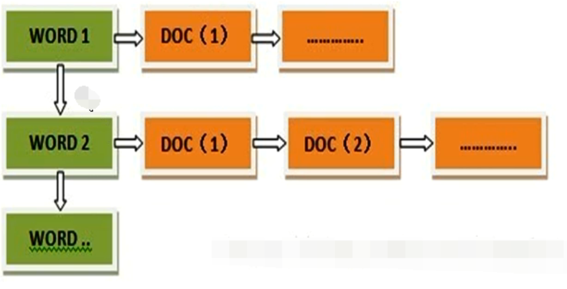

## 3. ES 安装

下载地址：<https://www.elastic.co/cn/downloads/past-releases#elasticsearch>

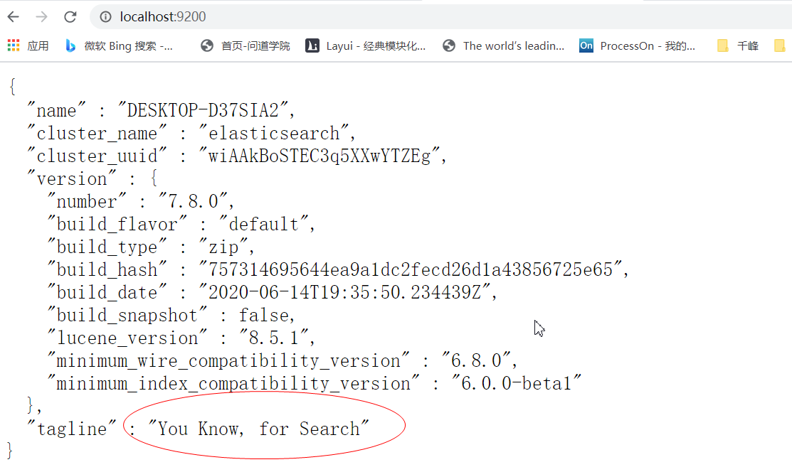

## 4. 安装 Kibana

下载地址：<https://www.elastic.co/cn/downloads/past-releases/kibana-7-8-0>

> [!WARNING]
> Kibana 版本必须和 ElasticSearch 的版本**强一致**。

注意：当 ElasticSearch 和 Kibana 不在一台服务器上时，需要修改 Kibana 的配置，正确指定 ElasticSearch 的 url：

```properties
# The URLs of the Elasticsearch instances to use for all your queries.
elasticsearch.hosts: ["http://localhost:9200"]
```

访问地址：<http://localhost:5601/app/kibana#/dev_tools/console>

## 5. ES 相关概念

### 5.1 核心概念与关系型数据库对比

ES 中有几个基本概念：索引库（index）、文档（document）、映射（mapping）等。将这几个概念与传统的关系型数据库中的库、表、行、列等概念进行对比如下表：

**注意：ES 存数据是以 JSON 的方式存储的。**

| RDBS | ES（NOSQL） |
| --- | --- |
| 数据库（database） | index（索引库） |
| 表（table） | 类型（type）（ES 6.0 之后被废弃，ES 7 中完全删除），数据直接存在索引库 |
| 表结构（schema）字段和字段类型 | 映射（mapping） |
| 行（row） | 文档（document），以 JSON 方式存储数据 |
| 列（column） | 域（field） |
| 索引（B+Tree） | 倒排索引（根据关键词找文档列表） |
| SQL | 查询 DSL |
| `SELECT * FROM table` | `GET http://...` |
| `UPDATE table SET` | `PUT http://...` |
| `DELETE` | `DELETE http://...` |

### 5.2 ES 索引分片存储

一个索引库可以分成多个分片（shard）存储在不同节点上，每个分片还可以有副本（replica），从而实现水平扩展与高可用：

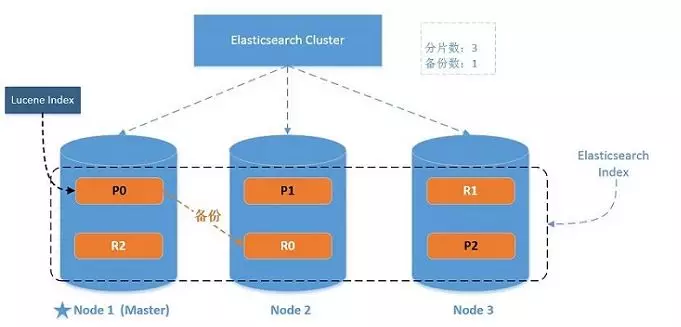

## 6. IK 分词器

默认分词器（standard）对英文友好，对中文不友好——会把中文逐字切开：

```json
GET _analyze
{
  "analyzer": "standard",
  "text": "千锋教育"
}
```

IK 分词器下载地址：<https://github.com/medcl/elasticsearch-analysis-ik/releases>

> [!WARNING]
> IK 分词器的版本必须和 ElasticSearch 的版本强一致。

两种分词模式：

- **ik_smart**：最少切分；
- **ik_max_word**：最细粒度切分【常用】。

安装：解压 IK 压缩包到 ElasticSearch 的 plugins 目录即可，然后重启 ElasticSearch 服务：

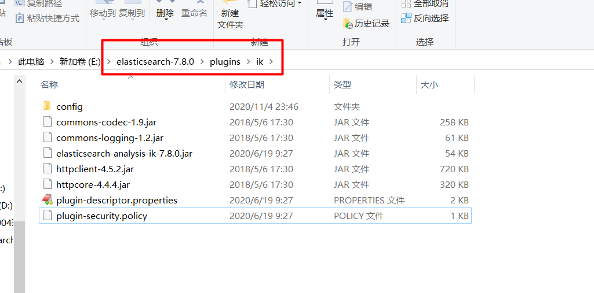

测试两种分词效果：

```json
GET _analyze
{
  "analyzer": "ik_smart",
  "text": "中华人民共和国"
}

GET _analyze
{
  "analyzer": "ik_max_word",
  "text": "中华人民共和国"
}
```

IK 还支持扩展词典和停用词词典，按需在配置中补充自定义词条：

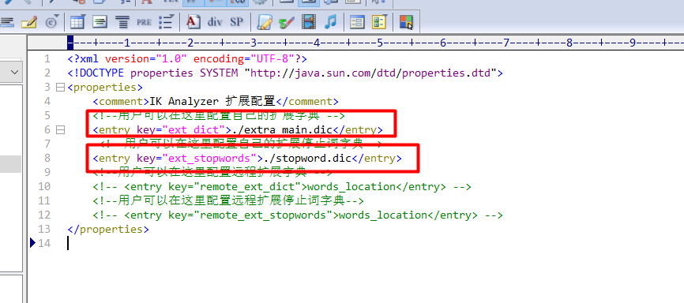

修改词典后同样需要重启 ElasticSearch 服务才能生效：

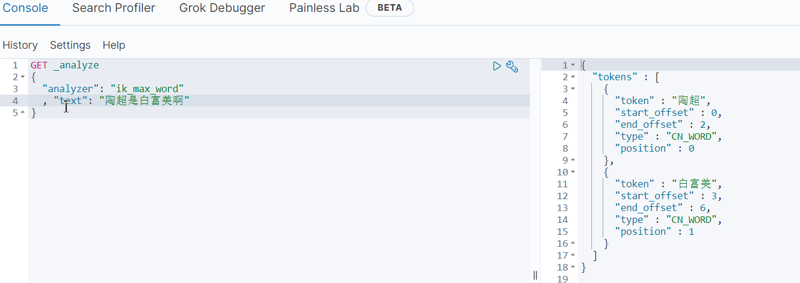

## 7. ES Restful API

### 7.1 索引库操作

fieldType 详见：<https://www.elastic.co/guide/en/elasticsearch/reference/current/mapping-types.html>

创建索引库（PUT）、查看索引库信息（GET）、删除索引（DELETE）：

```json
# 创建索引库
PUT person
{
  "settings": {
    "number_of_shards": 5,
    "number_of_replicas": 2
  },
  "mappings": {
    "properties": {
      "name": {
        "type": "text"
      },
      "age": {
        "type": "integer"
      },
      "sex": {
        "type": "integer"
      },
      "birth": {
        "type": "date"
      }
    }
  }
}

# 查看索引库的信息
GET person

# 删除索引
DELETE person
```

说明：

- `number_of_shards`：索引分几片；`number_of_replicas`：几个备份（可用 `info replication` 类比理解）；
- `type: text` 对应 Java 中的 String，`type: integer` 对应 Java 整数，`type: date` 对应 Java 中的日期——日期的格式在首次插入数据后就定了。

### 7.2 文档操作

#### 7.2.1 添加操作

```json
# 添加文档（指定id）
PUT person/_doc/1
{
  "name": "jack",
  "age": 18,
  "birth": "2018-11-11",
  "address": "美国"
}

# 不指定id自动生成id（需用POST而非PUT）
POST person/_doc
{
  "name": "rose",
  "age": 18,
  "birth": "2018-11-11",
  "address": "美国"
}

# 批量添加（注意：每个文档各占一行，json不要换行）
PUT _bulk
{"index":{"_index":"person1","_id":"4"}}
{"name":"jack2"}
{"index":{"_index":"person2","_id":"3"}}
{"name":"jack3"}

# 查询所有文档
GET /person/_search
{
  "query": {
    "match_all": {}
  }
}
```

> [!TIP]
> 注意日期格式：每次插入保持一致。另外 `_bulk` 的 index 动作后一行就是文档本身，不需要 `doc` 包裹（`doc` 包裹是 update 动作的语法）。

#### 7.2.2 修改文档

```json
# 根据id直接覆盖修改
POST /person/_doc/3
{
  "email": "11@qq.com"
}

# 指定修改某个field，使用doc包裹
POST person/_update/1
{
  "doc": {
    "name": "rose"
  }
}

# 批量修改，可以同时修改多个索引库
POST _bulk
{"update":{"_index":"person","_id":"1"}}
{"doc":{"name":"张三"}}
{"update":{"_index":"person","_id":"2"}}
{"doc":{"name":"张三1"}}
{"update":{"_index":"person","_id":"3"}}
{"doc":{"name":"张三2"}}
```

#### 7.2.3 删除操作

```json
# 删除文档
DELETE person/_doc/4

# 批量删除
PUT _bulk
{"delete":{"_index":"person","_id":"1"}}
{"delete":{"_index":"person","_id":"2"}}
```

## 8. 查询操作

官方提供的测试数据地址：<https://github.com/elastic/elasticsearch/blob/master/docs/src/test/resources/accounts.json>

先创建测试索引库并灌入测试数据（一定要指定索引默认使用 ik 分词器，否则默认使用 standard）：

```json
# ik分词器两种分词效果：ik_max_word、ik_smart
DELETE es_user

PUT es_user
{
  "settings": {
    "index": {
      "analysis.analyzer.default.type": "ik_max_word"
    }
  }
}

PUT es_user/_bulk
{"index":{"_id":"1"}}
{"account_number":1,"balance":39225,"firstname":"Amber","lastname":"Duke","age":32,"gender":0,"address":"湖北省武汉市千锋教育，武汉金融港","job":"开发工程师","email":"amberduke@pyrami.com","city":"Brogan","state":"IL"}
{"index":{"_id":"6"}}
{"account_number":6,"balance":5686,"firstname":"Hattie","lastname":"Bond","age":36,"gender":1,"address":"湖北省武汉市千锋教育","job":"工程师","email":"hattiebond@netagy.com","city":"Dante","state":"TN"}
{"index":{"_id":"13"}}
{"account_number":13,"balance":32838,"firstname":"Nanette","lastname":"Bates","age":28,"gender":1,"address":"教育","job":"JAVA开发工程师","email":"nanettebates@quility.com","city":"Nogal","state":"VA"}
{"index":{"_id":"18"}}
{"account_number":18,"balance":4180,"firstname":"Dale","lastname":"Adams","age":33,"gender":1,"address":"中华人民共和国","job":"JAVA开发","email":"hubeiwuhanshi@boink.com","city":"Orick","state":"MD"}
{"index":{"_id":"20"}}
{"account_number":20,"balance":16418,"firstname":"Elinor","lastname":"Ratliff","age":36,"gender":1,"address":"山东省济南市","job":"产品经理","email":"gaofushuai@scentric.com","city":"Ribera","state":"WA"}
{"index":{"_id":"25"}}
{"account_number":25,"balance":40540,"firstname":"Virginia","lastname":"Ayala","age":19,"gender":0,"address":"湖南省常德市","job":"产品经理","email":"baifumei@filodyne.com","city":"Nicholson","state":"PA"}
{"index":{"_id":"32"}}
{"account_number":32,"balance":48086,"firstname":"Dillard","lastname":"Mcpherson","age":34,"gender":0,"address":"河南省洛阳市","job":"产品经理","email":"beijing@quailcom.com","city":"Veguita","state":"IN"}
{"index":{"_id":"37"}}
{"account_number":37,"balance":18612,"firstname":"Mcgee","lastname":"Mooney","age":18,"gender":0,"address":"河南省郑州市","job":"产品经理","email":"mcgeemooney@reversus.com","city":"Tooleville","state":"OK"}
{"index":{"_id":"44"}}
{"account_number":44,"balance":34487,"firstname":"Aurelia","lastname":"Harding","age":17,"gender":0,"address":"山东省青岛市","job":"项目经理","email":"aureliaharding@orbalix.com","city":"Yardville","state":"DE"}
{"index":{"_id":"49"}}
{"account_number":49,"balance":29104,"firstname":"Fulton","lastname":"Holt","age":23,"gender":0,"address":"山东省威海市","job":"项目经理","email":"qianfengjiaoyu@anocha.com","city":"Sunriver","state":"RI"}
{"index":{"_id":"51"}}
{"account_number":51,"balance":14097,"firstname":"Burton","lastname":"Meyers","age":31,"gender":1,"address":"河南省开封市","job":"前端工程师","email":"burtonmeyers@bezal.com","city":"Jacksonburg","state":"MO"}
{"index":{"_id":"56"}}
{"account_number":56,"balance":14992,"firstname":"Josie","lastname":"Nelson","age":32,"gender":1,"address":"陕西省西安市","job":"前端工程师","email":"josienelson@emtrac.com","city":"Sunnyside","state":"UT"}
{"index":{"_id":"63"}}
{"account_number":63,"balance":6077,"firstname":"Hughes","lastname":"Owens","age":30,"gender":0,"address":"中国香港","job":"前端工程师","email":"hughesowens@valpreal.com","city":"Guilford","state":"KS"}
{"index":{"_id":"68"}}
{"account_number":68,"balance":44214,"firstname":"Hall","lastname":"Key","age":25,"gender":1,"address":"中国台湾","job":"前端工程师","email":"hallkey@eventex.com","city":"Shawmut","state":"CA"}
```

### 8.1 id 和 ids 查询

```json
# 根据id取单个文档
GET es_user/_doc/1

# ids：按一组id批量查询
GET es_user/_search
{
  "query": {
    "ids": {"values": [1, 2, 13]}
  }
}
```

### 8.2 match 查询【重要】

```json
# match_all，查询所有
GET es_user/_search
{
  "query": {
    "match_all": {}
  }
}

# 先看"湖北省武汉市千锋教育"被ik_max_word切成哪些词条
GET _analyze
{
  "analyzer": "ik_max_word",
  "text": "湖北省武汉市千锋教育"
}

# match：将查询词进行中文分词（如"湖北省"切成"湖北""湖北省""省"），
# 然后将分词结果逐一匹配词条（or语义）
GET es_user/_search
{
  "query": {
    "match": {
      "address": "湖北省"
    }
  }
}

# match + operator and：分词后所有词条都必须匹配
GET es_user/_search
{
  "query": {
    "match": {
      "address": {
        "query": "湖北 我爱武汉",
        "operator": "and"
      }
    }
  }
}

# match + operator or：分词后任一词条匹配即可（默认行为）
GET es_user/_search
{
  "query": {
    "match": {
      "address": {
        "query": "湖北 我爱武汉",
        "operator": "or"
      }
    }
  }
}

# multi_match 多域查询：query的值会分词，然后在多个域中匹配词条，
# 只要其中一个域能匹配即可
GET es_user/_search
{
  "query": {
    "multi_match": {
      "query": "我爱湖北",
      "fields": ["address", "email"]
    }
  }
}
```

关键字检索，可以使用 match 进行检索，因为 match 是先分词再匹配词条。

### 8.3 term 查询【重要】

```json
# term：不分词，直接拿查询词整体去匹配词条
GET es_user/_search
{
  "query": {
    "term": {
      "address": "武汉好地方"
    }
  }
}
```

> [!TIP]
> 按商品分类或者品牌这类**枚举值**检索，可以使用 term 检索（这类域通常定义为 keyword，不会被分词）。

### 8.4 prefix 查询

```json
# prefix：匹配"以指定value为前缀"的词条，注意匹配的是词条而非原文本身
GET es_user/_search
{
  "query": {
    "prefix": {
      "address": "武"
    }
  }
}
```

### 8.5 wildcard 查询

不分词，以通配符的方式匹配词条：

```json
# wildcard：* 匹配任意多个字符
GET es_user/_search
{
  "query": {
    "wildcard": {
      "address": "武汉*"
    }
  }
}

# wildcard：? 匹配单个字符
GET es_user/_search
{
  "query": {
    "wildcard": {
      "address": "武汉??"
    }
  }
}
```

### 8.6 range 查询【重要】

```json
POST es_user/_search
{
  "query": {
    "range": {
      "age": {
        "gte": 32,
        "lte": 36
      }
    }
  }
}
```

`gte`：greater than or equal（大于等于）；`lte`：less than or equal（小于等于）。

### 8.7 分页查询【重要】

from + size 分页：

```json
POST es_user/_search
{
  "from": 2,
  "size": 2,
  "query": {
    "match_all": {}
  }
}
```

### 8.8 复合查询【重要】

- `must`：求交集，多个查询单元必须同时匹配；
- `must_not`：取反，多个查询单元必须都不匹配；
- `should`：求并集，多个查询单元满足其中一个条件即可。

must 示例：

```json
GET es_user/_search
{
  "query": {
    "bool": {
      "must": [
        {
          "term": {
            "address": {
              "value": "湖北省"
            }
          }
        },
        {
          "range": {
            "balance": {
              "gte": 5600,
              "lte": 6000
            }
          }
        }
      ]
    }
  }
}
```

must_not 示例：

```json
GET es_user/_search
{
  "query": {
    "bool": {
      "must_not": [
        {
          "match": {
            "address": "湖北湖南"
          }
        },
        {
          "range": {
            "age": {
              "gte": 30,
              "lte": 36
            }
          }
        }
      ]
    }
  }
}
```

should 示例：

```json
GET es_user/_search
{
  "query": {
    "bool": {
      "should": [
        {
          "term": {
            "address": "湖北湖南"
          }
        },
        {
          "range": {
            "age": {
              "gte": 30,
              "lte": 36
            }
          }
        }
      ]
    }
  }
}
```

### 8.9 高亮查询【重要】

单个域的高亮（了解）：

```json
GET es_user/_search
{
  "query": {
    "match": {
      "address": "湖北教育"
    }
  },
  "highlight": {
    "fields": {
      "address": {}
    },
    "pre_tags": "<font color='red'>",
    "post_tags": "</font>"
  }
}
```

多个域的高亮：

```json
GET es_user/_search
{
  "query": {
    "bool": {
      "should": [
        {
          "match": {
            "address": "湖北"
          }
        },
        {
          "match": {
            "email": "hattiebond"
          }
        }
      ]
    }
  },
  "highlight": {
    "fields": {
      "address": {},
      "email": {}
    },
    "pre_tags": "<font color='red'>",
    "post_tags": "</font>"
  }
}
```

### 8.10 boosting 查询【重要】

影响文档分数（相关性得分）的因素：

1. 当查询的关键字在文档中出现的频次越高，分数越高；
2. 指定的文档内容越短，分数越高，如查找的是"高富帅"，指定文档内容就是"高富帅"。

boosting 查询可以把不想命中的条件作为 negative（降权）而不是直接排除：

```json
GET es_user/_search
{
  "query": {
    "boosting": {
      "positive": {
        "match": {
          "address": "湖北省"
        }
      },
      "negative": {
        "match": {
          "job": "前端"
        }
      },
      "negative_boost": 0.1
    }
  }
}
```

> [!NOTE]
> `negative_boost` 是对 negative 部分得分的**降权系数**，取值范围是 0~1（如 0.1 表示命中 negative 条件的文档得分乘以 0.1）。

### 8.11 过滤【重要】（用在复合查询）

**过滤字段**：查询结果过滤掉不想要的字段，类似 SQL 里 `select *` 与 `select age` 的区别：

```json
GET /es_user/_search
{
  "_source": ["age", "gender"],
  "query": {
    "match_all": {}
  }
}
```

**过滤文档**：过滤和查询都能起到对结果集的过滤效果，但是查询会影响到文档的评分及排名，而过滤不会。如果需要在查询结果中进行过滤，并且不希望过滤条件影响评分，那么就不要把过滤条件作为查询条件来用，而是使用 `filter` 方式。

影响分数演示，需求：address 中有湖北词条（must）、job 中有"工程师"词条。

用复合查询（job 条件参与评分）：

```json
GET es_user/_search
{
  "query": {
    "bool": {
      "must": [
        {
          "match": {
            "address": "湖北"
          }
        },
        {
          "term": {
            "job.keyword": "开发工程师"
          }
        }
      ]
    }
  }
}
```

用过滤（job 条件不参与评分）：

```json
GET es_user/_search
{
  "query": {
    "bool": {
      "must": [
        {
          "match": {
            "address": "湖北"
          }
        }
      ],
      "filter": [
        {
          "term": {
            "job.keyword": "开发工程师"
          }
        }
      ]
    }
  }
}
```

`filter` 中的 `job.keyword` 表示只要 job 的全词是"开发工程师"才匹配。

### 8.12 排序【重要】

```json
GET /es_user/_search
{
  "query": {
    "bool": {
      "must": [
        {
          "match": {
            "address": "武汉人"
          }
        }
      ],
      "filter": [
        {
          "term": {
            "job": "工程师"
          }
        }
      ]
    }
  },
  "sort": [
    {
      "age": {
        "order": "desc"
      }
    }
  ]
}
```

### 8.13 聚合【重要】

Elasticsearch 中的聚合包含多种类型，最常用的两种：一个叫**桶**（bucket），一个叫**度量**（metrics）。

**度量（metrics）**：分组完成以后，我们一般会对组中的数据进行聚合运算，例如求平均值、最大、最小、求和等，这些在 ES 中称为度量。

比较常用的一些度量聚合方式：

| 聚合方式 | 说明 |
| --- | --- |
| Avg Aggregation | 求平均值 |
| Max Aggregation | 求最大值 |
| Min Aggregation | 求最小值 |
| Percentiles Aggregation | 求百分比 |
| Stats Aggregation | 同时返回 avg、max、min、sum、count 等 |
| Sum Aggregation | 求和 |
| Top Hits Aggregation | 求前几 |
| Value Count Aggregation | 求总数 |

```json
GET /es_user/_search
{
  "query": {
    "match": {
      "address": "武汉"
    }
  },
  "aggs": {
    "age_avg": {
      "avg": {
        "field": "age"
      }
    },
    "max_age": {
      "max": {
        "field": "age"
      }
    }
  }
}
```

**桶（bucket）**：桶的作用是按照某种方式对数据进行分组，每一组数据在 ES 中称为一个桶。比如按职位分组：

```json
GET /es_user/_search
{
  "query": {
    "match": {
      "address": "武汉市"
    }
  },
  "aggs": {
    "job_group": {
      "terms": {
        "field": "job.keyword",
        "size": 10
      }
    }
  }
}
```

## 9. Spring Data Elasticsearch

**1. Elasticsearch Clients**

- 文档地址：<https://www.elastic.co/guide/en/elasticsearch/client/index.html>
- 官方维护，版本随 ES 的升级并行升级：

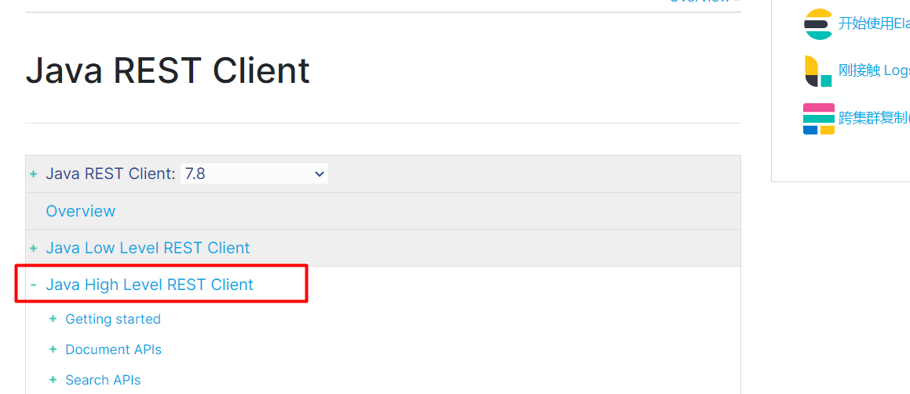

**2. Spring Data Elasticsearch**

Spring Data Elasticsearch 是 Spring 对 JAVA High Level REST Client 的封装：

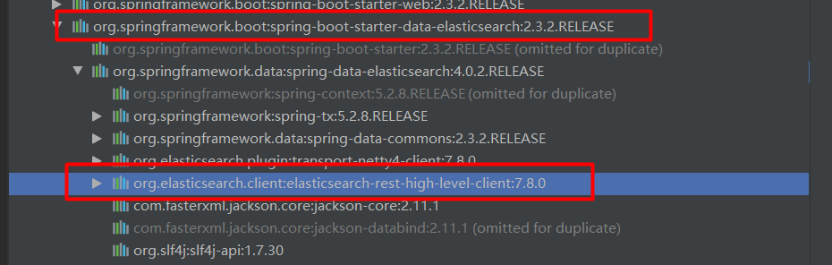

### 9.1 pom 依赖

```xml
<dependency>
    <groupId>org.springframework.boot</groupId>
    <artifactId>spring-boot-starter-data-elasticsearch</artifactId>
</dependency>
```

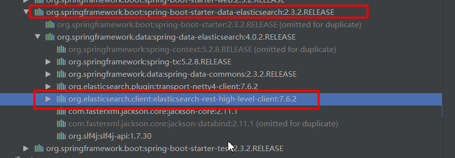

ES 高级 API 版本纠正（SpringBoot 默认带的 ES 客户端版本可能与服务器不一致，需要覆盖版本号）：

```xml
<parent>
    <groupId>org.springframework.boot</groupId>
    <artifactId>spring-boot-starter-parent</artifactId>
    <version>2.3.2.RELEASE</version>
    <relativePath/> <!-- lookup parent from repository -->
</parent>

<properties>
    <elasticsearch.version>7.8.0</elasticsearch.version>
</properties>
```

### 9.2 Elasticsearch Object Mapping

详细见：<https://docs.spring.io/spring-data/elasticsearch/docs/4.1.3/reference/html/#elasticsearch.mapping>

一个 entity 对应一个索引库：

```java
package com.fengmi.entity;

import lombok.Data;
import org.springframework.data.annotation.Id;
import org.springframework.data.elasticsearch.annotations.Document;
import org.springframework.data.elasticsearch.annotations.Field;
import org.springframework.data.elasticsearch.annotations.FieldType;

@Data
@Document(indexName = "es_user_3", shards = 2, replicas = 1)
public class ESUser {

    @Id
    private Integer id;
    /**
     * @Field 常用属性说明：
     * type:指定域在es中的类型
     *   Integer => FieldType.Integer
     *   如果类型为Integer、Double、Date，对应的域不会进行分词
     *   如果类型为String（FieldType.Text），对应的域一定会分词，比如商品名称
     *   如果类型为String（FieldType.Keyword），对应的域不会分词，比如品牌名称、商品分类、email、city
     * index:指定该域要不要建立倒排索引，默认值是true
     *   index=false 不建立倒排索引，适用于不根据该域进行查询、过滤、排序的场景，比如图片地址
     * store:指定该域需不需要存储，默认值为false
     *   一般大文本可以将store设置为false，比如商品的介绍（可以建立倒排索引，不用存储）
     * analyzer:指定分词器（默认standard，常用ik_max_word、ik_smart）
     *   当type=FieldType.Text时必须指定分词器
     */
    @Field(store = true, type = FieldType.Integer)
    private Integer account_number;
    @Field(store = true, type = FieldType.Double)
    private Double balance;
    @Field(store = true, type = FieldType.Keyword)
    private String firstname;
    @Field(store = true, type = FieldType.Keyword)
    private String lastname;
    @Field(store = true, type = FieldType.Integer)
    private Integer age;
    @Field(store = true, type = FieldType.Integer)
    private Integer gender;
    @Field(store = true, type = FieldType.Text, analyzer = "ik_max_word")
    private String address;
    @Field(store = true, type = FieldType.Keyword)
    private String job;
    @Field(store = true, type = FieldType.Keyword)
    private String email;
    @Field(store = true, type = FieldType.Keyword)
    private String city;
    @Field(store = true, type = FieldType.Keyword)
    private String state;
}
```

如果是日期类型要指定日期格式，如：`@Field(type = FieldType.Date, format = DateFormat.year_month_day)`。

Spring Data 通过注解来声明字段的映射属性，常用三个注解：

| 注解 | 作用 | 属性 |
| --- | --- | --- |
| `@Document` | 作用在类，标记实体类为文档对象 | indexName：对应索引库名称；type：对应索引库中的类型（ElasticSearch 7.x 中已取消 type 概念）；shards：分片数量，默认 5；replicas：副本数量，默认 1 |
| `@Id` | 作用在成员变量，标记一个字段作为 id 主键 | - |
| `@Field` | 作用在成员变量，标记为文档的字段，并指定字段映射属性 | type：字段类型，取值是枚举 FieldType；index：是否索引，布尔类型，默认 true；store：是否存储，布尔类型，默认 false；analyzer：分词器名称，如 ik_max_word |

配置文件：

```yaml
spring:
  elasticsearch:
    rest:
      uris: http://localhost:9200
```

### 9.3 单元测试

#### 9.3.1 建立索引库

```java
@SpringBootTest
@RunWith(SpringRunner.class)
public class ESAppTest {

    @Autowired
    private ElasticsearchRestTemplate template;

    // 创建索引
    @Test
    public void testIndex() {
        // 创建索引
        template.createIndex(ESUser.class);
        // mapping设置（设置域的类型）
        template.putMapping(ESUser.class);
    }
}
```

#### 9.3.2 保存文档

```java
// 保存文档
@Test
public void testSave() {
    ESUser doc = new ESUser();
    doc.setId(1);
    doc.setAddress("武汉千锋");
    doc.setCity("武汉市");
    doc.setAge(12);

    ESUser save = template.save(doc);
}
```

#### 9.3.3 删除文档

```java
// 删除文档
@Test
public void testDelete() {
    template.delete("1", ESUser.class);
}
```

#### 9.3.4 查询（match_all）

```java
// match_all
@Test
public void test3() {
    MatchAllQueryBuilder matchAllQueryBuilder = QueryBuilders.matchAllQuery();

    NativeSearchQuery build = new NativeSearchQueryBuilder()
        // 指定查询方式
        .withQuery(matchAllQueryBuilder)
        .build();

    SearchHits<ESUser> search = template.search(build, ESUser.class);

    // 获取总记录数
    long totalHits = search.getTotalHits();
    System.out.println(totalHits);

    // 获取文档列表（SearchHit引自org.springframework.data.elasticsearch.core）
    List<SearchHit<ESUser>> searchHits = search.getSearchHits();

    List<ESUser> list =
        searchHits.stream().map(hit -> hit.getContent()).collect(Collectors.toList());

    list.forEach(System.out::println);
}
```

Java 8 引入 lambda 表达式后，我们可以使用 stream 流链式处理的方式，例如：

```java
List<People> peoples = Arrays.asList(
        new People("zs", 25, "cs"),
        new People("ls", 28, "bj"),
        new People("ww", 23, "nj")
);

List<String> names = peoples.stream().map(p -> p.getName()).collect(Collectors.toList());
```

#### 9.3.5 查询（match）

```java
// match
@Test
public void test4() {
    MatchQueryBuilder matchQueryBuilder = QueryBuilders.matchQuery("address", "我喜欢湖北");

    NativeSearchQuery build = new NativeSearchQueryBuilder()
        // 指定查询方式
        .withQuery(matchQueryBuilder)
        .build();

    SearchHits<ESUser> search = template.search(build, ESUser.class);

    // 获取总记录数
    long totalHits = search.getTotalHits();
    System.out.println(totalHits);

    // 获取文档列表
    List<SearchHit<ESUser>> searchHits = search.getSearchHits();

    List<ESUser> list =
        searchHits.stream().map(hit -> hit.getContent()).collect(Collectors.toList());

    list.forEach(System.out::println);
}
```

#### 9.3.6 查询（term）

```java
// term
@Test
public void test5() {
    TermQueryBuilder termQueryBuilder = QueryBuilders.termQuery("address", "湖北");

    NativeSearchQuery build = new NativeSearchQueryBuilder()
        // 指定查询方式
        .withQuery(termQueryBuilder)
        .build();

    SearchHits<ESUser> search = template.search(build, ESUser.class);

    // 获取总记录数
    long totalHits = search.getTotalHits();
    System.out.println(totalHits);

    // 获取文档列表
    List<SearchHit<ESUser>> searchHits = search.getSearchHits();

    List<ESUser> list =
        searchHits.stream().map(hit -> hit.getContent()).collect(Collectors.toList());

    list.forEach(System.out::println);
}
```

#### 9.3.7 查询（range）

```java
// range
@Test
public void test6() {
    RangeQueryBuilder age = QueryBuilders.rangeQuery("age").lte(36).gte(30);

    NativeSearchQuery build = new NativeSearchQueryBuilder()
        // 指定查询方式
        .withQuery(age)
        .build();

    SearchHits<ESUser> search = template.search(build, ESUser.class);

    // 获取总记录数
    long totalHits = search.getTotalHits();
    System.out.println(totalHits);

    // 获取文档列表
    List<SearchHit<ESUser>> searchHits = search.getSearchHits();

    List<ESUser> list =
        searchHits.stream().map(hit -> hit.getContent()).collect(Collectors.toList());

    list.forEach(System.out::println);
}
```

#### 9.3.8 查询（page）

```java
// page
@Test
public void test7() {
    RangeQueryBuilder age = QueryBuilders.rangeQuery("age").lte(36).gte(0);

    // 分页：第0页，每页2条
    PageRequest pageRequest = PageRequest.of(0, 2);

    NativeSearchQuery build = new NativeSearchQueryBuilder()
        // 指定查询方式
        .withQuery(age)
        // 设置分页信息
        .withPageable(pageRequest)
        .build();

    SearchHits<ESUser> search = template.search(build, ESUser.class);

    // 获取总记录数
    long totalHits = search.getTotalHits();
    System.out.println(totalHits);

    // 获取文档列表
    List<SearchHit<ESUser>> searchHits = search.getSearchHits();

    List<ESUser> list =
        searchHits.stream().map(hit -> hit.getContent()).collect(Collectors.toList());

    list.forEach(System.out::println);
}
```

#### 9.3.9 查询（bool）

```java
/**
 * address 我喜欢湖北  match
 * should
 * 10<age<30    range
 */
@Test
public void test8() {
    BoolQueryBuilder boolQueryBuilder = QueryBuilders.boolQuery();

    MatchQueryBuilder matchQueryBuilder = QueryBuilders.matchQuery("address", "我喜欢湖北");
    RangeQueryBuilder age = QueryBuilders.rangeQuery("age").gte(10).lte(30);

    boolQueryBuilder.should(matchQueryBuilder).should(age);

    NativeSearchQuery build = new NativeSearchQueryBuilder()
        // 指定查询方式
        .withQuery(boolQueryBuilder)
        .build();

    SearchHits<ESUser> search = template.search(build, ESUser.class);

    // 获取总记录数
    long totalHits = search.getTotalHits();
    System.out.println(totalHits);

    // 获取文档列表
    List<SearchHit<ESUser>> searchHits = search.getSearchHits();

    List<ESUser> list =
        searchHits.stream().map(hit -> hit.getContent()).collect(Collectors.toList());

    list.forEach(System.out::println);
}
```

#### 9.3.10 查询（highlight）

```java
// 单域highlight
@Test
public void test9() {
    MatchQueryBuilder matchQueryBuilder = QueryBuilders.matchQuery("address", "我喜欢湖北");

    NativeSearchQuery build = new NativeSearchQueryBuilder()
        // 指定查询方式
        .withQuery(matchQueryBuilder)
        // 设置高亮
        .withHighlightBuilder(getHighlightBuilder("address"))
        .build();

    SearchHits<ESUser> search = template.search(build, ESUser.class);

    // 获取总记录数
    long totalHits = search.getTotalHits();
    System.out.println(totalHits);

    // 获取文档列表，并把高亮内容回填到实体
    List<SearchHit<ESUser>> searchHits = search.getSearchHits();

    List<ESUser> list =
        searchHits.stream().map(hit -> {
            ESUser esUser = hit.getContent();
            // 取高亮
            Map<String, List<String>> highlightFields = hit.getHighlightFields();

            highlightFields.forEach((k, v) -> {
                String highlightVal = v.get(0);
                if ("address".equals(k)) {
                    esUser.setAddress(highlightVal);
                }
            });

            return esUser;
        }).collect(Collectors.toList());

    list.forEach(System.out::println);
}

// 多域highlight
@Test
public void test10() {
    MatchQueryBuilder addressMatchQueryBuilder = QueryBuilders.matchQuery("address", "我喜欢湖北");
    MatchQueryBuilder jobMatchQueryBuilder = QueryBuilders.matchQuery("job", "工程师");

    BoolQueryBuilder boolQueryBuilder = QueryBuilders.boolQuery();
    boolQueryBuilder.should(addressMatchQueryBuilder).should(jobMatchQueryBuilder);

    NativeSearchQuery build = new NativeSearchQueryBuilder()
        // 指定查询方式
        .withQuery(boolQueryBuilder)
        // 设置高亮
        .withHighlightBuilder(getHighlightBuilder("address", "job"))
        .build();

    SearchHits<ESUser> search = template.search(build, ESUser.class);

    // 获取总记录数
    long totalHits = search.getTotalHits();
    System.out.println(totalHits);

    // 获取文档列表，并把高亮内容回填到实体
    List<SearchHit<ESUser>> searchHits = search.getSearchHits();

    List<ESUser> list =
        searchHits.stream().map(hit -> {
            ESUser esUser = hit.getContent();
            // 取高亮
            Map<String, List<String>> highlightFields = hit.getHighlightFields();

            highlightFields.forEach((k, v) -> {
                String highlightVal = v.get(0);
                if ("address".equals(k)) {
                    esUser.setAddress(highlightVal);
                }
                if ("job".equals(k)) {
                    esUser.setJob(highlightVal);
                }
            });

            return esUser;
        }).collect(Collectors.toList());

    list.forEach(System.out::println);
}

// 设置高亮字段
private HighlightBuilder getHighlightBuilder(String... fields) {
    // 高亮条件
    HighlightBuilder highlightBuilder = new HighlightBuilder(); // 生成高亮查询器
    for (String field : fields) {
        highlightBuilder.field(field); // 高亮查询字段
    }
    highlightBuilder.requireFieldMatch(false); // 如果要多个字段高亮，这项要为false
    highlightBuilder.preTags("<span style=\"color:red\">"); // 高亮前置标签
    highlightBuilder.postTags("</span>"); // 高亮后置标签
    // 下面这两项，如果你要高亮如文字内容等有很多字的字段，必须配置，
    // 不然会导致高亮不全、文章内容缺失等
    highlightBuilder.fragmentSize(800000); // 最大高亮分片长度（字符数）
    highlightBuilder.numOfFragments(0); // 从第一个分片获取高亮片段

    return highlightBuilder;
}
```

对应的 DSL 写法：

```json
GET es_user_3/_search
{
  "query": {
    "bool": {
      "should": [
        {
          "match": {
            "address": "我喜欢湖北"
          }
        },
        {
          "match": {
            "job": "工程师"
          }
        }
      ]
    }
  },
  "highlight": {
    "fields": {
      "address": {},
      "job": {}
    },
    "pre_tags": "<font style='color:red'>",
    "post_tags": "</font>"
  }
}
```

## 10. 小结

- ES 是基于 Lucene 的分布式全文搜索引擎，核心数据结构是**倒排索引**（关键词 -> 文档列表）；
- 概念映射：index ≈ 库、mapping ≈ 表结构、document ≈ 行（JSON 存储）、field ≈ 列；ES 7 已删除 type；
- 中文检索必须装 **IK 分词器**（版本与 ES 强一致），`ik_smart` 最少切分、`ik_max_word` 最细粒度切分；
- 查询核心区别：**match 先分词再匹配**（适合关键字检索），**term 不分词整体匹配**（适合 keyword 域）；复合查询 must/must_not/should；filter 过滤不影响评分；聚合分**度量**与**桶**；
- Java 侧使用 **Spring Data Elasticsearch**：`@Document/@Id/@Field` 声明映射，`ElasticsearchRestTemplate` + `QueryBuilders`/`NativeSearchQueryBuilder` 完成各类查询。
