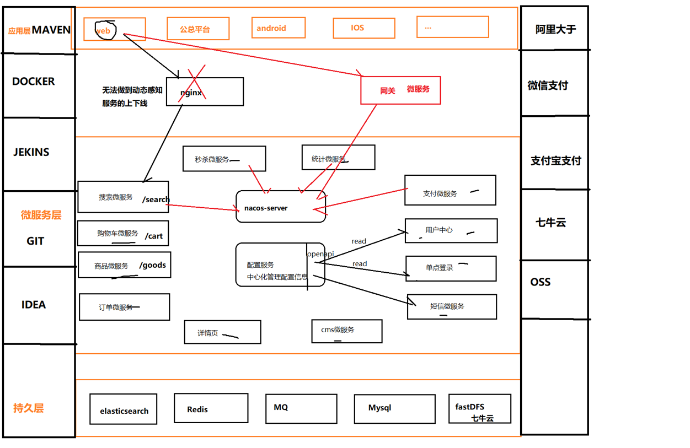
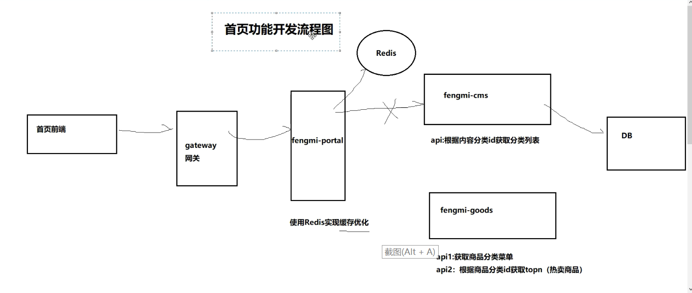
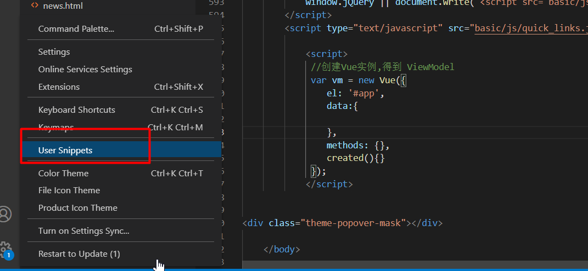
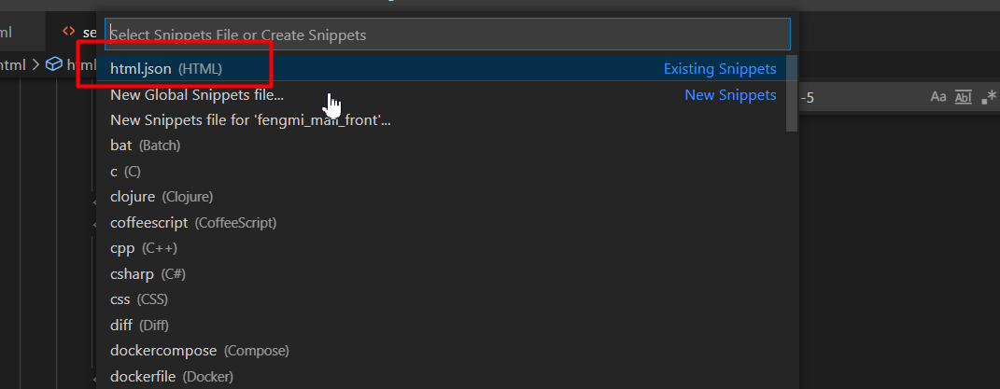

# 项目笔记

本篇是微服务综合实战项目「锋迷铺子」的总览笔记，包括项目背景、技术选型、工程搭建、敏捷开发工具以及首页、站内搜索等核心模块的开发要点。

## 1. 项目背景（锋迷铺子）

锋迷铺子是一个**垂直电商**项目，属于典型的 B2C 模式，整体拆分为两个系统：

| 系统 | 架构 | 说明 |
| --- | --- | --- |
| 运营平台 | 单体架构 | 面向内部运营人员，做商品、内容等数据管理 |
| 门户系统 | 分布式架构（微服务） | 面向消费者，通过互联网项目应用微服务组件 |

同类的互联网项目还有不少，可以参考它们的产品形态：

- 猫眼电影：<https://maoyan.com/>
- 马蜂窝旅游：<http://www.mafengwo.cn/>
- 江寓（长租公寓）：<http://www.jiangroom.com/index.html>
- 订餐小秘书：<http://www.xiaomishu.com/>
- 扣丁学堂（使用腾讯云、阿里云的点播服务）：<http://www.codingke.com/>
- 拍卖系统（艺术品方向）

## 2. 技术选型

### 2.1 后端技术

| 技术 | 说明 | 官网 |
| --- | --- | --- |
| SpringBoot | 容器 + MVC 框架 | <https://spring.io/projects/spring-boot> |
| Spring Cloud Alibaba | 微服务组件 | <https://github.com/alibaba/spring-cloud-alibaba/wiki/> |
| Spring Security | 认证和授权框架 | <https://spring.io/projects/spring-security> |
| MyBatis-Plus | ORM 框架 | <https://baomidou.com/> |
| Redis | 分布式缓存 | <https://redis.io/> |
| Nginx | 静态资源服务器 | <https://www.nginx.com/> |
| RocketMQ | 消息队列 | <https://rocketmq.apache.org/> |
| Elasticsearch | 搜索引擎 | <https://www.elastic.co/cn/elasticsearch/> |
| JWT | 登录令牌支持 | <https://github.com/jwtk/jjwt> |
| Hutool | Java 工具类库 | <https://github.com/looly/hutool> |
| Swagger-UI | 文档生成工具、接口文档 | <https://github.com/swagger-api/swagger-ui> |
| Spring Task | 定时任务 | <https://docs.spring.io/spring-framework/docs/current/reference/html/integration.html#scheduling> |
| Seata | 分布式事务 | <https://seata.apache.org/> |
| Redisson | 分布式锁 | <https://github.com/redisson/redisson> |
| Freemarker | 网页静态化技术 | <https://freemarker.apache.org/> |

### 2.2 前端技术

| 技术 | 说明 | 官网 |
| --- | --- | --- |
| Vue | 前端框架 | <https://vuejs.org/> |
| Vue Router | 路由框架 | <https://router.vuejs.org/> |
| Element UI（基于 Vue）、Layui（基于 jQuery） | 前端 UI 框架 | <https://element.eleme.io/> |
| Axios | 前端 HTTP 框架 | <https://github.com/axios/axios> |
| ECharts | 图表框架 | <https://echarts.apache.org/> |

## 3. 项目技术架构

整体技术架构如下图所示，各中间件与微服务组件在架构中的位置一目了然：



## 4. 工程搭建

### 4.1 后台工程搭建

后台采用 Maven 多工程结构：父工程负责**统一锁定版本**（SpringBoot、Spring Cloud、Spring Cloud Alibaba），各微服务模块继承父工程并按需引入依赖。

父工程 `pom.xml`：

```xml
<?xml version="1.0" encoding="UTF-8"?>
<project xmlns="http://maven.apache.org/POM/4.0.0"
         xmlns:xsi="http://www.w3.org/2001/XMLSchema-instance"
         xsi:schemaLocation="http://maven.apache.org/POM/4.0.0 http://maven.apache.org/xsd/maven-4.0.0.xsd">
    <modelVersion>4.0.0</modelVersion>

    <groupId>org.example</groupId>
    <artifactId>fengmi-mall</artifactId>
    <version>1.0-SNAPSHOT</version>

    <!-- 父工程的职责：锁定版本 springboot、springcloud、springcloud-alibaba -->

    <parent>
        <groupId>org.springframework.boot</groupId>
        <artifactId>spring-boot-starter-parent</artifactId>
        <version>2.3.2.RELEASE</version>
        <relativePath/> <!-- 从仓库中查找父工程 -->
    </parent>

    <properties>
        <!-- 定义变量 -->
        <env>pro</env>
        <mysql.version>5.1.47</mysql.version>
    </properties>

    <build>
        <resources>
            <resource>
                <directory>src/main/resources/</directory>
                <filtering>true</filtering>
            </resource>
        </resources>
    </build>

    <dependencyManagement>
        <dependencies>
            <dependency>
                <groupId>com.alibaba.cloud</groupId>
                <artifactId>spring-cloud-alibaba-dependencies</artifactId>
                <version>2.2.5.RELEASE</version>
                <type>pom</type>
                <scope>import</scope>
            </dependency>
            <dependency>
                <groupId>org.springframework.cloud</groupId>
                <artifactId>spring-cloud-dependencies</artifactId>
                <version>Hoxton.SR8</version>
                <type>pom</type>
                <scope>import</scope>
            </dependency>
        </dependencies>
    </dependencyManagement>
</project>
```

微服务的基础依赖：

```xml
<dependencies>
    <dependency>
        <groupId>org.springframework.boot</groupId>
        <artifactId>spring-boot-starter-web</artifactId>
    </dependency>

    <dependency>
        <groupId>org.springframework.boot</groupId>
        <artifactId>spring-boot-starter-actuator</artifactId>
    </dependency>

    <!-- Nacos 服务注册与发现 -->
    <dependency>
        <groupId>com.alibaba.cloud</groupId>
        <artifactId>spring-cloud-starter-alibaba-nacos-discovery</artifactId>
    </dependency>

    <!-- Nacos 配置中心 -->
    <dependency>
        <groupId>com.alibaba.cloud</groupId>
        <artifactId>spring-cloud-starter-alibaba-nacos-config</artifactId>
    </dependency>

    <dependency>
        <groupId>com.baomidou</groupId>
        <artifactId>mybatis-plus-boot-starter</artifactId>
        <version>3.4.2</version>
    </dependency>

    <dependency>
        <groupId>mysql</groupId>
        <artifactId>mysql-connector-java</artifactId>
    </dependency>

    <!-- Druid 连接池 -->
    <dependency>
        <groupId>com.alibaba</groupId>
        <artifactId>druid-spring-boot-starter</artifactId>
        <version>1.1.23</version>
    </dependency>

    <!-- Redis，commons-pool2 是 Lettuce 连接池的依赖 -->
    <dependency>
        <groupId>org.springframework.boot</groupId>
        <artifactId>spring-boot-starter-data-redis</artifactId>
    </dependency>

    <dependency>
        <groupId>org.apache.commons</groupId>
        <artifactId>commons-pool2</artifactId>
        <version>2.8.0</version>
    </dependency>

    <!-- 项目公共实体模块 -->
    <dependency>
        <groupId>com.fengmi</groupId>
        <artifactId>fengmi-entity</artifactId>
        <version>1.0-SNAPSHOT</version>
    </dependency>
</dependencies>
```

服务的通用配置（链路追踪、Nacos、Sentinel、Feign、Seata 等）：

```yaml
spring:
  zipkin:
    base-url: http://localhost:9999
    discovery-client-enabled: false
  sleuth:
    sampler:
      rate: 100
  datasource:
    druid:
      driver-class-name: com.mysql.jdbc.Driver
      username: root
      password: 123456
      url: jdbc:mysql://127.0.0.1:3306/fengmi_mall?useUnicode=true&characterEncoding=utf8&useSSL=false
      max-active: 600 # 连接池配置
  cloud:
    nacos:
      discovery:
        server-addr: localhost:8848   # 指定 nacos-server 的服务地址
        username: nacos
        password: nacos
        namespace: dev # 将服务发布到指定的命名空间，不指定就是默认命名空间（public）
        group: DEFAULT_GROUP # 将服务发布到指定 group，不指定就是默认的（DEFAULT_GROUP）
    sentinel:
      transport:
        dashboard: localhost:8888  # 指定 dashboard 地址
        port: 8719
      eager: true
      web-context-unify: false
      datasource:
        flow:
          nacos:
            server-addr: ${nacos.server-addr}
            username: ${nacos.username}
            password: ${nacos.password}
            namespace: ${nacos.namespace}
            groupId: SENTINEL_GROUP
            dataId: ${spring.application.name}-flow-rules
            rule-type: flow
        degrade:
          nacos:
            server-addr: ${nacos.server-addr}
            username: ${nacos.username}
            password: ${nacos.password}
            namespace: ${nacos.namespace}
            groupId: SENTINEL_GROUP
            dataId: ${spring.application.name}-degrade-rules
            rule-type: degrade
        param-flow:
          nacos:
            server-addr: ${nacos.server-addr}
            username: ${nacos.username}
            password: ${nacos.password}
            namespace: ${nacos.namespace}
            groupId: SENTINEL_GROUP
            dataId: ${spring.application.name}-param-rules
            rule-type: param-flow
        system:
          nacos:
            server-addr: ${nacos.server-addr}
            username: ${nacos.username}
            password: ${nacos.password}
            namespace: ${nacos.namespace}
            groupId: SENTINEL_GROUP
            dataId: ${spring.application.name}-system-rules
            rule-type: system
        authority:
          nacos:
            server-addr: ${nacos.server-addr}
            username: ${nacos.username}
            password: ${nacos.password}
            namespace: ${nacos.namespace}
            groupId: SENTINEL_GROUP
            dataId: ${spring.application.name}-authority-rules
            rule-type: authority
feign:
  sentinel:
    enabled: true
# 自定义配置，供上面的 ${nacos.xxx} 占位符引用
nacos:
  server-addr: localhost:8848
  username: nacos
  password: nacos
  namespace: sentinel
seata:
  enabled: true
  tx-service-group: fengmi_tx_group
  enable-auto-data-source-proxy: true
  config:
    type: nacos
    nacos:
      server-addr: 127.0.0.1:8848
      group: DEFAULT_GROUP
      namespace: pro
      username: nacos
      password: nacos
      data-id: demo_tx_group-pro.properties

  registry: # 发现 seata-server
    type: nacos
    nacos:
      application: seata-server
      server-addr: 127.0.0.1:8848
      namespace: pro
      group: DEFAULT_GROUP
      username: nacos
      password: nacos
```

> [!NOTE]
> Sentinel 的流控、降级、热点参数、系统、授权五类规则都托管到 Nacos，`dataId` 以 `spring.application.name` 为前缀，服务重启后规则不丢失；`${nacos.xxx}` 占位符引用的是下面自定义的 `nacos` 配置段。

如果项目中需要自定义 JSON 序列化行为，再补充 Jackson 依赖（Spring Boot 的 web starter 默认已带，可按需显式引入）：

```xml
<dependencies>
    <dependency>
        <groupId>com.fasterxml.jackson.core</groupId>
        <artifactId>jackson-annotations</artifactId>
    </dependency>
    <dependency>
        <groupId>com.fasterxml.jackson.core</groupId>
        <artifactId>jackson-core</artifactId>
    </dependency>
    <dependency>
        <groupId>com.fasterxml.jackson.core</groupId>
        <artifactId>jackson-databind</artifactId>
    </dependency>
</dependencies>
```

### 4.2 前端工程搭建

前端工程基于 Vue + Element UI 搭建。日常开发时可以在 VSCode 中配置一个 Vue 实例模板代码片段（`文件 → 首选项 → 用户片段 → vue.json`），输入 `app` 快捷生成 Vue 实例骨架：

```json
{
  "h5 template": {
    "prefix": "app", // 使用这个模板的快捷键
    "body": [
      "\t<script>",
      "\t // 创建 Vue 实例，得到 ViewModel",
      "\t var vm = new Vue({",
      "\t\tel: '#app',",
      "\t\tdata:{\n",
      "\t\t},",
      "\t\tmethods: {},",
      "\t\tcreated(){}",
      "\t });",
      "\t</script>"
    ],
    "description": "HT-H5" // 模板的描述
  }
}
```

## 5. 敏捷开发工具

### 5.1 任务跟踪工具

项目采用敏捷开发流程，任务跟踪使用 TAPD：<https://www.tapd.cn/>。

### 5.2 代码版本管理工具

- 后台仓库：<https://gitee.com/zhuximing/fengmi_mall.git>
- 前端仓库：<https://gitee.com/zhuximing/fengmi_mall_front.git>

Git 在项目中的基本使用流程：

1. 创建本地仓库；
2. 创建忽略文件 `.gitignore`；
3. 将代码提交到本地仓库，生成一个版本；
4. 创建远程仓库；
5. 推送本地仓库代码到远程仓库；
6. 从远程仓库 clone 代码；
7. 解决代码合并冲突；
8. 创建分支；
9. 分支合并。

## 6. 模块开发

### 6.1 首页

#### 6.1.1 功能

1. 内容管理（轮播图等 cms 内容）；
2. 商品分类展示；
3. 热门商品展示。

#### 6.1.2 表设计

涉及的数据库表：

| 表名 | 用途 |
| --- | --- |
| `cms_content` | 内容（轮播图等） |
| `cms_content_cat` | 内容分类 |
| `mall_goods_cat` | 商品分类 |
| `mall_goods` | 商品 |

#### 6.1.3 首页流程（架构）



#### 6.1.4 功能开发

以轮播图功能为例，cms 服务的基础配置如下。

数据源与 Nacos 注册发现配置：

```yaml
spring:
  datasource:
    druid:
      driver-class-name: com.mysql.jdbc.Driver
      username: root
      password: 123456
      url: jdbc:mysql://127.0.0.1:3306/fengmi_mall?useUnicode=true&characterEncoding=utf8&useSSL=false
      max-active: 40 # 连接池配置
  cloud:
    nacos:
      discovery:
        server-addr: localhost:8848 # 指定 nacos 的服务地址
        username: nacos # 指定用户名
        password: nacos # 指定密码
        namespace: sit
        group: DEFAULT_GROUP
```

Nacos 配置中心配置（拉取 `fengmi-cms` 配置与共享配置 `common.yml`）：

```yaml
spring:
  cloud:
    nacos:
      config:
        server-addr: localhost:8848
        namespace: sit
        prefix: fengmi-cms
        file-extension: yml
        shared-dataids: common.yml
        refreshable-dataids: common.yml
  profiles:
    active: sit
```

### 6.2 站内搜索

#### 6.2.1 功能

1. **解决冷启动**：把数据库中已审核通过的商品同步到 Elasticsearch；
2. **搜索功能**（基于 ES 搜索）：
   - 关键字搜索
     - 关键字匹配【商品标题、商品品牌、商品第三级分类】，使用复合查询 `should`；
     - 分页、高亮；
   - 显示过滤面板：分桶聚合【品牌、商品第三级分类】；
   - 过滤【品牌、商品第三级分类】；
   - 排序【价格优先】；
3. **商品审核通过后，必须同步索引库**。

#### 6.2.2 域设计

设计索引的域（Field）时需要考虑四个问题：

```text
1. 类型
2. 是否建立索引
3. 是否存储
4. 要不要分词、采用哪种分词
```

对应商品 spu、sku 数据设计出的索引实体如下：

```java
package com.wfx;

import lombok.Data;
import org.springframework.data.annotation.Id;
import org.springframework.data.elasticsearch.annotations.Document;
import org.springframework.data.elasticsearch.annotations.Field;
import org.springframework.data.elasticsearch.annotations.FieldType;

import java.util.Date;

@Data
@Document(indexName = "es-goods", shards = 1, replicas = 0)
public class ESGoods {
    @Id
    private Long spuId;        // spuId

    @Field(type = FieldType.Text, analyzer = "ik_max_word", store = true)
    private String goodsName;  // 商品名称，需要分词、参与检索

    @Field(type = FieldType.Long, index = true, store = true)
    private Long brandId;      // 品牌 id

    @Field(type = FieldType.Keyword, index = true, store = true)
    private String brandName;  // 品牌名称，不分词、用于过滤与分桶

    @Field(type = FieldType.Long, index = true, store = true)
    private Long cid1id;       // 1 级分类 id

    @Field(type = FieldType.Keyword, index = true, store = true)
    private String cat1name;   // 1 级分类名称

    @Field(type = FieldType.Long, index = true, store = true)
    private Long cid2id;       // 2 级分类 id

    @Field(type = FieldType.Keyword, index = true, store = true)
    private String cat2name;   // 2 级分类名称

    @Field(type = FieldType.Long, index = true, store = true)
    private Long cid3id;       // 3 级分类 id

    @Field(type = FieldType.Keyword, index = true, store = true)
    private String cat3name;   // 3 级分类名称

    @Field(type = FieldType.Date, index = true, store = true)
    private Date createTime;   // 创建时间

    @Field(type = FieldType.Double, index = true, store = true)
    private Double price;      // 价格，spu 默认取 sku 的 price

    @Field(type = FieldType.Keyword, index = false, store = true)
    private String smallPic;   // 图片地址，只存储不参与检索
}
```

#### 6.2.3 开发流程

功能 1（冷启动同步）：通过 Mapper 一次性查出审核通过的商品 spu 及其关联的品牌、三级分类数据，再批量写入 ES。

Mapper XML：

```xml
<?xml version="1.0" encoding="UTF-8" ?>
<!DOCTYPE mapper
        PUBLIC "-//mybatis.org//DTD Mapper 3.0//EN"
        "http://mybatis.org/dtd/mybatis-3-mapper.dtd">
<mapper namespace="com.wfx.mapper.WxbGoodsMapper">

    <!-- List<WxbGoods> findGoodsSpuInfo(); -->

    <resultMap id="findGoodsSpuInfoMap" type="WxbGoods">
        <result property="id" column="spuId"/>
        <result property="sellerId" column="seller_id"/>
        <result property="goodsName" column="goods_name"/>
        <result property="price" column="default_price"/>
        <result property="typeTemplateId" column="template_id"/>
        <result property="smallPic" column="small_pic"/>
        <!-- 品牌 -->
        <association property="brand" javaType="WxbGoodsBrand">
            <id property="id" column="brand_id"/>
            <result property="name" column="brand_name"/>
        </association>
        <!-- 一级分类 -->
        <association property="cat1" javaType="WxbGoodsCat">
            <id property="id" column="cat1id"/>
            <result property="name" column="cat1name"/>
        </association>
        <!-- 二级分类 -->
        <association property="cat2" javaType="WxbGoodsCat">
            <id property="id" column="cat2id"/>
            <result property="name" column="cat2name"/>
        </association>
        <!-- 三级分类 -->
        <association property="cat3" javaType="WxbGoodsCat">
            <id property="id" column="cat3id"/>
            <result property="name" column="cat3name"/>
        </association>
    </resultMap>

    <select id="findGoodsSpuInfo" resultMap="findGoodsSpuInfoMap">
        SELECT
        goods.id as spuId,
        goods.seller_id,
        goods.goods_name,
        goods.price as default_price,
        goods.small_pic,
        brand.id as brand_id,
        brand.`name` as brand_name,
        cat1.id as cat1id,
        cat1.`name` as cat1name,
        cat2.id as cat2id,
        cat2.`name` as cat2name,
        cat3.id as cat3id,
        cat3.`name` as cat3name,
        cat3.template_id
        from wxb_goods goods
        LEFT JOIN wxb_goods_brand brand on brand.id = goods.brand_id
        LEFT JOIN wxb_goods_cat cat1 on cat1.id = goods.category1_id
        LEFT JOIN wxb_goods_cat cat2 on cat2.id = goods.category2_id
        LEFT JOIN wxb_goods_cat cat3 on cat3.id = goods.category3_id
        where goods.audit_status = 1
    </select>

</mapper>
```

查询结果与同步后的效果：





> [!TIP]
> 本篇是项目总览，各专题的落地细节（SSO、ES 搜索、微信支付、网页静态化、购物车等）见本目录下的对应文章。
