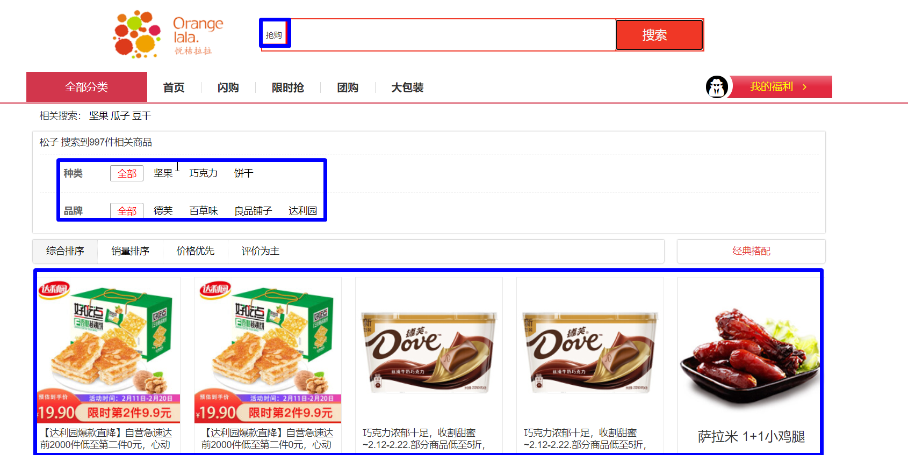

```json

```


```json

```


> 

# 1：elasticsearch应用

## 1.0：需求设计

原型：




## 1.1：域设计

>  设计维度
>
>  ```
>  * 要不要分词？
>  * 要不要建立索引？
>  * 要不要存储？
>  * 使用哪种分词器？
>  ```


```java
package com.portal.entity;

import lombok.Data;
import org.springframework.data.annotation.Id;
import org.springframework.data.elasticsearch.annotations.DateFormat;
import org.springframework.data.elasticsearch.annotations.Document;
import org.springframework.data.elasticsearch.annotations.Field;
import org.springframework.data.elasticsearch.annotations.FieldType;

import java.util.Date;
@Data
@Document(indexName = "es-goods",  shards = 1, replicas = 0)
public class ESGoods {

    @Id
    private Long spuId;                        // spuId

    

    @Field(type = FieldType.Text, analyzer = "ik_max_word",store=true)
    private String goodsName;

    @Field(type=FieldType.Long,index=true,store=true)
    private Long brandId;                       // 品牌id
    
    @Field(type = FieldType.Keyword,index=true,store=true)
    private String brandName;                   //品牌名称

     @Field(type=FieldType.Long,index=true,store=true)
    private Long cid1id;                        // 1级分类id
    @Field(type = FieldType.Keyword,index=true,store=true)
    private String cat1name;                    // 1级分类名称
   
     @Field(type=FieldType.Long,index=true,store=true)
    private Long cid2id;                        // 2级分类id
     @Field(type = FieldType.Keyword,index=true,store=true)
    private String cat2name;                    // 2级分类名称
   
    
    @Field(type=FieldType.Long,index=true,store=true)
    private Long cid3id;                        // 3级分类id
     @Field(type = FieldType.Keyword,index=true,store=true)
    private String cat3name;                    // 3级分类名称

	 @Field(type=FieldType.Date,index=true,store=true,format = DateFormat.date_time)
    private Date createTime;                    // 创建时间
    
    @Field(type=FieldType.Double,index=true,store=true)
    private Double price;                       // 价格，spu默认的sku的price
   
    @Field(type = FieldType.Keyword,index = false,store=true)
    private String imageUrl;                    // 图片地址
    
    
    
}
```


## 1.2：索引库数据初始化

### 1.2.1：spu信息接口开发

> 商品微服务提供

```java
 List<WxbGoods> findGoodsSpuInfo();
```


```XML
<?xml version="1.0" encoding="UTF-8"?>
<!DOCTYPE mapper PUBLIC "-//mybatis.org//DTD Mapper 3.0//EN" "http://mybatis.org/dtd/mybatis-3-mapper.dtd">
<mapper namespace="com.portal.goods.mapper.MallGoodsMapper">

    <!-- List<WxbGoods> findGoodsSpuInfo();-->

    <resultMap id="findGoodsSpuInfoMap" type="mallgoods">
        <result property="spuId" column="spuId"></result>
        <result property="goodsName" column="goods_name"></result>
        <result property="price" column="default_price"></result>
        <result property="typeTemplateId" column="template_id"></result>
        <result property="albumPics" column="album_pics"></result>
        <!-- 品牌-->
        <association property="brand" javaType="MallGoodsBrand">
            <id property="id" column="brand_id"></id>
            <result property="name" column="brand_name"></result>
        </association>
        <!-- 一级分类-->
        <association property="cat1" javaType="MallGoodsCat">
            <id property="id" column="cat1id"></id>
            <result property="name" column="cat1name"></result>
        </association>
        <!-- 二级分类-->
        <association property="cat2" javaType="MallGoodsCat">
            <id property="id" column="cat2id"></id>
            <result property="name" column="cat2name"></result>
        </association>
        <!-- 三级分类-->
        <association property="cat3" javaType="MallGoodsCat">
            <id property="id" column="cat3id"></id>
            <result property="name" column="cat3name"></result>
        </association>
    </resultMap>


    <select id="findGoodsSpuInfo" resultMap="findGoodsSpuInfoMap">
          SELECT
            goods.spu_id as spuId,
            goods.goods_name,
            goods.price as default_price,
            goods.album_pics,
            brand.id as brand_id,
            brand.`name` as brand_name,
            cat1.id as cat1id,
            cat1.`name` as cat1name,
            cat2.id as cat2id,
            cat2.`name` as cat2name,
            cat3.id as cat3id,
            cat3.`name` as cat3name,
            cat3.template_id

             from mall_goods goods
            LEFT JOIN mall_goods_brand brand on brand.id = goods.brand_id
            LEFT JOIN mall_goods_cat cat1 on cat1.id = goods.category1_id
            LEFT JOIN mall_goods_cat cat2 on cat2.id = goods.category2_id
            LEFT JOIN mall_goods_cat cat3 on cat3.id = goods.category3_id
			where goods.audit_status=1
    </select>


</mapper>

```


service【略】

controller【略】


### 1.2.2：搜索微服务搭建

### 1.2.3：初始化索引库数据

```java
 @Override
    public ResultVO goods2es() {

        //删除索引库
        template.deleteIndex(ESGoods.class);


        //创建索引库
        template.createIndex(ESGoods.class);
        template.putMapping(ESGoods.class);


        //获取商品信息
        List<MallGoods> goodsAudited = goodsApi.findGoodsAudited();
        if (goodsAudited == null) {
            return  new ResultVO(false, "同步失败");
        }

        List<ESGoods> list = goodsAudited.stream().map(spu -> {
            //spu->esGoods
            ESGoods esGoods = new ESGoods();
            esGoods.setSpuId(spu.getSpuId());

            esGoods.setBrandId(spu.getBrand().getId());
            esGoods.setBrandName(spu.getBrand().getName());


            esGoods.setCid1id(spu.getCat1().getId());
            esGoods.setCat1name(spu.getCat1().getName());
            esGoods.setCid2id(spu.getCat2().getId());
            esGoods.setCat2name(spu.getCat2().getName());
            esGoods.setCid3id(spu.getCat3().getId());
            esGoods.setCat3name(spu.getCat3().getName());

            esGoods.setCreateTime(new Date());
            esGoods.setGoodsName(spu.getGoodsName());
            esGoods.setPrice(spu.getPrice().doubleValue());

            if (spu.getAlbumPics() != null) {
                String[] imgArr = spu.getAlbumPics().split(",");
                if (imgArr != null && imgArr.length > 0) {
                    esGoods.setImageUrl(imgArr[0]);
                }
            }

            return esGoods;
        }).collect(Collectors.toList());


        template.save(list);

        return new ResultVO(true, "同步成功");
    }
```


## 1.3：商品搜索功能拆解

```txt
关键字搜索
   需求：关键字匹配 商品名称、品牌名称、第三级分类名称
   使用bool查询【should】 
   
```


## 1.4：关键字搜索接口开发

```java
 @Override
    public PageResult<ESGoods> search(Map searchMap) {

        //1.构建查询条件
        BoolQueryBuilder boolQueryBuilder = QueryBuilders.boolQuery();

        //match[goodsName]
        MatchQueryBuilder goodsNameQueryBuilder = QueryBuilders.
            matchQuery("goodsName",searchMap.get("keyword"));


        //match[brandName]
        MatchQueryBuilder brandNameQueryBuilder = QueryBuilders.
            matchQuery("brandName",searchMap.get("keyword"));


        //match[cat3name]
        MatchQueryBuilder cat3nameQueryBuilder = QueryBuilders.
            matchQuery("cat3name",searchMap.get("keyword"));

        boolQueryBuilder.should(goodsNameQueryBuilder);
        boolQueryBuilder.should(brandNameQueryBuilder);
        boolQueryBuilder.should(cat3nameQueryBuilder);


        PageRequest page = null;
        //2.设置分页
        if(!StringUtils.isEmpty(searchMap.get("page"))&&!StringUtils.isEmpty(searchMap.get("size"))){

            Integer pageNow = (Integer) searchMap.get("page");
            Integer size = (Integer) searchMap.get("size");

            page = PageRequest.of(pageNow-1,size);
        }

        //3.设置高亮域
        HighlightBuilder goodsNameHighLight = getHighlightBuilder("goodsName");


        NativeSearchQuery build = new NativeSearchQueryBuilder()
            .withQuery(boolQueryBuilder)
            .withPageable(page)
            .withHighlightBuilder(goodsNameHighLight)
            .build();

        SearchHits<ESGoods> result = template.search(build, ESGoods.class);


        //总记录数
        long totalHits = result.getTotalHits();
        //取当前页数据
        List<SearchHit<ESGoods>> searchHits = result.getSearchHits();
        List<ESGoods> esGoodsList = new ArrayList<>();
        searchHits.forEach(hit->{
            //取文档信息
            ESGoods content = hit.getContent();

            //取高亮
            Map<String, List<String>> highlightFields = hit.getHighlightFields();
            Set<String> keySet = highlightFields.keySet();
            keySet.forEach(key->{
                List<String> list = highlightFields.get(key);
                if("goodsName".equals(key)){
                    String highlightValue = list.get(0);
                    content.setGoodsName(highlightValue);
                }
            });
            esGoodsList.add(content);
        });


        //pageresult
        PageResult<ESGoods> pageResult = new PageResult<>();
        pageResult.setTotal(totalHits);
        pageResult.setData(esGoodsList);

        return pageResult;
    }

    // 设置高亮字段
    private HighlightBuilder getHighlightBuilder(String... fields) {
        // 高亮条件
        HighlightBuilder highlightBuilder = new HighlightBuilder(); //生成高亮查询器
        for (String field : fields) {
            highlightBuilder.field(field);//高亮查询字段
        }
        highlightBuilder.requireFieldMatch(false);     //如果要多个字段高亮,这项要为false
        highlightBuilder.preTags("<span style=\"color:red\">");   //高亮设置
        highlightBuilder.postTags("</span>");
        //下面这两项,如果你要高亮如文字内容等有很多字的字段,必须配置,不然会导致高亮不全,文章内容缺失等
        highlightBuilder.fragmentSize(800000); //最大高亮分片数
        highlightBuilder.numOfFragments(0); //从第一个分片获取高亮片段

        return highlightBuilder;
    }
```


## 1.4：前端联调

```js

	<script >

		var vm =  new Vue({
			el:"#app",
			data:{
				searchMap:{
					page:1,
					size:3,
				},
				goodsList:[],
				total:0,
				pages:0,
				
			},
			methods: {
				search(){
					wfx.http.post("/search",this.searchMap).then(res=>{
						console.log(res);
						this.goodsList = res.data;
						this.total = res.total;
						this.pages = wfx.pageTotal(this.total,this.searchMap.size);	
					})	
				},
				
			},
			created() {
			
			},	
		})

	</script>
```


```java

```


```java

         
```


