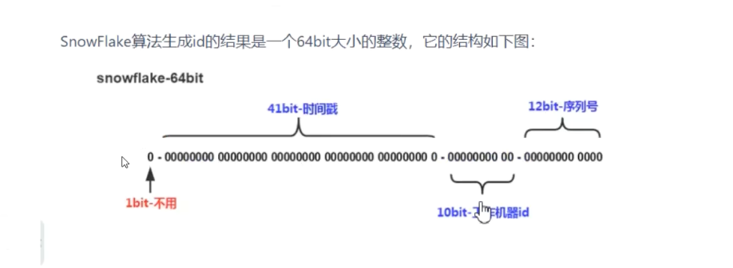

# IdWorker

本篇介绍分布式系统中订单 id 的生成策略，以及基于雪花算法的分布式 id 生成器 IdWorker 在项目中的使用。

分布式系统订单 id 生成策略的要求：

1. 不能重复，必须唯一；
2. 定长；
3. 数字组成。

常见的候选方案对比：

| 方案 | 问题 |
| --- | --- |
| UUID | 极端高并发情况下会存在 id 冲突，且不是纯数字、不定长 |
| 分布式 id 生成器 IdWorker | 雪花算法实现，分布式 id 的完美解决方案 |

## 1. IdWorker（雪花算法）

IdWorker 是分布式 id 的完美解决方案，由 Twitter 公司开源，采用的是**雪花算法（Snowflake）**。

一个 64 位的 long 型 id 从高位到低位划分为四段：



| 位段 | 位数 | 说明 |
| --- | --- | --- |
| 符号位 | 1 位 | 不用。二进制中最高位为 1 的是负数，而生成的 id 一般都是正整数，所以最高位固定是 0 |
| 时间戳 | 41 位 | 记录时间戳（毫秒）。可以表示 2⁴¹ − 1 个毫秒值（数值范围从 0 开始，所以要减 1） |
| 工作机器 id | 10 位 | 可部署 2¹⁰ = 1024 个节点，包括 5 位 datacenterId 和 5 位 workerId；5 位可表示的最大正整数是 2⁵ − 1 = 31，即用 0~31 共 32 个数字区分不同的 datacenterId 或 workerId |
| 序列号 | 12 位 | 记录同一毫秒内产生的不同 id。可表示的最大正整数是 2¹² − 1 = 4095，即同一机器同一时间截（毫秒）内最多产生 4096 个 id 序号 |

加起来刚好 64 位，为一个 Long 型。SnowFlake 的优点是整体上按照时间自增排序，并且整个分布式系统内不会产生 ID 碰撞（由数据中心 ID 和机器 ID 作区分），效率较高，经测试每秒能够产生 26 万个不重复 ID。

## 2. IdWorker 的使用

### 2.1 第一步：将 IdWorker 工具类放入 fengmi-util 工程

```java
import java.lang.management.ManagementFactory;
import java.net.InetAddress;
import java.net.NetworkInterface;

public class IdWorker {
    // 时间起始标记点，作为基准，一般取系统的最近时间（一旦确定不能变动）
    private final static long twepoch = 1288834974657L;
    // 机器标识位数
    private final static long workerIdBits = 5L;
    // 数据中心标识位数
    private final static long datacenterIdBits = 5L;
    // 机器 ID 最大值
    private final static long maxWorkerId = -1L ^ (-1L << workerIdBits);
    // 数据中心 ID 最大值
    private final static long maxDatacenterId = -1L ^ (-1L << datacenterIdBits);
    // 毫秒内自增位
    private final static long sequenceBits = 12L;
    // 机器 ID 左移 12 位
    private final static long workerIdShift = sequenceBits;
    // 数据中心 ID 左移 17 位
    private final static long datacenterIdShift = sequenceBits + workerIdBits;
    // 时间毫秒左移 22 位
    private final static long timestampLeftShift = sequenceBits + workerIdBits + datacenterIdBits;

    private final static long sequenceMask = -1L ^ (-1L << sequenceBits);
    // 上次生产 id 的时间戳
    private static long lastTimestamp = -1L;
    // 毫秒内序列号，并发控制靠 synchronized
    private long sequence = 0L;

    private final long workerId;
    // 数据标识 id 部分
    private final long datacenterId;

    public IdWorker() {
        this.datacenterId = getDatacenterId(maxDatacenterId);
        this.workerId = getMaxWorkerId(datacenterId, maxWorkerId);
    }

    /**
     * 指定机器 id 与数据中心 id 的构造器
     *
     * @param workerId     工作机器 ID
     * @param datacenterId 数据中心 ID
     */
    public IdWorker(long workerId, long datacenterId) {
        if (workerId > maxWorkerId || workerId < 0) {
            throw new IllegalArgumentException(
                String.format("worker Id can't be greater than %d or less than 0", maxWorkerId));
        }
        if (datacenterId > maxDatacenterId || datacenterId < 0) {
            throw new IllegalArgumentException(
                String.format("datacenter Id can't be greater than %d or less than 0", maxDatacenterId));
        }
        this.workerId = workerId;
        this.datacenterId = datacenterId;
    }

    /**
     * 获取下一个 ID
     *
     * @return 64 位的分布式 id
     */
    public synchronized long nextId() {
        long timestamp = timeGen();
        if (timestamp < lastTimestamp) {
            throw new RuntimeException(String.format(
                "Clock moved backwards.  Refusing to generate id for %d milliseconds", lastTimestamp - timestamp));
        }

        if (lastTimestamp == timestamp) {
            // 当前毫秒内，则 +1
            sequence = (sequence + 1) & sequenceMask;
            if (sequence == 0) {
                // 当前毫秒内计数满了，则等待到下一毫秒
                timestamp = tilNextMillis(lastTimestamp);
            }
        } else {
            sequence = 0L;
        }
        lastTimestamp = timestamp;
        // ID 偏移组合生成最终的 ID，并返回 ID
        long nextId = ((timestamp - twepoch) << timestampLeftShift)
            | (datacenterId << datacenterIdShift)
            | (workerId << workerIdShift)
            | sequence;

        return nextId;
    }

    private long tilNextMillis(final long lastTimestamp) {
        long timestamp = this.timeGen();
        while (timestamp <= lastTimestamp) {
            timestamp = this.timeGen();
        }
        return timestamp;
    }

    private long timeGen() {
        return System.currentTimeMillis();
    }

    /**
     * 获取 maxWorkerId：MAC + PID 的 hashcode 取 16 个低位
     */
    protected static long getMaxWorkerId(long datacenterId, long maxWorkerId) {
        StringBuffer mpid = new StringBuffer();
        mpid.append(datacenterId);
        String name = ManagementFactory.getRuntimeMXBean().getName();
        if (!name.isEmpty()) {
            // GET jvmPid
            mpid.append(name.split("@")[0]);
        }
        return (mpid.toString().hashCode() & 0xffff) % (maxWorkerId + 1);
    }

    /**
     * 数据标识 id 部分：根据 MAC 地址计算
     */
    protected static long getDatacenterId(long maxDatacenterId) {
        long id = 0L;
        try {
            InetAddress ip = InetAddress.getLocalHost();
            NetworkInterface network = NetworkInterface.getByInetAddress(ip);
            if (network == null) {
                id = 1L;
            } else {
                byte[] mac = network.getHardwareAddress();
                id = ((0x000000FF & (long) mac[mac.length - 1])
                    | (0x0000FF00 & (((long) mac[mac.length - 2]) << 8))) >> 6;
                id = id % (maxDatacenterId + 1);
            }
        } catch (Exception e) {
            System.out.println(" getDatacenterId: " + e.getMessage());
        }
        return id;
    }
}
```

### 2.2 第二步：初始化 Bean 到 Spring 容器

```java
@Bean
public IdWorker idWorker() {
    return new IdWorker(1, 1);
}
```

### 2.3 第三步：使用

在需要生成 id 的业务代码中直接注入并调用：

```java
long orderId = idWorker.nextId();
```

> [!TIP]
> `nextId()` 用 `synchronized` 保证并发安全；无参构造会根据 MAC 地址与进程号自动计算 datacenterId 和 workerId，多节点部署时也可以手动指定 `new IdWorker(workerId, datacenterId)` 避免重复。
