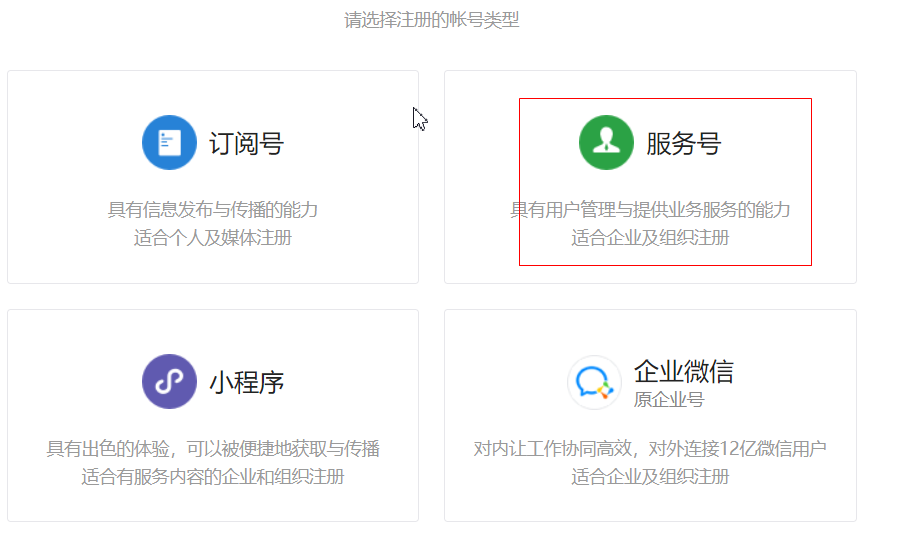
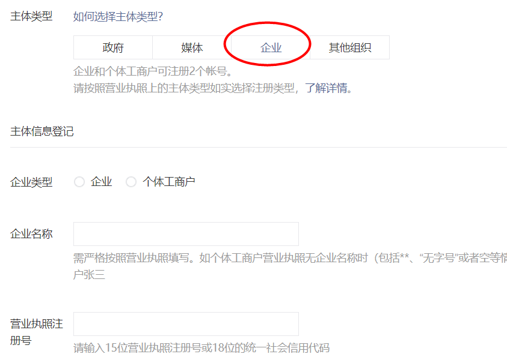

# 微信支付

本篇记录项目中接入微信扫码支付（NATIVE）的全过程：从公众号与商户平台的申请流程，到统一下单、二维码展示、订单状态查询、关闭订单，以及订单超时自动关闭的落地实现。

## 1. 微信支付简介

### 1.1 微信支付申请

#### 第一步：注册公众号（类型须为：服务号）

注册地址：<https://mp.weixin.qq.com/cgi-bin/registermidpage?action=index&lang=zh_CN&token=>



#### 第二步：认证公众号

公众号认证后才可申请微信支付，认证费：300 元/次。



#### 第三步：提交资料申请微信支付

登录公众平台，点击左侧菜单【微信支付】，开始填写资料等待审核，审核时间为 1-5 个工作日内。

#### 第四步：开户成功，登录商户平台进行验证

资料审核通过后，请登录联系人邮箱查收商户号和密码，并登录商户平台填写财付通备付金打的小额资金数额，完成账户验证。

#### 第五步：在线签署协议

本协议为线上电子协议，签署后方可进行交易及资金结算，签署完立即生效。

#### 第六步：申请成功获取密钥

申请通过后会拿到商户支付所需的三要素（以下为课程演示数据，请勿用于真实环境）：

| 参数 | 说明 | 示例值 |
| --- | --- | --- |
| 商户编号 mch_id | 微信支付商户号 | `1497984412` |
| 商户账号 AppID | 公众号/应用 AppID | `wx632c8f211f8122c6` |
| 商户 Key | API 密钥，用于签名 | `sbNCm1JnevqI36LrEaxFwcaT0hkGxFnC` |

### 1.2 微信支付开发文档

在线微信支付开发文档：<https://pay.weixin.qq.com/wiki/doc/api/index.html>

### 1.3 调用统一下单接口

第一步：pom 依赖

```xml
<dependency>
    <groupId>com.github.tedzhdz</groupId>
    <artifactId>wxpay-sdk</artifactId>
    <version>3.0.10</version>
</dependency>
<dependency>
    <groupId>commons-logging</groupId>
    <artifactId>commons-logging</artifactId>
    <version>1.2</version>
</dependency>
```

第二步：微信支付配置类（继承 sdk 的 `WXPayConfig`）

```java
package com.freemarker.demo;

import com.github.wxpay.sdk.IWXPayDomain;
import com.github.wxpay.sdk.WXPayConfig;

import java.io.InputStream;

public class WXConfig extends WXPayConfig {

    @Override
    protected String getAppID() {
        return "wx3963c4b88e10b849";
    }

    @Override
    protected String getMchID() {
        return "1535235291";
    }

    @Override
    protected String getKey() {
        return "f63be239c43f16bd52a3cf8a2fada0ea";
    }

    @Override
    protected InputStream getCertStream() {
        return null;
    }

    @Override
    protected IWXPayDomain getWXPayDomain() {
        return new IWXPayDomain() {
            @Override
            public void report(String s, long l, Exception e) {

            }

            @Override
            public DomainInfo getDomain(WXPayConfig wxPayConfig) {
                return new DomainInfo("api.mch.weixin.qq.com", true);
            }
        };
    }
}
```

第三步：测试统一下单接口，调用步骤如下：

1. 构建配置对象；
2. 封装请求参数；
3. map 转 xml；
4. 发送请求；
5. 响应结果转 map 集合；
6. 获取支付地址。

```java
// 测试统一下单接口
// 1. 构建配置对象
WXConfig config = new WXConfig();
// 2. 封装请求参数
Map<String, String> params = new HashMap<>();
params.put("appid", config.getAppID());
params.put("mch_id", config.getMchID());
params.put("nonce_str", WXPayUtil.generateNonceStr());
params.put("body", "微分销");
params.put("out_trade_no", "2020121212");
// 订单金额，单位为分
params.put("total_fee", 1 + "");
params.put("spbill_create_ip", "123.12.12.123");
params.put("notify_url", "http://192.168.234.122:8080/notify");
// NATIVE：扫码支付
params.put("trade_type", "NATIVE");
// 3. map 转 xml（带签名）
String requestXml = WXPayUtil.generateSignedXml(params, config.getKey());
// 4. 发送请求
WXPayRequest request = new WXPayRequest(config);
String resXML = request.requestWithoutCert("/pay/unifiedorder", UUID.randomUUID().toString(),
    requestXml, false);
System.out.println(resXML);

// 5. 响应 XML 结果转 map 集合
Map<String, String> resMap = WXPayUtil.xmlToMap(resXML);
// 6. 获取支付地址（二维码内容）
String codeUrl = resMap.get("code_url");
System.out.println(codeUrl);
```

### 1.4 二维码插件 qrcode.js

拿到 `code_url` 后，前端用 qrcode.js 插件把它渲染成支付二维码：

```html
<div id="qrcode"></div>

<script>
var qrcode = new QRCode("qrcode", {
    text: "http://www.runoob.com",
    width: 128,
    height: 128,
    colorDark : "#000000",
    colorLight : "#ffffff",
    correctLevel : QRCode.CorrectLevel.H
});
</script>
```

### 1.5 查询订单状态接口

调用步骤如下：

1. 构建配置对象；
2. 封装请求参数；
3. map 转 xml；
4. 发送请求；
5. 响应结果转 map 集合；
6. 获取支付状态。

```java
// 1. 构建配置对象
WXConfig config = new WXConfig();
// 2. 封装请求参数
Map<String, String> params = new HashMap<>();
params.put("appid", config.getAppID());
params.put("mch_id", config.getMchID());
params.put("out_trade_no", "2020121212");
params.put("nonce_str", WXPayUtil.generateNonceStr());
// 3. map 转 xml
String requestXML = WXPayUtil.generateSignedXml(params, config.getKey());
// 4. 发送请求
WXPayRequest request = new WXPayRequest(config);
String resXml = request.requestWithoutCert("/pay/orderquery", UUID.randomUUID().toString(),
    requestXML, false);
System.out.println(resXml);

// 5. 响应结果转 map 集合
Map<String, String> resMap = WXPayUtil.xmlToMap(resXml);
// 6. 获取支付状态（如 SUCCESS、NOTPAY）
System.out.println(resMap.get("trade_state"));
```

### 1.6 关闭订单接口

调用步骤如下：

1. 构建配置对象；
2. 封装请求参数；
3. map 转 xml；
4. 发送请求；
5. 响应结果转 map 集合；
6. 获取关闭结果。

```java
// 1. 构建配置对象
WXConfig config = new WXConfig();
// 2. 封装请求参数
Map<String, String> params = new HashMap<>();
params.put("appid", config.getAppID());
params.put("mch_id", config.getMchID());
params.put("out_trade_no", "20201212121");
params.put("nonce_str", WXPayUtil.generateNonceStr());
// 3. map 转 xml
String requestXML = WXPayUtil.generateSignedXml(params, config.getKey());
// 4. 发送请求
WXPayRequest request = new WXPayRequest(config);
String resXML = request.requestWithoutCert("/pay/closeorder", UUID.randomUUID().toString(),
    requestXML, false);
// 5. 响应结果转 map 集合
Map<String, String> resMap = WXPayUtil.xmlToMap(resXML);
// 6. 获取关闭结果
System.out.println(resMap.get("result_code"));
System.out.println(resMap.get("result_msg"));
```

## 2. 项目中的应用

### 2.1 统一下单

调用微信支付系统的统一下单接口，返回支付 url；url 返回给前端，前端生成支付二维码。

支付服务的 `pay` 方法：查询订单、按订单明细累计总金额（单位转换为分）、调用微信统一下单：

```java
@Autowired
private OrderClient orderClient;

@Value("${pay.notify_url}")
private String notifyUrl;

@Override
public Result pay(String orderId) {
    try {
        // 查询订单信息
        WxbOrder orderInfo = orderClient.findOrderInfo(orderId);

        // 计算总金额，微信支付金额单位为分
        Integer totalFee = 0;
        for (WxbOrderItems item : orderInfo.getOrderItems()) {
            Integer buyNum = item.getBuyNum();
            String skuPrice = item.getSkuPrice();
            double buyPrice = Double.parseDouble(skuPrice);
            // 单价（元） * 数量 * 100 = 金额（分）
            int itemPrice = (int) (buyNum * buyPrice * 100);
            totalFee += itemPrice;
        }
        // 调用微信的统一下单接口，下单
        String payUrl = weixinPay(orderId, totalFee, notifyUrl);

        Map<String, Object> data = new HashMap<>();
        data.put("payUrl", payUrl);
        data.put("totalFee", totalFee);
        data.put("orderId", orderId);

        return new Result(true, "下单成功", data);

    } catch (Exception e) {
        return new Result(false, "下单失败");
    }
}

/**
 * 调用微信统一下单接口，返回支付二维码内容 code_url
 */
private String weixinPay(String orderId, Integer fee, String notifyUrl) throws Exception {
    // 1. 构建配置
    WXConfig config = new WXConfig();
    // 2. 封装请求数据
    Map<String, String> requestParams = new HashMap<>();
    requestParams.put("appid", config.getAppID());
    requestParams.put("mch_id", config.getMchID());
    requestParams.put("nonce_str", WXPayUtil.generateNonceStr());
    requestParams.put("body", "微分销");
    requestParams.put("out_trade_no", orderId); // 业务系统订单号
    requestParams.put("total_fee", fee + "");   // 订单金额，单位为分
    requestParams.put("spbill_create_ip", "127.0.0.1");
    requestParams.put("notify_url", notifyUrl);
    requestParams.put("trade_type", "NATIVE");  // 扫码支付

    // 3. 将 map 转 xml 串
    String requestParamsXml = WXPayUtil.generateSignedXml(requestParams, config.getKey());

    // 4. 发请求
    WXPayRequest request = new WXPayRequest(config);
    String resultXml = request.requestWithoutCert("/pay/unifiedorder",
        UUID.randomUUID().toString(), requestParamsXml, false);
    System.out.println(resultXml);

    // 5. 将 resultXml 转 map 集合
    Map<String, String> resultMap = WXPayUtil.xmlToMap(resultXml);

    System.out.println(resultMap.get("code_url"));

    return resultMap.get("code_url");
}
```

二维码插件的使用（前端拿到 `payUrl` 后生成支付二维码）：

```js
// 生成支付二维码
var qrcode = new QRCode("qrImage", {
    text: res.data.payUrl,
    width: 256,
    height: 256,
    colorDark : "#000000",
    colorLight : "#ffffff",
    correctLevel : QRCode.CorrectLevel.H
});
```

下单时请求参数里带了 `notify_url`，微信支付成功后会向该地址异步回调支付结果，业务方在回调中完成订单状态更新，这里不再展开。

### 2.2 订单超时自动关闭（监听延时消息）

下单后如果用户长时间未支付，订单要自动关闭并释放库存。项目采用 RocketMQ 延时消息实现：下单时发送一条延时消息，消费者在延时到期后检查订单支付状态，未支付则关闭订单并释放库存。

监听延时消息：

```java
package com.fengmi.listener;

import com.api.goods.GoodsClient;
import com.fengmi.service.PayService;
import com.fengmi.vo.Result;
import org.apache.rocketmq.spring.annotation.ConsumeMode;
import org.apache.rocketmq.spring.annotation.MessageModel;
import org.apache.rocketmq.spring.annotation.RocketMQMessageListener;
import org.apache.rocketmq.spring.core.RocketMQListener;
import org.springframework.beans.factory.annotation.Autowired;
import org.springframework.stereotype.Component;

@Component
@RocketMQMessageListener(consumerGroup = "fengmi-pay-consumer-group",
    topic = "order-delay", selectorExpression = "order-delay-tag",
    consumeMode = ConsumeMode.CONCURRENTLY,
    messageModel = MessageModel.CLUSTERING)
public class ConsumerListener implements RocketMQListener<String> {

    @Autowired
    private PayService payService;

    @Autowired
    private GoodsClient goodsClient;

    @Override
    public void onMessage(String orderId) {
        System.out.println(orderId);

        // 判断订单的支付状态
        Result result = payService.findOrderStatus(orderId);

        if (result != null && result.getSuccess() && "NOTPAY".equals(result.getData())) {
            // 未支付：关闭订单
            Result closeResult = payService.closeOrder(orderId);
            if ("SUCCESS".equals(closeResult.getData())) {
                // 关闭成功后释放库存
                goodsClient.releaseStore(orderId);
            }
        }
    }
}
```

其中的关闭订单方法，复用 1.6 的关闭订单接口：

```java
// 关闭订单
public String closeOrder(String orderId) throws Exception {
    // 1. 构建配置
    WXConfig config = new WXConfig();
    // 2. 封装请求数据
    Map<String, String> requestParams = new HashMap<>();
    requestParams.put("appid", config.getAppID());
    requestParams.put("mch_id", config.getMchID());
    requestParams.put("out_trade_no", orderId);
    requestParams.put("nonce_str", WXPayUtil.generateNonceStr());
    // 3. 将 map 转 xml 串
    String requestParamsXml = WXPayUtil.generateSignedXml(requestParams, config.getKey());

    // 4. 发请求
    WXPayRequest request = new WXPayRequest(config);
    String resultXml = request.requestWithoutCert("/pay/closeorder",
        UUID.randomUUID().toString(), requestParamsXml, false);
    System.out.println(resultXml);

    // 5. 将 resultXml 转 map 集合
    Map<String, String> resultMap = WXPayUtil.xmlToMap(resultXml);

    return resultMap.get("result_code");
}
```

> [!NOTE]
> 三个接口的调用套路完全一致：构建配置 → 封装参数 → `generateSignedXml` 签名转 xml → `requestWithoutCert` 发请求 → `xmlToMap` 解析响应，区别只在接口路径（`/pay/unifiedorder`、`/pay/orderquery`、`/pay/closeorder`）和参数。
