## 一：Git简介

官网：https://git-scm.com/

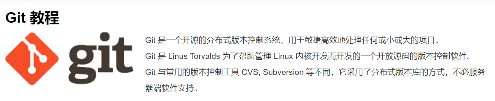


> git是`项目版本管理`与`多人协同开发`一个工具

### 1.1：项目版本管理

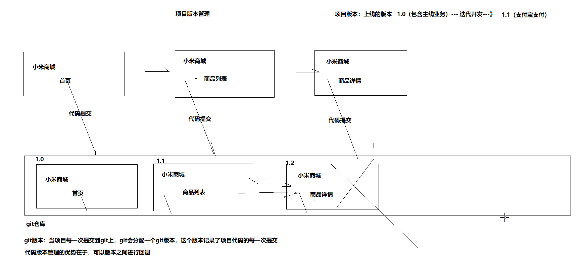


### 1.2：多人协同开发

> 一个团队开发一个项目

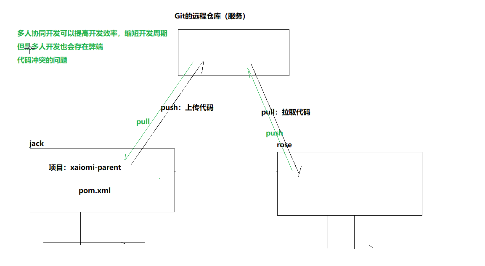


## 二：Git安装

### 3.1：下载

下载地址：<https://git-scm.com/downloads>

### 3.2：安装

> 指定一个安装目录，然后一路Next即可

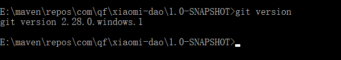


### 3.3：全局配置

> 自报家门

```shell
git config --global user.name "Your Name"  #用户名
git config --global user.email "email@example.com"  #邮箱
# 查看信息
git config -l
```


## 三：Git架构

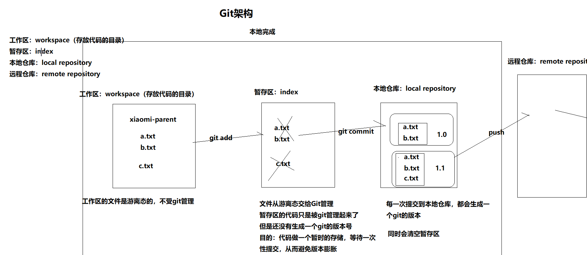


## 四：Git基本操作

>  第一步：创建工作区

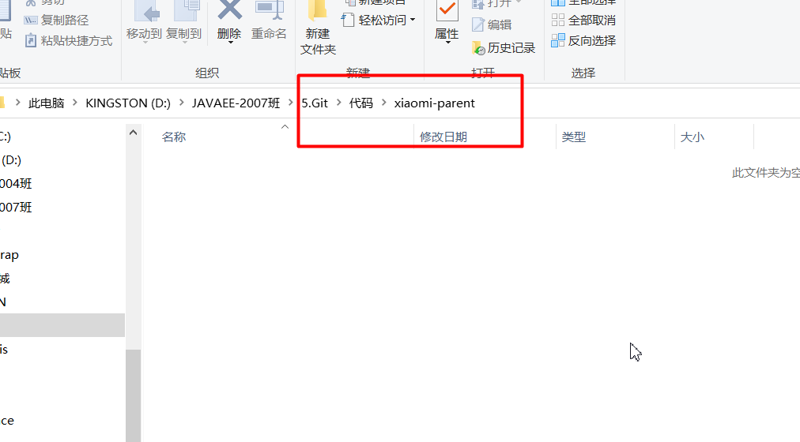


> 第二步：初始化git，生成本地仓库和暂存区

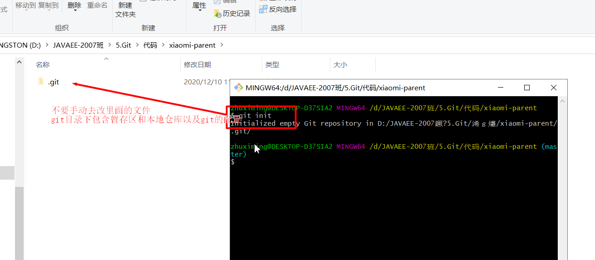


> 第三步：代码编写


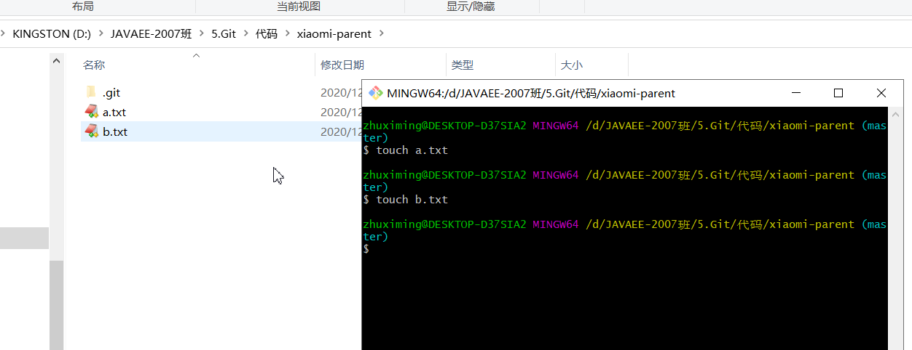


> 第四步：将文件提交到暂存区，暂时存储

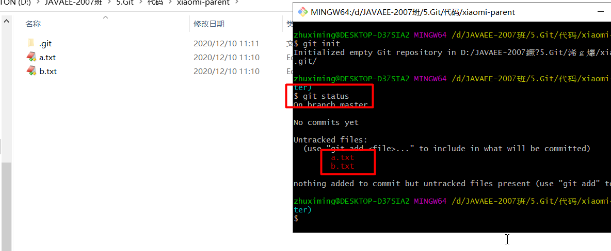

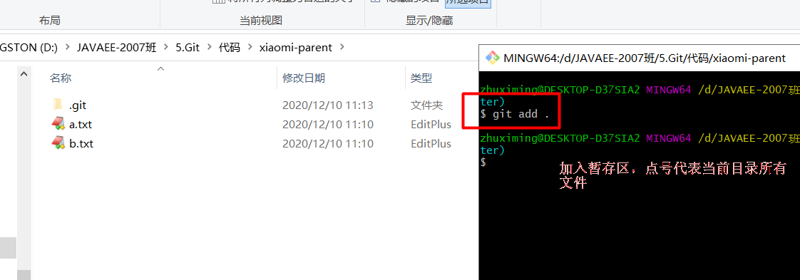


> 第五步：将暂存区的代码提交到本地仓库，生成一个git版本

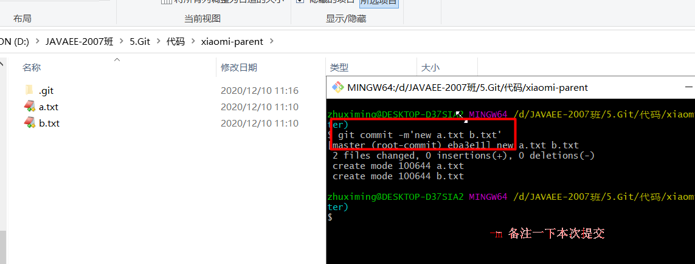


>看提交日志
>
>git log


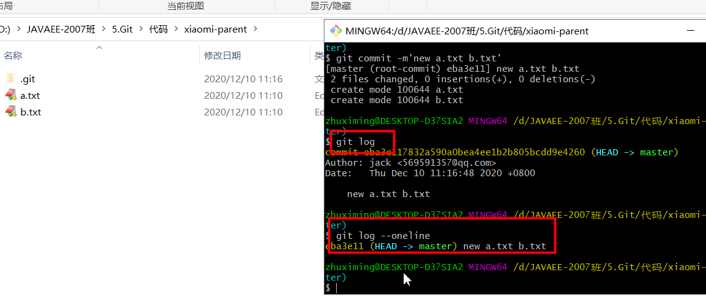

> 版本的切换
>
> git checkout 版本号

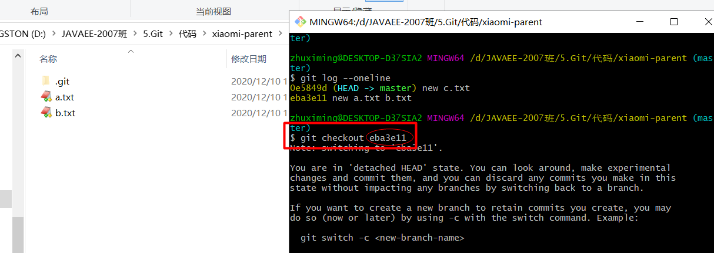


## 五：Git远程仓库

### 5.1：远程仓库选择

选择一：github(<https://github.com/>)  pass

选择二：码云(<https://gitee.com/>)  【优选】

选择三：使用GitLab搭建自己的远程仓库，企业开发首选（运维篇）


### 5.2：在码云上创建远程仓库

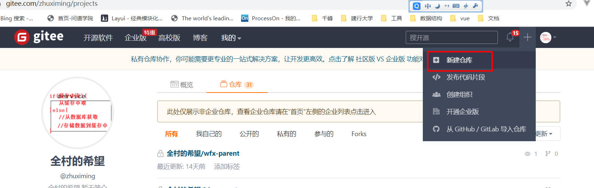


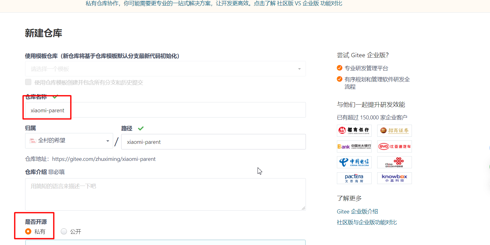

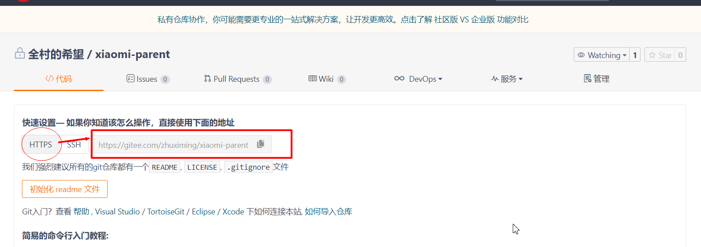


### 5.3：远程仓库操作

> push本地仓库代码到远程仓库
>
> git push  https://gitee.com/zhuximing/xiaomi-parent.git   master:master
>
> 第一个master就是本地仓库的master分支
>
> 第二个master是远程仓库的master分支
>
> 


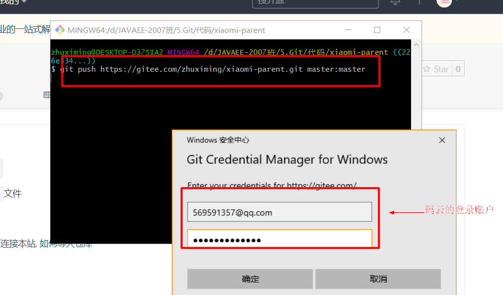


#### 5.3.1：关联远程仓库

|                  git remote add origin url                   |
| :----------------------------------------------------------: |
| 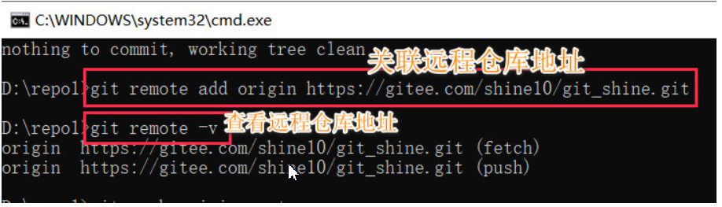 |


#### 5.3.2 ：推送文件到远程仓库

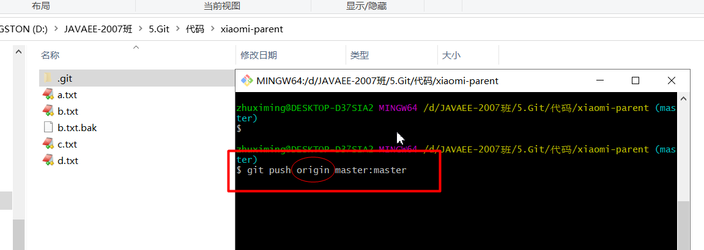


#### 5.3.3：克隆远程仓库

> 将远程仓库的代码clone到本地
>
> git clone https://gitee.com/zhuximing/xiaomi-parent.git -b master
>
> -b 表示指定远程仓库的某个分支进行克隆
>
> clone 只做一遍


#### 5.3.4：拉取远程仓库代码

> git pull origin【url】master:master
>
> 第一个master是远程仓库的master分支
>
> 第二个master是本地仓库的分支


window缓存gitee的账户

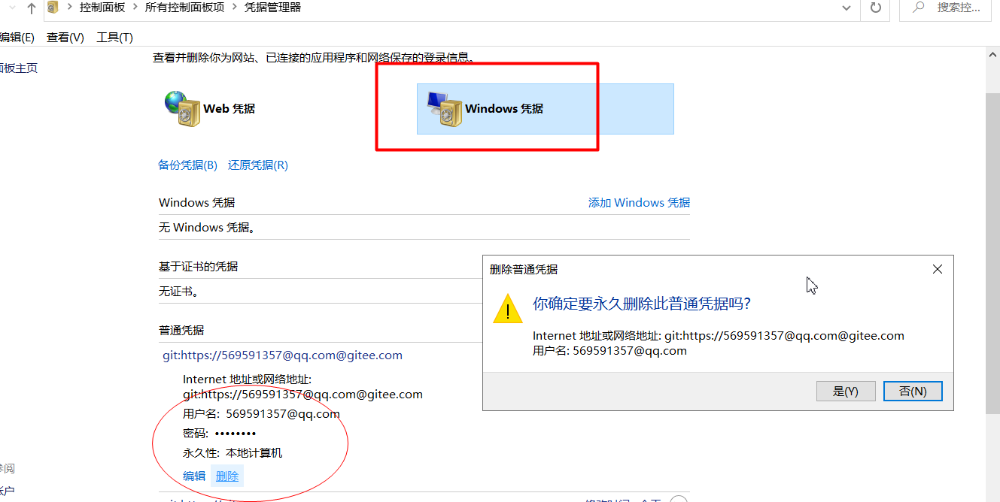


#### 5.3.5：多人协作代码冲突

演示冲突：

jack前进一步

rose也前进一步

jack   push 代码到远程仓库

rose push  代码到远程仓库

rose提示你需要先pull

rose pull代码  报错【reject】

涉及到三方合并【jack本地、rose本地、jack和rose前一个共同的版本】

三方合并的思路

第一步：git fetch origin   ======>将远程的.git信息下载到本地

第二步：git merge origin/master   ==>将远程的master手动合并到本地的master

第三步：合并报错，【conflit  合并冲突】

第四步：人工解决【协商最终的结果】

第五步：将合并的结果push到远程仓库

第六步：另一方将解决的结果pull下来

到此  冲突解决完毕！！！！！


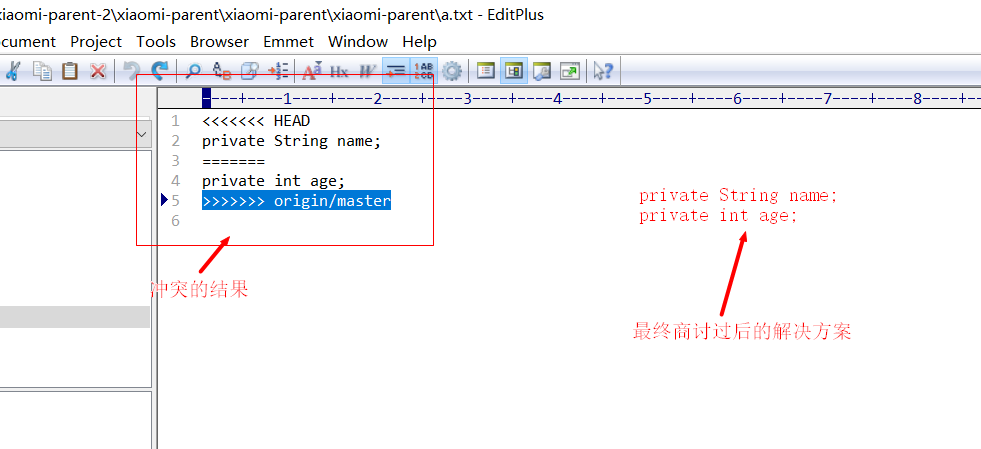


## 六：Git分支


#### 6.1：为什么要有分支

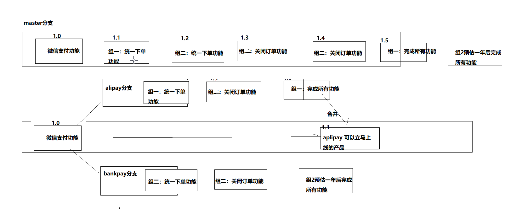


#### 6.2：查看分支

> git branch 查看本地的分支
>
> git branch -r 查看远程的分支

#### 6.3：基于master创建分支（bankpay）

> 创建分支
>
> git branch 分支名称


#### 6.4：分支切换命令

> git checkout  分支名称


#### 6.5：将bankpay分支推到远程协同开发

> git push origin bankpay:bankpay
>
> 第一个bankpay是本地仓库分支
>
> 第二个bankpay是远程仓库的分支，如果远程仓库没有该分支，会自动创建改分支


#### 6.6：aplipay分支合并到master

> 第一步：切换到master分支
>
> git checkout master
>
> 第二步：合并（bankpay->master）
>
> 在本地完成合并
>
> get merge bankpay
>
> 第三步：push到远程仓库master分支
>
> git push origin master:master


#### 


## 七：Idea中使用Git


#### 7.1 关联Git

> [File > Settings]()  关联过程是自动的

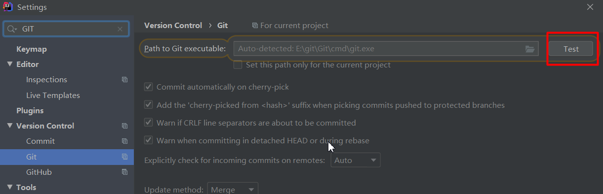


#### 7.2 创建本地仓库

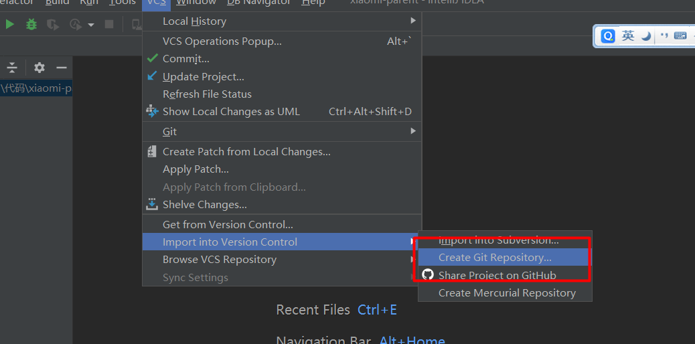


或者 


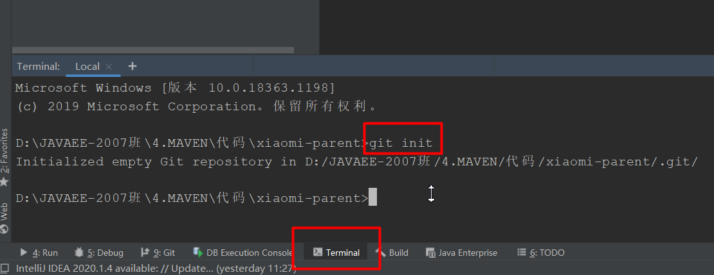


> * 新建项目后，在项目目录下创建为git仓库
>
> * 注意： 要在建仓库前，设置[忽略文件 ".gitignore"]()
>
> 	作用：被忽略的文件会被版本记录忽略，版本中不包含它们。比如.idea目录 、*.iml 、target
>
> 	范围：不需要和其他开发共享的文件，具体见下图。


忽略文件或目录【如果文件或者目录加入了忽略列表，那么在add的时候以及在commit的时候该文件或目录直接忽略掉】

第一步：下载插件

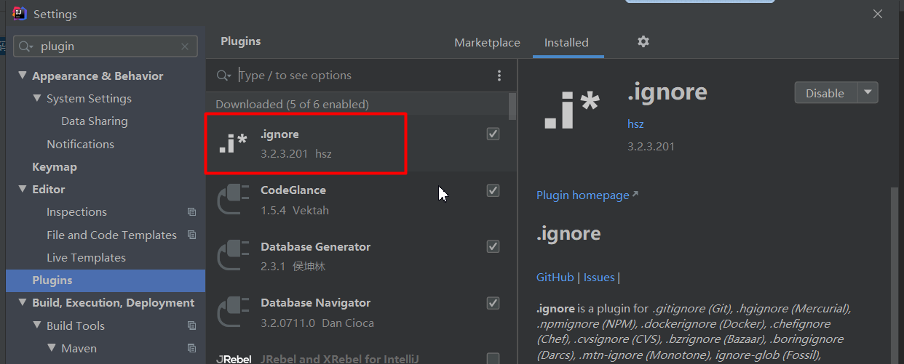


第二步：使用插件，协助创建.gitignore文件

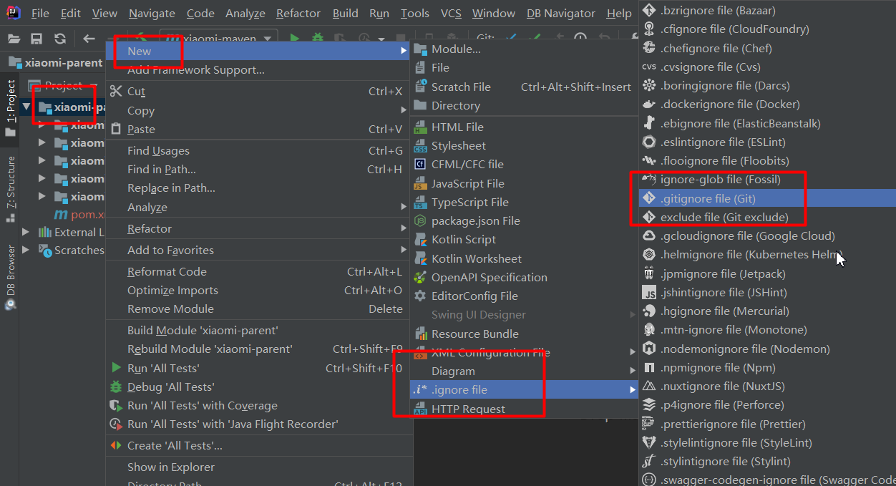


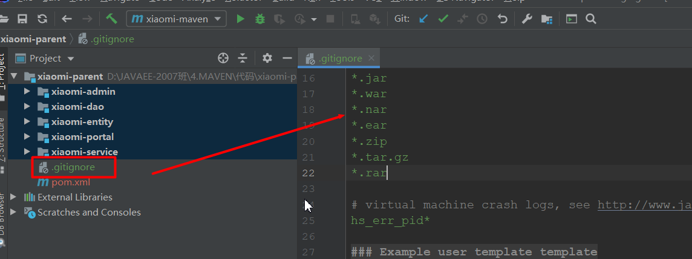


#### 7.3 提交到本地仓库

> 创建好仓库后，做第一次提交。

#### 7.4：push到远程仓库


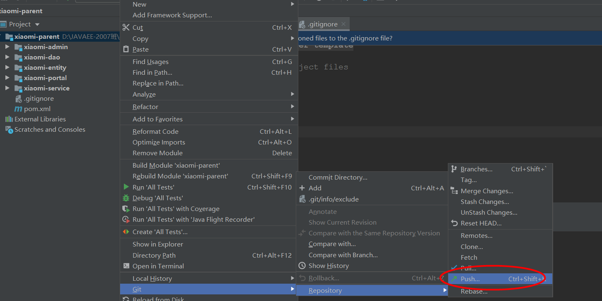


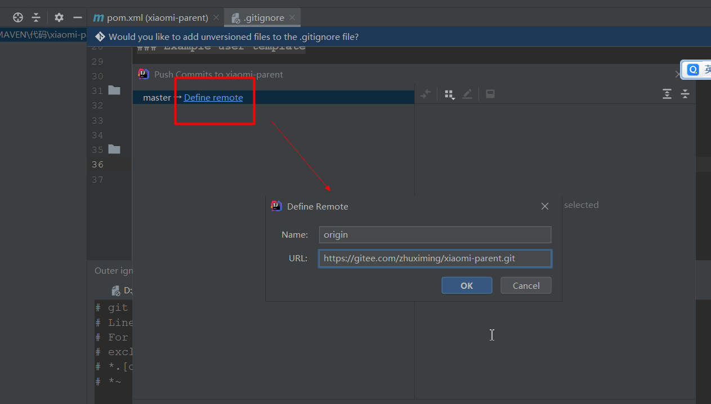


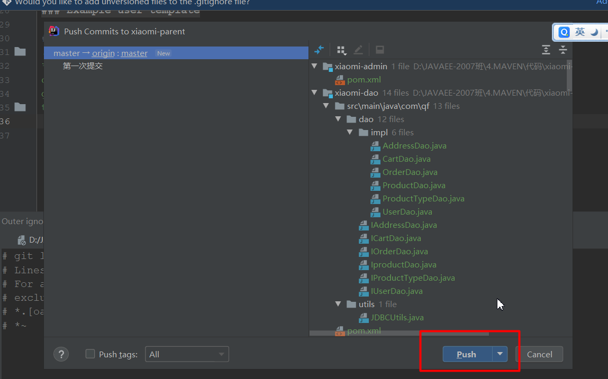


#### 7.5：克隆

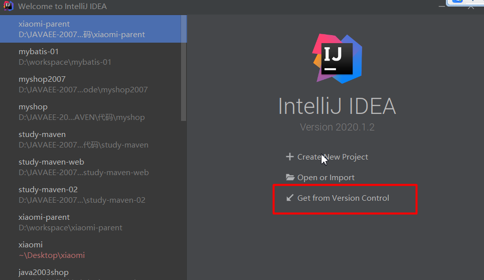


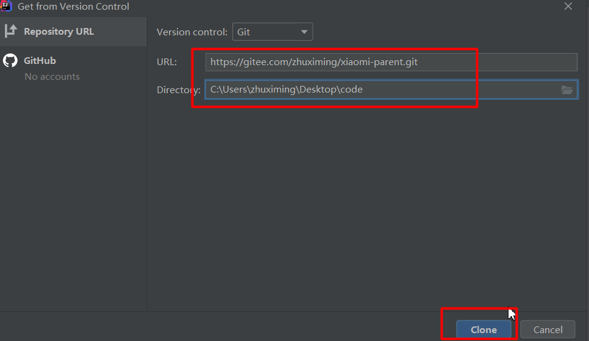


#### 7.6：协同开发


#### 7.7：冲突演示和解决


#### 7.8分支操作

##### 7.8.0：查看分支

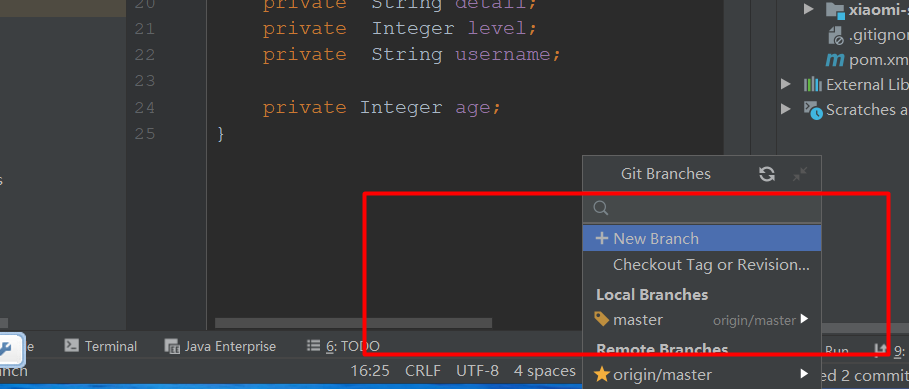

##### 7.8.1：新建分支

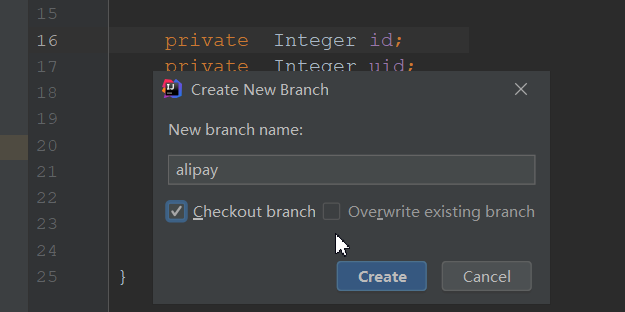


##### 7.8.2 上传分支到远程仓库


##### 7.8.3：分支合并


##### 7.8.4：合并结果push到远程


### 十、多人协同开发

---

> 多人开发协同，git操作

#### 10.1 项目管理员( 项目经理 )

> 1> 由管理员负责创建一个远程库，初始的库中什么也没有，为裸库。库的名称建议和项目同名

> 2> 管理员会在idea中创建一个初始项目,其中包含.gitignore文件。

> 3> 管理员将本地库上传到远程库，同时创建一个dev分支

> 4> 将其他开发人员拉入远程库的 [开发成员列表中]() ，使得其他开发人员可以访问该远程库。
>
> 流程如下：


> 5> master分支设置为 [protected分支]()，只有管理员有权限将代码合并到其中。dev分支设置为 [常规分支]()所有开发人员 都可以其中合并代码

|              进入分支设置               |
| :-------------------------------------: |
| 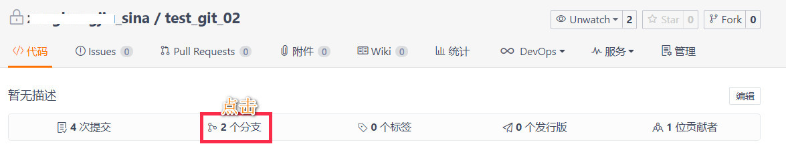 |

| 设置保护分支，让master分支不能被随更改  |
| :-------------------------------------: |
| 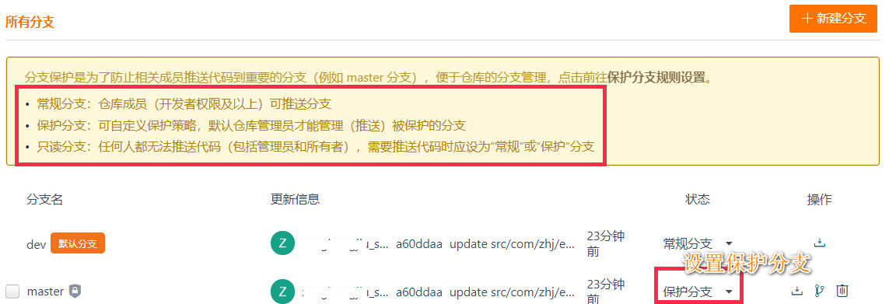 |


#### 10.2 开发人员

> * 初始化：在idea中clone 远程库，获得项目。会建立本地库
>
> 	
>
> * 后续的开发中，都要在dev分支上进行。开发完一个功能并测试通过后就commit 	 提交到本地的dev分支中，然后 上传(push)到远程dev分支中。	
>
> * 需要更新项目内容时，通过 pull 从远程仓库拉取内容。																   	
>
> * 注意：多人协同时，每次在 push 到远程库前，都先做一次pull，一来是把远程最新内容合并到本地，二来是核实本地内容是否和远程内容有冲突。
>
> * 后续的开发，会接到一个个的功能任务，往复操作 2>、3>、4> 而已。


