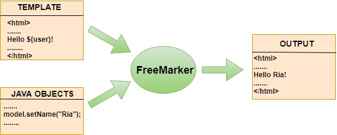
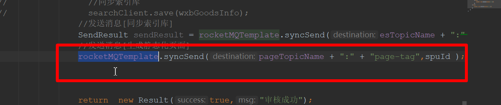
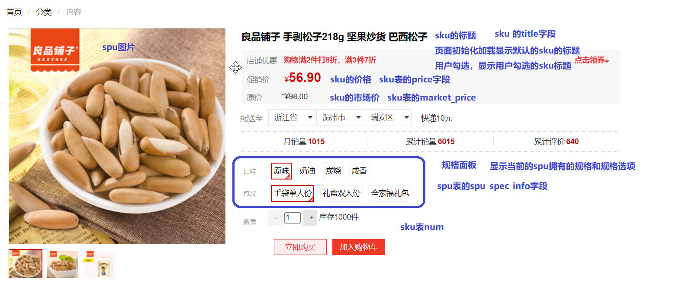

# 网页静态化技术

本篇从商品详情页的实现方案引出网页静态化技术，介绍 Freemarker 模板引擎的基本用法、Spring Boot 整合方式，以及商品详情页静态化在项目中的完整落地。

## 1. 网页静态化技术

### 1.1 商品详情页的实现方案对比

商品详情页怎么实现？常见的三种方案：

| 方案 | 做法 | 弊端 |
| --- | --- | --- |
| 方案一 | 从数据库中获取数据，然后渲染到前端 | 数据库访问压力大；数据库效率低（磁盘 IO），导致商品详情服务不稳定 |
| 方案二 | 使用 Redis 缓存 | 商品数据量太大，存在 Redis 的内存瓶颈 |
| 方案三 | 网页静态化 | 页面生成后基本不变，改动时重新生成即可，综合表现最好 |

### 1.2 什么是网页静态化技术

静态化是指把动态生成的 HTML 页面变为静态内容保存到**磁盘**，然后使用 nginx 作为静态资源的服务器。以后用户的请求到来，直接访问静态页面，不再经过服务的渲染。

### 1.3 网页静态化技术优点

1. 减轻数据库访问压力；
2. 空间换时间，访问效率更高；
3. 可以使用 nginx 作为静态资源服务器，并发量更高；
4. 静态页面更有利于网站 SEO。

### 1.4 网页静态化适合场景

页面内容生成后基本不变的场景都适合静态化，例如：

1. 商品详情页；
2. 旅游网站详情页；
3. 新闻详情页。

### 1.5 网页静态化技术方案

目前，静态化页面都是通过**模板引擎**来生成，而后保存到 nginx 服务器来部署。常用的模板引擎有：

- Freemarker
- Velocity
- Thymeleaf

本项目选用 Freemarker。

## 2. Freemarker 静态化技术

### 2.1 什么是 Freemarker

Freemarker 是 Java 编写的模板引擎，它可以将**模板页面 + 动态数据**渲染成静态 HTML 页面。



### 2.2 入门 demo

第一步：pom 依赖

```xml
<dependency>
    <groupId>org.freemarker</groupId>
    <artifactId>freemarker</artifactId>
    <version>2.3.30</version>
</dependency>
```

第二步：代码

生成静态页面的思路：

1. 构建 `Configuration` 对象；
2. 设置模板文件目录（Directory）；
3. 设置字符集；
4. 获取模板对象；
5. 创建模型数据；
6. 创建输出流（`FileWriter`）对象；
7. 输出；
8. 关闭。

```java
// 1. 构建 Configuration 对象
Configuration configuration = new Configuration(Configuration.getVersion());
// 2. 设置模板文件目录（Directory）
configuration.setDirectoryForTemplateLoading(
    new File("D:\\JAVAEE-2201班\\门户系统微服务架构代码\\wfx-parent\\study-freemarker\\src\\main\\resources"));
// 3. 设置字符集
configuration.setDefaultEncoding("utf-8");
// 4. 获取模板对象
Template template = configuration.getTemplate("demo.ftl");
// 5. 创建模型数据
Map<String, Object> data = new HashMap<String, Object>() {{
    put("name", "张三丰");
}};
// 6. 创建输出流（Writer）对象
Writer out = new FileWriter("e:\\demo.html");
// 7. 输出
template.process(data, out);
// 8. 关闭
out.close();
```

### 2.3 Freemarker 常用指令

模板页语法识别命名空间：`xmlns="http://www.w3.org/1999/xhtml"`。

指令学习手册：<https://freemarker.foofun.cn/ref_directive_if.html>

if 指令（`gt` 表示大于）：

```html
<#if goodsPrice gt 99 >
    <p>太贵了 买不起!!</p>
</#if>
```

for 循环（list 指令）：

```html
<#list goodsList as goods>
    <p>${goods.goodsName}</p>
</#list>
```

内建函数参考文档：<https://freemarker.foofun.cn/ref_directive_if.html>

> [!NOTE]
> Freemarker 内建函数写在变量后面，如 `${goods.goodsName?upper_case}` 转大写、`${price?string("0.00")}` 格式化数字，遇到空值取值报错时可用 `xxx!默认值` 或 `xxx?if_exists` 处理。

## 3. Spring Boot 整合 Freemarker

### 3.1 pom 依赖

```xml
<dependency>
    <groupId>org.springframework.boot</groupId>
    <artifactId>spring-boot-starter-web</artifactId>
</dependency>

<!-- freemarker -->
<dependency>
    <groupId>org.springframework.boot</groupId>
    <artifactId>spring-boot-starter-freemarker</artifactId>
</dependency>

<dependency>
    <groupId>org.springframework.boot</groupId>
    <artifactId>spring-boot-starter-test</artifactId>
</dependency>
```

### 3.2 配置

```properties
# 指定模板文件的目录
spring.freemarker.template-loader-path=classpath:/templates/
# freemarker 空值的处理：默认以 ${xxx} 取值时遇 null 会报错，一般采用 ${xxx?if_exists} 处理，
# 简单起见可直接开启 classic_compatible，空值不报错
spring.freemarker.settings.classic_compatible=true
```

### 3.3 测试

整合后 `Configuration` 对象由容器管理，通过 `FreeMarkerConfig` 注入获取，无需手动构建：

```java
import freemarker.template.Configuration;
import freemarker.template.Template;
import org.junit.Test;
import org.junit.runner.RunWith;
import org.springframework.beans.factory.annotation.Autowired;
import org.springframework.boot.test.context.SpringBootTest;
import org.springframework.test.context.junit4.SpringRunner;
import org.springframework.web.servlet.view.freemarker.FreeMarkerConfig;

import java.io.FileWriter;
import java.io.Writer;
import java.util.ArrayList;
import java.util.HashMap;
import java.util.List;
import java.util.Map;

/**
 * Freemarker 生成静态页面测试
 *
 * @author zhuximing
 */
@SpringBootTest
@RunWith(SpringRunner.class)
public class FreemarkerTest {

    @Autowired
    private FreeMarkerConfig freeMarkerConfig;

    @Test
    public void test1() throws Exception {
        Configuration configuration = freeMarkerConfig.getConfiguration();

        // 1. 获取模板对象
        Template template = configuration.getTemplate("demo.ftl");
        // 2. 创建模型数据
        Student jack = new Student(12, "jack");
        Student rose = new Student(12, "rose");
        Student maoden = new Student(120, "毛邓");

        List<Student> stus = new ArrayList<Student>() {{
            add(jack);
            add(rose);
            add(maoden);
        }};

        Map<String, Object> data = new HashMap<String, Object>() {{
            put("age", 19);
            put("stus", stus);
        }};

        // 3. 创建输出流（Writer）对象
        Writer out = new FileWriter("e:\\demo1.html");
        // 4. 输出
        template.process(data, out);
        // 5. 关闭
        out.close();
    }
}
```

## 4. 商品详情页静态化实现

### 4.1 实现思路（流程）

商品审核通过后发送 MQ 消息 → 静态化微服务监听消息 → 用 Freemarker 渲染商品模板生成静态 HTML → 保存到磁盘 → 由 nginx 对外提供静态页面访问。

### 4.2 商品审核发送消息

商品审核通过后，由商品微服务向 RocketMQ 发送消息，通知静态化微服务生成页面：



### 4.3 搭建静态化微服务

pom 依赖：

```xml
<dependency>
    <groupId>org.springframework.boot</groupId>
    <artifactId>spring-boot-starter-web</artifactId>
</dependency>
<!-- 端点监控，暴露了一些 http 接口，可以让注册中心监控本服务的健康状态 -->
<dependency>
    <groupId>org.springframework.boot</groupId>
    <artifactId>spring-boot-starter-actuator</artifactId>
</dependency>
<!-- nacos 服务注册与发现场景依赖 -->
<dependency>
    <groupId>com.alibaba.cloud</groupId>
    <artifactId>spring-cloud-starter-alibaba-nacos-discovery</artifactId>
</dependency>
<dependency>
    <groupId>com.wfx</groupId>
    <artifactId>wfx-entity</artifactId>
    <version>1.0-SNAPSHOT</version>
</dependency>
<dependency>
    <groupId>com.wfx</groupId>
    <artifactId>wfx-api</artifactId>
    <version>1.0-SNAPSHOT</version>
</dependency>
<dependency>
    <groupId>org.apache.rocketmq</groupId>
    <artifactId>rocketmq-spring-boot-starter</artifactId>
    <!-- 2.1.0 对应的 mq 是 4.6.x -->
    <version>2.1.0</version>
</dependency>

<!-- freemarker -->
<dependency>
    <groupId>org.springframework.boot</groupId>
    <artifactId>spring-boot-starter-freemarker</artifactId>
</dependency>
```

配置信息：

```properties
# 服务注册与发现
server.port=8203
spring.application.name=wfx-page
spring.cloud.nacos.server-addr=localhost:8848
spring.cloud.nacos.discovery.namespace=sit
spring.cloud.nacos.discovery.group=DEFAULT_GROUP

# mq 的配置
# 指定 nameServer
rocketmq.name-server=127.0.0.1:9876

# freemarker 的配置
# 指定模板文件的目录
spring.freemarker.template-loader-path=classpath:/templates/
# 空值处理：classic_compatible=true 时空值不报错
spring.freemarker.settings.classic_compatible=true
```

监听器（监听商品审核消息，生成静态化页面）：

```java
package com.wfx.listener;

import com.wfx.entity.WxbGoods;
import freemarker.template.Configuration;
import freemarker.template.Template;
import org.apache.rocketmq.spring.annotation.ConsumeMode;
import org.apache.rocketmq.spring.annotation.MessageModel;
import org.apache.rocketmq.spring.annotation.RocketMQMessageListener;
import org.apache.rocketmq.spring.core.RocketMQListener;
import org.springframework.beans.factory.annotation.Autowired;
import org.springframework.stereotype.Service;
import org.springframework.web.servlet.view.freemarker.FreeMarkerConfig;

import java.io.FileWriter;
import java.io.Writer;
import java.util.HashMap;
import java.util.Map;

/**
 * 商品静态化监听器：收到审核通过的商品消息后，渲染模板生成静态页面
 */
@Service
@RocketMQMessageListener(consumerGroup = "wfx-page-consumer",
    topic = "goods-2-page", selectorExpression = "page-tag",
    consumeMode = ConsumeMode.CONCURRENTLY,
    messageModel = MessageModel.BROADCASTING)
public class PageListener implements RocketMQListener<String> {

    @Autowired
    private FreeMarkerConfig freeMarkerConfig;

    @Override
    public void onMessage(String spuId) {
        try {
            // 生成静态化页面
            Configuration configuration = freeMarkerConfig.getConfiguration();
            Template template = configuration.getTemplate("introduction.ftl");

            // 模型数据：根据 spuId 查询商品信息装入 data（此处省略查询过程）
            Map<String, Object> data = new HashMap<>();

            // 创建输出流（Writer）对象，直接写到 nginx 的静态页面目录
            Writer out = new FileWriter("E:\\nginx-1.18.0\\nginx-1.18.0\\goods-page\\1.html");
            // 输出
            template.process(data, out);
            // 关闭
            out.close();
        } catch (Exception e) {
            e.printStackTrace();
        }
    }
}
```

### 4.4 nginx 代理静态化页面

静态页面生成到 nginx 目录后，配置一个 server 块，用独立域名提供商品详情页访问：

```text
server {
    listen       80;
    server_name  item.wfx.com;
    location / {
        root   goods-page;
        index  index.html index.htm;
    }
}
```



### 4.5 页面中的规格选择与 sku 展示

静态页面内容是固定的，但同一个 spu 有多个 sku（规格组合），页面上的规格面板与 sku 信息需要靠前端 JS 在静态页内完成切换。

#### 4.5.1 显示规格面板

规格数据来自 spu 表的 `spu_spec_info` 字段（fengmi-goods 服务提供），形如：

```json
[{"name":"口味","opts":["原味","咸香"]},{"name":"包装","opts":["情侣装","全家福"]}]
```

渲染时遍历该数据即可展示规格面板。

#### 4.5.2 规格面板选择

用户点选某个规格项时，把选择记录到 `chooseSpecInfo`：

```js
chosespec(spec, opt) {
    this.chooseSpecInfo[spec] = opt;
}
```

#### 4.5.3 生成 sku 列表变量

静态化时把该 spu 下所有 sku 一次性输出到页面的 JS 变量里（Freemarker 的 `?c` 内建函数保证数字不加千分位、不带科学计数法）：

```html
<script>
    var skuInfos = [
        <#list skus as sku>
            {
                id: "${sku.skuId?c}",
                title: "${sku.skuTitle}",
                price: ${sku.skuPrice?c},
                spec: ${sku.skuSpec},
                marketPrice: ${sku.skuMarketPrice?c},
                num: ${sku.skuStock?c}
            },
        </#list>
    ]
</script>
```

#### 4.5.4 动态展示 sku 信息

用户选完规格后，用 `chooseSpecInfo` 与每个 sku 的 `spec` 比对，匹配上的 sku 就是用户当前选择的商品：

```js
// 判断两个 json 对象是否完全相等
matchJsonObj(json1, json2) {
    if (Object.keys(json1).length != Object.keys(json2).length) {
        return false;
    }
    for (var k in json1) {
        if (json1[k] != json2[k]) {
            return false;
        }
    }
    return true;
}
```

> [!TIP]
> 这就是"静态页面 + 前端 JS"的经典分工：商品介绍等不变内容由静态化固化，规格、价格等交互信息由页面内嵌的 sku 数据在前端完成匹配与切换，既享受静态页的高并发能力，又保留了交互体验。
