# 二：Redis简介

## 2.1：Redis简介

官网：https://redis.io/

```txt
Redis is an open source (BSD licensed), in-memory data structure store, used as a database, cache, and message broker. Redis provides data structures such as strings, hashes, lists, sets, sorted sets with range queries, bitmaps, hyperloglogs, geospatial indexes, and streams. Redis has built-in replication, Lua scripting, LRU eviction, transactions, and different levels of on-disk persistence, and provides high availability via Redis Sentinel and automatic partitioning with Redis Cluster
```


> Redis 是完全开源的，C语言编写，基于内存，是一个高性能的 Nosql（非关系型） 数据库。

```txt
一.关系型数据库（mysql、oracle、PostgreSQL）
定义：关系型数据库最典型的数据结构是表，由二维表及其之间的联系所组成的一个数据组织.
【优点：】
1.易于维护：都是使用表结构，格式一致；
2.使用方便：SQL语言通用，可用于复杂查询，可用于一个表及多个表之间非常复杂关联查询；
【缺点：】
1.关系型数据库操作的是磁盘，硬盘I/O是一个很大的瓶颈
2.固定的表结构，灵活度稍欠；


稀疏型
{name:'jack'}
{course:'java'}
{name:'jack,sex:'1'}

二.非关系型数据库（Redis(KV)、Memcache（KV）、ElasticSearch(JSON)）
定义：非关系型数据库是一种数据结构化存储方法的集合，可以是文档或者键值对。
【优点：】
1.格式灵活：存储数据的格式可以是key,value形式、文档形式。
2.速度快：nosql可以使用内存存储，而关系型数据库只能使用硬盘；
【缺点：】
不支持sql，数据间没有关联关系
```


## 2.2：Redis特性

```txt
1、性能极高 – Redis 读的速度是110000次/s,写的速度是81000次/s 。
2、丰富的数据类型 – Redis支持五种数据类型：string（字符串），hash（哈希），list（列表），set（集合）及zset(sorted set：有序集合)
3、原子 – Redis的所有操作都是原子性的，意思就是要么成功执行要么失败完全不执行。单个操作是原子性的。多个操作也支持事务 
4、丰富的特性 – Redis还支持 publish/subscribe, 通知, key 过期等等特性。
```


```txt
Redis 与其他 key - value（Memcache） 缓存产品有以下三个特点：
1：Redis支持数据的持久化，可以将内存中的数据保存在磁盘中，重启的时候可以再次加载进行使用。
2：Redis不仅仅支持简单的key-value类型的数据，同时还提供list，set，zset，hash等数据结构的存储。
3：Redis支持数据的备份，即master-slave模式的数据备份。
```


## 2.3：Redis:使用场景

```txt
1：查询缓存
2：分布式锁 setnx
3：秒杀活动数据存储(将Redis当做database来存储商品信息以及用户的下单信息)
4：注册、登录 使用Redis存储验证码（Redis的key可以设置过期时间）
```


# 三：Redis安装

## Window安装Redis

> 下载地址：https://github.com/microsoftarchive/redis/releases

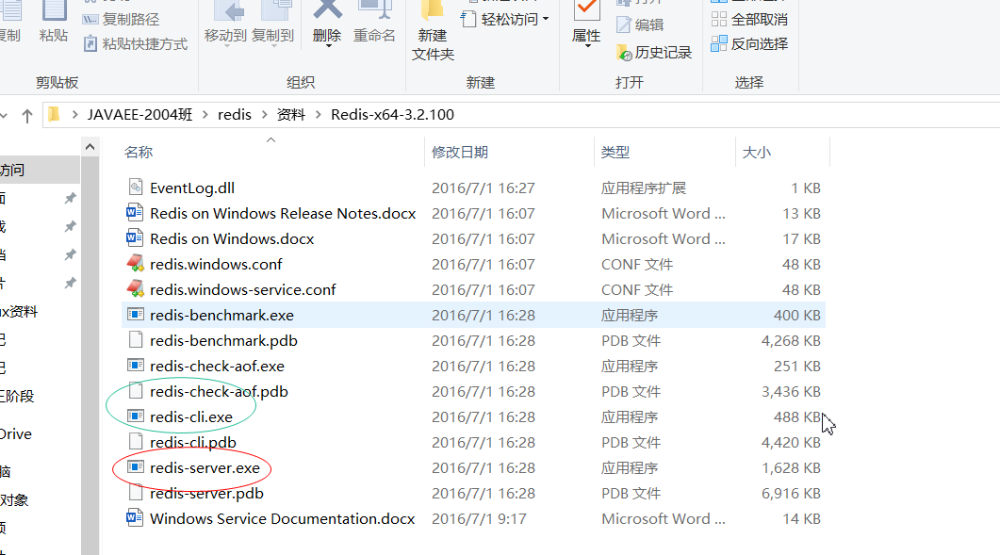

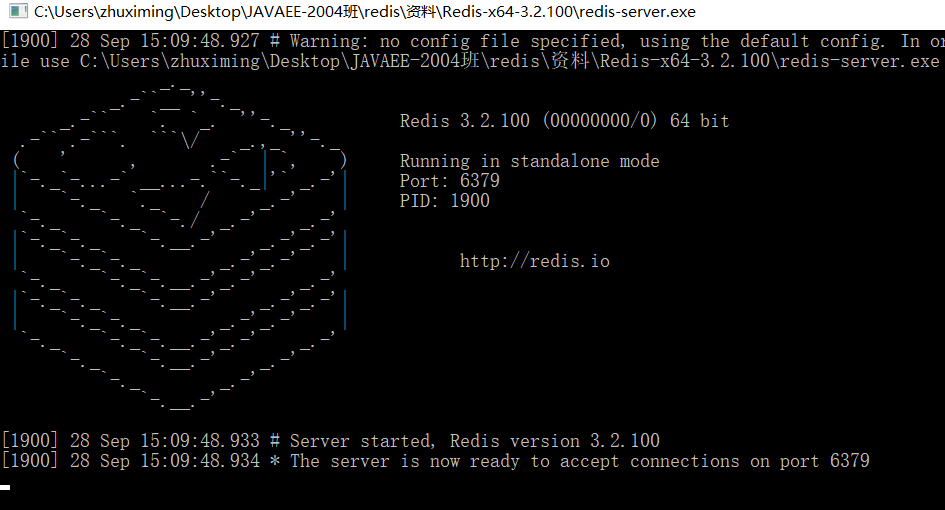


## Linux安装Redis

> redis-6.0.8.tar.gz
>
> 注意：redis6版本要求gcc版本必须5.3以上，centos7默认安装的版本是4.8.5，查看gcc版本命令 gcc-v

升级gcc,以下每行命令依次执行即可升级gcc到9.3.1

```she
yum -y install centos-release-scl
yum -y install devtoolset-9-gcc devtoolset-9-gcc-c++ devtoolset-9-binutils
scl enable devtoolset-9 bash
echo "source /opt/rh/devtoolset-9/enable" >>/etc/profile　　--使永久生效

yum install tcl -y
```


上传redis的压缩包到服务器,并解压 

（如果之前安装过，server下有redis*，先到server下，执行rm -rf ./redis* *  ）

```shell
[root@zhuxm01 soft]# tar -zxvf redis-6.0.8.tar.gz  -C /export/server/
```


编译（ 在redis的解压路径执行以下命令)

```shell
[root@zhuxm01 redis-6.0.8]# cd /export/server/redis-6.0.8/
[root@zhuxm01 redis-6.0.8]# make
```


安装

```shell
[root@zhuxm01 redis-6.0.8]# cd /export/server/redis-6.0.8/
[root@zhuxm01 redis-6.0.8]# make PREFIX=/export/server/redis install
```

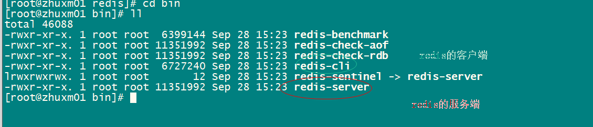

前台启动(先切换到 /export/server/redis/bin，在执行./redis-server)

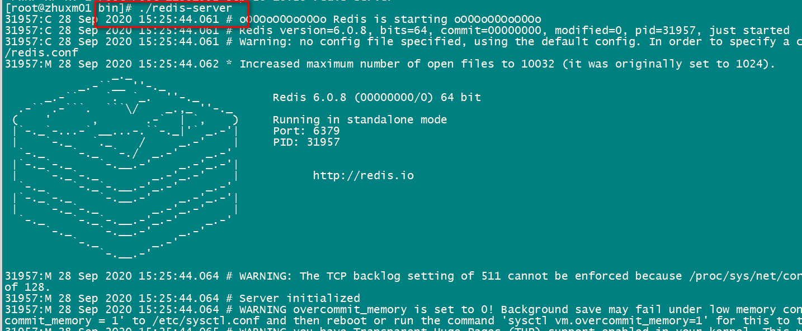


# 四：Redis数据类型

> K  string
>
> V   String 

## 4.1：String

```shell
set k v
get k
del k
strlen k
#自加、自减
incr article
incrby article 3
decr article
decyby article

#value字符串操作
getrange name 0 -1 #取整个字符串
getrange name 0  1
setrange name 0 x

# SETEX 是一个原子性(atomic)操作，设置值和设置生存时间两个动作会在同一时间内完成
SETEX pro 10 华为    （查看剩余时间ttl pro）   
set pro 华为
expire pro 10


#在分布式系统里面可以使用如下命令实现分布式锁
setnx(set if not exist)

如果返回1：设置成功
如果返回0：设置失败

```


## 4.2：List

> K  string
>
> V   List
>
> list特点：有序、可重复

```shell
存
lpush num 1 2 3 4 5
rpush num2 1 2 3 4 5
查
lrange num 0 -1
lrange num2 0 -1
#根据下标获取元素
LINDEX key index

弹出（获取数据的同时将数据从list中删除）
lpop
rpop

大小
LLEN key


#队列:先进先出
lpush num3 1 2 3  #左边推进去
rpop num3 1       #右边取出来
或者
rpush num4 1 2 3
lpop num4


#栈:先进后出
lpush num5 1 2 3
lpop num5
或者
rpush num6 1 2 3
rpop num6

#list的长度
llen num5
```


## 4.3：Set

> K  string
>
> V   Set
>
> set特点：无序，不可重复

```shell
存
sadd ips '192.168.22.1' '192.168.22.2' '192.168.22.2'
查
smembers ips
SISMEMBER key member

删
srem ips '192.168.22.1'
大小
scard ips #获取set的长度


#随机
sadd nums 3 4 5 0 9 8 9 0 8 6 
srandmember nums 3
#随机并移除
spop rands 3


交集
redis 127.0.0.1:6379> SADD myset "hello"
(integer) 1
redis 127.0.0.1:6379> SADD myset "foo"
(integer) 1
redis 127.0.0.1:6379> SADD myset "bar"
(integer)
redis 127.0.0.1:6379> SADD myset2 "hello"
(integer) 1
redis 127.0.0.1:6379> SADD myset2 "world"
(integer) 1
redis 127.0.0.1:6379> SINTER myset myset2
1) "hello"

并集
redis> SADD key1 "a"
(integer) 1
redis> SADD key1 "b"
(integer) 1
redis> SADD key1 "c"
(integer) 1
redis> SADD key2 "c"
(integer) 1
redis> SADD key2 "d"
(integer) 1
redis> SADD key2 "e"
(integer) 1
redis> SUNION key1 key2
1) "a"
2) "c"
3) "b"
4) "e"
5) "d"
redis> 

```


## 4.4：Hash

> K  string
>
> V   Hash
>
> hash特点：hash的key不能重复，如果重复就覆盖

```shell
存
hset person name 'jack'
hset person age 40
取
hget person name
hget person age

存多个
hmset person name 'rose' age 12
大小
hlen person
判断k是否存在
hexists person age


hkeys person
hvals person

person  "{'name':'zhangsan'}"

#hash可以大大减少redis中的K  同时hash结构特别适合存放对象
person :
        name   'jack'
        age   '18' 
hget  person age

```


## 4.5：Zset(sorted set)

> K  string
>
> V   ZSet
>
> zset特点：有序，不可重复，通过score来进行排序，score必须是数字

```shell
通过score进行排序
zadd hot 300 '华为met10' 10 '苹果10'  19 '小米'
zrange hot 0 -1
zrevrange hot 0 -1

#分数范围过滤
zrangebyscore hot 11 100
zrangebyscore hot 10 100 limit 0 1


#删除
zrem hot '小米'
zcard hot #查看集合的元素个数


```


# 五：其他指令

```shell
#########################key相关指令##############
keys parttern
127.0.0.1:6379> keys art*
1) "article2"
2) "artile1"
127.0.0.1:6379> 

#如果存在返回1，否则返回0
exists key


del key

#给key设置过期时间
expire key seconds
#查看key的剩余时间  -1：表示没有过期时间  >0 表示剩余的时间 -2:过期，数据被回收
ttl key
#不设置过期时间，让它常驻内存
persist key 


################db相关的指令##########################

Redis有16个db  分别为0，1,...,15【redis的默认数据库为0】
#切换数据库
select index
#清空数据库
flushdb
#清空所有的数据库
flushall
#数据库的数据总条数
dbsize

#最近一次保存数据的时间戳
lastsave

```


# 六：Redis事务

> Redis中的事务跟mysql不一样，mysql可以保证acid 但是redis的事务在运行时异常不能保证原子性，只能在编译时异常保证原子性
>

```shell
mutli #开启事务
exec #提交事务
discard #回滚事务
```


```shell
#正常事务提交
127.0.0.1:6379> multi 
OK
127.0.0.1:6379> set name jack
QUEUED
127.0.0.1:6379> get name
QUEUED
127.0.0.1:6379> set age 18
QUEUED
127.0.0.1:6379> exec
#redis事务保证顺序执行、同时一起执行

```


```shell
#放弃事务

127.0.0.1:6379> multi
OK
127.0.0.1:6379> set name sdf
QUEUED
127.0.0.1:6379> set age 12
QUEUED
127.0.0.1:6379> discard

```


```shell
#编译时异常,回滚
127.0.0.1:6379> multi 
OK
127.0.0.1:6379> set name 123
QUEUED
127.0.0.1:6379> kset xx sdf
ERR unknown command `kset`, with args beginning with: `xx`, `sdf`, 

127.0.0.1:6379> set age 21
QUEUED
127.0.0.1:6379> exec
EXECABORT Transaction discarded because of previous errors.

```

```shell
#运行时异常，不回滚
127.0.0.1:6379> multi
OK
127.0.0.1:6379> set name jack
QUEUED
127.0.0.1:6379> incr name
QUEUED
127.0.0.1:6379> set age 12
QUEUED
127.0.0.1:6379> exec
OK
ERR value is not an integer or out of range

OK
127.0.0.1:6379> get age
12
```


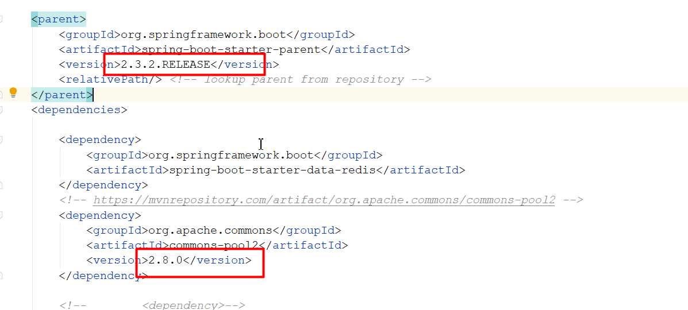


```java
@Test
    public void  test6(){

        try {

            template.setEnableTransactionSupport(true);

            template.multi();

            template.boundValueOps("name").set("rose");


            template.boundValueOps("age").set("88");


            template.exec();

        } catch (Exception exception) {
            exception.printStackTrace();

            template.discard();
        }


    }
```


# 七：Jedis

## pom依赖

```xml
<dependency>
    <groupId>redis.clients</groupId>
    <artifactId>jedis</artifactId>
     <version>3.0.0</version>
</dependency>
```

## java代码

```java
@Test
    public void testRedis (){

        Jedis jedis = new Jedis("192.168.234.122", 6379);
        jedis.set("name", "jack");
        System.out.println(jedis.get("name"));
        jedis.close();

    }

 @Test
    public void testJedispwd (){

        Jedis jedis = new Jedis("192.168.234.131",6379);
        jedis.auth("123456");
        jedis.set("name","jack");
        String name = jedis.get("name");
        System.out.println(name);
        jedis.close();

    }
```

```java
@Test
    public void testJedisPool() {
        JedisPoolConfig config = new JedisPoolConfig();
        //最大空闲连接数, 默认8个
        config.setMaxIdle(8);
        //最大连接数, 默认8个
        config.setMaxTotal(8);

        JedisPool jedisPool = new JedisPool(config,"192.168.234.122", 6379);
        Jedis jedis = jedisPool.getResource();
        jedis.set("name", "rose");
        System.out.println(jedis.get("name"));
        jedis.close();
        jedisPool.close();

    }
```

查看防火墙状态：firewall-cmd --state   

关闭防火墙：systemctl stop firewalld

查看redis是否启动：netstat-anp|grep redis

查看tcp端口：netstat -nltp           //--（ 全局搜索带redis的find /  -name  redis*）

 强制关闭 pkill -9 redis

客户端连上  shutdown

```shell
注意：

1：修改bind

bind ip错误理解：不是说bind哪个ip ，就只能哪个ip来访问redis

bind ip正确理解： bind本机的网卡对应的ip地址，只有通过指定网卡进来的主机才能访问redis

bind 127.0.0.1（默认），本地回环地址。那么访问redis服务只能通过本机的客户端连接，而无法通过远程连接

bind 192.168.234.131  通过本机ens33网卡进来的主机都可以访问redis，这样设置后基本所有的主机都可以访问

如果要限制只允许某些host访问，那么可以通过配置安全组实现


```


jedis常见api

```java
字符串
// 1.string
//输出结果: OK
jedis.set("hello", "world");
//输出结果: world
jedis.get("hello");
//输出结果:1
jedis.incr("counter");
哈希
// 2.hash
jedis.hset("myhash", "f1", "v1");
jedis.hset("myhash", "f2", "v2");
//输出结果 : {f1=v1, f2=v2}
jedis.hgetAll("myhash");
列表
// 3.list
jedis.rpush("mylist", "1");
jedis.rpush("mylist", "2");
jedis.rpush(" mylist", "3");
//输出结果 : [1, 2, 3]
jedis.lrange("mylist", 0, -1);
集合
// 4.set
jedis.sadd(" myset", "a");
jedis.sadd(" myset", "b");
jedis.sadd(" myset", "a");
//输出结果 : [b, a]
jedis.smembers("myset");
有序集合
// 5.zset
jedis.zadd("myzset", 99, "tom");
jedis.zadd("myzset", 66, "peter");
jedis.zadd("myzset", 33, "james");
//输出结果 : [[["james"],33.0], [["peter"],66.0], [["tom"],99.0]]
jedis.zrangeWithScores("myzset", 0, -1);

```


# 八：Spring-data-redis

> 官网：https://spring.io/projects/spring-data-redis

## 8.1：基于springboot

```xml

<parent>
        <groupId>org.springframework.boot</groupId>
        <artifactId>spring-boot-starter-parent</artifactId>
        <version>2.3.2.RELEASE</version>
        <relativePath/> <!-- lookup parent from repository -->
    </parent>


<dependency>
    <groupId>org.springframework.boot</groupId>
    <artifactId>spring-boot-starter-data-redis</artifactId>
</dependency>
<!-- https://mvnrepository.com/artifact/org.apache.commons/commons-pool2 -->
<dependency>
    <groupId>org.apache.commons</groupId>
    <artifactId>commons-pool2</artifactId>
    <version>2.8.0</version>
</dependency>
```


```properties
#redis的连接信息
spring:
  redis:
    host: 192.168.234.110
    port: 6379
    password: 123456
#redis连接池的配置信息
    lettuce:
      pool:
        max-active: 8
```


## 8.2：基于xml配置

pom依赖：

```xml
<dependency>
    <groupId>redis.clients</groupId>
    <artifactId>jedis</artifactId>
    <version>3.3.0</version>
</dependency>

<!--   Spring Data Redis 2.x binaries require JDK level 8.0 and above and Spring Framework 5.3.7 and above.     -->
<dependency>
    <groupId>org.springframework.data</groupId>
    <artifactId>spring-data-redis</artifactId>
    <version>2.4.10</version>
</dependency>
<dependency>
    <groupId>junit</groupId>
    <artifactId>junit</artifactId>
    <scope>test</scope>
</dependency>
<dependency>
    <groupId>org.springframework</groupId>
    <artifactId>spring-test</artifactId>
    <version>5.3.8</version>
</dependency>
```


配置文件redis.properties

```xml
#最大活动对象数
redis.pool.maxTotal=1000
#最大能够保持idel状态的对象数
redis.pool.maxIdle=100
#最小能够保持idel状态的对象数
redis.pool.minIdle=50
#当池内没有返回对象时，最大等待时间
redis.pool.maxWaitMillis=10000
#当调用borrow Object方法时，是否进行有效性检查
redis.pool.testOnBorrow=true
#当调用return Object方法时，是否进行有效性检查
redis.pool.testOnReturn=true
#“空闲链接”检测线程，检测的周期，毫秒数。如果为负值，表示不运行“检测线程”。默认为-1.
redis.pool.timeBetweenEvictionRunsMillis=30000
#向调用者输出“链接”对象时，是否检测它的空闲超时；
redis.pool.testWhileIdle=true
# 对于“空闲链接”检测线程而言，每次检测的链接资源的个数。默认为3.
redis.pool.numTestsPerEvictionRun=50
#redis服务器的IP
redis.host=192.168.234.131
#redis服务器的Port
redis.port=6379
redis.timeout =5000
redis.pass=123456
```

applicationContext-jedis.xml

```xml
<?xml version="1.0" encoding="UTF-8"?>
<beans xmlns="http://www.springframework.org/schema/beans"
       xmlns:xsi="http://www.w3.org/2001/XMLSchema-instance"
       xmlns:context="http://www.springframework.org/schema/context"
       xmlns:p="http://www.springframework.org/schema/p"
       xsi:schemaLocation="http://www.springframework.org/schema/beans
       http://www.springframework.org/schema/beans/spring-beans.xsd
       http://www.springframework.org/schema/context http://www.springframework.org/schema/context/spring-context.xsd">

<!--加载properties文件-->
<context:property-placeholder location="classpath:redis.properties"/>

<!--    Redis连接池的配置-->
<bean id="jedisPoolConfig" class="redis.clients.jedis.JedisPoolConfig">
    <property name="maxIdle" value="${redis.pool.maxIdle}"></property>
    <property name="maxTotal" value="${redis.pool.maxTotal}"></property>
</bean>
<!-- 配置 Reids连接工厂-->
<bean id="connectionFactory" class="org.springframework.data.redis.connection.jedis.JedisConnectionFactory"
p:hostName="${redis.host}" p:port="${redis.port}" p:poolConfig-ref="jedisPoolConfig">

</bean>

<!--    配置redis操作模板组件-->
<bean class="org.springframework.data.redis.core.StringRedisTemplate">
    <property name="connectionFactory" ref="connectionFactory"></property>
</bean>
</beans>
```


测试

```java
package com.qf;

import org.junit.Test;
import org.junit.runner.RunWith;
import org.springframework.beans.factory.annotation.Autowired;
import org.springframework.data.redis.core.*;
import org.springframework.test.context.ContextConfiguration;
import org.springframework.test.context.junit4.SpringJUnit4ClassRunner;

import java.util.List;
import java.util.Set;

/**
 * <p>title: com.qf</p>
 * <p>Company: wendao</p>
 * author zhuximing
 * date 2021/6/24
 * description:
 */
@RunWith(SpringJUnit4ClassRunner.class)
@ContextConfiguration(locations = {"classpath:app-redis.xml"})
public class RedisTest {


    @Autowired
    private StringRedisTemplate stringRedisTemplate;
    
    
    @Test
    public void  testString(){

        stringRedisTemplate.boundValueOps("name").set("lisi");

        String name = stringRedisTemplate.boundValueOps("name").get();

        System.out.println(name);

    }
    
    
    
    @Test
    public void  testList(){
        //存
        BoundListOperations<String, String> operations = stringRedisTemplate.boundListOps("names");
        operations.rightPush("张飞");
        operations.rightPush("关羽");

        //取

        String s = operations.rightPop();
        System.out.println(s);


    }
    
    @Test
    public void  testHash(){
        BoundHashOperations<String, Object, Object> operations = stringRedisTemplate.boundHashOps("person");

        //存
        operations.put("name", "jack");
        operations.put("age", "18");


        //取
        Object name = operations.get("name");
        System.out.println(name);


        //取所有的value
        Set<Object> keys = operations.keys();

        List<Object> values = operations.values();
        values.forEach(System.out::println);

    }


    @Test
    public void  testSet(){
        BoundSetOperations<String, String> operations = stringRedisTemplate.boundSetOps("ips");

        //存
        operations.add("110","110","111","112");


        //取
        Set<String> members = operations.members();
        members.forEach(System.out::println);


        //判断元素是否存在
        Boolean member = operations.isMember("110");
        System.out.println(member);


    }

    @Test
    public void  testZset(){
        BoundZSetOperations<String, String> operations = stringRedisTemplate.boundZSetOps("pro");

        //存
        operations.add("华为", 12);
        operations.add("小米", 2);
        operations.add("iphone", 1);


        //取
        Set<String> range = operations.range(0, -1);
        range.forEach(System.out::println);


        Set<String> strings = operations.reverseRange(0, -1);
        strings.forEach(System.out::println);


        //显示分数信息
        Set<ZSetOperations.TypedTuple<String>> typedTuples = operations.rangeWithScores(0, -1);
        for (ZSetOperations.TypedTuple<String> typedTuple : typedTuples) {
            String value = typedTuple.getValue();
            Double score = typedTuple.getScore();
            System.out.println(score+" --"+value);
        }

    }
    
    
    
     @Test
    public void  test6(){

        try {
            template.setEnableTransactionSupport(true);
            template.multi();
            template.boundValueOps("name").set("rose");
            template.boundValueOps("age").set("88");
            template.exec();
        } catch (Exception exception) {
            exception.printStackTrace();

            template.discard();
        }


    }
    
    
}
```


# 九：Redis应用

## 9.1：短信验证码

> 用Redis存放短信验证码
>
> why not session？

### vscode

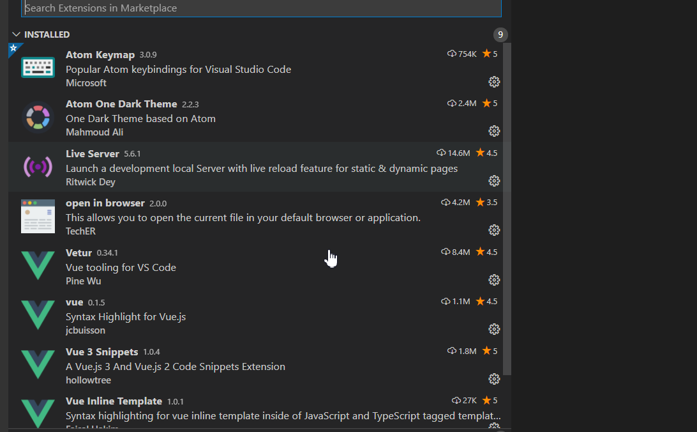


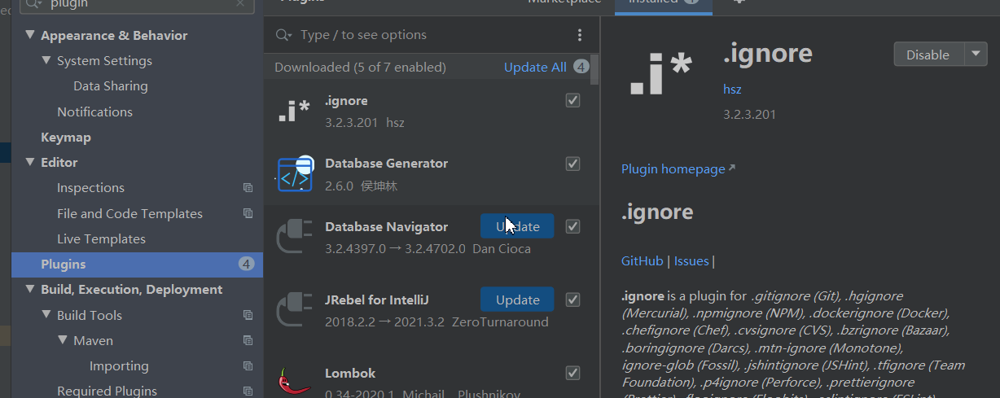


### 阿里大于

第一步：创建应用获取appkey和seckey


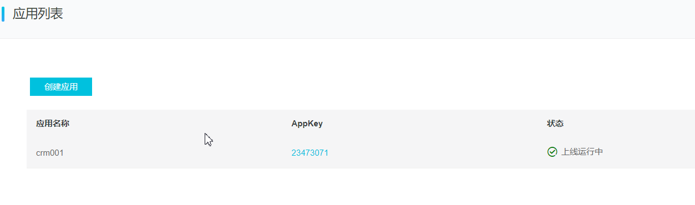


第二步：新建签名

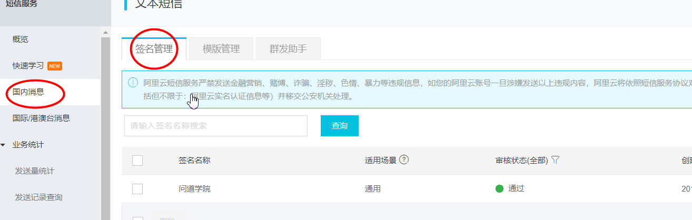


第三步：添加短信模板

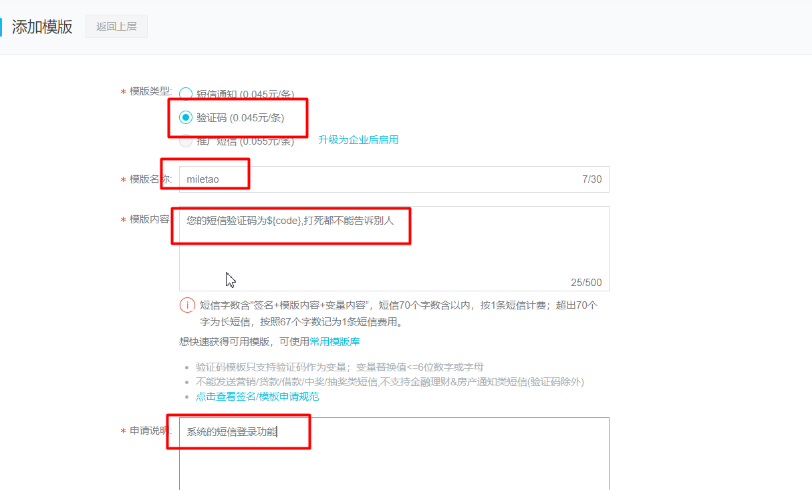


第四步：发送短信

```java
TaobaoClient client = new DefaultTaobaoClient("http://gw.api.taobao.com/router/rest",
                                              "23473071", "951efdcc9540d2c0c1646ed6d74892e6");
AlibabaAliqinFcSmsNumSendRequest req = new AlibabaAliqinFcSmsNumSendRequest();
req.setExtend("123456");
req.setSmsType("normal");
req.setSmsFreeSignName("问道学院");

//随机生成验证码
String code = RandomUtil.randomNumbers(4);

req.setSmsParamString("{\"code\":\""+code+"\"}");
req.setRecNum("13147132961");
req.setSmsTemplateCode("SMS_209190607");
AlibabaAliqinFcSmsNumSendResponse rsp = client.execute(req);
System.out.println(rsp.getBody());
```


生成验证码工具类

```java
public static void main(String[] args) {
    String s = RandomUtil.randomNumbers(4);
    System.out.println(s);
}
```


**阿里大于：jar包**

> 上传阿里大于jar包到本地仓库

```shell
mvn install:install-file -Dfile=taobao-sdk-java-auto_1455552377940-20160607.jar -DgroupId=com.alimama -DartifactId=sms -Dversion=1.0 -Dpackaging=jar 
```

糊涂工具官网：https://www.hutool.cn/docs/#/

```xml
<dependency>
    <groupId>cn.hutool</groupId>
    <artifactId>hutool-all</artifactId>
    <version>5.7.12</version>
</dependency>
```


### 功能一：短信发送

```java
package com.qf.utils;

import cn.hutool.core.util.RandomUtil;
import com.taobao.api.ApiException;
import com.taobao.api.DefaultTaobaoClient;
import com.taobao.api.TaobaoClient;
import com.taobao.api.request.AlibabaAliqinFcSmsNumSendRequest;
import com.taobao.api.response.AlibabaAliqinFcSmsNumSendResponse;

/**
 * <p>title: com.qf.utils</p>
 * <p>Company: wendao</p>
 * author zhuximing
 * date 2021/9/13
 * description:
 */
public class SmsUtil {
    private static   final String url = "http://gw.api.taobao.com/router/rest";
    private static   final String appkey = "23473071";
    private  static   final String secret ="951efdcc9540d2c0c1646ed6d74892e6";

    public static boolean  sendMSG(String code,String phone) {

        try {
            TaobaoClient client = new DefaultTaobaoClient(url, appkey, secret);
            AlibabaAliqinFcSmsNumSendRequest req = new AlibabaAliqinFcSmsNumSendRequest();
            req.setExtend("123456");
            req.setSmsType("normal");
            req.setSmsFreeSignName("问道学院");

            req.setSmsParamString("{\"code\":\""+code+"\"}");
            req.setRecNum(phone);
            req.setSmsTemplateCode("SMS_209190607");
            AlibabaAliqinFcSmsNumSendResponse rsp = client.execute(req);
            System.out.println(rsp.getBody());

            return  true;
        } catch (ApiException e) {
            e.printStackTrace();

            return  false;
        }


    }
}
```

业务代码

```java
package com.miletao.service.impl;

import cn.hutool.core.util.RandomUtil;
import com.miletao.service.ISMSService;
import com.miletao.vo.ResultVO;
import com.qf.sms.SMSUtil;
import org.springframework.beans.factory.annotation.Autowired;
import org.springframework.data.redis.core.StringRedisTemplate;
import org.springframework.stereotype.Service;
import org.springframework.util.StringUtils;

import java.util.concurrent.TimeUnit;
import java.util.regex.Pattern;

/**
 * <p>title: com.miletao.service.impl</p>
 * <p>Company: wendao</p>
 * author zhuximing
 * date 2021/6/24
 * description:
 */
@Service
public class SMSService implements ISMSService {


    @Autowired
    private StringRedisTemplate redisTemplate;


    @Override
    public ResultVO sendSms(String phone) {
       try {
           if (StringUtils.isEmpty(phone)) {
               return  new ResultVO(false, "手机号不能为空");
           }

           //校验手机号是否合法
           boolean matches = Pattern.matches("^1[3-9]\\d{9}$", phone);
           if (!matches) {
               return  new ResultVO(false, "手机号不合法");
           }


           //发送验证码【阿里大于】
           String code = RandomUtil.randomNumbers(4);
           ResultVO resultVO = SMSUtil.sendSMS(phone, code);

           //验证码存储到Redis
           redisTemplate.boundValueOps("sms:"+phone).set(code);
           redisTemplate.expire("sms:"+phone, 5, TimeUnit.MINUTES);

           return  new ResultVO(true, "success");

       }catch (Exception exception){
            exception.printStackTrace();

            return  new ResultVO(false, "短信发送失败");
       }


    }
}
```


### 功能二：验证短信

业务代码

```java
 @Override
    public ResultVO login(String phone, String code) {

        if (StringUtils.isEmpty(phone)||StringUtils.isEmpty(code)) {
            return  new ResultVO(false, "fail");
        }


        String redisCode = redisTemplate.boundValueOps("sms:" + phone).get();
        if(StringUtils.isEmpty(redisCode)){
            return  new ResultVO(false, "fail");
        }

        if(!redisCode.equals(code)){
            return  new ResultVO(false, "验证码输入错误");
        }


        //判断phone在数据库中是否存在
        TbUser userByUserName = userMapper.findUserByUserName(phone);
        if (userByUserName == null) {
            //注册
            int i = userMapper.saveUser(phone);
            TbUser tbUser = new TbUser();
            //获取
            TbUser userByUserName1 = userMapper.findUserByUserName(phone);

            redisTemplate.delete("sms:"+phone);

            return  new ResultVO(true, "success",userByUserName1);
        }else{

            redisTemplate.delete("sms:"+phone);
            return  new ResultVO(true, "success",userByUserName);

        }

    }
```


模拟：1生成 随机生成4个数字，key为手机号,数字为val值，放在redis 中，设置超时时间2分钟

​            2 做一个简易的页面，输入手机号，验证码，后台比对输入的验证和redis中的存储数据

​            3 一样登录，不一样登录失败

```
hutoo工具包使用：
<dependency>
    <groupId>cn.hutool</groupId>
    <artifactId>hutool-all</artifactId>
    <version>5.7.19</version>
</dependency>
如需使用thymeleaf，则可以引入： 
    <dependency>
            <groupId>org.springframework.boot</groupId>
            <artifactId>spring-boot-starter-thymeleaf</artifactId>
      </dependency>

```

## 9.2：Redis查询缓存

```java
 @Override
    public List<TbCategory> selectAll() {

        /**
         * string
         * k=> index:category
         * v=> json串（分类列表）
         */
        //get from redis
        BoundValueOperations<String, String> operations = redisTemplate.boundValueOps("index:category");
        String catListJsonStr = operations.get();
        if(StringUtils.isEmpty(catListJsonStr)){
            System.out.println("get from db");
            //get from db
            List<TbCategory> categories = categoryMapper.findAll();
            String jsonStr = JSONUtil.parse(categories).toStringPretty();

            //cache to redis
            operations.set(jsonStr);

            return categories;

        }else{

            System.out.println("get from redis");
            //json串=>对象
            List list = JSONUtil.toList(catListJsonStr, TbCategory.class);
            return list;
        }


    }
```

查询缓存： 数据字典表

电商项目

金额单位：元 /万元

衣服数量量级：件 /套 

鞋子: 只/双


以字典表为例： 1先从redis缓存中查询是否有所有字典表数据

​                            2 如果有，直接返回到前端，不到数据库中查

​                            3 如果没有，查询db，返回到前端，并放到redis中


# 10：Redis持久化

```txt
为什么要持久化
Redis是基于内存存储数据的，如果Redis服务器宕机，数据就丢失了

持久化：将内存中的数据不定期备份到磁盘中

数据恢复：将磁盘中的数据 加载（恢复）到内存中

```


```txt
Redis持久化方案2种
RDB(Redis Databases):内存中的数据集快照写入磁盘，也就是 Snapshot 快照,恢复时是将快照文件直接读到内存里。
AOF(Append Of File):以日志的形式记录每个写操作，当redis重启时，加载aof文件，将修改命令执行一遍。
```


## 10.1：RDB

### RDB持久化方案的特点

> Redis会单独fork一个子进程进行持久化工作，该子进程先将数据写入一个临时文件，等待持久化完毕，再将临时文件覆盖替换上此持久化好的文件，整个过程主进程是不会进行任何的IO操作，确保了极高的性能，而且当进行大规模数据恢复的时候RDB性能也非常高.
> 但是RDB有缺点，没法保证数据不丢失
>
> Redis默认的持久化方案就是rdb


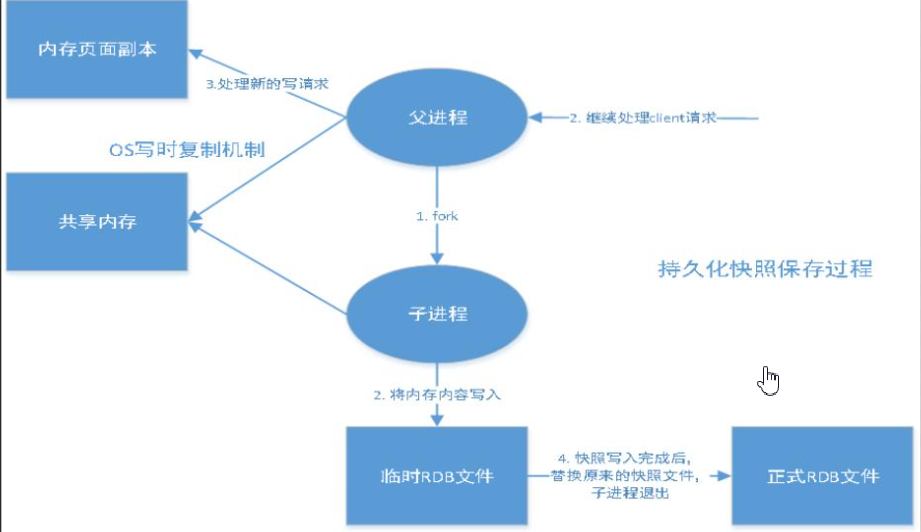


### rdb相关配置

```shell
#可以通过该配置修改文件名
dbfilename dump.rdb 
#指定rdb文件存储的路劲
dir 

```

### 触发方式

自动触发（满足条件）可配置

```txt
#配置rdb数据持久化自动触发的条件
save 900 1
save 300 10
save 60 10000     #rdb默认开启无法关闭
```


手动触发：

- 1.正常关闭redis-server（shutdown，flushdb手动）
- 2.save该命令会阻塞当前Redis服务器，执行save命令期间，Redis不能处理其他命令，直到RDB过程完成为止。
   　　显然该命令对于内存比较大的实例会造成长时间阻塞，这是致命的缺陷。
- 3.bgsave
   执行该命令时，Redis会在后台异步进行快照操作，快照同时还可以响应客户端请求。具体操作是Redis进程执行fork操作创建子进程，RDB持久化过程由子进程负责，完成后自动结束。阻塞只发生在fork阶段，一般时间很短。

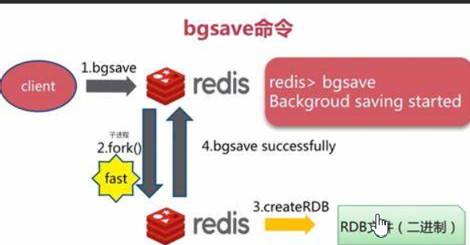


## 10.2：AOF

### AOF持久化方案的特点

> 将Redis所有的写操作**命令**记录下来（读操作不记录），以文件追加的方式存放起来，当Redis重启恢复数据时，将操作日志从头到尾执行一遍，恢复数据
>
> aof默认是关闭的，如果要开启aof必须要配置
>
> appendonly yes

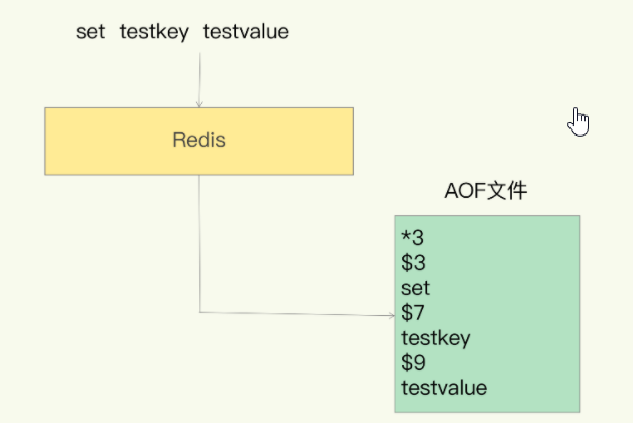

### AOF相关配置

```shell
#AOF持久化方案默认是关闭，如果要开启，需要如下配置
appendonly yes
#自定义aof日志文件名
appendfilename "appendonly.aof" 
#指定aof文件存储目录
dir 

```


### 触发方式

```txt
#aof的触发条件
appendfsync always
```


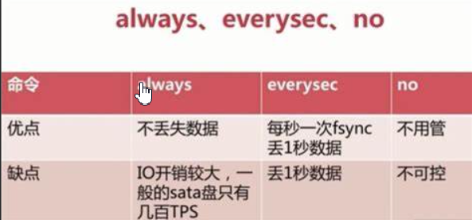


### AOF重写

> 由于AOF持久化是Redis不断将写命令记录到 AOF 文件中，随着Redis不断的进行，AOF 的文件会越来越大，文件越大，占用服务器内存越大以及 AOF 恢复要求时间越长。为了解决这个问题，Redis新增了重写机制，当AOF文件的大小超过所设定的阈值时，Redis就会启动AOF文件的内容压缩，只保留可以恢复数据的最小指令集。可以使用命令 bgrewriteaof 来重新。


## 10.3：RDB对比AOF

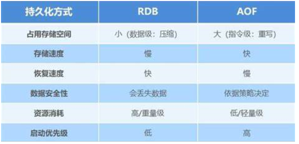

```txt
建议
如果对数据的安全性要求比较高（Redis存储秒杀的订单数据）  必须要开启aof
如果对数据的安全性要求不高（Redis查询缓存） ，可以不开启aof

```


# 11：Redis集群

## 集群配置

**主节点配置**

7001节点配置 :redis7001.conf

```txt
include /export/server/redis/conf/redis.conf
port 7001
pidfile /var/run/redis7001.pid
dbfilename redis7001.rdb
appendfilename "appendonly7001.aof"
```


7002从节点配置 :redis7002.conf

```txt
include /export/server/redis/conf/redis.conf
port 7002
pidfile /var/run/redis7002.pid
dbfilename redis7002.rdb
appendfilename "appendonly7002.aof"
slaveof 192.168.25.102 7001
masterauth 123456 ##挂载主redis的服务器密码

```

7003从节点配置 :redis7003.conf

```txt
include /export/server/redis/conf/redis.conf
port 7003
pidfile /var/run/redis7003.pid
dbfilename redis7003.rdb
appendfilename "appendonly7003.aof"
slaveof 192.168.25.102 7001
masterauth 123456
```

启动集群

```shell
[root@zhuxm01 redis]# redis-server redis7001.conf 
[root@zhuxm01 redis]# redis-server redis7002.conf 
[root@zhuxm01 redis]# redis-server redis7003.conf 
[root@zhuxm01 redis]# ps -ef|grep redis
root      13195      1  0 10:49 ?        00:00:00 redis-server 192.168.234.131:7001
root      13204      1  0 10:49 ?        00:00:00 redis-server 192.168.234.131:7002
root      13213      1  0 10:49 ?        00:00:00 redis-server 192.168.234.131:7003

```


# 12：哨兵模式sentinel

## 哨兵模式介绍

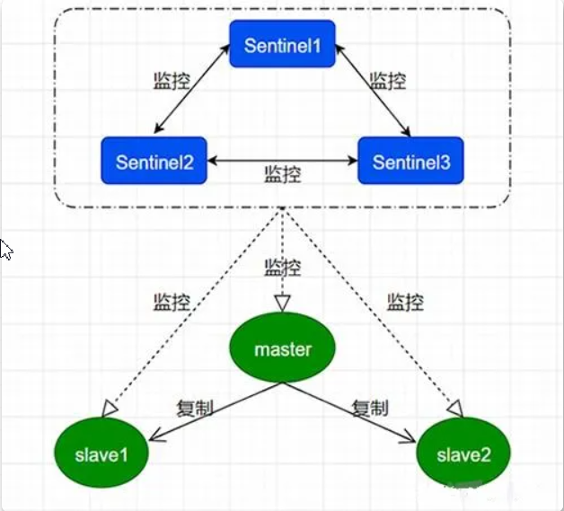

 ```txt
哨兵职责：
监控(Monitoring)：Sentinel 会不断地定期检查你的主服务器和从服务器是否运作正常。

提醒(Notification): 当被监控的某个 Redis 服务器出现问题时， Sentinel 可以通过 API 向管理员或者其他应用程序发送通知。

自动故障迁移(Automaticfailover): 当主服务器不能正常工作时， Sentinel 会开始一次自动故障迁移操作，选举新主

哨兵：是整个集群的入口
 ```


## 哨兵模式配置

1：先启动redis集群

2：三个哨兵就新建3个分别sentinel01.conf 、sentinel02.conf、sentinel03.conf，注意区分端口

```shell
bind 0.0.0.0
#哨兵的端口
port 26379
#mymaster自定义
sentinel monitor mymaster 192.168.25.102 7001 1
#设置redis主节点的访问密码
sentinel auth-pass mymaster 123456
```


```txt
bind 0.0.0.0
#哨兵的端口
port 26380
#mymaster自定义
sentinel monitor mymaster 192.168.25.101 7001 1
#设置redis主节点的访问密码
sentinel auth-pass mymaster 123456
```

```txt
bind 0.0.0.0
#哨兵的端口
port 26381
#mymaster自定义
sentinel monitor mymaster 192.168.25.101 7001 1
#设置redis主节点的访问密码
sentinel auth-pass mymaster 123456
```


3：启动哨兵

```shell
redis-sentinel sentinel01.conf
redis-sentinel sentinel02.conf
redis-sentinel sentinel03.conf

```


4：哨兵详细配置项

```shell
# 哨兵sentinel实例运行的端口 默认26379
port 26379

#以守护进程模式启动
daemonize yes

# 哨兵sentinel的工作目录
dir /tmp

#日志文件名
logfile "sentinel_26379.log"

# sentinel监控的master主机
sentinel monitor mymaster 192.168.1.108 6379 2

# sentinel连接主从密码验证，注意必须为主从设置一样的密码
# sentinel auth-pass <master-name> <password>
sentinel auth-pass mymaster 1234

# 指定多少毫秒之后 主节点没有应答哨兵sentinel 此时 哨兵主观上认为主节点下线 默认30秒
sentinel down-after-milliseconds mymaster 5000


#在发生failover主备切换时，这个选项指定了最多可以有多少个slave同时对新的master进行同步数据。这个数字越小，完成failover所需的时间就越长，但是如果这个数字越大，就意味着越多的slave因为replication而不可用。可以设为 1 来保证每次只有一个slave处于不能处理命令请求的状态
sentinel parallel-syncs mymaster 1

# 失效转移最大时间设置
sentinel failover-timeout mymaster 180000

#如果了这个脚本路径，那么必须保证这个脚本存在于这个路径，并且是可执行的，否则sentinel无法正常启动成功。

sentinel notification-script mymaster /var/redis/notify.sh  
```

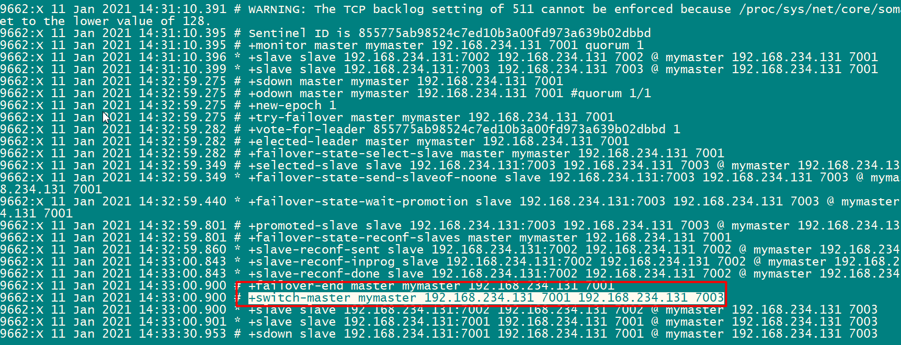


### 基于springboot

```yml
spring:
  redis:
    sentinel:
      master: mymaster
      nodes:
        - 192.168.234.110:26379
        - 192.168.234.110:26380
        - 192.168.234.110:26381
    password: 123456
```


### 基于xml配置

```xml
<?xml version="1.0" encoding="UTF-8"?>
<beans xmlns="http://www.springframework.org/schema/beans"
       xmlns:xsi="http://www.w3.org/2001/XMLSchema-instance"
       xmlns:context="http://www.springframework.org/schema/context"
       xmlns:p="http://www.springframework.org/schema/p"
       xsi:schemaLocation="http://www.springframework.org/schema/beans
       http://www.springframework.org/schema/beans/spring-beans.xsd
       http://www.springframework.org/schema/context http://www.springframework.org/schema/context/spring-context.xsd">

    <context:property-placeholder location="classpath:redis.properties" ignore-unresolvable="true" />


    <bean id="pool" class="redis.clients.jedis.JedisPoolConfig">
        <property name="maxTotal" value="${redis.pool.maxTotal}"/>
        <property name="maxIdle" value="${redis.pool.maxIdle}"/>
    </bean>

    <bean id="redisSentinelConfiguration"
          class="org.springframework.data.redis.connection.RedisSentinelConfiguration">
        <property name="master">
            <bean class="org.springframework.data.redis.connection.RedisNode">
                <property name="name" value="mymaster">
                </property>
            </bean>
        </property>

        <property name="sentinels">
            <set>
                <bean class="org.springframework.data.redis.connection.RedisNode">
                    <constructor-arg name="host" value="192.168.25.101" />
                    <constructor-arg name="port" value="26379" />
                </bean>
                 <bean class="org.springframework.data.redis.connection.RedisNode">
                    <constructor-arg name="host" value="192.168.25.101" />
                    <constructor-arg name="port" value="26380" />
                </bean>
                 <bean class="org.springframework.data.redis.connection.RedisNode">
                    <constructor-arg name="host" value="192.168.25.101" />
                    <constructor-arg name="port" value="26381" />
                </bean>
            </set>
        </property>
    </bean>

    <bean id="jedisConnectionFactory" class="org.springframework.data.redis.connection.jedis.JedisConnectionFactory"
    p:password="123456" >
        <constructor-arg name="sentinelConfig" ref="redisSentinelConfiguration"/>
        <constructor-arg name="poolConfig" ref="pool"/>
    </bean>
    <bean id="stringRedisTemplate" class="org.springframework.data.redis.core.StringRedisTemplate">
        <constructor-arg name="connectionFactory" ref="jedisConnectionFactory"/>
    </bean>


</beans>
```


```java
package com.qf;

import org.junit.Test;
import org.junit.runner.RunWith;
import org.springframework.beans.factory.annotation.Autowired;
import org.springframework.data.redis.core.StringRedisTemplate;
import org.springframework.test.context.ContextConfiguration;
import org.springframework.test.context.junit4.SpringJUnit4ClassRunner;

/**
 * <p>title: com.qf</p>
 * <p>Company: wendao</p>
 * author zhuximing
 * date 2021/6/25
 * description:
 */
@RunWith(SpringJUnit4ClassRunner.class)
@ContextConfiguration(locations = {"classpath:app-sentinel.xml"})
public class TestSentinel {

    @Autowired
    private StringRedisTemplate redisTemplate;
    
    @Test
    public void  testSentinel(){

        redisTemplate.boundValueOps("name").set("rose");

        String name = redisTemplate.boundValueOps("name").get();
        System.out.println(name);


    }
}
```


# 13：Redis分布式集群

## 分布式集群架构

> sentinel弊端：内存的瓶颈


## 分布式集群搭建

> 说明:
>
> 1：伪集群，一台服务器，启动6个redis服务、通过端口区分（7001~7006）
>
> 2：真集群：6个节点或者3个节点 


第一步：从源码包复制redis.conf到指定目录

```shell
[root@zhuxm01 server]# cp redis-6.0.8/redis.conf /export/server/redis/
```


第二步：分别配置每个redis的配置文件，详细配置如下，注意区分端口

```shell
include /export/server/redis/cluster-conf/redis.conf
port 7001
#redis的进程文件
pidfile /var/run/redis7001.pid
#rdb文件名
dbfilename redis7001.rdb
#aof文件名
appendfilename "appendonly7001.aof"
# 集群
cluster-enabled yes
# 生成的node文件
cluster-config-file nodes7001.conf
#守护进程
daemonize yes
#aof、rdb文件存储目录
dir /export/server/redis/data/
bind 0.0.0.0

```


```she
#如果redis设置密码，加上如下配置
requirepass "123456"
masterauth "123456"
```


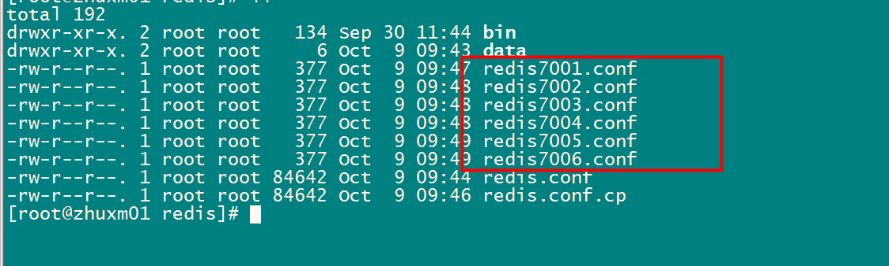


第三步：启动每个redis服务

```shell
[root@zhuxm01 redis]# redis-server /export/server/redis/redis7001.conf 
[root@zhuxm01 redis]# redis-server /export/server/redis/redis7002.conf 
[root@zhuxm01 redis]# redis-server /export/server/redis/redis7003.conf 
[root@zhuxm01 redis]# redis-server /export/server/redis/redis7004.conf 
[root@zhuxm01 redis]# redis-server /export/server/redis/redis7005.conf 
[root@zhuxm01 redis]# redis-server /export/server/redis/redis7006.conf 
[root@zhuxm01 redis]# ps -ef|grep redis
root      11186      1  0 09:51 ?        00:00:00 redis-server 192.168.234.131:7001 [cluster]
root      11195      1  0 09:51 ?        00:00:00 redis-server 192.168.234.131:7002 [cluster]
root      11203      1  0 09:51 ?        00:00:00 redis-server 192.168.234.131:7003 [cluster]
root      11212      1  0 09:51 ?        00:00:00 redis-server 192.168.234.131:7004 [cluster]
root      11220      1  0 09:51 ?        00:00:00 redis-server 192.168.234.131:7005 [cluster]
root      11229      1  0 09:51 ?        00:00:00 redis-server 192.168.234.131:7006 [cluster]
root      11240   7691  0 09:52 pts/0    00:00:00 grep --color=auto redis
[root@zhuxm01 redis]# 
```


第四步：创建集群

```shell
./redis-cli --cluster create 192.168.247.30:7001 \
192.168.247.30:7002 \
192.168.247.30:7003 \
192.168.247.30:7004 \
192.168.247.30:7005 \
192.168.247.30:7006 \
--cluster-replicas 1 


[ERR] Node 192.168.247.30:7002 is not empty. Either the node already knows other nodes (check with CLUSTER NODES) or contains some key in database 0.

```


```shell
>>> Performing hash slots allocation on 6 nodes...
Master[0] -> Slots 0 - 5460
Master[1] -> Slots 5461 - 10922
Master[2] -> Slots 10923 - 16383
Adding replica 192.168.234.131:7005 to 192.168.234.131:7001
Adding replica 192.168.234.131:7006 to 192.168.234.131:7002
Adding replica 192.168.234.131:7004 to 192.168.234.131:7003
>>> Trying to optimize slaves allocation for anti-affinity
[WARNING] Some slaves are in the same host as their master
M: 7e88abdfa256140ab11dc3c2173b00c5868a0479 192.168.234.131:7001
   slots:[0-5460] (5461 slots) master
M: e5845e3494d58b5400fa21d4b3c34ccafce43024 192.168.234.131:7002
   slots:[5461-10922] (5462 slots) master
M: 5dbec321866665aceb8ae0c6791e2ded39464368 192.168.234.131:7003
   slots:[10923-16383] (5461 slots) master
S: 8ad824d12b9f1a16a75e227266e9940aa8610422 192.168.234.131:7004
   replicates 5dbec321866665aceb8ae0c6791e2ded39464368
S: 8ca84b32509e178181585206eaa736c6323dbd3a 192.168.234.131:7005
   replicates 7e88abdfa256140ab11dc3c2173b00c5868a0479
S: 7a518a28534593c44694215e3a83b3311704e4d4 192.168.234.131:7006
   replicates e5845e3494d58b5400fa21d4b3c34ccafce43024
Can I set the above configuration? (type 'yes' to accept): yes
>>> Nodes configuration updated
>>> Assign a different config epoch to each node
>>> Sending CLUSTER MEET messages to join the cluster
```


第五步：连接集群

```she
redis-cli -h 192.168.234.122 -p 7002 -c
```


## 分布式集群(java客户端连接)

#### 基于springboot

```xml
spring:
  redis:
    cluster:
      nodes:
        - 192.168.234.110:7001
        - 192.168.234.110:7002
        - 192.168.234.110:7003
        - 192.168.234.110:7004
        - 192.168.234.110:7005
        - 192.168.234.110:7006
```


#### 基于xml配置

pom.xml

```xml
   <dependency>
      <groupId>redis.clients</groupId>
      <artifactId>jedis</artifactId>
      <version>2.9.0</version>
    </dependency>

    <dependency>
      <groupId>org.springframework.data</groupId>
      <artifactId>spring-data-redis</artifactId>
      <version>2.0.12.RELEASE</version>
    </dependency>
```


applicationContext-redis.xml

```xml
<?xml version="1.0" encoding="UTF-8"?>
<beans xmlns="http://www.springframework.org/schema/beans"
       xmlns:xsi="http://www.w3.org/2001/XMLSchema-instance"
       xmlns:p="http://www.springframework.org/schema/p"
       xmlns:context="http://www.springframework.org/schema/context"
       xmlns:jee="http://www.springframework.org/schema/jee"
       xmlns:tx="http://www.springframework.org/schema/tx"
       xmlns:aop="http://www.springframework.org/schema/aop"
       xsi:schemaLocation="
            http://www.springframework.org/schema/beans
            http://www.springframework.org/schema/beans/spring-beans-4.2.xsd
            http://www.springframework.org/schema/context
            http://www.springframework.org/schema/context/spring-context-4.2.xsd">

    <!-- 配置Cluster -->
    <bean id="redisClusterConfiguration"
          class="org.springframework.data.redis.connection.RedisClusterConfiguration">
        <!-- 节点配置 -->
        <property name="clusterNodes">
            <set>
                <bean class="org.springframework.data.redis.connection.RedisNode">
                    <constructor-arg name="host" value="192.168.25.101"></constructor-arg>
                    <constructor-arg name="port" value="7001"></constructor-arg>
                </bean>
                <bean class="org.springframework.data.redis.connection.RedisNode">
                    <constructor-arg name="host" value="192.168.25.101"></constructor-arg>
                    <constructor-arg name="port" value="7002"></constructor-arg>
                </bean>
                <bean class="org.springframework.data.redis.connection.RedisNode">
                    <constructor-arg name="host" value="192.168.25.101"></constructor-arg>
                    <constructor-arg name="port" value="7003"></constructor-arg>
                </bean>
                <bean class="org.springframework.data.redis.connection.RedisNode">
                    <constructor-arg name="host" value="192.168.25.101"></constructor-arg>
                    <constructor-arg name="port" value="7004"></constructor-arg>
                </bean>
                <bean class="org.springframework.data.redis.connection.RedisNode">
                    <constructor-arg name="host" value="192.168.25.101"></constructor-arg>
                    <constructor-arg name="port" value="7005"></constructor-arg>
                </bean>
                <bean class="org.springframework.data.redis.connection.RedisNode">
                    <constructor-arg name="host" value="192.168.25.101"></constructor-arg>
                    <constructor-arg name="port" value="7006"></constructor-arg>
                </bean>
            </set>
        </property>
    </bean>
    <!--redis 连接池的配置信息-->
    <bean id="jedisPoolConfig" class="redis.clients.jedis.JedisPoolConfig">
        <property name="maxIdle" value="100" />
        <property name="maxTotal" value="600" />
    </bean>

    <bean id="jedisConnectionFactory"
          class="org.springframework.data.redis.connection.jedis.JedisConnectionFactory">
        <constructor-arg ref="redisClusterConfiguration" />
        <constructor-arg ref="jedisPoolConfig" />
    </bean>
    <!-- redis 访问的模版 -->
    <bean id="redisTemplate" class="org.springframework.data.redis.core.StringRedisTemplate">
        <property name="connectionFactory" ref="jedisConnectionFactory" />
    </bean>

</beans>
```


```java
package com.wfx.test;

import com.wfx.dao.SysRoleDao;
import com.wfx.entity.SysRole;
import com.wfx.service.IsysRoleService;
import com.wfx.vo.TreeNodeVO;
import org.junit.Test;
import org.junit.runner.RunWith;
import org.springframework.beans.factory.annotation.Autowired;
import org.springframework.data.redis.core.RedisTemplate;
import org.springframework.data.redis.core.ZSetOperations;
import org.springframework.test.context.ContextConfiguration;
import org.springframework.test.context.junit4.SpringJUnit4ClassRunner;
import redis.clients.jedis.Jedis;
import redis.clients.jedis.JedisPool;
import redis.clients.jedis.JedisPoolConfig;

import java.util.Iterator;
import java.util.List;
import java.util.Set;
import java.util.concurrent.TimeUnit;

@RunWith(SpringJUnit4ClassRunner.class)
@ContextConfiguration("classpath*:applicationContext-*.xml")
public class TestSysRoleServie {


    @Autowired
    private RedisTemplate redisTemplate;

    @Test
    public void testString (){
        redisTemplate.boundValueOps("demo").set("1234");
        redisTemplate.expire("demo",30 , TimeUnit.SECONDS);
        System.out.println(redisTemplate.boundValueOps("demo").get());

    }

    @Test
    public void testList (){
        redisTemplate.boundListOps("names").leftPush("张飞");
        redisTemplate.boundListOps("names").leftPush("刘备");
        redisTemplate.boundListOps("names").leftPush("关羽");
        redisTemplate.boundListOps("names").leftPush("曹操");

        System.out.println(redisTemplate.boundListOps("names").rightPop());
        System.out.println(redisTemplate.boundListOps("names").rightPop());
        System.out.println(redisTemplate.boundListOps("names").rightPop());
        System.out.println(redisTemplate.boundListOps("names").rightPop());

    }

    @Test
    public void testSet (){
        redisTemplate.boundSetOps("ips").add("123","123","345","678");
        System.out.println(redisTemplate.boundSetOps("ips").members());
        System.out.println(redisTemplate.boundSetOps("ips").size());

    }

    @Test
    public void testHash (){

        redisTemplate.boundHashOps("person").put("name","jack");
        redisTemplate.boundHashOps("person").put("age","12");
        System.out.println(redisTemplate.boundHashOps("person").get("name"));
        System.out.println(redisTemplate.boundHashOps("person").size());

    }


}
```


# 14：Redis缓存三类问题

## 14.1：缓存击穿

> `某一个`热点key，在`失效的一瞬间`，持续的高并发访问`击破缓存`直接访问数据库，导致数据库造的周期性压力（极端情况下导致数据库宕机）


缓存击穿演示

> jemeter :压力测试工具，可以演示高并发场景

创建测试计划

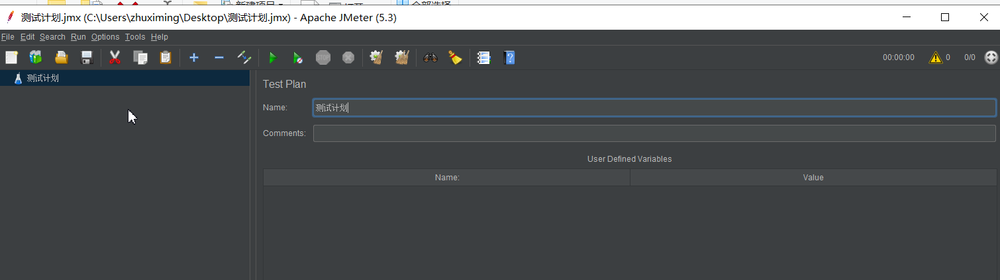


创建线程组

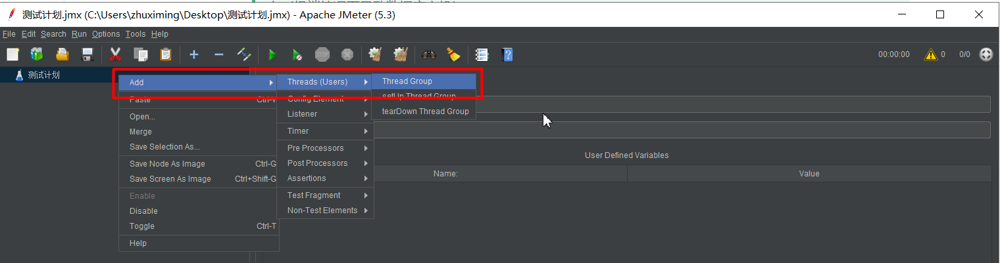


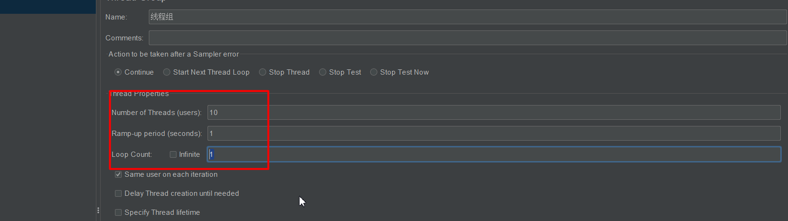


创建http请求

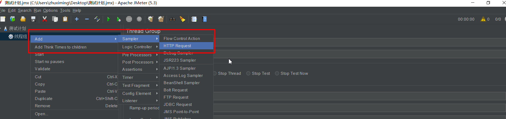


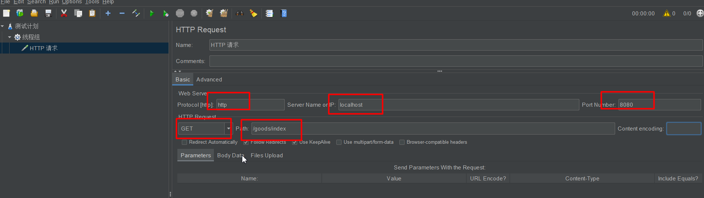


监听http请求的结果

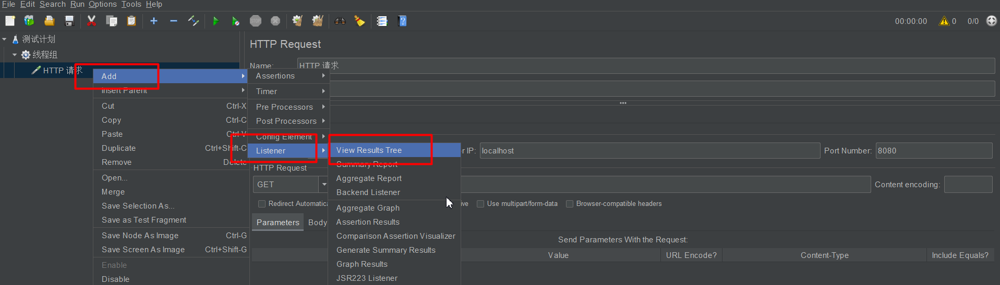


开始压力测试

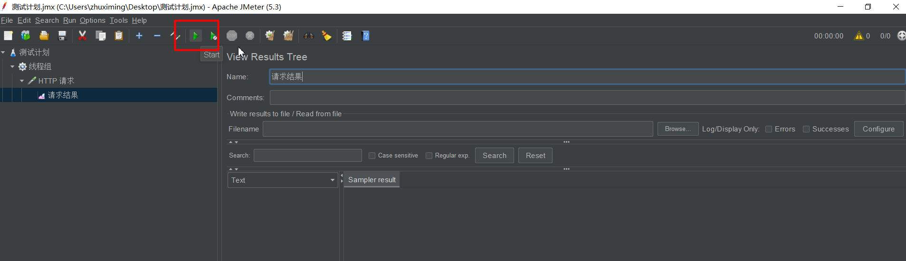


缓存击穿解决办法:

> 加锁(分布式锁)，两次判断

```java
  @Override
    public List<TbCategory> selectAll() {

        /**
         * string
         * k=> index:category
         * v=> json串（分类列表）
         */
        //get from redis
        BoundValueOperations<String, String> operations = redisTemplate.boundValueOps("index:category");
        String catListJsonStr = operations.get();
        if(StringUtils.isEmpty(catListJsonStr)){
            List<TbCategory> categories;
            synchronized (this) {

                String catListJsonStrAgain = operations.get();
                if(StringUtils.isEmpty(catListJsonStrAgain)){
                    System.out.println("get from db");
                    //get from db
                    categories = categoryMapper.findAll();
                    String jsonStr = JSONUtil.parse(categories).toStringPretty();

                    //cache to redis
                    operations.set(jsonStr);
                    return categories;

                }else{

                    System.out.println("get from redis");

                    List list = JSONUtil.toList(catListJsonStrAgain, TbCategory.class);
                    return list;
                }


            }


        }else{

            System.out.println("get from redis");
            //json串=>对象
            List list = JSONUtil.toList(catListJsonStr, TbCategory.class);
            return list;
        }


    }
```


## 14.2：缓存穿透

> 请求的某个热点数据、数据库并不存在，缓存也无法命中，请求都会到数据源，从而可能压垮数据源
>
> 数据库中没有，同时Redis中也没有

#### 方案1：缓存空值

```java
 @Override
    public List<TbBrand> selectBrandsByCatId(String catId) {

        /**
         * string
         * k=>index:brand:${catId}
         * v=>品牌列表的json串
         *
         * hash[推荐]
         * k=> index:brand
         * v=>
         *       field=>${catId}
         *       value=>品牌列表的json串
         */

        //get from redis
        BoundHashOperations<String, Object, Object> operations = redisTemplate.boundHashOps("index:brand");
        Object brandListJsonStr = operations.get(catId);
        if(StringUtils.isEmpty(brandListJsonStr)){

            System.out.println("get from db"+catId);

            //get from db
            List<TbBrand> brandsByCatId = brandMapper.findBrandsByCatId(catId);

            //if (brandsByCatId != null  && brandsByCatId.size()>0) {
                //cache to redis
                String jsonStr = JSONUtil.parse(brandsByCatId).toStringPretty();

                operations.put(catId,jsonStr);
           // }
            return brandsByCatId;

        }else{

            System.out.println("get from redis"+catId);

            List<TbBrand> tbBrands = JSONUtil.toList((String) brandListJsonStr, TbBrand.class);


            return  tbBrands;
        }


    }
```


#### 方案2：布隆过滤


```java
 @Bean
    public RedissonClient redissonClient(){

        //构造redisson客户端，并放入IOC容器中
        Config config = new Config();
        config.useSingleServer().setAddress("redis://127.0.0.1:6379");

        RedissonClient redissonClient = Redisson.create(config);

        RBloomFilter<Object> bloomFilter = redissonClient.getBloomFilter("spuIds");

        //初始化
        bloomFilter.tryInit(100000000L,0.03);

        //初始化数据
        bloomFilter.add("1");
        bloomFilter.add("2");
        bloomFilter.add("3");
        bloomFilter.add("4");
        bloomFilter.add("5");

        return redissonClient;

    }

```


## 14.3：缓存雪崩

> 当redis服务器重启或者大量缓存集中在某一个时间段失效,即使不是高并发，访问量大，导致数据库访问压力大

解决方案

> 让过期时间平均分布   过期时间=预设置的过期时间+随机数


# 15：面试题

## 15.1：Redis内存满了怎么办？

### 1、通过配置文件配置

通过在Redis安装目录下面的**redis.conf**配置文件中添加以下配置设置内存大小

```
//设置Redis最大占用内存大小为100M
maxmemory 100mb
```

### 2、通过命令修改

Redis支持运行时通过命令动态修改内存大小

```
//设置Redis最大占用内存大小为100M
127.0.0.1:6379> config set maxmemory 100mb
//获取设置的Redis能使用的最大内存大小
127.0.0.1:6379> config get maxmemory
```

> 如果不设置最大内存大小或者设置最大内存大小为0，在64位操作系统下不限制内存大小，在32位操作系统下最多使用3GB内存


### Redis的内存淘汰

> 既然可以设置Redis最大占用内存大小，那么配置的内存就有用完的时候。那在内存用完的时候，还继续往Redis里面添加数据不就没内存可用了吗？

实际上Redis定义了几种策略用来处理这种情况：

- **noeviction(默认策略)**：对于写请求不再提供服务，直接返回错误（DEL请求和部分特殊请求除外）
- **allkeys-lru**：从所有key中使用LRU算法进行淘汰,**LRU(Least Recently Used)**
- **volatile-lru**：从设置了过期时间的key中使用LRU算法进行淘汰,**LRU(Least Recently Used)**
- **allkeys-random**：从所有key中随机淘汰数据
- **volatile-random**：从设置了过期时间的key中随机淘汰
- **volatile-ttl**：在设置了过期时间的key中，根据key的过期时间进行淘汰，越早过期的越优先被淘汰

> 当使用**volatile-lru**、**volatile-random**、**volatile-ttl**这三种策略时，如果没有key可以被淘汰，则和**noeviction**一样返回错误

### 如何获取及设置内存淘汰策略

获取当前内存淘汰策略：

```
127.0.0.1:6379> config get maxmemory-policy
```

通过配置文件设置淘汰策略（修改**redis.conf**文件）：

```
maxmemory-policy allkeys-lru
```

通过命令修改淘汰策略：

```
127.0.0.1:6379> config set maxmemory-policy allkeys-lru
```


## 15.2：为什么删除数据后，Redis内存占用依然很高？

### 1.什么是内存碎片？

内存碎片这个概念应该不是第一听说了，熟悉JVM或者操作系统的应该都熟悉，以火车卖票为例，一个车厢`128`个车位，由于高峰期，只剩余`两个`位置了，但是此时`三个`人想要坐在一起，能够吹吹牛批，喝喝酒的，那么这三个人肯定不会买这节车厢的两个位置了，此时这两个位置可以称之为座位碎片 。


### 2.为什么会出现内存碎片

`Redis`提供了多种的内存分配策略，比如`libc`、`jemalloc`、`tcmalloc`，默认使用`jemalloc`。

`jemalloc`这种分配策略并不是按需分配，而是固定大小分配，比如8字节、32字节....2KB、4KB等


### 3.如何判断存在内存碎片？

> 这个对于运维人员来说很重要，一旦出现Redis运行缓慢或者阻塞了，一定需要先判断内存的占用情况，而不是重启Redis。

```shell
INFO memory
# Memory
used_memory:1073741736  #实际使用的内存大小
used_memory_human:1024.00M #人类有好的方式
used_memory_rss:1997159792  #操作系统实际内存分配
used_memory_rss_human:1.86G
…
mem_fragmentation_ratio:1.86 ##碎片率
mem_fragmentation_ratio这个指标很清楚的展示了当前内存的碎片率，比如Redis申请了1000字节，但是操作系统实际分配的内存1800个字节，则mem_fragmentation_ratio=1800/1000=1.8
```


### 4.如何清理内存碎片？

Redis提供了参数配置，可以控制清除内存碎片的时机，命令如下：

```
config set activedefrag yes
```

以上命令启动自动清理，但是具体什么时候清理，还要受以下两个参数的影响：

1. `active-defrag-ignore-bytes 400mb`：如果内存碎片达到了`400mb`，开始清理（自定义）
2. `active-defrag-threshold-lower 20`：内存碎片空间占操作系统分配给 Redis 的总空间比例达到`20%`时，开始清理（自定义）


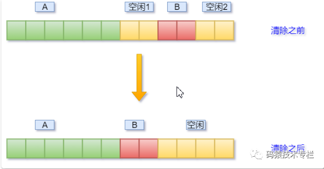


## 15.3：Redis6的新特性

#### Redis 6.0 新特性-多线程

1：严格来讲从Redis4.0之后并不是单线程，除了主线程外，它也有后台线程在处理一些较为缓慢的操作，例如清理脏数据、无用连接的释放、大 key 的删除等等

2：Redis多线程主要解决网络IO瓶颈，并不是解决CPU瓶颈

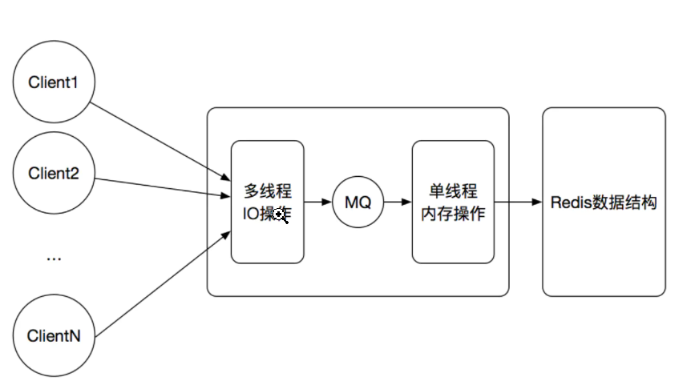


```xml
从上面的实现机制可以看出，Redis的多线程部分只是用来处理网络数据的读写和协议解析，执行命令仍然是单线程顺序执行。所以我们不需要去考虑控制并发及线程安全问题。
```


3.Redis6.0默认是否开启了多线程？

Redis6.0的多线程默认是禁用的，只使用主线程。如需开启需要修改redis.conf配置文件：

io-threads-do-reads yes


4.Redis6.0多线程开启时，线程数如何设置？

开启多线程后，还需要设置线程数，否则是不生效的。同样修改redis.conf配置文件

关于线程数的设置，官方有一个建议：4核的机器建议设置为2或3个线程，8核的建议设置为6个线程，线程数一定要小于机器核数。还需要注意的是，线程数并不是越大越好，官方认为超过了8个基本就没什么意义了。


#### redis6新特性-acl

Redis6之前Redis就只有一个用户(default)权限最高，通过配置文件的requirepass配置

Redis6版本推出了**ACL(Access Control List)访问控制权限**的功能，基于此功能，我们可以设置多个用户，为了保证**向下兼容**，Redis6保留了default用户和使用requirepass的方式给default用户设置密码，默认情况下default用户拥有Redis最大权限，我们使用redis-cli连接时如果没有指定用户名，用户也是默认default

```shell
ACL常用命令
ACL whoami
ACL list
ACL setuser allen on >123456 +@all ~*
AUTH allen mypasswd

#只能创建以lakers为前缀的key
ACL setuser james on >123456 +@all ~lakers*
#不拥有set权限
ACL setuser james -SET

ACL DELUSER james
```

