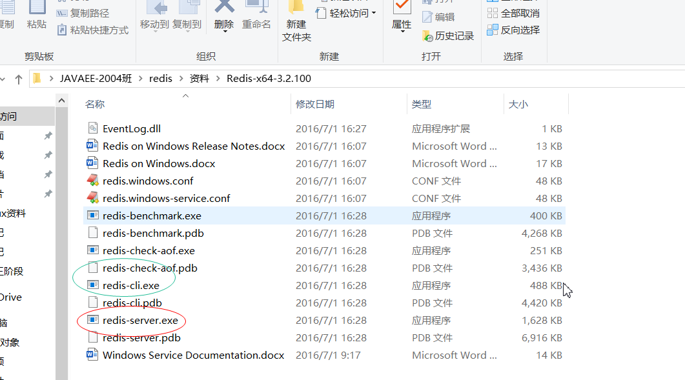
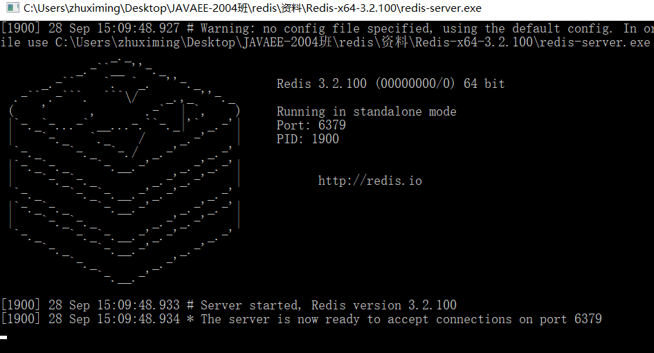
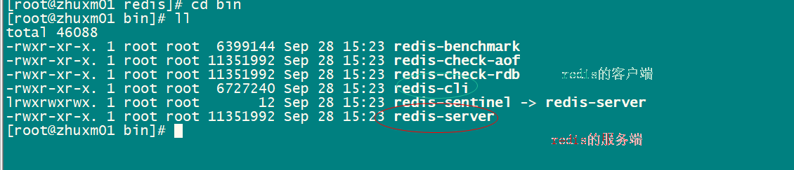
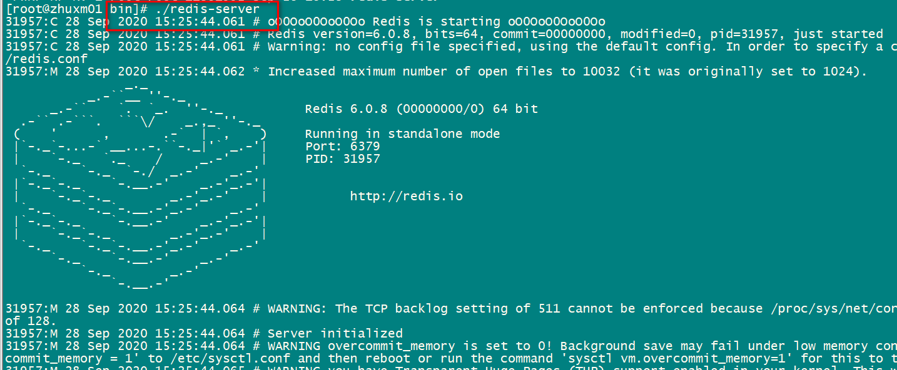
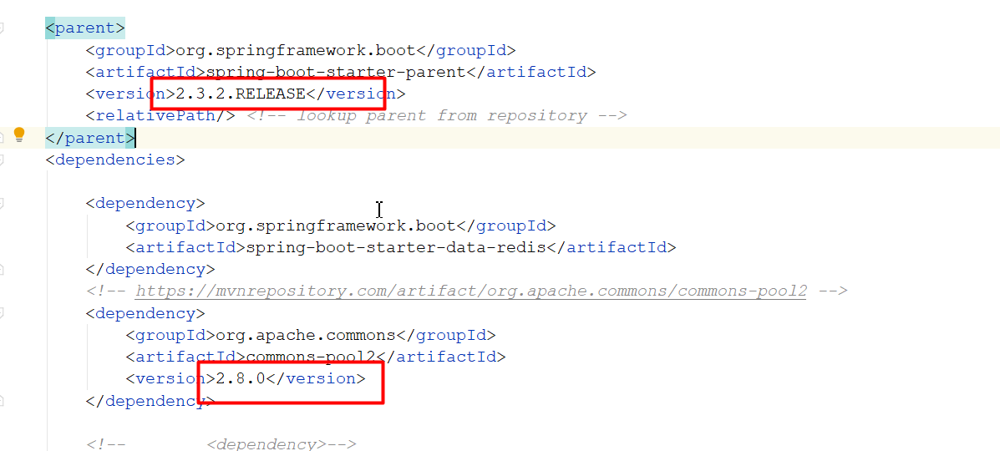
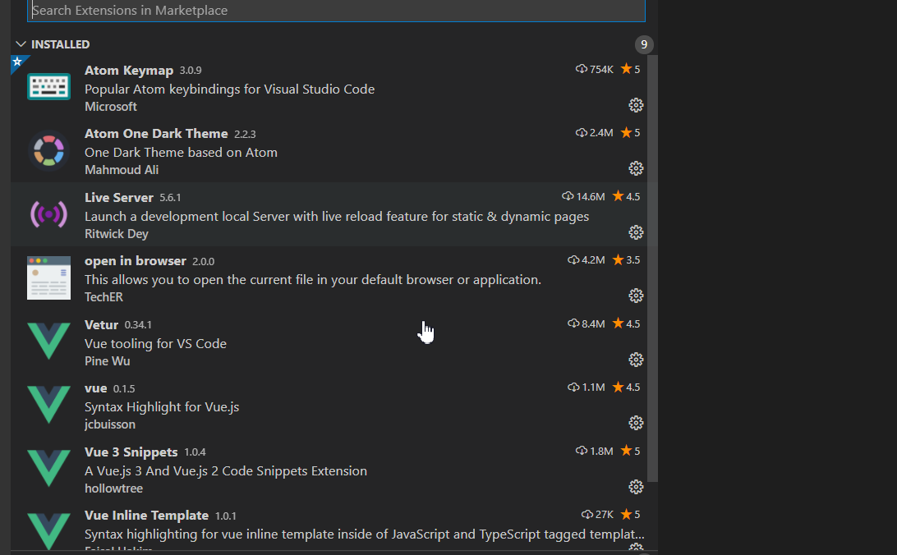
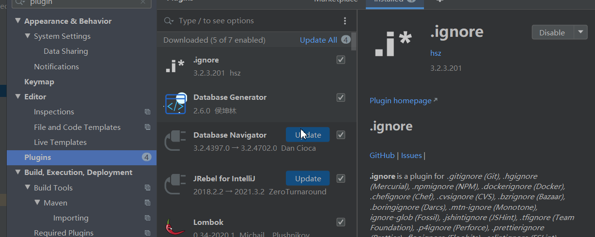
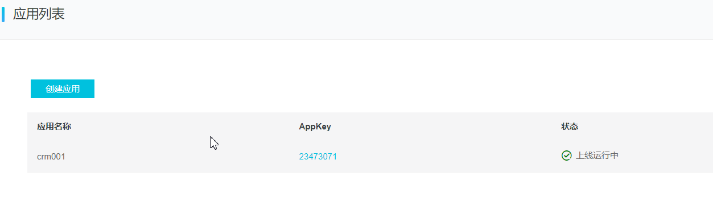
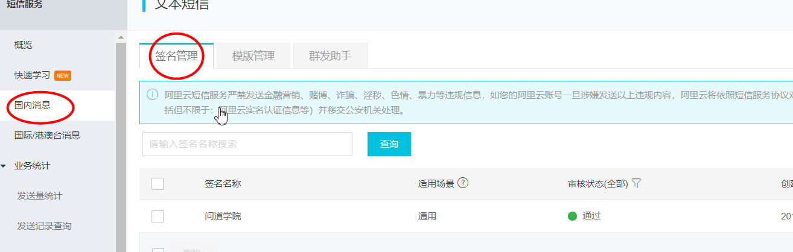
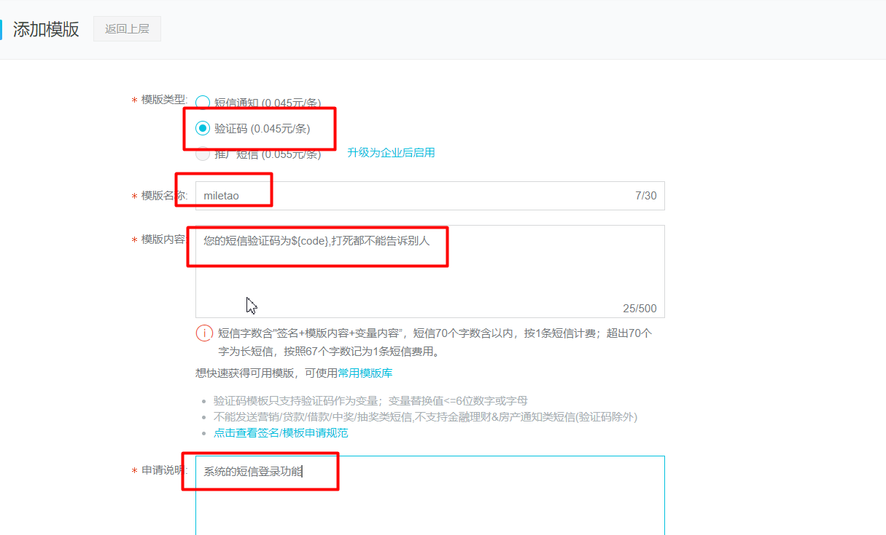

# Redis（上）

本篇是 Redis 的入门与基础篇，内容包括 Redis 简介、安装、五大基本数据类型、常用指令、事务，以及 Java 客户端（Jedis、Spring Data Redis）的接入方式，最后以短信验证码、查询缓存两个实际应用场景收尾。持久化、集群、缓存三大问题等进阶内容见《Redis（下）》。

## 1. Redis 简介

### 1.1 什么是 Redis

官网：<https://redis.io/>

官方对 Redis 的定义如下：

```text
Redis is an open source (BSD licensed), in-memory data structure store, used as a
database, cache, and message broker. Redis provides data structures such as strings,
hashes, lists, sets, sorted sets with range queries, bitmaps, hyperloglogs, geospatial
indexes, and streams. Redis has built-in replication, Lua scripting, LRU eviction,
transactions, and different levels of on-disk persistence, and provides high
availability via Redis Sentinel and automatic partitioning with Redis Cluster.
```

**Redis** 是完全开源的（BSD 协议），使用 C 语言编写、基于内存的高性能 NoSQL（非关系型）数据库，可用作数据库、缓存和消息中间件。

### 1.2 关系型数据库与非关系型数据库

**关系型数据库**（MySQL、Oracle、PostgreSQL）最典型的数据结构是**表**，由二维表及其之间的联系所组成的一个数据组织。

- 优点：
  1. 易于维护：都是使用表结构，格式一致；
  2. 使用方便：SQL 语言通用，可用于复杂查询，可用于一个表及多个表之间非常复杂的关联查询。
- 缺点：
  1. 关系型数据库操作的是磁盘，硬盘 I/O 是一个很大的瓶颈；
  2. 表结构固定，灵活度稍欠。

**非关系型数据库**（Redis 是 KV 型、Memcache 是 KV 型、ElasticSearch 存 JSON 文档）是一种数据结构化存储方法的集合，可以是文档或者键值对。

- 优点：
  1. 格式灵活：存储数据的格式可以是 key-value 形式、文档形式，不必像关系型数据库那样每行结构完全一致；
  2. 速度快：NoSQL 可以使用内存存储，而关系型数据库只能使用硬盘。
- 缺点：
  1. 不支持 SQL，数据间没有关联关系。

| 对比维度 | 关系型数据库 | 非关系型数据库 |
| --- | --- | --- |
| 典型代表 | MySQL、Oracle、PostgreSQL | Redis、Memcache、ElasticSearch |
| 数据结构 | 二维表，结构固定 | KV、文档等，格式灵活 |
| 存储介质 | 磁盘 | 通常内存为主 |
| 查询语言 | SQL，支持复杂关联查询 | 无统一标准，不支持 SQL |
| 适用场景 | 强一致性、事务、复杂关联业务 | 高并发读写、缓存、灵活结构 |

### 1.3 Redis 特性

1. **性能极高**：Redis 读的速度约 110000 次/s，写的速度约 81000 次/s；
2. **丰富的数据类型**：支持五种数据类型：string（字符串）、hash（哈希）、list（列表）、set（集合）及 zset（sorted set，有序集合）；
3. **原子性**：Redis 的所有操作都是原子性的，即要么成功执行要么失败完全不执行；单个操作是原子性的，多个操作也支持事务；
4. **丰富的特性**：还支持 publish/subscribe（发布订阅）、通知、key 过期等特性。

Redis 与其他 key-value（Memcache）缓存产品相比有以下三个特点：

1. Redis 支持**数据的持久化**，可以将内存中的数据保存在磁盘中，重启的时候可以再次加载进行使用；
2. Redis 不仅仅支持简单的 key-value 类型数据，同时还提供 list、set、zset、hash 等数据结构的存储；
3. Redis 支持**数据的备份**，即 master-slave 模式的数据备份。

### 1.4 Redis 使用场景

| 场景 | 说明 |
| --- | --- |
| 查询缓存 | 把经常查询、很少变更的数据缓存到 Redis，减轻数据库压力 |
| 分布式锁 | 利用 `setnx` 命令"不存在才设置"的特性实现分布式锁 |
| 秒杀活动数据存储 | 将 Redis 当作 database 来存储商品信息以及用户的下单信息 |
| 注册、登录验证码 | 使用 Redis 存储验证码，利用其 key 可设置过期时间的特性 |

## 2. Redis 安装

### 2.1 Windows 安装 Redis

下载地址：<https://github.com/microsoftarchive/redis/releases>





### 2.2 Linux 安装 Redis

以 `redis-6.0.8.tar.gz` 源码安装为例。

> [!WARNING]
> Redis 6 版本要求 gcc 版本必须在 5.3 以上，而 CentOS 7 默认安装的版本是 4.8.5，查看 gcc 版本命令为 `gcc -v`，需先升级 gcc。

升级 gcc，以下每行命令依次执行即可升级 gcc 到 9.3.1：

```sh
yum -y install centos-release-scl
yum -y install devtoolset-9-gcc devtoolset-9-gcc-c++ devtoolset-9-binutils
scl enable devtoolset-9 bash
# 写入 profile 使升级永久生效
echo "source /opt/rh/devtoolset-9/enable" >> /etc/profile

yum install tcl -y
```

上传 Redis 的压缩包到服务器并解压（如果之前安装过，`/export/server` 下有 `redis*`，先进入该目录执行 `rm -rf ./redis*` 清理）：

```sh
[root@zhuxm01 soft]# tar -zxvf redis-6.0.8.tar.gz -C /export/server/
```

编译（在 Redis 的解压路径执行）：

```sh
[root@zhuxm01 redis-6.0.8]# cd /export/server/redis-6.0.8/
[root@zhuxm01 redis-6.0.8]# make
```

安装：

```sh
[root@zhuxm01 redis-6.0.8]# cd /export/server/redis-6.0.8/
[root@zhuxm01 redis-6.0.8]# make PREFIX=/export/server/redis install
```



前台启动（先切换到 `/export/server/redis/bin`，再执行 `./redis-server`）：



## 3. Redis 数据类型

Redis 中所有的 key 都是 string 类型，区别在于 **value 的数据结构**，共有五种基本类型。

### 3.1 String

string 是 Redis 最基本的类型，一个 key 对应一个 value（K 是 string，V 也是 string）。

```sh
set k v          # 设置值
get k            # 取值
del k            # 删除
strlen k         # 查看value长度

# 自加、自减（value必须是数字）
incr article          # 自增1
incrby article 3      # 自增3
decr article          # 自减1
decrby article 3      # 自减3

# value字符串操作
getrange name 0 -1    # 取整个字符串
getrange name 0 1     # 取下标0到1的子串
setrange name 0 x     # 从下标0开始用x覆盖

# SETEX 是一个原子性(atomic)操作，设置值和设置生存时间两个动作会在同一时间内完成
setex pro 10 华为     # 设置值为华为，10秒后过期（查看剩余时间：ttl pro）
# 等价于：
set pro 华为
expire pro 10

# 在分布式系统里面可以使用 setnx（set if not exist）实现分布式锁
setnx lock1 redis     # 不存在才设置
# 返回1：设置成功
# 返回0：设置失败
```

### 3.2 List

list 的特点是**有序、可重复**（K 是 string，V 是 List）。

```sh
# 存
lpush num 1 2 3 4 5      # 从左边插入
rpush num2 1 2 3 4 5     # 从右边插入
# 查
lrange num 0 -1
lrange num2 0 -1
# 根据下标获取元素
lindex key index

# 弹出（获取数据的同时将数据从list中删除）
lpop key
rpop key

# 大小
llen key

# 队列：先进先出
lpush num3 1 2 3    # 左边推进去
rpop num3           # 右边取出来
# 或者
rpush num4 1 2 3
lpop num4

# 栈：先进后出
lpush num5 1 2 3
lpop num5
# 或者
rpush num6 1 2 3
rpop num6

# list的长度
llen num5
```

### 3.3 Set

set 的特点是**无序、不可重复**（K 是 string，V 是 Set）。

```sh
# 存
sadd ips '192.168.22.1' '192.168.22.2' '192.168.22.2'
# 查
smembers ips
sismember key member     # 判断元素是否在集合中
# 删
srem ips '192.168.22.1'
# 大小
scard ips                # 获取set的长度

# 随机
sadd nums 3 4 5 0 9 8 9 0 8 6
srandmember nums 3       # 随机取3个元素
spop nums 3              # 随机取出并移除

# 交集
127.0.0.1:6379> sadd myset "hello"
(integer) 1
127.0.0.1:6379> sadd myset "foo"
(integer) 1
127.0.0.1:6379> sadd myset "bar"
(integer) 1
127.0.0.1:6379> sadd myset2 "hello"
(integer) 1
127.0.0.1:6379> sadd myset2 "world"
(integer) 1
127.0.0.1:6379> sinter myset myset2
1) "hello"

# 并集
127.0.0.1:6379> sadd key1 "a"
(integer) 1
127.0.0.1:6379> sadd key1 "b"
(integer) 1
127.0.0.1:6379> sadd key1 "c"
(integer) 1
127.0.0.1:6379> sadd key2 "c"
(integer) 1
127.0.0.1:6379> sadd key2 "d"
(integer) 1
127.0.0.1:6379> sadd key2 "e"
(integer) 1
127.0.0.1:6379> sunion key1 key2
1) "a"
2) "c"
3) "b"
4) "e"
5) "d"
```

### 3.4 Hash

hash 的特点是 **field 不能重复，重复则覆盖**（K 是 string，V 是 Hash）。

```sh
# 存
hset person name 'jack'
hset person age 40
# 取
hget person name
hget person age

# 存多个
hmset person name 'rose' age 12
# 大小
hlen person
# 判断field是否存在
hexists person age

# 取所有field和所有value
hkeys person
hvals person

# hash 可以大大减少 Redis 中的 key 数量，同时 hash 结构特别适合存放对象
# person:
#         name   'jack'
#         age    '18'
hget person age
```

### 3.5 Zset（sorted set）

zset 的特点是**有序、不可重复**，通过 score 进行排序，score 必须是数字（K 是 string，V 是 ZSet）。

```sh
# 通过score进行排序
zadd hot 300 '华为met10' 10 '苹果10' 19 '小米'
zrange hot 0 -1          # 按分数升序
zrevrange hot 0 -1       # 按分数降序

# 分数范围过滤
zrangebyscore hot 11 100
zrangebyscore hot 10 100 limit 0 1

# 删除
zrem hot '小米'
zcard hot                # 查看集合的元素个数
```

> [!TIP]
> 五种类型对比：string 存单个值；list 有序可重复；set 无序不可重复；hash 适合存对象（一个 key 对应多个 field-value）；zset 有序不可重复（按 score 排序）。

## 4. 其他常用指令

### 4.1 key 相关指令

```sh
# keys pattern：按模式匹配key
127.0.0.1:6379> keys art*
1) "article2"
2) "article1"
127.0.0.1:6379>

# exists：如果key存在返回1，否则返回0
exists key

# del：删除key
del key

# expire：给key设置过期时间（单位秒）
expire key seconds
# ttl：查看key的剩余时间
#   -1：表示没有过期时间
#   >0：表示剩余的秒数
#   -2：已过期，数据被回收
ttl key
# persist：移除key的过期时间，让它常驻内存
persist key
```

### 4.2 db 相关指令

Redis 有 16 个 db，分别为 0、1、…、15，默认数据库为 0。

```sh
select index    # 切换数据库
flushdb         # 清空当前数据库
flushall        # 清空所有的数据库
dbsize          # 当前数据库的数据总条数
lastsave        # 最近一次保存数据的时间戳
```

## 5. Redis 事务

Redis 中的事务跟 MySQL 不一样：MySQL 可以保证 ACID，而 Redis 的事务在**运行时异常**时不能保证原子性，只有**编译时异常**（入队时的命令错误）才能保证原子性。

事务相关命令：

```sh
multi    # 开启事务
exec     # 提交事务
discard  # 回滚事务
```

正常事务提交（命令入队，exec 时按顺序一起执行）：

```sh
127.0.0.1:6379> multi
OK
127.0.0.1:6379> set name jack
QUEUED
127.0.0.1:6379> get name
QUEUED
127.0.0.1:6379> set age 18
QUEUED
127.0.0.1:6379> exec
# redis 事务保证顺序执行、同时一起执行
```

放弃事务：

```sh
127.0.0.1:6379> multi
OK
127.0.0.1:6379> set name sdf
QUEUED
127.0.0.1:6379> set age 12
QUEUED
127.0.0.1:6379> discard
```

编译时异常（入队时报错，exec 直接失败，整个事务不执行）：

```sh
127.0.0.1:6379> multi
OK
127.0.0.1:6379> set name 123
QUEUED
127.0.0.1:6379> kset xx sdf
ERR unknown command `kset`, with args beginning with: `xx`, `sdf`,

127.0.0.1:6379> set age 21
QUEUED
127.0.0.1:6379> exec
EXECABORT Transaction discarded because of previous errors.
```

运行时异常（exec 时不回滚，其他命令照常执行）：

```sh
127.0.0.1:6379> multi
OK
127.0.0.1:6379> set name jack
QUEUED
127.0.0.1:6379> incr name
QUEUED
127.0.0.1:6379> set age 12
QUEUED
127.0.0.1:6379> exec
OK
ERR value is not an integer or out of range

OK
127.0.0.1:6379> get age
12
```



在 Spring 中使用 Redis 事务，需要先开启事务支持：

```java
@Test
public void test6() {
    try {
        // 开启事务支持
        template.setEnableTransactionSupport(true);

        // 开启事务
        template.multi();

        template.boundValueOps("name").set("rose");
        template.boundValueOps("age").set("88");

        // 提交事务
        template.exec();
    } catch (Exception exception) {
        exception.printStackTrace();
        // 出现异常则回滚事务
        template.discard();
    }
}
```

## 6. Jedis

Jedis 是 Redis 官方推荐的 Java 连接客户端，命令与方法名一一对应。

### 6.1 pom 依赖

```xml
<dependency>
    <groupId>redis.clients</groupId>
    <artifactId>jedis</artifactId>
    <version>3.0.0</version>
</dependency>
```

### 6.2 基本使用

```java
@Test
public void testRedis() {
    Jedis jedis = new Jedis("192.168.234.122", 6379);
    jedis.set("name", "jack");
    System.out.println(jedis.get("name"));
    jedis.close();
}

@Test
public void testJedispwd() {
    Jedis jedis = new Jedis("192.168.234.131", 6379);
    // 有密码时先认证
    jedis.auth("123456");
    jedis.set("name", "jack");
    String name = jedis.get("name");
    System.out.println(name);
    jedis.close();
}
```

### 6.3 连接池使用

```java
@Test
public void testJedisPool() {
    JedisPoolConfig config = new JedisPoolConfig();
    // 最大空闲连接数
    config.setMaxIdle(8);
    // 最大连接数
    config.setMaxTotal(8);

    JedisPool jedisPool = new JedisPool(config, "192.168.234.122", 6379);
    Jedis jedis = jedisPool.getResource();
    jedis.set("name", "rose");
    System.out.println(jedis.get("name"));
    jedis.close();
    jedisPool.close();
}
```

### 6.4 远程连接常见问题

远程连接不上 Redis 时，先排查防火墙与进程：

```sh
firewall-cmd --state            # 查看防火墙状态
systemctl stop firewalld        # 关闭防火墙
netstat -anp | grep redis       # 查看 redis 是否启动
netstat -nltp                   # 查看 tcp 端口
# 全局搜索 redis 相关文件：find / -name "redis*"
pkill -9 redis                  # 强制关闭
shutdown                        # 在客户端连上后执行，关闭 redis 服务
```

关于配置文件中 `bind` 的正确理解：

> [!IMPORTANT]
> - **错误理解**：不是说 bind 哪个 ip，就只能哪个 ip 来访问 redis；
> - **正确理解**：bind 的是本机的网卡对应的 ip 地址，只有通过指定网卡进来的主机才能访问 redis；
> - `bind 127.0.0.1`（默认）是本地回环地址，访问 redis 服务只能通过本机的客户端连接，而无法通过远程连接；
> - `bind 192.168.234.131` 表示通过本机 ens33 网卡进来的主机都可以访问 redis，这样设置后基本所有的主机都可以访问；
> - 如果要限制只允许某些 host 访问，可以通过配置安全组实现。

### 6.5 Jedis 常见 API

```java
// 1. string
jedis.set("hello", "world");           // 输出结果: OK
jedis.get("hello");                    // 输出结果: world
jedis.incr("counter");                 // 输出结果: 1

// 2. hash
jedis.hset("myhash", "f1", "v1");
jedis.hset("myhash", "f2", "v2");
jedis.hgetAll("myhash");               // 输出结果: {f1=v1, f2=v2}

// 3. list
jedis.rpush("mylist", "1");
jedis.rpush("mylist", "2");
jedis.rpush("mylist", "3");
jedis.lrange("mylist", 0, -1);         // 输出结果: [1, 2, 3]

// 4. set
jedis.sadd("myset", "a");
jedis.sadd("myset", "b");
jedis.sadd("myset", "a");
jedis.smembers("myset");               // 输出结果: [b, a]

// 5. zset
jedis.zadd("myzset", 99, "tom");
jedis.zadd("myzset", 66, "peter");
jedis.zadd("myzset", 33, "james");
jedis.zrangeWithScores("myzset", 0, -1);
// 输出结果: [[james, 33.0], [peter, 66.0], [tom, 99.0]]
```

## 7. Spring Data Redis

官网：<https://spring.io/projects/spring-data-redis>

Spring Data Redis 是 Spring 对 Redis 的封装，提供了 `RedisTemplate` / `StringRedisTemplate` 操作模板。

### 7.1 基于 SpringBoot

pom 依赖：

```xml
<parent>
    <groupId>org.springframework.boot</groupId>
    <artifactId>spring-boot-starter-parent</artifactId>
    <version>2.3.2.RELEASE</version>
    <relativePath/> <!-- lookup parent from repository -->
</parent>

<dependency>
    <groupId>org.springframework.boot</groupId>
    <artifactId>spring-boot-starter-data-redis</artifactId>
</dependency>
<!-- https://mvnrepository.com/artifact/org.apache.commons/commons-pool2 -->
<dependency>
    <groupId>org.apache.commons</groupId>
    <artifactId>commons-pool2</artifactId>
    <version>2.8.0</version>
</dependency>
```

application.yml 配置：

```yaml
spring:
  redis:
    # redis 的连接信息
    host: 192.168.234.110
    port: 6379
    password: 123456
    # redis 连接池的配置信息
    lettuce:
      pool:
        max-active: 8
```

### 7.2 基于 XML 配置

pom 依赖：

```xml
<dependency>
    <groupId>redis.clients</groupId>
    <artifactId>jedis</artifactId>
    <version>3.3.0</version>
</dependency>

<!--   Spring Data Redis 2.x binaries require JDK level 8.0 and above and Spring Framework 5.3.7 and above.     -->
<dependency>
    <groupId>org.springframework.data</groupId>
    <artifactId>spring-data-redis</artifactId>
    <version>2.4.10</version>
</dependency>
<dependency>
    <groupId>junit</groupId>
    <artifactId>junit</artifactId>
    <scope>test</scope>
</dependency>
<dependency>
    <groupId>org.springframework</groupId>
    <artifactId>spring-test</artifactId>
    <version>5.3.8</version>
</dependency>
```

配置文件 redis.properties：

```properties
# 最大活动对象数
redis.pool.maxTotal=1000
# 最大能够保持 idle 状态的对象数
redis.pool.maxIdle=100
# 最小能够保持 idle 状态的对象数
redis.pool.minIdle=50
# 当池内没有返回对象时，最大等待时间（毫秒）
redis.pool.maxWaitMillis=10000
# 当调用 borrowObject 方法时，是否进行有效性检查
redis.pool.testOnBorrow=true
# 当调用 returnObject 方法时，是否进行有效性检查
redis.pool.testOnReturn=true
# “空闲链接”检测线程的检测周期，毫秒数。如果为负值，表示不运行“检测线程”，默认为 -1
redis.pool.timeBetweenEvictionRunsMillis=30000
# 向调用者输出“链接”对象时，是否检测它的空闲超时
redis.pool.testWhileIdle=true
# 对于“空闲链接”检测线程而言，每次检测的链接资源的个数，默认为 3
redis.pool.numTestsPerEvictionRun=50
# redis 服务器的 IP
redis.host=192.168.234.131
# redis 服务器的 Port
redis.port=6379
# 连接超时时间（毫秒）
redis.timeout=5000
# redis 访问密码
redis.pass=123456
```

applicationContext-jedis.xml：

```xml
<?xml version="1.0" encoding="UTF-8"?>
<beans xmlns="http://www.springframework.org/schema/beans"
       xmlns:xsi="http://www.w3.org/2001/XMLSchema-instance"
       xmlns:context="http://www.springframework.org/schema/context"
       xmlns:p="http://www.springframework.org/schema/p"
       xsi:schemaLocation="http://www.springframework.org/schema/beans
       http://www.springframework.org/schema/beans/spring-beans.xsd
       http://www.springframework.org/schema/context http://www.springframework.org/schema/context/spring-context.xsd">

    <!-- 加载properties文件 -->
    <context:property-placeholder location="classpath:redis.properties"/>

    <!-- Redis连接池的配置 -->
    <bean id="jedisPoolConfig" class="redis.clients.jedis.JedisPoolConfig">
        <property name="maxIdle" value="${redis.pool.maxIdle}"></property>
        <property name="maxTotal" value="${redis.pool.maxTotal}"></property>
    </bean>

    <!-- 配置Redis连接工厂 -->
    <bean id="connectionFactory" class="org.springframework.data.redis.connection.jedis.JedisConnectionFactory"
          p:hostName="${redis.host}" p:port="${redis.port}" p:poolConfig-ref="jedisPoolConfig">
    </bean>

    <!-- 配置redis操作模板组件 -->
    <bean class="org.springframework.data.redis.core.StringRedisTemplate">
        <property name="connectionFactory" ref="connectionFactory"></property>
    </bean>
</beans>
```

### 7.3 操作测试

```java
package com.qf;

import org.junit.Test;
import org.junit.runner.RunWith;
import org.springframework.beans.factory.annotation.Autowired;
import org.springframework.data.redis.core.*;
import org.springframework.test.context.ContextConfiguration;
import org.springframework.test.context.junit4.SpringJUnit4ClassRunner;

import java.util.List;
import java.util.Set;

/**
 * <p>title: com.qf</p>
 * <p>Company: wendao</p>
 * author zhuximing
 * date 2021/6/24
 * description:
 */
@RunWith(SpringJUnit4ClassRunner.class)
@ContextConfiguration(locations = {"classpath:app-redis.xml"})
public class RedisTest {

    @Autowired
    private StringRedisTemplate stringRedisTemplate;

    @Test
    public void testString() {
        stringRedisTemplate.boundValueOps("name").set("lisi");

        String name = stringRedisTemplate.boundValueOps("name").get();

        System.out.println(name);
    }

    @Test
    public void testList() {
        // 存
        BoundListOperations<String, String> operations = stringRedisTemplate.boundListOps("names");
        operations.rightPush("张飞");
        operations.rightPush("关羽");

        // 取
        String s = operations.rightPop();
        System.out.println(s);
    }

    @Test
    public void testHash() {
        BoundHashOperations<String, Object, Object> operations = stringRedisTemplate.boundHashOps("person");

        // 存
        operations.put("name", "jack");
        operations.put("age", "18");

        // 取
        Object name = operations.get("name");
        System.out.println(name);

        // 取所有的field
        Set<Object> keys = operations.keys();

        // 取所有的value
        List<Object> values = operations.values();
        values.forEach(System.out::println);
    }

    @Test
    public void testSet() {
        BoundSetOperations<String, String> operations = stringRedisTemplate.boundSetOps("ips");

        // 存
        operations.add("110", "110", "111", "112");

        // 取
        Set<String> members = operations.members();
        members.forEach(System.out::println);

        // 判断元素是否存在
        Boolean member = operations.isMember("110");
        System.out.println(member);
    }

    @Test
    public void testZset() {
        BoundZSetOperations<String, String> operations = stringRedisTemplate.boundZSetOps("pro");

        // 存
        operations.add("华为", 12);
        operations.add("小米", 2);
        operations.add("iphone", 1);

        // 取（按分数升序）
        Set<String> range = operations.range(0, -1);
        range.forEach(System.out::println);

        // 取（按分数降序）
        Set<String> strings = operations.reverseRange(0, -1);
        strings.forEach(System.out::println);

        // 显示分数信息
        Set<ZSetOperations.TypedTuple<String>> typedTuples = operations.rangeWithScores(0, -1);
        for (ZSetOperations.TypedTuple<String> typedTuple : typedTuples) {
            String value = typedTuple.getValue();
            Double score = typedTuple.getScore();
            System.out.println(score + " -- " + value);
        }
    }

    @Test
    public void test6() {
        try {
            stringRedisTemplate.setEnableTransactionSupport(true);
            stringRedisTemplate.multi();
            stringRedisTemplate.boundValueOps("name").set("rose");
            stringRedisTemplate.boundValueOps("age").set("88");
            stringRedisTemplate.exec();
        } catch (Exception exception) {
            exception.printStackTrace();
            stringRedisTemplate.discard();
        }
    }
}
```

## 8. Redis 应用

### 8.1 短信验证码

用 Redis 存放短信验证码。为什么不使用 session？因为验证码需要设置过期时间、并且集群环境下 session 不共享，而 Redis 的 key 天然支持过期时间，是集中式存储。

#### 8.1.1 开发环境





#### 8.1.2 阿里大于短信服务

第一步：创建应用获取 appkey 和 secret。



第二步：新建签名。



第三步：添加短信模板。



第四步：发送短信。

```java
TaobaoClient client = new DefaultTaobaoClient("http://gw.api.taobao.com/router/rest",
        "23473071", "951efdcc9540d2c0c1646ed6d74892e6");
AlibabaAliqinFcSmsNumSendRequest req = new AlibabaAliqinFcSmsNumSendRequest();
req.setExtend("123456");
req.setSmsType("normal");
req.setSmsFreeSignName("问道学院");

// 随机生成验证码
String code = RandomUtil.randomNumbers(4);

req.setSmsParamString("{\"code\":\"" + code + "\"}");
req.setRecNum("13147132961");
req.setSmsTemplateCode("SMS_209190607");
AlibabaAliqinFcSmsNumSendResponse rsp = client.execute(req);
System.out.println(rsp.getBody());
```

生成验证码工具类（来自 Hutool，官网：<https://www.hutool.cn/docs/#/>）：

```java
public static void main(String[] args) {
    String s = RandomUtil.randomNumbers(4);
    System.out.println(s);
}
```

引入 Hutool 依赖：

```xml
<dependency>
    <groupId>cn.hutool</groupId>
    <artifactId>hutool-all</artifactId>
    <version>5.7.12</version>
</dependency>
```

阿里大于的 jar 包不在中央仓库，需要上传到本地仓库：

```sh
mvn install:install-file -Dfile=taobao-sdk-java-auto_1455552377940-20160607.jar \
-DgroupId=com.alimama -DartifactId=sms -Dversion=1.0 -Dpackaging=jar
```

#### 8.1.3 功能一：短信发送

```java
package com.qf.utils;

import com.taobao.api.ApiException;
import com.taobao.api.DefaultTaobaoClient;
import com.taobao.api.TaobaoClient;
import com.taobao.api.request.AlibabaAliqinFcSmsNumSendRequest;
import com.taobao.api.response.AlibabaAliqinFcSmsNumSendResponse;

/**
 * <p>title: com.qf.utils</p>
 * <p>Company: wendao</p>
 * author zhuximing
 * date 2021/9/13
 * description:
 */
public class SMSUtil {
    private static final String url = "http://gw.api.taobao.com/router/rest";
    private static final String appkey = "23473071";
    private static final String secret = "951efdcc9540d2c0c1646ed6d74892e6";

    /**
     * 发送短信验证码
     *
     * @param phone 手机号
     * @param code  验证码
     * @return 是否发送成功
     */
    public static boolean sendSMS(String phone, String code) {
        try {
            TaobaoClient client = new DefaultTaobaoClient(url, appkey, secret);
            AlibabaAliqinFcSmsNumSendRequest req = new AlibabaAliqinFcSmsNumSendRequest();
            req.setExtend("123456");
            req.setSmsType("normal");
            req.setSmsFreeSignName("问道学院");

            req.setSmsParamString("{\"code\":\"" + code + "\"}");
            req.setRecNum(phone);
            req.setSmsTemplateCode("SMS_209190607");
            AlibabaAliqinFcSmsNumSendResponse rsp = client.execute(req);
            System.out.println(rsp.getBody());

            return true;
        } catch (ApiException e) {
            e.printStackTrace();
            return false;
        }
    }
}
```

业务代码（手机号校验 → 发送验证码 → 存入 Redis 并设置 5 分钟过期）：

```java
package com.miletao.service.impl;

import cn.hutool.core.util.RandomUtil;
import com.miletao.service.ISMSService;
import com.miletao.vo.ResultVO;
import com.qf.utils.SMSUtil;
import org.springframework.beans.factory.annotation.Autowired;
import org.springframework.data.redis.core.StringRedisTemplate;
import org.springframework.stereotype.Service;
import org.springframework.util.StringUtils;

import java.util.concurrent.TimeUnit;
import java.util.regex.Pattern;

/**
 * <p>title: com.miletao.service.impl</p>
 * <p>Company: wendao</p>
 * author zhuximing
 * date 2021/6/24
 * description:
 */
@Service
public class SMSService implements ISMSService {

    @Autowired
    private StringRedisTemplate redisTemplate;

    @Override
    public ResultVO sendSms(String phone) {
        try {
            if (StringUtils.isEmpty(phone)) {
                return new ResultVO(false, "手机号不能为空");
            }

            // 校验手机号是否合法
            boolean matches = Pattern.matches("^1[3-9]\\d{9}$", phone);
            if (!matches) {
                return new ResultVO(false, "手机号不合法");
            }

            // 发送验证码【阿里大于】
            String code = RandomUtil.randomNumbers(4);
            SMSUtil.sendSMS(phone, code);

            // 验证码存储到Redis，key为 sms:手机号，5分钟后过期
            redisTemplate.boundValueOps("sms:" + phone).set(code);
            redisTemplate.expire("sms:" + phone, 5, TimeUnit.MINUTES);

            return new ResultVO(true, "success");
        } catch (Exception exception) {
            exception.printStackTrace();
            return new ResultVO(false, "短信发送失败");
        }
    }
}
```

#### 8.1.4 功能二：验证短信

登录时从 Redis 取出验证码比对，验证通过后删除验证码（防止重复使用）：

```java
@Override
public ResultVO login(String phone, String code) {

    if (StringUtils.isEmpty(phone) || StringUtils.isEmpty(code)) {
        return new ResultVO(false, "fail");
    }

    // 从Redis中取出验证码
    String redisCode = redisTemplate.boundValueOps("sms:" + phone).get();
    if (StringUtils.isEmpty(redisCode)) {
        return new ResultVO(false, "fail");
    }

    // 比对验证码
    if (!redisCode.equals(code)) {
        return new ResultVO(false, "验证码输入错误");
    }

    // 判断phone在数据库中是否存在
    TbUser userByUserName = userMapper.findUserByUserName(phone);
    if (userByUserName == null) {
        // 不存在则注册
        userMapper.saveUser(phone);
        TbUser userByUserName1 = userMapper.findUserByUserName(phone);

        // 登录成功后删除验证码
        redisTemplate.delete("sms:" + phone);

        return new ResultVO(true, "success", userByUserName1);
    } else {
        redisTemplate.delete("sms:" + phone);
        return new ResultVO(true, "success", userByUserName);
    }
}
```

课堂练习：1）随机生成 4 个数字作为验证码，key 为手机号、value 为验证码，存放在 Redis 中，设置超时时间 2 分钟；2）做一个简易页面，输入手机号、验证码，后台比对输入的验证码和 Redis 中存储的数据；3）一样登录成功，不一样登录失败。

需要的依赖：

```xml
<!-- hutool工具包 -->
<dependency>
    <groupId>cn.hutool</groupId>
    <artifactId>hutool-all</artifactId>
    <version>5.7.19</version>
</dependency>
<!-- 如需使用thymeleaf渲染页面，则引入 -->
<dependency>
    <groupId>org.springframework.boot</groupId>
    <artifactId>spring-boot-starter-thymeleaf</artifactId>
</dependency>
```

### 8.2 Redis 查询缓存

以查询商品分类列表为例，先查缓存，缓存未命中再查数据库并回写缓存：

```java
@Override
public List<TbCategory> selectAll() {

    /**
     * string结构
     * k => index:category
     * v => json串（分类列表）
     */
    // 1. 先从redis中查
    BoundValueOperations<String, String> operations = redisTemplate.boundValueOps("index:category");
    String catListJsonStr = operations.get();
    if (StringUtils.isEmpty(catListJsonStr)) {
        System.out.println("get from db");
        // 2. 缓存未命中，查db
        List<TbCategory> categories = categoryMapper.findAll();
        String jsonStr = JSONUtil.parse(categories).toStringPretty();

        // 3. 回写缓存
        operations.set(jsonStr);

        return categories;
    } else {
        System.out.println("get from redis");
        // json串 => 对象
        List list = JSONUtil.toList(catListJsonStr, TbCategory.class);
        return list;
    }
}
```

查询缓存的典型场景是**数据字典表**这类数据量小、变更少、读取频繁的数据。电商项目中很多字段都依赖字典表约定，例如：

| 数据 | 单位约定 |
| --- | --- |
| 金额 | 元 / 万元 |
| 衣服数量量级 | 件 / 套 |
| 鞋子 | 只 / 双 |

以字典表为例的缓存流程：

1. 先从 Redis 缓存中查询是否有所有字典表数据；
2. 如果有，直接返回给前端，不查数据库；
3. 如果没有，查询 db，返回给前端，并放入 Redis 中。

## 9. 小结

- Redis 是基于内存的高性能 NoSQL 数据库，相比关系型数据库读写更快、格式更灵活，但不如 SQL 通用；
- 五大数据类型：string、list、set、hash、zset，key 恒为 string，区别在 value 的结构；
- 事务通过 multi/exec/discard 实现，注意**运行时异常不回滚**，与 MySQL 事务语义不同；
- Java 客户端两条路线：原生 **Jedis**（命令一一对应）与 **Spring Data Redis**（StringRedisTemplate，boundXxxOps 绑定 key 操作）；
- 典型应用：验证码（利用 key 过期时间）、查询缓存（先缓存后数据库）。
