# Redis（下）

本篇是 Redis 的进阶篇，内容包括持久化（RDB/AOF）、主从集群、哨兵模式、分布式集群、缓存三大问题（击穿、穿透、雪崩），以及几道常见的 Redis 面试题。Redis 简介、数据类型、客户端接入等基础内容见《Redis（上）》。

## 1. Redis 持久化

### 1.1 为什么要持久化

Redis 是基于内存存储数据的，如果 Redis 服务器宕机，数据就丢失了。

- **持久化**：将内存中的数据不定期备份到磁盘中；
- **数据恢复**：将磁盘中的数据加载（恢复）到内存中。

### 1.2 两种持久化方案

| 方案 | 原理 |
| --- | --- |
| RDB（Redis Databases） | 将内存中的数据集快照写入磁盘，也就是 Snapshot 快照，恢复时是将快照文件直接读到内存里 |
| AOF（Append Of File） | 以日志的形式记录每个写操作，当 Redis 重启时，加载 aof 文件，将修改命令执行一遍 |

### 1.3 RDB

#### 1.3.1 RDB 的特点

Redis 会单独 fork 一个子进程进行持久化工作，该子进程先将数据写入一个临时文件，等待持久化完毕，再将临时文件覆盖替换上一次持久化好的文件。整个过程主进程不会进行任何的 IO 操作，确保了极高的性能，而且当进行大规模数据恢复的时候 RDB 性能也非常高。

但是 RDB 有缺点：**没法保证数据不丢失**（两次快照之间的数据在宕机时会丢失）。

Redis 默认的持久化方案就是 RDB。

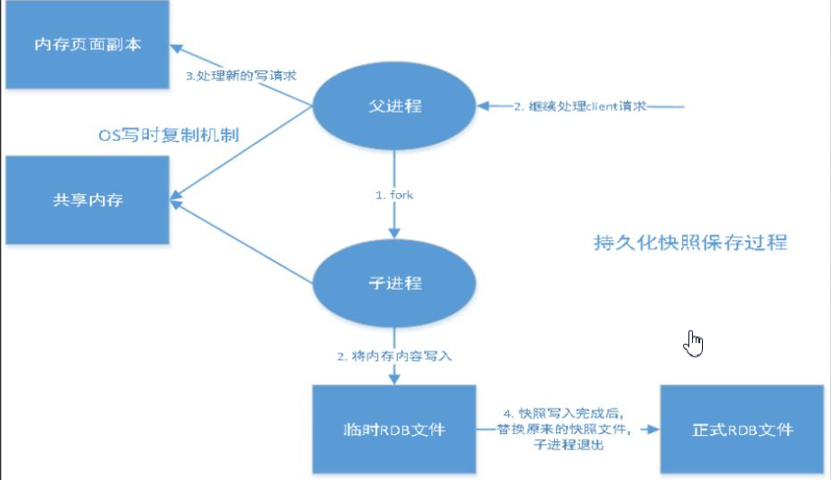

#### 1.3.2 RDB 相关配置

```sh
# 可以通过该配置修改文件名
dbfilename dump.rdb
# 指定 rdb 文件存储的路径
dir
```

#### 1.3.3 触发方式

**自动触发**（满足条件，可配置）：

```sh
# 配置 rdb 数据持久化自动触发的条件：seconds 内有 changes 次写操作则触发
save 900 1
save 300 10
save 60 10000
```

**手动触发**有三种方式：

1. 正常关闭 redis-server（执行 `shutdown`，或手动 `flushdb`）；
2. `save`：该命令会**阻塞**当前 Redis 服务器，执行 save 命令期间，Redis 不能处理其他命令，直到 RDB 过程完成为止。显然该命令对于内存比较大的实例会造成长时间阻塞，这是致命的缺陷；
3. `bgsave`：执行该命令时，Redis 会在**后台异步**进行快照操作，快照同时还可以响应客户端请求。具体操作是 Redis 进程执行 fork 操作创建子进程，RDB 持久化过程由子进程负责，完成后自动结束。阻塞只发生在 fork 阶段，一般时间很短。

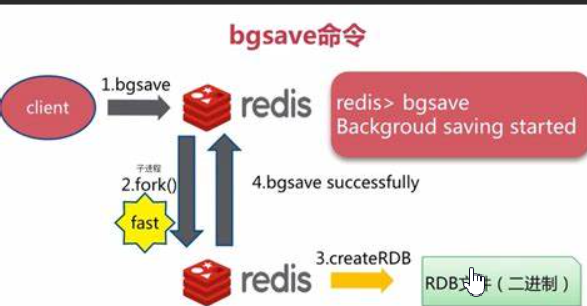

### 1.4 AOF

#### 1.4.1 AOF 的特点

将 Redis 所有的写操作**命令**记录下来（读操作不记录），以文件追加的方式存放起来，当 Redis 重启恢复数据时，将操作日志从头到尾执行一遍，恢复数据。

AOF 默认是关闭的，如果要开启必须配置 `appendonly yes`。

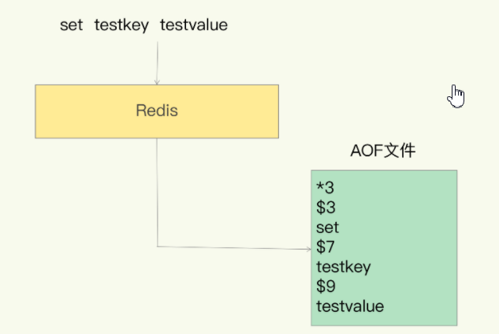

#### 1.4.2 AOF 相关配置

```sh
# AOF 持久化方案默认是关闭，如果要开启，需要如下配置
appendonly yes
# 自定义 aof 日志文件名
appendfilename "appendonly.aof"
# 指定 aof 文件存储目录
dir
```

#### 1.4.3 触发方式

```sh
# aof 的触发条件：appendfsync 的三种取值
appendfsync always
```

`appendfsync` 有三种取值：

| 取值 | 含义 |
| --- | --- |
| `always` | 每个写命令都同步写盘，最安全但性能最差 |
| `everysec` | 每秒同步一次，折中方案（默认） |
| `no` | 由操作系统决定何时同步，性能最好但最不安全 |

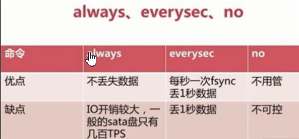

#### 1.4.4 AOF 重写

由于 AOF 持久化是 Redis 不断将写命令记录到 AOF 文件中，随着 Redis 不断的运行，AOF 的文件会越来越大，文件越大，占用的存储空间越大，AOF 恢复所需时间也越长。为了解决这个问题，Redis 新增了**重写机制**：当 AOF 文件的大小超过所设定的阈值时，Redis 就会启动 AOF 文件的内容压缩，只保留可以恢复数据的最小指令集。可以使用命令 `bgrewriteaof` 来手动触发重写。


### 1.5 RDB 对比 AOF


> [!TIP]
> 选型建议：如果对数据的安全性要求比较高（如 Redis 存储秒杀的订单数据），必须要开启 AOF；如果对数据的安全性要求不高（如 Redis 查询缓存），可以不开启 AOF。

## 2. Redis 主从集群（伪集群）

主从模式下一个主节点（master）挂多个从节点（slave），主节点负责写，从节点负责读并同步主节点数据，配合 master-slave 数据备份。

> [!NOTE]
> 操作前先永久关闭防火墙：`systemctl disable firewalld`。

集群配置步骤：

1. 复制配置文件：`cp redis.conf /export/server/redis/conf/redis.conf`；
2. 复制出三份：`redis7001.conf`、`redis7002.conf`、`redis7003.conf`；
3. 清空文件内容：可以打开后用 vim 命令 `10000dd`（删除 10000 行，等效于清空）。

**主节点配置**（7001 节点：redis7001.conf）：

```text
include /export/server/redis/conf/redis.conf
port 7001
pidfile /var/run/redis7001.pid
dbfilename redis7001.rdb
appendfilename "appendonly7001.aof"
```

**从节点配置**（7002 节点：redis7002.conf）：

```text
include /export/server/redis/conf/redis.conf
port 7002
pidfile /var/run/redis7002.pid
dbfilename redis7002.rdb
appendfilename "appendonly7002.aof"
slaveof 192.168.30.128 7001
masterauth 123456
```

**从节点配置**（7003 节点：redis7003.conf）：

```text
include /export/server/redis/conf/redis.conf
port 7003
pidfile /var/run/redis7003.pid
dbfilename redis7003.rdb
appendfilename "appendonly7003.aof"
slaveof 192.168.30.128 7001
masterauth 123456
```

说明：`slaveof <主节点ip> <端口>` 指定跟随的主节点；`masterauth` 是主节点设置了 `requirepass` 时从节点连接主节点用的密码。

启动集群：

```sh
[root@zhuxm01 redis]# redis-server redis7001.conf
[root@zhuxm01 redis]# redis-server redis7002.conf
[root@zhuxm01 redis]# redis-server redis7003.conf
[root@zhuxm01 redis]# ps -ef | grep redis
root      13195      1  0 10:49 ?        00:00:00 redis-server 192.168.234.131:7001
root      13204      1  0 10:49 ?        00:00:00 redis-server 192.168.234.131:7002
root      13213      1  0 10:49 ?        00:00:00 redis-server 192.168.234.131:7003
```

验证：连接各节点用 `./redis-cli -p 7001`、`./redis-cli -p 7002`、`./redis-cli -p 7003`，进入后执行 `info replication` 查看节点状态（角色是 master 还是 slave，以及挂载的主节点）。

## 3. 哨兵模式 Sentinel

主从模式下，如果主节点宕机需要人工切换从节点为主节点，哨兵（Sentinel）就是为了解决这个问题：自动监控与故障迁移。

### 3.1 哨兵模式介绍

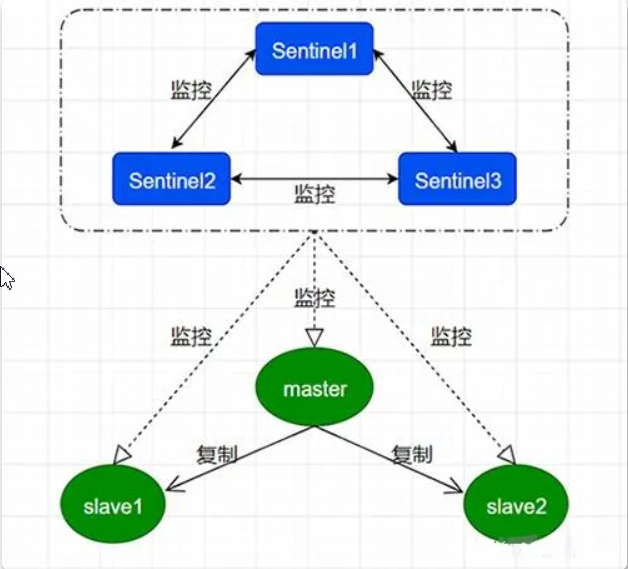

哨兵职责：

- **监控（Monitoring）**：Sentinel 会不断地定期检查你的主服务器和从服务器是否运作正常；
- **提醒（Notification）**：当被监控的某个 Redis 服务器出现问题时，Sentinel 可以通过 API 向管理员或者其他应用程序发送通知；
- **自动故障迁移（Automatic failover）**：当主服务器不能正常工作时，Sentinel 会开始一次自动故障迁移操作，选举新主。

**哨兵是整个集群的入口**：客户端连接的是哨兵，而不是直接连接某个 Redis 节点，这样主节点切换后客户端无感知。

### 3.2 哨兵模式配置

在 redis 目录下创建文件夹 `sentinel-conf`。

1. 先启动 Redis 主从集群；
2. 三个哨兵就新建 3 个配置文件：sentinel01.conf、sentinel02.conf、sentinel03.conf，注意区分端口。

sentinel01.conf（端口 26379）：

```sh
bind 0.0.0.0
# 哨兵的端口
port 26379
# mymaster 为自定义主节点别名
# 末尾的 1 表示：一个哨兵认为主节点挂掉就算挂掉
sentinel monitor mymaster 192.168.30.128 7001 1
# 设置 redis 主节点的访问密码
#sentinel auth-pass mymaster 123456
```

sentinel02.conf（端口 26380）：

```sh
bind 0.0.0.0
# 哨兵的端口
port 26380
sentinel monitor mymaster 192.168.30.128 7001 1
sentinel auth-pass mymaster 123456
```

sentinel03.conf（端口 26381）：

```sh
bind 0.0.0.0
# 哨兵的端口
port 26381
sentinel monitor mymaster 192.168.30.128 7001 1
sentinel auth-pass mymaster 123456
```

3. 启动哨兵：先进入到 redis/bin 下，执行 `./redis-sentinel sentinel01.conf`：

```sh
./redis-sentinel sentinel01.conf
./redis-sentinel sentinel02.conf
./redis-sentinel sentinel03.conf
```

4. 哨兵详细配置项（按需配置）：

```sh
# 哨兵 sentinel 实例运行的端口 默认26379
port 26379

# 以守护进程模式启动
daemonize yes

# 哨兵 sentinel 的工作目录
dir /tmp

# 日志文件名
logfile "sentinel_26379.log"

# sentinel 监控的 master 主机
sentinel monitor mymaster 192.168.1.108 6379 2

# sentinel 连接主从的密码验证，注意主从必须设置一样的密码
# sentinel auth-pass <master-name> <password>
sentinel auth-pass mymaster 123456

# 指定多少毫秒之后主节点没有应答哨兵 sentinel，此时哨兵主观上认为主节点下线，默认30秒
sentinel down-after-milliseconds mymaster 5000

# 在发生 failover 主备切换时，这个选项指定了最多可以有多少个 slave 同时对新的 master 进行同步数据。
# 这个数字越小，完成 failover 所需的时间就越长；数字越大，就意味着越多的 slave 因为 replication 而不可用。
# 可以设为 1 来保证每次只有一个 slave 处于不能处理命令请求的状态
sentinel parallel-syncs mymaster 1

# 失效转移最大时间设置
sentinel failover-timeout mymaster 180000

# 如果设置了这个脚本路径，那么必须保证这个脚本存在于这个路径，并且是可执行的，否则 sentinel 无法正常启动成功
sentinel notification-script mymaster /var/redis/notify.sh
```

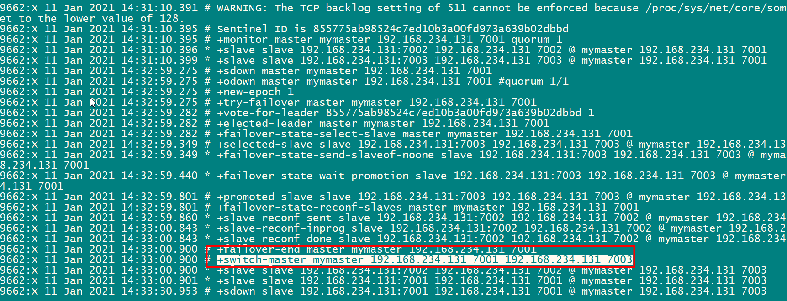

### 3.3 Java 客户端接入

#### 3.3.1 基于 SpringBoot

> [!NOTE]
> 接入前先永久关闭防火墙：`systemctl disable firewalld.service`。

```yaml
spring:
  redis:
    sentinel:
      # 与 sentinel monitor 配置的主节点别名一致
      master: mymaster
      nodes:
        - 192.168.234.110:26379
        - 192.168.234.110:26380
        - 192.168.234.110:26381
    password: 123456
```

#### 3.3.2 基于 XML 配置

```xml
<?xml version="1.0" encoding="UTF-8"?>
<beans xmlns="http://www.springframework.org/schema/beans"
       xmlns:xsi="http://www.w3.org/2001/XMLSchema-instance"
       xmlns:context="http://www.springframework.org/schema/context"
       xmlns:p="http://www.springframework.org/schema/p"
       xsi:schemaLocation="http://www.springframework.org/schema/beans
       http://www.springframework.org/schema/beans/spring-beans.xsd
       http://www.springframework.org/schema/context http://www.springframework.org/schema/context/spring-context.xsd">

    <context:property-placeholder location="classpath:redis.properties" ignore-unresolvable="true" />

    <bean id="pool" class="redis.clients.jedis.JedisPoolConfig">
        <property name="maxTotal" value="${redis.pool.maxTotal}"/>
        <property name="maxIdle" value="${redis.pool.maxIdle}"/>
    </bean>

    <bean id="redisSentinelConfiguration"
          class="org.springframework.data.redis.connection.RedisSentinelConfiguration">
        <property name="master">
            <bean class="org.springframework.data.redis.connection.RedisNode">
                <property name="name" value="mymaster">
                </property>
            </bean>
        </property>

        <property name="sentinels">
            <set>
                <bean class="org.springframework.data.redis.connection.RedisNode">
                    <constructor-arg name="host" value="192.168.25.101" />
                    <constructor-arg name="port" value="26379" />
                </bean>
                <bean class="org.springframework.data.redis.connection.RedisNode">
                    <constructor-arg name="host" value="192.168.25.101" />
                    <constructor-arg name="port" value="26380" />
                </bean>
                <bean class="org.springframework.data.redis.connection.RedisNode">
                    <constructor-arg name="host" value="192.168.25.101" />
                    <constructor-arg name="port" value="26381" />
                </bean>
            </set>
        </property>
    </bean>

    <bean id="jedisConnectionFactory" class="org.springframework.data.redis.connection.jedis.JedisConnectionFactory"
          p:password="123456" >
        <constructor-arg name="sentinelConfig" ref="redisSentinelConfiguration"/>
        <constructor-arg name="poolConfig" ref="pool"/>
    </bean>
    <bean id="stringRedisTemplate" class="org.springframework.data.redis.core.StringRedisTemplate">
        <constructor-arg name="connectionFactory" ref="jedisConnectionFactory"/>
    </bean>
</beans>
```

测试：

```java
package com.qf;

import org.junit.Test;
import org.junit.runner.RunWith;
import org.springframework.beans.factory.annotation.Autowired;
import org.springframework.data.redis.core.StringRedisTemplate;
import org.springframework.test.context.ContextConfiguration;
import org.springframework.test.context.junit4.SpringJUnit4ClassRunner;

/**
 * <p>title: com.qf</p>
 * <p>Company: wendao</p>
 * author zhuximing
 * date 2021/6/25
 * description:
 */
@RunWith(SpringJUnit4ClassRunner.class)
@ContextConfiguration(locations = {"classpath:app-sentinel.xml"})
public class TestSentinel {

    @Autowired
    private StringRedisTemplate redisTemplate;

    @Test
    public void testSentinel() {
        redisTemplate.boundValueOps("name").set("rose");

        String name = redisTemplate.boundValueOps("name").get();
        System.out.println(name);
    }
}
```

## 4. Redis 分布式集群

### 4.1 为什么要分布式集群

> [!NOTE]
> 哨兵模式的弊端：**内存的瓶颈**。主从集群中所有数据都存在主节点上，数据量大到超过单机内存时无法扩展；分布式集群（Redis Cluster）通过分片把数据分散到多个主节点上解决该问题。

### 4.2 分布式集群搭建

说明：

1. 伪集群：一台服务器，启动 6 个 Redis 服务，通过端口区分（7001~7006）；
2. 真集群：6 个节点或者 3 个节点。

操作前先强杀所有 redis 进程，把 redis/data 下的所有数据文件清空（`rm -rf ./*`），并在 redis 目录下建 `cluster-conf` 目录。

第一步：从源码包复制 redis.conf 到指定目录，并创建 6 个配置文件 redis7001~7006：

```sh
[root@zhuxm01 server]# cp redis-6.0.8/redis.conf /export/server/redis/cluster-conf/
```

第二步：分别配置每个 redis 的配置文件，详细配置如下，注意区分端口（以 7001 为例）：

```sh
include /export/server/redis/cluster-conf/redis.conf
port 7001
# redis 的进程文件
pidfile /var/run/redis7001.pid
# rdb 文件名
dbfilename redis7001.rdb
# aof 文件名
appendfilename "appendonly7001.aof"
# 开启集群模式
cluster-enabled yes
# 生成的 node 文件
cluster-config-file nodes7001.conf
# 守护进程
daemonize yes
# aof、rdb 文件存储目录
dir /export/server/redis/data/
bind 0.0.0.0
```

如果 Redis 设置了密码，需要加上如下配置：

```sh
requirepass "123456"
masterauth "123456"
```

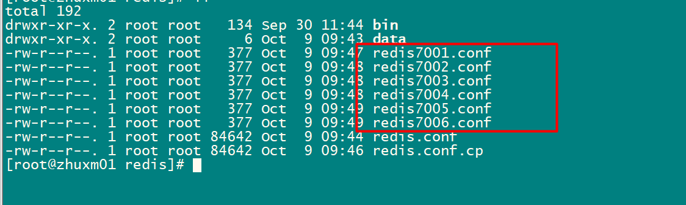

第三步：启动每个 redis 服务：

```sh
[root@zhuxm01 redis]# redis-server /export/server/redis/redis7001.conf
[root@zhuxm01 redis]# redis-server /export/server/redis/redis7002.conf
[root@zhuxm01 redis]# redis-server /export/server/redis/redis7003.conf
[root@zhuxm01 redis]# redis-server /export/server/redis/redis7004.conf
[root@zhuxm01 redis]# redis-server /export/server/redis/redis7005.conf
[root@zhuxm01 redis]# redis-server /export/server/redis/redis7006.conf
[root@zhuxm01 redis]# ps -ef | grep redis
root      11186      1  0 09:51 ?        00:00:00 redis-server 192.168.234.131:7001 [cluster]
root      11195      1  0 09:51 ?        00:00:00 redis-server 192.168.234.131:7002 [cluster]
root      11203      1  0 09:51 ?        00:00:00 redis-server 192.168.234.131:7003 [cluster]
root      11212      1  0 09:51 ?        00:00:00 redis-server 192.168.234.131:7004 [cluster]
root      11220      1  0 09:51 ?        00:00:00 redis-server 192.168.234.131:7005 [cluster]
root      11229      1  0 09:51 ?        00:00:00 redis-server 192.168.234.131:7006 [cluster]
root      11240   7691  0 09:52 pts/0    00:00:00 grep --color=auto redis
[root@zhuxm01 redis]#
```

第四步：创建集群（在 redis/bin 下执行）。`--cluster-replicas 1` 表示每个主节点配 1 个从节点：

```sh
./redis-cli --cluster create 192.168.214.102:7001 \
192.168.214.102:7002 \
192.168.214.102:7003 \
192.168.214.102:7004 \
192.168.214.102:7005 \
192.168.214.102:7006 \
--cluster-replicas 1
```

> [!WARNING]
> 如果创建时报 `[ERR] Node 192.168.247.30:7002 is not empty. Either the node already knows other nodes (check with CLUSTER NODES) or contains some key in database 0.`，说明节点上残留了旧数据或旧节点信息，把 data 目录下的文件和生成的 nodes*.conf 清空后重试。

创建成功后可以看到槽位分配结果（16384 个槽平均分给 3 个主节点）：

```text
>>> Performing hash slots allocation on 6 nodes...
Master[0] -> Slots 0 - 5460
Master[1] -> Slots 5461 - 10922
Master[2] -> Slots 10923 - 16383
Adding replica 192.168.234.131:7005 to 192.168.234.131:7001
Adding replica 192.168.234.131:7006 to 192.168.234.131:7002
Adding replica 192.168.234.131:7004 to 192.168.234.131:7003
>>> Trying to optimize slaves allocation for anti-affinity
[WARNING] Some slaves are in the same host as their master
M: 7e88abdfa256140ab11dc3c2173b00c5868a0479 192.168.234.131:7001
   slots:[0-5460] (5461 slots) master
M: e5845e3494d58b5400fa21d4b3c34ccafce43024 192.168.234.131:7002
   slots:[5461-10922] (5462 slots) master
M: 5dbec321866665aceb8ae0c6791e2ded39464368 192.168.234.131:7003
   slots:[10923-16383] (5461 slots) master
S: 8ad824d12b9f1a16a75e227266e9940aa8610422 192.168.234.131:7004
   replicates 5dbec321866665aceb8ae0c6791e2ded39464368
S: 8ca84b32509e178181585206eaa736c6323dbd3a 192.168.234.131:7005
   replicates 7e88abdfa256140ab11dc3c2173b00c5868a0479
S: 7a518a28534593c44694215e3a83b3311704e4d4 192.168.234.131:7006
   replicates e5845e3494d58b5400fa21d4b3c34ccafce43024
Can I set the above configuration? (type 'yes' to accept): yes
>>> Nodes configuration updated
>>> Assign a different config epoch to each node
>>> Sending CLUSTER MEET messages to join the cluster
```

第五步：连接集群。注意加 `-c` 参数表示以集群模式连接：

```sh
./redis-cli -p 7002 -c
# 补充：观察节点详情，先通过客户端连接，再执行 info replication
```

### 4.3 分布式集群的 Java 客户端连接

#### 4.3.1 基于 SpringBoot

```yaml
spring:
  redis:
    cluster:
      nodes:
        - 192.168.234.110:7001
        - 192.168.234.110:7002
        - 192.168.234.110:7003
        - 192.168.234.110:7004
        - 192.168.234.110:7005
        - 192.168.234.110:7006
```

#### 4.3.2 基于 XML 配置

pom.xml：

```xml
<dependency>
    <groupId>redis.clients</groupId>
    <artifactId>jedis</artifactId>
    <version>2.9.0</version>
</dependency>

<dependency>
    <groupId>org.springframework.data</groupId>
    <artifactId>spring-data-redis</artifactId>
    <version>2.0.12.RELEASE</version>
</dependency>
```

applicationContext-redis.xml：

```xml
<?xml version="1.0" encoding="UTF-8"?>
<beans xmlns="http://www.springframework.org/schema/beans"
       xmlns:xsi="http://www.w3.org/2001/XMLSchema-instance"
       xmlns:p="http://www.springframework.org/schema/p"
       xmlns:context="http://www.springframework.org/schema/context"
       xsi:schemaLocation="
            http://www.springframework.org/schema/beans
            http://www.springframework.org/schema/beans/spring-beans-4.2.xsd
            http://www.springframework.org/schema/context
            http://www.springframework.org/schema/context/spring-context-4.2.xsd">

    <!-- 配置Cluster -->
    <bean id="redisClusterConfiguration"
          class="org.springframework.data.redis.connection.RedisClusterConfiguration">
        <!-- 节点配置 -->
        <property name="clusterNodes">
            <set>
                <bean class="org.springframework.data.redis.connection.RedisNode">
                    <constructor-arg name="host" value="192.168.25.101"></constructor-arg>
                    <constructor-arg name="port" value="7001"></constructor-arg>
                </bean>
                <bean class="org.springframework.data.redis.connection.RedisNode">
                    <constructor-arg name="host" value="192.168.25.101"></constructor-arg>
                    <constructor-arg name="port" value="7002"></constructor-arg>
                </bean>
                <bean class="org.springframework.data.redis.connection.RedisNode">
                    <constructor-arg name="host" value="192.168.25.101"></constructor-arg>
                    <constructor-arg name="port" value="7003"></constructor-arg>
                </bean>
                <bean class="org.springframework.data.redis.connection.RedisNode">
                    <constructor-arg name="host" value="192.168.25.101"></constructor-arg>
                    <constructor-arg name="port" value="7004"></constructor-arg>
                </bean>
                <bean class="org.springframework.data.redis.connection.RedisNode">
                    <constructor-arg name="host" value="192.168.25.101"></constructor-arg>
                    <constructor-arg name="port" value="7005"></constructor-arg>
                </bean>
                <bean class="org.springframework.data.redis.connection.RedisNode">
                    <constructor-arg name="host" value="192.168.25.101"></constructor-arg>
                    <constructor-arg name="port" value="7006"></constructor-arg>
                </bean>
            </set>
        </property>
    </bean>
    <!-- redis 连接池的配置信息 -->
    <bean id="jedisPoolConfig" class="redis.clients.jedis.JedisPoolConfig">
        <property name="maxIdle" value="100" />
        <property name="maxTotal" value="600" />
    </bean>

    <bean id="jedisConnectionFactory"
          class="org.springframework.data.redis.connection.jedis.JedisConnectionFactory">
        <constructor-arg ref="redisClusterConfiguration" />
        <constructor-arg ref="jedisPoolConfig" />
    </bean>
    <!-- redis 访问的模板 -->
    <bean id="redisTemplate" class="org.springframework.data.redis.core.StringRedisTemplate">
        <property name="connectionFactory" ref="jedisConnectionFactory" />
    </bean>
</beans>
```

测试（用法与单机版完全一致，路由由集群自动完成）：

```java
@RunWith(SpringJUnit4ClassRunner.class)
@ContextConfiguration("classpath*:applicationContext-*.xml")
public class TestSysRoleServie {

    @Autowired
    private RedisTemplate redisTemplate;

    @Test
    public void testString() {
        redisTemplate.boundValueOps("demo").set("1234");
        redisTemplate.expire("demo", 30, TimeUnit.SECONDS);
        System.out.println(redisTemplate.boundValueOps("demo").get());
    }

    @Test
    public void testList() {
        redisTemplate.boundListOps("names").leftPush("张飞");
        redisTemplate.boundListOps("names").leftPush("刘备");
        redisTemplate.boundListOps("names").leftPush("关羽");
        redisTemplate.boundListOps("names").leftPush("曹操");

        System.out.println(redisTemplate.boundListOps("names").rightPop());
        System.out.println(redisTemplate.boundListOps("names").rightPop());
        System.out.println(redisTemplate.boundListOps("names").rightPop());
        System.out.println(redisTemplate.boundListOps("names").rightPop());
    }

    @Test
    public void testSet() {
        redisTemplate.boundSetOps("ips").add("123", "123", "345", "678");
        System.out.println(redisTemplate.boundSetOps("ips").members());
        System.out.println(redisTemplate.boundSetOps("ips").size());
    }

    @Test
    public void testHash() {
        redisTemplate.boundHashOps("person").put("name", "jack");
        redisTemplate.boundHashOps("person").put("age", "12");
        System.out.println(redisTemplate.boundHashOps("person").get("name"));
        System.out.println(redisTemplate.boundHashOps("person").size());
    }
}
```

## 5. Redis 缓存三类问题

### 5.1 缓存击穿

**定义**：某一个**热点 key**，在**失效的一瞬间**，持续的高并发访问击破缓存直接访问数据库，导致数据库遭受周期性压力（极端情况下导致数据库宕机）。

#### 5.1.1 缓存击穿演示

用 JMeter（压力测试工具，可以演示高并发场景）模拟热点 key 失效瞬间的高并发请求。

创建测试计划：

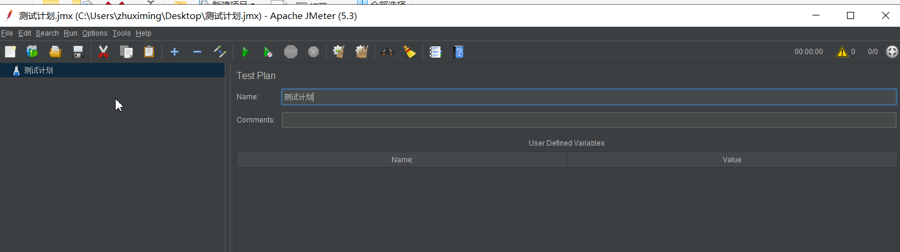

创建线程组：

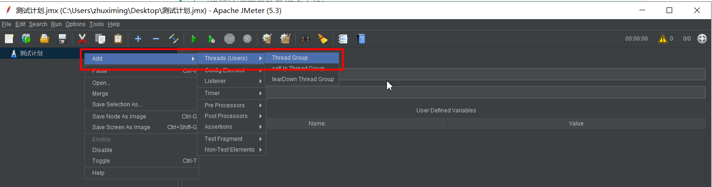

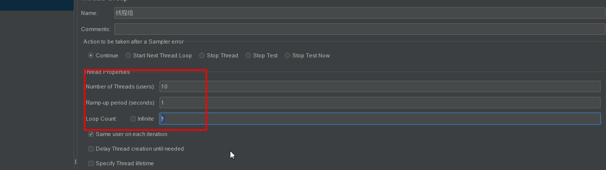

创建 HTTP 请求：

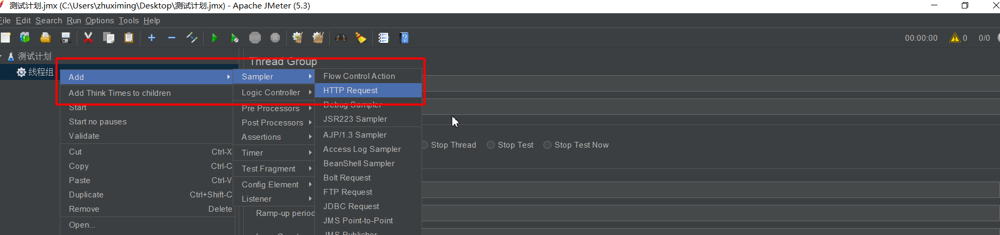

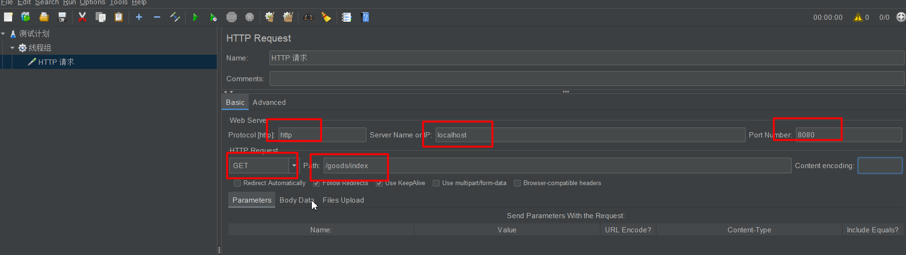

监听 HTTP 请求的结果：

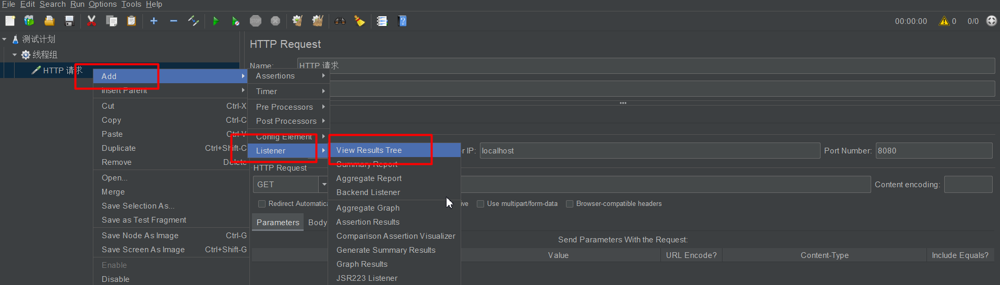

开始压力测试：

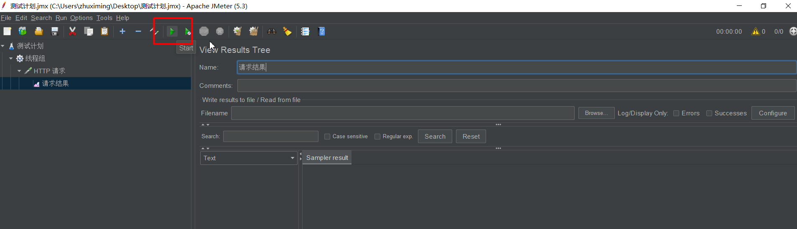

#### 5.1.2 缓存击穿解决办法

加锁（分布式锁）+ 两次判断：先查一次缓存，未命中后在锁内**再查一次**缓存（双重检查），仍为空才查数据库并回写缓存，避免大量线程同时穿透到数据库。

```java
@Override
public List<TbCategory> selectAll() {

    /**
     * string
     * k => index:category
     * v => json串（分类列表）
     */
    // get from redis
    BoundValueOperations<String, String> operations = redisTemplate.boundValueOps("index:category");
    String catListJsonStr = operations.get();
    if (StringUtils.isEmpty(catListJsonStr)) {
        List<TbCategory> categories;
        synchronized (this) {
            // 第二次判断：拿到锁之后再次确认缓存是否已被别的线程回填
            String catListJsonStrAgain = operations.get();
            if (StringUtils.isEmpty(catListJsonStrAgain)) {
                System.out.println("get from db");
                // get from db
                categories = categoryMapper.findAll();
                String jsonStr = JSONUtil.parse(categories).toStringPretty();

                // cache to redis
                operations.set(jsonStr);
                return categories;
            } else {
                System.out.println("get from redis");

                List list = JSONUtil.toList(catListJsonStrAgain, TbCategory.class);
                return list;
            }
        }
    } else {
        System.out.println("get from redis");
        // json串 => 对象
        List list = JSONUtil.toList(catListJsonStr, TbCategory.class);
        return list;
    }
}
```

### 5.2 缓存穿透

**定义**：请求的某个数据在**数据库中并不存在**，缓存也无法命中，请求都会打到数据源，从而可能压垮数据源。即"数据库中没有，同时 Redis 中也没有"，缓存对这种请求完全失效，攻击者可以用大量不存在的 key 发起请求。

#### 5.2.1 方案1：缓存空值

即使查库结果为空，也把空结果缓存到 Redis 中（以 hash 结构为例，field 为查询参数），这样同样的请求下次直接命中缓存的空值：

```java
@Override
public List<TbBrand> selectBrandsByCatId(String catId) {

    /**
     * string
     * k => index:brand:${catId}
     * v => 品牌列表的json串
     *
     * hash【推荐】
     * k => index:brand
     * v =>
     *       field => ${catId}
     *       value => 品牌列表的json串
     */

    // get from redis
    BoundHashOperations<String, Object, Object> operations = redisTemplate.boundHashOps("index:brand");
    Object brandListJsonStr = operations.get(catId);
    if (StringUtils.isEmpty(brandListJsonStr)) {

        System.out.println("get from db" + catId);

        // get from db
        List<TbBrand> brandsByCatId = brandMapper.findBrandsByCatId(catId);

        // 无论结果是否为空都缓存（缓存空值），防止穿透
        String jsonStr = JSONUtil.parse(brandsByCatId).toStringPretty();
        operations.put(catId, jsonStr);

        return brandsByCatId;
    } else {

        System.out.println("get from redis" + catId);

        List<TbBrand> tbBrands = JSONUtil.toList((String) brandListJsonStr, TbBrand.class);

        return tbBrands;
    }
}
```

#### 5.2.2 方案2：布隆过滤

在缓存之前先用布隆过滤器判断数据是否存在，一定不存在的数据直接拦截，根本不查缓存和数据库。布隆过滤器的详细原理见《布隆过滤器》一篇，此处给出 Redisson 的接入示例：

```java
@Bean
public RedissonClient redissonClient() {

    // 构造 redisson 客户端，并放入 IOC 容器中
    Config config = new Config();
    config.useSingleServer().setAddress("redis://127.0.0.1:6379");

    RedissonClient redissonClient = Redisson.create(config);

    RBloomFilter<Object> bloomFilter = redissonClient.getBloomFilter("spuIds");

    // 初始化：预计元素数量1亿，误判率3%
    bloomFilter.tryInit(100000000L, 0.03);

    // 初始化数据
    bloomFilter.add("1");
    bloomFilter.add("2");
    bloomFilter.add("3");
    bloomFilter.add("4");
    bloomFilter.add("5");

    return redissonClient;
}
```

### 5.3 缓存雪崩

**定义**：当 Redis 服务器重启，或者**大量缓存在某一个时间段集中失效**时，即使不是高并发，访问量大也会导致数据库访问压力骤增（与击穿的区别：击穿是单个热点 key，雪崩是大批 key 同时失效）。

解决方案：**让过期时间平均分布**，过期时间 = 预设置的过期时间 + 随机数，避免大批 key 同一时刻失效。

## 6. 面试高频问题

### 6.1 Redis 内存满了怎么办？

#### 6.1.1 设置最大内存

方式一：通过配置文件配置。在 Redis 安装目录下的 **redis.conf** 配置文件中添加以下配置设置内存大小：

```sh
# 设置Redis最大占用内存大小为100M
maxmemory 100mb
```

方式二：通过命令修改。Redis 支持运行时通过命令动态修改内存大小：

```sh
# 设置Redis最大占用内存大小为100M
127.0.0.1:6379> config set maxmemory 100mb
# 获取设置的Redis能使用的最大内存大小
127.0.0.1:6379> config get maxmemory
```

> [!NOTE]
> 如果不设置最大内存大小或者设置最大内存大小为 0，在 64 位操作系统下不限制内存大小，在 32 位操作系统下最多使用 3GB 内存。

#### 6.1.2 Redis 的内存淘汰策略

既然可以设置 Redis 最大占用内存大小，那么配置的内存就有用完的时候。那在内存用完的时候，还继续往 Redis 里面添加数据，不就没内存可用了吗？

实际上 Redis 定义了几种策略用来处理这种情况：

| 策略 | 说明 |
| --- | --- |
| noeviction（默认策略） | 对于写请求不再提供服务，直接返回错误（DEL 请求和部分特殊请求除外） |
| allkeys-lru | 从所有 key 中使用 LRU 算法进行淘汰（LRU：Least Recently Used，最近最少使用） |
| volatile-lru | 从设置了过期时间的 key 中使用 LRU 算法进行淘汰 |
| allkeys-random | 从所有 key 中随机淘汰数据 |
| volatile-random | 从设置了过期时间的 key 中随机淘汰 |
| volatile-ttl | 在设置了过期时间的 key 中，根据 key 的过期时间进行淘汰，越早过期的越优先被淘汰 |

> [!NOTE]
> 当使用 volatile-lru、volatile-random、volatile-ttl 这三种策略时，如果没有 key 可以被淘汰，则和 noeviction 一样返回错误。

#### 6.1.3 如何获取及设置内存淘汰策略

获取当前内存淘汰策略：

```sh
127.0.0.1:6379> config get maxmemory-policy
```

通过配置文件设置淘汰策略（修改 **redis.conf** 文件）：

```sh
maxmemory-policy allkeys-lru
```

通过命令修改淘汰策略：

```sh
127.0.0.1:6379> config set maxmemory-policy allkeys-lru
```

### 6.2 为什么删除数据后，Redis 内存占用依然很高？

#### 6.2.1 什么是内存碎片

内存碎片这个概念熟悉 JVM 或者操作系统的应该都不陌生。以火车卖票为例：一个车厢有 128 个车位，由于高峰期只剩余 2 个位置了，但此时有 3 个人想要坐在一起，那么这 3 个人肯定不会买这节车厢的 2 个位置，此时这 2 个位置就可以称之为"座位碎片"。

#### 6.2.2 为什么会出现内存碎片

Redis 提供了多种的内存分配策略，比如 libc、jemalloc、tcmalloc，默认使用 jemalloc。

jemalloc 这种分配策略**并不是按需分配，而是固定大小分配**，比如 8 字节、32 字节……2KB、4KB 等。申请的数据比固定档位小，就会产生分配出去但用不满的空间，即内存碎片。


#### 6.2.3 如何判断存在内存碎片

> [!IMPORTANT]
> 这一点对于运维人员来说很重要：一旦出现 Redis 运行缓慢或者阻塞了，一定要先判断内存的占用情况，而不是直接重启 Redis。

```sh
INFO memory
# Memory
used_memory:1073741736        # 实际使用的内存大小
used_memory_human:1024.00M    # 人类可读的方式
used_memory_rss:1997159792    # 操作系统实际内存分配
used_memory_rss_human:1.86G
...
mem_fragmentation_ratio:1.86  # 碎片率
```

`mem_fragmentation_ratio` 这个指标很清楚地展示了当前内存的碎片率：比如 Redis 申请了 1000 字节，但是操作系统实际分配的内存是 1800 字节，则 mem_fragmentation_ratio = 1800 / 1000 = 1.8。

#### 6.2.4 如何清理内存碎片

Redis 提供了参数配置，可以控制清除内存碎片的时机：

```sh
config set activedefrag yes
```

以上命令开启自动清理，但是具体什么时候清理，还要受以下两个参数的影响：

1. `active-defrag-ignore-bytes 400mb`：如果内存碎片达到了 400mb，开始清理（可自定义）；
2. `active-defrag-threshold-lower 20`：内存碎片空间占操作系统分配给 Redis 的总空间比例达到 20% 时，开始清理（可自定义）。

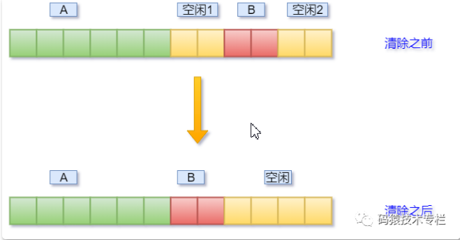

### 6.3 Redis 6 的新特性

#### 6.3.1 多线程 IO

1. 严格来讲从 Redis 4.0 之后并不是单线程，除了主线程外，它也有后台线程在处理一些较为缓慢的操作，例如清理脏数据、无用连接的释放、大 key 的删除等；
2. Redis 多线程主要解决的是**网络 IO 瓶颈**，并不是解决 CPU 瓶颈。

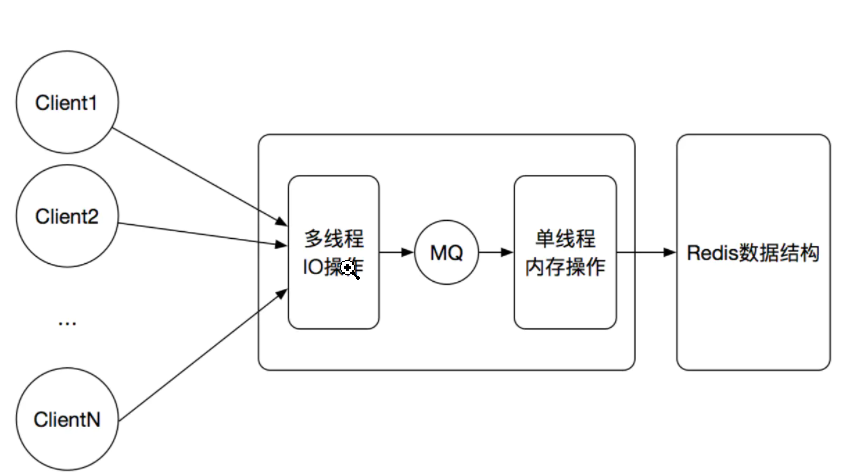

> [!IMPORTANT]
> 从上面的实现机制可以看出，Redis 的多线程部分只是用来处理网络数据的读写和协议解析，**执行命令仍然是单线程顺序执行**。所以我们不需要去考虑控制并发及线程安全问题。

3. Redis 6.0 默认是否开启了多线程？Redis 6.0 的多线程默认是**禁用**的，只使用主线程。如需开启需要修改 redis.conf 配置文件：

```sh
io-threads-do-reads yes
```


4. Redis 6.0 多线程开启时，线程数如何设置？开启多线程后，还需要设置线程数，否则是不生效的。同样修改 redis.conf 配置文件：


关于线程数的设置，官方有一个建议：4 核的机器建议设置为 2 或 3 个线程，8 核的建议设置为 6 个线程，**线程数一定要小于机器核数**。还需要注意的是，线程数并不是越大越好，官方认为超过了 8 个基本就没什么意义了。

#### 6.3.2 ACL 访问控制

Redis 6 之前，Redis 只有一个用户 default，权限最高，通过配置文件的 requirepass 配置密码。

Redis 6 版本推出了 **ACL（Access Control List，访问控制权限）** 功能，基于此功能可以设置多个用户。为了保证**向下兼容**，Redis 6 保留了 default 用户和使用 requirepass 的方式给 default 用户设置密码；默认情况下 default 用户拥有 Redis 最大权限，使用 redis-cli 连接时如果没有指定用户名，用户默认就是 default。

```sh
# ACL 常用命令
ACL whoami     # 查看当前用户
ACL list       # 查看用户列表

# 创建用户allen，密码123456，拥有所有权限和所有key的访问权
ACL setuser allen on >123456 +@all ~*
AUTH allen 123456

# 只能创建以lakers为前缀的key
ACL setuser james on >123456 +@all ~lakers*
# 剔除set权限
ACL setuser james -SET

# 删除用户
ACL DELUSER james
```

## 7. 小结

- **持久化**：RDB 是快照、性能高但可能丢数据；AOF 是写命令日志、更安全但文件大，可用重写压缩；按数据安全要求选型；
- **主从 + 哨兵**：读写分离、数据备份，哨兵负责监控、提醒与自动故障迁移，是集群的入口；
- **分布式集群**：通过 16384 个槽位把数据分片到多个主节点，解决哨兵模式下单机内存瓶颈；
- **缓存三大问题**：击穿（热点 key 失效，加锁 + 双重检查）、穿透（查不存在的数据，缓存空值 + 布隆过滤器）、雪崩（大量 key 同时失效，过期时间加随机数）；
- **面试高频**：最大内存与淘汰策略、内存碎片（jemalloc 固定档位分配、mem_fragmentation_ratio）、Redis 6 多线程 IO 与 ACL。
