# Nacos

## 1. 微服务架构

### 1.1 单体架构

**定义**：将项目所有模块（功能）打成一个 jar 或者 war 包，然后部署在一个进程中运行。


单体架构的优缺点：

| 优点 | 说明 |
| --- | --- |
| 部署简单 | 由于是完整的结构体，可以直接部署在一个服务器上即可 |
| 技术单一 | 项目不需要复杂的技术栈，往往一套熟悉的技术栈就可以完成开发 |
| 用人成本低 | 单个程序员可以完成业务接口到数据库的整个流程 |

| 缺点 | 说明 |
| --- | --- |
| 系统启动慢 | 一个进程包含了所有的业务逻辑，涉及的启动模块过多，导致系统的启动、重启时间周期过长 |
| 错误隔离性差、可用性差 | 任何一个模块的错误均可能造成整个系统的宕机 |
| 可伸缩性差 | 系统的扩容只能对整个应用进行扩容，无法结合业务模块的特点进行伸缩 |
| 线上问题修复周期长 | 任何一个线上问题修复需要对整个应用系统进行全面升级 |
| 跨语言程度差 | 整个应用绑定在一门语言上 |
| 不利于安全管理 | 所有开发人员都拥有全量代码 |

> [!NOTE]
> 单体架构并非一无是处：运营平台、传统项目这类访问量不大的场景，采用单体架构即可。

### 1.2 微服务架构

微服务架构论文：<https://martinfowler.com/articles/microservices.html>

译文：<https://mp.weixin.qq.com/s?__biz=MjM5MjEwNTEzOQ==&mid=401500724&idx=1&sn=4e42fa2ffcd5732ae044fe6a387a1cc3#rd>

```text
In short, the microservice architectural style is an approach to developing a single
application as a suite of small services, each running in its own process and
communicating with lightweight mechanisms, often an HTTP resource API. These services
are built around business capabilities and independently deployable by fully automated
deployment machinery. There is a bare minimum of centralized management of these
services, which may be written in different programming languages and use different
data storage technologies.

简而言之，微服务架构风格这种开发方法，是以开发一组小型服务的方式来开发一个独立的应用系统的。
其中每个小型服务都运行在自己的进程中，并经常采用 HTTP 资源 API 这样轻量的机制来相互通信。
这些服务围绕业务功能进行构建，并能通过全自动的部署机制来进行独立部署。这些微服务可以使用
不同的语言来编写，并且可以使用不同的数据存储技术。对这些微服务我们仅做最低限度的集中管理。
```

解读微服务特点：

1. 微服务是一种项目架构思想（风格）；
2. 微服务架构是一系列小服务的组合（组件化与多服务）；
3. 任何一个微服务，都是一个独立的进程（独立开发、独立维护、独立部署）；
4. 轻量级通信，HTTP 协议（跨语言、跨平台）；
5. 服务粒度围绕业务功能拆分；
6. 去中心化管理（去中心化地治理技术、去中心化地管理数据）。

### 1.3 微服务架构的优势

| 优势 | 说明 |
| --- | --- |
| 易于开发和维护 | 一个微服务只关注一个特定的业务功能，所以它的业务清晰、代码量较少。开发和维护单个微服务相对比较简单；整个应用由若干个微服务构建而成，整体维持在可控状态 |
| 单个微服务启动较快 | 单个微服务代码量较少，所以启动会比较快 |
| 局部修改容易部署 | 单体应用只要有修改，就要重新部署整个应用；而微服务对某个服务进行修改后，只需要重新部署这个服务即可 |
| 技术栈不受限 | 可以结合项目业务及团队的特点，合理地选择技术栈 |
| 按需伸缩 | 哪个服务压力大就扩容哪个服务 |

### 1.4 微服务架构的缺点（挑战）

1. 服务太多，导致服务间的依赖错综复杂，运维难度大；
2. 微服务放大了分布式架构的一系列问题：
   - 分布式事务（Seata）；
   - 分布式锁怎么处理（Redisson）；
   - 服务注册与发现（Nacos）；
   - 依赖服务不稳定（Sentinel）导致服务雪崩怎么办？
3. 运维复杂度陡增，部署数量多、监控进程多导致整体运维复杂度提升。

> [!NOTE]
> 微服务架构适用于互联网项目（58 同城、电商、视频点播）。

### 1.5 SpringCloud 与微服务关系

- SpringCloud 为微服务思想提供了完美的解决方案；
- SpringCloud 是一系列框架的集合体（服务的注册与发现【注册中心】、服务间远程调用、服务降级、服务熔断、服务限流、分布式事务等）。

一般我们说 SpringCloud，其实指的是 Spring Cloud Netflix——SpringCloud 并不是造轮子，只是把 Netflix 公司的组件做二次开发；SpringCloud 第二代是 Spring Cloud Alibaba。

### 1.6 SpringBoot 和 SpringCloud 关系

- SpringBoot 专注于快速方便地开发**单个个体微服务**；
- SpringCloud 是关注全局的微服务**协调、整理、治理**的框架，它将 SpringBoot 开发的单体整合并管理起来；
- SpringBoot 可以离开 SpringCloud 独立使用开发项目，但是 SpringCloud 离不开 SpringBoot，属于依赖关系。

## 2. 服务注册与发现

### 2.1 什么是服务注册与发现

**服务注册**：将提供某个服务的模块信息（通常是这个服务的 ip 和端口）注册到一个公共的组件上去（比如 Zookeeper、Consul、Eureka、Nacos）。

**服务发现**：新注册的这个服务模块能够及时地被其他调用者发现。不管是服务新增和服务删减都能实现自动发现。

### 2.2 注册中心对比

- **Nacos**：阿里开源的，经过了阿里实践的；
- **Eureka**：Netflix 公司的，现在不维护了，闭源了；
- **Consul**：HashiCorp 公司推出的开源产品，用于实现分布式系统的服务发现、服务隔离、服务配置。

| 对比组件 | Nacos | Eureka | Consul | Zookeeper |
| --- | --- | --- | --- | --- |
| 一致性对比 | 支持 AP 和 CP 模型 | AP 模型 | CP 模型 | CP 模型 |
| 健康检查 | tcp/http/client Beat | client Beat | TCP/HTTP/gRPC | keep Alive |
| 负载均衡策略 | Ribbon | Ribbon | Fabio | - |
| 雪崩保护 | 有 | 有 | 无 | 无 |
| 自动注销实例 | 支持 | 支持 | 不支持 | 支持 |
| 访问协议 | HTTP | HTTP | HTTP | TCP |
| 监听支持 | 支持 | 支持 | 支持 | 支持 |
| 多数据中心 | 支持 | 支持 | 支持 | 不支持 |
| 跨注册中心同步 | 支持 | 不支持 | 支持 | 不支持 |
| Spring Cloud 集成 | 支持 | 支持 | 支持 | 不支持 |
| Dubbo 集成 | 支持 | 不支持 | 不支持 | 支持 |
| K8s 集成 | 支持 | 不支持 | 支持 | 不支持 |

## 3. Nacos 简介与安装

官网：<https://nacos.io/zh-cn/docs/what-is-nacos.html>

### 3.1 Nacos 功能与架构

Nacos 架构：

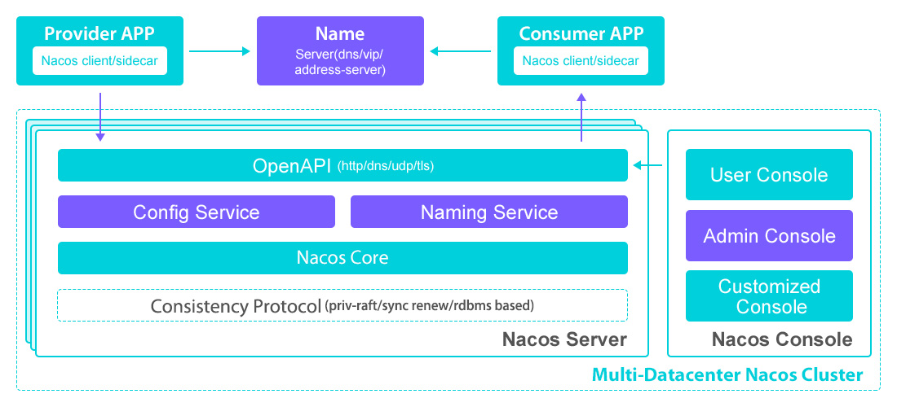

Nacos 功能：

- **名字服务（Naming Service）**：命名服务是指通过指定的名字来获取资源或者服务的地址、提供者的信息；
- **配置服务（Configuration Service）**：动态配置服务让您能够以中心化、外部化和动态化的方式管理所有环境的配置。动态配置消除了配置变更时重新部署应用和服务的需要。配置中心化管理让实现无状态服务更简单，也让按需弹性扩展服务更容易。

### 3.2 Nacos 安装

下载地址：<https://github.com/alibaba/nacos/tags>

1. 解压安装；
2. 配置：

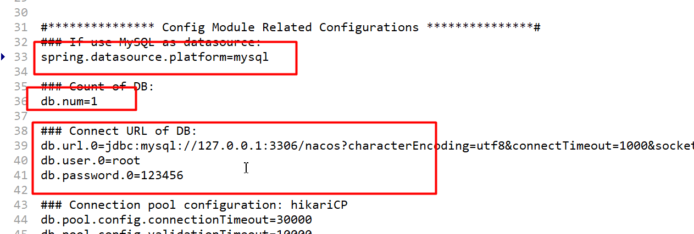

3. 创建数据库以及表（conf 目录下的 nacos-mysql.sql）；
4. 配置 startup.cmd，以 standalone 方式启动：

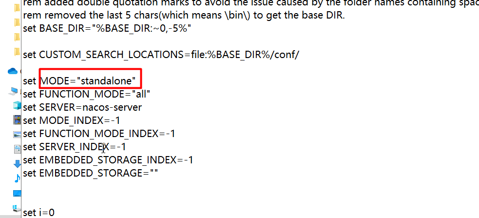

5. 启动。

### 3.3 Nacos 注册中心工作流程

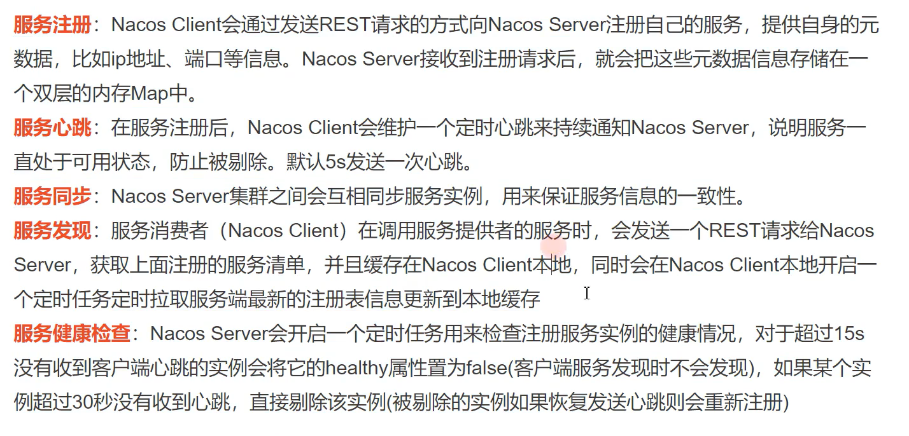

## 4. 微服务入门案例

### 4.1 Boot 与 Cloud 版本

```text
springboot：提供了快速开发微服务的能力
springcloud：提供了微服务治理的能力（服务注册与发现、服务降级、限流、熔断、网关、负载均衡、
配置中心...），为微服务开发提供了全家桶服务
```

SpringBoot 的版本查看地址：<https://spring.io/projects/spring-boot#learn>

SpringCloud 的版本查看地址：<https://spring.io/projects/spring-cloud#overview>

详细版本对应信息查看：<https://start.spring.io/actuator/info>

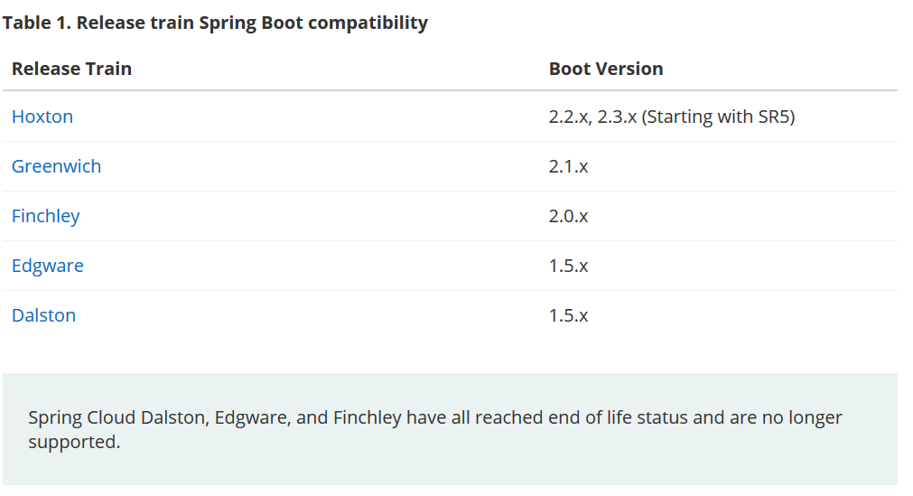

> [!IMPORTANT]
> 如果采用 SpringBoot 和 SpringCloud（Spring Cloud Netflix），使用以上版本对应就 OK 了；但是如果要使用 Alibaba 的组件（Nacos、Sentinel、RocketMQ、Seata），必须使用 Spring Cloud Alibaba。

### 4.2 Spring Cloud Alibaba

SpringCloud 与 Spring Cloud Alibaba 的关系：

- 我们通常说的 SpringCloud，泛指 Spring Cloud Netflix，也是 SpringCloud 第一代；
- Spring Cloud Alibaba 是 SpringCloud 的子项目，是阿里巴巴结合自身微服务实践落地的产物；
- Spring Cloud Alibaba 符合 SpringCloud 标准，依赖于 SpringCloud。

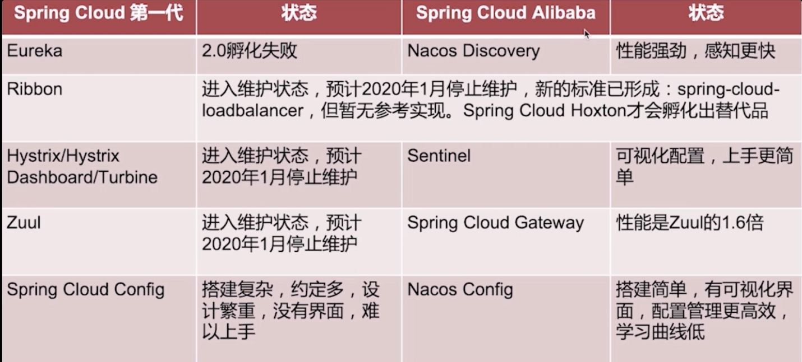

### 4.3 确定版本

确定方式：通过查看 Spring Cloud Alibaba 官网确定：<https://github.com/alibaba/spring-cloud-alibaba/wiki/版本说明>

| Spring Cloud Version | Spring Cloud Alibaba Version | Spring Boot Version |
| --- | --- | --- |
| Spring Cloud Hoxton.SR8 | 2.2.4.RELEASE | 2.3.2.RELEASE |
| Spring Cloud Greenwich.SR6 | 2.1.3.RELEASE | 2.1.13.RELEASE |
| Spring Cloud Hoxton.SR3 | 2.2.1.RELEASE | 2.2.5.RELEASE |
| Spring Cloud Hoxton.RELEASE | 2.2.0.RELEASE | 2.2.X.RELEASE |
| Spring Cloud Greenwich | 2.1.2.RELEASE | 2.1.X.RELEASE |
| Spring Cloud Finchley | 2.0.3.RELEASE | 2.0.X.RELEASE |
| Spring Cloud Edgware | 1.5.1.RELEASE（停止维护，建议升级） | 1.5.X.RELEASE |

最终决定（版本号记忆）：

- spring-cloud-alibaba：2.2.6.RELEASE
- spring-cloud：Hoxton.SR9
- spring-boot：2.3.2.RELEASE

### 4.4 创建父工程

父工程锁定 SpringBoot、SpringCloud、Spring Cloud Alibaba 版本：

```xml
<?xml version="1.0" encoding="UTF-8"?>
<project xmlns="http://maven.apache.org/POM/4.0.0"
         xmlns:xsi="http://www.w3.org/2001/XMLSchema-instance"
         xsi:schemaLocation="http://maven.apache.org/POM/4.0.0 http://maven.apache.org/xsd/maven-4.0.0.xsd">
    <modelVersion>4.0.0</modelVersion>

    <groupId>com.qf</groupId>
    <artifactId>cloud-parent</artifactId>
    <packaging>pom</packaging>
    <version>1.0-SNAPSHOT</version>
    <modules>
        <module>cloud-goods</module> <!-- 初次搭建不需要 -->
    </modules>

    <!-- 父工程的职责：锁定版本 springboot、springcloud、springcloud-alibaba -->
    <parent>
        <groupId>org.springframework.boot</groupId>
        <artifactId>spring-boot-starter-parent</artifactId>
        <version>2.3.2.RELEASE</version>
        <relativePath/> <!-- lookup parent from repository -->
    </parent>

    <dependencyManagement>
        <dependencies>
            <dependency>
                <groupId>com.alibaba.cloud</groupId>
                <artifactId>spring-cloud-alibaba-dependencies</artifactId>
                <version>2.2.6.RELEASE</version>
                <type>pom</type>
                <scope>import</scope>
            </dependency>
            <dependency>
                <groupId>org.springframework.cloud</groupId>
                <artifactId>spring-cloud-dependencies</artifactId>
                <version>Hoxton.SR9</version>
                <type>pom</type>
                <scope>import</scope>
            </dependency>
        </dependencies>
    </dependencyManagement>
</project>
```

### 4.5 服务提供者

Nacos 学习文档：<https://github.com/alibaba/spring-cloud-alibaba/blob/master/spring-cloud-alibaba-docs/src/main/asciidoc-zh/nacos-discovery.adoc>

#### 4.5.1 pom.xml

```xml
<!-- 微服务基础依赖 -->
<dependencies>
    <!-- web的场景依赖 -->
    <dependency>
        <groupId>org.springframework.boot</groupId>
        <artifactId>spring-boot-starter-web</artifactId>
    </dependency>

    <!-- 端点监控场景依赖 -->
    <dependency>
        <groupId>org.springframework.boot</groupId>
        <artifactId>spring-boot-starter-actuator</artifactId>
    </dependency>

    <!-- 服务注册与发现的场景依赖 -->
    <dependency>
        <groupId>com.alibaba.cloud</groupId>
        <artifactId>spring-cloud-starter-alibaba-nacos-discovery</artifactId>
    </dependency>
</dependencies>
```

#### 4.5.2 application.yml

```yaml
spring:
  application:
    name: cloud-goods # 服务名称，必须，保证唯一
  cloud:
    nacos:
      discovery:
        server-addr: localhost:8848 # 指定nacos-server的地址
        username: nacos
        password: nacos
server:
  port: 9001
```

#### 4.5.3 启动类加注解

```java
package com.qf;

import org.springframework.boot.SpringApplication;
import org.springframework.boot.autoconfigure.SpringBootApplication;
import org.springframework.cloud.client.discovery.EnableDiscoveryClient;

@SpringBootApplication
@EnableDiscoveryClient // 开关，开启服务的注册与发现功能
public class GoodsApp {

    public static void main(String[] args) {
        SpringApplication.run(GoodsApp.class, args);
    }
}
```

#### 4.5.4 查询商品接口

```java
package com.qf.controller;

import com.qf.entity.Goods;
import org.springframework.web.bind.annotation.PathVariable;
import org.springframework.web.bind.annotation.RequestMapping;
import org.springframework.web.bind.annotation.RestController;

@RestController
@RequestMapping("goods")
public class GoodsController {

    @RequestMapping("findById/{id}")
    public Goods findById(@PathVariable String id) {
        System.out.println("id" + id);
        return new Goods("小米", 99);
    }
}
```

### 4.6 服务消费者

#### 4.6.1 pom.xml

```xml
<?xml version="1.0" encoding="UTF-8"?>
<project xmlns="http://maven.apache.org/POM/4.0.0"
         xmlns:xsi="http://www.w3.org/2001/XMLSchema-instance"
         xsi:schemaLocation="http://maven.apache.org/POM/4.0.0 http://maven.apache.org/xsd/maven-4.0.0.xsd">
    <parent>
        <artifactId>cloud-parent</artifactId>
        <groupId>com.qf</groupId>
        <version>1.0-SNAPSHOT</version>
    </parent>
    <modelVersion>4.0.0</modelVersion>

    <artifactId>cloud-orders</artifactId>

    <dependencies>
        <!-- web的场景依赖 -->
        <dependency>
            <groupId>org.springframework.boot</groupId>
            <artifactId>spring-boot-starter-web</artifactId>
        </dependency>

        <!-- 健康检查的场景依赖 -->
        <dependency>
            <groupId>org.springframework.boot</groupId>
            <artifactId>spring-boot-starter-actuator</artifactId>
        </dependency>
        <!-- nacos服务注册与发现的场景依赖 -->
        <dependency>
            <groupId>com.alibaba.cloud</groupId>
            <artifactId>spring-cloud-starter-alibaba-nacos-discovery</artifactId>
        </dependency>

        <dependency>
            <groupId>org.projectlombok</groupId>
            <artifactId>lombok</artifactId>
        </dependency>

        <dependency>
            <groupId>com.qf</groupId>
            <artifactId>cloud-entity</artifactId>
            <version>1.0-SNAPSHOT</version>
        </dependency>
    </dependencies>
</project>
```

#### 4.6.2 application.yml

```yaml
spring:
  application:
    name: cloud-orders # 服务的应用名称
  cloud:
    nacos:
      discovery: # nacos配置
        server-addr: localhost:8848
        username: nacos
        password: nacos
        # ip: 127.0.0.1  # 服务注册的ip，可以不写，nacos自动检测到ip
        # port: 9002     # 服务注册的端口，可以不写，nacos自动检测到port
server:
  port: 9002
```

#### 4.6.3 启动类加注解

```java
package com.qf;

import org.springframework.boot.SpringApplication;
import org.springframework.boot.autoconfigure.SpringBootApplication;
import org.springframework.cloud.client.discovery.EnableDiscoveryClient;
import org.springframework.cloud.client.loadbalancer.LoadBalanced;
import org.springframework.context.annotation.Bean;
import org.springframework.web.client.RestTemplate;

/**
 * <p>title: com.qf</p>
 * <p>Company: wendao</p>
 * author zhuximing
 * date 2021/7/16
 * description:
 */
@SpringBootApplication
@EnableDiscoveryClient
public class OrdersApp {

    public static void main(String[] args) {
        SpringApplication.run(OrdersApp.class, args);
    }

    @Bean
    // 让ribbon拦截RestTemplate发出的所有的请求
    // ribbon获取url中的service name
    // 从nacos注册中心获取实例列表
    // 负责从实例列表中通过相应的负载均衡算法，获取一个实例
    // RestTemplate请求实例
    @LoadBalanced
    public RestTemplate initRestTemplate() {
        return new RestTemplate();
    }
}
```

#### 4.6.4 保存订单接口

```java
package com.qf.controller;

import com.qf.entity.Goods;
import org.springframework.beans.factory.annotation.Autowired;
import org.springframework.web.bind.annotation.RequestMapping;
import org.springframework.web.bind.annotation.RestController;
import org.springframework.web.client.RestTemplate;

import java.util.HashMap;
import java.util.Map;

/**
 * <p>title: com.qf.controller</p>
 * <p>Company: wendao</p>
 * author zhuximing
 * date 2021/7/16
 * description:
 */
@RestController
@RequestMapping("order")
public class OrderController {

    @Autowired
    private RestTemplate restTemplate;

    @RequestMapping("save")
    public Map save() {
        // 获取购买的商品信息（远程调用商品微服务去获取商品信息） 发送http请求
        // java发送http请求，可以使用apache httpclient
        // spring提供RestTemplate，更简洁
        // String url = "http://localhost:9002/goods/findById/1"; // 硬编码ip和端口【不推荐】
        String url = "http://cloud-goods/goods/findById/1"; // 直接写服务名【推荐】
        Goods goods = restTemplate.getForObject(url, Goods.class);

        System.out.println(goods);

        // 保存订单（本地调用）
        System.out.println("保存订单成功!!!");

        // todo: 扣库存

        return new HashMap() {{
            put("code", 200);
            put("msg", "success");
        }};
    }
}
```

### 4.7 微服务集群演示

```properties
# 如果不指定端口，那么微服务启动时使用8001，如果指定端口，那么微服务就在指定端口启动
server.port=${port:8001}
```

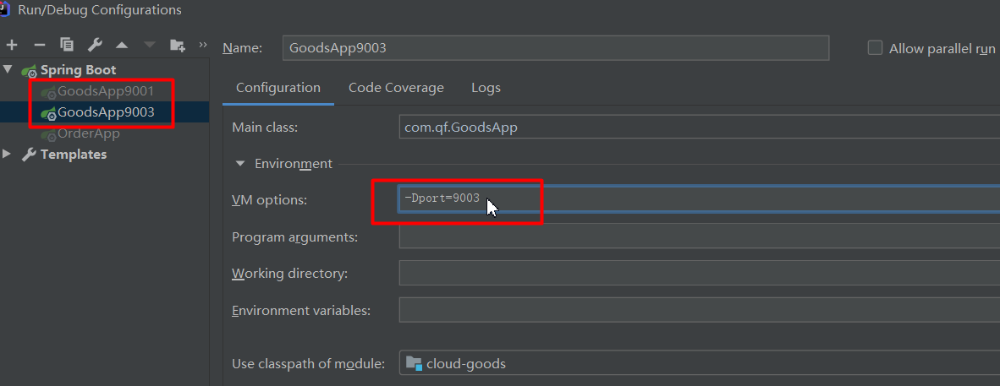

### 4.8 Nacos 领域模型

```text
nacos的服务由三元组唯一确定  (namespace、group、servicename)
nacos的配置由三元组唯一确定  (namespace、group、dataId)

不同的namespace是相互隔离的，相同namespace但是不同的group也是相互隔离的

默认的namespace是public，不能删除
默认的group是DEFAULT-GROUP

使用领域模型实现多环境的服务隔离（多环境公用一个nacos）
```

1. 创建 namespace：

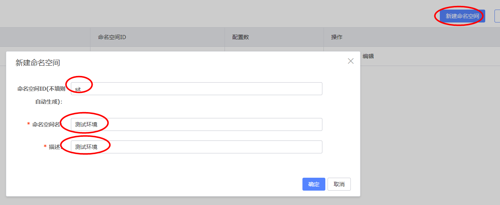

2. 发布服务到指定的 namespace：

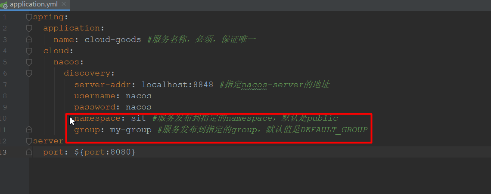

## 5. RestTemplate

RestTemplate 用于实现服务间远程调用。

### 5.1 RestTemplate 简介

1. RestTemplate 是 Java 模拟浏览器发送 http 请求的工具类；
2. RestTemplate 基于 Apache 的 HttpClient 实现。HttpClient 使用起来太过繁琐，Spring 提供了一种简单便捷的模板类来进行操作，这就是 RestTemplate。

后续章节的 OpenFeign 是对 RestTemplate 的进一步封装（声明式调用）。

### 5.2 ForObject

`getForObject` / `postForObject`：**返回的是响应体**（直接反序列化为指定类型）。

get 请求：

```java
Map goods = restTemplate.getForObject(BaseURL + "findGoodsById?goodsId=12", Map.class);
System.out.println(goods.get("goodsName"));
```

post 请求（发送的是 json 串）：

```java
Map goods = restTemplate.postForObject(BaseURL + "/save", new Goods("huawei", 99.99), Map.class);
System.out.println(goods.get("code"));
```

提示：

1. 微服务之间数据传输格式统一为 json；
2. entity 的空构造方法要提供：

```java
@Data
@AllArgsConstructor
@NoArgsConstructor
public class Goods {
    private String goodsName;
    private double price;
}
```

### 5.3 ForEntity

`getForEntity` / `postForEntity`：**返回的是完整的响应对象**（ResponseEntity，包含状态码、响应头、响应体）。

get 请求：

```java
ResponseEntity<Goods> forEntity = restTemplate.getForEntity(BaseURL + "findGoodsById?goodsId=12", Goods.class);

System.out.println("http status:" + forEntity.getStatusCode());
System.out.println("http response body:" + forEntity.getBody());
```

post 请求：

```java
ResponseEntity<Map> responseEntity = restTemplate.postForEntity(BaseURL + "/save", new Goods("huawei", 99.99), Map.class);

System.out.println("http status:" + responseEntity.getStatusCode());
System.out.println("http response body:" + responseEntity.getBody());
```

## 6. 负载均衡器 Ribbon

```text
nacos：注册中心，解决服务的注册与发现
Ribbon：客户端的负载均衡器，解决的是服务实例列表的负载均衡的问题
```

### 6.1 Ribbon 简介

Ribbon 是 Netflix 公司开源的一个负载均衡的项目，是一个"客户端"负载均衡器，运行在客户端上。

### 6.2 Ribbon 在项目中怎么使用

第一步：pom 依赖（Spring Cloud Alibaba 对 Ribbon 做了兼容，引入 nacos-discovery 即自带）：

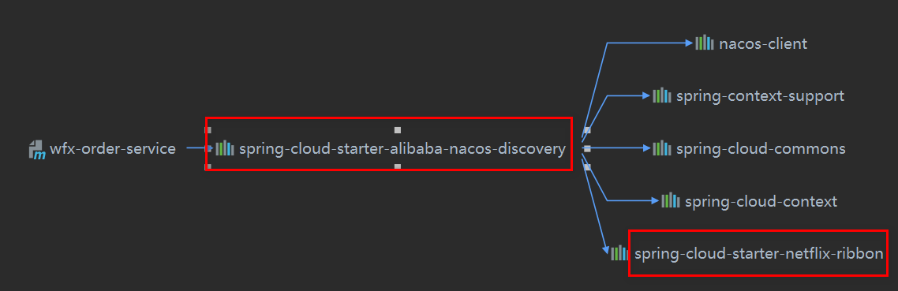

第二步：`@LoadBalanced` 注解：

```java
@Bean
@LoadBalanced
public RestTemplate restTemplate() {
    return new RestTemplate();
}
```

### 6.3 Ribbon 的工作流程

`@LoadBalanced` 会为 RestTemplate 添加拦截器：请求发出前，拦截器取出 url 中的**服务名**，从注册中心拿到该服务的**实例列表**，再由负载均衡算法从中挑出一个实例，把服务名替换成实际的 ip:port 后发起真正的 HTTP 请求。整体流程是：

1. 客户端发起请求，url 中写服务名（如 `http://cloud-goods/goods/findById/1`）；
2. LoadBalancerInterceptor 拦截请求，解析出服务名；
3. 从本地缓存的服务实例列表中按 IRule 算法选择一个实例；
4. 用选中的实例地址替换服务名，发起请求。

### 6.4 Ribbon 源码追踪

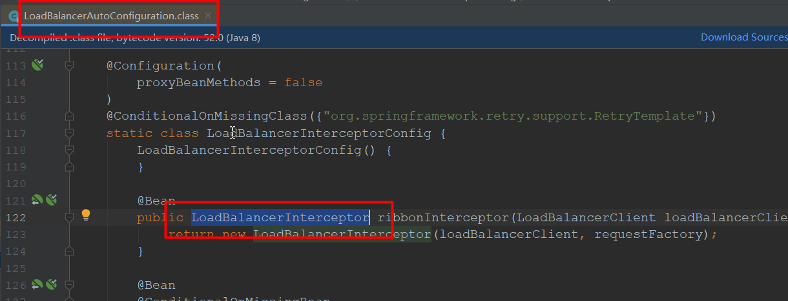

LoadBalancerInterceptor：

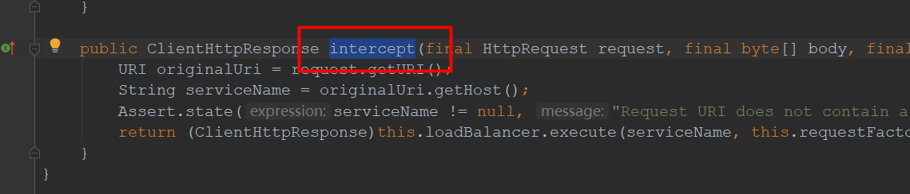

RibbonLoadBalancerClient：

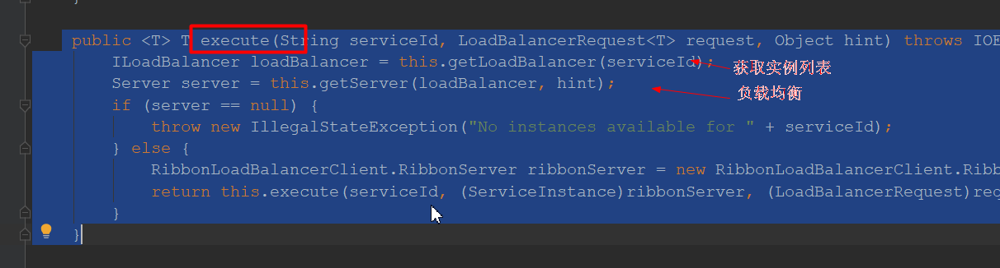

负载均衡：

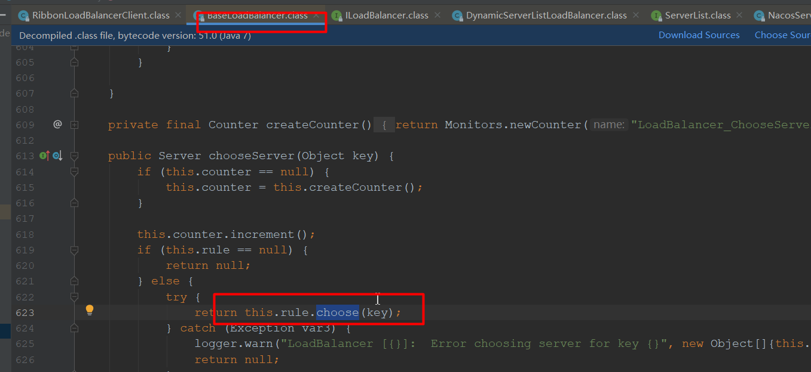

Ribbon 核心组件 IRule：根据特定算法从服务列表中选取一个需要访问的服务。其中 IRule 是一个接口，有七个自带的落地实现类，可以实现不同的负载均衡算法规则：

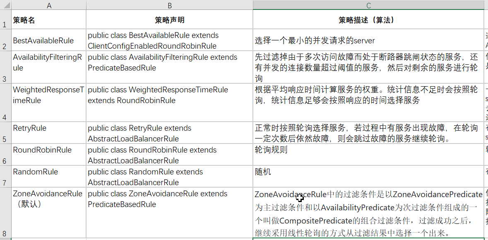

### 6.5 切换 Ribbon 负载均衡策略

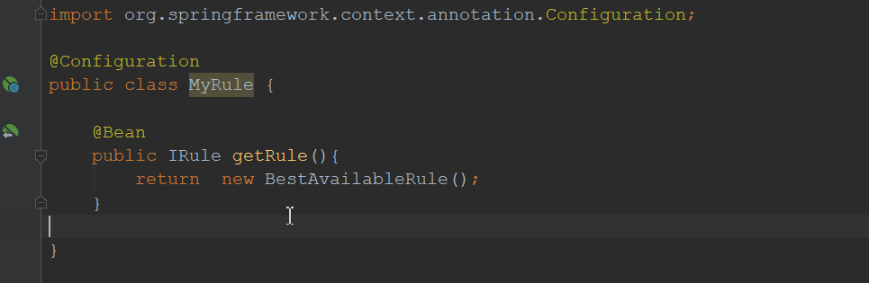

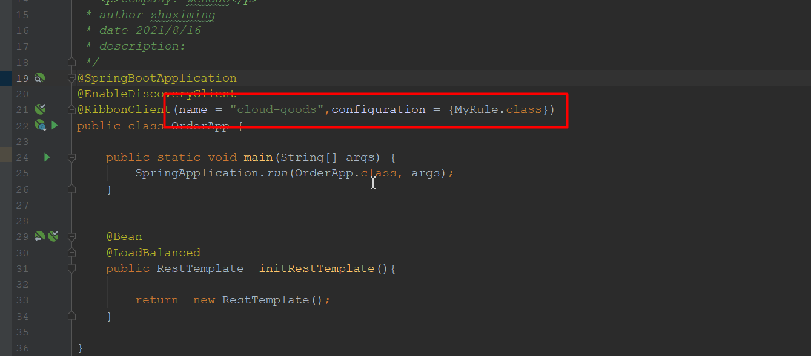

### 6.6 服务实例列表同步更新

```text
DynamicServerListLoadBalancer.updateListOfServers
// 从nacos server获取最新的实例列表
NacosServerList.getServers
```

思考：服务消费者一旦成功调用一次，Nacos Server 关闭后还能继续访问吗？——可以，因为消费者本地缓存了服务实例列表，短时间内仍能按缓存的列表调用；但列表不再更新，实例下线后就可能调用失败。

## 7. Nacos 集群搭建

### 7.1 Nacos 集群架构

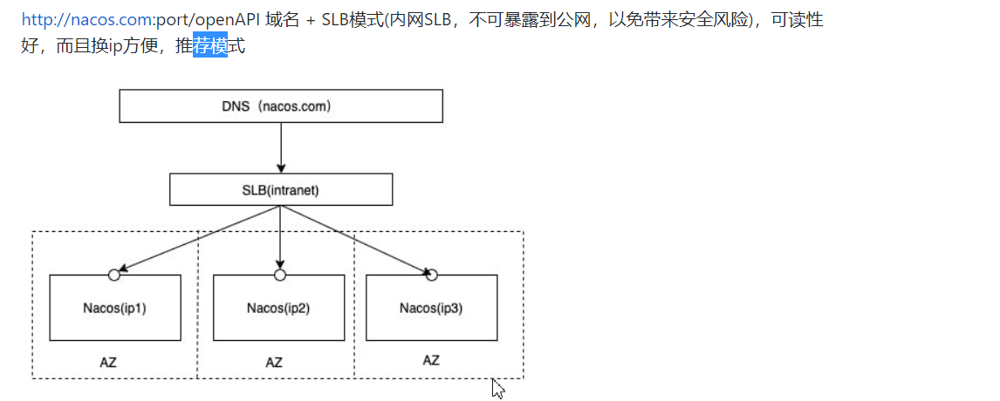

### 7.2 Nacos 集群搭建

伪集群：一台服务器搭建 3 台 Nacos，通过端口进行区分。

#### 7.2.1 集群规划

| 服务名 | ip | 端口 | 备注 |
| --- | --- | --- | --- |
| nacos 实例1 | 192.168.25.101 | 8848 | |
| nacos 实例2 | 192.168.25.101 | 8858 | |
| nacos 实例3 | 192.168.25.101 | 8868 | |
| nginx | 192.168.25.101 | 80 | 反向代理 nacos 3 个实例 |
| mysql | 192.168.25.101 | 3306 | 存储 nacos 数据 |

#### 7.2.2 详细步骤

第一步：上传 nacos 包到 Linux 服务器并解压：

```sh
tar -zxvf nacos-server-1.4.1.tar.gz -C /export/server/
```

第二步：修改 nacos 数据源：

```sh
cd /export/server/nacos/conf/
vim application.properties
```

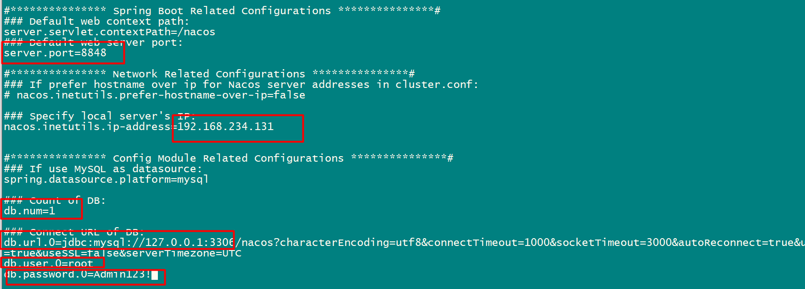

创建数据库及表。

第三步：修改 `/export/server/nacos/bin/startup.sh` 的 JAVA_OPT：

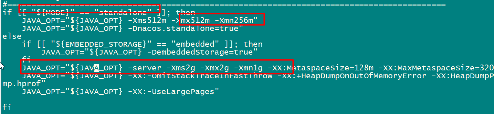

```text
原设置：
JAVA_OPT="${JAVA_OPT} -server -Xms2g -Xmx2g -Xmn1g -XX:MetaspaceSize=128m -XX:MaxMetaspaceSize=320m"
修改后：
JAVA_OPT="${JAVA_OPT} -server -Xms256m -Xmx256m -Xmn128m -XX:MetaspaceSize=128m -XX:MaxMetaspaceSize=160m"
```

> [!TIP]
> 虚拟机内存调大到 2G。

第四步：配置 `/export/server/nacos/conf/cluster.conf` 配置文件。修改集群配置文件的文件名：

```sh
cp cluster.conf.example cluster.conf
```

```properties
192.168.25.101:8848
192.168.25.101:8858
192.168.25.101:8868
```

第五步：复制三份，同时修改监听端口：

```sh
[root@zhuxm01 server]# cp nacos/ nacos8848 -r
[root@zhuxm01 server]# cp nacos/ nacos8858 -r
[root@zhuxm01 server]# cp nacos/ nacos8868 -r
```

第六步：分别启动 nacos 实例。创建 nacos-cluster-startup.sh：

```sh
sh /export/server/nacos8848/bin/startup.sh
sh /export/server/nacos8858/bin/startup.sh
sh /export/server/nacos8868/bin/startup.sh
```

第七步：测试：

```properties
spring.cloud.nacos.discovery.server-addr=192.168.234.122:8848,192.168.234.122:8858,192.168.234.122:8868
```

第八步：配置 nginx 反向代理（可选）：

```nginx
upstream nacos-cluster {
    server 192.168.25.101:8848;
    server 192.168.25.101:8858;
    server 192.168.25.101:8868;
}

server {
    listen       80;
    server_name  www.nacos.com;
    #charset koi8-r;
    #access_log  logs/host.access.log  main;
    location / {
        proxy_pass http://nacos-cluster/;
    }
}
```

## 8. Spring Cloud OpenFeign

作为 Spring Cloud 的子项目之一，Spring Cloud OpenFeign 是一种**声明式、模板化**的 HTTP 客户端。在 Spring Cloud 中使用 OpenFeign，可以做到使用 HTTP 请求远程服务时能与调用本地方法一样的编码体验，开发者完全感知不到这是远程方法，更感知不到这是个 HTTP 请求。同时 OpenFeign 通过集成 Ribbon 实现客户端的负载均衡。

三个组件的分工：

- **Nacos Server**：注册中心，解决的是服务的注册与发现；
- **Ribbon**：客户端负载均衡器，解决的是服务集群负载均衡的问题；
- **OpenFeign**：声明式 HTTP 客户端，代替 RestTemplate 组件，实现远程调用。

### 8.1 演示案例说明

cloud-order 为服务消费者、cloud-jifen 为服务提供者：

- 功能1：添加订单，生成一条积分记录；
- 功能2：修改订单，修改积分记录；
- 功能3：删除订单，删除积分记录；
- 功能4：查询订单，获取积分记录。

### 8.2 新建积分微服务

#### 8.2.1 pom 依赖

```xml
<dependencies>
    <dependency>
        <groupId>org.springframework.boot</groupId>
        <artifactId>spring-boot-starter-web</artifactId>
    </dependency>

    <dependency>
        <groupId>org.springframework.boot</groupId>
        <artifactId>spring-boot-starter-actuator</artifactId>
    </dependency>

    <dependency>
        <groupId>com.alibaba.cloud</groupId>
        <artifactId>spring-cloud-starter-alibaba-nacos-discovery</artifactId>
    </dependency>
</dependencies>

<build>
    <plugins>
        <plugin>
            <groupId>org.springframework.boot</groupId>
            <artifactId>spring-boot-maven-plugin</artifactId>
        </plugin>
    </plugins>
</build>
```

#### 8.2.2 application.yml

```yaml
spring:
  application:
    name: cloud-jifen # 服务名称，必须，保证唯一
  cloud:
    nacos:
      discovery:
        server-addr: www.nacos.com # 指定nacos-server的地址
        username: nacos
        password: nacos
        namespace: sit
        group: my-group
server:
  port: 9004
```

#### 8.2.3 启动类

```java
@SpringBootApplication
@EnableDiscoveryClient
public class JifenApplication {

    public static void main(String[] args) {
        SpringApplication.run(JifenApplication.class, args);
    }
}
```

#### 8.2.4 暴露接口

```java
@RestController
@RequestMapping("/jifen")
public class JifenController {

    @PostMapping(value = "/save")
    public Map save(@RequestBody Jifen jifen) {
        System.out.println("调用了积分保存接口");
        System.out.println(jifen);
        return new HashMap() {{
            put("isSuccess", true);
            put("msg", "save success");
        }};
    }

    @PostMapping(value = "/update")
    public Map update(@RequestBody Jifen jifen) {
        System.out.println(jifen);
        return new HashMap() {{
            put("isSuccess", true);
            put("msg", "update success");
        }};
    }

    @GetMapping(value = "/delete")
    public Map deleteById(Integer jifenId) {
        System.out.println("删除id为" + jifenId + "的积分信息");
        return new HashMap() {{
            put("isSuccess", true);
            put("msg", "delete success");
        }};
    }

    @GetMapping(value = "/{jifenId}")
    public Jifen findJifenById(@PathVariable Integer jifenId) {
        System.out.println("已经查询到" + jifenId + "积分数据");
        return new Jifen(jifenId, 12, jifenId + "号积分");
    }

    @GetMapping(value = "/search")
    public Jifen search(Integer uid, String type) {
        System.out.println("uid:" + uid + "type:" + type);
        return new Jifen(uid, 12, type);
    }

    @PostMapping(value = "/searchByEntity")
    public List<Jifen> searchMap(@RequestBody Jifen jifen) {
        System.out.println(jifen);

        List<Jifen> jifens = new ArrayList<Jifen>();
        jifens.add(new Jifen(110, 12, "下单积分"));
        jifens.add(new Jifen(111, 18, "支付积分"));
        return jifens;
    }
}
```

相关实体类：

```java
@Data
@AllArgsConstructor
@NoArgsConstructor
public class Jifen {
    private Integer jifenId;
    private Integer count;
    private String type;
}
```

```java
@Data
@AllArgsConstructor
@NoArgsConstructor
public class Goods {
    private Integer id;
    private String goodsName;
}
```

```java
@Data
@AllArgsConstructor
@NoArgsConstructor
public class ResultVo {
    private boolean success;
    private String msg;
}
```

```java
@Data
@AllArgsConstructor
@NoArgsConstructor
public class Order {
    private Integer uid;
    private Integer num;
    private String type;
}
```

### 8.3 OpenFeign 使用

#### 8.3.1 OpenFeign 依赖

```xml
<dependency>
    <groupId>org.springframework.cloud</groupId>
    <artifactId>spring-cloud-starter-openfeign</artifactId>
</dependency>
```

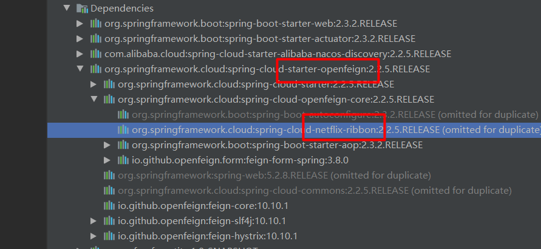

#### 8.3.2 开启 OpenFeign

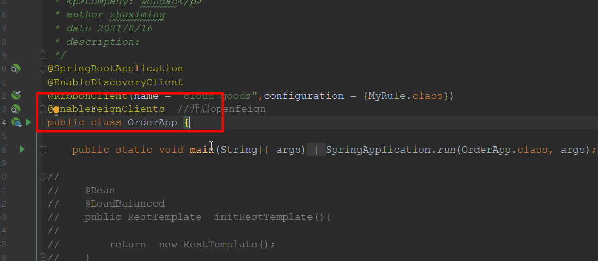

#### 8.3.3 接口声明

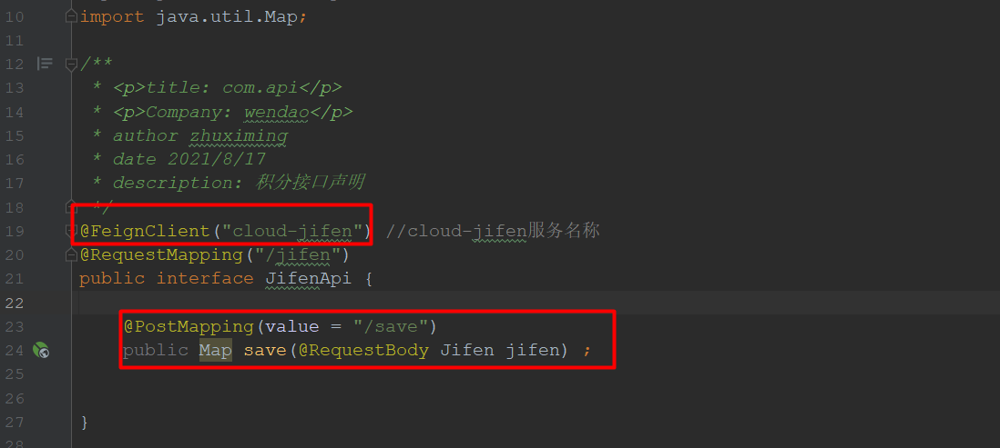

#### 8.3.4 接口调用

先扫描 OpenFeign 接口：

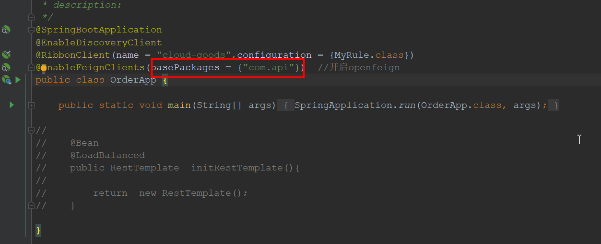

```java
@Autowired
private JifenApi jifenApi;

@RequestMapping("test1")
public Map test1() {
    // 通过openfeign远程调用 cloud-jifen服务的/jifen/save接口
    Jifen jifen = new Jifen(1, 10, "2");

    // url: http://cloud-jifen/jifen/save
    Map save = jifenApi.save(jifen);

    return save;
}
```

### 8.4 OpenFeign 常用配置

```yaml
spring:
  application:
    name: cloud-order # 服务名称，必须，保证唯一
  cloud:
    nacos:
      discovery:
        server-addr: www.nacos.com # 指定nacos-server的地址
        username: nacos
        password: nacos
        namespace: sit
        group: my-group
server:
  port: 9002
ribbon:
  eager-load:
    enabled: true
    clients:
      - cloud-jifen
      - cloud-goods
feign:
  client:
    config:
      cloud-jifen: # 针对指定服务的超时配置
        connect-timeout: 1000
        read-timeout: 1000
      default: # 设置默认的超时时间
        connect-timeout: 1000
        read-timeout: 1000
```

## 9. Nacos 配置中心

先小结一下前面学到的组件：

- **Nacos 注册中心**：服务的注册与发现；
- **Ribbon**：客户端负载均衡器，服务集群的负载均衡；
- **OpenFeign**：声明式的 HTTP 客户端，解决服务间的远程调用；
- **Nacos 配置中心**：统一管理所有微服务的配置，支持动态刷新、多环境隔离与共享配置。

### 9.1 为什么使用配置中心

微服务数量多、环境多（dev/sit/pro），如果每个服务各自维护一份 application.yml，会有几个明显的问题：

1. 配置分散在各服务中，修改一个公共配置（如数据库地址）要改多个工程并重新打包发布；
2. 配置修改必须**重启服务**才能生效，影响可用性；
3. 多环境配置容易改错、难以审计。

配置中心把这些配置**中心化、外部化**：配置统一存放在 Nacos，服务启动时拉取；修改配置后可以**不停机动态刷新**，并且天然支持版本管理与回滚。

### 9.2 主流配置中心对比

目前市面上用的比较多的配置中心有：Spring Cloud Config、Apollo、Nacos 和 Disconf 等。由于 Disconf 不再维护，下面主要对比一下 Spring Cloud Config、Apollo 和 Nacos。

| 对比项目 | Spring Cloud Config | Apollo | Nacos |
| --- | --- | --- | --- |
| 配置实时推送 | 支持（Spring Cloud Bus） | 支持（HTTP 长轮询 1s 内） | 支持（HTTP 长轮询 1s 内） |
| 版本管理 | 支持（Git） | 支持 | 支持 |
| 配置回滚 | （Git）支持 | 支持 | 支持 |
| 灰度发布 | 支持 | 支持 | 支持 |
| 权限管理 | 支持（依赖 Git） | 支持 | 支持 |
| 多集群 | 支持 | 支持 | 支持 |
| 多环境 | 支持 | 支持 | 支持 |
| 监听查询 | 支持 | 支持 | 支持 |
| 多语言 | 只支持 Java | 主流语言，提供了 Open API | 主流语言，提供了 Open API |
| 配置格式校验 | 不支持 | 支持 | 支持 |
| 单机读（QPS） | 7（限流所致） | 9000 | 15000 |
| 单机写（QPS） | 5（限流所致） | 1100 | 1800 |
| 3 节点读（QPS） | 21（限流所致） | 27000 | 45000 |
| 3 节点写（QPS） | 5（限流所致） | 3300 | 5600 |

```text
从配置中心角度来看，性能方面Nacos的读写性能最高，Apollo次之，Spring Cloud Config依赖Git
场景不适合开放的大规模自动化运维API。
功能方面Apollo最为完善，Nacos具有Apollo大部分配置管理功能，而Spring Cloud Config不带运维
管理界面，需要自行开发。
Nacos的一大优势是整合了注册中心、配置中心功能，部署和操作相比Apollo都要直观简单，因此它
简化了架构复杂度，并减轻运维及部署工作。
```

Nacos Config 官网：<https://github.com/alibaba/spring-cloud-alibaba/wiki/Nacos-config>

### 9.3 配置管理领域模型

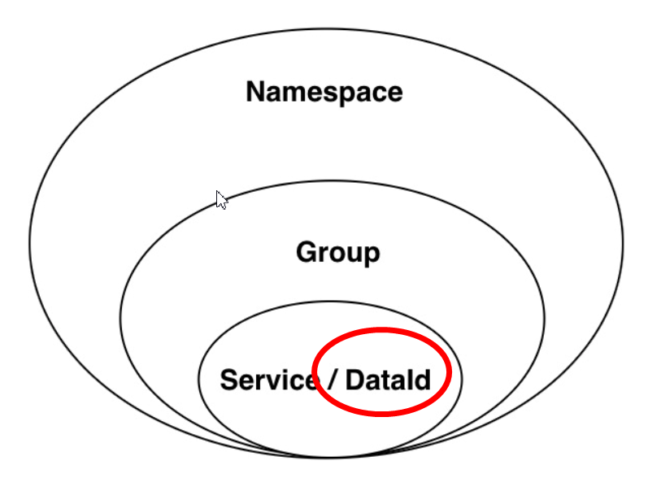

### 9.4 配置中心入门使用

1. 创建文件：

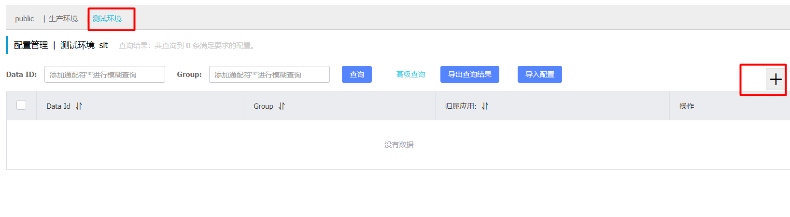

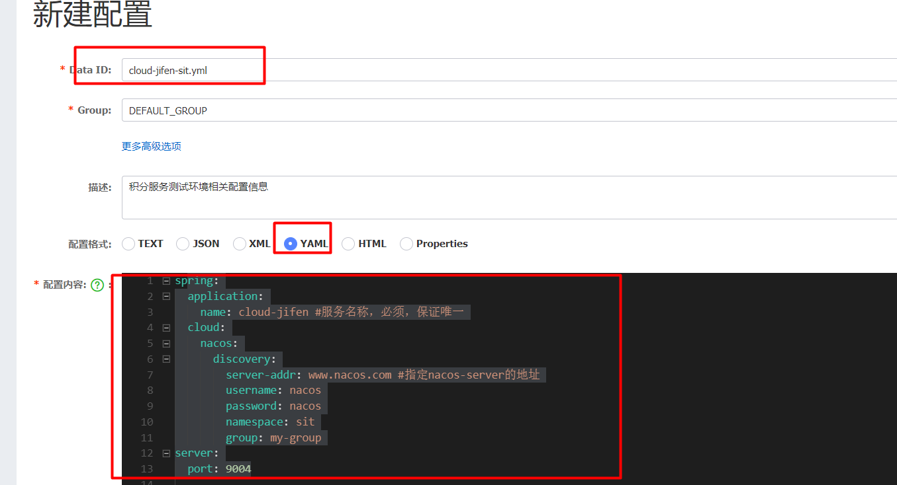

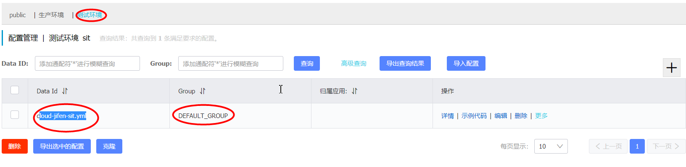

2. 服务端加载配置信息：

```xml
<dependency>
    <groupId>com.alibaba.cloud</groupId>
    <artifactId>spring-cloud-starter-alibaba-nacos-config</artifactId>
</dependency>
```

> [!IMPORTANT]
> 必须把配置文件的名称修改为 **bootstrap.yml**：bootstrap 的加载优先级高于 application，保证服务在启动初期就能从配置中心拉取配置。

```yaml
# 从配置中心加载配置文件
# 文件名是通过公式来拼接 ${prefix}-${spring.profiles.active}.${file-extension}
spring:
  cloud:
    nacos:
      config:
        server-addr: localhost:8848
        namespace: sit
        group: DEFAULT_GROUP
        prefix: cloud-jifen
        file-extension: yml
  profiles:
    active: sit
```

### 9.5 多环境切换

测试环境 cloud-jifen-sit.yml：

```yaml
spring:
  application:
    name: cloud-jifen # 服务名称，必须，保证唯一
  cloud:
    nacos:
      discovery:
        server-addr: localhost:8848 # 指定nacos-server的地址
        username: nacos
        password: nacos
        namespace: sit
        group: my-group
server:
  port: 9004
```

生产环境 cloud-jifen-pro.yml：

```yaml
spring:
  application:
    name: cloud-jifen # 服务名称，必须，保证唯一
  cloud:
    nacos:
      discovery:
        server-addr: localhost:8848 # 指定nacos-server的地址
        username: nacos
        password: nacos
        namespace: pro
        group: my-group
server:
  port: 9008
```

环境切换（修改 spring.profiles.active 即可加载不同的 dataId）：

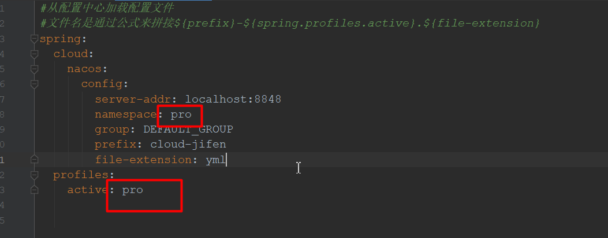

全局环境切换——父工程中定义环境变量：

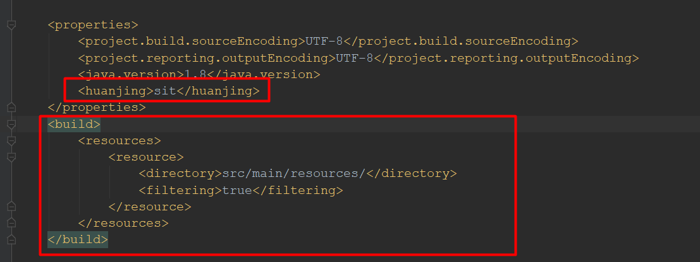

在各个微服务中引用变量：

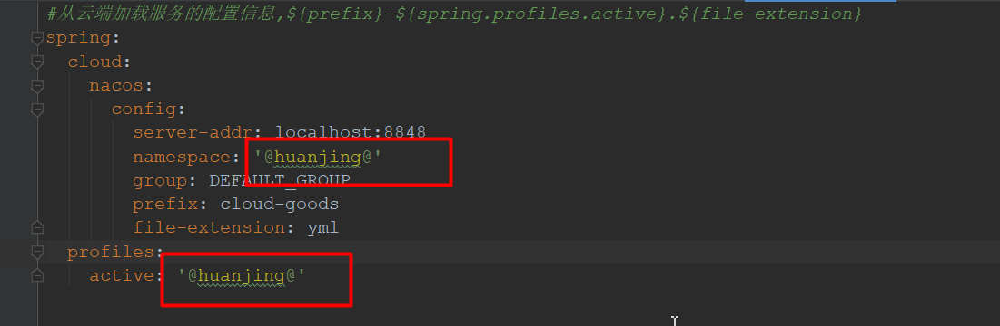

### 9.6 Nacos 配置动态刷新

动态刷新：**不停机动态修改配置，立即生效**。

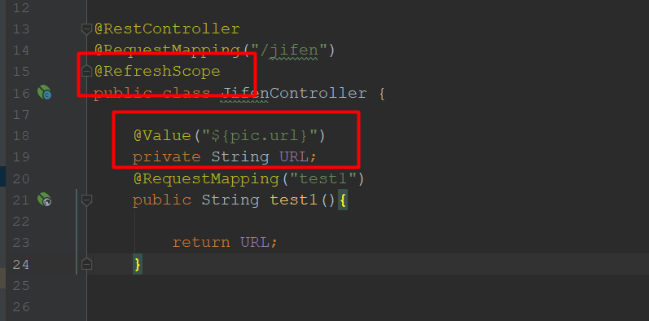

### 9.7 动态刷新连接池大小

cloud-jifen 整合 mybatis：

```xml
<!-- mybatis的起步依赖 -->
<dependency>
    <groupId>org.mybatis.spring.boot</groupId>
    <artifactId>mybatis-spring-boot-starter</artifactId>
    <version>2.1.3</version>
</dependency>
<!-- mysql驱动 -->
<dependency>
    <groupId>mysql</groupId>
    <artifactId>mysql-connector-java</artifactId>
</dependency>
<!-- druid连接池 -->
<dependency>
    <groupId>com.alibaba</groupId>
    <artifactId>druid-spring-boot-starter</artifactId>
    <version>1.1.10</version>
</dependency>
```

配置：

```yaml
spring:
  datasource:
    druid:
      driver-class-name: com.mysql.jdbc.Driver
      username: root
      password: 123456
      url: jdbc:mysql://127.0.0.1:3306/fengmi_mall?useUnicode=true&characterEncoding=utf8&useSSL=false
      max-active: 60 # 连接池配置

# 配置mybatis相关信息
mybatis.mapper-locations=/mappers/*.xml
mybatis.configuration.map-underscore-to-camel-case=true
mybatis.type-aliases-package=com.qf.entity
```

### 9.8 Nacos 共享配置

1. 新建共享配置 common.yml：

```yaml
spring:
  datasource:
    druid:
      driver-class-name: com.mysql.jdbc.Driver
      username: root
      password: 123456
      url: jdbc:mysql://127.0.0.1:3306/fengmi_mall?useUnicode=true&characterEncoding=utf8&useSSL=false
      max-active: 100 # 连接池配置
  cloud:
    nacos:
      discovery:
        server-addr: localhost:8848 # 指定nacos-server的地址
        username: nacos
        password: nacos
        namespace: pro
        group: my-group
```

cloud-jifen 个性配置：

```yaml
spring:
  application:
    name: cloud-jifen # 服务名称，必须，保证唯一
server:
  port: 9008
pic:
  url: http://www.baidu.com
```

2. 加载共享配置：

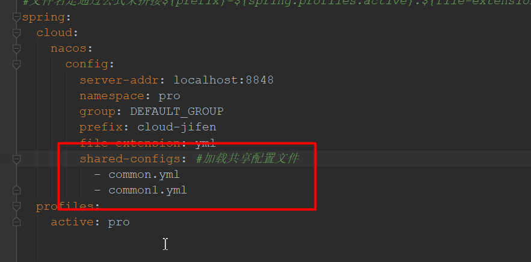

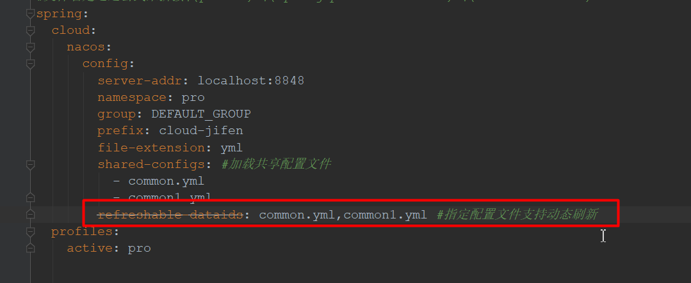

### 9.9 配置文件版本管理

Nacos 控制台自带配置的**历史版本管理**，可以查看每次修改的记录并一键回滚：

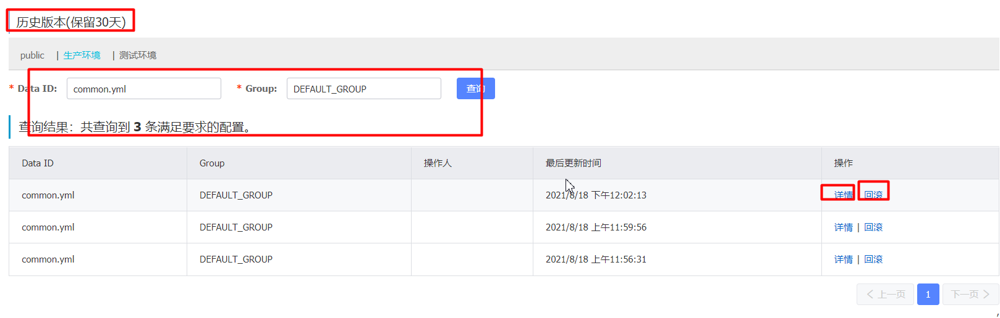

## 10. 小结

- 微服务解决单体架构的伸缩与维护问题，但也带来了注册发现、负载均衡、远程调用等新挑战；
- **Nacos 注册中心**：服务注册与发现，领域模型为 namespace/group/service 三元组；
- **Ribbon**：客户端负载均衡，`@LoadBalanced` 拦截 RestTemplate，IRule 定义选择算法；
- **OpenFeign**：声明式 HTTP 客户端，`@FeignClient` 接口化远程调用，底层集成 Ribbon；
- **Nacos 配置中心**：配置走 bootstrap.yml，dataId 拼接公式 `${prefix}-${profile}.${file-extension}`，支持多环境切换、动态刷新、共享配置与版本回滚；
- 生产环境用 **Nacos 集群 + MySQL 存储 + Nginx 反向代理** 保证注册中心自身的高可用。
