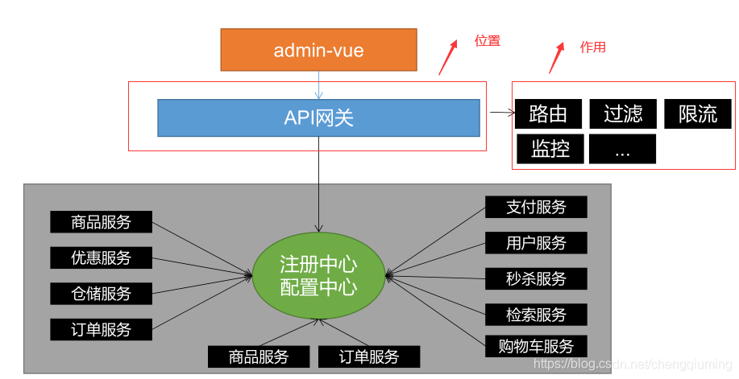
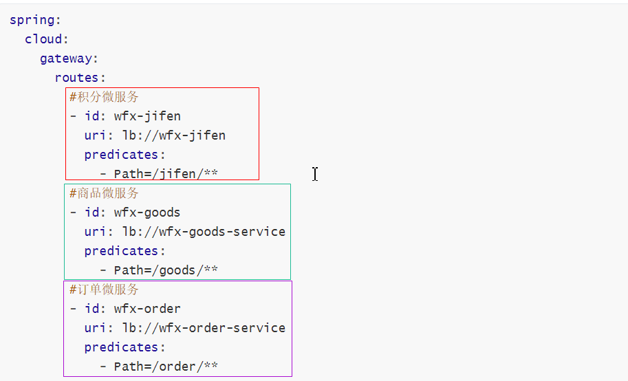
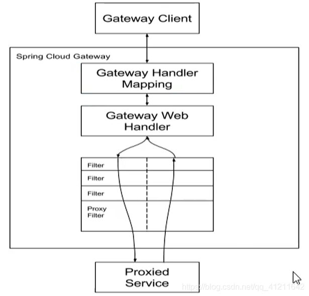
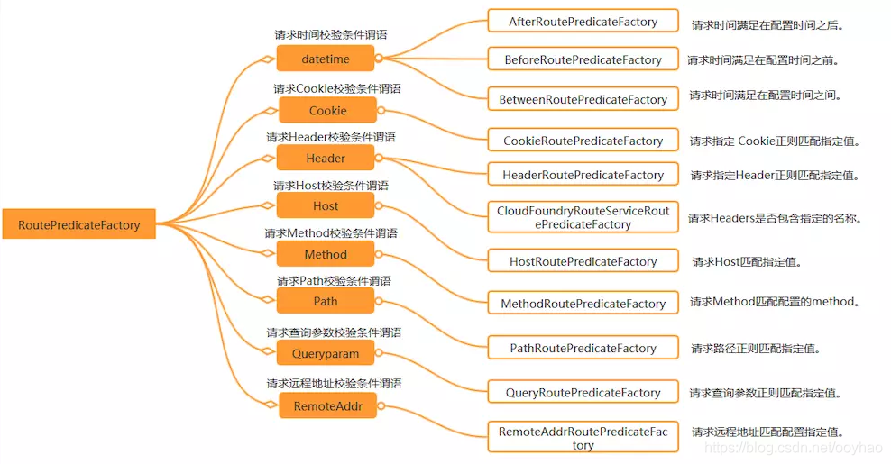

# Gateway

## 1. Gateway 简介

文档：<https://spring.io/projects/spring-cloud-gateway#learn>

先小结一下前面学到的组件，再看网关在整个体系中的位置：

- **Nacos（注册中心）**：解决服务的注册与发现；
- **Nacos（配置中心）**：配置文件中心化管理；
- **Ribbon**：客户端负载均衡器，解决微服务集群负载均衡的问题；
- **OpenFeign**：声明式 HTTP 客户端，解决微服务之间远程调用问题；
- **Sentinel**：微服务流量防卫兵，以流量为入口，保护微服务，防止出现服务雪崩。

### 1.1 为什么使用网关

微服务对外暴露的实例众多、地址分散，客户端不可能直接记住每个服务的地址，鉴权、限流、跨域等横切逻辑也不应该在每个服务里重复实现。网关作为系统的统一入口，负责路由转发、权限校验、限流熔断、日志监控等：



### 1.2 Spring Cloud Gateway 简介

Spring Cloud Gateway 是基于 Spring 5、SpringBoot 2.0 和 Project Reactor 等技术开发的网关，目的是为微服务架构系统提供高性能、且简单易用的 API 路由管理方式。

优点：

1. 性能强劲，是第一代网关 **Zuul（Netflix）** 的 1.6 倍；
2. 功能强大，内置很多实用功能，如：路由、过滤、限流、监控等；
3. 易于扩展。

### 1.3 Gateway 核心概念



- **Route（路由）**：路由是构建网关的基本模块，它由 ID、目标 URI、一系列的断言和过滤器组成，如果断言为 true 则匹配该路由；
- **Predicate（断言、谓词）**：开发人员可以匹配 HTTP 请求中的所有内容（例如请求头或请求参数），如果请求与断言相匹配则进行路由；
- **Filter（过滤器）**：指的是 Spring 框架中 GatewayFilter 的实例，使用过滤器，可以在请求被路由前或者之后对请求进行修改。

### 1.4 Gateway 的工作流程

```text
1. 客户端向 Spring Cloud Gateway 发出请求，然后在 Gateway Handler Mapping 中找到与请求相匹配的路由
2. 将其发送到 Gateway Web Handler
3. Handler 再通过指定的过滤器链来将请求发送到我们实际的服务执行业务逻辑，然后返回。
   过滤器之间用虚线分开是因为过滤器可能会在发送代理请求之前（"pre"）或之后（"post"）执行业务逻辑。
```



### 1.5 搭建网关

#### 1.5.1 pom 依赖

> [!WARNING]
> 注意：**不要依赖 spring-boot-starter-web**。它是 servlet 编程模型，运行的服务器是 Tomcat；而 Gateway 底层基于 Netty（webflux 响应式模型），两者冲突。

```xml
<!-- 错误示范：gateway项目不要引入web依赖 -->
<dependency>
    <groupId>org.springframework.boot</groupId>
    <artifactId>spring-boot-starter-web</artifactId>
</dependency>
```

正确依赖如下：

```xml
<dependencies>
    <!-- spring-cloud gateway，底层基于netty -->
    <dependency>
        <groupId>org.springframework.cloud</groupId>
        <artifactId>spring-cloud-starter-gateway</artifactId>
    </dependency>
    <!-- 端点监控 -->
    <dependency>
        <groupId>org.springframework.boot</groupId>
        <artifactId>spring-boot-starter-actuator</artifactId>
    </dependency>

    <!-- nacos注册中心 -->
    <dependency>
        <groupId>com.alibaba.cloud</groupId>
        <artifactId>spring-cloud-starter-alibaba-nacos-discovery</artifactId>
    </dependency>
</dependencies>
```

#### 1.5.2 基本配置

配置文件采用 yml：

```yaml
server:
  # gateway的端口
  port: 8040

spring:
  application:
    name: cloud-gateway
  cloud:
    nacos:
      discovery:
        server-addr: 127.0.0.1:8848
```

#### 1.5.3 引导类

```java
package com.wfx;

import org.springframework.boot.SpringApplication;
import org.springframework.boot.autoconfigure.SpringBootApplication;
import org.springframework.cloud.client.discovery.EnableDiscoveryClient;

@SpringBootApplication
@EnableDiscoveryClient
public class WfxGateway {

    public static void main(String[] args) {
        SpringApplication.run(WfxGateway.class, args);
    }
}
```

## 2. 路由配置姿势

### 2.1 路由到指定 URL

```yaml
spring:
  cloud:
    gateway:
      routes:
        - id: baidu
          uri: http://www.baidu.com
          predicates:
            - Path=/**
```

访问 `http://localhost:8040/**` 会转发给 `http://www.baidu.com/**`：

- `http://localhost:8040/a` => `http://www.baidu.com/a`
- `http://localhost:8040/a/b` => `http://www.baidu.com/a/b`

### 2.2 路由到微服务

#### 2.2.1 静态路由

```yaml
spring:
  cloud:
    gateway:
      # 路由是一个数组，可以配置多个路由
      routes:
        # 配置商品微服务，静态配置（写死实例地址）
        - id: wfx-goods
          uri: http://localhost:8001
          predicates:
            - Path=/goods/**
```

#### 2.2.2 动态路由

动态路由使用 `lb://服务名`（load balance），由注册中心提供实例列表并做负载均衡：

```yaml
server:
  # gateway启动端口
  port: 8040
spring:
  cloud:
    gateway:
      routes:
        # 配置商品微服务
        - id: wfx-goods
          uri: lb://wfx-goods
          predicates:
            - Path=/goods/**
        # 配置积分微服务
        - id: wfx-jifen
          uri: lb://wfx-jifen
          predicates:
            - Path=/jifen/**
        # 配置订单微服务
        - id: wfx-order
          uri: lb://wfx-order
          predicates:
            - Path=/order/**
    nacos:
      discovery:
        server-addr: 127.0.0.1:8848
  application:
    name: wfx-gateway
```

## 3. 谓词工厂详解

Spring Cloud Gateway 提供了十来种路由谓词工厂，为网关实现灵活的转发提供了基石。内置的谓词工厂包括：



### 3.1 Path

```yaml
gateway:
  # 配置路由规则
  routes:
    - id: wfx-goods
      # 请求转发到微服务集群
      uri: lb://wfx-goods
      predicates:
        - Path=/goods/**   # http://localhost:8040/goods/hello -> lb://wfx-goods/goods/hello
```

### 3.2 After

请求时间在指定时间之后才匹配：

```yaml
spring:
  cloud:
    gateway:
      routes:
        - id: wfx-jifen
          uri: lb://wfx-goods
          predicates:
            - Path=/goods/detail/100
            - After=2020-10-29T22:24:40.626+08:00[Asia/Shanghai]
```

### 3.3 Before

请求时间在指定时间之前才匹配：

```yaml
spring:
  cloud:
    gateway:
      routes:
        - id: wfx-jifen
          uri: lb://wfx-goods
          predicates:
            - Path=/goods/detail/100
            - Before=2020-10-29T22:24:40.626+08:00[Asia/Shanghai]
```

### 3.4 Between

请求时间在两个时间之间才匹配：

```yaml
spring:
  cloud:
    gateway:
      routes:
        - id: wfx-jifen
          uri: lb://wfx-goods
          predicates:
            - Path=/goods/detail/100
            - Between=2020-10-29T22:24:40.626+08:00[Asia/Shanghai], 2020-10-29T23:24:40.626+08:00[Asia/Shanghai]
```

### 3.5 Cookie

请求必须携带指定 Cookie（值可用正则）：

```yaml
spring:
  cloud:
    gateway:
      routes:
        - id: wfx-jifen
          uri: lb://wfx-goods
          predicates:
            - Path=/goods/detail/100
            - After=2020-10-29T22:26:40.626+08:00[Asia/Shanghai]
            - Cookie=age,18
```

### 3.6 Header

请求必须携带指定请求头：

```yaml
spring:
  cloud:
    gateway:
      routes:
        - id: wfx-jifen
          uri: lb://wfx-goods
          predicates:
            - Path=/goods/detail/100
            - After=2020-10-29T22:26:40.626+08:00[Asia/Shanghai]
            - Cookie=name,jack
            - Header=token,123
```

### 3.7 Host

请求的 Host 必须匹配指定模式：

```yaml
spring:
  cloud:
    gateway:
      routes:
        - id: wfx-jifen
          uri: lb://wfx-goods
          predicates:
            - Path=/goods/detail/100
            - After=2020-10-29T22:26:40.626+08:00[Asia/Shanghai]
            - Cookie=name,jack
            - Header=token
            - Host=goods.wfx.com,**.jd.com
```

### 3.8 Method

请求方式必须匹配：

```yaml
spring:
  cloud:
    gateway:
      routes:
        - id: wfx-jifen
          uri: lb://wfx-goods
          predicates:
            - Path=/goods/detail/100
            - After=2020-10-29T22:26:40.626+08:00[Asia/Shanghai]
            - Cookie=name,jack
            - Header=token
            - Host=**.wfx.com,**.jd.com
            - Method=GET
```

### 3.9 Query

请求必须携带指定请求参数：

```yaml
spring:
  cloud:
    gateway:
      routes:
        - id: wfx-jifen
          uri: lb://wfx-goods
          predicates:
            - Path=/goods/detail/100
            - After=2020-10-29T22:26:40.626+08:00[Asia/Shanghai]
            - Cookie=name,jack
            - Header=token
            - Host=**.wfx.com,**.jd.com
            - Method=GET
            - Query=baz,123
```

### 3.10 RemoteAddr

请求来源 ip 必须匹配：

```yaml
spring:
  cloud:
    gateway:
      routes:
        - id: wfx-jifen
          uri: lb://wfx-goods
          predicates:
            - Path=/goods/detail/100
            - After=2020-10-29T22:26:40.626+08:00[Asia/Shanghai]
            - Header=token
            - Host=**.wfx.com,**.jd.com
            - Query=baz
            - RemoteAddr=192.168.234.122,192.168.234.123
```

### 3.11 自定义 RoutePredicateFactory

> [!TIP]
> 自定义谓词工厂的类名规范：**后缀必须是 RoutePredicateFactory**，且要交给 Spring 容器管理。

先定义配置类：

```java
package com.wfx.predicates;

import lombok.Data;

/**
 * 自定义谓词的配置参数
 */
@Data
public class MyConfig {
    private String key;
    private String value;
}
```

需求：请求头中必须包含指定的 key（可选校验 value）：

```java
package com.wfx.predicates;

import org.springframework.cloud.gateway.handler.predicate.AbstractRoutePredicateFactory;
import org.springframework.stereotype.Component;
import org.springframework.util.StringUtils;
import org.springframework.web.server.ServerWebExchange;

import java.util.Arrays;
import java.util.List;
import java.util.function.Predicate;

/**
 * <p>title: com.wfx.predicates</p>
 * author zhuximing
 * description: 需求：请求头中必须要有指定的kv键值对
 */
@Component
public class MyHeaderRoutePredicateFactory extends AbstractRoutePredicateFactory<MyConfig> {

    public MyHeaderRoutePredicateFactory() {
        super(MyConfig.class);
    }

    @Override
    public Predicate<ServerWebExchange> apply(MyConfig config) {
        return new Predicate<ServerWebExchange>() {
            @Override
            public boolean test(ServerWebExchange exchange) {
                if (StringUtils.isEmpty(config.getValue())) {
                    // 只配置了key，但是没有配置value：只要求包含该请求头
                    return exchange.getRequest().getHeaders().containsKey(config.getKey());
                } else {
                    // 同时配置了key和value：要求请求头的值与配置一致
                    String value = exchange.getRequest().getHeaders().getFirst(config.getKey());
                    return config.getValue().equals(value);
                }
            }
        };
    }

    // 获取配置参数
    @Override
    public List<String> shortcutFieldOrder() {
        // - MyHeader=bbb,cccc
        // [bbb, cccc]
        // bbb赋值给MyConfig#key
        // cccc赋值给MyConfig#value
        return Arrays.asList("key", "value");
    }
}
```

使用自定义谓词：

```yaml
server:
  # 网关微服务的启动端口
  port: 8040
spring:
  application:
    name: wfx-gateway # 微服务的应用名
  cloud:
    nacos:
      discovery:
        server-addr: 127.0.0.1:8848 # nacos-server的服务地址
    gateway:
      # 配置路由规则
      routes:
        - id: wfx-goods
          # 请求转发到微服务集群
          uri: lb://wfx-goods
          predicates:
            - Path=/goods/**   # http://localhost:8040/goods/hello -> lb://wfx-goods/goods/hello
            - After=2021-02-04T09:35:30.654+08:00[Asia/Shanghai]
            - Cookie=age,18
            - MyHeader=name,xx
```

## 4. 过滤器工厂详解


### 4.1 内置过滤器

Spring Cloud Gateway 内置的 GatewayFilter Factory 包括：

```text
1  AddRequestHeader GatewayFilter Factory
2  AddRequestParameter GatewayFilter Factory
3  AddResponseHeader GatewayFilter Factory
4  DedupeResponseHeader GatewayFilter Factory
5  Hystrix GatewayFilter Factory
6  FallbackHeaders GatewayFilter Factory
7  PrefixPath GatewayFilter Factory
8  PreserveHostHeader GatewayFilter Factory
9  RequestRateLimiter GatewayFilter Factory
10 RedirectTo GatewayFilter Factory
11 RemoveHopByHopHeadersFilter GatewayFilter Factory
12 RemoveRequestHeader GatewayFilter Factory
13 RemoveResponseHeader GatewayFilter Factory
14 RewritePath GatewayFilter Factory
15 RewriteResponseHeader GatewayFilter Factory
16 SaveSession GatewayFilter Factory
17 SecureHeaders GatewayFilter Factory
18 SetPath GatewayFilter Factory
19 SetResponseHeader GatewayFilter Factory
20 SetStatus GatewayFilter Factory
21 StripPrefix GatewayFilter Factory
22 Retry GatewayFilter Factory
23 RequestSize GatewayFilter Factory
24 Modify Request Body GatewayFilter Factory
25 Modify Response Body GatewayFilter Factory
26 Default Filters
```

### 4.2 使用内置过滤器

```yaml
spring:
  cloud:
    gateway:
      routes:
        - id: add_request_header_route
          uri: https://example.org
          filters:
            - AddRequestHeader=Foo, Bar
```

下游服务可以直接取到网关添加的请求头：

```java
@GetMapping("detail/{goodsId}")
public Map detail(@PathVariable String goodsId, @RequestHeader("Foo") String foo) {
    System.out.println(foo + "!!!!");
    return new HashMap() {{
        put("goodName", "华为meta10");
        put("price", 99.99);
    }};
}
```

### 4.3 自定义过滤器

命名规范：过滤器工厂的类名必须以 **GatewayFilterFactory** 为后缀。

先定义配置类（与谓词工厂共用）：

```java
package com.qf.filters;

import lombok.Data;

/**
 * 自定义过滤器的配置参数
 */
@Data
public class MyConfig {
    private String key;
    private String value;
}
```

需求：统计每个请求的处理耗时：

```java
package com.qf.filters;

import org.springframework.cloud.gateway.filter.GatewayFilter;
import org.springframework.cloud.gateway.filter.GatewayFilterChain;
import org.springframework.cloud.gateway.filter.factory.AbstractGatewayFilterFactory;
import org.springframework.stereotype.Component;
import org.springframework.web.server.ServerWebExchange;
import reactor.core.publisher.Mono;

/**
 * <p>title: com.qf.filters</p>
 * author zhuximing
 * description: 计算服务处理耗时
 */
@Component
public class CalServiceTimeGatewayFilterFactory extends AbstractGatewayFilterFactory<MyConfig> {

    public CalServiceTimeGatewayFilterFactory() {
        super(MyConfig.class);
    }

    @Override
    public GatewayFilter apply(MyConfig config) {
        return new GatewayFilter() {
            @Override
            public Mono<Void> filter(ServerWebExchange exchange, GatewayFilterChain chain) {
                // 前处理：记录开始时间
                long startTime = System.currentTimeMillis();

                System.out.println("name:" + config.getKey());
                System.out.println("value:" + config.getValue());

                // return chain.filter(exchange); // 直接放行

                return chain.filter(exchange).then(
                    // 后置处理
                    Mono.fromRunnable(() -> {
                        System.out.println("post come in");
                        // 获取系统当前时间戳为endTime
                        long endTime = System.currentTimeMillis();
                        System.out.println("time=" + (endTime - startTime));
                    }));
            }
        };
    }
}
```

使用自定义过滤器：

```yaml
server:
  # gateway的端口
  port: 8040

spring:
  application:
    name: cloud-gateway
  cloud:
    nacos:
      discovery:
        server-addr: 127.0.0.1:8848
        namespace: pro # 服务发布到指定的namespace，默认是public
        group: my-group # 服务发布到指定的group，默认值是DEFAULT_GROUP
    gateway:
      routes:
        - id: cloud-goods
          uri: lb://cloud-goods/
          predicates:
            - Path=/goods/**
            - After=2021-08-23T15:51:15.200+08:00[Asia/Shanghai]
            - Cookie=age,18
            - MyHeader=name,jack
          filters:
            - AddRequestHeader=token,123
            - CalServiceTime=a,b
        - id: baidu
          uri: http://www.baidu.com
          predicates:
            - Path=/**   # http://localhost:8040/a => http://www.baidu.com/a
```

> [!NOTE]
> 过滤器执行的顺序，就是配置的顺序。

### 4.4 全局过滤器

Spring Cloud Gateway 内置的全局过滤器包括：

```text
1  Combined Global Filter and GatewayFilter Ordering
2  Forward Routing Filter
3  LoadBalancerClient Filter
4  Netty Routing Filter
5  Netty Write Response Filter
6  RouteToRequestUrl Filter
7  Websocket Routing Filter
8  Gateway Metrics Filter
9  Marking An Exchange As Routed
```

自定义全局过滤器——需求：全局校验令牌，令牌合法放行，不合法拒绝访问：

```java
package com.qf.filters;

import cn.hutool.json.JSONUtil;
import org.springframework.cloud.gateway.filter.GatewayFilterChain;
import org.springframework.cloud.gateway.filter.GlobalFilter;
import org.springframework.core.Ordered;
import org.springframework.core.io.buffer.DataBuffer;
import org.springframework.http.server.reactive.ServerHttpRequest;
import org.springframework.http.server.reactive.ServerHttpResponse;
import org.springframework.stereotype.Component;
import org.springframework.util.StringUtils;
import org.springframework.web.server.ServerWebExchange;
import reactor.core.publisher.Flux;
import reactor.core.publisher.Mono;

import java.util.HashMap;
import java.util.Map;

/**
 * <p>title: com.qf.filters</p>
 * <p>Company: wendao</p>
 * author zhuximing
 * date 2021/8/23
 * description: 全局令牌校验过滤器
 */
@Component
public class AuthFilter implements GlobalFilter, Ordered {

    // 针对所有的路由进行过滤
    @Override
    public Mono<Void> filter(ServerWebExchange exchange, GatewayFilterChain chain) {
        // 过滤器的前处理
        ServerHttpRequest request = exchange.getRequest();
        ServerHttpResponse response = exchange.getResponse();
        String token = request.getHeaders().getFirst("token");
        if (StringUtils.isEmpty(token)) {
            Map res = new HashMap() {{
                put("msg", "没有登录!!");
            }};
            return writeResponse(response, res);
        } else {
            if (!"123".equals(token)) {
                Map res = new HashMap() {{
                    put("msg", "令牌无效!!");
                }};
                return writeResponse(response, res);
            } else {
                return chain.filter(exchange); // 放行
            }
        }
    }

    private Mono<Void> writeResponse(ServerHttpResponse response, Object msg) {
        response.getHeaders().add("Content-Type", "application/json;charset=UTF-8");
        String resJson = JSONUtil.toJsonPrettyStr(msg);
        DataBuffer dataBuffer = response.bufferFactory().wrap(resJson.getBytes());
        return response.writeWith(Flux.just(dataBuffer)); // 响应json数据
    }

    // 数字越小越先执行
    @Override
    public int getOrder() {
        return 0;
    }
}
```

多个全局过滤器之间通过 Order 控制执行顺序：

```java
package com.qf;

import org.springframework.boot.SpringApplication;
import org.springframework.boot.autoconfigure.SpringBootApplication;
import org.springframework.cloud.client.discovery.EnableDiscoveryClient;
import org.springframework.cloud.gateway.filter.GlobalFilter;
import org.springframework.context.annotation.Bean;
import org.springframework.core.annotation.Order;
import reactor.core.publisher.Mono;

/**
 * <p>title: com.qf</p>
 * <p>Company: wendao</p>
 * author zhuximing
 * date 2021/8/23
 * description:
 */
@SpringBootApplication
@EnableDiscoveryClient
public class GWApp {

    public static void main(String[] args) {
        SpringApplication.run(GWApp.class, args);
    }

    @Bean
    @Order(-1)
    public GlobalFilter a() {
        return (exchange, chain) -> {
            System.out.println("first pre filter");
            return chain.filter(exchange).then(Mono.fromRunnable(() -> {
                System.out.println("first post filter");
            }));
        };
    }

    @Bean
    @Order(0)
    public GlobalFilter b() {
        return (exchange, chain) -> {
            System.out.println("second pre filter");
            return chain.filter(exchange).then(Mono.fromRunnable(() -> {
                System.out.println("second post filter");
            }));
        };
    }

    @Bean
    @Order(1)
    public GlobalFilter c() {
        return (exchange, chain) -> {
            System.out.println("third pre filter");
            return chain.filter(exchange).then(Mono.fromRunnable(() -> {
                System.out.println("third post filter");
            }));
        };
    }
}
```

## 5. Gateway 整合 Sentinel

Sentinel 从 1.6.0 版本开始提供了 Spring Cloud Gateway 的适配模块，可以提供两种资源维度的限流：

- **route 维度**：即在 Spring 配置文件中配置的路由条目，资源名为对应的 routeId；
- **API 维度**：用户可以利用 Sentinel 提供的 API 来自定义一些 API 分组。

### 5.1 整合步骤

第一步：pom 依赖：

```xml
<dependency>
    <groupId>com.alibaba.cloud</groupId>
    <artifactId>spring-cloud-starter-alibaba-sentinel</artifactId>
</dependency>
<dependency>
    <groupId>com.alibaba.csp</groupId>
    <artifactId>sentinel-spring-cloud-gateway-adapter</artifactId>
</dependency>
```

第二步：配置：

```yaml
spring:
  cloud:
    nacos:
      discovery:
        server-addr: 127.0.0.1:8848
    sentinel:
      transport:
        dashboard: 127.0.0.1:8888
        port: 8710
```

### 5.2 BlockException 异常处理

默认的 BlockException 异常全局处理器是 `SentinelGatewayBlockExceptionHandler`，其源码如下（反编译参考）：

```java
package com.alibaba.csp.sentinel.adapter.spring.webflux.exception;

import com.alibaba.csp.sentinel.adapter.spring.webflux.callback.WebFluxCallbackManager;
import com.alibaba.csp.sentinel.slots.block.BlockException;
import com.alibaba.csp.sentinel.util.function.Supplier;
import java.util.List;
import org.springframework.http.codec.HttpMessageWriter;
import org.springframework.http.codec.ServerCodecConfigurer;
import org.springframework.web.reactive.function.server.ServerResponse;
import org.springframework.web.reactive.function.server.ServerResponse.Context;
import org.springframework.web.reactive.result.view.ViewResolver;
import org.springframework.web.server.ServerWebExchange;
import org.springframework.web.server.WebExceptionHandler;
import reactor.core.publisher.Mono;

public class SentinelBlockExceptionHandler implements WebExceptionHandler {
    private List<ViewResolver> viewResolvers;
    private List<HttpMessageWriter<?>> messageWriters;
    private final Supplier<Context> contextSupplier = () -> new Context() {
        public List<HttpMessageWriter<?>> messageWriters() {
            return SentinelBlockExceptionHandler.this.messageWriters;
        }

        public List<ViewResolver> viewResolvers() {
            return SentinelBlockExceptionHandler.this.viewResolvers;
        }
    };

    public SentinelBlockExceptionHandler(List<ViewResolver> viewResolvers, ServerCodecConfigurer serverCodecConfigurer) {
        this.viewResolvers = viewResolvers;
        this.messageWriters = serverCodecConfigurer.getWriters();
    }

    private Mono<Void> writeResponse(ServerResponse response, ServerWebExchange exchange) {
        return response.writeTo(exchange, (Context) this.contextSupplier.get());
    }

    public Mono<Void> handle(ServerWebExchange exchange, Throwable ex) {
        if (exchange.getResponse().isCommitted()) {
            return Mono.error(ex);
        } else {
            return !BlockException.isBlockException(ex) ? Mono.error(ex) : this.handleBlockedRequest(exchange, ex).flatMap((response) -> this.writeResponse(response, exchange));
        }
    }

    private Mono<ServerResponse> handleBlockedRequest(ServerWebExchange exchange, Throwable throwable) {
        return WebFluxCallbackManager.getBlockHandler().handleRequest(exchange, throwable);
    }
}
```

自定义 BlockException 异常处理器（区分流控异常与熔断降级异常，返回自定义 JSON）：

```java
package com.qf.sentinel;

import cn.hutool.json.JSONUtil;
import com.alibaba.csp.sentinel.adapter.spring.webflux.callback.WebFluxCallbackManager;
import com.alibaba.csp.sentinel.slots.block.BlockException;
import com.alibaba.csp.sentinel.slots.block.degrade.DegradeException;
import com.alibaba.csp.sentinel.slots.block.flow.FlowException;
import org.springframework.core.io.buffer.DataBuffer;
import org.springframework.http.codec.HttpMessageWriter;
import org.springframework.http.codec.ServerCodecConfigurer;
import org.springframework.http.server.reactive.ServerHttpResponse;
import org.springframework.web.reactive.function.server.ServerResponse;
import org.springframework.web.reactive.result.view.ViewResolver;
import org.springframework.web.server.ServerWebExchange;
import org.springframework.web.server.WebExceptionHandler;
import reactor.core.publisher.Flux;
import reactor.core.publisher.Mono;

import java.util.HashMap;
import java.util.List;
import java.util.Map;

/**
 * <p>title: com.qf.sentinel</p>
 * <p>Company: wendao</p>
 * author zhuximing
 * date 2021/10/11
 * description: 自定义限流/降级异常返回
 */
public class MySentinelBlockExceptionHandler implements WebExceptionHandler {
    private List<ViewResolver> viewResolvers;
    private List<HttpMessageWriter<?>> messageWriters;

    public MySentinelBlockExceptionHandler(List<ViewResolver> viewResolvers, ServerCodecConfigurer serverCodecConfigurer) {
        this.viewResolvers = viewResolvers;
        this.messageWriters = serverCodecConfigurer.getWriters();
    }

    private Mono<Void> writeResponse(ServerWebExchange exchange, Throwable ex) {
        // 自定义处理
        ServerHttpResponse response = exchange.getResponse();

        if (ex instanceof FlowException) {
            Map result = new HashMap() {{
                put("msg", "流控异常");
                put("success", false);
            }};
            return writeJson(response, result);
        }

        if (ex instanceof DegradeException) {
            Map result = new HashMap() {{
                put("msg", "熔断降级异常");
                put("success", false);
            }};
            return writeJson(response, result);
        }

        Map result = new HashMap() {{
            put("msg", "其他异常");
            put("success", false);
        }};
        return writeJson(response, result);
    }

    public Mono<Void> handle(ServerWebExchange exchange, Throwable ex) {
        if (exchange.getResponse().isCommitted()) {
            return Mono.error(ex);
        } else {
            return !BlockException.isBlockException(ex) ? Mono.error(ex) : handleBlockedRequest(exchange, ex).flatMap((response) -> writeResponse(exchange, ex));
        }
    }

    private Mono<ServerResponse> handleBlockedRequest(ServerWebExchange exchange, Throwable throwable) {
        return com.alibaba.csp.sentinel.adapter.spring.webflux.callback.WebFluxCallbackManager.getBlockHandler().handleRequest(exchange, throwable);
    }

    private Mono<Void> writeJson(ServerHttpResponse response, Object msg) {
        response.getHeaders().add("Content-Type", "application/json;charset=UTF-8");
        String resJson = JSONUtil.toJsonPrettyStr(msg);
        DataBuffer dataBuffer = response.bufferFactory().wrap(resJson.getBytes());
        return response.writeWith(Flux.just(dataBuffer)); // 响应json数据
    }
}
```

注册自定义处理器与 Sentinel 网关过滤器：

```java
package com.qf.sentinel;

import com.alibaba.csp.sentinel.adapter.gateway.sc.SentinelGatewayFilter;
import org.springframework.beans.factory.ObjectProvider;
import org.springframework.cloud.gateway.filter.GlobalFilter;
import org.springframework.context.annotation.Bean;
import org.springframework.context.annotation.Configuration;
import org.springframework.core.Ordered;
import org.springframework.core.annotation.Order;
import org.springframework.http.codec.ServerCodecConfigurer;
import org.springframework.web.reactive.result.view.ViewResolver;

import java.util.Collections;
import java.util.List;

@Configuration
public class GatewayConfiguration {

    private final List<ViewResolver> viewResolvers;
    private final ServerCodecConfigurer serverCodecConfigurer;

    public GatewayConfiguration(ObjectProvider<List<ViewResolver>> viewResolversProvider,
                                ServerCodecConfigurer serverCodecConfigurer) {
        this.viewResolvers = viewResolversProvider.getIfAvailable(Collections::emptyList);
        this.serverCodecConfigurer = serverCodecConfigurer;
    }

    @Bean
    // 必须优先级最高
    @Order(Ordered.HIGHEST_PRECEDENCE)
    public MySentinelBlockExceptionHandler sentinelGatewayBlockExceptionHandler() {
        // Register the block exception handler for Spring Cloud Gateway.
        return new MySentinelBlockExceptionHandler(viewResolvers, serverCodecConfigurer);
    }

    @Bean
    public GlobalFilter sentinelGatewayFilter() {
        // By default the order is HIGHEST_PRECEDENCE
        return new SentinelGatewayFilter();
    }
}
```

## 6. Gateway 跨域

由于 Gateway 使用的是 WebFlux，而不是 SpringMVC，所以需要先关闭 SpringMVC 的 CORS，再从 Gateway 的 filter 里设置 CORS 就行了。

```java
package com.qf.config;

import org.springframework.context.annotation.Bean;
import org.springframework.context.annotation.Configuration;
import org.springframework.web.cors.CorsConfiguration;
import org.springframework.web.cors.reactive.CorsWebFilter;
import org.springframework.web.cors.reactive.UrlBasedCorsConfigurationSource;
import org.springframework.web.util.pattern.PathPatternParser;

@Configuration
public class CorsConfig {

    @Bean
    public CorsWebFilter corsFilter() {
        CorsConfiguration config = new CorsConfiguration();
        config.addAllowedMethod("*");
        config.addAllowedOrigin("*");
        config.addAllowedHeader("*");

        UrlBasedCorsConfigurationSource source = new UrlBasedCorsConfigurationSource(new PathPatternParser());
        source.registerCorsConfiguration("/**", config);

        return new CorsWebFilter(source);
    }
}
```

## 7. 小结

- 网关是微服务的**统一入口**：路由转发、鉴权、限流、跨域等横切逻辑集中在这里处理；
- Gateway 基于 **WebFlux + Netty**（不要引入 spring-boot-starter-web），核心三概念：**Route**（路由）、**Predicate**（断言）、**Filter**（过滤器）；
- 路由 uri 两种写法：`http://ip:port`（静态）与 `lb://服务名`（动态，配合注册中心做负载均衡）；
- 断言工厂决定"哪些请求走这条路由"（Path、After、Cookie、Header、Host、Method、Query、RemoteAddr 等），可自定义 `XxxRoutePredicateFactory`；
- 过滤器工厂在路由前后修改请求/响应，可自定义 `XxxGatewayFilterFactory`；对**所有路由**生效的逻辑用 **GlobalFilter**（如全局令牌校验）；
- Gateway 可以整合 **Sentinel** 做网关限流（route 维度 / API 维度），并自定义 BlockException 的返回；跨域用 `CorsWebFilter` 统一处理。
