# Seata

先小结一下 Spring Cloud Alibaba 体系中各组件的分工：

```text
nacos【name server】：注册中心，解决服务的注册与发现
nacos【config】：配置中心，微服务配置文件的中心化管理，同时配置信息的动态刷新
Ribbon：客户端负载均衡器，解决微服务集群负载均衡的问题
OpenFeign：声明式HTTP客户端，解决微服务之间远程调用问题
Sentinel：微服务流量防卫兵，以流量为入口，保护微服务，防止服务雪崩
gateway：微服务网关，服务集群的入口，路由转发以及负载均衡（全局认证、流控）
sleuth：链路追踪
seata：分布式事务解决方案
```

## 1. 分布式事务简介

### 1.1 本地事务

**定义**：单服务进程、单数据库资源，同一个连接（conn）内的多个事务操作。

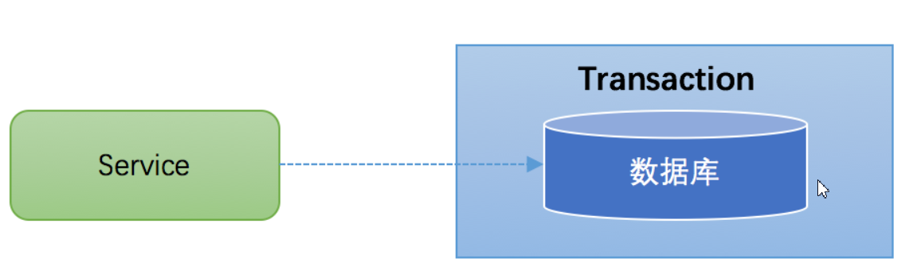

在 JDBC 编程中，我们通过 `java.sql.Connection` 对象来开启、关闭或者提交事务，代码如下所示：

```java
Connection conn = ...;  // 获取数据库连接
conn.setAutoCommit(false); // 开启事务
try {
    // 1: 张三-100 conn1
    // 2: 李四+100 conn2
    // 3: 其他操作 10/0
    conn.commit(); // 提交事务
} catch (Exception e) {
    conn.rollback(); // 事务回滚
} finally {
    conn.close(); // 关闭连接
}
```

Spring 声明式事务（基于 AOP 实现）：

```java
/**
 * 转账业务
 *
 * @param fromUserName 转账人
 * @param toUserName   被转账人
 * @param changeSal    转账额度
 */
@Transactional(rollbackFor = Exception.class)
public void changeSal(String fromUserName, String toUserName, int changeSal) {
    bankMapper.updateSal(fromUserName, -1 * changeSal);
    bankMapper.updateSal(toUserName, changeSal);
    int i = 10 / 0; // 故意抛异常，验证事务回滚
}
```

### 1.2 分布式事务

微服务架构下，一次业务操作（如下单）往往要跨多个服务、多个数据库：订单服务写订单库，商品服务写商品库。每个服务内部的本地事务只能保证自己那一段的原子性，**跨服务、跨库的整体一致性**就是分布式事务要解决的问题。

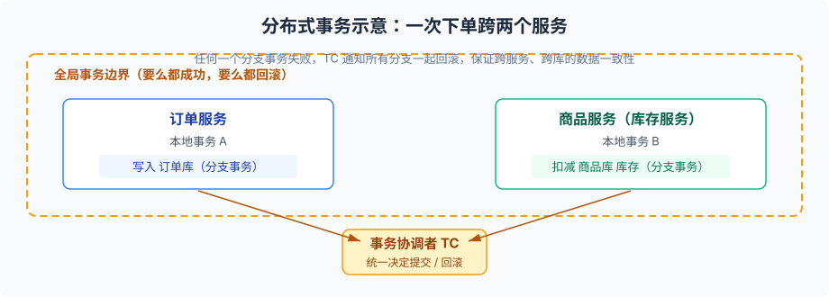

### 1.3 分布式事务问题复现

模拟下单需求：

1. cloud-order 服务：提交订单（tb_order insert）；
2. cloud-goods 服务：扣减库存（tb_goods update）。

entity：

```java
package com.example.entity;

import com.baomidou.mybatisplus.annotation.IdType;
import com.baomidou.mybatisplus.annotation.TableId;
import com.baomidou.mybatisplus.annotation.TableName;
import lombok.Data;

import java.io.Serializable;

@Data
@TableName("tb_goods")
public class TbGoods implements Serializable {

    /**
     * 商品ID（雪花算法生成）
     */
    @TableId(type = IdType.ASSIGN_ID)
    private Integer goodsId;

    /**
     * 商品库存
     */
    private Integer goodsStock;

    /**
     * 商品价格
     */
    private Double goodsPrice;

    /**
     * 商品名称
     */
    private String goodsName;
}
```

```java
package com.example.entity;

import com.baomidou.mybatisplus.annotation.IdType;
import com.baomidou.mybatisplus.annotation.TableId;
import com.baomidou.mybatisplus.annotation.TableName;
import lombok.Data;

import java.io.Serializable;

@Data
@TableName("tb_order")
public class TbOrder implements Serializable {

    /**
     * 订单ID（雪花算法生成）
     */
    @TableId(type = IdType.ASSIGN_ID)
    private String orderId;

    /**
     * 购买数量
     */
    private Integer orderNum;

    /**
     * 订单金额
     */
    private Double orderAmount;

    /**
     * 商品ID
     */
    private Integer goodsId;
}
```

依赖：

```xml
<dependency>
    <groupId>org.projectlombok</groupId>
    <artifactId>lombok</artifactId>
</dependency>
<dependency>
    <groupId>com.baomidou</groupId>
    <artifactId>mybatis-plus</artifactId>
    <version>3.4.2</version>
</dependency>
```

```xml
<dependencies>
    <dependency>
        <groupId>com.baomidou</groupId>
        <artifactId>mybatis-plus-boot-starter</artifactId>
        <version>3.4.2</version>
    </dependency>

    <!-- mysql驱动 -->
    <dependency>
        <groupId>mysql</groupId>
        <artifactId>mysql-connector-java</artifactId>
    </dependency>
    <!-- druid连接池 -->
    <dependency>
        <groupId>com.alibaba</groupId>
        <artifactId>druid-spring-boot-starter</artifactId>
        <version>1.1.10</version>
    </dependency>

    <dependency>
        <groupId>org.springframework.boot</groupId>
        <artifactId>spring-boot-starter-web</artifactId>
    </dependency>

    <dependency>
        <groupId>org.springframework.boot</groupId>
        <artifactId>spring-boot-starter-test</artifactId>
    </dependency>
</dependencies>
```

配置：

```yaml
spring:
  datasource:
    druid:
      driver-class-name: com.mysql.jdbc.Driver
      username: root
      password: 123456
      url: jdbc:mysql://127.0.0.1:3306/cloud_demo?useUnicode=true&characterEncoding=utf8&useSSL=false
      max-active: 40 # 连接池配置
# 输出sql语句
mybatis-plus:
  configuration:
    log-impl: org.apache.ibatis.logging.stdout.StdOutImpl
```

订单服务通过 OpenFeign 调用商品服务扣库存：订单插入成功、商品扣减失败（或反过来）时，两个本地事务无法互相回滚，就出现了分布式事务问题。

## 2. Seata 简介

**Seata**（Simple Extensible Autonomous Transaction Architecture）是阿里巴巴开源的分布式事务中间件，以高效并且对业务 0 侵入的方式，解决微服务场景下面临的分布式事务问题。

- GitHub 地址：<https://github.com/seata/seata>
- 中文官网：<http://seata.io/zh-cn/>

### 2.1 AT 模式角色分析

```text
Transaction Coordinator (TC): Maintain status of global and branch transactions,
    drive the global commit or rollback.
Transaction Manager (TM): Define the scope of global transaction: begin a global
    transaction, commit or rollback a global transaction.
Resource Manager (RM): Manage resources that branch transactions working on, talk to
    TC for registering branch transactions and reporting status of branch transactions,
    and drive the branch transaction commit or rollback.
```

1. **Transaction Coordinator（TC）**：事务协调器，维护全局事务的运行状态，负责协调并驱动全局事务的提交或回滚；
2. **Transaction Manager（TM）**：控制全局事务的边界，负责开启一个全局事务，并最终发起全局提交或全局回滚的决议；
3. **Resource Manager（RM）**：控制分支事务，负责分支注册、状态汇报，并接收事务协调器的指令，驱动分支（本地）事务的提交和回滚。

### 2.2 AT 模式工作流程

第一阶段：

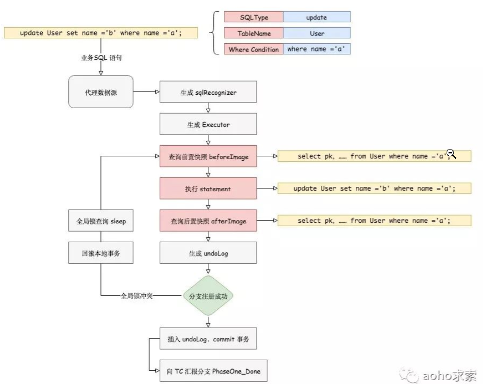

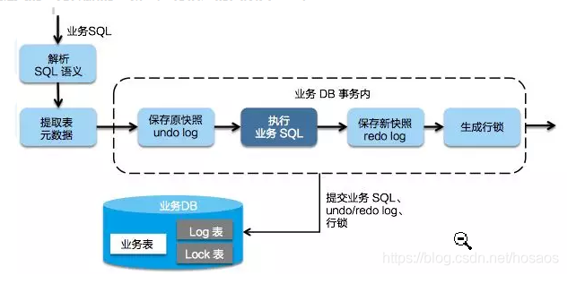

一阶段的核心：本地事务提交前，Seata 会把数据修改前后的镜像记录到 `undo_log` 表（方便回滚），然后立即提交本地事务并**抢占全局锁**，减少锁的持有时间。

**二阶段提交**：如果决议是全局提交，此时分支事务已经完成提交，不需要同步协调处理（只需要异步清理回滚日志），Phase 2 可以非常快速地完成：

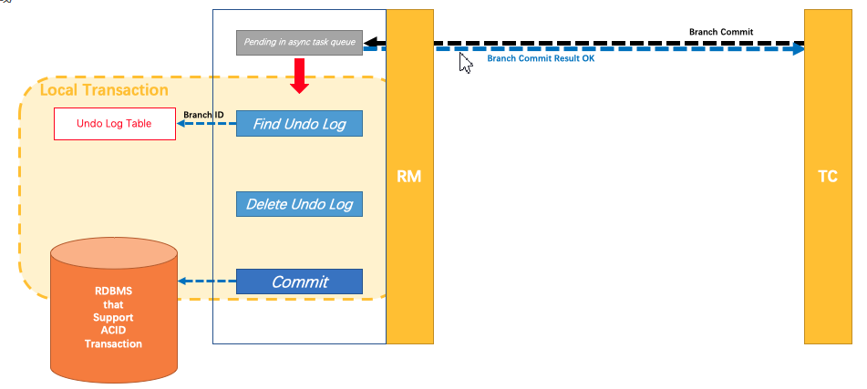

**二阶段回滚**：如果决议是全局回滚，RM 收到协调器发来的回滚请求，通过 XID 和 Branch ID 找到相应的回滚日志记录，**通过回滚记录生成反向的更新 SQL 并执行**，以完成分支的回滚：

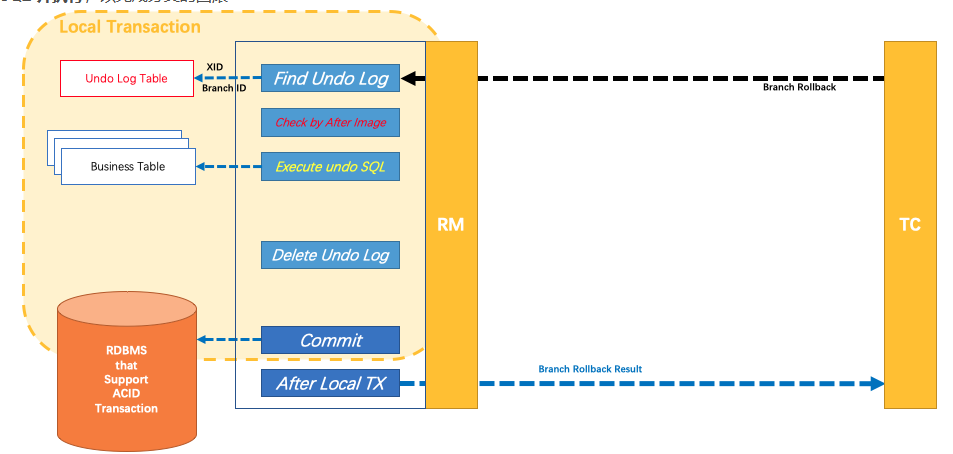

## 3. Seata 应用

### 3.1 下载 seata-server

下载地址：<https://github.com/seata/seata/tags>

### 3.2 配置 seata-server

#### 3.2.1 配置 seata-server 数据源

配置文件位置（以 Windows 为例）：`E:\seata-server-1.4.2\seata\seata-server-1.4.2\conf\file.conf`

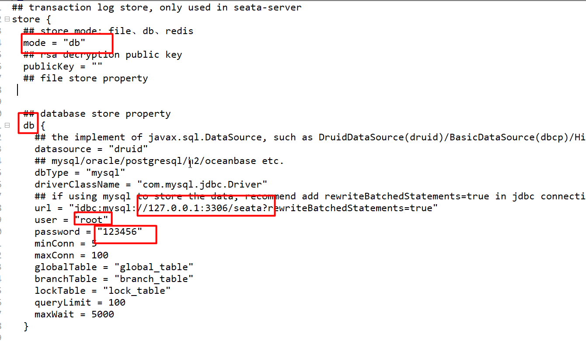

#### 3.2.2 创建 seata 数据库

```sql
create database seata;
```

#### 3.2.3 创建 3 张表

表的脚本下载地址：<https://github.com/seata/seata/tree/develop/script/server/db>

```sql
-- -------------------------------- The script used when storeMode is 'db' --------------------------------
-- the table to store GlobalSession data
CREATE TABLE IF NOT EXISTS `global_table`
(
    `xid`                       VARCHAR(128) NOT NULL,
    `transaction_id`            BIGINT,
    `status`                    TINYINT      NOT NULL,
    `application_id`            VARCHAR(32),
    `transaction_service_group` VARCHAR(32),
    `transaction_name`          VARCHAR(128),
    `timeout`                   INT,
    `begin_time`                BIGINT,
    `application_data`          VARCHAR(2000),
    `gmt_create`                DATETIME,
    `gmt_modified`              DATETIME,
    PRIMARY KEY (`xid`),
    KEY `idx_gmt_modified_status` (`gmt_modified`, `status`),
    KEY `idx_transaction_id` (`transaction_id`)
) ENGINE = InnoDB
  DEFAULT CHARSET = utf8;

-- the table to store BranchSession data
CREATE TABLE IF NOT EXISTS `branch_table`
(
    `branch_id`         BIGINT       NOT NULL,
    `xid`               VARCHAR(128) NOT NULL,
    `transaction_id`    BIGINT,
    `resource_group_id` VARCHAR(32),
    `resource_id`       VARCHAR(256),
    `branch_type`       VARCHAR(8),
    `status`            TINYINT,
    `client_id`         VARCHAR(64),
    `application_data`  VARCHAR(2000),
    `gmt_create`        DATETIME(6),
    `gmt_modified`      DATETIME(6),
    PRIMARY KEY (`branch_id`),
    KEY `idx_xid` (`xid`)
) ENGINE = InnoDB
  DEFAULT CHARSET = utf8;

-- the table to store lock data
CREATE TABLE IF NOT EXISTS `lock_table`
(
    `row_key`        VARCHAR(128) NOT NULL,
    `xid`            VARCHAR(96),
    `transaction_id` BIGINT,
    `branch_id`      BIGINT       NOT NULL,
    `resource_id`    VARCHAR(256),
    `table_name`     VARCHAR(32),
    `pk`             VARCHAR(36),
    `gmt_create`     DATETIME,
    `gmt_modified`   DATETIME,
    PRIMARY KEY (`row_key`),
    KEY `idx_branch_id` (`branch_id`)
) ENGINE = InnoDB
  DEFAULT CHARSET = utf8;
```

#### 3.2.4 修改 seata 的注册中心

配置文件：`E:\seata-server-1.4.2\seata\seata-server-1.4.2\conf\registry.conf`

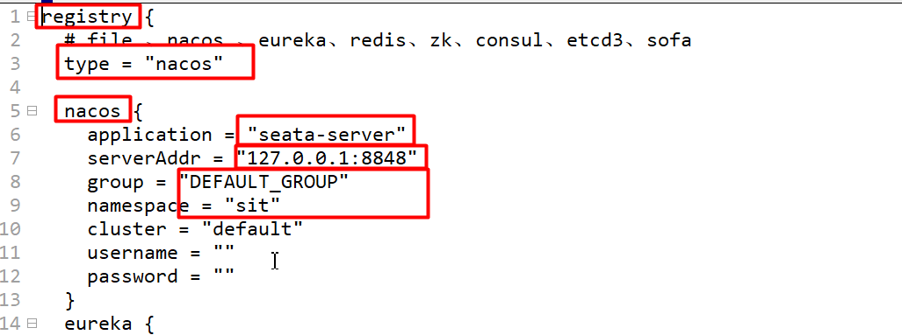

#### 3.2.5 修改 seata-server 的配置中心

配置文件：`E:\seata-server-1.4.2\seata\seata-server-1.4.2\conf\registry.conf`

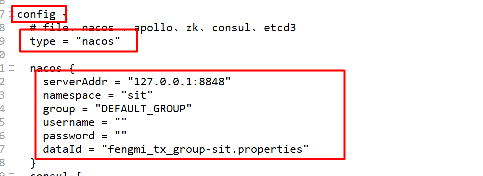

#### 3.2.6 Nacos 配置中心管理 seata 配置

##### 3.2.6.1 下载配置项

下载地址：<https://github.com/seata/seata/tree/develop/script/config-center>

核心配置内容如下（完整项以官方脚本为准，此处节选常用项）：

```properties
transport.type=TCP
transport.server=NIO
transport.heartbeat=true
transport.enableClientBatchSendRequest=false
transport.threadFactory.bossThreadPrefix=NettyBoss
transport.threadFactory.workerThreadPrefix=NettyServerNIOWorker
transport.threadFactory.serverExecutorThreadPrefix=NettyServerBizHandler
transport.threadFactory.shareBossWorker=false
transport.threadFactory.clientSelectorThreadPrefix=NettyClientSelector
transport.threadFactory.clientSelectorThreadSize=1
transport.threadFactory.clientWorkerThreadPrefix=NettyClientWorkerThread
transport.threadFactory.bossThreadSize=1
transport.threadFactory.workerThreadSize=default
transport.shutdown.wait=3

# 事务分组【重点】
service.vgroupMapping.fengmi_tx_group=default
service.default.grouplist=127.0.0.1:8091
service.enableDegrade=false
service.disableGlobalTransaction=false

client.rm.asyncCommitBufferLimit=10000
client.rm.lock.retryInterval=10
client.rm.lock.retryTimes=30
client.rm.lock.retryPolicyBranchRollbackOnConflict=true
client.rm.reportRetryCount=5
client.rm.tableMetaCheckEnable=false
client.rm.tableMetaCheckerInterval=60000
client.rm.sqlParserType=druid
client.rm.reportSuccessEnable=false
client.rm.sagaBranchRegisterEnable=false
client.tm.commitRetryCount=5
client.tm.rollbackRetryCount=5
client.tm.defaultGlobalTransactionTimeout=60000
client.tm.degradeCheck=false
client.tm.degradeCheckAllowTimes=10
client.tm.degradeCheckPeriod=2000

# 存储模式【重点】
store.mode=db
store.publicKey=
store.file.dir=file_store/data
store.file.maxBranchSessionSize=16384
store.file.maxGlobalSessionSize=512
store.file.fileWriteBufferCacheSize=16384
store.file.flushDiskMode=async
store.file.sessionReloadReadSize=100
store.db.datasource=druid
store.db.dbType=mysql
store.db.driverClassName=com.mysql.jdbc.Driver
store.db.url=jdbc:mysql://127.0.0.1:3306/seata?useUnicode=true
store.db.user=root
store.db.password=123456
store.db.minConn=5
store.db.maxConn=30
store.db.globalTable=global_table
store.db.branchTable=branch_table
store.db.queryLimit=100
store.db.lockTable=lock_table
store.db.maxWait=5000

store.redis.mode=single
store.redis.single.host=127.0.0.1
store.redis.single.port=6379
store.redis.maxConn=10
store.redis.minConn=1
store.redis.maxTotal=100
store.redis.database=0
store.redis.password=
store.redis.queryLimit=100

server.recovery.committingRetryPeriod=1000
server.recovery.asynCommittingRetryPeriod=1000
server.recovery.rollbackingRetryPeriod=1000
server.recovery.timeoutRetryPeriod=1000
server.maxCommitRetryTimeout=-1
server.maxRollbackRetryTimeout=-1
server.rollbackRetryTimeoutUnlockEnable=false

client.undo.dataValidation=true
client.undo.logSerialization=jackson
client.undo.onlyCareUpdateColumns=true
server.undo.logSaveDays=7
server.undo.logDeletePeriod=86400000
client.undo.logTable=undo_log
client.undo.compress.enable=true
client.undo.compress.type=zip
client.undo.compress.threshold=64k

log.exceptionRate=100
transport.serialization=seata
transport.compressor=none

metrics.enabled=false
metrics.registryType=compact
metrics.exporterList=prometheus
metrics.exporterPrometheusPort=9898
```

##### 3.2.6.2 修改相关配置项

```text
service.vgroupMapping.fengmi_tx_group=default
store.mode=db
store.db.driverClassName=com.mysql.jdbc.Driver
store.db.url=jdbc:mysql://127.0.0.1:3306/seata?useUnicode=true
store.db.user=root
store.db.password=123456
```

##### 3.2.6.3 创建配置文件

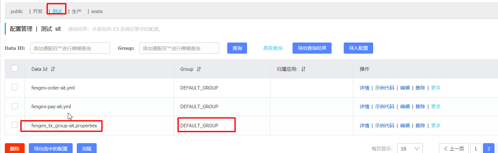

> [!IMPORTANT]
> 注意目前只支持 properties 格式，不支持 yml。

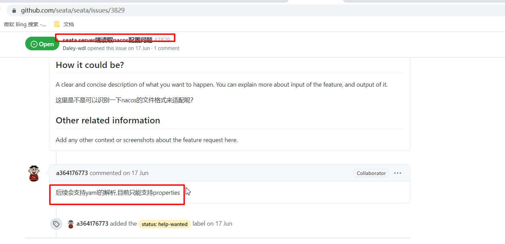

#### 3.2.7 启动 seata-server

> [!WARNING]
> 注意 `-h` 必须指定为局域网真实 ip 地址，不要指定 127.0.0.1，否则客户端无法连接。

> [!TIP]
> 启动成功后，控制台会输出 seata-server 的监听端口（默认 8091）与服务注册信息；看到 `Server started, service listener port: 8091` 字样即表示启动完成。

### 3.3 Seata 客户端

一个调用链中的**所有微服务都是 seata 的客户端**，都必须走下面的步骤。

#### 3.3.1 创建 undo_log 表

下载地址：<https://github.com/seata/seata/tree/develop/script/client/at/db>

每个业务库（cloud_demo 里的订单库、商品库）都要建 undo_log 表：

```sql
-- for AT mode you must to init this sql for you business database. the seata server not need it.
CREATE TABLE IF NOT EXISTS `undo_log`
(
    `branch_id`     BIGINT(20)   NOT NULL COMMENT 'branch transaction id',
    `xid`           VARCHAR(100) NOT NULL COMMENT 'global transaction id',
    `context`       VARCHAR(128) NOT NULL COMMENT 'undo_log context,such as serialization',
    `rollback_info` LONGBLOB     NOT NULL COMMENT 'rollback info',
    `log_status`    INT(11)      NOT NULL COMMENT '0:normal status,1:defense status',
    `log_created`   DATETIME(6)  NOT NULL COMMENT 'create datetime',
    `log_modified`  DATETIME(6)  NOT NULL COMMENT 'modify datetime',
    UNIQUE KEY `ux_undo_log` (`xid`, `branch_id`)
) ENGINE = InnoDB
  AUTO_INCREMENT = 1
  DEFAULT CHARSET = utf8 COMMENT ='AT transaction mode undo table';
```

#### 3.3.2 pom 依赖

```xml
<!-- seata -->
<dependency>
    <groupId>com.alibaba.cloud</groupId>
    <artifactId>spring-cloud-alibaba-seata</artifactId>
    <version>2.2.0.RELEASE</version>
    <exclusions>
        <exclusion>
            <groupId>io.seata</groupId>
            <artifactId>seata-spring-boot-starter</artifactId>
        </exclusion>
    </exclusions>
</dependency>
<dependency>
    <groupId>io.seata</groupId>
    <artifactId>seata-spring-boot-starter</artifactId>
    <version>1.4.2</version>
</dependency>
```

#### 3.3.3 配置

```yaml
seata:
  enabled: true
  tx-service-group: fengmi_tx_group
  enable-auto-data-source-proxy: true
  config:
    type: nacos
    nacos:
      server-addr: 127.0.0.1:8848
      group: DEFAULT_GROUP
      namespace: pro
      username: nacos
      password: nacos
      data-id: demo_tx_group-pro.properties

  registry: # 发现seata-server
    type: nacos
    nacos:
      application: seata-server
      server-addr: 127.0.0.1:8848
      namespace: pro
      group: DEFAULT_GROUP
      username: nacos
      password: nacos
```

#### 3.3.4 @GlobalTransactional

在**全局事务的发起方**（订单服务）方法上加 `@GlobalTransactional`，其作用相当于本地事务的 `@Transactional`，只是管辖范围是整个全局事务（所有分支）：

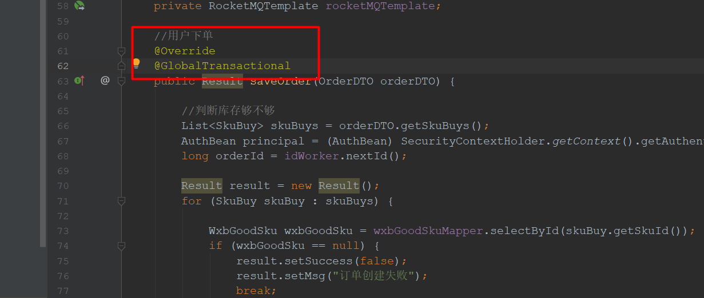

## 4. Seata 全局事务并发隔离

全局事务并行修改同一数据怎么隔离？

### 4.1 写隔离

- 一阶段本地事务提交前，需要确保先拿到**全局锁**；
- 拿不到**全局锁**，不能提交本地事务。

两个全局事务同时修改同一行数据时，先拿到全局锁的事务可以提交，另一个必须等待，从而避免两个事务同时改同一行造成脏写。

### 4.2 读隔离

一个全局事务修改数据，另外一个全局事务读取数据怎么解决脏读？

在数据库本地事务隔离级别**读已提交（Read Committed）**或以上的基础上，Seata（AT 模式）的默认全局隔离级别是**读未提交（Read Uncommitted）**。

如果应用在特定场景下，必须要求全局的**读已提交**，目前 Seata 的方式是通过 `SELECT FOR UPDATE` 语句的代理——执行该语句时会申请全局锁，直到全局锁拿到（说明事务已提交）才返回结果。

## 5. 面试题

1. 什么是分布式事务？
2. 怎么解决分布式事务？
3. Seata 分布式事务的工作流程/原理/机制？
4. Seata 全局事务并发隔离的问题？（写隔离靠全局锁、读隔离靠 `SELECT FOR UPDATE` 代理）

## 6. 小结

- 本地事务只能保证单库内的一致性，跨服务、跨库需要**分布式事务**；
- Seata AT 模式三角色：**TC**（事务协调器）、**TM**（事务发起与决议）、**RM**（分支事务管理）；
- AT 模式两阶段：一阶段本地提交 + 记录 `undo_log` 前后镜像 + 抢全局锁；二阶段提交时异步删日志，回滚时**根据镜像生成反向 SQL**；
- 部署要点：seata-server 的 store 配置（db 模式 + 3 张表）、注册中心/配置中心接入 Nacos、配置只支持 **properties**；客户端每个业务库要建 **undo_log** 表，事务发起方加 `@GlobalTransactional`；
- 全局隔离：默认读未提交，写隔离靠全局锁，读已提交靠 `SELECT FOR UPDATE` 代理。
