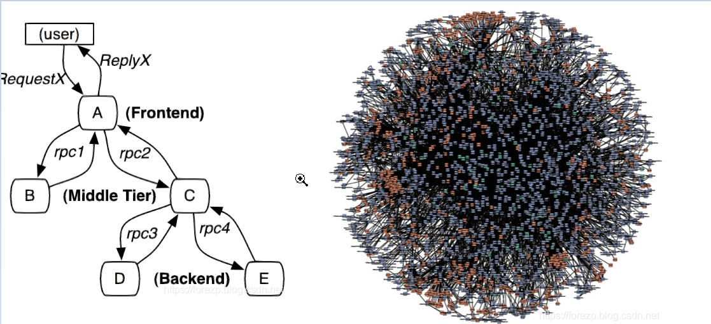
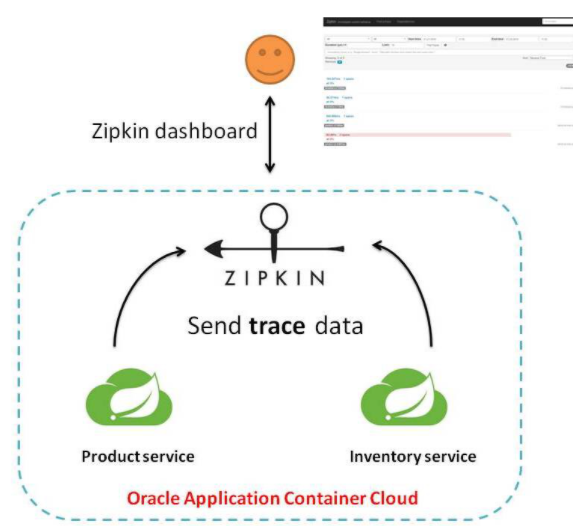

# Sleuth

## 1. 为什么要链路追踪

先小结一下 Spring Cloud Alibaba 体系中各组件的分工：

- **Nacos【name server】**：注册中心，解决服务的注册与发现；
- **Nacos【config】**：配置中心，微服务配置文件的中心化管理，同时配置信息的动态刷新；
- **Ribbon**：客户端负载均衡器，解决微服务集群负载均衡的问题；
- **OpenFeign**：声明式 HTTP 客户端，解决微服务之间远程调用问题；
- **Sentinel**：微服务流量防卫兵，以流量为入口，保护微服务，防止服务雪崩；
- **Gateway**：微服务网关，服务集群的入口，路由转发以及负载均衡（全局认证、流控）；
- **Sleuth**：链路追踪。

随着服务的越来越多，对调用链的分析会越来越复杂。它们之间的调用关系也许如下图：



微服务体系面临的链路问题：

1. 微服务之间的调用错综复杂，用户发送的请求经历哪些服务、调用链不清楚，没有一个自动化工具来维护调用链；
2. 无法快速定位调用链中哪个环节出了问题；
3. 无法快速定位调用链中哪个环节比较耗时。

链路追踪就是为解决这些问题而生：给每个请求一个全局唯一 ID，记录它经过的每一跳，把整条链路可视化出来。

## 2. Sleuth 简介

### 2.1 Spring Cloud Sleuth

Spring Cloud Sleuth 提供的分布式系统中**链路追踪解决方案**。

同类产品：

- **SkyWalking**：本土开源的基于字节码注入的调用链分析，以及应用监控分析工具。特点是支持多种插件，UI 功能较强，接入端无代码侵入。目前已加入 Apache 孵化器；
- **Cat**：由大众点评开源，基于 Java 开发的实时应用监控平台，包括实时应用监控、业务监控。集成方案是通过代码埋点的方式来实现监控。

### 2.2 Sleuth 术语

**Span（跨度）**：代表了一组基本的工作单元。为了统计各处理单元的延迟，当请求到达各个服务组件的时候，也通过一个唯一标识（SpanId）来标记它的开始、具体过程和结束。通过 SpanId 的开始和结束时间戳，就能统计该 Span 的调用时间；除此之外，我们还可以获取如事件的名称、请求信息等元数据。

**Trace（追踪）**：由一组 Trace ID 相同的 Span 串联形成一个树状结构。为了实现请求跟踪，当请求到达分布式系统的入口端点时，服务跟踪框架为该请求创建一个唯一的标识（即 TraceId），同时在分布式系统内部流转的时候，框架始终保持传递该唯一值，直到整个请求的返回。这样就可以使用该唯一标识将所有的请求串联起来，形成一条完整的请求链路。

**Annotation（标注）**：用它记录一个完整请求的 4 个事件，内部使用的重要注释：

| 事件 | 含义 |
| --- | --- |
| cs（Client Send） | 客户端发出请求，开始一个请求的生命 |
| sr（Server Received） | 服务端接收到请求开始进行处理，`sr - cs` = 网络延迟（服务调用的时间） |
| ss（Server Send） | 服务端处理完毕准备发送到客户端，`ss - sr` = 服务器上的请求处理时间 |
| cr（Client Received） | 客户端接收到服务端的响应，请求结束，`cr - cs` = 请求的总时间 |

### 2.3 Sleuth + Zipkin 架构

Sleuth 只负责在服务间传递追踪信息并打点，**Zipkin** 负责收集与展示：



下载 Zipkin dashboard：

```text
Zipkin 是 Twitter 开放源代码分布式的跟踪系统，每个服务向 Zipkin 报告计时数据，
Zipkin 会根据调用关系通过 Zipkin UI 生成依赖关系图。
```

下载地址：<https://dl.bintray.com/openzipkin/maven/io/zipkin/java/zipkin-server/>

### 2.4 cloud-goods 集成 Sleuth

pom 依赖：

```xml
<!-- 链路追踪场景依赖 -->
<dependency>
    <groupId>org.springframework.cloud</groupId>
    <artifactId>spring-cloud-starter-sleuth</artifactId>
</dependency>
<dependency>
    <groupId>org.springframework.cloud</groupId>
    <artifactId>spring-cloud-starter-zipkin</artifactId>
</dependency>
```

配置：

```yaml
spring:
  zipkin:
    base-url: http://localhost:9999 # zipkin-server的地址
    discovery-client-enabled: false # 不通过注册中心发现zipkin，直接用base-url
  sleuth:
    sampler:
      rate: 100 # 采样配置
```

> [!TIP]
> `rate: 100` 表示基于速率的采样（每秒最多采集 100 条跨度）。如果只想按比例全量采样，也可以改用 `spring.sleuth.sampler.probability: 1.0`（取值 0~1，1.0 表示 100% 采样）。

### 2.5 cloud-jifen 集成 Sleuth

pom 依赖：

```xml
<!-- 链路追踪场景依赖 -->
<dependency>
    <groupId>org.springframework.cloud</groupId>
    <artifactId>spring-cloud-starter-sleuth</artifactId>
</dependency>
<dependency>
    <groupId>org.springframework.cloud</groupId>
    <artifactId>spring-cloud-starter-zipkin</artifactId>
</dependency>
```

配置：

```yaml
spring:
  zipkin:
    base-url: http://localhost:9999
    discovery-client-enabled: false
  sleuth:
    sampler:
      rate: 100
```

### 2.6 cloud-order 集成 Sleuth

pom 依赖：

```xml
<!-- 链路追踪场景依赖 -->
<dependency>
    <groupId>org.springframework.cloud</groupId>
    <artifactId>spring-cloud-starter-sleuth</artifactId>
</dependency>
<dependency>
    <groupId>org.springframework.cloud</groupId>
    <artifactId>spring-cloud-starter-zipkin</artifactId>
</dependency>
```

配置：

```yaml
spring:
  zipkin:
    base-url: http://localhost:9999
    discovery-client-enabled: false
  sleuth:
    sampler:
      rate: 100
```

> [!TIP]
> 调用链上的**每一个微服务**（goods、jifen、order）都要引入依赖并做同样的配置，缺一个服务，Zipkin 上的链路就是断的。全部接入后，启动 Zipkin 服务端，发起一次跨服务调用，即可在 `http://localhost:9999` 中按 TraceId 查看完整链路、各环节耗时与依赖关系图。

## 3. 小结

- 链路追踪解决微服务"调用链不清楚、故障定位难、耗时分析难"三大痛点；
- 核心概念：**Trace**（一次请求全程，TraceId 全局唯一并透传）、**Span**（一次调用单元，SpanId 标记起止）、**Annotation**（cs/sr/ss/cr 四个事件用于计算网络延迟、服务处理时间、请求总时间）；
- **Sleuth** 负责埋点与上下文传递，**Zipkin** 负责收集、存储与可视化；
- 接入方式：调用链上每个微服务引入 `spring-cloud-starter-sleuth` 与 `spring-cloud-starter-zipkin`，配置 zipkin 的 base-url 与采样率即可，业务代码零侵入。
