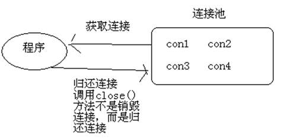
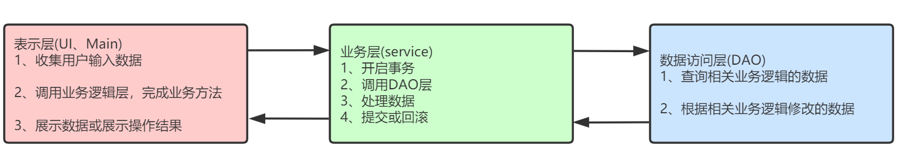
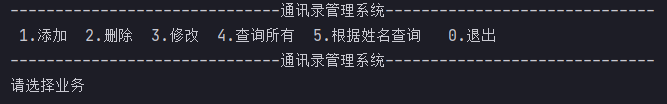
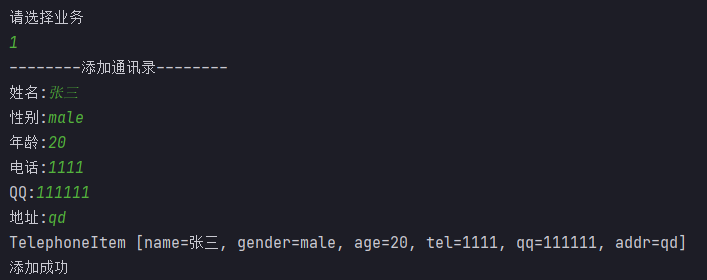
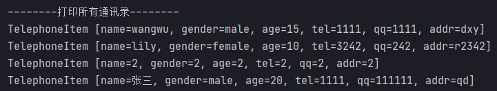
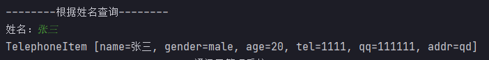
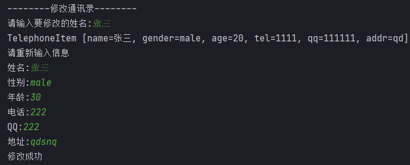
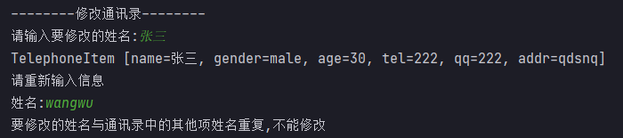

# 数据库连接池

本篇整理连接池的概念与 `javax.sql.DataSource` 接口、Druid 连接池的使用与工具类封装，以及 JavaWeb 中常见的三层架构设计。

## 1. 连接池简介

**连接池**是一种管理连接的技术。用连接池来管理 Connection，可以重复使用连接。有了连接池，我们就不用自己来创建 Connection，而是通过池来获取 Connection 对象。当使用完 Connection 后，调用 Connection 的 `close()` 方法也不会真的关闭连接，而是把 Connection **归还**给池，连接池就可以再利用这个 Connection 对象了。



Java 为数据库连接池提供了公共的接口：`javax.sql.DataSource`，各个厂商可以让自己的连接池实现这个接口。这样应用程序就可以方便地切换不同厂商的连接池。

## 2. Druid 连接池

Druid 是阿里巴巴开源的一个数据源，主要用于 Java 数据库连接池。相比 Spring 推荐的 DBCP 和 Hibernate 推荐的 C3P0、Proxool 数据库连接池，Druid 在市场上占有绝对的优势。

### 2.1 准备工作

1. 新建 Java 项目；
2. 在项目下新建 `lib` 目录；
3. 将 MySQL 驱动 jar 包和 Druid jar 包拷贝到 `lib` 目录下；
4. 选中 `lib` 目录右键 `Add as Library`，单击 `OK`。

### 2.2 Druid 连接池使用入门

```java
import com.alibaba.druid.pool.DruidDataSource;

import java.sql.Connection;
import java.sql.SQLException;

public class Test1 {
    public static void main(String[] args) throws SQLException {
        //创建Druid连接池对象
        DruidDataSource dataSource = new DruidDataSource();

        //为Druid连接池设置参数
        dataSource.setDriverClassName("com.mysql.cj.jdbc.Driver");
        dataSource.setUrl("jdbc:mysql://localhost:3306/mydbjdbc?useSSL=false");
        dataSource.setUsername("root");
        dataSource.setPassword("root");
        //初始化连接数量
        dataSource.setInitialSize(10);
        //最大连接数量
        dataSource.setMaxActive(100);
        //最小空闲连接
        dataSource.setMinIdle(5);

        //从连接池中获取连接
        Connection connection = dataSource.getConnection();
        //打印连接
        System.out.println(connection);
        
        //归还连接
        connection.close();
    }
}
```

> [!NOTE]
> 连接池对 `close()` 方法做了增强：此处调用 `connection.close()` 并不会真正关闭底层连接，而是把连接归还给池，供后续请求复用。

通过上面的操作，我们知道了如何创建连接池并获取连接。有了连接，就可以进行 CRUD 操作了。

### 2.3 封装工具类

在实际开发中，连接池的参数不会在 Java 代码中写死，通常将其定义在独立的配置文件中；连接池则放置在工具类中。**用户使用时直接使用工具类，不直接操作连接池。**

在 `src` 下创建 `jdbc.properties` 文件，内容如下：

```properties
#连接设置
driverClassName=com.mysql.cj.jdbc.Driver
url=jdbc:mysql://localhost:3306/mydbjdbc?useSSL=false
username=root
password=root
#初始化连接数量
initialSize=10
#最大连接数量
maxActive=50
#最小空闲连接
minIdle=5
```

工具类代码如下：

```java
import com.alibaba.druid.pool.DruidDataSourceFactory;

import javax.sql.DataSource;
import java.io.IOException;
import java.io.InputStream;
import java.sql.Connection;
import java.sql.ResultSet;
import java.sql.SQLException;
import java.sql.Statement;
import java.util.Properties;

public class JdbcUtil {
    private static DataSource dataSource;

    static {
        try {
            Properties prop = new Properties();
            //读取配置文件
            InputStream in = JdbcUtil.class.getResourceAsStream("/jdbc.properties");
            prop.load(in);

            //创建DataSource
            dataSource = DruidDataSourceFactory.createDataSource(prop);
        } catch (IOException e) {
            e.printStackTrace();
        } catch (Exception e) {
            e.printStackTrace();
        }
    }

    //获取连接
    public static Connection getConnection() {
        Connection connection = null;
        try {
        	//从连接池获取连接
            connection = dataSource.getConnection();
        } catch (SQLException throwables) {
            throwables.printStackTrace();
        }
        return connection;
    }

    //释放资源
    public static void close(Connection connection, Statement statement, ResultSet rSet) {
        try {
            if(rSet != null) {
                rSet.close();
            }

            if(statement != null) {
                statement.close();
            }

            if(connection != null) {
                connection.close();
            }
        } catch (SQLException throwables) {
            throwables.printStackTrace();
        }
    }
}
```

工具类编写完成后，接下来使用工具类进行 CRUD 操作。

#### 2.3.1 使用工具类进行添加操作

```java
import java.sql.Connection;
import java.sql.PreparedStatement;
import java.sql.SQLException;

public class Test2 {
    public static void main(String[] args) throws SQLException {
        String sql = "INSERT INTO tb_stu(sname, sage, sgender) VALUES(?, ?, ?)";

        //获取连接
        Connection connection = JdbcUtil.getConnection();
        //获取PreparedStatement
        PreparedStatement statement = connection.prepareStatement(sql);
        //设置参数
        statement.setString(1, "张三");
        statement.setInt(2, 30);
        statement.setString(3, "male");

        //发送SQL语句
        int i = statement.executeUpdate();
        System.out.println(i);

        //释放资源
        JdbcUtil.close(connection, statement, null);
    }
}
```

上面的代码使用工具类完成了添加操作，**举一反三**，按照相同的套路可以完成修改和删除操作。

#### 2.3.2 使用工具类进行查询操作

```java
import com.qfedu.util.JdbcUtil;

import java.sql.Connection;
import java.sql.PreparedStatement;
import java.sql.ResultSet;
import java.sql.SQLException;

public class Test3 {
    public static void main(String[] args) throws SQLException {
        //查询名字叫张三的所有学生的信息
        String sql = "SELECT * FROM tb_stu WHERE sname=?";

        //获取连接
        Connection connection = JdbcUtil.getConnection();
        //获取PreparedStatement
        PreparedStatement statement = connection.prepareStatement(sql);
        //设置参数
        statement.setString(1, "张三");

        //发送SQL语句
        ResultSet rset = statement.executeQuery();

        //处理结果
        while(rset.next()) {
            int sid = rset.getInt("sid");
            String sname = rset.getString("sname");
            int sage = rset.getInt("sage");
            String sgender = rset.getString("sgender");
            System.out.println(sid + "---" + sname + "---" + sage + "---" + sgender);
        }

        //释放资源
        JdbcUtil.close(connection, statement, rset);
    }
}
```

## 3. 三层架构

### 3.1 三层架构是什么

三层架构将程序划分为表示层、业务逻辑层和数据访问层，各层职责如下：

| 层 | 常见命名 | 职责 |
| --- | --- | --- |
| 表示层（View） | `XXXView` | 收集用户的数据和需求、展示数据 |
| 业务逻辑层（Service） | `XXXServiceImpl` | 数据加工处理、调用 DAO 完成业务实现、控制事务 |
| 数据访问层（Dao） | `XXXDaoImpl` | 向业务层提供数据，将业务层加工后的数据同步到数据库 |



### 3.2 三层架构项目搭建（按开发步骤）

- `utils` 包存放工具类（JdbcUtils）；
- `entity` 包存放实体类（Telephone）；
- `dao` 包存放 Dao 接口（TelephoneDao）；
  - `impl` 子包存放 DAO 接口实现类（TelephoneDaoImpl）；
- `service` 包存放 Service 接口（TelephoneService）；
  - `impl` 子包存放 Service 接口实现类（TelephoneServiceImpl）；
- `view` 包存放程序启动类（main）。

> [!TIP]
> 程序设计时要考虑易修改、易扩展，为 Service 层和 DAO 层设计接口，便于未来更换实现类。

### 3.3 案例

案例实现一个通讯录，完成对通讯录信息的 CRUD 操作。要求：姓名是唯一的，姓名不能重复。

主界面：



添加联系人：



添加同名信息（不允许）：


查询所有联系人：



根据姓名查询：



修改通讯录信息：



修改时名字不存在：


修改后的名字与其他项名字重复（不允许修改）：


