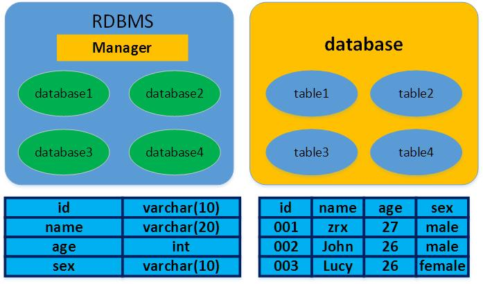
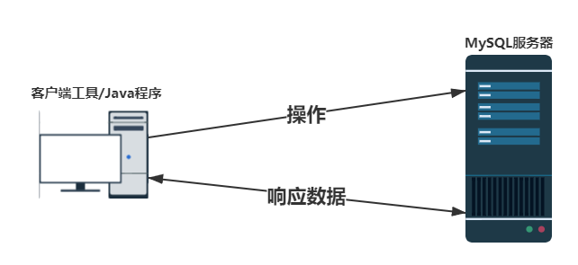

## 一、目前存在的问题

> 通过之前的学习，我们能够使用以下两种方式进行数据存储：
>
> 1. **使用变量、对象、数组、集合存储数据**，数据保存在内存（RAM）中；
> 2. **使用文件（File）存储数据**，保存在硬盘上。

### 1.1、方式1存在的问题

> 不能持久化（永久保存数据），程序关闭数据就会消失。

### 1.2、方式2存在的问题

> * 没有数据类型的区分；
> * 存储数据量级较小；
> * 没有访问安全限制；
> * 没有备份、恢复机制。
> 
> 数据需要持久化存储，如何解决上述问题：
> 
> * 使用数据库。

## 二、关于数据库

### 2.1、什么是数据库（理解）

> **用来存储和管理数据的仓库。**
>
> 优点：
>
> * 可存储大量数据；
> * **方便检索**；
> * 保持数据的一致性、完整性；
> * 安全、可共享；
> * 通过组合分析，可产生新数据。

### 2.2、数据库的发展历程（了解）

> * 无数据库，使用磁盘文件存储数据；
> * 层次结构数据库：IBM公司IMS（Information Management System）定向有序的树状结构实现存储和访问；
> * 网状结构数据库：美国通用电气公司IDS（Integrated Data Store），以节点形式存储和访问；
> * **关系结构数据库**：Oracle、DB2、**MySQL**、SQL Server，使用二维表格来存储数据；
> * **非关系型数据库**：**ElasticSearch**、MongoDB、**Redis**，多数使用哈希表，表中以键值（key-value）的方式实现特定的键和一个指针指向的特定数据。
### 2.3、常见的关系型数据库产品（了解）

> * Oracle（神谕）：美国Oracle（甲骨文）公司，主要用在电信，金融领域，下载免费，服务需要收费；
> * DB2：IBM，主要用在金融领域；
> * SQL Server：微软，只能用在微软平台上；
> * **MySQL**：瑞典MySQL AB公司开发，属于 Oracle旗下产品，分为社区版和收费版，在国内互联网公司使用广泛。

### 2.4、理解数据库（理解）

>  我们通常所说的数据库其实是**RDBMS**（Relational Database Management System，关系型数据库管理系统），其包括两个部分：
>
> * 管理员，Manager；
> * 仓库，Database。
> 
> Database包括：N张表（Table）；
>
> Table包括两个部分：
>
> * 表结构：**定义**表的列名和列类型(理解成类)；
> * 表记录：一行一行的记录(理解成对象)。

### 2.5、应用程序与数据库（暂时了解就可以）

> * 通常情况下，数据库都是安装在独立的设备（服务器，一台物理主机，可以理解为单独的一台电脑）上；
>
> * 应用程序（客户端工具/Java程序）安装在另一台设备上；
>
> * 应用程序和数据库基于客户端-服务器模型进行通信，应用程序发送请求，数据库响应数据；
>
> * 应用程序使用数据库完成对数据的存储。
>
> *注意：我们在目前的学习阶段，应用程序和数据库都安装在自己的电脑上。*

### 2.6、接下来我们的工作

> 基于2.5的分析，我们要解决如下的几个问题：
>
> 1. MySQL服务器和客户端如何安装；
> 2. **如何使用客户端工具对数据库进行操作；**
> 3. **如何使用Java程序对数据库进行操作。**

