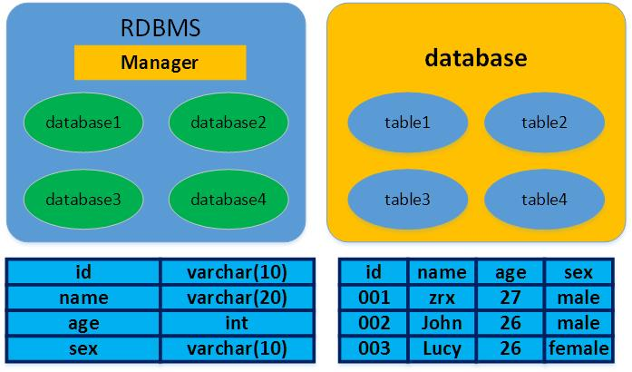
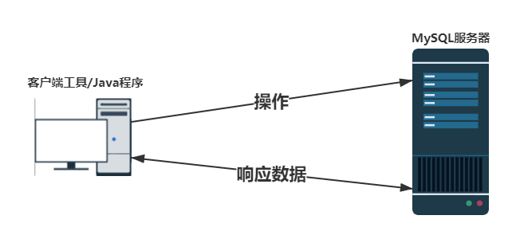

# MySQL概述

本篇整理学习数据库之前需要了解的背景知识：文件与内存两种数据存储方式存在的问题、数据库的概念与发展历程、常见关系型数据库产品，以及应用程序与数据库的协作方式。

## 1. 目前存在的问题

通过之前的学习，我们能够使用以下两种方式进行数据存储：

1. **使用变量、对象、数组、集合存储数据**，数据保存在内存（RAM）中；
2. **使用文件（File）存储数据**，保存在硬盘上。

### 1.1 方式一存在的问题

数据保存在内存中，**不能持久化**（即无法永久保存数据），程序关闭后数据就会消失。

### 1.2 方式二存在的问题

使用文件存储数据，存在以下不足：

- 没有数据类型的区分；
- 存储数据量级较小；
- 没有访问安全限制；
- 没有备份、恢复机制。

数据需要持久化存储，如何解决上述问题？答案是：**使用数据库**。

## 2. 关于数据库

### 2.1 什么是数据库

**数据库（Database）**：用来存储和管理数据的仓库。

数据库的优点：

- 可存储大量数据；
- **方便检索**；
- 保持数据的一致性、完整性；
- 安全、可共享；
- 通过组合分析，可产生新数据。

### 2.2 数据库的发展历程

| 阶段 | 代表产品 | 特点 |
| --- | --- | --- |
| 无数据库 | 磁盘文件 | 直接使用文件存储数据 |
| 层次结构数据库 | IBM 公司 IMS（Information Management System） | 以定向有序的树状结构实现存储和访问 |
| 网状结构数据库 | 美国通用电气公司 IDS（Integrated Data Store） | 以节点形式存储和访问 |
| **关系结构数据库** | Oracle、DB2、**MySQL**、SQL Server | 使用二维表格来存储数据 |
| **非关系型数据库** | **ElasticSearch**、MongoDB、**Redis** | 多数使用哈希表，表中以键值对（key-value）的方式实现特定的键和一个指针指向的特定数据 |

### 2.3 常见的关系型数据库产品

| 产品 | 所属公司 | 应用领域与特点 |
| --- | --- | --- |
| Oracle（神谕） | 美国 Oracle（甲骨文）公司 | 主要用在电信、金融领域，下载免费，服务需要收费 |
| DB2 | IBM | 主要用在金融领域 |
| SQL Server | 微软 | 只能用在微软平台上 |
| **MySQL** | 瑞典 MySQL AB 公司开发，现属 Oracle 旗下产品 | 分为社区版和收费版，在国内互联网公司使用广泛 |

### 2.4 理解数据库

我们通常所说的数据库其实是 **RDBMS**（Relational Database Management System，关系型数据库管理系统），它包括两个部分：

- 管理员（Manager）；
- 仓库（Database）。

其中 Database 包括 N 张表（Table），而 Table 又包括两个部分：

- **表结构**：定义表的列名和列类型（可以理解成类）；
- **表记录**：一行一行的记录（可以理解成对象）。

### 2.5 应用程序与数据库

- 通常情况下，数据库都安装在独立的设备（服务器，即一台物理主机，可以理解为单独的一台电脑）上；
- 应用程序（客户端工具或 Java 程序）安装在另一台设备上；
- 应用程序和数据库基于客户端-服务器（Client/Server）模型进行通信：应用程序发送请求，数据库响应数据；
- 应用程序使用数据库完成对数据的存储。

> [!NOTE]
> 在目前的学习阶段，应用程序和数据库都安装在自己的电脑上。

### 2.6 接下来的工作

基于 2.5 节的分析，我们要解决以下几个问题：

1. MySQL 服务器和客户端如何安装；
2. **如何使用客户端工具对数据库进行操作**；
3. **如何使用 Java 程序对数据库进行操作**。
