# MySQL安装及配置

本篇记录 MySQL 5.7 在 Windows 平台下的下载、安装、配置、卸载全过程，以及环境变量、目录结构与配置文件的相关说明。

## 1. 下载

**官网**：<https://www.mysql.com/>

**下载地址**：<https://dev.mysql.com/downloads/installer/>

下载时注意 MySQL 版本，选择**体积大的离线安装包**下载。

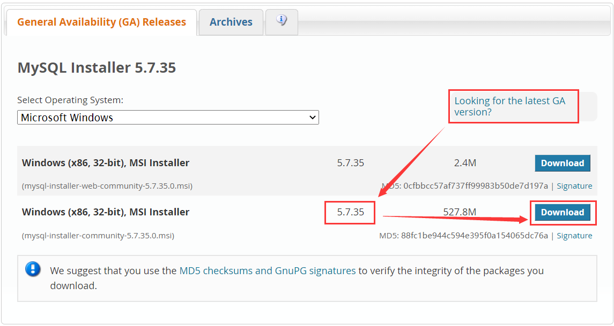

单击 Download 后，提示注册账号，这里**我们不需要注册账号**，直接选择 `No thanks, just start my download.` 下载即可。

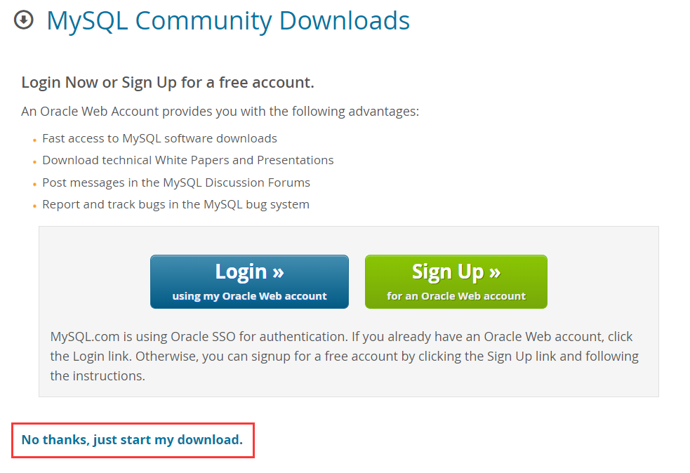

## 2. 安装及配置

### 2.1 选择安装类型

选择 `Server only` 就可以，足够支撑我们的学习。

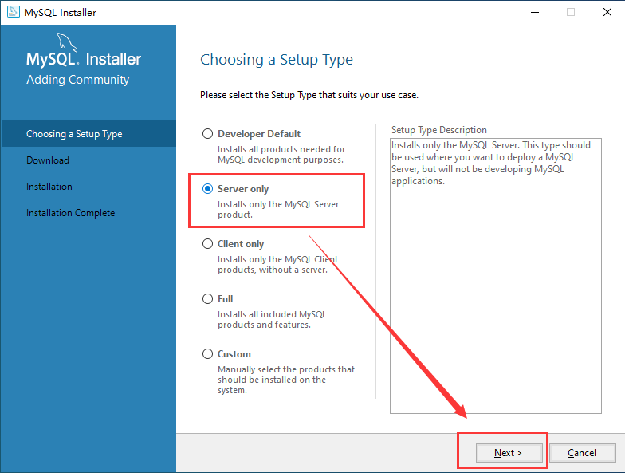

### 2.2 检查需要的依赖

MySQL Server 5.7 运行需要依赖 MS C++ 2013 的库，安装之前有必要先安装 MS C++ 2013。如果你的电脑之前安装过 MS C++ 2013，那么会直接进入下一步。

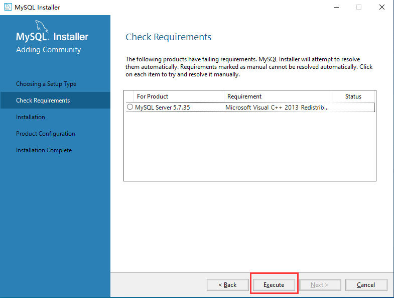

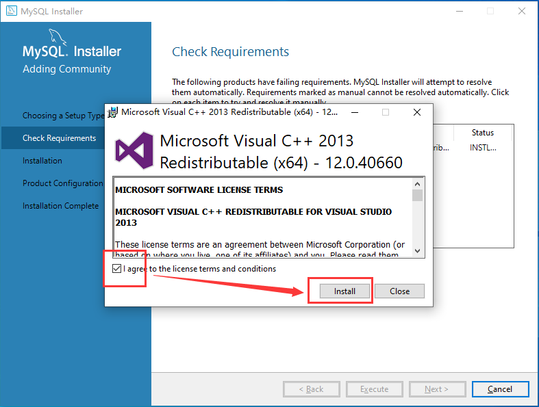

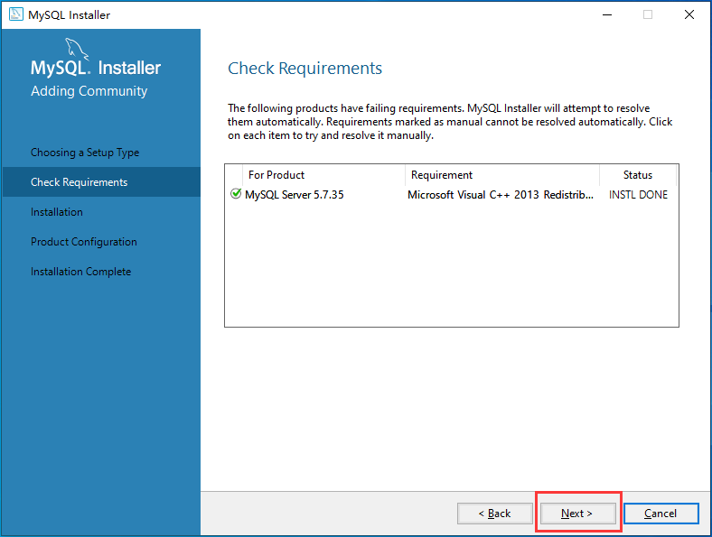

### 2.3 安装

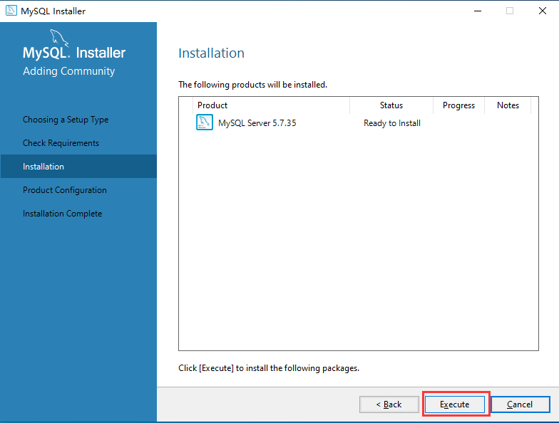

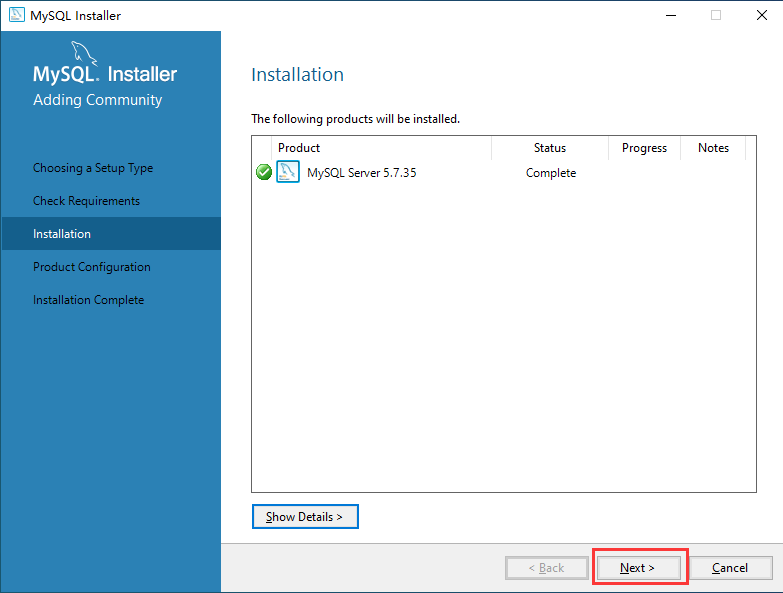

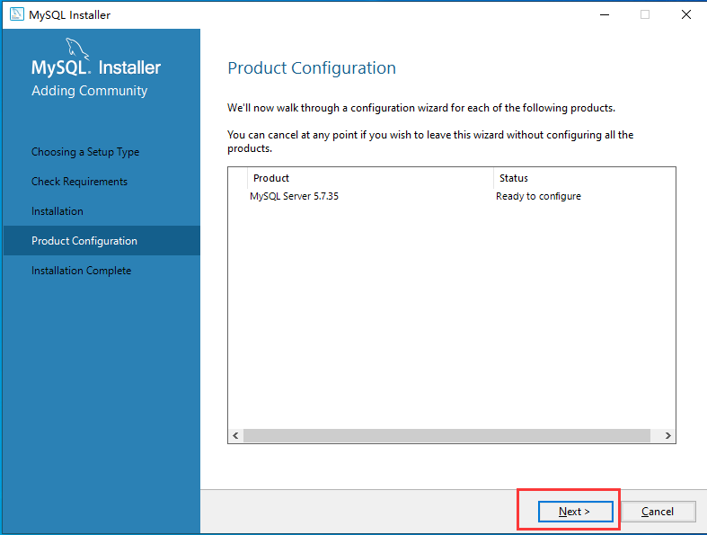

### 2.4 配置

#### 2.4.1 配置类型和网络

Config Type 选择 Development Computer 就可以，占用资源较少，完全能够支撑我们的学习。Port（端口）默认 3306 就可以，也可以写别的值，**这个值一定要牢记**，后续会反复用到。

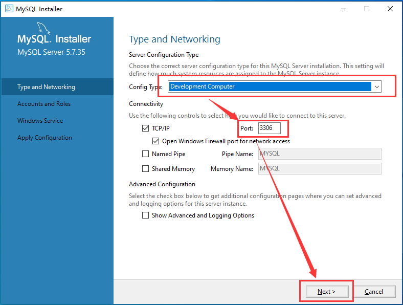

#### 2.4.2 配置账户和角色

设置 root 用户的密码。由于处于学习阶段，不需要设置过于复杂的密码。

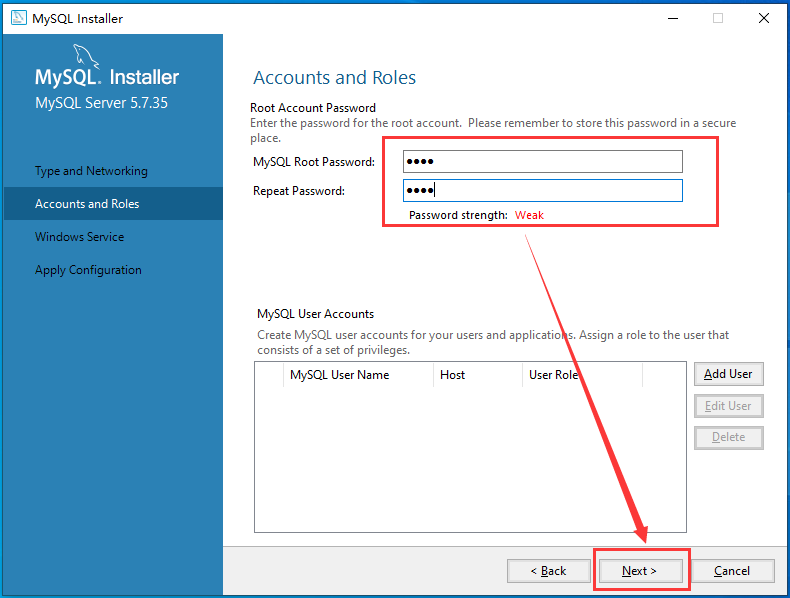

#### 2.4.3 配置 Windows 服务

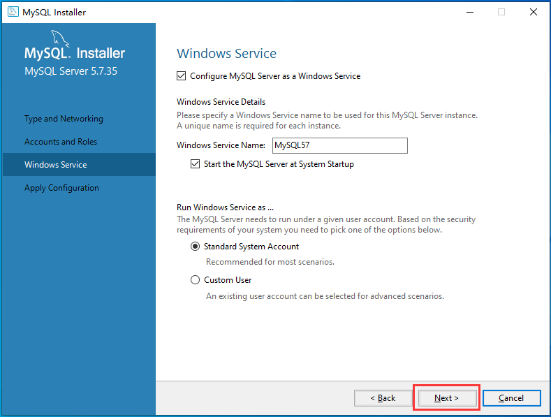

#### 2.4.4 让配置生效

这一步可能会花费一点时间，**一定要耐心等待**。

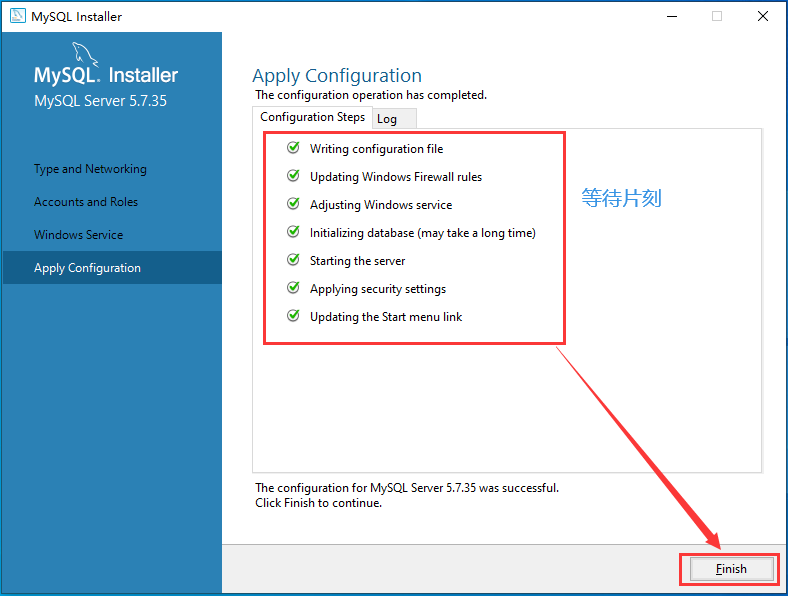

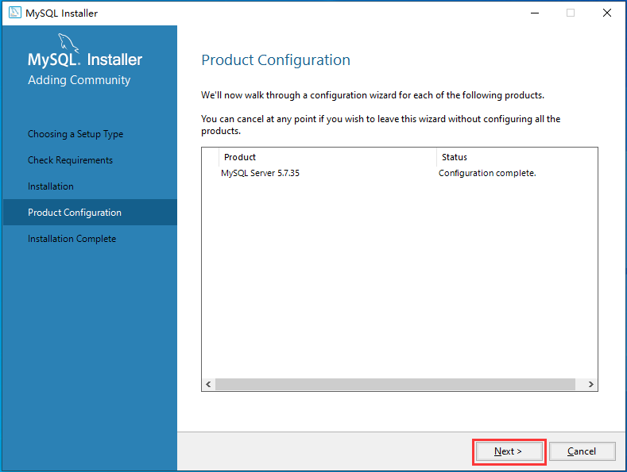

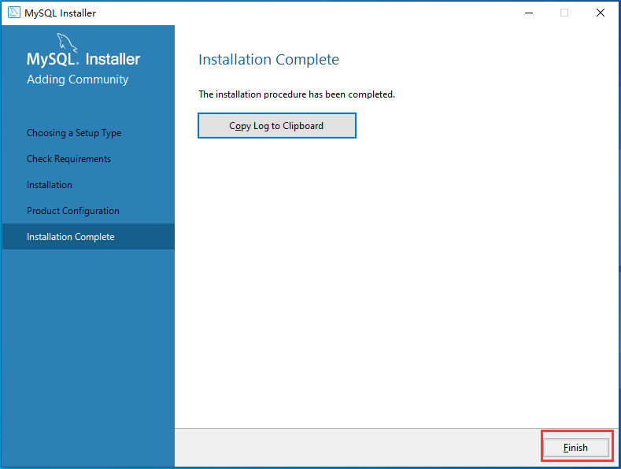

### 2.5 验证是否安装成功

**开始 --> MySQL --> MySQL 5.7 Command Line Client - Unicode**

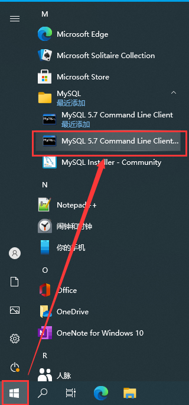

提示输入密码，输入密码后出现如下界面，说明 MySQL 安装并配置成功。

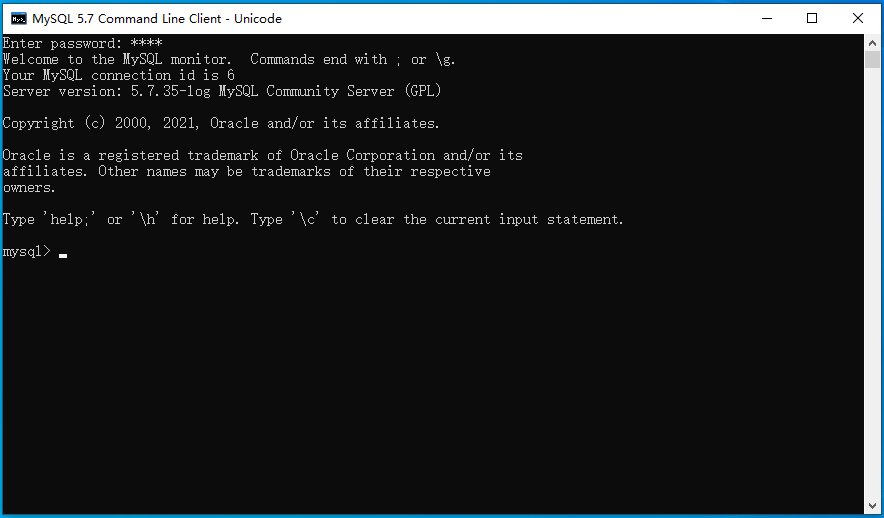

## 3. 卸载

### 3.1 运行 MySQL 安装工具

**开始 --> MySQL --> MySQL Installer - Community**

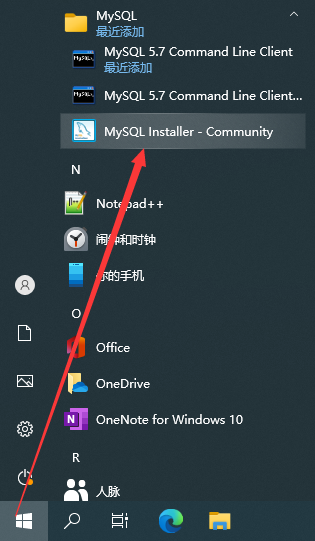

### 3.2 卸载及清理

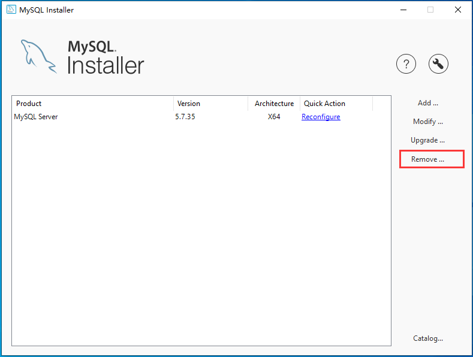

这里直接勾选 Product，会卸载安装的所有 MySQL 组件。

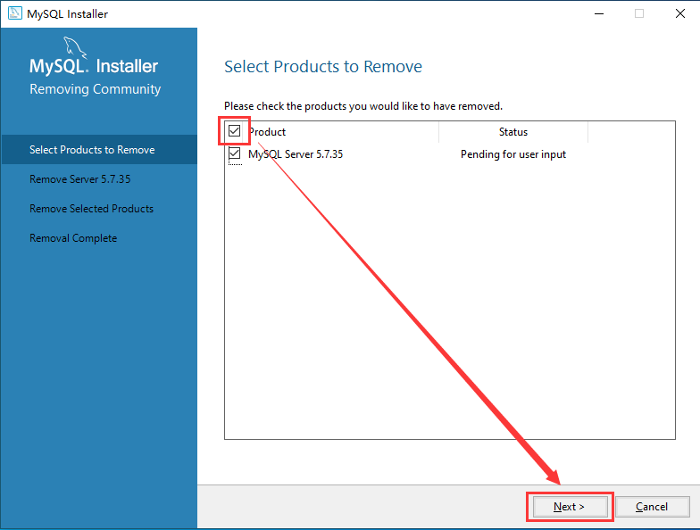

勾选 Remove the data directory，卸载完成后会连同 MySQL 存放数据的文件夹一并删除。

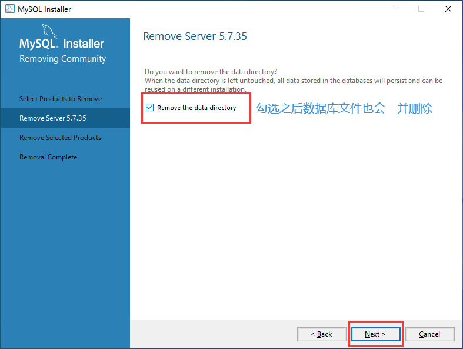

选择 Yes，uninstall MySQL Installer 会同时卸载 MySQL 安装工具。

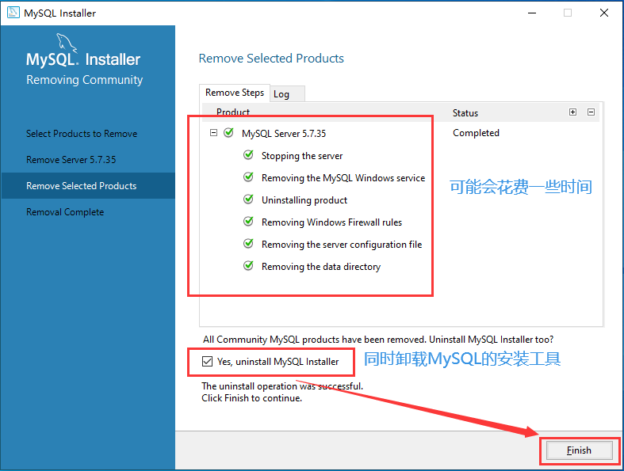

### 3.3 卸载之后的检查工作

按照上面的步骤卸载之后，应该能够完全卸载 MySQL 5.7。为了保险起见，还是要检查一下，确保 MySQL 5.7 已经完全卸载，从而不会对下次安装产生影响。要确保满足下面三个条件：

1. 服务中没有 MySQL57 这个服务；
2. C 盘下 Program Files 和 Program Files (x86) 两个文件夹下都没有 MySQL 文件夹；
3. C 盘下 ProgramData 文件夹下没有 MySQL 文件夹。

如果 MySQL57 服务还在，**以管理员身份打开命令行窗口**，运行如下命令删除 MySQL57 服务：

```powershell
sc delete MySQL57
```

## 4. 配置环境变量

配置环境变量的目的：在任意文件夹都可以运行 mysql 命令。

### 4.1 配置

与安装 JDK 配置环境变量类似：

- 新建环境变量 `MYSQL_HOME`，值为 `C:\Program Files\MySQL\MySQL Server 5.7`；
- 在 Path 环境变量中新增 `%MYSQL_HOME%\bin`。

### 4.2 验证

打开命令行窗口，运行如下命令：

```text
mysql -u root -p
Enter password: ****
Welcome to the MySQL monitor.  Commands end with ; or \g.
Your MySQL connection id is 8
Server version: 5.7.35-log MySQL Community Server (GPL)

Copyright (c) 2000, 2021, Oracle and/or its affiliates.

Oracle is a registered trademark of Oracle Corporation and/or its
affiliates. Other names may be trademarks of their respective
owners.

Type 'help;' or '\h' for help. Type '\c' to clear the current input statement.

mysql>
```

这样我们就可以使用命令行在任意位置使用 MySQL 了。

## 5. 目录结构

安装目录位置：`C:\Program Files\MySQL\MySQL Server 5.7`

| 文件夹名称 | 内容 |
| --- | --- |
| bin | 命令文件 |
| lib | 库文件 |
| include | 头文件 |
| share | 字符集、语言等信息 |

## 6. MySQL配置文件

配置文件位置：`C:\ProgramData\MySQL\MySQL Server 5.7\my.ini`

| 参数 | 描述 |
| --- | --- |
| default-character-set | 客户端默认字符集 |
| character-set-server | 服务器端默认字符集 |
| port | 客户端和服务器端的端口号 |
| default-storage-engine | MySQL 默认存储引擎 INNODB |

### 6.1 MySQL字符编码设置

旧版 MySQL 对中文的支持不够完善，通过以下命令可以查看 MySQL 的字符集：

```sql
mysql> show variables like 'character_set%';
+--------------------------+---------------------------------------------------------+
| Variable_name            | Value                                                   |
+--------------------------+---------------------------------------------------------+
| character_set_client     | utf8                                                    |
| character_set_connection | utf8                                                    |
| character_set_database   | latin1                                                  |
| character_set_filesystem | binary                                                  |
| character_set_results    | utf8                                                    |
| character_set_server     | latin1                                                  |
| character_set_system     | utf8                                                    |
| character_sets_dir       | C:\Program Files\MySQL\MySQL Server 5.7\share\charsets\ |
+--------------------------+---------------------------------------------------------+
8 rows in set, 1 warning (0.00 sec)
```

为了让 MySQL 支持中文，**需要把字符集改成 UTF-8，为此我们需要修改 my.ini 文件**：

```properties
[mysql]
# 添加如下的内容
default-character-set=utf8mb4

[mysqld]
# 添加如下的内容
character-set-server=utf8mb4
```

> [!WARNING]
> utf8mb4 不是 utf-8，是在相应区域增加内容，而不是覆盖。

### 6.2 重启MySQL服务

操作路径：任务栏 --> 右键 --> 任务管理器 --> 服务 --> MySQL57 --> 右键 --> 重新启动。

### 6.3 查看当前字符编码

```sql
mysql> show variables like 'character_set%';

+--------------------------+---------------------------------------------------------+
| Variable_name            | Value                                                   |
+--------------------------+---------------------------------------------------------+
| character_set_client     | utf8mb4                                                 |
| character_set_connection | utf8mb4                                                 |
| character_set_database   | utf8mb4                                                 |
| character_set_filesystem | binary                                                  |
| character_set_results    | utf8mb4                                                 |
| character_set_server     | utf8mb4                                                 |
| character_set_system     | utf8                                                    |
| character_sets_dir       | C:\Program Files\MySQL\MySQL Server 5.7\share\charsets\ |
+--------------------------+---------------------------------------------------------+
8 rows in set, 1 warning (0.00 sec)

mysql>
```

出现上述内容，证明修改 MySQL 字符编码成功。
