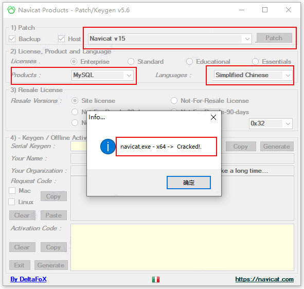
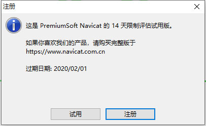
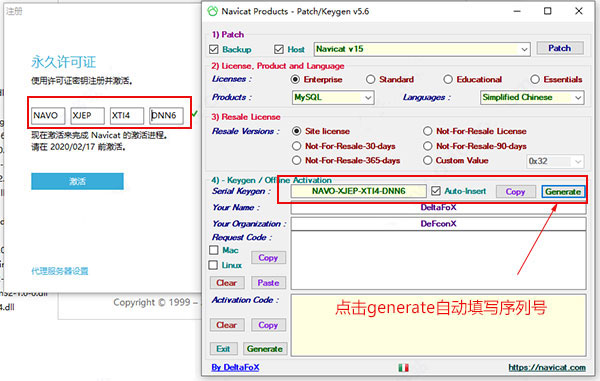
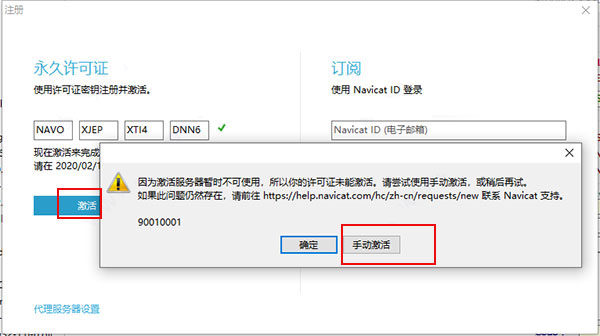
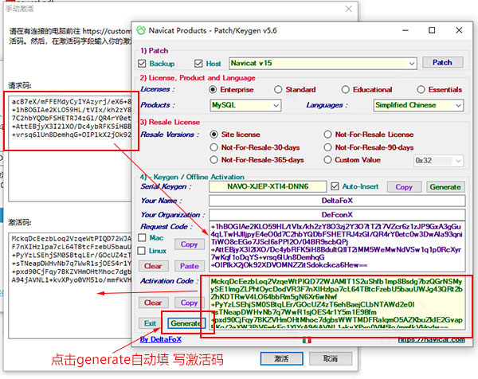

# MySQL客户端工具

多数时候直接使用 SQL 语句对数据库进行操作并不是很方便，特别是在查询操作时，显示的内容不够直观。此时需要借助图形化工具对数据库进行操作。

操作 MySQL 常用的图形化工具如下：

- Navicat for MySQL；
- SQLyog。

## 1. Navicat for MySQL

Navicat 是一套快速、可靠的数据库管理工具，专为简化数据库的管理及降低系统管理成本而设计。它的设计符合数据库管理员、开发人员及中小企业的需要。Navicat 以直觉化的图形用户界面构建，让你可以以安全且简单的方式创建、组织、访问并共用信息。

Navicat 可以用来对本机或远程的 MySQL、SQL Server、SQLite、Oracle 及 PostgreSQL 数据库进行管理和开发。其中 **Navicat for MySQL** 是一套专为 MySQL 设计的高性能数据库管理及开发工具。

### 1.1 安装

傻瓜式安装，一直点击下一步即可。

### 1.2 激活

1. Navicat 安装完毕后**先不要打开**，断开网络，将激活工具复制到 Navicat 安装路径下，**以管理员身份运行**；
2. 在弹出界面选择 Navicat 15 Products 选择 MySQL，Languages 选择 Simplified Chinese，点击 Patch；



3. 打开 Navicat，点击注册；



4. 返回到激活工具界面，点击 Generate 会自动填写注册码到软件输入框；



5. 再点击激活按钮，点击手动激活；



6. 将请求码复制到激活工具的文本框中，点击 Generate 激活码会自动填写到 Navicat 激活码文本框中，点击激活即可。



## 2. SQLyog

SQLyog 是一个快速而简洁的图形化管理 MySQL 数据库的工具，它能够在任何地点有效地管理你的数据库，由业界知名的 Webyog 公司出品。使用 SQLyog 可以快速直观地让你从世界的任何角落通过网络来维护远端的 MySQL 数据库。

### 2.1 安装

傻瓜式安装，一直点击下一步即可。

### 2.2 激活

首次打开会提示注册，姓名及序列号如下：

```text
Name:cr173
Code:8d8120df-a5c3-4989-8f47-5afc79c56e7c

Name:cr173
Code:59adfdfe-bcb0-4762-8267-d7fccf16beda

Name:cr173
Code:ec38d297-0543-4679-b098-4baadf91f983
```
