# Git

本篇整理 Git 的简介、安装与全局配置、工作区架构、基本操作、远程仓库（push / clone / pull 与冲突解决）、分支操作，以及在 IDEA 中使用 Git 与多人协同开发的流程。

## 1. Git 简介

官网：<https://git-scm.com/>

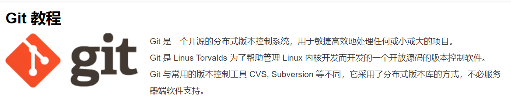

Git 是一个用于**项目版本管理**与**多人协同开发**的工具。

### 1.1 项目版本管理

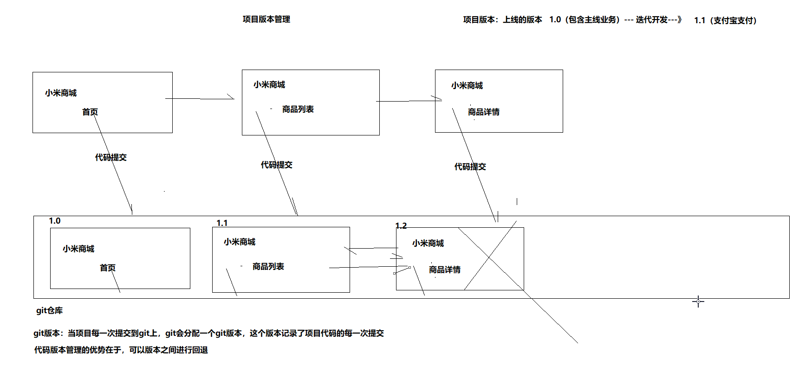

### 1.2 多人协同开发

一个团队开发一个项目：

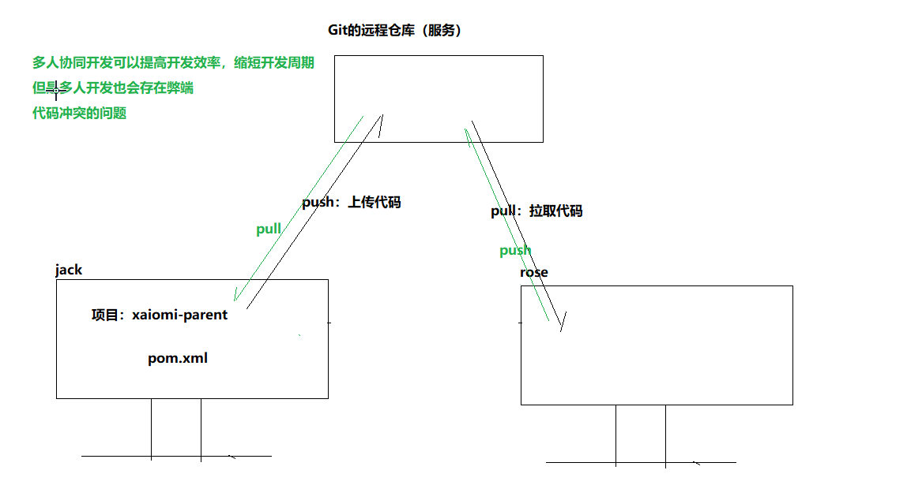

## 2. Git 安装

### 2.1 下载

下载地址：<https://git-scm.com/downloads>

### 2.2 安装

指定一个安装目录，然后一路 `Next` 即可。

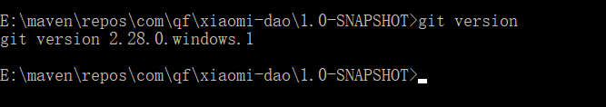

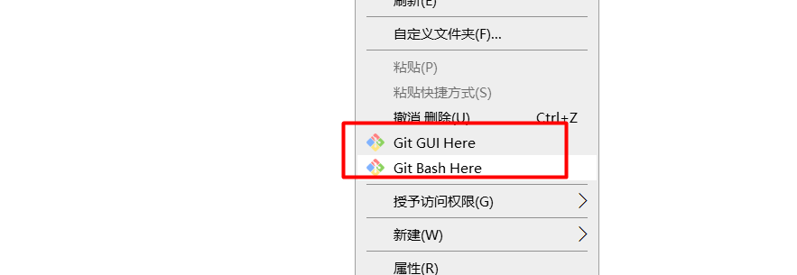

### 2.3 全局配置

安装完成后需要「自报家门」，配置用户名和邮箱：

```shell
git config --global user.name "Nie hao"  #用户名
git config --global user.email "980380046@qq.com"  #邮箱
# 查看信息
git config -l
```

## 3. Git 架构

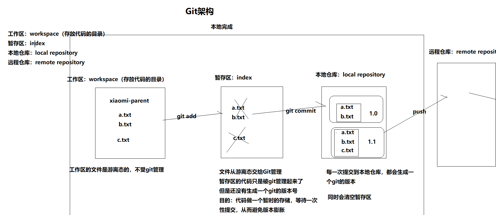

## 4. Git 基本操作

**第一步：创建工作区**

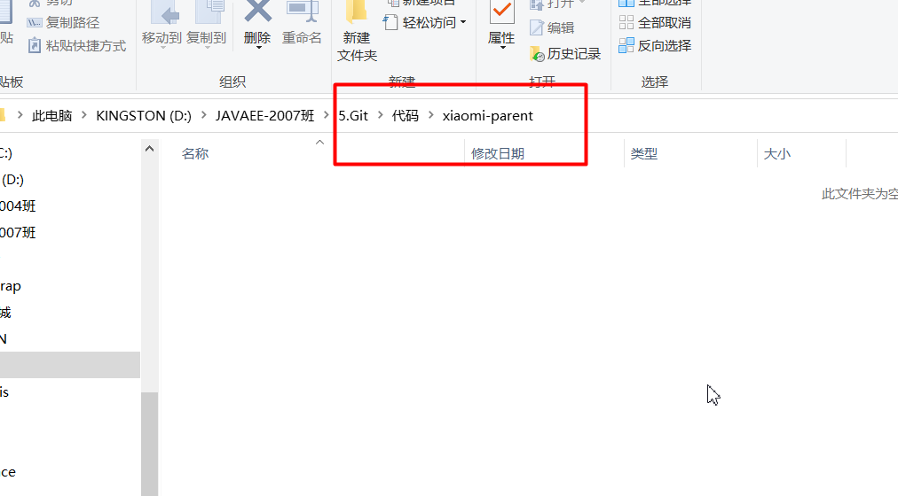

**第二步：初始化 git，生成本地仓库和暂存区**

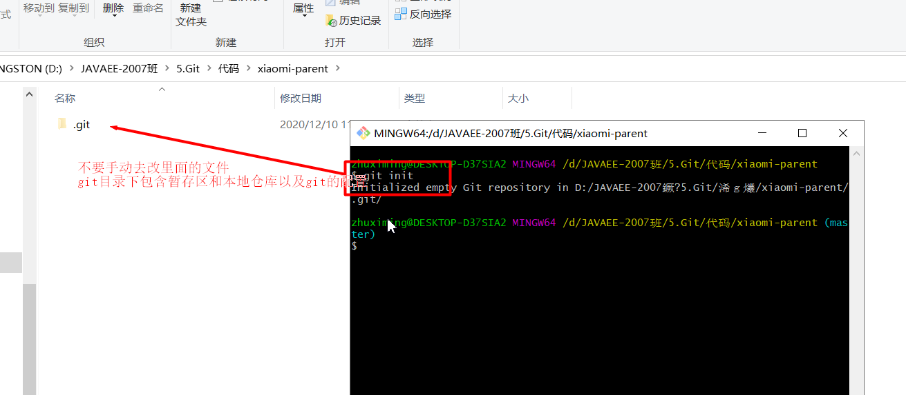

**第三步：代码编写**

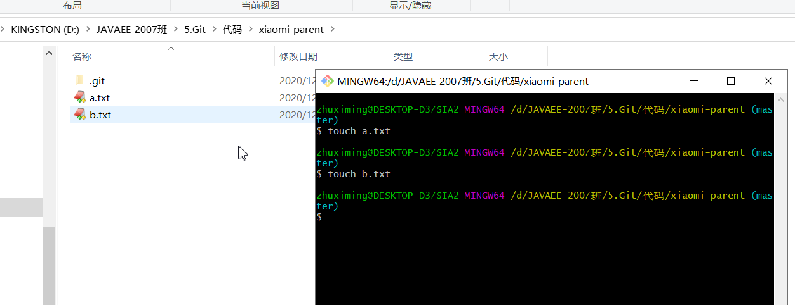

**第四步：将文件提交到暂存区，暂时存储**

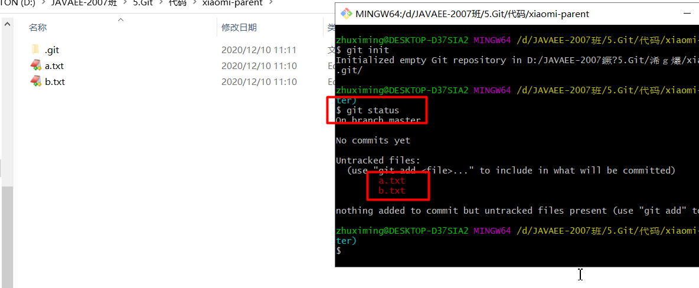

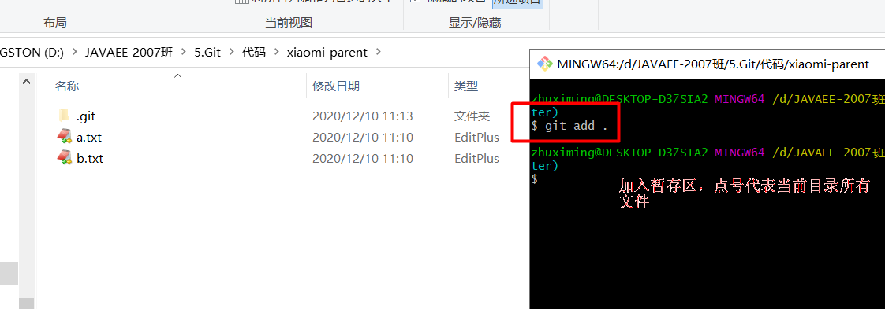

**第五步：将暂存区的代码提交到本地仓库，生成一个 git 版本**

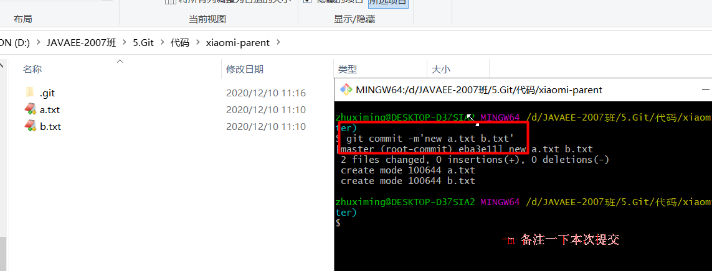

查看提交日志使用 `git log`：

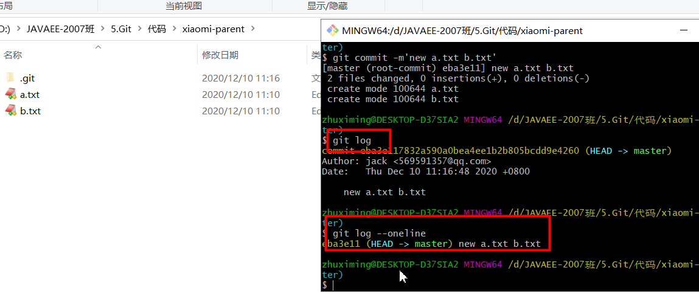

版本切换使用 `git checkout 版本号`：

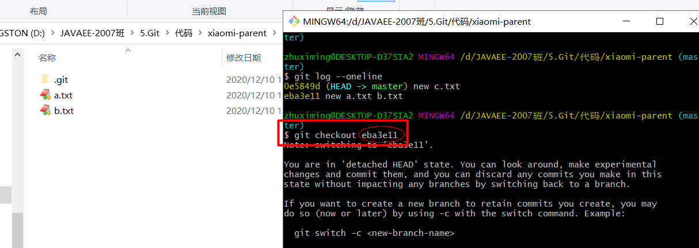

常用命令汇总：

| 序号 | 命令 | 说明 |
| --- | --- | --- |
| 1 | `git init` | 出现 `.git` 的文件夹，即创建本地仓库 |
| 2 | `git status` | 查看状态 |
| 3 | `git add .` | 加入暂存区；`.` 表示添加所有文件，也可以使用具体文件名指定添加 |
| 4 | `git commit -m "msg"` | 提交到本地仓库，并附带提示信息 |
| 5 | `git log --oneline` | 查看日志（简短形式，会显示版本编号） |
| 6 | `git checkout 版本编号` | 切换到指定版本 |
| 7 | `git push https://gitee.com/shine-niehao/fengming-mall.git master:master` | 推送到远程仓库 |

下面是一次完整操作的命令行演示（上传到 gitee，用户名：shine-niehao）：

> [!WARNING]
> 历史笔记中曾记录过明文账号密码，出于安全考虑本文不再保留。请勿在文章或代码仓库中存放明文密码，若已泄露应尽快修改。

```text
Administrator@WIN-4MJM4MGJBAT MINGW64 /d/gittest
$ touch a.txt

Administrator@WIN-4MJM4MGJBAT MINGW64 /d/gittest
$ touch b.txt

Administrator@WIN-4MJM4MGJBAT MINGW64 /d/gittest
$ git init
Initialized empty Git repository in D:/gittest/.git/

$ git add .

Administrator@WIN-4MJM4MGJBAT MINGW64 /d/gittest (master)
$ git status
On branch master

No commits yet

Changes to be committed:
  (use "git rm --cached <file>..." to unstage)
        new file:   a.txt
        new file:   b.txt

Administrator@WIN-4MJM4MGJBAT MINGW64 /d/gittest (master)
$ git commit -m "first commit"

*** Please tell me who you are.

Run

  git config --global user.email "you@example.com"
  git config --global user.name "Your Name"

to set your account's default identity.
Omit --global to set the identity only in this repository.

fatal: unable to auto-detect email address (got 'Administrator@WIN-4MJM4MGJBAT.(none)')

Administrator@WIN-4MJM4MGJBAT MINGW64 /d/gittest (master)
$ git config --global user.name "Nie hao"  #用户名

Administrator@WIN-4MJM4MGJBAT MINGW64 /d/gittest (master)
$ git config --global user.email "980380046@qq.com"  #邮箱

Administrator@WIN-4MJM4MGJBAT MINGW64 /d/gittest (master)
$ git commit -m "first commit"
[master (root-commit) 9ad319e] first commit
 2 files changed, 0 insertions(+), 0 deletions(-)
 create mode 100644 a.txt
 create mode 100644 b.txt

Administrator@WIN-4MJM4MGJBAT MINGW64 /d/gittest (master)
$ git log --oneline
9ad319e (HEAD -> master) first commit

Administrator@WIN-4MJM4MGJBAT MINGW64 /d/gittest (master)
$ touch c.txt

Administrator@WIN-4MJM4MGJBAT MINGW64 /d/gittest (master)
$ git add c.txt

Administrator@WIN-4MJM4MGJBAT MINGW64 /d/gittest (master)
$ git commit -m "second commit"
[master 69dec08] second commit
 1 file changed, 0 insertions(+), 0 deletions(-)
 create mode 100644 c.txt

Administrator@WIN-4MJM4MGJBAT MINGW64 /d/gittest (master)
$ git log --oneline
69dec08 (HEAD -> master) second commit
9ad319e first commit

Administrator@WIN-4MJM4MGJBAT MINGW64 /d/gittest (master)
$ git checkout 9ad319e
Note: switching to '9ad319e'.

You are in 'detached HEAD' state. You can look around, make experimental
changes and commit them, and you can discard any commits you make in this
state without impacting any branches by switching back to a branch.

If you want to create a new branch to retain commits you create, you may
do so (now or later) by using -c with the switch command. Example:

  git switch -c <new-branch-name>

Or undo this operation with:

  git switch -

Turn off this advice by setting config variable advice.detachedHead to false

HEAD is now at 9ad319e first commit

Administrator@WIN-4MJM4MGJBAT MINGW64 /d/gittest ((9ad319e...))
$ git checkout 69dec08
Previous HEAD position was 9ad319e first commit
HEAD is now at 69dec08 second commit

Administrator@WIN-4MJM4MGJBAT MINGW64 /d/gittest ((69dec08...))
$
```

## 5. Git 远程仓库

### 5.1 远程仓库选择

| 选择 | 平台 | 说明 |
| --- | --- | --- |
| 选择一 | GitHub（<https://github.com/>） | 国内访问较慢 |
| 选择二 | 码云（<https://gitee.com/>） | 国内访问快，【优选】 |
| 选择三 | 使用 GitLab 搭建自己的远程仓库 | 企业开发首选（运维篇） |

### 5.2 在码云上创建远程仓库

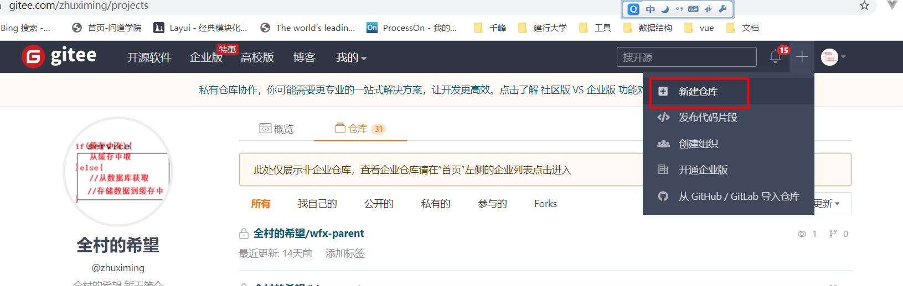

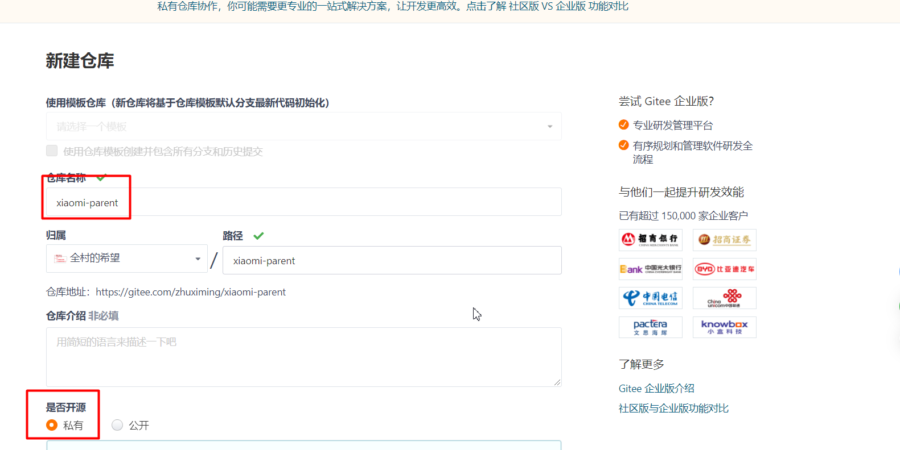

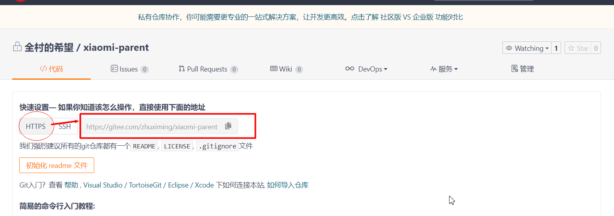

### 5.3 远程仓库操作

push：将本地仓库代码推送到远程仓库：

```shell
git push https://gitee.com/zhuximing/xiaomi-parent.git master:master
```

其中第一个 `master` 是本地仓库的 master 分支，第二个 `master` 是远程仓库的 master 分支。

> [!TIP]
> 注意方向：`push` 的分支格式是「本地分支:远程分支」，而 `pull` 是「远程分支:本地分支」，两者正好相反，这是初学者最容易混淆的地方。

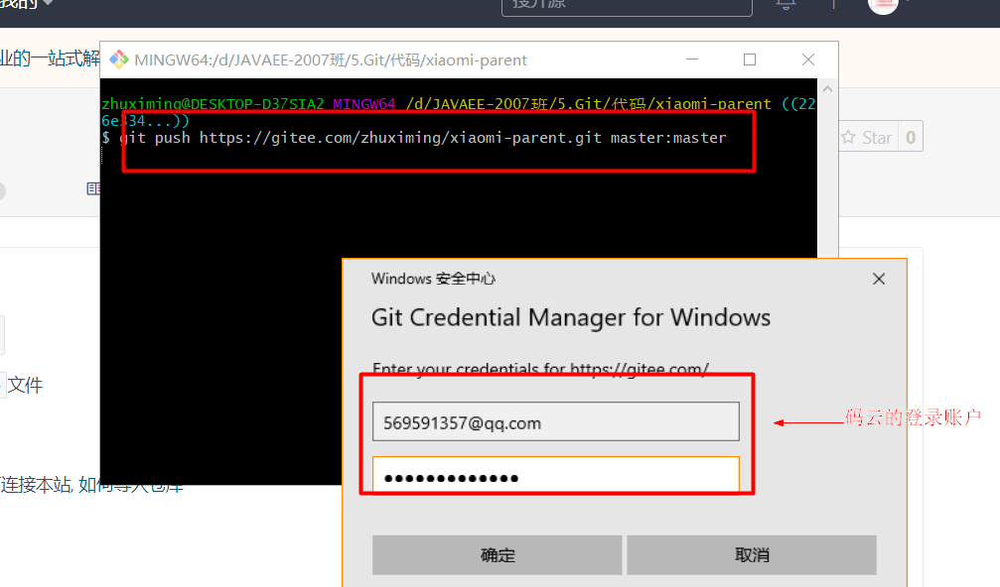

#### 5.3.1 关联远程仓库

使用 `git remote add origin url` 关联远程仓库：

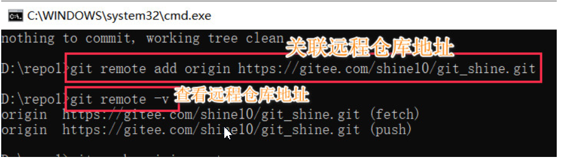

#### 5.3.2 推送文件到远程仓库

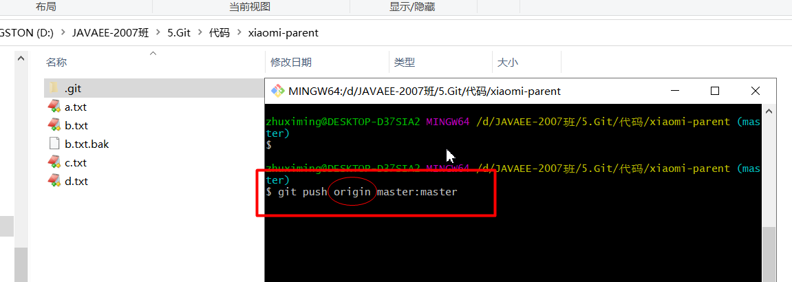

#### 5.3.3 克隆远程仓库

将远程仓库的代码 clone 到本地：

```shell
git clone https://gitee.com/zhuximing/xiaomi-parent.git -b master
```

- `-b` 表示指定远程仓库的某个分支进行克隆；
- clone 只需要执行一遍。

#### 5.3.4 拉取远程仓库代码

```shell
git pull origin master:master
```

其中第一个 `master` 是远程仓库的 master 分支，第二个 `master` 是本地仓库的分支。

#### 5.3.5 Windows 缓存 gitee 的账户（密码写错修改措施）

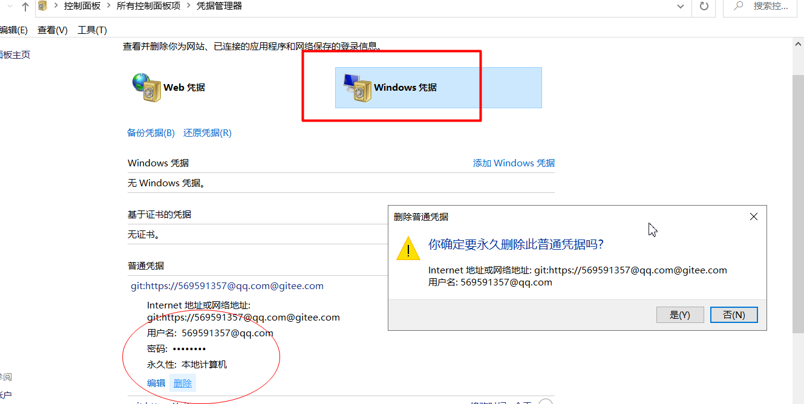

#### 5.3.6 多人协作代码冲突

演示冲突的过程：

1. jack 前进一步；
2. rose 也前进一步；
3. jack push 代码到远程仓库；
4. rose push 代码到远程仓库，rose 提示需要先 pull；
5. rose pull 代码报错【reject】。

此时涉及到三方合并【jack 本地、rose 本地、jack 和 rose 前一个共同的版本】。三方合并的思路如下：

1. `git fetch origin`：将远程的 `.git` 信息下载到本地；
2. `git merge origin/master`：将远程的 master 手动合并到本地的 master；
3. 合并报错【conflict 合并冲突】；
4. 人工解决【协商最终的结果】；
5. 将合并的结果 push 到远程仓库；
6. 另一方将解决的结果 pull 下来。

到此冲突解决完毕。

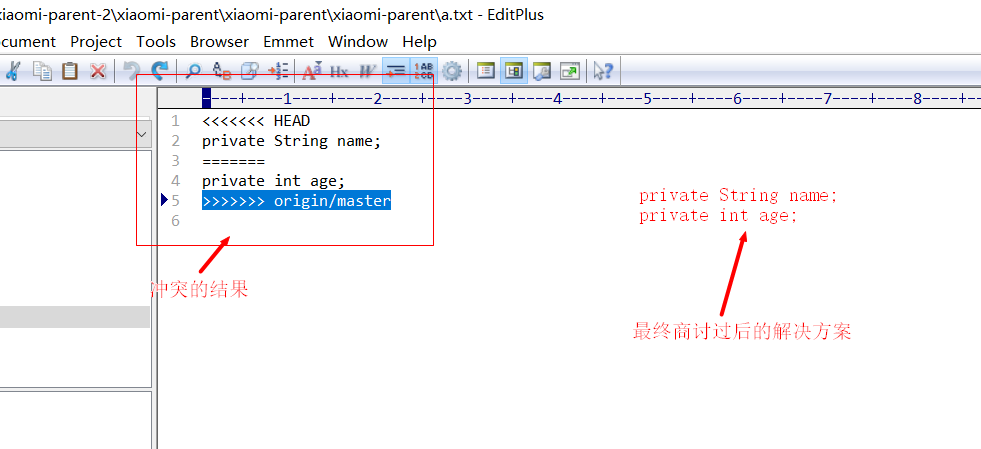

## 6. Git 分支

### 6.1 为什么要有分支

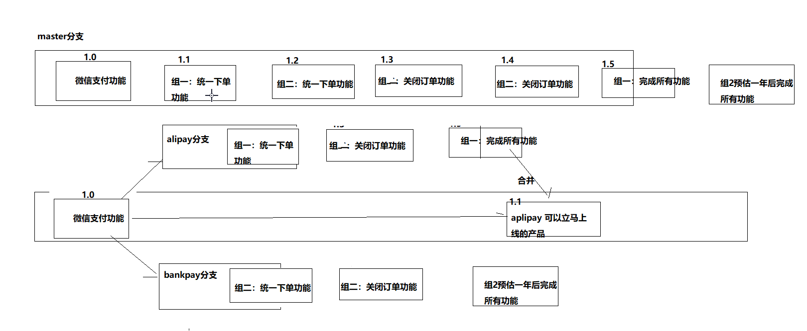

### 6.2 查看分支

- `git branch`：查看本地的分支；
- `git branch -r`：查看远程的分支。

### 6.3 基于 master 创建分支（bankpay）

创建分支：

```shell
git branch 分支名称
```

### 6.4 分支切换命令

```shell
git checkout 分支名称
```

### 6.5 将 bankpay 分支推到远程协同开发

```shell
git push origin bankpay:bankpay
```

其中第一个 `bankpay` 是本地仓库分支，第二个 `bankpay` 是远程仓库的分支；如果远程仓库没有该分支，会自动创建该分支。

### 6.6 将 bankpay 分支合并到 master

1. 切换到 master 分支：`git checkout master`；
2. 合并（bankpay → master），在本地完成合并：`git merge bankpay`；
3. push 到远程仓库 master 分支：`git push origin master:master`。

## 7. IDEA 中使用 Git

### 7.1 关联 Git

通过 `File > Settings` 关联，过程是自动的。

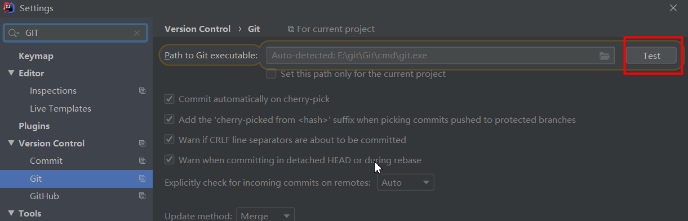

### 7.2 创建本地仓库

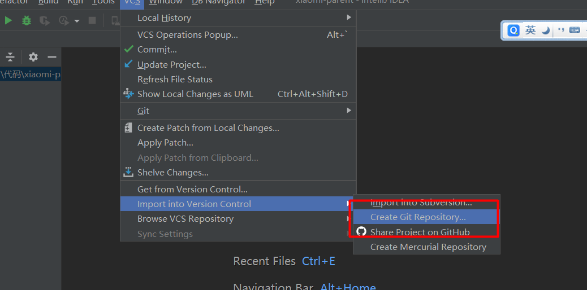

或者：

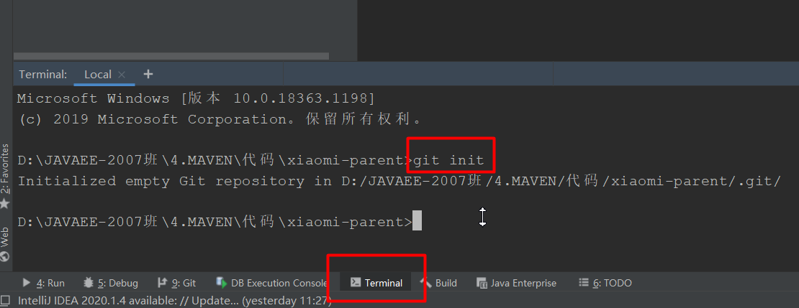

- 新建项目后，在项目目录下创建为 git 仓库；
- 注意：要在建仓库前，设置忽略文件 `.gitignore`。
  - 作用：被忽略的文件会被版本记录忽略，版本中不包含它们，比如 `.idea` 目录、`*.iml`、`target`；
  - 范围：不需要和其他开发共享的文件，具体见下图。

忽略文件或目录：如果文件或目录加入了忽略列表，那么在 `add` 以及 `commit` 时该文件或目录会被直接忽略。

第一步：下载插件。

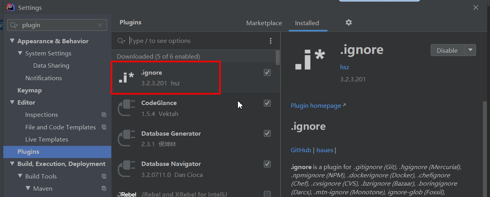

第二步：使用插件，协助创建 `.gitignore` 文件。

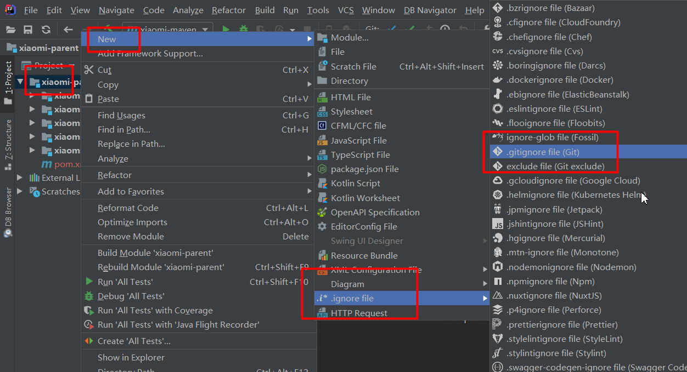

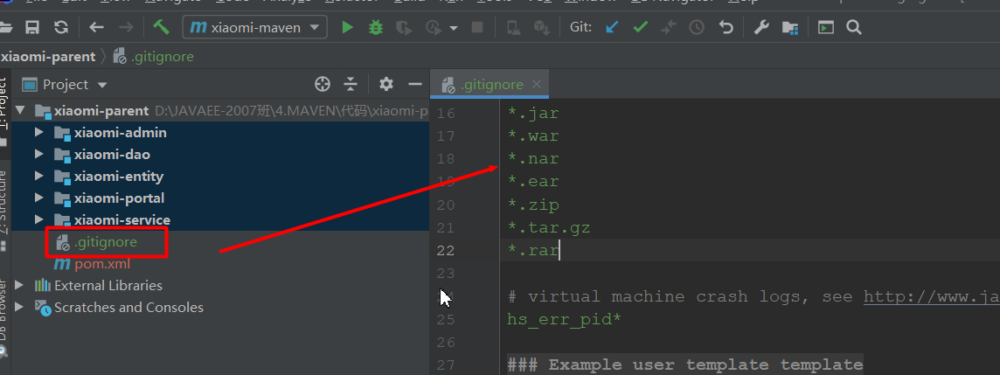

### 7.3 提交到本地仓库

创建好仓库后，做第一次提交。

### 7.4 push 到远程仓库

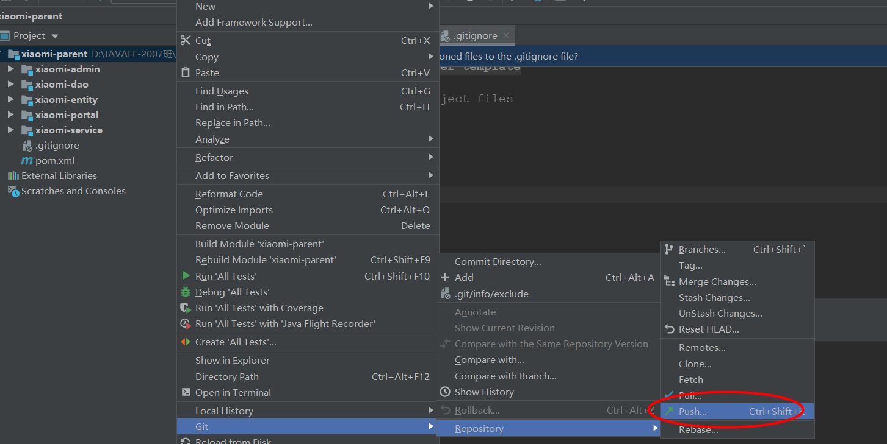

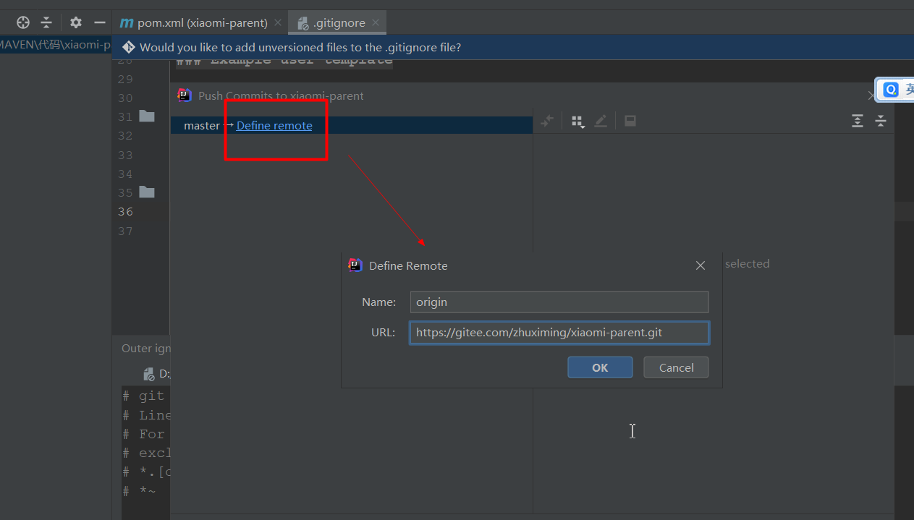

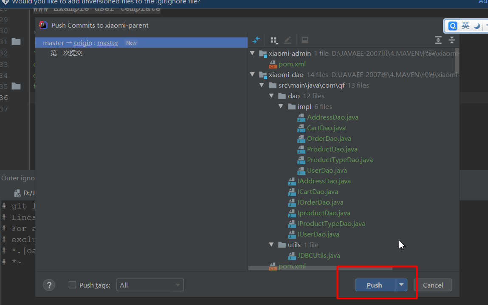

### 7.5 克隆

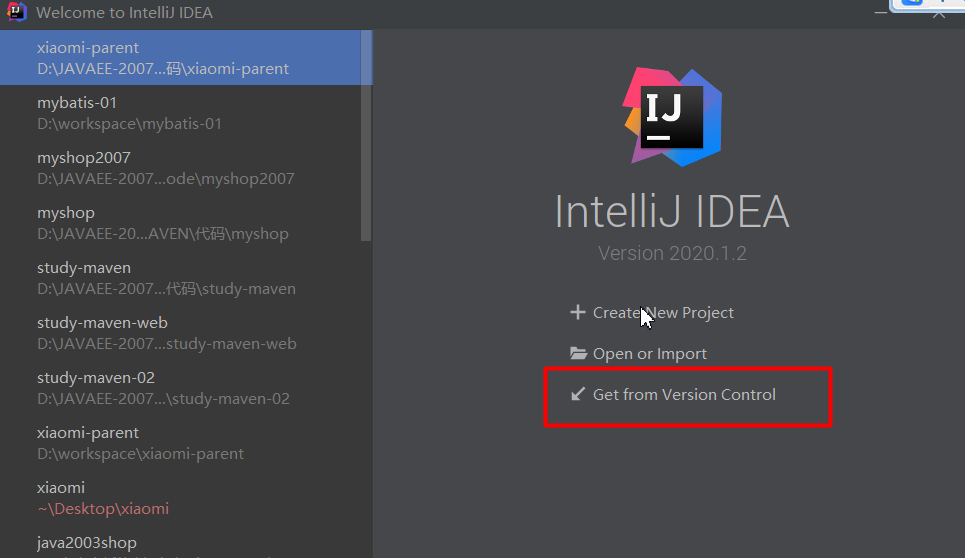

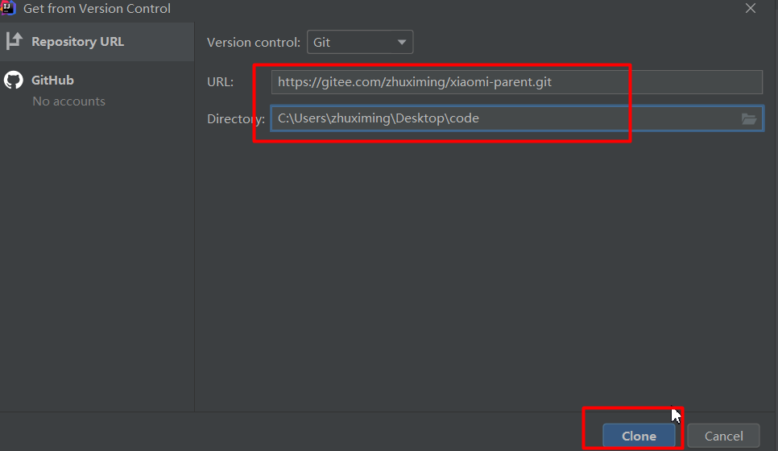

### 7.6 协同开发

### 7.7 冲突演示和解决

### 7.8 分支操作

#### 7.8.1 查看分支

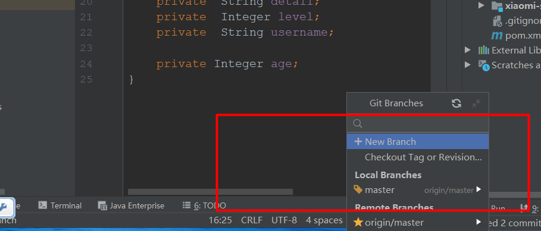

#### 7.8.2 新建分支

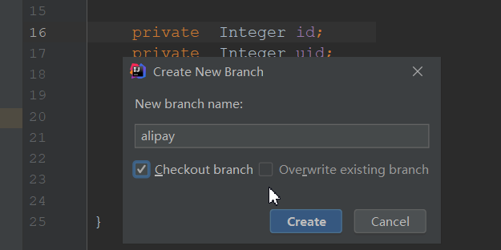

#### 7.8.3 上传分支到远程仓库

#### 7.8.4 分支合并

#### 7.8.5 合并结果 push 到远程

## 8. 多人协同开发

多人开发协同的 git 操作流程如下。

### 8.1 项目管理员（项目经理）

1. 由管理员负责创建一个远程库，初始的库中什么也没有，为裸库。库的名称建议和项目同名；
2. 管理员在 IDEA 中创建一个初始项目，其中包含 `.gitignore` 文件；
3. 管理员将本地库上传到远程库，同时创建一个 dev 分支；
4. 将其他开发人员拉入远程库的「开发成员列表」中，使得其他开发人员可以访问该远程库；
5. master 分支设置为「protected 分支」，只有管理员有权限将代码合并到其中；dev 分支设置为「常规分支」，所有开发人员都可以向其中合并代码。

流程如下：

进入分支设置：

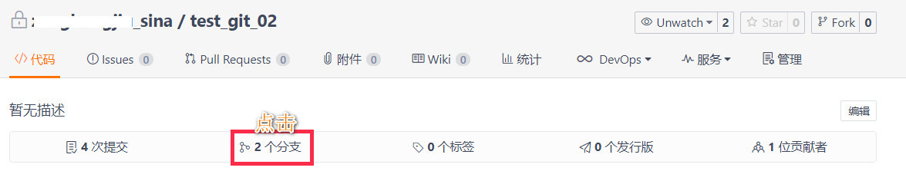

设置保护分支，让 master 分支不能被随意更改：

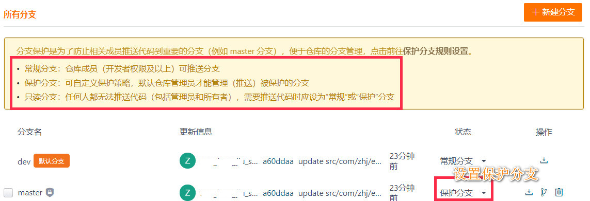

### 8.2 开发人员

- 初始化：在 IDEA 中 clone 远程库，获得项目，同时会建立本地库；
- 后续的开发中，都要在 dev 分支上进行。开发完一个功能并测试通过后，commit 提交到本地的 dev 分支，然后 push 到远程 dev 分支；
- 需要更新项目内容时，通过 pull 从远程仓库拉取内容；
- 注意：多人协同时，每次在 push 到远程库前，都先做一次 pull，一来是把远程最新内容合并到本地，二来是核实本地内容是否和远程内容有冲突；
- 后续的开发，会接到一个个的功能任务，往复执行上述提交、推送、拉取操作即可。
