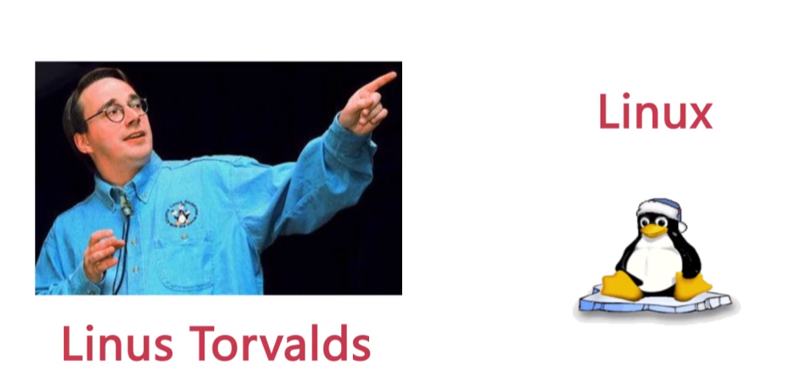
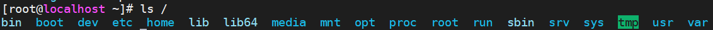
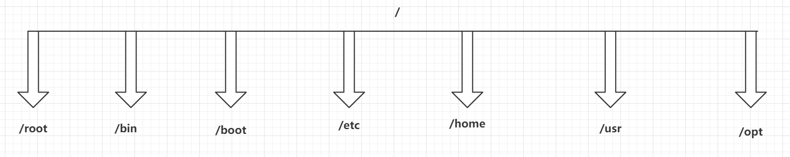
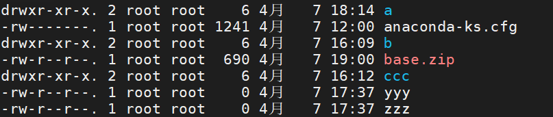

# Linux_简介及常用命令

本篇从开发环境切入，介绍 Linux 的由来与版本、目录结构，以及目录、文件、压缩解压、用户与用户组、文件权限等常用命令。

## 1. 引言

### 1.1 开发环境

平时大家大多是在 Windows 或者 Mac 操作系统下编写代码进行开发，并在开发环境中安装大量的软件，这样会导致环境的稳定性和安全性降低。

### 1.2 生产环境

程序运行在此环境中，供用户使用。这个环境由专业人员维护，一般人没有权限操作生产环境。

### 1.3 测试环境

一般克隆一份生产环境，并将开发环境中的程序部署到测试环境中。这个环境的主要目的是对程序进行检测，收集程序中的各种问题，并交给开发人员修改。

### 1.4 操作系统的选择

生产环境中常用的操作系统有 Windows Server、Linux、Unix 等。Linux 操作系统以**稳定、可靠、免费**的特点占据了大量的市场份额，成为全球使用最多的服务器操作系统。

Linux 操作系统现在已经成为后台开发人员的必备技能，并且后期学习的各种知识都会涉及到 Linux 操作系统。

## 2. Linux 介绍

### 2.1 Linux 的由来

在 Linux 操作系统出现之前，还有一个操作系统叫做 Minix。Minix 是由 Andrew S. Tanenbaum 教授研发出来的：当时教授为了给学生上课，买了一套 Unix 操作系统，参考 Unix 自己写了一个操作系统，并命名为 Minix，同时将其开源，供学校内部的研究和教学使用。到了 2000 年，Andrew 将 Minix 操作系统完全对外开源。

Minix 完全对外开源之后，在互联网上迅速传播。但大家在使用时发现 Minix 并不完美，内部存在各种各样的问题。用户将问题解决后会编写一个补丁，以邮件的方式发给 Andrew，而 Andrew 教授最初的目的只是为了教学和研究。

与此同时，一位芬兰的大学生出现了，他叫 Linus。Linus 在 Minix 操作系统的基础上自己添加了一些补丁和插件，并将其命名为 Linux 操作系统，完全对外开源，并且开始维护 Linux。



### 2.2 Linux 的版本

Linux 的版本分为两种：一种是 Linus 团队正在维护的**开源内核版本**，另一种是一些厂商基于内核版本封装的**发行版本**。

- Linux 的内核版本官网：<https://www.kernel.org/>；
- Linux 的发行版本：我们需要学习的发行版本就是 CentOS。


### 2.3 Linux 和 Windows 的区别

| 对比项 | 说明 |
| --- | --- |
| 大小写 | Linux 严格区分大小写 |
| 设计哲学 | Linux 中一切皆是文件 |
| 文件后缀 | Linux 中文件没有后缀，但存在一些约定俗成的后缀 |
| 软件兼容 | Windows 下的软件一般无法直接在 Linux 中运行 |

> [!TIP]
> 学习 Linux 时，可以参考 Windows 下的操作思路：Windows 下做了什么，就在 Linux 中做什么。

## 3. Linux 安装

- 安装 Linux 需要一个虚拟机软件来提供虚拟环境：VMware 或 Virtual Box（本文采用 VMware），下载地址：<https://www.vmware.com/go/getworkstation-win>；
- 安装 Linux 需要一个 Linux 的镜像文件：CentOS 7 版本，下载地址：<http://mirrors.163.com/centos/7/isos/x86_64/CentOS-7-x86_64-Minimal-1908.iso>；
- 安装一个连接 Linux 的图形化界面：Xterm、SSH、XShell（本文采用 XShell）。

### 3.1 安装 VMware

参考安装教程。

### 3.2 安装 Xshell 和 Xftp

参考安装教程。

### 3.3 在 VMware 中安装 Linux

参考安装教程。

### 3.4 使用 Xshell 连接 Linux

参考安装教程。

## 4. Linux 的目录结构

Windows 的目录结构是带有盘符的（`C:`、`D:`、`E:`），而 Linux 中没有盘符。在 Xshell 中输入 `ls /` 可以查看 Linux 的顶级目录：



Linux 的常用目录及含义如下：



| 目录 | 说明 |
| --- | --- |
| **root** | 系统管理员的 HOME 目录 |
| bin | 存放经常使用的命令 |
| boot | 存放启动 Linux 时的一些核心文件 |
| **etc** | 存放系统管理所需要的配置文件和子目录 |
| **home** | 普通用户的 HOME 目录 |
| **usr** | 默认安装软件的目录，类似 Windows 中的 Program Files 目录 |
| opt | 主机额外安装软件的目录 |

## 5. Linux 的基本命令

Linux 中命令的基本格式为 **`命令 [选项] [参数]`**。需要注意，个别命令不遵循这个格式。当命令中有多个选项时，可以将选项写在一起，并且选项存在简写方式，如 `命令 -选项A选项B`。

下面这些基本操作命令不遵循上述格式，但后期会经常使用：

```sh
# 1. 我是谁
who am i

# 2. 我在哪
pwd

# 3. 查看 ip 地址
ip a    # 或 ip address
ifconfig

# 4. 清屏
clear

# 5. ping 域名 | ip
ping 地址

# 6. 强制停止
Ctrl + C
```

## 6. Linux 目录命令【重点】

### 6.1 列出目录

查看指定目录下的内容，默认查看当前目录下的内容。

Linux 中的隐藏文件以 `.` 开头，当前目录使用 `.` 表示，上一级目录使用 `..` 表示。

```sh
ls [-ald] [目录名]
# 目录名不填写，默认为当前目录。
# -a：列出的全部的文件，包括隐藏文件
# -l：列举出全部的信息
# -d：仅查看目录本身
# -h：以人们方便阅读的形式显示文件大小
```

### 6.2 切换目录

实现目录间切换，可以使用绝对路径、相对路径、特殊符号：

```sh
cd 具体路径 | 特殊符号
```

| 特殊符号 | 表达的路径 |
| --- | --- |
| `.` | 当前目录 |
| `..` | 上一级目录 |
| `/` | 根目录 |
| `~` | 当前登录用户的 HOME 目录 |
| `-` | 返回上一次所在的目录 |

### 6.3 创建目录

创建目录，以及创建多级目录：

```sh
mkdir [-p] 目录名
# -p：代表创建多级目录时，使用
```

### 6.4 删除目录

删除空目录或包含内容的目录：

```sh
# 只能删除空目录
rmdir 目录名

# 删除非空目录
rm [-rf] 目录名
# -r：代表递归删除目录下的全部内容
# -f：不询问，直接删除
```

### 6.5 复制目录

复制目录下的全部内容：

```sh
cp -r 来源目录 目标目录
# -r：递归复制全部内容，必填项
# 来源目录：被复制的目录
# 目标目录：复制到哪儿
```

### 6.6 移动、重命名目录

移动、重命名目录，会根据第二个参数指定具体的操作逻辑：

```sh
mv 目录名 新目录名 | 路径
# 如果第二个参数指定的路径不存在，就是重命名；如果第二个参数的路径存在，就是移动（剪切）
```

## 7. Linux 的文件命令【重点】

### 7.1 创建文件

创建空文件：

```sh
touch 文件名1 文件名2 ……
```

### 7.2 查看文件

根据不同的业务场景，可以选择不同的查看方式：

```sh
# 查看文件，直接展示到最后一行
cat 文件名

# 从最后一行开始查看文件内容，展示全部
tac 文件名

# 显示文件的同时，展示行号
nl 文件名

# 查看大文件时，可以一页一页地向下翻
# 按 space 向下翻页，退出时按 q
more 文件名

# 查看大文件时，可以任意地向上或者向下翻
# 向上或向下翻页按 PageUp 和 PageDown，一行一行查看按光标的 ↑↓
less 文件名

# 只查看前几行
head 文件名
head -n 行数 文件名

# 只查看后几行
tail 文件名
tail -n 行数 文件名
# 监控日志
tail -f 文件名
```

### 7.3 移动、重命名文件

移动、重命名文件，会根据第二个参数指定具体的操作逻辑：

```sh
# 如果第二个参数指定的路径不存在，就是重命名；如果第二个参数的路径存在，就是移动
mv 文件名 新文件名 | 路径
```

### 7.4 复制文件

复制文件到指定目录下：

```sh
cp 文件名 目录
```

### 7.5 删除文件

删除文件：

```sh
rm [-f] 文件名
# -f：是否询问
```

## 8. Linux 的压缩解压命令【重点】

### 8.1 针对 tar 命令

Linux 中常用的压缩包大多是 `.tar`、`.tar.gz`、`.tar.bz2` 格式的。

#### 8.1.1 解压压缩包

针对压缩包后缀的情况，采用不同的参数，否则可能会损坏文件：

```sh
tar [-zxvf] 压缩包名称 [-C 路径]
# -z： 通过gzip的支持进行压缩和解压缩，档案名最好为*.tar.gz
# -j： 通过bzip2的支持进行压缩和解压缩，档案名最好为*.tar.bz2
# -x： 代表解压
# -v： 解压时，打印详细信息
# -f： -f选项必须放在所有选项的最后，代表指定文件名称
# -C 路径： 代表将压缩包内容解压到指定路径
```

#### 8.1.2 打包成压缩包

可以将多个文件以及目录打包成压缩包，根据选择的参数指定压缩包格式：

```sh
tar [-zcvf] 压缩包名称 文件1 文件2 目录1 目录2 ...
# -c： 代表打包
# 其他参数同上
```

### 8.2 针对 zip 类型压缩包

Linux 不仅支持 tar 类型的压缩包，也支持 zip、rar 这种 Windows 下的压缩包，不过需要先安装对应的软件才能操作各种类型的压缩包。

#### 8.2.1 安装软件

```sh
yum -y install zip     # 打包程序
yum -y install unzip   # 解压程序
```

#### 8.2.2 解压以及打包

```sh
# 解压
unzip 压缩包名称

# 打包
zip 压缩包名称 文件1 文件2 目录1 目录2 ...
```

## 9. 用户与用户组的操作

### 9.1 用户的常用操作命令

Linux 是一个多用户的操作系统。任何一个用户想要操作 Linux 操作系统，必须先向系统管理员申请一个账号，并以这个账号的身份去操作 Linux。

用户的账号一方面可以帮助系统管理员追踪当前用户的操作，另一方面可以控制当前用户对系统资源的访问。

#### 9.1.1 用户的创建

```sh
useradd [-cgd] [选项指定的具体内容] 用户名
# -c：代表comment，给用户添加一段注释
# -g：代表group，可以修改用户的所在组
# -d：代表指定用户的HOME目录
```

#### 9.1.2 设置用户密码

```sh
passwd 用户名
```

#### 9.1.3 切换用户

```sh
su 用户名
# [root@localhost ~]#   -> root用户在本地登录，并且当前在~目录下，#代表是超级管理员
# [qf@localhost ~]$		-> qf用户在本地登录，并且当前在~目录下，$代表是普通用户
```

#### 9.1.4 删除用户

```sh
userdel [-r] 用户名
# -r： 代表删除用户的同时，删除该用户的HOME目录
```

#### 9.1.5 修改用户

```sh
usermod [-cgd] [选项指定的具体内容] 用户名
# -c：代表comment，给用户添加一段注释
# -g：代表group，可以修改用户的所在组
# -d：代表指定用户的HOME目录
```

### 9.2 用户组的操作

用户的身份除了用户本身，还会分配到指定的用户组，可以通过用户组对一些文件设置操作权限。

#### 9.2.1 创建用户组

```sh
groupadd 用户组名
```

#### 9.2.2 修改用户组

```sh
groupmod [-n] [选项指定的具体内容] 用户组名
# -n 修改用户组名称
```

#### 9.2.3 删除用户组

```sh
groupdel 用户组名
# 只能删除不存在用户的用户组
```

## 10. 文件权限的修改【重点】

首先我们要清楚 Linux 文件的权限信息。在 Linux 中输入 `ls -l` 或者 `ll` 可以查看文件和目录的详细信息：



实例中，`a` 目录的第一个属性用 `d` 标识，表示 `a` 是一个目录；`anaconda-ks.cfg` 的第一个属性用 `-` 标识，表示它是一个文件。

Linux 文件详情的中间属性需要分为三组查看：

- `rwx`：代表文件拥有者的权限；
- `rwx`：代表文件所属组用户的权限；
- `rwx`：代表其他用户对当前文件的操作权限。

其中每组权限字符的含义如下：

| 字符 | 含义 |
| --- | --- |
| `r` | read，读的权限 |
| `w` | write，写的权限 |
| `x` | execute，执行的权限 |

其余信息说明：

- 后续的第一个 `root`：代表当前文件的拥有者；
- 后续的第二个 `root`：代表当前文件的所属组；
- 再往后分别为文件的大小、最后修改时间等信息。

### 10.1 修改文件的权限

使用 `chmod` 对文件的权限进行修改，一种使用数字方式，一种使用符号方式：

- 数字方式方便操作，不过要整体修改权限信息；
- 符号方式更细粒度，不过操作麻烦。

#### 10.1.1 数字方式

```sh
chmod [-R] 777 文件|目录
# rwx在这三个权限中r：4，w：2，x：1
# -R： 当修改一个目录权限时，可以添加-R，将目录下的全部内容，都修改权限。
```

#### 10.1.2 符号方式

```sh
chmod [-R] a=rw 文件|目录
# user：u，group：g，other：o，all：a
# read：r，write：w，execute：x
# 赋予权限的方式 , 添加：+，减掉：-，设定：=
# -R： 当修改一个目录权限时，可以添加-R，将目录下的全部内容，都修改权限。
```

### 10.2 文件拥有者及所属组修改

`chown` 可以直接修改拥有者和所属组，`chgrp` 只能修改所属组：

```sh
# 修改文件的拥有者和所属组
chown [-R] 拥有者：所属组 文件|目录
# 修改文件的拥有者
chown [-R] 拥有者 文件|目录
# 修改文件的所属组
chgrp [-R] 所属组 文件|目录
```
