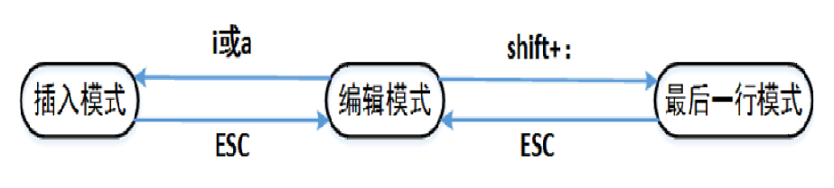

## 一、Vi/Vim简介

### 1.1、是什么

> 文本编辑器，类似于Windows下的记事本、notepad++。

### 1.2、用途

>编写代码
>
>编写文档
>
>记录简短信息

### 1.3、为什么要学习Vi/Vim

>Linux系统默认的编辑器；
>
>多数时候Linux都不安装GUI，作为服务器操作系统有时需要通过修改配置文件修改配置，因此需要学习vi/vim。

## 二、Vi/Vim的三种操作模式

### 2.1、三种操作模式简介

> 编辑模式：vi将输入的字符作为**命令**对待，并对每个命令做出回应，但不显示这些字符；
>
> 插入模式：vi将输入的字符作为正文内容放在正编辑的文件中；
>
> 最后一行模式：所有以冒号":"开始的命令将使vi处于最后一行模式，光标移动到屏幕最底一行，输入的**命令**将在该行显示。

### 2.2、三种操作模式转换

### 2.3、编辑模式下移动光标

> **[n]G:** 将光标定位到第n行开始处；
>
> **G:** 将光标定位到文件结束处；
>
> **gg:** 将光标定位到文件开始处；
>
> **H:** 光标定位到屏幕顶部；
>
> **M:** 光标定位到屏幕中间；
>
> **L:** 光标定位到屏幕底部。

### 2.4、编辑模式下进入插入模式

> i:从光标当前位置开始插入；
>
> a:从光标当前位置的下一个字符开始插入；
>
> o:在光标位置的下行插入一个空行，再进行插入；
>
> O:在光标位置的上一行插入一个空行，再进行插入；
>
> I:从光标所在行的开头开始插入正文；
>
> A:从光标所在行的末尾开始插入正文

### 2.5、编辑模式下删除和修改文本

> u:撤销前面多次修改；
>
> **[n]x:** 删除光标后n个字符；
>
> **[n]X:** 删除光标前n个字符；
>
> **[n]dd:** 删除从当前行开始的n行；
>
> **[n]yy:** 复制从当前行开始的n行；
>
> **p:** 把剪切板上的内容插入到当前行；
>
> **dw**:删除单词
>
> **.:** 执行上一次操作；
>
> **shift+zz:** 保存并退出当前文件

### 2.6、编辑模式下的查找

>**/字符串:** 从光标开始处向文件尾查找字符串；
>
>**？字符串:** 从光标开始处向文件首查找字符串；
>
>**n:** 同一方向重复上一次查找命令；
>
>**N:** 反方向重复上一次查找命令。

去除高亮：最后一行模式输入`nohl`。

### 2.7、最后一行常用命令
> **w:** 保存当前文件；
>
> **q:** 退出vi；
>
> **wq:** 保存当前文件，退出；
>
> **x:** 同上；
>
> **q!:** 不保存文件并退出；
>
> **set number:** 设置行号显示